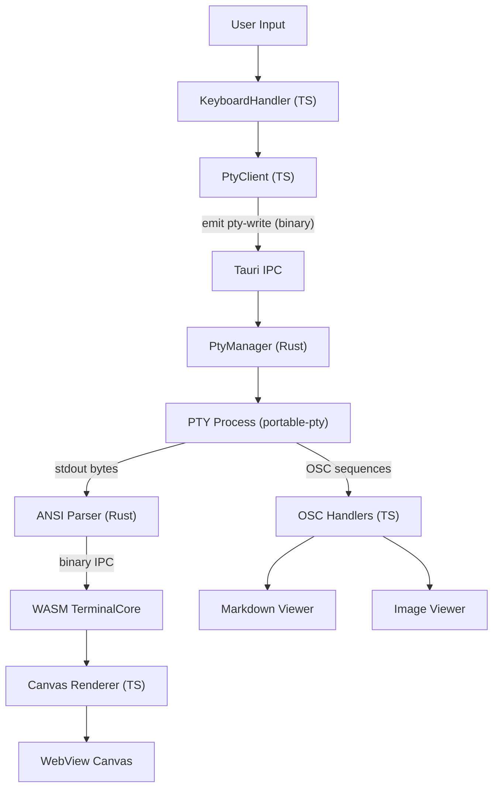
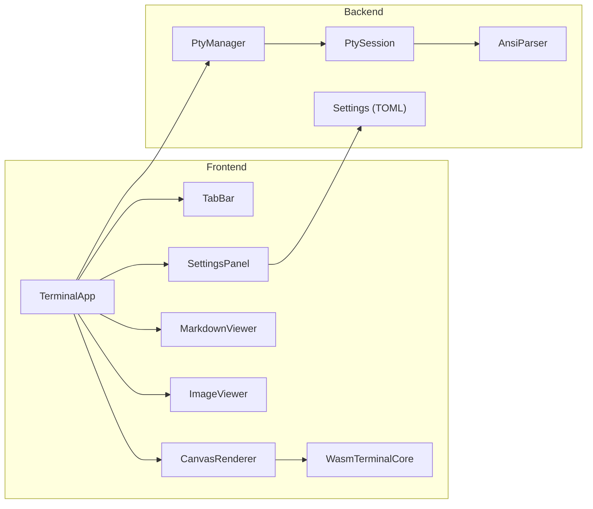

# eMterm Specification

## Overview

eMterm is a terminal emulator for Linux and Windows, built with Tauri (Rust + TypeScript). It provides full ANSI terminal emulation with rich content rendering capabilities, including inline Markdown display and inline image rendering (Kitty Graphics Protocol and SIXEL). The design prioritizes low-latency input performance and compatibility with AI coding tools such as Claude Code.

**Technology Stack:**
- Rust (Tauri backend) - PTY management, ANSI parsing, app logic
- Vanilla TypeScript (frontend) - Terminal UI, Canvas renderer, WebView content
- WebAssembly (Rust/wasm-bindgen) - High-performance terminal core (grid, state, parser)
- Bun - Package manager and bundler

## Architecture





## Features

### Category 1: Core Terminal Engine

#### PTY Connection

Multi-session PTY management using the `portable-pty` crate. Each terminal tab is backed by an isolated PTY session.

**Key Functionality:**
- `PtyManager` manages multiple `PtySession` instances keyed by session ID
- Each `PtySession` holds a PTY pair (reader + writer), child process handle, and window size
- PTY output is streamed from a Rust background thread via Tauri events
- Session lifecycle: create on new tab, destroy on tab close or shell exit
- Configurable shell path (default: system shell from `$SHELL`)
- Configurable initial working directory

**IPC Channels:**
- `pty-output` event: backend to frontend (raw bytes, binary payload)
- `pty-write` event: frontend to backend (key input bytes, fire-and-forget)
- `pty_resize` command: frontend to backend (cols, rows)
- `pty_create` / `pty_close` commands: session lifecycle

---

#### ANSI Parser

Full-featured VT100/VT220/xterm ANSI escape sequence parser implemented in Rust.

**Supported Sequences:**
- C0 control codes: BEL, BS, HT, LF, VT, FF, CR, SI, SO
- C1 sequences: ESC, CSI, OSC, DCS, APC, PM
- CSI sequences: cursor movement (CUU/CUD/CUF/CUB/CUP/HVP), erase (ED/EL), insert/delete (ICH/DCH/IL/DL), scroll (SU/SD), SGR attributes, DECSTBM, DECSET/DECRST (private modes)
- OSC sequences: OSC 0/2 (window title), OSC 8 (hyperlinks), OSC 52 (clipboard), OSC 133 (semantic prompts), OSC 777 (eMterm extensions)
- DCS: SIXEL graphics data stream
- APC: Kitty Graphics Protocol
- SGR: 16-color, 256-color, 24-bit RGB, bold, italic, underline (single/double/curly/dashed/dotted), blink, reverse, invisible, strikethrough
- Mouse reporting: X10, normal, button-event, any-event tracking; SGR extended coordinates
- Bracketed paste mode (DECSET 2004)
- Application cursor keys (DECCKM), alternate screen (DECSET 47/1047/1049)

---

#### WASM Terminal Core

The terminal grid and state machine are implemented in Rust compiled to WebAssembly, running in the browser's main thread for maximum performance.

**Architecture:**
- `TerminalCore` (WASM struct): holds `TerminalState` + `AnsiParser`
- `TerminalState`: viewport grid in WASM linear memory
- Cell layout: 32 bytes per cell (`u32` codepoint + `u32` width + `PackedColor` fg/bg + attribute bitfield + underline color)
- `PackedColor`: 4-byte encoding supporting Default, Named16, Color256, and RGB variants

**WASM Optimizations:**
- Direct dispatch via function pointer array (eliminates match arms for handler routing)
- Fixed-size array slots for CSI/OSC/DCS parameter storage (eliminates Vec allocation per sequence)
- Overflow reverse index: pre-computed line mapping for wrap counting
- Differential scroll: only re-renders changed rows between frames
- `u32` overflow keys for CSI parameter caching (avoids HashMap allocation)
- Buffer pre-allocation for output rendering
- Optimized Cargo profile (LTO, opt-level=3, codegen-units=1)
- Binary IPC: WASM renders directly to a `SharedArrayBuffer` or transferable buffer; no JSON serialization

**Binary IPC Protocol:**
- ANSI parser output (render commands) transferred as binary ArrayBuffer
- Key input bytes transferred as binary via Tauri event (eliminates `Array.from(Uint8Array)` + JSON)

---

#### Unified Buffer

Terminal display memory is managed by `UnifiedBuffer`, a ring buffer that combines scrollback history and the active viewport into a single contiguous structure.

**Key Functionality:**
- Ring buffer with capacity = `scrollbackLines + rows`
- Viewport: last `rows` entries in the ring
- Scrollback: entries before the viewport
- Full-buffer reflow on resize: joins wrapped physical lines into logical lines, re-splits at new column width
- Cursor position tracking through reflow (logical line offset approach)
- Alternate screen buffer: no reflow on resize (lines resized in place)
- O(1) line access via index arithmetic
- O(1) scroll-up (ring head advances, no array shift)
- Eliminates clone-on-scroll-off (unified storage)

**Reflow Algorithm:**
1. Drain all lines from ring buffer to a flat array
2. Join consecutive wrapped physical lines into logical lines, tracking cursor position as logical offset
3. Re-split logical lines at new column width
4. Convert cursor logical offset back to physical (row, col)
5. Trim empty lines from bottom of viewport
6. Write reflowed lines back to ring buffer

---

#### Canvas Renderer

The terminal viewport is rendered to an HTML Canvas element using the Canvas 2D API.

**Key Functionality:**
- `ITerminalRenderer` interface implemented by `CanvasRenderer`
- Dirty-row tracking: only re-renders rows that changed since last frame
- `requestAnimationFrame`-driven render loop
- Renders glyphs from WASM grid data via binary transfer
- Supports: bold, italic, underline styles, strikethrough, cursor shapes (block/underline/bar)
- Wide character support (CJK, emoji)
- Selection highlight rendering
- Configurable font family (primary, secondary/CJK, emoji), font size, line height

---

#### Background Color Erase (BCE)

When erase operations create blank cells, those cells inherit the cursor's current SGR background color instead of always using the default background.

**Key Functionality:**
- Applies to: EL (Erase in Line), ED (Erase in Display), ECH (Erase Character), ICH/DCH (Insert/Delete Character), scroll operations, IL/DL (Insert/Delete Line)
- BCE is always enabled (no DECBKM mode toggle)
- Ensures applications that set a custom background color before erasing display correctly

---

#### DECTCEM Cursor Visibility Sync

Cursor visibility toggles correctly in response to DECTCEM escape sequences from TUI applications.

**Key Functionality:**
- CSI ?25l hides the cursor
- CSI ?25h shows the cursor
- WASM-side mode changes are synchronized to the TypeScript rendering layer after each PTY data chunk

---

### Category 2: Rich Content Display

#### Markdown Rendering

Inline Markdown rendering via a custom OSC 777 extension protocol. Content is displayed in a styled WebView overlay within the terminal viewport.

**Key Functionality:**
- CommonMark and GitHub Flavored Markdown (GFM) format support
- Syntax highlighting via highlight.js (180+ languages)
- Mermaid diagram rendering (flowcharts, sequence diagrams, Gantt, etc.)
- XSS protection via DOMPurify sanitization
- Theme synchronization (dark/light mode follows terminal theme)
- Virtual scrolling for large documents
- Session-based transfer: `begin` / `chunk` / `end` verbs via OSC 777
- No artificial size limit: arbitrarily large documents are supported
- Session timeout resets on each chunk receipt to support slow or large transfers

**Protocol:**
```
ESC ] 777 ; emterm ; markdown ; <verb> ; <params...> ST
```
- `begin`: Start session (`id=<uuid>`, `format=commonmark|gfm`)
- `chunk`: Send Base64-encoded content (`id=<uuid>`, `seq=<n>`, `data=<base64>`)
- `end`: Complete and render (`id=<uuid>`)

**Transfer Parameters:**
| Parameter | Value |
|-----------|-------|
| Chunk size | 128 KB (Base64-encoded) |
| WASM OSC buffer limit | 16 MB per sequence |
| Session timeout | 30 seconds (reset on each chunk) |
| Maximum concurrent sessions | 10 |

---

#### Markdown Fullscreen Viewer

A fullscreen overlay viewer for rendered Markdown content, rendering within the terminal content area so the tab bar remains accessible.

**Key Functionality:**
- Opens over the terminal content area (tab bar stays visible)
- Keyboard navigation: arrow keys, Page Up/Down, Home/End, Space/Shift+Space for scrolling
- Zoom control: Ctrl+= / Ctrl+- / Ctrl+0 to adjust font size (font-size based, not transform scale)
- ESC or click outside to close
- Smooth scroll animation
- Outline (table of contents) panel on the left when viewport width is 1200px or wider
- Outline lists h1-h3 headings in a tree structure with indentation; clicking a heading scrolls to it
- Currently visible heading is highlighted in the outline (IntersectionObserver-based)
- Outline panel is hidden when no h1-h3 headings exist in the document

**Keyboard Shortcuts:**
| Key | Action |
|-----|--------|
| `Escape` | Close viewer |
| `Arrow Up / Down` | Scroll |
| `Page Up / Down` | Scroll by page |
| `Space` | Scroll down ~85% of viewport |
| `Shift+Space` | Scroll up ~85% of viewport |
| `Home / End` | Jump to top/bottom |
| `Ctrl+=` / `Ctrl+-` | Zoom in/out |
| `Ctrl+0` | Reset zoom |

---

#### Mermaid Diagram Rendering

Mermaid code blocks in Markdown documents render as SVG diagrams with an interactive toolbar.

**Key Functionality:**
- Detects `mermaid` fenced code blocks and renders them as SVG using mermaid.js
- All Mermaid diagram types are supported (flowchart, sequence, Gantt, class, etc.)
- Dark theme applied via `themeVariables` for correct colors in the dark viewer
- On syntax error, the original source is shown as a regular code block
- mermaid.js is loaded only when mermaid blocks are present (lazy loading)
- Security: mermaid.js `securityLevel` set to `strict`; user-authored SVG in Markdown remains blocked by DOMPurify
- Chart/Code toggle toolbar: switch between rendered SVG diagram and original source code view
- Copy button copies the Mermaid source code to clipboard (available in both diagram and code views)

---

#### Markdown Color Themes

Eight color palettes for the Markdown viewer, with an additional pink (sakura) theme.

**Palettes:**
- Dark themes: Default Dark, Solarized Dark, GitHub Dark, Dracula, Pink Dark
- Light themes: Default Light, Solarized Light, GitHub Light, One Light, Pink Light
- Configurable in Settings under Markdown Viewer

---

#### Markdown Viewer Font Settings

Configurable fonts for the Markdown viewer, independent of terminal fonts.

**Settings:**
- Body font family (system font picker)
- Code block font family (system font picker)
- Base font size (pt)

---

#### Image Display

Inline image rendering supporting two standard protocols.

**Supported Protocols:**
- **Kitty Graphics Protocol** (APC `G` command): PNG, JPEG, GIF via base64-encoded APC sequences; supports `image_id` for image management and correlated display
- **SIXEL** (DCS): Color palette-based pixel graphics via DCS data stream
  - **Limitation:** Third-party SIXEL tools (e.g., `img2sixel`) do not work inside tmux. tmux consumes raw DCS sequences before they reach the outer terminal. Use `emterm image` or Kitty Graphics Protocol tools inside tmux.

**Key Functionality:**
- Images rendered in-place within the terminal text flow
- Kitty `image_id` used to correlate upload and display commands
- SIXEL palette: up to 256 colors per image
- Images stored in memory for the session duration
- Images scroll with terminal content

**Kitty Protocol Compatibility:**
- Kitty query responses (`a=q`) are synchronous, delivered in the same PTY data processing pass
- XTWINOPS device responses: CSI 14t (text area pixel size), CSI 16t (cell size), CSI 18t (text area in characters)
- Cell size is synchronized to WASM on init, resize, and alternate buffer switch
- External tools using ratatui-image, crossterm capability detection, and kitten icat work correctly
- Animation frame commands (`a=f`, `a=a`) are handled by the image pipeline

---

#### Image Fullscreen Viewer

A fullscreen overlay for viewing terminal images at full resolution, rendering within the terminal content area so the tab bar remains accessible.

**Key Functionality:**
- Two display modes: **Pixel Perfect** (1:1 pixel mapping, 100% = actual image size) and **Fit to Window** (scaled to viewport)
- Toggle between modes with `f` key
- Pan support: mouse drag (PanController) and mouse wheel scroll
- Wheel scroll: vertical pan; Shift+wheel: horizontal pan
- Pan is bounded to the image overflow area
- Close with `Escape`

**Keyboard Shortcuts:**
| Key | Action |
|-----|--------|
| `f` | Toggle Pixel/Fit mode |
| `Escape` | Close viewer |
| `Space` | Scroll down ~85% of viewport |
| `Shift+Space` | Scroll up ~85% of viewport |

**Mouse:**
| Action | Behavior |
|--------|----------|
| Drag | Pan image (pixel mode) |
| Wheel scroll | Vertical pan |
| Shift+wheel | Horizontal pan |

---

#### CLI Display Commands

Helper CLI subcommands to output OSC control sequences for Markdown and image display.

**Commands:**
```bash
emterm markdown <file.md>    # Output OSC 777 sequences to display Markdown
emterm image <image>         # Output APC/DCS sequences to display image
```

These commands work over SSH because they write control sequences to stdout, which the terminal emulator receives and processes.

---

### Category 3: Multi-Tab Management

#### Tab Bar

A horizontal tab bar for managing multiple terminal sessions.

**Key Functionality:**
- Create new tabs (Ctrl+Shift+T or new tab button)
- Close tabs (Ctrl+Shift+W or close button)
- Switch tabs (Ctrl+Tab / Ctrl+Shift+Tab, or click)
- Drag-and-drop tab reordering
- Each tab has an independent PTY session and terminal state
- Tab titles updated dynamically via OSC 0/2

---

#### Toggle Tab Bar

The tab bar visibility can be toggled to maximize terminal space.

**Key Functionality:**
- Toggle with `Ctrl+Shift+B`
- Animated slide in/out (CSS transition)
- State persisted in settings

---

#### Dynamic Tab Title

Tab titles update dynamically based on OSC window title sequences from the running shell or application.

**Supported Sequences:**
- OSC 0: Set icon name and window title
- OSC 2: Set window title only

---

#### Shell Exit Behavior

Configurable behavior when the shell process exits.

**Options:**
- Close the tab when the shell exits
- Auto-close the application when the last tab closes

---

#### Activity Notifications

Notification system for terminal activity in background tabs.

**Key Functionality:**
- Dot indicator on inactive tabs with new output
- OS desktop notifications (configurable)
- Notification on bell character (BEL) or any output activity
- Click on OS notification to focus the tab
- Throttling to prevent notification spam during high-frequency output

---

#### Right-Click Context Menu

Native context menus for terminal area, tab elements, and tab bar empty space, using Tauri v2 native Menu API.

**Menu Areas:**
- **Terminal viewport**: Copy (if selection), Paste, Open URL (if URL at cursor), Copy URL
- **Tab**: Close tab
- **Tab bar empty space**: New tab, Open profile (if profiles defined)

**Key Functionality:**
- Menu items have dynamic enable/disable states based on current context (selection, URL presence, profile availability)
- OS-standard appearance via Tauri native menus
- Fully localized (English and Japanese)

---

### Category 4: Input and IME

#### Key Input Performance

Key input is optimized for high-throughput key repeat, comparable to WezTerm and Alacritty.

**Key Functionality:**
- Frontend-to-backend write path uses Tauri `emit` (event-based IPC) instead of `invoke` (request-response)
- True fire-and-forget: no response round-trip overhead
- Binary payload: `Uint8Array` transferred directly without `Array.from()` conversion or JSON serialization
- Reduced lock contention in the Rust PTY write handler
- Single-key latency is not degraded

**Input Pipeline:**
```
keydown event
  → keyEventToBytes() [keyboard.ts]
  → emit("pty-write", { sessionId, data: Uint8Array }) [client.ts]
  → binary IPC (no JSON, no response)
  → pty-write event handler [lib.rs]
  → direct PTY write (minimal locking)
  → PTY process receives input
```

---

#### IME Input Support

Japanese and other CJK input via Input Method Editor (IME) is fully supported.

**Key Functionality:**
- **Primary mode (Chromium/Linux):** `EditContext` API — IME composition events are intercepted at the browser level before `keydown`, preventing double input
- **Fallback mode (WebKit):** Hidden `<textarea>` element receives IME events; composition is forwarded to the terminal on commit
- Composition, conversion (candidate selection), and commit all work correctly
- IME mode does not interfere with direct key input
- SKK (fcitx5-skk) input works correctly; SKK marker detection (`▽/▼`) is handled via standard composition events only

---

#### IME Position Auto-Adjustment

When the terminal cursor is hidden (as in TUI applications like Claude Code), the IME input area is automatically repositioned to the bottom-left of the terminal.

**Key Functionality:**
- Auto-detects TUI application mode via cursor visibility (`cursorVisible === false`)
- Positions IME candidate window at bottom-left when cursor is hidden
- Reverts to cursor-following behavior when cursor is visible
- No user configuration required

---

#### IME Clipboard Shortcuts

`Ctrl+Shift+C` (copy) and `Ctrl+Shift+V` (paste) are captured in the capture phase to work correctly even when IME is active.

**Key Functionality:**
- Event listeners registered at `capture` phase on the document
- Clipboard copy: copies current terminal selection to system clipboard
- Clipboard paste: reads system clipboard and writes to PTY
- Large paste content is chunked to avoid buffer overflow

---

#### Special Key Handling

Comprehensive terminal key sequence mapping for all standard terminal keys.

**Key Functionality:**
- Ctrl+symbol control characters: `Ctrl+[`, `Ctrl+]`, `Ctrl+\`, `Ctrl+Space`, etc.
- xterm-style modifier parameter sequences for modified special keys (Ctrl/Shift/Alt + Arrow/Home/End/F-keys)
- WebKitGTK compatibility for Tauri on Linux
- Shift+Tab sends back-tab sequence
- Ctrl+J blocking configurable via settings

---

#### Word Selection Drag

Double-click selects a word; continuing to hold and drag extends the selection word-by-word.

**Key Functionality:**
- Double-click selects the word under the cursor
- Holding the mouse button after double-click and dragging extends selection by whole words
- Selection updates in real time during drag

---

#### Middle-Click Paste

Middle mouse button (wheel click) pastes clipboard contents into the terminal.

**Key Functionality:**
- Middle-click in the terminal area reads from the system clipboard and pastes
- Single-line text is pasted immediately; multi-line text shows the existing confirmation dialog
- Text is sent via the existing chunked paste mechanism (identical to Ctrl+Shift+V)
- Middle-click paste takes priority over PTY mouse tracking mode
- `middle_click_paste` boolean setting (default: `true`) enables or disables the feature

---

#### Shift+Enter as Alt+Enter

`Shift+Enter` can be remapped to send the same escape sequence as `Alt+Enter` (ESC + CR: `0x1b 0x0d`).

**Key Functionality:**
- `shift_enter_as_alt_enter` setting (default: `true`)
- When enabled, Shift+Enter (without Ctrl or Alt) sends `[0x1b, 0x0d]`
- When disabled, Shift+Enter sends `[0x0d]` (CR) as normal
- The remapping does not apply when Ctrl is held (Ctrl+Shift+Enter is unaffected)
- `Alt+Enter` always sends `[0x1b, 0x0d]` regardless of the setting
- Additional mappings: Shift+Backspace sends `[0x7f]` (DEL); Shift+Escape sends `[0x1b]`

---

### Category 5: Navigation

#### Semantic Scroll and Search

OSC 133 Semantic Prompt zones enable structured navigation between command prompts.

**Key Functionality:**
- OSC 133 marks: `A` (prompt start), `B` (command start), `C` (output start), `D` (output end)
- Prompt jump: `Ctrl+Up` / `Ctrl+Down` to jump between prompt zones
- Text search: incremental search with match highlighting
- Search: `Ctrl+F` to open, `Enter`/`Shift+Enter` to navigate matches, `Escape` to close
- `SemanticZoneTracker` maintains zone index; adjusts on scrollback eviction

---

#### Output Folding

Command output blocks can be collapsed and expanded.

**Key Functionality:**
- Fold regions defined by OSC 133 `C`→`D` pairs (standard) or custom OSC 777 `fold` verb
- Collapsed block shows a single summary line with expand indicator
- `FoldManager` tracks fold state and visible line mapping
- Keyboard shortcut to toggle fold at cursor position
- Custom fold regions can be explicitly annotated via OSC 777

---

#### File Path Click-to-Open

File paths detected in terminal output can be opened in an editor via `Ctrl+click`.

**Key Functionality:**
- Regex-based file path detection in rendered text (supports `path:line:col` format)
- Underline appears only on hover (not always visible)
- `Ctrl+click` opens the file in the configured editor command
- Configurable editor command (e.g., `code`, `vim`, `hx`)
- Supports absolute and relative paths; relative paths resolved against shell CWD (via OSC 7)

---

#### URL Click-to-Open

URLs detected in terminal output open in the system browser via `Ctrl+click`.

**Key Functionality:**
- URL detection via regex pattern matching
- Underline appears only on hover (not always visible)
- Each character's actual foreground color is used for the underline
- `Ctrl+click` opens URL in default browser
- OSC 8 hyperlink sequences are also supported (explicit hyperlink markup)

---

### Category 6: Settings and Appearance

#### Settings Panel

A full settings panel with multiple categories and a collapsible navigation rail.

**Categories:**
1. **UI Settings** - Theme, color presets, UI font, tab bar, window behavior
2. **Keybinds** - All configurable keyboard shortcuts
3. **Terminal Appearance** - Font, colors, cursor, scrollbar, padding, opacity, line height
4. **Terminal Behavior** - Shell, scrollback, scroll speed, bell, URL detection, copy-on-select, middle-click paste, Shift+Enter behavior
5. **Notifications** - Desktop notifications and tab activity indicators
6. **Markdown Viewer** - Body font, code font, font size, color theme
7. **Profiles** - Named shell configurations for tab creation

**Key Functionality:**
- Material Design 3 list-detail layout (category nav on left, settings on right)
- Collapsible navigation: hamburger toggle shrinks nav column to an 80px icon-only rail; clicking an icon in collapsed state switches category without expanding
- SVG icons on each category navigation item (24px, Material Design 3 style)
- Description texts for each setting item (MD3 supporting text pattern)
- All settings persisted to TOML configuration file
- Live preview for most appearance settings
- Validation with localized error messages

---

#### UI Theme

Dark/light/system theme toggle with color accent presets.

**Key Functionality:**
- Theme modes: Dark, Light, System (follows OS preference)
- Accent color presets: Purple, Blue, Green, Orange, Pink (Sakura)
- Each preset has dark and light variants
- Theme applied via CSS custom properties

---

#### Terminal Color Schemes

Terminal foreground/background/ANSI palette colors are configurable.

**Built-in Presets:**
- eMterm (default)
- Solarized Dark / Solarized Light
- Monokai
- Dracula
- Nord

**User-Customizable:**
- Inline color editor in the Settings panel
- Edit all 16 ANSI colors plus foreground, background, cursor
- Color picker with hex input
- Horizontal palette layout (special colors row, ANSI 0-7 row, ANSI 8-15 row)
- Custom schemes saved alongside preset selection

**ANSI Color Resolution:**
- Indexed colors (SGR 30-37, 40-47, 90-97, 100-107) resolve against the active color scheme palette
- Bold attribute + standard foreground color (0-7) automatically uses the bright variant (8-15)
- Bold-brightens behavior is configurable (default: ON)

---

#### Font Settings

Three-field font configuration to handle multi-script text correctly.

**Fields:**
- **Primary font**: Latin characters and general use (default: `monospace`)
- **Secondary font**: CJK and other fallback scripts (default: `sans-serif`)
- **Emoji font**: Emoji rendering (default: system emoji font)

**Font Picker:**
- System font enumeration via `font-kit` crate
- Search and preview in the picker UI
- Fonts categorized by type (monospace, sans-serif, etc.)
- Clear button to reset to default generic font family

**Font Change Behavior:**
- Terminal dimensions (cols/rows) are recalculated and PTY is notified when font settings change

---

#### UI Font

A separate font family setting for the application UI (settings panel and other UI elements).

**Key Functionality:**
- Configurable in UI Settings category
- Applied via `--ui-font-family` CSS custom property on `.settings-panel`
- Independent from terminal fonts

---

#### Unicode and Emoji Rendering

**Ambiguous Width Characters (EAW=A):**
- All EAW=A characters occupy exactly 1 grid cell (matching `wcwidth()` behavior of TUI apps)
- Canvas `measureText()` at render time shrinks oversized glyphs to fit within a single cell
- No `ambiguous_width` setting (removed for TUI compatibility)

**Emoji Text Presentation:**
- Extended_Pictographic characters with `Emoji_Presentation=No` and no variation selector are forced to render in text presentation (monochrome)
- Prevents unintended color emoji rendering for symbols like `✳ ☀ © ® ™`

---

#### Additional Appearance Settings

**Cursor:**
- Shapes: Block, Underline, Bar
- Blink enable/disable

**Scrollbar:**
- Visible, hidden, or auto-hide

**Opacity:**
- Terminal background opacity (0–100%)

**Padding:**
- Terminal area has zero padding by default (full-size display)

**Line Height:**
- Configurable line height multiplier

**Window:**
- Configurable startup window state (maximized by default)

---

#### Keybinds

All keyboard shortcuts are configurable in the Settings panel.

**Default Keybinds:**
| Action | Default |
|--------|---------|
| New tab | `Ctrl+Shift+T` |
| Close tab | `Ctrl+Shift+W` |
| Next tab | `Ctrl+Tab` |
| Previous tab | `Ctrl+Shift+Tab` |
| Copy | `Ctrl+Shift+C` |
| Paste | `Ctrl+Shift+V` |
| Toggle tab bar | `Ctrl+Shift+B` |
| Jump to previous prompt | `Ctrl+Up` |
| Jump to next prompt | `Ctrl+Down` |
| Search | `Ctrl+F` |

---

### Category 7: Terminal Profiles and SSH

#### Terminal Profiles

Named shell configurations that can be selected when creating new tabs.

**Key Functionality:**
- Each profile defines: name, shell path, shell arguments, environment variables (KEY=VALUE per line), working directory, and default flag
- CRUD operations: create, edit, delete, duplicate profiles
- Drag-and-drop reordering in the settings UI
- Exactly one profile can be marked as default at a time
- Profile selector modal with keyboard navigation (arrow keys, Enter, Escape)
- Launch button per profile in the settings UI opens a new tab with that profile
- Configurable keybind to open the profile selector modal

**Profile Editor - SHELL/SSH Tab Switcher:**
- SHELL tab: configure local shell (path, args, env vars, working directory)
- SSH tab: select an SSH connection entry (mutually exclusive with SHELL settings)
- SSH tab is disabled when no SSH connections are registered

**Tab Creation Logic:**
- No profiles defined: creates tab using global shell settings (existing behavior)
- Default profile set: `+` button and `Ctrl+Shift+T` use the default profile
- No default set but profiles exist: `+` button shows the profile selector modal
- Profile-specific `shell_path`, `shell_args`, `env_vars`, and `working_directory` are passed to the PTY for that session
- Empty `shell_path` in a profile uses the system default shell

**Backward Compatibility:**
- Existing settings files without the `profiles` field load without error
- Global `shell_path` and `shell_args` settings remain available and are used when no profiles are defined

---

#### SSH Connection Management

SSH connections can be managed within eMterm and associated with terminal profiles.

**Key Functionality:**
- Auto-detect openssh command path on application startup from system PATH
- Parse `~/.ssh/config` to display available hosts as a read-only list
- CRUD operations for eMterm-managed SSH connection entries (host, port, user, identity file, extra args)
- SSH connections associated with profiles via the profile editor SSH tab
- SSH sessions launch as PTY sessions using the configured `ssh` command

---

### Category 8: Performance and Architecture

#### WASM Optimization

The WASM terminal core is optimized across nine areas for minimal allocation and maximum throughput.

**Optimization Areas:**
1. **Direct dispatch**: Function pointer array for handler routing (eliminates match arm overhead)
2. **Fixed-size parameter arrays**: Replaces `Vec` allocation per CSI/OSC/DCS sequence
3. **Overflow reverse index**: Pre-computed line mapping for wrap counting
4. **Differential scroll rendering**: Only re-renders changed rows
5. **u32 overflow keys**: Avoids HashMap allocation for CSI parameter caching
6. **Underline fields**: Dedicated struct fields instead of dynamic attributes
7. **Cargo profile**: LTO, `opt-level=3`, `codegen-units=1`
8. **Binary IPC**: Render output transferred as binary ArrayBuffer (zero JSON)
9. **Buffer pre-allocation**: Output buffers allocated once, reused per frame

---

#### Zero-Copy Rendering

The WASM to TypeScript rendering path uses batch binary parsing to eliminate per-cell WASM boundary crossings.

**Key Functionality:**
- Per-cell WASM calls replaced with batch binary parsing (1 call per row instead of cols×4+)
- No JS intermediate object allocation (Cell, Line, CellAttributes) in the hot path
- `WasmLineProxy.dirty` is a true view of the WASM core dirty bitset
- Unique Kitty `image_id` generated for reliable response correlation

---

#### UnifiedBuffer Performance

Targeted optimizations for the UnifiedBuffer implementation.

**Optimizations:**
- Renderer accesses scrollback lines via `getScrollbackLine(index)` (no full-scrollback clone)
- `adjustRowCount()` recalculates capacity correctly on row-only resize
- Cell assignment during reflow uses direct assignment (drain invalidates source; no clone needed)
- `Line.isEmpty()` avoids string allocation for empty-line detection

---

#### Handler-Based Architecture

The terminal state machine is refactored into a handler-based architecture.

**Key Functionality:**
- `TerminalStateAccessor` trait provides a clean interface for handler access
- Handlers organized in `handlers/` directory: `print_handler`, `c0_handlers`, `csi_handlers`, `esc_handlers`
- Each handler is a pure function taking `&mut dyn TerminalStateAccessor` and sequence parameters
- Reduces coupling between parser and state; enables independent testing of each handler

---

#### CLI-Only Build

The CLI commands (`emterm image`, `emterm markdown`) can be built without GUI dependencies for headless server deployment.

**Key Functionality:**
- `gui` Cargo feature flag controls GUI dependencies (Tauri, WebView, etc.)
- `--no-default-features` produces a lightweight CLI binary without any GUI libraries
- Enables building on servers without `gdk-sys`, `libwebkit2gtk`, etc.
- `EMTERM_CLI_ONLY=1 make dpkg` workflow for CLI-only package generation

---

### Category 9: Internationalization

#### English and Japanese Support

Full internationalization for the application UI.

**Key Functionality:**
- Backend (Rust): `rust-i18n` crate with locale files at `src-tauri/locales/{en,ja}.json`
- Frontend (TypeScript): Custom i18n module with locale files at `src/i18n/locales/{en,ja}.json`
- Language follows OS locale (auto-detect) or explicit setting
- All UI strings, settings labels, error messages, and validation text are localized

---

#### Unicode and Emoji Width

Correct character width calculation for Unicode 17.0 and Emoji 17.0.

**Key Functionality:**
- East Asian Width property for CJK wide characters
- ZWJ (Zero Width Joiner) sequence support for multi-codepoint emoji
- Emoji 17.0 character table
- Width calculated in WASM for performance

---

## Configuration

Configuration is stored in a TOML file at the platform-specific app data directory:
- Linux: `~/.config/emterm/config.toml`
- Windows: `%APPDATA%\emterm\config.toml`

**Configuration Sections:**

```toml
[appearance]
theme = "dark"            # "dark" | "light" | "system"
color_preset = "purple"   # "purple" | "blue" | "green" | "orange" | "pink"
font_primary = ""         # empty = monospace generic
font_secondary = ""       # empty = sans-serif generic
font_emoji = ""           # empty = system emoji font
font_size = 13            # pt
line_height = 1.2
opacity = 100             # 0-100%
cursor_shape = "block"    # "block" | "underline" | "bar"
cursor_blink = true
scrollbar = "auto"        # "visible" | "hidden" | "auto"
ui_font_family = ""       # font used in settings panel and UI elements

[terminal]
shell = ""                # empty = system default
scrollback_lines = 10000
scroll_speed = 3
bell = true
url_detection = true
copy_on_select = false
color_scheme = "emterm"   # "emterm" | "solarized-dark" | ... | "custom"
middle_click_paste = true
shift_enter_as_alt_enter = true
bold_brightens_ansi_colors = true

[notifications]
notification_enabled = true
tab_activity_indicator = true
notify_on_process_exit = true
notify_on_output = false
notify_on_bell = true

[tab_bar]
visible = true

[window]
start_maximized = true

[markdown_viewer]
body_font = ""
code_font = ""
font_size = 16
color_theme = "default-dark"

[keybinds]
new_tab = "Ctrl+Shift+T"
close_tab = "Ctrl+Shift+W"
# ... additional keybinds

[[profiles]]
name = "Default Shell"
shell_path = ""
shell_args = []
env_vars = ""
working_directory = ""
is_default = true

[ssh]
ssh_command_path = ""     # auto-detected from PATH on startup

[[ssh_connections]]
name = "my-server"
host = "example.com"
port = 22
user = "username"
identity_file = ""
extra_args = ""
```

## Dependencies

### Rust Crates
| Crate | Purpose |
|-------|---------|
| `tauri` | Desktop app framework |
| `portable-pty` | Cross-platform PTY |
| `wasm-bindgen` | Rust/WASM bindings |
| `font-kit` | System font enumeration |
| `rust-i18n` | Backend internationalization |
| `serde` / `serde_json` | Serialization |
| `base64` | Base64 encoding for image/markdown transfer |
| `log` | Logging |
| `tauri-plugin-notification` | OS native desktop notifications |

### TypeScript/npm
| Package | Purpose |
|---------|---------|
| `@tauri-apps/api` | Tauri frontend API |
| `@tauri-apps/plugin-notification` | Desktop notification frontend API |
| `marked` | Markdown parsing |
| `highlight.js` | Syntax highlighting |
| `mermaid` | Diagram rendering (lazy loaded) |
| `dompurify` | XSS sanitization |

## Technical Notes

### OSC 777 Extension Protocol

eMterm uses OSC 777 as its custom extension namespace:

```
ESC ] 777 ; emterm ; <subsystem> ; <verb> ; <params...> ST
```

Subsystems:
- `markdown` - Markdown display session
- `fold` - Output folding annotation

### Binary IPC

Key input and ANSI render output use binary IPC to eliminate JSON serialization overhead:

- **Key input**: Tauri `emit("pty-write", payload)` where payload contains a binary `Uint8Array`
- **Render output**: WASM writes render commands to a transferable buffer; TypeScript reads and applies to Canvas

### WASM Integration

The WASM module is built with `wasm-pack` and integrated via Bun bundler. In development mode, the `.wasm` file is served as a static asset. In production, it is bundled with the application.

### Testing

- TypeScript tests: `bun test` (unit tests for terminal emulator core, buffer, handlers)
- Rust tests: `cargo test` (unit tests for ANSI parser, PTY manager)
- Type checking: `bun run typecheck`
- E2E tests: via `tauri-driver` / WebdriverIO in Docker environment
