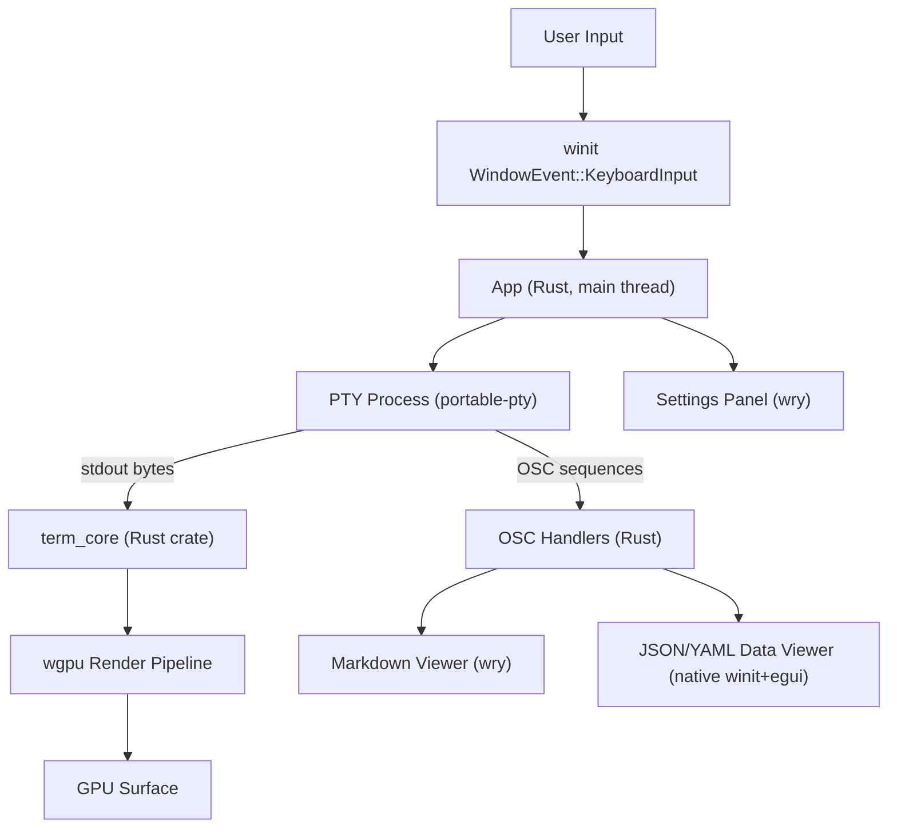
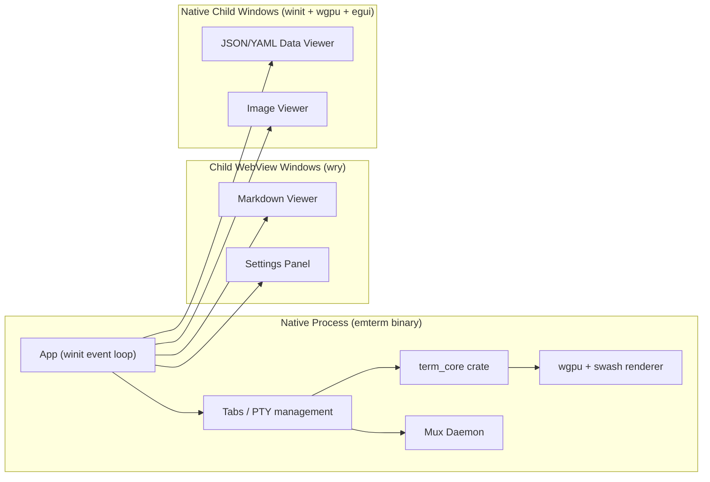

# eMterm Specification

## Overview

eMterm is a terminal emulator for Linux and Windows. The terminal window is built with winit (event loop and IME), wgpu (GPU surface), and swash + zeno + fontdb (font rasterization). Child WebView windows (Markdown viewer, HTML viewer, settings panel) use wry (WebKitGTK on Linux, WebView2 on Windows). The JSON/YAML data viewer and the image viewer are separate native child windows built on the same winit + wgpu + egui stack as the main terminal, not WebView. The design prioritizes low-latency input performance and compatibility with AI coding tools such as Claude Code.

**Technology Stack:**
- Rust — native terminal stack: winit (event loop, IME), wgpu (GPU surface), egui (in-process UI, also used to render the JSON/YAML data viewer and image viewer child windows), swash + zeno + fontdb (font rasterization), portable-pty (PTY abstraction)
- Rust + wry — child WebView windows (Markdown viewer, HTML viewer, settings panel). Linux uses GTK + WebKitGTK, Windows uses WebView2
- TypeScript (vanilla, no framework) — child WebView frontends (`src-tauri/{viewer,settings}/web/`) and the shared web modules they import from (`src-tauri/web-shared/`)
- Bun — TypeScript bundler / test runner / package manager for the child WebView bundles only

## Architecture





## Features

### Category 1: Core Terminal Engine

#### PTY Connection

Multi-session PTY management using the `portable-pty` crate. Each terminal tab is backed by an isolated PTY session.

**Key Functionality:**
- PTY sessions managed in `tabs.rs`; each `Tab` holds a `TerminalCore` and PTY pair
- PTY output is streamed from a Rust background thread, fed directly to `term_core` on the main event loop
- Session lifecycle: create on new tab, destroy on tab close or shell exit
- Configurable shell path (default: system shell from `$SHELL`)
- Configurable initial working directory

---

#### ANSI Parser and term_core

Full-featured VT100/VT220/xterm ANSI escape sequence parser implemented as a pure Rust crate (`crates/term_core`).

**Supported Sequences:**
- C0 control codes: BEL, BS, HT, LF, VT, FF, CR, SI, SO
- C1 sequences: ESC, CSI, OSC, DCS, APC, PM
- CSI sequences: cursor movement (CUU/CUD/CUF/CUB/CUP/HVP), erase (ED/EL), insert/delete (ICH/DCH/IL/DL), scroll (SU/SD), SGR attributes, DECSTBM, DECSET/DECRST (private modes)
- OSC sequences: OSC 0/2 (window title), OSC 8 (hyperlinks), OSC 52 (clipboard), OSC 133 (semantic prompts), OSC 777 (eMterm extensions)
- DCS: SIXEL graphics data stream
- APC: Kitty Graphics Protocol
- SGR: 16-color, 256-color, 24-bit RGB, bold, italic, underline (single/double/curly/dashed/dotted), blink, reverse, invisible, strikethrough
- Mouse reporting: X10, normal, button-event, any-event tracking; SGR extended coordinates
- Bracketed paste mode (DECSET 2004)
- Application cursor keys (DECCKM), alternate screen (DECSET 47/1047/1049)
- Device attributes: DA1 (`CSI c`) and DA2 (`CSI > c`) report a VT500 conformance level, reflecting implemented capabilities (132-column mode, Sixel graphics, ANSI color)

**Handler Architecture:**
- `TerminalStateAccessor` trait provides a clean interface for handler access
- Handlers organized in `handlers/` directory: `print_handler`, `c0_handlers`, `csi_handlers`, `esc_handlers`
- Each handler is a pure function taking `&mut dyn TerminalStateAccessor` and sequence parameters

---

#### wgpu Render Pipeline

The terminal viewport is rendered via a wgpu GPU surface driven by the winit event loop.

**Key Functionality:**
- Dirty-row tracking: only re-renders rows that changed since last frame
- winit event loop drives render frames
- swash + zeno + fontdb for font rasterization and glyph atlas management
- Supports: bold, italic, underline styles, strikethrough, cursor shapes (block/underline/bar)
- Wide character support (CJK, emoji)
- Selection highlight rendering
- Configurable font family (primary, CJK/secondary, emoji), font size, line height
- Bundled fonts: Noto Sans CJK JP, Noto Color Emoji (COLRv1), Noto Emoji (monochrome), Inconsolata, Noto Sans Symbols 2 (covers prompt arrows, media control glyphs, and braille spinners used in chrome surfaces)

---

#### COLRv1 Vector Emoji Rendering

Color emoji glyphs are rasterized via a vector-direct COLRv1 paint-graph path (`skrifa` + `tiny-skia`) instead of the previous CBDT bitmap-strike path, eliminating bitmap-downscale blur at fractional DPI scales.

**Key Functionality:**
- Bundled color emoji font is `Noto-COLRv1.ttf` (COLRv1 + glyf), replacing the previous `NotoColorEmoji.ttf` (CBDT bitmap)
- Fonts with a COLR table version 1 are routed through the new `colrv1_painter` module; other fonts (CJK, Latin, Symbols, monochrome emoji) continue through the existing swash path unchanged
- Rasterized emoji are sized to the base text font's cell height (ascent + descent) with 1px padding and bbox-aware uniform scaling, so glyphs align with surrounding text
- Glyphs the COLRv1 path cannot resolve fall back to the monochrome `NotoEmoji-Regular` font via the existing fallback chain
- Reduces bundled font size by approximately 5 MiB relative to the CBDT bitmap font

---

#### Unified Buffer

Terminal display memory is managed by `UnifiedBuffer`, a ring buffer that combines scrollback history and the active viewport into a single contiguous structure.

**Key Functionality:**
- Ring buffer with capacity = `scrollbackLines + rows`
- Viewport: last `rows` entries in the ring
- Scrollback: entries before the viewport
- Full-buffer reflow on resize: joins wrapped physical lines into logical lines, re-splits at new column width
- Cursor position tracking through reflow (logical line offset approach)
- Alternate screen buffer: no reflow on resize (lines resized in place)
- O(1) line access via index arithmetic
- O(1) scroll-up (ring head advances, no array shift)

**Reflow Algorithm:**
1. Drain all lines from ring buffer to a flat array
2. Join consecutive wrapped physical lines into logical lines, tracking cursor position as logical offset
3. Re-split logical lines at new column width
4. Convert cursor logical offset back to physical (row, col)
5. Trim empty lines from bottom of viewport
6. Write reflowed lines back to ring buffer

---

#### SlimCell Scrollback Compression

Per-cell memory footprint in the scrollback region is reduced by storing evicted cells as `SlimCell` (8 bytes) instead of the full `Cell` struct (34 bytes). The active viewport continues to use `Cell` for maximum render performance; only cells that slide off the viewport into scrollback are compressed.

**Key Functionality:**
- `SlimCell` struct: 8 bytes (`char_ref: u32`, `width: u8`, `flags: u8`, `style_id: u16`)
- `StyleTable`: interns cell styles (fg, bg, SGR flags, underline, hyperlink) by id; refcount GC frees unused entries
- `CharTable`: interns non-ASCII grapheme strings (ZWJ emoji, wide sequences) by id; refcount GC frees unused entries
- ASCII cells use inline encoding (`char_ref` holds up to 4-byte UTF-8 directly), bypassing `CharTable`
- Compression occurs when a viewport row is evicted to scrollback; decompression occurs on-demand for rendering, selection, and copy
- Reflow decompresses scrollback rows, runs existing reflow logic, then re-compresses

**Memory Impact:**
- Per-cell scrollback footprint: 34 bytes → 8 bytes (76% reduction)
- Total scrollback memory for a fully populated 10,000-line × 200-column grid: ≥ 50% reduction (including table overhead)

---

#### Background Color Erase (BCE)

When erase operations create blank cells, those cells inherit the cursor's current SGR background color instead of always using the default background.

**Key Functionality:**
- Applies to: EL (Erase in Line), ED (Erase in Display), ECH (Erase Character), ICH/DCH (Insert/Delete Character), scroll operations, IL/DL (Insert/Delete Line)
- BCE is always enabled (no DECBKM mode toggle)
- Ensures applications that set a custom background color before erasing display correctly

---

#### DECTCEM Cursor Visibility Sync

Cursor visibility toggles correctly in response to DECTCEM escape sequences from TUI applications.

**Key Functionality:**
- CSI ?25l hides the cursor
- CSI ?25h shows the cursor

---

#### Extended OSC Escape Sequence Support

Terminal color query/set, desktop notification, and iTerm2-compatible OSC sequences are handled beyond OSC 0/1/2/7/8/52/133/777.

**Key Functionality:**
- OSC 4/10/11/12 — color palette / default foreground / background / cursor color set and query
- OSC 104/110/111/112 — corresponding color resets
- OSC 9 — desktop notification / progress bar
- OSC 22 — mouse cursor shape
- OSC 1337;File and OSC 1337;SetUserVar — iTerm2 inline image and user-variable protocol

---

#### Synchronized Output (DEC Private Mode 2026)

Support for DEC Private Mode 2026, which lets terminal applications signal batched screen updates to avoid flicker.

**Key Functionality:**
- Mode 2026 set/reset (`CSI ?2026h` / `CSI ?2026l`) tracked in `term_core`
- `CSI ?2026$p` (DECRPM) reports whether the mode is set or reset, so applications can detect support
- Mode is implicitly reset when switching to/from the alternate screen buffer (modes 47/1047/1049)

---

### Category 2: Rich Content Display

#### Markdown Rendering

Inline Markdown rendering via a custom OSC 777 extension protocol. Content is displayed in a child wry WebView window.

**Key Functionality:**
- CommonMark and GitHub Flavored Markdown (GFM) format support
- Syntax highlighting via highlight.js (180+ languages)
- Mermaid diagram rendering (flowcharts, sequence diagrams, Gantt, etc.)
- XSS protection via DOMPurify sanitization
- Theme synchronization (dark/light mode follows terminal theme)
- Virtual scrolling for large documents
- Session-based transfer: `begin` / `chunk` / `end` verbs via OSC 777
- No artificial size limit: arbitrarily large documents are supported
- Session timeout resets on each chunk receipt to support slow or large transfers

**Protocol:**
```
ESC ] 777 ; emterm ; markdown ; <verb> ; <params...> ST
```
- `begin`: Start session (`id=<uuid>`, `format=commonmark|gfm`)
- `chunk`: Send Base64-encoded content (`id=<uuid>`, `seq=<n>`, `data=<base64>`)
- `end`: Complete and render (`id=<uuid>`)

**Transfer Parameters:**
| Parameter | Value |
|-----------|-------|
| Chunk size | 128 KB (Base64-encoded) |
| Session timeout | 30 seconds (reset on each chunk) |
| Maximum concurrent sessions | 10 |

---

#### Markdown Fullscreen Viewer

A fullscreen overlay viewer for rendered Markdown content, rendering within the terminal content area so the tab bar remains accessible.

**Key Functionality:**
- Opens over the terminal content area (tab bar stays visible)
- Keyboard navigation: arrow keys, Page Up/Down, Home/End, Space/Shift+Space for scrolling
- Zoom control: Ctrl+= / Ctrl+- / Ctrl+0 to adjust font size (font-size based, not transform scale)
- ESC or click outside to close
- Smooth scroll animation
- Outline (table of contents) panel on the left when viewport width is 1200px or wider
- Outline lists h1-h3 headings in a tree structure with indentation; clicking a heading scrolls to it
- Currently visible heading is highlighted in the outline (IntersectionObserver-based)
- Outline panel is hidden when no h1-h3 headings exist in the document

**Keyboard Shortcuts:**
| Key | Action |
|-----|--------|
| `Escape` | Close viewer |
| `Arrow Up / Down` | Scroll |
| `Page Up / Down` | Scroll by page |
| `Space` | Scroll down ~85% of viewport |
| `Shift+Space` | Scroll up ~85% of viewport |
| `Home / End` | Jump to top/bottom |
| `Ctrl+=` / `Ctrl+-` | Zoom in/out |
| `Ctrl+0` | Reset zoom |

---

#### Mermaid Diagram Rendering

Mermaid code blocks in Markdown documents render as SVG diagrams with an interactive toolbar.

**Key Functionality:**
- Detects `mermaid` fenced code blocks and renders them as SVG using mermaid.js
- All Mermaid diagram types are supported (flowchart, sequence, Gantt, class, etc.)
- Dark theme applied via `themeVariables` for correct colors in the dark viewer
- On syntax error, the original source is shown as a regular code block
- mermaid.js is loaded only when mermaid blocks are present (lazy loading)
- Security: mermaid.js `securityLevel` set to `strict`; user-authored SVG in Markdown remains blocked by DOMPurify
- Chart/Code/Spread/Copy toolbar: switch between rendered SVG diagram and original source code view, open a zoom popup, or copy the Mermaid source
- Copy button copies the Mermaid source code to clipboard (available in both diagram and code views)

**Zoom Popup:**
- The Spread button opens a fullscreen overlay with a clone of the diagram, fit to the window (minus 10% padding) at `scale = 1.0`
- Zoom: `+`/`-` buttons and keyboard step by 0.25 (additive); mouse wheel zooms by a factor of 1.1 per notch; clamped to `[0.25, 5.0]`
- Pan: left-mouse drag; arrow keys pan 40px per press
- Reset: `0` key or reset button restores `scale = 1.0` and centered pan
- Close: `×` button, click on the overlay background, or `Escape` (a single `Escape` press closes only the popup, not the Markdown viewer window)
- Tab / Shift+Tab cycles focus within the popup's four buttons (close, zoom-in, reset, zoom-out)
- Background page scroll is locked while the popup is open

**Keyboard Shortcuts (Zoom Popup):**
| Key | Action |
|-----|--------|
| `Escape` | Close popup |
| `+` / `-` | Zoom in/out by 0.25 |
| `0` | Reset zoom and pan |
| `Arrow keys` | Pan |
| `Tab` / `Shift+Tab` | Cycle focus within popup buttons |

---

#### Markdown Color Themes

Multiple color palettes for the Markdown viewer.

**Palettes:**
- Dark themes: Default Dark, Solarized Dark, GitHub Dark, Dracula, Pink Dark
- Light themes: Default Light, Solarized Light, GitHub Light, One Light, Pink Light
- Configurable in Settings under Markdown Viewer

---

#### Markdown Viewer Font Settings

Configurable fonts for the Markdown viewer, independent of terminal fonts.

**Settings:**
- Body font family (system font picker)
- Code block font family (system font picker)
- Base font size (pt)

---

#### Markdown Front Matter

Detects YAML / TOML / JSON front matter at the very start of a Markdown document, strips it from the body before rendering, and presents it in a collapsible metadata block.

**Key Functionality:**
- Detects YAML (`---`), TOML (`+++`), and bare JSON (`{...}`) front matter at the start of the document; a UTF-8 BOM before the delimiter is tolerated
- Strips the extracted block (including delimiters) from the source passed to the Markdown renderer, so delimiters are never mis-rendered as a horizontal rule or setext heading
- Collapsed-by-default block above the rendered body, showing a "Front Matter" label and a format badge (YAML/TOML/JSON); clicking the header toggles expansion
- Expanded view shows an always-fully-expanded tree of the parsed data (one row per key at every nesting level, array elements keyed as `[i]`)
- Tree building is capped by a recursion depth of 128 and a node budget of 2000; past either cap the tree is truncated with a notice
- Parse failures are quarantined: the block is still stripped from the body, the header shows a parse-error indication, and the raw front matter text (escaped) is shown when expanded
- Documents without front matter render byte-identically to before (no block, no source change)

---

#### Image Display

Inline image rendering supporting two standard protocols.

**Supported Protocols:**
- **Kitty Graphics Protocol** (APC `G` command): PNG, JPEG, GIF via base64-encoded APC sequences; supports `image_id` for image management and correlated display
- **SIXEL** (DCS): Color palette-based pixel graphics via DCS data stream

**Key Functionality:**
- Images rendered in-place within the terminal text flow
- Kitty `image_id` used to correlate upload and display commands
- SIXEL palette: up to 256 colors per image
- Images stored in memory for the session duration
- Images scroll with terminal content

**Kitty Protocol Compatibility:**
- Kitty query responses (`a=q`) are synchronous, delivered in the same PTY data processing pass
- XTWINOPS device responses: CSI 14t (text area pixel size), CSI 16t (cell size), CSI 18t (text area in characters)
- External tools using ratatui-image, crossterm capability detection, and kitten icat work correctly
- Animation frame commands (`a=f`, `a=a`) are handled by the image pipeline

---

#### Image Fullscreen Viewer

A fullscreen overlay for viewing terminal images at full resolution, rendering within the terminal content area so the tab bar remains accessible.

**Key Functionality:**
- Two display modes: **Pixel Perfect** (1:1 pixel mapping) and **Fit to Window** (scaled to viewport)
- Toggle between modes with `f` key
- Pan support: mouse drag and mouse wheel scroll
- Wheel scroll: vertical pan; Shift+wheel: horizontal pan
- Pan is bounded to the image overflow area
- Close with `Escape`

**Keyboard Shortcuts:**
| Key | Action |
|-----|--------|
| `f` | Toggle Pixel/Fit mode |
| `Escape` | Close viewer |
| `Space` | Scroll down ~85% of viewport |
| `Shift+Space` | Scroll up ~85% of viewport |

---

#### JSON/YAML Viewer

`emterm json PATH` / `emterm yaml PATH` display a structured data file in a native fullscreen child window (winit + wgpu + egui), separate from the wry-based WebView viewers.

**Key Functionality:**
- Outline view (default): left tree pane, fully expanded, resizable (280pt initial width, 200–600pt range); right detail pane re-serializes the selected subtree in the source format with 2-space indent
- RAW view: full source text with a Copy button
- Syntax highlighting for keys, strings, numbers, booleans, and null values
- Parse errors: red banner (`Parse error: …`), plain-text RAW view only; outline view unavailable and locked
- CLI side (`emterm json` / `emterm yaml`) works in the CLI-only build; the viewer window itself requires the `gui` feature

**Keyboard Shortcuts:**
| Key | Outline View | RAW View |
|-----|--------------|----------|
| `Esc` | Close viewer | Close viewer |
| `r` | Switch to RAW | Switch to Outline |
| `p` | (no effect) | Toggle JSON pretty-print |
| `Up`/`Down`/`PageUp`/`PageDown`/`Home`/`End` | Tree navigation | Scroll |
| `Space` / `Shift+Space` | (no effect) | Page scroll (~85% viewport) |

---

#### HTML Viewer

`emterm html PATH` displays a local HTML file in a child WebView window, rendering it as-is with no eMterm styling. Intended for reviewing AI-generated HTML documents, not as a full browser.

**Key Functionality:**
- CLI validates the input (`.html`/`.htm` extension case-insensitive, regular file, ≤ 10MB), then emits an OSC 777 sequence (kind `html`) with a session UUID and the file's basedir
- GUI opens a child WebView window that renders the document directly (no Markdown renderer, no eMterm stylesheet)
- Inline and basedir-local JavaScript executes normally
- Network isolation: all remote resource loading (scripts, stylesheets, images, fonts, fetch/XHR, WebSocket) is blocked via CSP / request interception on both platforms
- Basedir-relative local resources (images/CSS/JS) resolve against the file's directory; resolution outside the basedir subtree is denied
- `http(s)` links open in the system default browser; the WebView never navigates away from the loaded document; in-page anchors (`#fragment`) work
- Works in the CLI-only build (`--no-default-features`)
- Mux snapshot replay strips the launch sequence and does not relaunch the viewer

**Protocol:**
```
ESC ] 777 ; emterm ; html ; <verb> ; <params...> ST
```
Uses the same `begin` / `chunk` / `end` session transfer pipeline as the Markdown viewer (128 KB Base64-encoded chunks).

---

#### CLI Display Commands

Helper CLI subcommands to output OSC control sequences for Markdown, HTML, JSON/YAML, and image display.

**Commands:**
```bash
emterm markdown <file.md>    # Output OSC 777 sequences to display Markdown
emterm html <file.html>      # Output OSC 777 sequences to display an HTML file
emterm image <image>         # Output APC/DCS sequences to display image
emterm json <file>           # Output sequences to display JSON data
emterm yaml <file>           # Output sequences to display YAML data
```

These commands work over SSH because they write control sequences to stdout, which the terminal emulator receives and processes. Inside tmux, sequences are automatically wrapped in DCS passthrough.

---

#### Markdown Viewer Navigation

The `emterm markdown` CLI enters an interactive mode (when stdin is a TTY) to serve on-demand requests for linked files and images, enabling full navigation over SSH.

**Key Functionality:**
- Clicking `.md` links in the viewer navigates to the linked Markdown file (relative or absolute paths)
- Inline images referenced by local paths are loaded lazily (IntersectionObserver-based)
- CLI interactive loop: handles `navigate PATH`, `image REQ_ID PATH`, and `quit` commands via PTY
- Pipe mode (stdin not TTY): one-shot exit, backward compatible
- `basedir` parameter added to OSC 777 markdown `begin` sequence for path resolution
- External `http`/`https` links continue to open in the system browser
- CLI exits on `quit` command or stdin EOF (SSH disconnect)

---

#### Download Streaming

File download via the OSC 777 download protocol uses streaming I/O, eliminating the memory requirement to hold the entire file at once.

**Architecture:**
- CLI sender: reads file in 8MiB chunks, base64-encodes each chunk individually, outputs OSC chunk immediately
- Backend: maintains a handle registry (max 10 concurrent, 120s idle timeout); decodes and writes each chunk to disk without buffering

**Key Functionality:**
- No file size limit
- Save dialog appears at transfer start (`begin` event), not at completion
- Error recovery: on write failure, partial file is deleted and frontend is notified
- OSC sequence format: `begin` / `chunk` / `end` verbs

---

### Category 3: Multi-Tab Management

#### Tab Bar

A horizontal tab bar for managing multiple terminal sessions.

**Key Functionality:**
- Create new tabs (Ctrl+Shift+T or new tab button)
- Close tabs (Ctrl+Shift+W or close button)
- Switch tabs (Ctrl+Tab / Ctrl+Shift+Tab, or click)
- Drag-and-drop tab reordering with scroll and active-tab indicator
- Each tab has an independent PTY session and terminal state
- Tab titles updated dynamically via OSC 0/2

---

#### Toggle Tab Bar

The tab bar visibility can be toggled to maximize terminal space.

**Key Functionality:**
- Toggle with `Ctrl+Shift+B`
- State persisted in settings

---

#### Dynamic Tab Title

Tab titles update dynamically based on OSC window title sequences from the running shell or application.

**Supported Sequences:**
- OSC 0: Set icon name and window title
- OSC 2: Set window title only

---

#### Shell Exit Behavior

Configurable behavior when the shell process exits.

**Options:**
- Close the tab when the shell exits
- Auto-close the application when the last tab closes

---

#### Activity Notifications

Notification system for terminal activity in background tabs.

**Key Functionality:**
- Dot indicator on inactive tabs with new output
- OS desktop notifications (configurable)
- Notification on bell character (BEL) or any output activity
- Click on OS notification to focus the tab
- Throttling to prevent notification spam during high-frequency output

---

#### Right-Click Context Menu

Native context menus for terminal area, tab elements, and tab bar empty space.

**Menu Areas:**
- **Terminal viewport**: Copy (if selection), Paste, Open URL (if URL at cursor), Copy URL
- **Tab**: Close tab
- **Tab bar empty space**: New tab, Open profile (if profiles defined)

**Key Functionality:**
- Menu items have dynamic enable/disable states based on current context
- OS-standard appearance
- Fully localized (English and Japanese)

---

#### New Tab with Global Settings Shortcut

A dedicated keybind opens a new tab using global shell settings directly, bypassing the profile selector or default-profile logic.

**Key Functionality:**
- Separate `new_tab_global` keybind (default `Ctrl+Shift+G`), configurable in Settings → Keybinds → Tab Management
- Existing `new_tab` behavior (`Ctrl+Shift+T`, including default-profile auto-selection) is unchanged

---

### Category 4: Input and IME

#### Key Input Performance

Key input is optimized for high-throughput key repeat.

**Key Functionality:**
- Direct winit `WindowEvent::KeyboardInput` handling (no JSON serialization overhead)
- Binary key input path: bytes written directly to PTY
- Reduced lock contention in the PTY write handler
- Single-key latency is not degraded

---

#### IME Input Support (Native)

Japanese and other CJK input via IME is fully supported through the native winit IME API.

**Key Functionality:**
- winit `WindowEvent::Ime` events for composition, conversion, and commit
- X11 (fcitx5, ibus) and Wayland IME support on Linux
- Windows IME support
- IME position auto-adjustment for TUI applications: when cursor is hidden (as in Claude Code), the IME candidate window is repositioned to the bottom-left of the terminal
- SKK input works correctly

---

#### IME Clipboard Shortcuts

`Ctrl+Shift+C` (copy) and `Ctrl+Shift+V` (paste) work correctly even when IME is active.

**Key Functionality:**
- Clipboard copy: copies current terminal selection to system clipboard
- Clipboard paste: reads system clipboard and writes to PTY
- Large paste content is chunked to avoid buffer overflow

---

#### Special Key Handling

Comprehensive terminal key sequence mapping for all standard terminal keys.

**Key Functionality:**
- Ctrl+symbol control characters: `Ctrl+[`, `Ctrl+]`, `Ctrl+\`, `Ctrl+Space`, etc.
- xterm-style modifier parameter sequences for modified special keys (Ctrl/Shift/Alt + Arrow/Home/End/F-keys)
- Shift+Tab sends CSI Z (back-tab sequence)
- Ctrl+J blocking configurable via settings

---

#### Word and Line Selection Drag

Double-click selects a word and triple-click selects a line; continuing to hold and drag extends the selection while keeping the originally clicked word or line anchored (pivot) for the whole drag.

**Key Functionality:**
- Double-click selects the word under the cursor; dragging extends the selection word-by-word, with the origin word remaining part of the selection regardless of drag direction
- Triple-click selects the line under the cursor; dragging extends the selection by full rows, with the origin line remaining part of the selection regardless of drag direction
- Dragging back into the origin word/line collapses the selection to exactly that word/line
- Selection updates in real time during drag; word/line boundaries are recomputed against the live buffer on each extend
- Selection endpoints stay correct while scrolling, including when scrollback rows are evicted during the drag

---

#### Middle-Click Paste

Middle mouse button (wheel click) pastes clipboard contents into the terminal.

**Key Functionality:**
- On Windows, middle-click reads from the system CLIPBOARD. The `middle_click_paste` boolean setting (default: `true`) controls this.
- On Linux, middle-click reads from the X11/Wayland PRIMARY selection first and falls back to CLIPBOARD when PRIMARY is empty. The `middle_click_paste` setting in `settings.json` is ignored on Linux.
- Single-line text is pasted immediately; multi-line text shows a confirmation dialog
- Middle-click paste takes priority over PTY mouse tracking mode

---

#### Linux PRIMARY Selection

Linux (X11 and Wayland) has two independent clipboards that eMterm honors:
- **CLIPBOARD** — populated by `Ctrl+C`, read by `Ctrl+V`
- **PRIMARY** — populated automatically on text selection, read by middle-click

**Behavior:**
- Selecting text in the terminal automatically writes to PRIMARY
- Middle-click pastes from PRIMARY (falling back to CLIPBOARD when empty)
- `Ctrl+C` / `Ctrl+Shift+C` operate on CLIPBOARD only
- OSC 52 operates on CLIPBOARD only; PRIMARY is never written by remote programs
- On Linux the "Copy on select" and "Middle-click paste" toggles are hidden from the settings UI

---

#### Shift+Enter Behavior

`shift_enter_behavior` setting selects what byte sequence a bare Shift+Enter (no Ctrl/Alt) sends to the PTY.

**Key Functionality:**
- `none`: Shift+Enter sends `[0x0d]` (CR), same as plain Enter
- `alt_enter` (default): Shift+Enter sends the same escape sequence as Alt+Enter (`[0x1b, 0x0d]`)
- `lf`: Shift+Enter sends the single byte `0x0a` (LF)
- `kitty_csi_u`: Shift+Enter sends the raw bytes `\x1b[13;2u`; not offered in the settings-panel select unless it is the currently loaded value (hidden option kept for existing configurations)
- Ctrl/Alt modifier combinations (including Ctrl+Shift+Enter) are unaffected by this setting
- Legacy `shift_enter_as_alt_enter` boolean is migrated transparently: `true` → `alt_enter`, `false` → `none`
- Additional mappings: Shift+Backspace sends `[0x7f]` (DEL); Shift+Escape sends `[0x1b]`

---

#### Alternate Scroll Mode (DECSET 1007)

DEC private mode 1007 translates mouse wheel notches into arrow-key sequences sent to the PTY while the terminal is in alternate-screen mode.

**Key Functionality:**
- Default ON; each wheel notch sends three `ESC[A` (up) or `ESC[B` (down) while in alternate screen
- Shift+wheel behaves the same as plain wheel
- On the main screen the wheel still scrolls eMterm's own scrollback (no PTY bytes sent)
- `alternate_scroll_enabled` setting (Settings → Terminal, default ON) opts out

---

### Category 5: Navigation

#### Semantic Scroll and Search

OSC 133 Semantic Prompt zones enable structured navigation between command prompts.

**Key Functionality:**
- OSC 133 marks: `A` (prompt start), `B` (command start), `C` (output start), `D` (output end)
- Prompt jump: `Ctrl+Up` / `Ctrl+Down` to jump between prompt zones
- Text search: incremental search with match highlighting
- Search: `Ctrl+F` to open, `Enter`/`Shift+Enter` to navigate matches, `Escape` to close
- `SemanticZoneTracker` maintains zone index; adjusts on scrollback eviction

---

#### Output Folding

Command output blocks can be collapsed and expanded.

**Key Functionality:**
- Fold regions defined by OSC 133 `C`→`D` pairs (standard) or custom OSC 777 `fold` verb
- Collapsed block shows a single summary line with expand indicator
- `FoldManager` tracks fold state and visible line mapping
- Keyboard shortcut to toggle fold at cursor position
- Custom fold regions can be explicitly annotated via OSC 777

---

#### File Path Click-to-Open

File paths detected in terminal output can be opened in an editor via `Ctrl+click`.

**Key Functionality:**
- Regex-based file path detection in rendered text (supports `path:line:col` format)
- Underline appears only on hover (not always visible)
- `Ctrl+click` opens the file in the configured editor command
- Configurable editor command (e.g., `code`, `vim`, `hx`)
- Supports absolute and relative paths; relative paths resolved against shell CWD (via OSC 7), with `canonicalize()` applied so symlinks resolve correctly

---

#### URL Click-to-Open

URLs detected in terminal output open in the system browser via `Ctrl+click`.

**Key Functionality:**
- URL detection via regex pattern matching
- Underline appears only on hover (not always visible)
- Each character's actual foreground color is used for the underline
- `Ctrl+click` opens URL in default browser
- OSC 8 hyperlink sequences are also supported (explicit hyperlink markup)

---

#### Scroll-Stick and Auto-Resume

While scrolled back into scrollback history, the visible content stays anchored to the same point as new PTY output arrives, instead of drifting. Pressing any key that would be sent to the PTY automatically returns the view to the live tail.

**Key Functionality:**
- Scroll position advances by the same delta as new scrollback growth, keeping the anchored view visually fixed
- When scrollback capacity is exceeded, the view clamps at the top of the available scrollback and older lines flow off the top
- Follow-the-tail behavior preserved when scrolled to the bottom
- Any key input that writes bytes to the PTY snaps the view back to the live tail; bare modifiers (Shift / Ctrl / Alt alone) do not
- Alt-screen and partial DECSTBM scroll regions unaffected

---

### Category 6: Settings and Appearance

#### Settings Panel

A full settings panel rendered in a child wry WebView window.

**Categories:**
1. **UI Settings** - Theme, color presets, UI font, tab bar, window behavior
2. **Keybinds** - All configurable keyboard shortcuts
3. **Terminal Appearance** - Font, colors, cursor, scrollbar, padding, opacity, line height
4. **Terminal Behavior** - Shell, scrollback, scroll speed, bell, URL detection, copy-on-select, middle-click paste, Shift+Enter behavior
5. **Notifications** - Desktop notifications and tab activity indicators
6. **Markdown Viewer** - Body font, code font, font size, color theme
7. **Profiles** - Named shell configurations for tab creation

**Key Functionality:**
- Collapsible navigation: hamburger toggle shrinks nav column to an 80px icon-only rail
- SVG icons on each category navigation item
- Description texts for each setting item
- All settings persisted to JSON configuration file
- Live preview for most appearance settings
- Validation with localized error messages

---

#### UI Theme

Dark/light/system theme toggle with color accent presets.

**Key Functionality:**
- Theme modes: Dark, Light, System (follows OS preference)
- Accent color presets: Purple, Blue, Green, Orange, Pink (Sakura)
- Each preset has dark and light variants
- Theme applied via CSS custom properties

---

#### Terminal Color Schemes

Terminal foreground/background/ANSI palette colors are configurable.

**Built-in Presets:**
- eMterm (default)
- Solarized Dark / Solarized Light
- Monokai
- Dracula
- Nord

**User-Customizable:**
- Inline color editor in the Settings panel
- Edit all 16 ANSI colors plus foreground, background, cursor
- Color picker with hex input
- Horizontal palette layout (special colors row, ANSI 0-7 row, ANSI 8-15 row)
- Custom schemes saved alongside preset selection

**ANSI Color Resolution:**
- Bold attribute + standard foreground color (0-7) automatically uses the bright variant (8-15)
- Bold-brightens behavior is configurable (default: ON)

---

#### Font Settings

Three-field font configuration to handle multi-script text correctly.

**Fields:**
- **Primary font**: Latin characters and general use
- **Secondary font**: CJK and other fallback scripts
- **Emoji font**: Emoji rendering

**Font Picker:**
- System font enumeration
- Search and preview in the picker UI
- Fonts categorized by type (monospace, sans-serif, etc.)
- Clear button to reset to default generic font family

---

#### UI Font

A separate font family setting for the application UI (settings panel and other UI elements).

**Key Functionality:**
- Configurable in UI Settings category
- Independent from terminal fonts

---

#### Unicode and Emoji Rendering

**Ambiguous Width Characters (EAW=A):**
- All EAW=A characters occupy exactly 1 grid cell (matching `wcwidth()` behavior of TUI apps)
- Glyph rendering shrinks oversized glyphs to fit within a single cell

**Emoji Text Presentation:**
- Extended_Pictographic characters with `Emoji_Presentation=No` and no variation selector are forced to render in text presentation (monochrome)
- Prevents unintended color emoji rendering for symbols like `✳ ☀ © ® ™`

**Unicode and Emoji version support:**
- Unicode 17.0 and Emoji 17.0 character width tables

---

#### Additional Appearance Settings

**Cursor:**
- Shapes: Block, Underline, Bar
- Blink enable/disable

**Scrollbar:**
- Visible, hidden, or auto-hide

**Opacity:**
- Terminal background opacity (0–100%)

**Line Height:**
- Configurable line height multiplier

**Window:**
- Configurable startup window state (maximized by default)

---

#### Keybinds

All keyboard shortcuts are configurable in the Settings panel.

**Default Keybinds:**
| Action | Default |
|--------|---------|
| New tab | `Ctrl+Shift+T` |
| New tab (global settings) | `Ctrl+Shift+G` |
| Close tab | `Ctrl+Shift+W` |
| Next tab | `Ctrl+Tab` |
| Previous tab | `Ctrl+Shift+Tab` |
| Copy | `Ctrl+Shift+C` |
| Paste | `Ctrl+Shift+V` |
| Toggle tab bar | `Ctrl+Shift+B` |
| Jump to previous prompt | `Ctrl+Up` |
| Jump to next prompt | `Ctrl+Down` |
| Search | `Ctrl+F` |

---

#### Font Resolution Chain and User Font Override

Font resolution follows a four-tier priority chain, and emoji fonts are configured separately for color and monochrome presentation.

**Key Functionality:**
- Four-tier font resolution order: settings-supplied path > user directory (`~/.local/share/net.laser5.app.emterm/fonts/` on Linux, `%APPDATA%\net.laser5.app.emterm\fonts\` on Windows) > system fonts > bundled fonts
- Users can override a bundled font (e.g. color emoji) by placing a file in the user directory; removing it falls back to the bundled copy
- Separate `font_family_emoji_color` / `font_family_emoji_monochrome` settings fields
- Presentation-aware emoji font selection: VS16 → color, VS15 → monochrome, `Emoji_Presentation=Yes` → color, `=No` → monochrome; falls back to the opposite font if the glyph is missing

---

#### Window Maximize-on-Launch and Dock Grouping

Settings, Markdown viewer, and JSON/YAML data viewer windows launch maximized by default, and all windows group under one dock icon.

**Key Functionality:**
- Settings window launches maximized (restore size 1080×760)
- Markdown viewer launches maximized (restore size 960×720)
- JSON/YAML data viewer launches maximized (restore size 960×640)
- Image viewer is excluded from maximize-on-launch and keeps its image-fit sizing
- All windows share a single application identifier (X11 `WM_CLASS` / Wayland `app_id` = `emterm`) so GNOME/Ubuntu groups the main terminal, settings, Markdown, JSON/YAML, and image windows under one dock icon

---

### Category 7: Terminal Profiles and SSH

#### Terminal Profiles

Named shell configurations that can be selected when creating new tabs.

**Key Functionality:**
- Each profile defines: name, shell path, shell arguments, environment variables (KEY=VALUE per line), working directory, and default flag
- CRUD operations: create, edit, delete, duplicate profiles
- Drag-and-drop reordering in the settings UI
- Exactly one profile can be marked as default at a time
- Profile selector modal with keyboard navigation (arrow keys, Enter, Escape)
- Launch button per profile in the settings UI opens a new tab with that profile
- Configurable keybind to open the profile selector modal

**Profile Editor - SHELL/SSH Tab Switcher:**
- SHELL tab: configure local shell (path, args, env vars, working directory)
- SSH tab: select an SSH connection entry (mutually exclusive with SHELL settings)
- SSH tab is disabled when no SSH connections are registered

**Tab Creation Logic:**
- No profiles defined: creates tab using global shell settings
- Default profile set: `+` button and `Ctrl+Shift+T` use the default profile
- No default set but profiles exist: `+` button shows the profile selector modal

---

#### SSH Connection Management

SSH connections can be managed within eMterm and associated with terminal profiles.

**Key Functionality:**
- Auto-detect openssh command path on application startup from system PATH
- Parse `~/.ssh/config` to display available hosts as a read-only list
- CRUD operations for eMterm-managed SSH connection entries (host, port, user, identity file, extra args)
- SSH connections associated with profiles via the profile editor SSH tab
- SSH sessions launch as PTY sessions using the configured `ssh` command

---

#### SFTP File Upload

Files can be uploaded to the remote host by dragging and dropping them onto an SSH-connected terminal tab.

**Key Functionality:**
- Drag & drop files onto an SSH tab to upload via the system `sftp` command
- Upload confirmation dialog with editable remote destination path
- Duplicate file detection with overwrite confirmation
- Progress display in the terminal area
- Upload cancellation support
- Non-SSH tabs: dropped files paste their local paths into the terminal

**Remote Destination Default:**
- The upload dialog pre-fills the remote current working directory if available
- Remote CWD is detected via OSC 7 emitted by the remote shell
- If OSC 7 is not configured on the remote host, the destination defaults to the user's home directory

---

### Category 8: Terminal Multiplexer

#### Terminal Multiplexer

Native terminal multiplexer integrated into eMterm, eliminating the VT100 double-parse bottleneck present when using external multiplexers. A background daemon manages PTY sessions over a Unix domain socket (Linux) or Named Pipe (Windows); the GUI receives raw PTY bytes and processes them through the existing `term_core` parser. Each mux window holds exactly one pane.

**Architecture:**
- Daemon process manages Session > Window > Pane hierarchy (one pane per window)
- GUI communicates with daemon via Unix domain socket or Named Pipe (binary framing)
- Independent `TerminalCore` instance per tab
- GUI handles prefix key and OSC sequences

**Key Functionality:**
- `emterm mux` starts the daemon (if not running) and switches the GUI to mux mode
- Detach (`prefix+d`) returns to host shell; daemon and PTYs survive
- `emterm mux attach` restores session with full screen state and scrollback replay
- Window management: `prefix+c` (new), `prefix+n`/`prefix+p` (navigate), `prefix+,` (rename), `prefix+m` (move/reorder with `[N]` position badge)
- tmux.conf import: prefix key, keybindings, mouse
- Nesting prevention via `EMTERM_MUX=1` environment variable

**Retained prefix key actions:**
| Action | Default key (after prefix) |
|--------|---------------------------|
| `detach` | `d` |
| `new-window` | `c` |
| `next-window` | `n` |
| `prev-window` | `p` |
| `rename-window` | `,` |
| `move-window` | `m` |
| `paste` | `]` |
| `toggle-window-sidebar` | `w` |
| `prefix-passthrough` | (prefix key again) |

**IPC Protocol:**
- Frame format: `[length: u32][type: u8][pane_id: u32][payload: variable]`
- PTY data transferred as raw bytes (no serialization)
- Control messages via bincode
- Message types: PtyOutput, PtyInput, Hello/Welcome, PaneCreated, DestroyPane, Resize, Attach/Detach/Detached, Snapshot, SnapshotRestore, SessionList, Error, PtyExited, CreateWindow, SwitchWindow, RenameWindow, DestroyWindow, StatusUpdate, Shutdown

**Window Management:**
- While attached to mux, the entire session occupies a single top tab (title `mux: <active window name>`); windows are listed in a vertical tab sidebar rather than one top tab per window (see Mux Vertical Tabs)
- Daemon streams PTY output for all windows simultaneously (not just the active one)
- Window switching is instant via snapshot replay: target window's `TerminalCore` is rebuilt from daemon snapshot
- Daemon-level OSC title propagation: daemon detects OSC 0/2 from each pane's PTY and updates `window.name` independently of GUI connection state

**Reliability:**
- Automatic recovery on daemon crash (GUI returns to normal mode)
- Per-pane ring buffer accumulates output while detached
- Daemon-side shadow grid (vt100 crate) for screen state restoration on reattach
- Bridge timeout: 5s waiting for Welcome response
- `emterm mux kill` sends a `Shutdown` IPC message for graceful shutdown

---

#### Mux Vertical Tabs

The mux window list is rendered as a vertical tab sidebar (native egui) instead of one top tab per window. The top tab bar shows a single consolidated tab titled `mux: <active window name>`, tracking OSC title rewrites of the active window.

**Key Functionality:**
- Sidebar entries show window number, window name, and an active mark on the currently active window; flat list, no nesting, no bell/activity indicators
- Click a sidebar entry to switch the active mux window (same effect as the previous top-tab click switch)
- Sidebar is shown only while the mux-attached top tab is active; local (non-mux) tabs are unaffected
- Sidebar width is a dynamically computed fixed value (roughly 20-25% of the app width, no drag resize); the list scrolls when entries exceed the available height
- Persistent mode (default): fixed panel on the right edge of the terminal area; window switching and its own presence cause no PTY resize beyond the one triggered by switching between a mux-attached tab and a local tab (all tabs share one terminal grid)
- Overlay mode: right-edge overlay toggled by the `toggle-window-sidebar` mux prefix action (default `Ctrl+Z Ctrl+W`), rebindable via `settings.mux.keybinds`; toggling causes no PTY resize
- Placement setting `mux.window_sidebar_overlay` (default `false` = persistent, `true` = overlay); switching the setting triggers exactly one PTY resize

---

#### Mux Inband Protocol

Control messages between GUI and mux daemon travel over the PTY stream via APC escape sequences. The `emterm mux` command acts as a bridge process between the GUI PTY and the daemon's Unix socket.

**Architecture:**
```
GUI (native) <-- APC over PTY --> emterm mux (bridge) <-- Unix socket --> daemon
```

**APC Message Format:**
```
ESC _ emterm-mux;<base64(frame_body)> ST
```
- Frame body reuses the existing binary frame format: `[type: u8][pane_id: u32][payload]`
- Normal keyboard input is written directly to PTY (not wrapped in APC)

**Windows Transport (ConPTY asymmetric handling):**
- Bridge to GUI (output): OSC 9999 format — APC is stripped by ConPTY
- GUI to bridge (input): Plaintext format (`EMUX;<base64>\n`) — only printable ASCII passes through ConPTY
- Transport is auto-negotiated from the first message received on bridge stdin

---

#### Mux CLI Commands

Additional CLI subcommands for scripted mux session control.

**`emterm mux new-window`:**
```bash
emterm mux new-window [OPTIONS]
  -n, --name <NAME>       Window name (displayed in tab bar)
  -c, --command <COMMAND> Initial command to run in the new window
```

**`emterm mux send-keys`:**
```bash
emterm mux send-keys [OPTIONS]
  -t, --target <INDEX>    Target window index (0-based, default: active window)
```

**`emterm mux script`:**
```bash
emterm mux script
```
- Starts the mux daemon if not already running, then exits (does not attach a bridge)
- Idempotent: safe to call multiple times; exits successfully if daemon is already running

**`emterm mux kill`:**
```bash
emterm mux kill
```
- Sends a `Shutdown` IPC message to the daemon via Unix socket / Named Pipe
- Daemon performs graceful shutdown: terminates all PTY subprocesses, removes socket file, exits

**Examples:**
```bash
# Open editor in a named window
emterm mux new-window -n editor -c "nvim"

# Send a command to window 0 (Enter = \r)
printf 'glances\r' | emterm mux send-keys -t 0

# Script-based workspace initialization
emterm mux script
emterm mux new-window -n editor -c "nvim"
emterm mux new-window -n monitor -c "glances"
emterm mux  # attach from GUI

# Terminate the mux daemon and all sessions
emterm mux kill
```

---

#### Mux Output Throughput

Batch processing optimizations for high-frequency PTY output in the mux pipeline.

**Daemon-side (mux-output-throughput):**
- `select!` loop drains accumulated PTY output chunks via `try_recv()` (up to 64 chunks per batch)
- Consecutive chunks from the same pane are merged into a single frame before IPC transfer
- `biased` select!: client messages (PtyInput) take priority over PTY output processing
- `feed()` + `flush()` pattern reduces syscall overhead

**Client-side coalescing (mux-client-coalesce):**
- Consecutive active-pane `PtyOutput` inner payloads within a single `pump` are concatenated into a single buffer
- Flushed as a single `process_pty_data_fully` call (reduces parse invocations from ~1400 to a few per pump)
- Control messages flush the buffer before handling (preserves ordering)
- Device-query frames (DSR, DA, XTWINOPS) are excluded from coalescing to preserve response ordering
- Non-active-pane frames and frames arriving during a pending switch use the legacy per-frame path

---

#### Mux Scroll Isolation and Per-Pane Scroll Position

Scroll position, displayed content, and scrollback history are isolated per native tab and per mux pane.

**Key Functionality:**
- **On-demand snapshot includes scrollback (FR1):** `RequestPaneSnapshot` response carries the target pane's full scrollback; the client replays it so past output is scrollable immediately after switching (no detach→re-attach required)
- **Full redraw on switch (FR2):** On tab/pane switch, the terminal area is fully re-rendered to clear residual rows from the previous unit
- **Per-unit scroll position (FR3):** Scroll position is stored per native tab and per mux pane; switching saves the outgoing unit's position and restores the incoming unit's saved position

---

#### Mux Off-Thread Snapshot Replay

On pane/window switch, the snapshot payload (up to ~2 MiB) is reparsed on a worker thread instead of blocking the winit event loop.

**Key Functionality:**
- Snapshots below the threshold (default 64 KiB) are reparsed synchronously on the main thread (fast path, no gap)
- Large snapshots are dispatched to a one-shot worker thread; the completed `TerminalCore` is moved back to the main thread on swap
- During the pending switch, the outgoing pane stays displayed (no blank frame)
- Live `PtyOutput` arriving during the pending switch is queued and applied in order after the swap
- Rapid re-switching (FR5): only the most recent target's core is swapped in; intermediate results are discarded
- Grid resize during a pending switch supersedes the in-flight parse (stale-sized core is never swapped in)
- Worker failure falls back to synchronous main-thread reparse

---

#### Snapshot Replay Performance (scrollback-bypass)

Tab-switch replay time is reduced by bypassing SlimCell scrollback compression during `build_from_snapshot`.

**Key Functionality:**
- `TerminalCore` enters an internal "replay-mode bypass" inside `ring_push_blank` that skips per-row SlimCell intern + scrollback-deque push/pop hot loop
- Observable bookkeeping (`scrollback_evicted_total`, `get_scrollback_length()` for mark stamping) is maintained byte-identically
- After the payload is drained, the bypass is turned off and subsequent live PTY output accumulates scrollback normally
- Reduces 2 MiB tab-switch replay from ~4040 ms to < 100 ms in benchmarks

---

#### Snapshot Routing via MessageType::Snapshot

The daemon routes `RequestPaneSnapshot` replies through `MessageType::Snapshot` instead of `MessageType::PtyOutput`, enabling the `build_from_snapshot + scrollback_bypass` fast path.

**Key Functionality:**
- `handle_request_pane_snapshot` sends the assembled snapshot as `MessageType::Snapshot` (was: `PtyOutput`)
- Client `apply_mux_message` dispatches to the existing `Snapshot | SnapshotRestore` arm, selecting between off-thread replay (≥ 64 KiB) and synchronous path (< 64 KiB)
- Ordering invariants against concurrent PTY output are preserved via channel serialization
- Version-skew compatibility: new client × old daemon falls back to live-input path (functional, no perf improvement); new daemon × old client uses the existing `Snapshot` arm

---

#### Mux Snapshot Main-Buffer Screen Omission

On mux pane snapshot restore, the daemon vt100 `contents_formatted()` screen dump is omitted from the snapshot bytes when the pane is on the main buffer. The client's `term_core` reconstructs the main-buffer viewport by replaying scrollback bytes alone.

**Key Functionality:**
- Main-buffer snapshot layout: `SNAPSHOT_CLEAR_HOME` + stripped scrollback + `ESC[?1049l` (no screen dump)
- Alt-screen snapshot layout: `SNAPSHOT_CLEAR_HOME` + stripped scrollback + screen dump + `ESC[?1049h` (unchanged)
- Eliminates progress-bar corruption (e.g. apt progress glyphs bleeding into wrong rows) after same-tab click, cross-tab switch, window switch, or reattach
- Alt-screen TUIs (vim, htop, less, man) continue to restore cleanly via the screen dump path
- Rationale: main-buffer scrollback contains the full PTY byte history including DECSTBM region toggles; alt-screen output is not written to scrollback, so the daemon vt100 dump is the only restoration source for TUIs

---

#### Mux Detached Pane Exit Reap

Pane cleanup (reap) is performed whenever the PTY dies, regardless of attach state.

**Key Functionality:**
- A dedicated pane-exit notification channel from per-pane reader threads to a daemon-level receiver task
- When a shell dies while detached, the reader thread notifies the daemon via this channel
- The daemon reaps the pane via `handle_destroy_pane` independently of whether a GUI client is connected
- Restores the "all sessions empty → daemon auto-shutdown" invariant for the detach case
- The existing `Connected` empty-chunk path (`PtyExited` to client) is preserved for client UI teardown
- Wired on both Unix-socket and Windows-named-pipe daemon run loops

---

#### Windows Mux Support

Mux functionality on Windows using Named Pipes for IPC, replacing Unix domain sockets.

**Key Functionality:**
- Named Pipe server at `\\.\pipe\emterm-mux-default` with `PIPE_REJECT_REMOTE_CLIENTS`
- Daemon spawned with `CREATE_NEW_PROCESS_GROUP | DETACHED_PROCESS` flags (survives terminal closure)
- Bridge sets console to `ENABLE_VIRTUAL_TERMINAL_INPUT` via Windows Console API
- Stale pipe detection via connection attempt to verify daemon liveness
- All shared logic (session management, IPC protocol, handlers, reattach) remains platform-agnostic

---

#### Mux Status Bar

The mux daemon executes registered commands periodically and pushes resolved template output to the GUI status bar's OSC layer.

**Key Functionality:**
- `mux.statusbar` settings section: `enabled`, `left`/`right` templates, `commands` map
- Template variables: `{cmd:name}` (command stdout), `{hostname}`, `{cwd}` (active pane OSC 7)
- Each command runs on its own independent timer (`interval_ms`, minimum 1000ms, clamped)
- Single-flight control: skips tick if previous execution is still running
- Commands timeout after 5 seconds (killed, previous value retained)
- Render timer (1-second fixed interval): resolves templates and sends `StatusUpdate` only if content changed
- OSC 7 detection per pane: scans raw PTY bytes for `ESC ] 7 ; file://host/path ST`
- Auto-clears OSC layer when exiting mux mode

**Settings (JSON):**
```json
{
  "mux": {
    "statusbar": {
      "enabled": false,
      "left": "{time}",
      "right": "{cwd}",
      "commands": {
        "mystat": { "executable": "~/scripts/status.sh", "interval_ms": 5000 }
      }
    }
  }
}
```

---

#### Status Bar

A configurable status bar displayed at the bottom of the application window, outside the terminal screen area. Default OFF.

**Key Functionality:**
- Toggle enable/disable in Settings (default: OFF)
- Three-layer structure: OSC layer, Application line 1, Application line 2 — each hidden when its resolved content is empty
- Each layer has left and right sections; maximum 3 lines total
- When all three layers are empty, the status-bar panel occupies zero height and the terminal grid regains the full height
- Template variables: `{time}`, `{cwd}`, `{git_branch}`, `{cmd:name}`
- Default display: Application line 1 left = `{time}`, right = `{cwd}`
- Custom commands: user-defined executables with `interval_ms` refresh rate, referenced as `{cmd:name}`
- Git branch color: clean (green), dirty (yellow), untracked only (dim)
- OSC 777 protocol for external content injection: `set;left;content`, `set;right;content`, `clear`, `show`, `hide`
- OSC layer content: all HTML tags stripped (XSS prevention); template content supports full HTML
- Status bar remains visible in mux mode

**OSC Protocol:**
```
ESC ] 777 ; statusbar ; <command> ST
```
Commands: `set;left;<content>`, `set;right;<content>`, `clear`, `clear;left`, `clear;right`, `show`, `hide`

**Settings:**
| Setting | Default |
|---------|---------|
| `statusbar_enabled` | `false` |
| `statusbar_app_line1_left` | `"{time}"` |
| `statusbar_app_line1_right` | `"{cwd}"` |
| `statusbar_app_line2_left` | `""` |
| `statusbar_app_line2_right` | `""` |
| `statusbar_time_format` | `"HH:mm:ss"` |
| `statusbar_font_size` | `null` (uses UI default) |

**Custom Command Security:**
- Only a single executable path is accepted (no arguments, no shell substitution)
- `~/` is expanded to the home directory
- On Windows, PE executables run directly; script files require a shebang (`#!`) line specifying the interpreter

---

### Category 9: WSL Support (Windows)

#### WSL Profile Support

Windows Subsystem for Linux (WSL) distribution detection and profile integration. All WSL-related UI is hidden on Linux.

**Key Functionality:**
- Detect installed WSL distributions via `wsl.exe --list --quiet`
- Import distributions into eMterm settings with CRUD management
- Profile editor gains a WSL tab (Shell | SSH | WSL) on Windows
- WSL profiles launch `wsl.exe -d <distro>` as a PTY session
- `wsl_distro_name` field on Profile struct; mutually exclusive with shell/SSH settings

---

### Category 10: CLI-Only Build

#### CLI-Only Build

The CLI commands (`emterm image`, `emterm markdown`, `emterm json`, `emterm yaml`) can be built without GUI dependencies for headless server deployment.

**Key Functionality:**
- `gui` Cargo feature flag controls GUI dependencies (winit, wgpu, wry, swash, etc.)
- `--no-default-features` produces a lightweight CLI binary without any GUI libraries
- Enables building on servers without GTK / WebKit / GPU dependencies
- `EMTERM_CLI_ONLY=1 make dpkg` workflow for CLI-only package generation
- CLI deb package (`emterm-cli`) depends only on libc6
- The mux subsystem (daemon / bridge / CLI / PTY) is included in the CLI-only build, so `emterm mux --daemon` can run on headless SSH hosts without GUI dependencies; GUI-only mux UI pieces remain gated behind `gui`

---

### Category 11: Internationalization

#### English and Japanese Support

Full internationalization for the application UI.

**Key Functionality:**
- Backend (Rust): `crate::i18n` module with Locale + inline `t(ja, en)` pattern
- Frontend (TypeScript, child WebViews): Custom i18n module with locale files
- Language follows OS locale (auto-detect) or explicit setting
- All UI strings, settings labels, error messages, and validation text are localized

---

#### Unicode and Emoji Width

Correct character width calculation for Unicode 17.0 and Emoji 17.0.

**Key Functionality:**
- East Asian Width property for CJK wide characters
- ZWJ (Zero Width Joiner) sequence support for multi-codepoint emoji
- Emoji 17.0 character table
- Width calculated in `term_core` (pure Rust, no WASM)

---

### Category 12: Reliability

#### Binary-Mismatch Restart Toast

Detects, on a failed self-spawn, that the running binary no longer matches the on-disk binary (e.g. after `apt`/`dpkg` replaces it while eMterm is still running) and prompts the user to restart. Linux only.

**Key Functionality:**
- eMterm launches its settings panel, viewers, and mux daemon by re-executing itself via `current_exe()`; after the on-disk binary is replaced, `current_exe()` resolves to a deleted inode and the self-spawn fails with `ENOENT`
- Detection compares the startup baseline `(device, inode)` against the current on-disk file; a mismatch is confirmed reactively, only on a failed self-spawn
- A top-right toast on the main window prompts the user to restart, auto-dismissing after 4 seconds
- Toast text is localized (ja/en)
- A failed self-spawn never blocks or affects terminal rendering/input

---

#### Windows Application Icon and Shell Exit Reliability

On Windows, the application icon is embedded in the `.exe` resource and applied to all windows, and a child-process watcher ensures a naturally-exiting shell reliably closes its tab. Windows only; Linux unchanged.

**Key Functionality:**
- `.exe` PE resource icon via build script; the winit main window and wry child windows (settings, Markdown, data viewer) all display the icon
- Icon decode failure logs a warning and falls back to no icon
- A watcher thread on `PtySession` detects shell exit via `Child::wait()` and drives the existing `PtyEvent::Exited` → tab-close chain (e.g. `exit`, Ctrl+D)
- Exactly one exit event per session: X-button close and natural shell exit converge on the same path

---

## Configuration

Configuration is stored in a JSON file at the platform-specific app data directory:
- Linux: `~/.local/share/net.laser5.app.emterm/settings.json`
- Windows: `%APPDATA%\net.laser5.app.emterm\settings.json`

**Key Configuration Fields:**

```json
{
  "theme": "dark",
  "color_preset": "purple",
  "font_primary": "",
  "font_secondary": "",
  "font_emoji": "",
  "font_size": 13,
  "line_height": 1.2,
  "opacity": 100,
  "cursor_shape": "block",
  "cursor_blink": true,
  "scrollbar": "auto",
  "ui_font_family": "",
  "shell": "",
  "scrollback_lines": 10000,
  "scroll_speed": 3,
  "bell": true,
  "color_scheme": "emterm",
  "middle_click_paste": true,
  "shift_enter_behavior": "alt_enter",
  "bold_brightens_ansi_colors": true,
  "notification_enabled": true,
  "tab_activity_indicator": true,
  "statusbar_enabled": false,
  "statusbar_app_line1_left": "{time}",
  "statusbar_app_line1_right": "{cwd}",
  "profiles": [],
  "ssh_connections": []
}
```

## Dependencies

### Rust Crates
| Crate | Purpose |
|-------|---------|
| `winit` | Event loop, IME, window management |
| `wgpu` | GPU surface and render pipeline |
| `egui` | In-process UI elements |
| `swash` + `zeno` + `fontdb` | Font rasterization and glyph atlas |
| `skrifa` + `tiny-skia` | COLRv1 paint-graph traversal and rasterization for color emoji |
| `wry` | Child WebView windows (Markdown viewer, settings, data viewer) |
| `portable-pty` | Cross-platform PTY abstraction |
| `vt100` | Daemon-side shadow grid for snapshot assembly |
| `bincode` | IPC control message serialization |
| `serde` / `serde_json` | Settings serialization |
| `base64` | Base64 encoding for image/markdown transfer |
| `log` / `env_logger` | Logging |
| `notify-rust` | OS native desktop notifications |

### TypeScript (child WebView bundles)
| Package | Purpose |
|---------|---------|
| `marked` | Markdown parsing |
| `highlight.js` | Syntax highlighting |
| `mermaid` | Diagram rendering (lazy loaded) |
| `dompurify` | XSS sanitization |

## Technical Notes

### OSC 777 Extension Protocol

eMterm uses OSC 777 as its custom extension namespace:

```
ESC ] 777 ; emterm ; <subsystem> ; <verb> ; <params...> ST
```

Subsystems:
- `markdown` - Markdown display session (begin/chunk/end)
- `fold` - Output folding annotation
- `download` - File download session (begin/chunk/end)
- `statusbar` - Status bar content injection (set/clear/show/hide)

### Feature Gates

The `gui` feature (default-on) toggles the windowed terminal stack:

- **`gui` on** — full binary: winit + wgpu + egui terminal, wry child WebViews, mux/tabs/PTY, term_core/term_images/mux_ipc, font stack (swash/zeno/fontdb), bell/notifications/clipboard/SVG icon
- **`gui` off** (`--no-default-features`) — CLI only: just the `markdown` / `json` / `yaml` / `image` subcommands

### Build Layout

| Purpose | Target dir |
|---------|-----------|
| Quick check / unit tests | `src-tauri/target` |
| Release binary (Linux host) | `src-tauri/target-host` |
| Windows cross-build | `src-tauri/target-win` |

### Testing

- Rust unit + integration tests: `CARGO_TARGET_DIR=src-tauri/target cargo test --manifest-path src-tauri/Cargo.toml`
- TypeScript tests (child WebView bundles): `bun test`
- Type checking: `bun run typecheck`
- CLI-only feature check: `CARGO_TARGET_DIR=src-tauri/target cargo check --manifest-path src-tauri/Cargo.toml --no-default-features`
