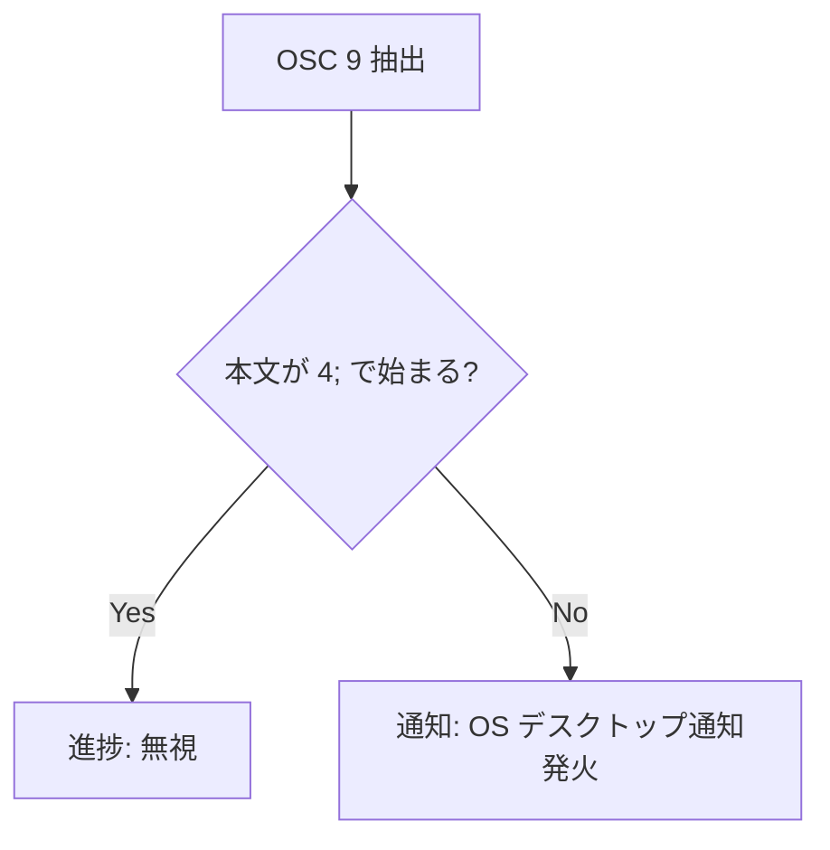

# バックグラウンド OSC 通知検知 - 要件定義書

## 1. 概要

### 1.1 背景
OSC 9 のデスクトップ通知シーケンス (`OSC 9 ; <message>`) は、現在フロントエンドの WASM パーサ (`process_pty_data`) の内部でのみ解釈され、`osc-handler.ts` から OS ネイティブ通知が発火される。

非アクティブな（バックグラウンドの）タブ/ペイン、またはウィンドウ最小化中に発行された OSC 9 通知は検知されない。原因は、バックグラウンド処理経路に回された PTY 出力が WASM パーサを通らないため。
- ウィンドウ非表示/最小化中: `reader.rs` が `process_hidden()` へ迂回させる。`process_hidden()` は shadow vt100 パーサと `PassthroughScanner` にのみ投入し、`PassthroughScanner` の抽出対象は Kitty 画像 / SIXEL / OSC 9999 (Markdown) のみで OSC 9 は対象外。
- mux 環境: 非アクティブなウィンドウ/ペインは `Detached` 化され、出力は ring buffer に書かれて GUI へストリームされない。

### 1.2 目的
バックグラウンド経路に回された PTY 出力からも OSC 9 通知シーケンスを検知し、OS デスクトップ通知を発火させる。

### 1.3 スコープ

**対象（検知できるようにする状況）:**
- mux の非アクティブウィンドウ/ペイン（Detached）
- ウィンドウ最小化・非表示中（全モード共通）
- 通常タブ（mux 無し）のバックグラウンドタブ

**対象シーケンス:**
- `OSC 9 ; <message>`（デスクトップ通知）のみ

**対象外:**
- `OSC 9 ; 4 ; ...`（進捗バー）のバックグラウンド処理
- OSC 9 以外の通知形式（OSC 777 等）
- バックグラウンド通知の ON/OFF 設定追加
- タブバーのアクティビティ表示（インジケータ）との連動
- 前面（visible / active）での OSC 9 挙動の変更

## 2. ビジネス要件

### 2.1 ビジネス目標
AI コーディングツール（Claude Code 等）が長時間処理の完了をバックグラウンドタブやウィンドウ最小化中に OSC 9 で通知しても、ユーザーがそれを受け取れるようにする。

### 2.2 対象ユーザー
| ユーザータイプ | 説明 |
|----------------|------|
| ターミナル利用者 | 複数タブ/ペイン、または最小化したウィンドウで長時間タスクを走らせ、完了通知を受け取りたいユーザー |

### 2.3 期待される効果
- バックグラウンドのタスク完了通知を取りこぼさない

## 3. ユースケース

### 3.1 ユースケース一覧
| ID | ユースケース名 | アクター | 優先度 |
|----|----------------|----------|--------|
| UC01 | 最小化ウィンドウでの通知受信 | ターミナル利用者 | 高 |
| UC02 | mux 非アクティブペイン/ウィンドウでの通知受信 | ターミナル利用者 | 高 |
| UC03 | 通常タブ（非アクティブ）での通知受信 | ターミナル利用者 | 中 |

### 3.2 ユースケース詳細

#### UC01: 最小化ウィンドウでの通知受信

**アクター**: ターミナル利用者

**事前条件**:
- ウィンドウが最小化／非表示（`document.visibilityState !== "visible"`）
- 通知パーミッションが許可済み

**基本フロー**:
1. 走行中のプロセスが `OSC 9 ; <message>` を出力する
2. バックグラウンド経路（`process_hidden`）が OSC 9 通知を検知する
3. OS デスクトップ通知（タイトル "eMterm" / 本文 message）が発火する

**事後条件**:
- ウィンドウを再表示しても同じ通知が二重発火しない

#### UC02: mux 非アクティブペイン/ウィンドウでの通知受信

**アクター**: ターミナル利用者

**事前条件**:
- mux 使用中、対象ペイン/ウィンドウが非アクティブ（Detached）
- 通知パーミッションが許可済み

**基本フロー**:
1. 非アクティブペインのプロセスが `OSC 9 ; <message>` を出力する
2. mux デーモンが Detached ペイン出力から OSC 9 通知を検知する
3. mux デーモンが接続中の GUI クライアントへ通知要求を転送する
4. GUI が OS デスクトップ通知を発火する

**事後条件**:
- ペイン再アタッチ時に同じ通知が二重発火しない

#### UC03: 通常タブ（非アクティブ）での通知受信

**アクター**: ターミナル利用者

**事前条件**:
- mux 未使用、複数タブを開いている。ウィンドウは表示中
- 対象タブは非アクティブ

**基本フロー**:
1. 非アクティブタブのプロセスが `OSC 9 ; <message>` を出力する
2. デスクトップ通知が発火する

**事後条件**:
- 前面タブの挙動は変わらない

## 4. 機能要件

### 4.1 機能一覧
| ID | 機能名 | 説明 | 優先度 |
|----|--------|------|--------|
| F01 | 非表示ウィンドウの OSC 9 検知 | `process_hidden` 経路で OSC 9 通知を検知し通知発火 | 高 |
| F02 | mux Detached ペインの OSC 9 検知 | mux デーモンで検知し GUI へ転送 | 高 |
| F03 | 非アクティブ通常タブの通知 | バックグラウンドタブで通知発火（保証・回帰確認） | 中 |
| F04 | 進捗シーケンス除外 | `OSC 9 ; 4 ; ...` はバックグラウンド通知を発火しない | 高 |
| F05 | 再表示時の二重発火防止 | 検知済み通知を replay/reattach で再発火しない | 高 |

### 4.2 機能詳細

#### F01: 非表示ウィンドウの OSC 9 検知

**説明**: ウィンドウ非表示中に `process_hidden()` が処理する PTY バイト列から `OSC 9 ; <message>` を抽出し、OS デスクトップ通知を発火する。`PassthroughScanner` と同様のステートフル走査で、チャンク境界をまたぐシーケンス、BEL / ST いずれの終端にも対応する。

**入力**:
- PTY 出力バイト列（hidden 経路）

**出力**:
- OS デスクトップ通知（タイトル "eMterm" / 本文 message）

**ビジネスルール**:
- `OSC 9 ; <message>` のみ発火対象。`OSC 9 ; 4 ; ...`（進捗）は無視
- 通知の発火は、検知時点で 1 回のみ

#### F02: mux Detached ペインの OSC 9 検知

**説明**: mux デーモンが Detached ペイン出力から `OSC 9 ; <message>` を抽出し、既存のクロスクライアント通知経路で GUI クライアントへ通知要求を送る。GUI 側が OS デスクトップ通知を発火する。

**ビジネスルール**:
- OS 通知は GUI（Tauri）プロセスからのみ発火可能。デーモンは自前で OS 通知を出さず、GUI へ転送する

#### F03: 非アクティブ通常タブの通知

**説明**: mux 未使用かつウィンドウ表示中の非アクティブタブで発行された OSC 9 通知が、OS デスクトップ通知として発火されることを保証する。現状この経路は各タブ独立の WASM パーサで処理されており既に発火する可能性が高いため、本機能では動作保証と回帰確認を行う。

#### F04: 進捗シーケンス除外

**説明**: バックグラウンド経路で抽出した OSC 9 のうち、本文が `4;` で始まる進捗シーケンスは通知を発火しない。

**処理フロー**:

#### F05: 再表示時の二重発火防止

**説明**: hidden / Detached 中に発火した OSC 9 通知は、ウィンドウ再表示やペイン再アタッチ時に再発火してはならない。OSC 9 通知バイト列は副作用イベントであり、再描画用の replay バイトストリーム（passthrough buffer）に含めない。

**エラーケース**:
| エラー | 条件 | 対応 |
|--------|------|------|
| 二重通知 | replay/reattach 時に OSC 9 が再解釈される | OSC 9 通知を replay 対象に含めない |

## 5. 非機能要件

### 5.1 パフォーマンス要件
- バックグラウンド走査のバイト当たりオーバーヘッドは既存 `PassthroughScanner` 同等に抑える
- 前面（visible / active）のホットパスに影響を与えない

### 5.2 セキュリティ要件
- 通知パーミッション（`isPermissionGranted`）を尊重し、許可時のみ発火する
- 通知本文は OSC 9 の message をそのまま用いる（前面挙動と同一）

### 5.4 保守性要件
- ログ出力: 異常系は `console.warn` / `log::warn!` 以上で記録（debug は release ログに残らない）
- 部分シーケンスのバッファは既存の `PARTIAL_SEQUENCE_MAX` ガードで上限を設ける

### 5.5 互換性要件
- 対象プラットフォーム: Linux / Windows（macOS 非対応）
- 既存の IPC / WASM / mux プロトコル互換性を維持する
- 前面の OSC 9 通知・進捗挙動を変更しない

## 9. 制約条件

### 9.1 技術的制約
- OS デスクトップ通知は GUI（Tauri）プロセスからのみ発火可能。mux デーモン（別プロセス）は GUI へ転送する必要がある
- DevTools 不可。検証は `emterm.log` 経由
- テスト実行は Docker を優先

## 10. 想定される課題とリスク

### 10.1 技術的課題
| 課題 | 影響度 | 対応策 |
|------|--------|--------|
| visible↔hidden 遷移境界をまたぐ OSC 9 シーケンスの取りこぼし/二重化 | 中 | バイトは前面/背面いずれか一方の経路で処理されるよう境界を明確化。遷移の正確な境界をまたぐ単一シーケンスはベストエフォート | 
| OS デスクトップ通知の自動 E2E 検証が困難（Xvfb に通知デーモン無し） | 中 | スキャナ抽出・IPC 転送・フロントエンド受信はユニット/結合テストで担保。OS 通知発火は手動確認 |

## 11. 成功基準

### 11.1 受け入れ基準
- [ ] ウィンドウ最小化中に発行された OSC 9 通知で OS デスクトップ通知が出る
- [ ] mux 非アクティブペイン/ウィンドウの OSC 9 通知で OS デスクトップ通知が出る
- [ ] 通常タブ（非アクティブ）の OSC 9 通知で OS デスクトップ通知が出る
- [ ] `OSC 9 ; 4 ; ...`（進捗）ではバックグラウンド通知が出ない
- [ ] 再表示/再アタッチ時に同一通知が二重発火しない
- [ ] 前面（visible/active）の OSC 9 挙動が変わらない

## 12. テストシナリオ

### 12.1 テスト観点
- [ ] 正常系: hidden 経路で `OSC 9 ; msg` 抽出 → 通知発火
- [ ] 正常系: mux Detached で `OSC 9 ; msg` 抽出 → GUI 転送 → 通知発火
- [ ] 異常系: `OSC 9 ; 4 ; 1 ; 50`（進捗）は通知発火しない
- [ ] 境界値: BEL 終端 / ST 終端の両方
- [ ] 境界値: シーケンスがチャンク境界をまたぐ
- [ ] 境界値: 終端しないシーケンスが `PARTIAL_SEQUENCE_MAX` 超でドロップ
- [ ] 回帰: 再表示/再アタッチで二重発火しない

## 13. 用語定義

| 用語 | 定義 |
|------|------|
| OSC 9 通知 | `ESC ] 9 ; <message> (BEL | ST)` 形式のデスクトップ通知シーケンス |
| hidden 経路 | ウィンドウ非表示時に `reader.rs` が `process_hidden()` へ迂回させる PTY 処理経路 |
| Detached | mux で非アクティブペインの出力を GUI へストリームせず ring buffer に保持する状態 |
| PassthroughScanner | hidden 中の PTY バイト列から特定シーケンス（画像/Markdown）を抽出する既存ステートフル走査器 |

## 14. 確認事項

### 14.1 確認済み事項
- [x] 検知対象の状況: mux 非アクティブペイン/ウィンドウ、ウィンドウ最小化・非表示中、通常タブ（mux 無し）の3つすべて
- [x] 対象シーケンス: `OSC 9 ; <message>`（通知）のみ。進捗(`9;4`)は対象外
- [x] タブバーのアクティビティ表示連動: しない（デスクトップ通知のみ）
- [x] ON/OFF 設定: 追加しない（常時有効）

### 14.2 未確認・保留事項
- なし

## 15. 参考資料

- 既存実装: `src/terminal/osc-notification.ts`, `src/terminal-app/osc-handler.ts`
- 既存バックグラウンド走査: `src-tauri/src/pty/passthrough_scanner.rs`, `src-tauri/src/pty/visibility.rs`, `src-tauri/src/pty/reader.rs`
- 関連タスク: `doc/tasks/notification-activity-monitor/`, `doc/tasks/visibility-aware-pty-streaming/`, `doc/tasks/mux-scrollback-retention/`
