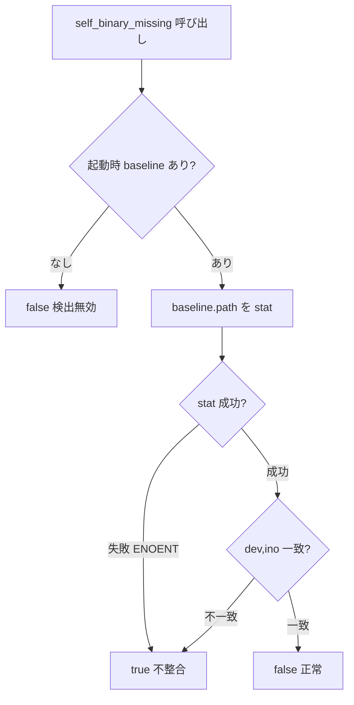

# バイナリ不整合時の再起動促しトースト - 要件定義書

## 1. 概要

### 1.1 背景

eMterm は設定画面・各種ビューア・mux daemon を「自分自身を別フラグで再実行した子プロセス」として起動する。子プロセスのパスは `std::env::current_exe()` で取得している。

Linux の `current_exe()` は `/proc/self/exe`（実行中プロセスの実体 inode を指すシンボリックリンク）を readlink して返す。`apt`/`dpkg` 等のバイナリ更新は `rename(2)` で `/usr/bin/emterm` を新しい inode に差し替えるため、実行中プロセスが掴んでいる古い inode はディレクトリエントリを失い、`current_exe()` は `/usr/bin/emterm (deleted)` を返すようになる。この文字列を `Command::new(...)` に渡すと実パスが存在せず `execve` が `ENOENT` で失敗し、子プロセスが起動できない。

実機では、実行中の全 emterm プロセス（メイン / mux daemon / mux attach）の `/proc/<pid>/exe` がいずれも `/usr/bin/emterm (deleted)` を指し、プロセス起動後にバイナリが更新されていた。

### 1.2 目的

バイナリ置換により自己再実行が失敗しうる状態を検出し、メインウィンドウ上に「アプリが更新された。再起動してほしい」旨のトーストを表示する。

### 1.3 スコープ

- 対象プラットフォーム: **Linux のみ**。
- 検出方式: **案A（reactive）のみ** — 子プロセス spawn が実際に失敗した時に検出する。定期 / フォーカス時チェック（案B）は対象外。
- `/proc/self/exe` ベースで子プロセスを起動する現状の設計は受け入れる。不整合そのものを回避する（fexecve 等）ことは目的としない。

## 2. ビジネス要件

### 2.1 ビジネス目標

バイナリ更新後に子プロセス機能（設定 / ビューア / mux）が無言で起動失敗する状況を、ユーザーが原因（更新済み・要再起動）として把握できるようにする。

### 2.2 対象ユーザー

| ユーザータイプ | 説明 |
|----------------|------|
| eMterm 利用者 | apt/dpkg 等でバイナリ更新後も同一プロセスを使い続けているユーザー |

### 2.3 期待される効果

- 子プロセス起動失敗の原因がユーザーに伝わる
- 再起動という適切な対処へ誘導できる

## 3. ユースケース

### 3.1 ユースケース一覧

| ID | ユースケース名 | アクター | 優先度 |
|----|----------------|----------|--------|
| UC01 | 更新後に機能を使い起動失敗→トースト表示 | 利用者 | 高 |

### 3.2 ユースケース詳細

#### UC01: 更新後に機能を使い起動失敗→トースト表示

**アクター**: eMterm 利用者

**事前条件**:
- eMterm 起動後に、バイナリが apt/dpkg 等で置換されている

**基本フロー**:
1. ユーザーが設定画面・ビューア・mux 等、自己再実行を伴う機能を使う
2. 子プロセス spawn が `ENOENT` で失敗する
3. システムが自己バイナリ不整合（inode 不一致 / パス消失）を検出する
4. メインウィンドウ右上にトーストを表示する
5. トーストは 4 秒後に自動消滅する

**代替フロー**:
- 再度別機能を使い spawn が失敗した場合、トーストを 1 枚に保ったまま表示時間を更新して再表示する

**事後条件**:
- ユーザーが再起動の必要性を認識できる

## 4. 機能要件

### 4.1 機能一覧

| ID | 機能名 | 説明 | 優先度 |
|----|--------|------|--------|
| F01 | 起動時 inode 記録 | 起動時に自己実行ファイルの実体 inode を記録 | 高 |
| F02 | 不整合検出 | inode 比較で自己再実行が信頼できない状態を検出 | 高 |
| F03 | spawn 共通化 | 4 箇所の自己 spawn を共通モジュール経由にし、失敗時にシグナルを立てる | 高 |
| F04 | トースト表示 | メインウィンドウ右上にトーストを表示 | 高 |
| F05 | 自動消滅 | トーストを frame-time ベースで 4 秒後に自動消滅 | 高 |
| F06 | i18n | トースト文言を ja/en 対応 | 高 |

### 4.2 機能詳細

#### F02: 不整合検出（inode 比較）

**説明**: 起動時に記録した `(device, inode)` と、記録時パスの現在の `(device, inode)` を比較する。パスが消失（stat 失敗）または inode が変化していれば不整合とみなす。

**処理フロー**:

**ビジネスルール**:
- `.exists()` ではなく inode 比較を採用する（厳密）。
- baseline 未確立時は検出を無効化し、誤検出を避ける。

#### F03: spawn 共通化（reactive 検出）

**説明**: 以下 4 箇所の自己 spawn を共通モジュール `self_exec` 経由にする。spawn が失敗し、かつ不整合を検出したらプロセスグローバルのシグナルを立てる。

| ファイル:行 | 機能 |
| --- | --- |
| `src-tauri/src/settings_launcher.rs:74` | 設定画面 |
| `src-tauri/src/viewer/mod.rs:254` | Markdown / データビューア |
| `src-tauri/src/viewer/image.rs:156` | 画像ビューア（専用ワーカースレッド上で spawn） |
| `src-tauri/src/mux/daemon.rs:155`（`ensure_daemon_running`） | mux daemon 起動 |

**ビジネスルール**:
- 画像ビューアは App スレッド外（`image-viewer-spawn` スレッド）で spawn するため、検出シグナルはプロセスグローバルに集約し、App が毎フレーム拾う。
- mux daemon はクライアント（メイン）側からの起動失敗時にトーストを出す。

#### F04/F05: トースト表示・自動消滅

**説明**: 既存 SFTP トースト（`src-tauri/src/render/mod.rs:519`）のパターンを流用し、`egui::Area` を右上アンカーで表示する。frame-time ベースで `TOAST_LINGER_SECS`（4.0 秒）相当の経過後に自動消滅する。

**ビジネスルール**:
- 自動消滅。デスクトップ通知（notify-rust）は併用しない。
- 連打時もトーストは 1 枚に保ち、表示時間（dismiss_at）を更新する。

**エラーケース**:
| エラー | 条件 | 対応 |
|--------|------|------|
| current_exe() 自体が失敗 | 取得不能 | 自己再実行は信頼できないとみなす（baseline 未確立なら検出無効） |
| spawn 失敗だが binary は正常 | 一時的失敗等 | 不整合検出が false ならトーストは出さない |

## 5. 非機能要件

### 5.1 パフォーマンス要件

- 検出は spawn 失敗時のみ実行（reactive）。通常時のターミナル描画・キー入力に追加コストを与えない。

### 5.2 セキュリティ要件

- 既存挙動を変えない。新規の外部入力・権限要求はない。

### 5.4 保守性要件

- inode 記録・比較ロジック、トーストの dismiss ロジックは純粋関数として単体テスト可能にする。
- ログ規約（`--lib`、`tabs.rs` replay は `--test-threads=1`）に従う。

### 5.5 互換性要件

- 対象は Linux のみ。Windows / 非 unix では `self_binary_missing()` は常に `false`（no-op）でビルドを壊さない。
- GUI feature 下のみ。CLI-only（`--no-default-features`）ビルドを壊さない。

## 6. UI/UX要件

### 6.1 画面設計要件

- メインウィンドウ右上にトースト 1 枚。`egui::Frame::popup` でラベル表示。
- SFTP トーストと同じ右上領域。両者が同時表示される場合は重ならないようオフセットを調整する。
- 文言: ja「eMterm が更新されました。再起動してください」/ en「eMterm was updated. Please restart.」

## 9. 制約条件

### 9.1 技術的制約

- 検出ロジックは Linux（unix）の inode に依存する。`#[cfg(target_os = "linux")]`（または unix）で実装し、他 OS では no-op。
- トースト・spawn 箇所は GUI feature 下にある。

## 10. 想定される課題とリスク

### 10.1 技術的課題

| 課題 | 影響度 | 対応策 |
|------|--------|--------|
| 開発時 `cargo build` 中の一瞬で inode が変わり誤検出 | 低 | debug ビルドでも抑制しない（本番同挙動）方針を受け入れる |
| SFTP トーストとの右上アンカー重複 | 低 | オフセット調整で回避 |
| オフスレッド spawn からの App への通知 | 中 | プロセスグローバル AtomicBool に集約し App が毎フレーム consume |

## 11. 成功基準

### 11.1 受け入れ基準

- [ ] バイナリ置換後に設定 / ビューア / 画像 / mux daemon のいずれかを使うとトーストが出る
- [ ] トーストは 4 秒で自動消滅する
- [ ] ja/en 文言が言語設定に応じて出る
- [ ] 既存のターミナル動作・描画に影響がない
- [ ] CLI-only ビルドと Windows ビルドが壊れない

## 12. テストシナリオ

### 12.1 テスト観点

- [ ] 正常系: baseline と現 inode 一致 → 検出 false
- [ ] 異常系: パス消失（stat 失敗）→ 検出 true
- [ ] 異常系: inode 変化 → 検出 true
- [ ] 境界値: baseline 未確立 → 検出 false（無効）
- [ ] トースト: arm で dismiss_at = now+4、now<at は残存、now>=at で消滅、再 arm で更新

## 13. 用語定義

| 用語 | 定義 |
|------|------|
| 案A (reactive) | 子プロセス spawn が失敗した時点で不整合を検出する方式 |
| baseline | 起動時に記録した自己実行ファイルの `(path, device, inode)` |
| frame-time | egui のモノトニックなフレーム時刻（壁時計非依存） |

## 14. 確認事項

### 14.1 確認済み事項

- [x] 検出方式: 案A（spawn 失敗時）のみ
- [x] 共通化スコープ: 4 箇所すべてを `self_exec` 経由に統一
- [x] 対象プラットフォーム: Linux のみ
- [x] 検出ロジック: inode 比較（厳密）
- [x] トースト消滅: 一定時間で自動消滅（SFTP と同じ 4 秒）
- [x] デスクトップ通知: アプリ内トーストのみ（notify-rust 併用しない）
- [x] dev（debug）抑制: 抑制しない（本番と同挙動）

### 14.2 未確認・保留事項

- なし

## 15. 参考資料

- 設計レポート: `tmp/binary-mismatch-restart-toast-design.md`
- 既存 SFTP トースト実装: `src-tauri/src/render/mod.rs:519`, `src-tauri/src/sftp/ui.rs`
