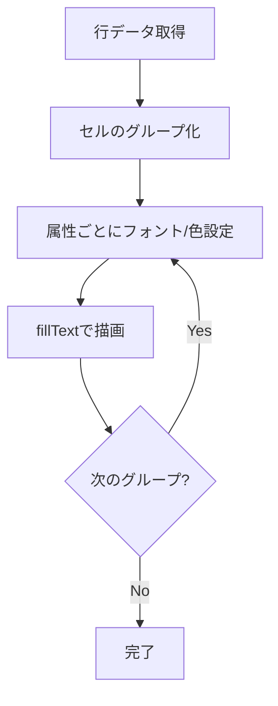

# Canvas 2Dレンダラー - 要件定義書

## 1. 概要

### 1.1 背景
現在のeMtermはDOMベースのレンダリングを採用しているが、高速スクロール時にパフォーマンスが低下する問題がある。

### 1.2 目的
Canvas 2D APIを使用したレンダリングエンジンを実装し、高速スクロール時のパフォーマンスを改善する。

### 1.3 スコープ
- Canvas 2Dベースのターミナルレンダラーの新規実装
- 既存DOMレンダラーとの共存（段階的移行）
- フィーチャーフラグによるレンダラー切り替え機能

## 2. ビジネス要件

### 2.1 ビジネス目標
ターミナルエミュレータの描画パフォーマンスを向上させ、ユーザー体験を改善する。

### 2.2 対象ユーザー
| ユーザータイプ | 説明 |
|----------------|------|
| 開発者 | 日常的にターミナルを使用する開発者 |
| パワーユーザー | 大量のログ出力や高速スクロールを行うユーザー |

### 2.3 期待される効果
- 高速スクロール時の描画遅延の低減
- フレームドロップの減少
- 全体的なレスポンシブ性の向上

## 3. ユースケース

### 3.1 ユースケース一覧
| ID | ユースケース名 | アクター | 優先度 |
|----|----------------|----------|--------|
| UC01 | 通常のターミナル操作 | ユーザー | 高 |
| UC02 | 高速スクロール | ユーザー | 高 |
| UC03 | テキスト選択 | ユーザー | 高 |
| UC04 | レンダラー切り替え | 開発者 | 中 |

### 3.2 ユースケース詳細

#### UC01: 通常のターミナル操作

**アクター**: ユーザー

**事前条件**:
- ターミナルが起動している

**基本フロー**:
1. ユーザーがコマンドを入力する
2. システムがコマンド出力をCanvasに描画する
3. カーソルがブリンクしながら適切な位置に表示される

**事後条件**:
- 画面に正しく文字が表示される

#### UC02: 高速スクロール

**アクター**: ユーザー

**事前条件**:
- スクロールバックバッファに履歴がある

**基本フロー**:
1. ユーザーがマウスホイールまたはキーボードでスクロールする
2. システムがスクロール位置に応じた内容をCanvasに描画する
3. スムーズにスクロールが行われる

**事後条件**:
- スクロール位置に対応した内容が表示される

#### UC03: テキスト選択

**アクター**: ユーザー

**事前条件**:
- 画面にテキストが表示されている

**基本フロー**:
1. ユーザーがマウスドラッグで範囲を選択する
2. システムが選択範囲をハイライト表示する
3. ユーザーが選択をコピーできる

**事後条件**:
- 選択範囲がハイライトされている

#### UC04: レンダラー切り替え

**アクター**: 開発者

**事前条件**:
- アプリケーションが起動可能な状態

**基本フロー**:
1. 開発者が環境変数を設定する
2. アプリケーションを起動する
3. 指定されたレンダラーで描画が行われる

**事後条件**:
- 指定したレンダラーが使用されている

## 4. 機能要件

### 4.1 機能一覧
| ID | 機能名 | 説明 | 優先度 |
|----|--------|------|--------|
| F01 | テキスト描画 | Canvas上にターミナルテキストを描画 | 高 |
| F02 | 属性描画 | 色、太字、斜体、下線などのスタイル適用 | 高 |
| F03 | カーソル描画 | カーソルのCanvas内描画とブリンク | 高 |
| F04 | 選択範囲ハイライト | テキスト選択範囲の視覚的表示 | 高 |
| F05 | Wide文字対応 | 全角文字の正しい幅での描画 | 高 |
| F06 | スクロールバックバッファ表示 | 履歴の表示とスクロール | 高 |
| F07 | フィーチャーフラグ切り替え | 環境変数によるレンダラー選択 | 中 |

### 4.2 機能詳細

#### F01: テキスト描画

**説明**: Canvas 2D APIを使用してターミナルのテキストを描画する

**入力**:
- line: Line - 描画する行データ
- rowIndex: number - 行番号

**出力**:
- Canvas上に描画されたテキスト

**処理フロー**:

**ビジネスルール**:
- 文字幅はcharWidth関数で計算（既存実装を流用）
- フォント設定は既存CSS設定から取得

#### F02: 属性描画

**説明**: SGR属性に基づいたスタイルでテキストを描画する

**対応属性**:
| 属性 | Canvas実装 |
|------|-----------|
| 前景色 | fillStyle設定 |
| 背景色 | fillRect + fillText |
| 太字 | font-weightをboldに設定 |
| 斜体 | font-styleをitalicに設定 |
| 下線 | 文字下にlineTo描画 |
| 取り消し線 | 文字中央にlineTo描画 |
| 点滅 | タイマーで表示/非表示切り替え |
| 反転 | 前景色と背景色を入れ替え |
| 非表示 | 描画をスキップ |
| dim | globalAlphaを0.5に設定 |

#### F03: カーソル描画

**説明**: カーソルをCanvas内に直接描画する

**カーソルスタイル**:
| スタイル | 描画方法 |
|----------|----------|
| block | fillRectで塗りつぶし |
| underline | 下部に細い線を描画 |
| bar | 左端に縦線を描画 |

**ブリンク実装**:
- JavaScriptタイマー（setInterval）で実装
- 表示/非表示を切り替え
- ブリンク間隔: 500ms（既存と同等）

#### F04: 選択範囲ハイライト

**説明**: テキスト選択時に視覚的なハイライトを表示する

**実装方法**:
- 選択範囲の座標を計算
- 半透明の背景色でfillRect描画
- 選択テキストは通常描画の上にオーバーレイ

#### F05: Wide文字対応

**説明**: 全角文字を正しい幅で描画する

**実装方法**:
- 既存のcharWidth関数を使用
- width=2のセルは2セル分の幅で描画
- width=0のセル（プレースホルダー）はスキップ

#### F06: スクロールバックバッファ表示

**説明**: スクロールバックバッファの内容を表示する

**実装方法**:
- スクロールオフセットに基づいて表示行を計算
- 表示範囲の行のみを描画（仮想スクロール）

#### F07: フィーチャーフラグ切り替え

**説明**: 環境変数でレンダラーを切り替える

**環境変数**:
- `EMTERM_RENDERER`: "canvas" | "dom"（デフォルト: "dom"）

**切り替えタイミング**:
- アプリケーション起動時に決定
- 実行中の切り替えは不要

## 5. 非機能要件

### 5.1 パフォーマンス要件
- 現状のDOMレンダラーより改善されること
- 高速スクロール時のフレームドロップが減少すること

### 5.2 セキュリティ要件
- Canvas描画のため、XSSリスクは低い
- 入力データの検証は既存ロジックを継続使用

### 5.3 可用性要件
- DOMレンダラーは比較検証用に一時的に維持
- Canvas 2D未対応環境では動作しない（フォールバック不要）
- 移行完了後はCanvas 2Dに完全切り替え

### 5.4 保守性要件
- レンダラーインターフェースを共通化
- 既存のTerminalRenderer APIと互換性を維持

### 5.5 互換性要件
- モダンブラウザ（Tauri WebView）のCanvas 2D API対応

## 6. UI/UX要件

### 6.1 画面設計要件
- 既存のDOMレンダラーと視覚的に同等の表示
- フォント、色、サイズは既存設定を流用

### 6.2 レスポンシブ対応
- リサイズ時のCanvas再描画に対応

## 7. データ要件

### 7.1 データモデル概要
既存のターミナルデータモデル（Line, Cell, CellAttributes）をそのまま使用

### 7.2 入力データ
| データ | 説明 |
|--------|------|
| TerminalState | 描画対象のターミナル状態 |
| Line[] | 描画する行データ |
| CursorState | カーソル位置とスタイル |

## 8. 外部連携

### 8.1 連携システム
| システム名 | 連携方法 | データ |
|------------|----------|--------|
| TerminalState | 直接参照 | 行データ、カーソル状態 |
| パフォーマンスモニター | 既存API | 描画時間計測 |

## 9. 制約条件

### 9.1 技術的制約
- Canvas 2D APIを使用（WebGLは使用しない）
- 既存のTerminalRendererと同じインターフェースを維持

### 9.2 ビジネス上の制約
- 移行期間中は比較検証のためDOMレンダラーを維持
- 移行完了後はCanvas 2Dに完全切り替え（DOMレンダラーは削除）

## 10. 想定される課題とリスク

### 10.1 技術的課題
| 課題 | 影響度 | 対応策 |
|------|--------|--------|
| フォント測定の精度 | 中 | 既存のmeasureCharacterSize実装を活用 |
| 高DPI対応 | 中 | devicePixelRatioでスケーリング |
| テキスト選択とクリップボード連携 | 中 | 隠しテキストエリアを使用 |

### 10.2 ビジネスリスク
| リスク | 発生確率 | 影響度 | 対応策 |
|--------|----------|--------|--------|
| パフォーマンス改善が期待以下 | 低 | 中 | プロファイリングで原因特定、DOMにフォールバック |

## 11. 成功基準

### 11.1 受け入れ基準
- [ ] 既存のDOMレンダラーと同等の表示品質
- [ ] 高速スクロール時のパフォーマンス改善
- [ ] 全てのテキスト属性（色、太字、下線など）の正常描画
- [ ] カーソルの正常表示とブリンク動作
- [ ] テキスト選択機能の動作
- [ ] Wide文字（全角）の正常表示
- [ ] 環境変数によるレンダラー切り替え

### 11.2 KPI
| 指標 | 目標値 | 測定方法 |
|------|--------|----------|
| パフォーマンス | DOMレンダラーより改善 | PerformanceMonitorで計測 |
| フレームドロップ率 | 減少 | 高速スクロール時に計測 |

## 12. テストシナリオ

### 12.1 テスト観点
- [ ] 正常系: 通常のテキスト描画
- [ ] 正常系: 各種属性（色、太字、斜体、下線）の描画
- [ ] 正常系: カーソルの表示とブリンク
- [ ] 正常系: Wide文字の描画
- [ ] 正常系: テキスト選択とハイライト
- [ ] 正常系: スクロールバックバッファの表示
- [ ] 正常系: 環境変数によるレンダラー切り替え
- [ ] 異常系: 不正な文字コードの処理
- [ ] 境界値: 空行の描画
- [ ] 境界値: 画面いっぱいのテキスト
- [ ] パフォーマンス: 高速スクロール時の描画

## 13. 用語定義

| 用語 | 定義 |
|------|------|
| Canvas 2D | HTML5 Canvas APIの2D描画コンテキスト |
| DOMレンダラー | 既存のspan要素ベースのレンダリング実装 |
| フィーチャーフラグ | 機能の有効/無効を切り替えるための設定 |
| スクロールバックバッファ | ターミナルの履歴を保持するバッファ |
| Wide文字 | 全角文字など、2セル分の幅を持つ文字 |
| SGR | Select Graphic Rendition - 文字属性を設定するANSIエスケープシーケンス |

## 14. 確認事項

### 14.1 確認済み事項
- [x] 移行方針: 段階的移行（まず共存させ、十分な検証後にDOMレンダラーを削除）
- [x] 切り替え方式: 環境変数によるフィーチャーフラグ方式（比較検証用）
- [x] 描画機能: フル機能（選択範囲ハイライト、スクロールバックバッファ表示を含む）
- [x] パフォーマンス目標: 現状より改善（具体的な数値目標なし）
- [x] Wide文字: 既存のcharWidth関数を使用
- [x] カーソル描画: Canvas内で描画、ブリンクはJavaScriptタイマーで実装
- [x] フォント設定: 既存CSS設定から取得
- [x] Canvas 2D未対応時: フォールバック不要（動作しなくてよい）
- [x] 最終形態: 移行完了後はCanvas 2Dに完全切り替え

### 14.2 未確認・保留事項
- なし

## 15. 参考資料

- 既存実装: `src/terminal/renderer.ts`
- パフォーマンスユーティリティ: `src/terminal/performance.ts`
- Unicode幅計算: `src/terminal/unicode.ts`
