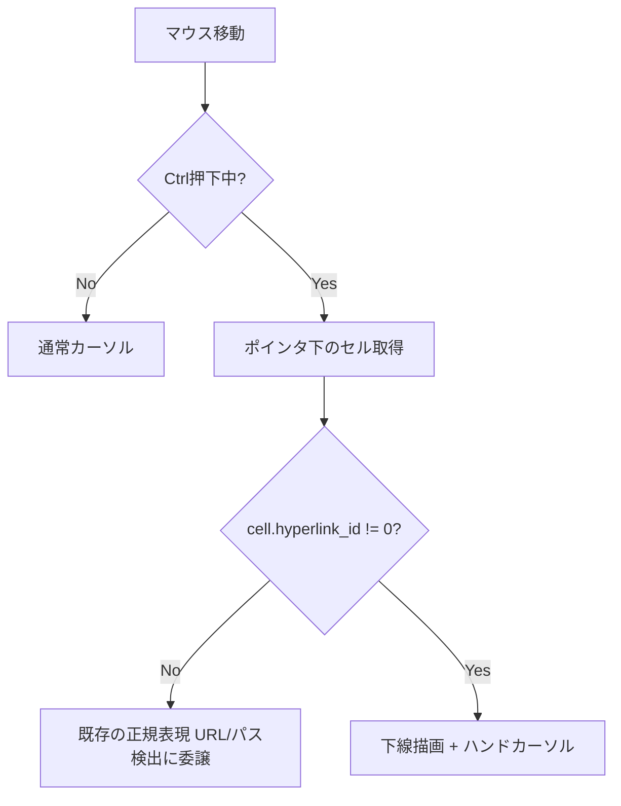
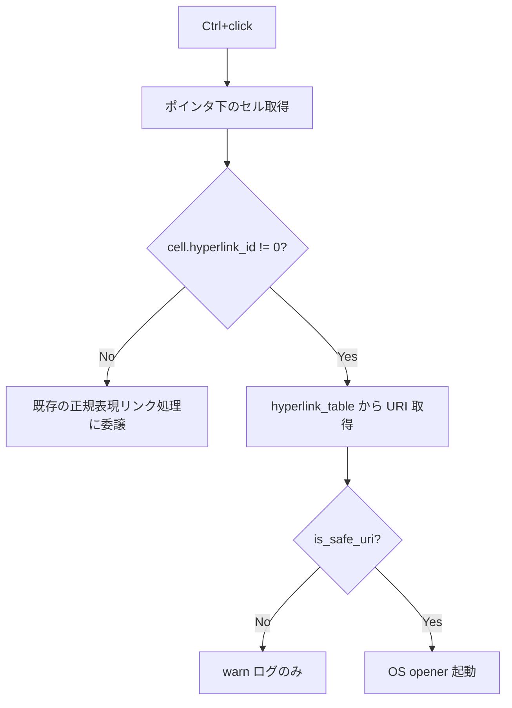

# Claude Code 向け AltScreen UX 改善 - 要件定義書

## 1. 概要

### 1.1 背景

eMterm 上で Claude Code を利用した際に以下 2 つの問題が発生する。WezTerm では両方とも正常に動作している。

1. Claude Code の長いログ表示中に、マウスホイール / PgUp / PgDn / Ctrl+Home / Ctrl+End が効かない
2. Claude Code が下部に表示する PR ID (例 `#1`) がリンク化されず、クリックでブラウザを開けない

調査の結果 (`tmp/discussion-claude-code-altscreen-and-pr-link.md`) と Claude Code 公式情報 (GitHub Issue #42002 / #27047 / #29188、changelog v2.1.144〜2.1.174) により、以下が確定した。

- Claude Code は AltScreen (代替バッファ) を使用する fullscreen mode で動作する
- Claude Code 自身が AltScreen 中に矢印キー / PgUp / PgDn / Home / End / マウスホイール を解釈してスクロールする
- PR ID `#1` は Claude Code が OSC 8 ハイパーリンクとして出力している
- eMterm 側の欠落:
  - DECSET 1007 (alternate_scroll) 未実装 → ホイールが矢印キーに化けず Claude Code に届かない
  - CSI Modifier 拡張 (`ESC[1;5H` 等) 未実装 → Ctrl+Home/End が素の Home/End と区別不能
  - OSC 8 が `term_core` に格納されてはいるがホスト側 (レンダラ / クリックハンドラ) で全く参照されていない

### 1.2 目的

eMterm 上で Claude Code の AltScreen UX を WezTerm 同等に揃える。具体的には以下 3 機能を 1 セットで提供する。

- F1. DECSET 1007 (alternate_scroll) サポート
- F2. CSI Modifier 拡張 (修飾子付きキー送出)
- F3. OSC 8 ハイパーリンクのホスト側対応

### 1.3 スコープ

**スコープ内:**
- DECSET 1007 (`?1007`) の DEC private mode 実装と PTY 送出
- 修飾子付き Home/End/PgUp/PgDn/Arrow/F-key の `ESC[1;<mods>X` 形式エンコード
- OSC 8 ハイパーリンクのレンダラ下線描画 + Ctrl+hover ハンドカーソル + Ctrl+click ブラウザ起動
- AltScreen 中の OSC 8 リンク検出有効化 (既存の正規表現 URL/パス検出は AltScreen 中は無効のまま)

**スコープ外:**
- 汎用 `hyperlink_rules` 風のプレーンテキスト自動 URL 認識 (PR ID は OSC 8 経由なので不要)
- AltScreen 中のスクロールバック表示機能 (xterm 系の `alternateScrollbar` 等)
- 矢印キー以外への変換 (`xterm.app` の `MouseWheelLineKeys` カスタマイズ等)

## 2. ビジネス要件

### 2.1 ビジネス目標

AI コーディングツールとの親和性向上 (eMterm の長期目標)。Claude Code 公式が想定する fullscreen UX に追従し、ユーザーが端末を WezTerm 等から切り替える際の摩擦を減らす。

### 2.2 対象ユーザー

| ユーザータイプ | 説明 |
|----------------|------|
| Claude Code 利用者 | eMterm 上で Claude Code TUI を日常的に使うユーザー |
| vim / less / fzf 等 AltScreen 系 TUI 利用者 | DECSET 1007 / CSI Modifier 拡張の恩恵を受ける |
| OSC 8 を発する CLI ツール利用者 | gcc/clang のエラーリンク、`gh` の PR リンク等 |

### 2.3 期待される効果

- Claude Code 上で長いログをマウスホイールでスクロールできる
- Claude Code 上で Ctrl+Home / Ctrl+End がジャンプキーとして動く
- PR ID `#1` 等が下線付きで表示され Ctrl+click でブラウザが開く
- 副次的に他の AltScreen TUI / OSC 8 対応ツールでも同じ操作感が得られる

## 3. ユースケース

### 3.1 ユースケース一覧
| ID | ユースケース名 | アクター | 優先度 |
|----|----------------|----------|--------|
| UC01 | Claude Code のログをマウスホイールでスクロール | Claude Code 利用者 | 高 |
| UC02 | Claude Code のログを Ctrl+Home/End でジャンプ | Claude Code 利用者 | 高 |
| UC03 | Claude Code の PR ID をクリックしてブラウザで開く | Claude Code 利用者 | 高 |
| UC04 | DECSET 1007 を設定で off にする | ホイール変換を嫌うユーザー | 中 |

### 3.2 ユースケース詳細

#### UC01: Claude Code のログをマウスホイールでスクロール

**アクター**: Claude Code 利用者

**事前条件**:
- eMterm 上で Claude Code が起動している (AltScreen に入っている)
- Claude Code がスクロール可能なダイアログ / ペインを表示している

**基本フロー**:
1. ユーザーが端末上でマウスホイールを回転させる
2. eMterm が AltScreen 状態かつ DECSET 1007 が有効であることを検出
3. eMterm がホイール回転量を `ESC[A` / `ESC[B` × N 行に変換して PTY へ送出
4. Claude Code が矢印キー入力としてログをスクロール

**代替フロー**:
- DECSET 1007 が off → 現状通り eMterm のスクロールバック表示が動く (AltScreen 中はスクロールバック行が無いので実質 no-op)
- AltScreen ではない (MainScreen) → 従来通り eMterm のスクロールバック表示を動かす (alternate_scroll は AltScreen 専用)

**事後条件**:
- Claude Code のログがホイール方向に応じてスクロールしている

#### UC02: Claude Code のログを Ctrl+Home / Ctrl+End でジャンプ

**アクター**: Claude Code 利用者

**事前条件**:
- eMterm 上で Claude Code が起動している (AltScreen)

**基本フロー**:
1. ユーザーが Ctrl+Home を押す
2. eMterm が CSI Modifier 拡張で `ESC[1;5H` を PTY へ送出
3. Claude Code が「先頭ジャンプ」として解釈

**事後条件**:
- Claude Code のログ表示が先頭 / 末尾にジャンプしている

#### UC03: Claude Code の PR ID をクリックしてブラウザで開く

**アクター**: Claude Code 利用者

**事前条件**:
- Claude Code が PR ID `#1` を OSC 8 ハイパーリンクとして出力済み
- OSC 8 の URI が `https://github.com/...` 等の安全な URI

**基本フロー**:
1. ユーザーが `#1` のセル上に Ctrl を押しながらマウスカーソルを乗せる
2. eMterm がそのセルの `cell.hyperlink_id != 0` を検出し、下線描画 + ハンドカーソルへ切替
3. ユーザーが Ctrl+クリック
4. eMterm が `hyperlink_table[id]` の URI を `links::is_safe_uri` で検証
5. 安全な URI であれば OS の opener に渡す

**代替フロー**:
- URI が `is_safe_uri` 不合格 → 何もしない (ログに warn を残す)
- Ctrl なしの hover / click → 通常の選択操作として扱う

**事後条件**:
- OS のデフォルトブラウザで PR ページが開く

#### UC04: DECSET 1007 を設定で off にする

**アクター**: ホイール変換を嫌うユーザー

**基本フロー**:
1. ユーザーが Settings から `alternate_scroll_enabled` を off にする
2. eMterm が以降のホイール入力を矢印キー変換せずスクロールバック表示に戻す

## 4. 機能要件

### 4.1 機能一覧
| ID | 機能名 | 説明 | 優先度 |
|----|--------|------|--------|
| F1 | DECSET 1007 (alternate_scroll) | AltScreen 中のホイールを矢印キーへ変換 | 高 |
| F2 | CSI Modifier 拡張 | Ctrl/Shift/Alt 付き特殊キーの拡張 CSI 送出 | 高 |
| F3 | OSC 8 ハイパーリンクのホスト対応 | レンダラ下線 + Ctrl+hover/click | 高 |

### 4.2 機能詳細

#### F1: DECSET 1007 (alternate_scroll)

**説明**:
DEC private mode 1007 を実装する。AltScreen 中にマウスホイールイベントを矢印キー (`ESC[A` / `ESC[B`) に変換して PTY へ送出する。

**動作仕様**:
- 適用範囲: **AltScreen 中のみ** (MainScreen では従来通りスクロールバック表示が動く)
- デフォルト: ON
- Shift+wheel: 素の wheel と同じ扱い (xterm 互換、Shift 修飾子は無視して矢印キー化)
- ホイール 1 ノッチあたり 3 行 (xterm `MouseWheelLineKeys` のデフォルト互換)
- ユーザー設定で off にできる: `terminal.alternate_scroll_enabled: boolean` (デフォルト true)

> **注**: 現状 eMterm にはホスト側のマウスレポート (DECSET 1000/1002/1003/1006) ハンドラが存在しない (term_core 側は `MODE_ACTION_TS_FALLBACK` を返すが消費側未実装)。よってマウスレポートとの競合は今回スコープ外。将来マウスレポートを実装する際に優先順位 (xterm 互換ではマウスレポート優先) を別途定義する。

**入力**:
- `WindowEvent::MouseWheel` (winit)
- `App::alt_screen: bool` (現在のスクリーン状態)
- `term_core::TerminalCore` の DECSET 1007 ビット (デフォルト ON)

**出力**:
- PTY への `ESC[A` / `ESC[B` バイト列 × ホイール量×3

**処理フロー**:
```mermaid
flowchart TD
    A[MouseWheel イベント] --> D{AltScreen中?}
    D -->|No| E[スクロールバック表示]
    D -->|Yes| F{DECSET 1007 ON かつ user 設定 ON?}
    F -->|No| E
    F -->|Yes| G[矢印キー ESC[A/B を 3行×ノッチ PTY 送出]
```

**ビジネスルール**:
- AltScreen と DECSET 1007 と user 設定の三者が有効な時だけ alternate_scroll が働く
- Shift 修飾子は無視 (xterm 互換)
- マウスレポート未実装のため今回は競合無し (将来実装時に優先順位を別途定義)

#### F2: CSI Modifier 拡張

**説明**:
Ctrl / Shift / Alt 修飾子付きの特殊キーを xterm 互換の CSI 拡張形式で PTY へ送出する。

**対象キー**:
- Arrow Up/Down/Right/Left
- Home, End
- PageUp, PageDown
- Insert, Delete
- F1-F12

**修飾子コード** (xterm 仕様):
| 修飾子 | コード |
|--------|--------|
| なし | 1 (省略可) |
| Shift | 2 |
| Alt | 3 |
| Shift+Alt | 4 |
| Ctrl | 5 |
| Ctrl+Shift | 6 |
| Ctrl+Alt | 7 |
| Ctrl+Shift+Alt | 8 |

**フォーマット例**:
- Ctrl+Home → `ESC[1;5H`
- Ctrl+End → `ESC[1;5F`
- Ctrl+PageUp → `ESC[5;5~`
- Ctrl+ArrowUp → `ESC[1;5A`
- Shift+F1 → `ESC[1;2P`

**ビジネスルール**:
- 修飾子なしの場合は従来通りの短い形式 (`ESC[H`, `ESC[5~`, `ESC[A` 等) を送る (xterm 互換)
- 既存の eMterm 内部チョード (例: `Shift+PageUp/Down/Home/End` のスクロールバック操作) は PTY 送出より優先 → 既存挙動を維持
- Win32 Input Mode (Windows ConPTY) との重複は無し (Linux PTY のみ対象。Windows 側は既存 `Target::PosixPty` 経路と同じ判定で適用)

#### F3: OSC 8 ハイパーリンクのホスト対応

**説明**:
`term_core::TerminalCore` が既に格納している `cell.hyperlink_id` / `hyperlink_table` を、ホスト側のレンダラ / クリックハンドラから参照可能にする。

**動作仕様**:
- **下線スタイル**: Ctrl+hover で下線表示 (既存の URL 検出 hover UX と統一)
- **カーソル**: Ctrl+hover でハンドカーソル (既存 URL hover と同様)
- **クリック**: Ctrl+click で URI を `links::is_safe_uri` で検証し、合格すれば OS opener へ
- **AltScreen 中も有効** (OSC 8 は端末側からの明示シグナルなのでノイズ無し)
- 既存の正規表現ベース URL/パス検出とは独立した経路 (= AltScreen 中の正規表現検出無効化は維持)

**入力**:
- `cell.hyperlink_id: u16` (`crates/term_core/src/cell.rs:87`)
- `hyperlink_table: HashMap<u16, HyperlinkEntry>` (term_core 側で保持)
- マウスカーソル位置 (セル単位)
- 修飾子状態 (Ctrl)

**出力**:
- 下線描画 (レンダラパス)
- カーソル形状 (ハンド/通常)
- OS opener 起動 (Ctrl+click 時)

**処理フロー** (hover):


**処理フロー** (click):


**ビジネスルール**:
- OSC 8 セル検出は正規表現リンク検出より優先
- URI 検証は既存 `links::is_safe_uri` を再利用 (`http/https/file` 等のホワイトリスト想定)
- AltScreen 制限は OSC 8 経路のみ解除 (正規表現経路は据え置き)

**エラーケース**:
| エラー | 条件 | 対応 |
|--------|------|------|
| URI が安全でない | `is_safe_uri` 不合格 | `log::warn!` でログのみ、開かない |
| `hyperlink_id` がテーブルに無い | スクロールバック evict 等でテーブルから消えた | 何もしない (リンクとして扱わない) |
| OS opener 起動失敗 | `open::that` 失敗 | `log::warn!` でログ |

## 5. 非機能要件

### 5.1 パフォーマンス要件

- ホイール変換 (F1): 1 イベントあたり追加レイテンシ < 100µs (PTY バイト列生成 + write)
- CSI Modifier エンコード (F2): 1 キーあたり < 50µs
- OSC 8 hover ヒットテスト (F3): 1 マウス移動あたり < 200µs
  - レンダラのドローコールに upper-bound 制約は無いが、AltScreen 中の表示行 80×24 程度の hyperlink ルックアップは O(1) (cell 直読み) に抑える

### 5.2 セキュリティ要件

- F3 OSC 8 の URI は必ず `links::is_safe_uri` で検証する
  - `javascript:`, `data:`, 任意の独自スキームは弾く
- OSC 8 の URI は OS の opener にそのまま渡す前にシェルメタキャラの混入が無いことを `is_safe_uri` 内で確認する想定 (既存実装に従う)

### 5.3 互換性要件

- F1: xterm / WezTerm / Alacritty / iTerm2 と同等の DECSET 1007 振る舞い (AltScreen 中のみ、Shift 無視、3 行/ノッチ)
- F2: xterm CSI Modifier 仕様 (`ESC[1;<mods>X` / `ESC[<n>;<mods>~`) 準拠
- F3: OSC 8 仕様 (`gist.github.com/egmontkob/eb114294efbcd5adb1944c9842cb6b11`) 準拠
- 既存 mux/snapshot/replay 経路: `cell.hyperlink_id` / `hyperlink_table` は既に term_core レベルで保存・復元されているため追加対応は不要

### 5.4 プラットフォーム要件

- Linux (winit + wgpu): 主対象
- Windows (winit + wgpu): F2 は `Target::Win32Input` 系の経路とは別の `Target::PosixPty` 経路を使う既存ロジックに準ずる (mux remote PTY 用)。ホスト直結 ConPTY では従来通り Win32 Input Mode が優先

## 6. UI/UX要件

### 6.1 ホイール挙動 (F1)

| シーン | DECSET 1007 ON (デフォルト) | DECSET 1007 OFF |
|--------|------------------------------|------------------|
| MainScreen + wheel | スクロールバック表示 | スクロールバック表示 |
| MainScreen + Shift+wheel | スクロールバック表示 | スクロールバック表示 |
| AltScreen + wheel | 矢印キー化 (`ESC[A`/`B` × 3) | 何もしない (現状) |
| AltScreen + Shift+wheel | 矢印キー化 (Shift 無視) | 何もしない |

### 6.2 リンク表示 (F3)

| 状態 | OSC 8 セル | 正規表現マッチ URL |
|------|-----------|---------------------|
| 通常 | 装飾なし | 装飾なし |
| Ctrl+hover | 下線 + ハンドカーソル | 下線 + ハンドカーソル (既存) |
| AltScreen 中 + Ctrl+hover | 下線 + ハンドカーソル (F3 で有効化) | 装飾なし (既存通り無効) |

### 6.3 設定画面

- Settings → Terminal セクションに `alternate_scroll_enabled: boolean` トグルを追加
  - ラベル (日本語): 「AltScreen 中のホイールを矢印キー化 (DECSET 1007)」
  - ラベル (英語): "Translate mouse wheel to arrow keys in alternate screen (DECSET 1007)"
  - デフォルト: ON

## 7. データ要件

### 7.1 設定スキーマ

`crates/app_settings/src/lib.rs` の `AppSettings` に以下を追加:

```rust
#[serde(default = "default_alternate_scroll_enabled")]
pub alternate_scroll_enabled: bool,

fn default_alternate_scroll_enabled() -> bool { true }
```

TypeScript 側 `src-tauri/web-shared/settings/types.ts` の `AppSettings` interface も対応するフィールドを追加。

### 7.2 ランタイム状態

- `App::alternate_scroll_mode: bool` (DECSET 1007 の現在値、デフォルトは設定値由来)
  - 既存 `App::alt_screen: bool` と並ぶ

## 8. 外部連携

なし (eMterm 内部の挙動変更のみ)

## 9. 制約条件

### 9.1 技術的制約

- F1 のホイール → 矢印キー変換量は固定 3 行/ノッチ (xterm デフォルト)。ユーザーカスタマイズはスコープ外
- F3 の下線色は既存 URL hover 下線と同色 (個別カラー設定はスコープ外)
- F2 はキー入力エンコーダ単体の変更で、ホストキーバインド層 (window_host.rs) は触らない

### 9.2 ビジネス上の制約

なし

## 10. 想定される課題とリスク

### 10.1 技術的課題

| 課題 | 影響度 | 対応策 |
|------|--------|--------|
| 既存の `Shift+PageUp/Down` スクロールバックチョードと CSI Modifier 拡張の競合 | 中 | ホスト側チョード判定が先に走る既存設計を維持。CSI Modifier 拡張はチョードでフックされなかった残余のみ |
| OSC 8 セルがスクロールバック evict 時に hyperlink_table から消える | 低 | `id` 不在時は通常セル扱い (フォールバック) |
| `refresh_link_hover_on_pty_change` の AltScreen 短絡で OSC 8 hover が PTY 更新の度に消える | 中 | OSC 8 hit 時は短絡をバイパス (`hover.link` の種別で分岐) |

### 10.2 ビジネスリスク

| リスク | 発生確率 | 影響度 | 対応策 |
|--------|----------|--------|--------|
| Shift+wheel をスクロールバック予約していたユーザーへの非互換 | 低 | 低 | `alternate_scroll_enabled = false` で完全 opt-out 可 |

## 11. 成功基準

### 11.1 受け入れ基準

- [ ] eMterm 上で起動した Claude Code でマウスホイールがログをスクロールする
- [ ] eMterm 上で起動した Claude Code で Ctrl+Home / Ctrl+End がジャンプキーとして機能する
- [ ] eMterm 上で起動した Claude Code が表示する PR ID (例 `#1`) を Ctrl+hover で下線表示、Ctrl+click でブラウザ起動
- [ ] vim/less/fzf 等の他 AltScreen TUI でホイールが矢印キー化される
- [ ] `gh pr list --web` 等で出力される OSC 8 が同じ UX で開ける
- [ ] Settings から `alternate_scroll_enabled` を off にするとホイール → スクロールバック表示の旧挙動に戻る
- [ ] 既存テスト (`cargo test --lib`) が全部 pass

## 12. テストシナリオ

### 12.1 テスト観点

- [ ] 正常系 (F1): AltScreen 中 wheel up → `ESC[A` × 3 が PTY に流れる
- [ ] 正常系 (F1): AltScreen 中 Shift+wheel down → `ESC[B` × 3 が流れる (Shift 無視)
- [ ] 正常系 (F1): MainScreen 中 wheel → PTY には何も送らずスクロールバック表示が動く
- [ ] 正常系 (F2): Ctrl+Home → `ESC[1;5H` がエンコードされる
- [ ] 正常系 (F2): 修飾子なし Home → `ESC[H` (従来通り)
- [ ] 正常系 (F3): OSC 8 セル上 Ctrl+hover で下線フラグが立つ
- [ ] 正常系 (F3): OSC 8 セル上 Ctrl+click で `is_safe_uri` 検証後 opener 起動
- [ ] 異常系 (F3): `javascript:` URI は warn ログのみで opener 起動しない
- [ ] 異常系 (F3): `hyperlink_id` がテーブルに無い → 装飾もクリックも no-op
- [ ] 設定 (F1): `alternate_scroll_enabled = false` で AltScreen + wheel → PTY 送出無し
- [ ] mux/snapshot 経路: snapshot から復元した cell でも OSC 8 リンクが動く

## 13. 用語定義

| 用語 | 定義 |
|------|------|
| AltScreen | DECSET 1049/47/1047 で切り替わる代替バッファ。スクロールバックを持たない |
| MainScreen | 通常の primary screen。スクロールバックを持つ |
| DECSET 1007 | xterm の alternate_scroll private mode。AltScreen 中のホイールを矢印キー化 |
| CSI Modifier 拡張 | `ESC[1;<mods>X` / `ESC[<n>;<mods>~` 形式で修飾子情報を CSI に乗せる xterm 仕様 |
| OSC 8 | `ESC]8;params;URI ESC\ text ESC]8;;ESC\` のハイパーリンク制御シーケンス |
| `hyperlink_id` | term_core が cell に持たせるリンク参照 ID (0 = リンク無し) |
| `is_safe_uri` | eMterm の既存 URI 検証関数 (`crates/.../links/`) |

## 14. 確認事項

### 14.1 確認済み事項

- [x] 4 つの当初論点を「Claude Code 向け AltScreen UX 改善」として 1 機能セットで進める
- [x] Claude Code が AltScreen を使うことは公式情報 (Issue #42002) で確定
- [x] PR ID `#1` が OSC 8 で送られていることは公式情報 (Issue #27047) で確定
- [x] F4 (汎用 `hyperlink_rules`) はスコープ外
- [x] F1 (DECSET 1007) の適用範囲: AltScreen 中のみ (xterm 互換、推奨)
- [x] F1 の Shift+wheel: 素の wheel と同じ矢印キー化 (Shift は無視、xterm 互換)
- [x] F3 の下線スタイル: Ctrl+hover で下線表示 (既存 URL 検出 UX と統一)

### 14.2 未確認・保留事項

なし

## 15. 参考資料

- `tmp/discussion-claude-code-altscreen-and-pr-link.md`: 議論レポート (調査結果と論点)
- GitHub Issue [anthropics/claude-code#42002](https://github.com/anthropics/claude-code/issues/42002): Claude Code が AltScreen を使う公式声明
- GitHub Issue [anthropics/claude-code#27047](https://github.com/anthropics/claude-code/issues/27047): OSC 8 hyperlinks emit 確認
- GitHub Issue [anthropics/claude-code#29188](https://github.com/anthropics/claude-code/issues/29188): markdown `#N` OSC 8 解決
- xterm Control Sequences: <https://invisible-island.net/xterm/ctlseqs/ctlseqs.html> (DECSET 1007 / CSI Modifier)
- OSC 8 hyperlink spec: <https://gist.github.com/egmontkob/eb114294efbcd5adb1944c9842cb6b11>
