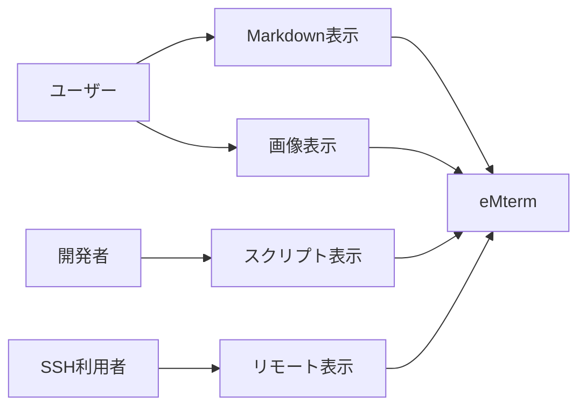
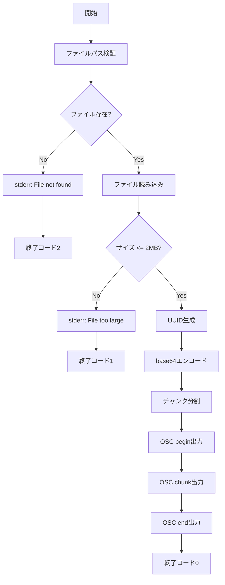
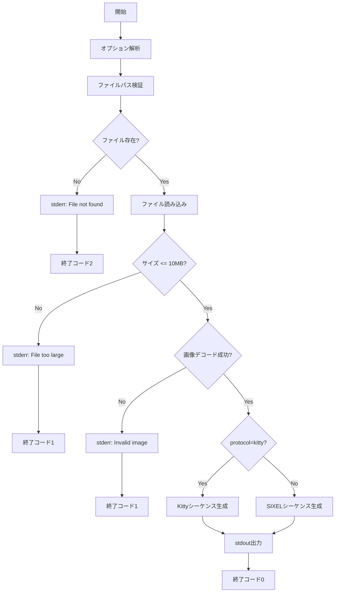
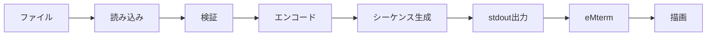

# CLI表示コマンド (markdown/image) - 要件定義書

## 1. 概要

### 1.1 背景
eMtermは画像やMarkdownをターミナル内にリッチ表示する機能を持つが、これらの機能を利用するためには適切な制御シーケンス（OSC）を出力する必要がある。ユーザーやスクリプトが手動でOSCシーケンスを構築するのは煩雑であり、エラーが発生しやすい。

### 1.2 目的
Markdownファイルおよび画像ファイルをeMtermで表示するための制御シーケンスを生成する専用CLIコマンドを提供し、以下を実現する：

- ユーザーが簡単にリッチコンテンツをターミナルに表示できる
- シェルスクリプトからプログラマティックに利用できる
- SSH経由のリモート環境からローカルのeMtermにコンテンツを表示できる

### 1.3 スコープ
本タスクでは以下の2つのサブコマンドを実装する：

- `emterm markdown <file>` - Markdown表示用OSCシーケンスの生成
- `emterm image <file>` - 画像表示用OSCシーケンスの生成

## 2. ビジネス要件

### 2.1 ビジネス目標
- 開発者体験の向上：eMtermのリッチ表示機能を簡単に利用可能にする
- 自動化の促進：CI/CDやシェルスクリプトでの活用を可能にする
- リモート活用：SSH接続先からローカルターミナルへのリッチコンテンツ表示を実現

### 2.2 対象ユーザー
| ユーザータイプ | 説明 |
|----------------|------|
| 開発者 | シェルスクリプトやCI/CDパイプラインでリッチ表示を活用 |
| エンドユーザー | コマンドラインから直接Markdown/画像を閲覧 |
| SSH利用者 | リモートサーバーからローカルのeMtermに表示 |

### 2.3 期待される効果
- eMtermのユニークな機能の利便性向上
- ドキュメント表示やビジュアルフィードバックの改善
- 開発ワークフローの効率化

## 3. ユースケース

### 3.1 ユースケース一覧
| ID | ユースケース名 | アクター | 優先度 |
|----|----------------|----------|--------|
| UC01 | Markdownファイルを表示 | 開発者/エンドユーザー | 高 |
| UC02 | 画像ファイルを表示 | 開発者/エンドユーザー | 高 |
| UC03 | シェルスクリプトからの表示 | 開発者 | 高 |
| UC04 | SSH経由でのリモート表示 | SSH利用者 | 中 |

### 3.2 ユースケース詳細

#### UC01: Markdownファイルを表示

**アクター**: 開発者/エンドユーザー

**事前条件**:
- eMtermがインストールされている
- 表示対象のMarkdownファイルが存在する
- eMtermで実行している

**基本フロー**:
1. ユーザーが `emterm markdown README.md` を実行
2. コマンドがファイルを読み込む
3. Markdown内容をbase64エンコード
4. OSC 777シーケンスを生成（begin, chunk(s), end）
5. シーケンスをstdoutに出力
6. eMtermがシーケンスを解釈してMarkdownを描画

**代替フロー**:
- ファイルが存在しない場合：エラーメッセージを表示して終了（終了コード2）
- ファイルサイズが2MBを超える場合：エラーメッセージを表示して終了（終了コード1）
- eMterm以外のターミナルで実行：シーケンスが無視される（害なし）

**事後条件**:
- Markdownがターミナル内にHTMLとして描画される
- スクロール位置は新しい表示内容の末尾

#### UC02: 画像ファイルを表示

**アクター**: 開発者/エンドユーザー

**事前条件**:
- eMtermがインストールされている
- 表示対象の画像ファイルが存在する（PNG/JPEG/GIF/WebP）
- eMtermで実行している

**基本フロー**:
1. ユーザーが `emterm image photo.png` を実行
2. コマンドが画像ファイルを読み込む
3. 画像をbase64エンコード
4. Kitty Graphics Protocolシーケンスを生成
5. シーケンスをstdoutに出力
6. eMtermがシーケンスを解釈して画像を描画

**代替フロー**:
- `--protocol=sixel` オプション指定時：SIXELフォーマットで出力
- ファイルが存在しない場合：エラーメッセージを表示して終了（終了コード2）
- 画像デコード失敗：エラーメッセージを表示して終了（終了コード1）
- ファイルサイズが10MBを超える場合：エラーメッセージを表示して終了（終了コード1）

**事後条件**:
- 画像がターミナル内にインライン表示される

#### UC03: シェルスクリプトからの表示

**アクター**: 開発者

**事前条件**:
- シェルスクリプト内でeMtermコマンドが利用可能

**基本フロー**:
1. スクリプトが処理結果をMarkdown/画像として生成
2. `emterm markdown report.md` または `emterm image graph.png` を実行
3. ターミナルに結果が表示される

**事後条件**:
- スクリプトの実行結果が視覚的に確認できる

#### UC04: SSH経由でのリモート表示

**アクター**: SSH利用者

**事前条件**:
- ローカルでeMtermを使用
- SSHでリモートサーバーに接続
- リモート環境にemtermコマンドがインストールされている

**基本フロー**:
1. SSH経由でリモートサーバーにログイン
2. リモートで `emterm markdown doc.md` を実行
3. OSCシーケンスがSSH経由でローカルのeMtermに送信される
4. ローカルのeMtermで描画される

**事後条件**:
- リモートのファイルがローカルのターミナルに表示される

**ユースケース図**:


## 4. 機能要件

### 4.1 機能一覧
| ID | 機能名 | 説明 | 優先度 |
|----|--------|------|--------|
| F01 | Markdown OSC生成 | Markdownファイルを読み込みOSC 777シーケンスを生成 | 高 |
| F02 | 画像プロトコル生成 | 画像ファイルを読み込みKitty/SIXELシーケンスを生成 | 高 |
| F03 | ファイルサイズ検証 | サイズ制限を超えるファイルを拒否 | 高 |
| F04 | エラーハンドリング | 適切なエラーメッセージと終了コード | 高 |
| F05 | プロトコル選択 | 画像表示プロトコルの選択オプション | 中 |

### 4.2 機能詳細

#### F01: Markdown OSC生成

**説明**: MarkdownファイルをGitHub Flavored Markdown (GFM) として解釈し、eMterm独自のOSC 777シーケンスを生成する

**コマンド構文**:
```bash
emterm markdown <file-path>
```

**入力**:
- `<file-path>`: string - Markdownファイルのパス（相対パスまたは絶対パス）

**出力**:
- stdout: OSC 777シーケンス（begin, chunk(s), end）
- stderr: エラーメッセージ（エラー時のみ）
- 終了コード: 0（成功）、1（一般エラー）、2（ファイルI/Oエラー）

**処理フロー**:


**OSCシーケンス形式**:
```
ESC ] 777 ; emterm ; markdown ; begin ; id=<uuid> ; format=gfm ; render=block ; version=1.0 ESC \
ESC ] 777 ; emterm ; markdown ; chunk ; id=<uuid> ; seq=0 ; data=<base64> ESC \
ESC ] 777 ; emterm ; markdown ; chunk ; id=<uuid> ; seq=1 ; data=<base64> ESC \
...
ESC ] 777 ; emterm ; markdown ; end ; id=<uuid> ESC \
```

**ビジネスルール**:
- ファイルパスは相対パスの場合、カレントディレクトリからの相対パス
- シンボリックリンクは追跡する
- base64データは1チャンクあたり最大64KBに分割
- UUIDはv4形式

**バリデーション**:
| 項目 | ルール | エラーメッセージ |
|------|--------|------------------|
| ファイルパス | 存在するファイルであること | Error: File not found: {path} |
| ファイルサイズ | 2MB以下 | Error: File size exceeds 2MB limit |
| ファイル読み込み | 読み込み可能 | Error: Failed to read file: {path} |

**エラーケース**:
| エラー | 条件 | 対応 |
|--------|------|------|
| ファイル未存在 | 指定パスにファイルがない | stderr出力、終了コード2 |
| サイズ超過 | ファイルサイズ > 2MB | stderr出力、終了コード1 |
| 読み込み失敗 | 権限不足など | stderr出力、終了コード2 |
| メモリ不足 | エンコード時のメモリ確保失敗 | stderr出力、終了コード1 |

#### F02: 画像プロトコル生成

**説明**: 画像ファイルを読み込み、指定されたプロトコル（Kitty Graphics Protocol または SIXEL）の制御シーケンスを生成する

**コマンド構文**:
```bash
emterm image [OPTIONS] <file-path>
```

**入力**:
- `<file-path>`: string - 画像ファイルのパス
- `--protocol`: enum (kitty|sixel) - 使用するプロトコル（デフォルト: kitty）

**出力**:
- stdout: Kitty Graphics Protocol または SIXELシーケンス
- stderr: エラーメッセージ（エラー時のみ）
- 終了コード: 0（成功）、1（一般エラー）、2（ファイルI/Oエラー）

**処理フロー**:


**Kitty Graphics Protocol形式**:
```
ESC ] _G f=100,a=T,m=1 ; <base64-chunk-1> ESC \
ESC ] _G m=1 ; <base64-chunk-2> ESC \
...
ESC ] _G m=0 ; <base64-chunk-last> ESC \
```

**SIXEL形式**:
```
ESC P q <sixel-data> ESC \
```

**ビジネスルール**:
- 対応フォーマット: PNG, JPEG, GIF, WebP
- SVGは非対応
- 画像は元のサイズで送信（リサイズは行わない）
- Kittyプロトコルではbase64エンコード、SIXELでは専用エンコード

**バリデーション**:
| 項目 | ルール | エラーメッセージ |
|------|--------|------------------|
| ファイルパス | 存在するファイルであること | Error: File not found: {path} |
| ファイルサイズ | 10MB以下 | Error: File size exceeds 10MB limit |
| 画像フォーマット | PNG/JPEG/GIF/WebP | Error: Unsupported image format |
| プロトコル指定 | kitty または sixel | Error: Invalid protocol: {value} |

**エラーケース**:
| エラー | 条件 | 対応 |
|--------|------|------|
| ファイル未存在 | 指定パスにファイルがない | stderr出力、終了コード2 |
| サイズ超過 | ファイルサイズ > 10MB | stderr出力、終了コード1 |
| 非対応フォーマット | PNG/JPEG/GIF/WebP以外 | stderr出力、終了コード1 |
| デコード失敗 | 画像ファイルが破損 | stderr出力、終了コード1 |
| 無効なオプション | 不明なオプション指定 | stderr出力、終了コード1 |

#### F03: ファイルサイズ検証

**説明**: ファイル読み込み前にサイズを確認し、制限を超える場合は処理を中断する

**入力**:
- ファイルパス

**出力**:
- 検証結果: bool（true=制限内、false=制限超過）

**制限値**:
- Markdownファイル: 2MB
- 画像ファイル: 10MB

**処理**:
1. ファイルのメタデータを取得
2. サイズを制限値と比較
3. 超過している場合はエラー

#### F04: エラーハンドリング

**説明**: すべてのエラーケースで適切なメッセージと終了コードを提供

**エラーメッセージ形式**:
```
Error: {error-description}
```

**終了コード定義**:
| コード | 意味 | 使用ケース |
|--------|------|-----------|
| 0 | 成功 | 正常終了 |
| 1 | 一般エラー | サイズ超過、フォーマット不正、デコード失敗 |
| 2 | ファイルI/Oエラー | ファイル未存在、読み込み失敗、権限不足 |

**エラー出力先**: stderr

#### F05: プロトコル選択

**説明**: 画像表示時に使用するプロトコルを選択可能にする

**オプション**:
```bash
--protocol=kitty    # Kitty Graphics Protocol（デフォルト）
--protocol=sixel    # SIXEL
```

**デフォルト動作**: Kitty Graphics Protocol

**検証**: 無効なプロトコル名を指定した場合はエラー

## 5. 非機能要件

### 5.1 パフォーマンス要件
- **小ファイル（< 100KB）の処理時間**: 50ms以内
- **大ファイル（1-2MB Markdown）の処理時間**: 500ms以内
- **大画像（5-10MB）の処理時間**: 1秒以内
- **メモリ使用量**: ファイルサイズの3倍以内（エンコード処理用）

### 5.2 セキュリティ要件
- **パストラバーサル防止**: ファイルパスの正規化を行う
- **シンボリックリンク**: 追跡を許可（ただし循環参照のチェック不要）
- **入力検証**: すべてのコマンドライン引数を検証
- **データエンコード**: base64エンコード時のメモリ安全性を確保

### 5.3 可用性要件
- **互換性**: eMterm以外のターミナルで実行しても害を及ぼさない
- **エラー回復**: ファイル読み込み失敗時もプロセスが異常終了しない

### 5.4 保守性要件
- **ログ出力**: エラー時のみstderrに出力（通常時はログなし）
- **コードドキュメント**: Rust docコメントを記述
- **テスト**: ユニットテストとインテグレーションテストを含む

### 5.5 互換性要件
- **Rustバージョン**: プロジェクトのMSRV（Minimum Supported Rust Version）に準拠
- **OSサポート**: Linux, macOS, Windows（Tauriがサポートする全プラットフォーム）
- **バージョン管理**: OSCシーケンスにバージョン番号（1.0）を含める

## 6. UI/UX要件

### 6.1 コマンドライン設計要件
- **シンプルさ**: 最小限のオプションでデフォルトで動作
- **一貫性**: markdown/imageで同様のコマンド構造
- **明確性**: エラーメッセージは原因と対処法を含む

### 6.2 ヘルプメッセージ
```bash
$ emterm markdown --help
Display Markdown file in eMterm

Usage: emterm markdown <FILE>

Arguments:
  <FILE>  Path to Markdown file

Options:
  -h, --help  Print help
```

```bash
$ emterm image --help
Display image file in eMterm

Usage: emterm image [OPTIONS] <FILE>

Arguments:
  <FILE>  Path to image file

Options:
      --protocol <PROTOCOL>  Image protocol to use [default: kitty] [possible values: kitty, sixel]
  -h, --help                 Print help
```

## 7. データ要件

### 7.1 データフロー概要


### 7.2 データ形式

#### Markdown OSCデータ項目
| パラメータ | 型 | 必須 | 説明 |
|------------|-----|------|------|
| id | UUID v4 | ○ | セッション識別子 |
| format | string | ○ | 常に "gfm" |
| render | string | ○ | 常に "block" |
| version | string | ○ | 常に "1.0" |
| seq | integer | ○ | チャンク連番（0始まり） |
| data | base64 | ○ | Markdown内容（base64） |

#### 画像データ項目
| パラメータ | 型 | 説明 |
|------------|-----|------|
| ファイル形式 | PNG/JPEG/GIF/WebP | 対応フォーマット |
| エンコード | base64 (Kitty) / SIXEL | プロトコル依存 |

### 7.3 データ保持期間
- **CLI実行中のみ**: プロセス終了後はメモリ解放
- **永続化なし**: ファイルやキャッシュへの保存は行わない

## 8. 外部連携

### 8.1 連携システム
| システム名 | 連携方法 | データ |
|------------|----------|--------|
| eMterm本体 | stdout経由のOSCシーケンス | Markdown/画像表示コマンド |
| ファイルシステム | Rustの標準I/O | ファイル読み込み |

### 8.2 OSCシーケンス仕様

#### Markdown OSC 777
- **名前空間**: emterm
- **サブコマンド**: markdown
- **verbs**: begin, chunk, end
- **エスケープシーケンス**: `ESC ] 777 ; ... ESC \`

#### Kitty Graphics Protocol
- **制御シーケンス**: `ESC ] _G ... ESC \`
- **転送モード**: base64
- **アクション**: 直接表示（a=T）

#### SIXEL
- **制御シーケンス**: `ESC P q ... ESC \`
- **カラーモード**: RGB

## 9. 制約条件

### 9.1 技術的制約
- Rustの標準ライブラリとcratesエコシステムに依存
- base64エンコードによるデータサイズ増加（約133%）
- SIXELエンコードの処理コスト

### 9.2 ビジネス上の制約
- eMterm専用機能（他のターミナルでは表示されない）
- ファイルサイズ制限による大容量コンテンツの制約

### 9.3 スケジュール制約
- （該当なし）

## 10. 想定される課題とリスク

### 10.1 技術的課題
| 課題 | 影響度 | 対応策 |
|------|--------|--------|
| 大きな画像のエンコード時間 | 中 | プログレス表示またはストリーミング処理の検討 |
| base64によるサイズ増加 | 低 | ユーザーにサイズ制限を明示 |
| SIXEL対応の複雑さ | 中 | ライブラリの活用、最小限の実装 |

### 10.2 ビジネスリスク
| リスク | 発生確率 | 影響度 | 対応策 |
|--------|----------|--------|--------|
| 他ターミナルでの誤動作 | 低 | 低 | OSCシーケンスは無視される設計 |
| サイズ制限による不満 | 中 | 中 | ドキュメントで制限を明示、必要に応じて緩和 |

## 11. 成功基準

### 11.1 受け入れ基準
- [ ] `emterm markdown <file>` が正しいOSCシーケンスを出力する
- [ ] `emterm image <file>` がKitty/SIXELシーケンスを出力する
- [ ] ファイル未存在時に適切なエラーメッセージを表示する
- [ ] サイズ制限を超えるファイルを拒否する
- [ ] 終了コードが仕様通りに設定される
- [ ] `--protocol` オプションで画像プロトコルを選択できる
- [ ] eMtermで実際にMarkdown/画像が表示される
- [ ] ユニットテストがすべてパスする

### 11.2 KPI
| 指標 | 目標値 | 測定方法 |
|------|--------|----------|
| テストカバレッジ | 80%以上 | cargo tarpaulin |
| 小ファイル処理時間 | 50ms以内 | ベンチマークテスト |
| エラー時の適切な終了コード | 100% | インテグレーションテスト |

## 12. テストシナリオ

### 12.1 テスト観点
- [ ] **正常系**: 標準的なMarkdown/画像ファイルの表示
- [ ] **異常系**: ファイル未存在、サイズ超過、フォーマット不正
- [ ] **境界値**: ギリギリのサイズ（2MB/10MB）、空ファイル
- [ ] **セキュリティ**: パストラバーサル、シンボリックリンク
- [ ] **パフォーマンス**: 大ファイルの処理時間

### 12.2 具体的なテストケース

#### Markdownコマンド
1. **正常系**:
   - 小さなMarkdownファイル（< 1KB）を表示
   - 中程度のMarkdownファイル（100KB）を表示
   - GFM機能（テーブル、タスクリスト）を含むファイルを表示

2. **異常系**:
   - 存在しないファイルパスを指定
   - 2MBを超えるファイルを指定
   - 読み込み権限のないファイルを指定

3. **境界値**:
   - ちょうど2MBのファイル
   - 空ファイル（0バイト）

#### 画像コマンド
1. **正常系**:
   - PNG画像の表示（Kittyプロトコル）
   - JPEG画像の表示（Kittyプロトコル）
   - GIF画像の表示（SIXELプロトコル）
   - WebP画像の表示

2. **異常系**:
   - 存在しないファイルパスを指定
   - 10MBを超えるファイルを指定
   - 非画像ファイル（テキストファイルなど）を指定
   - 破損した画像ファイルを指定

3. **境界値**:
   - ちょうど10MBの画像
   - 1x1ピクセルの最小画像

#### オプション
1. `--protocol=kitty` の動作確認
2. `--protocol=sixel` の動作確認
3. 無効なプロトコル指定時のエラー

## 13. 用語定義

| 用語 | 定義 |
|------|------|
| OSC | Operating System Command - ANSI制御シーケンスの一種 |
| ESC | エスケープ文字（0x1B） |
| ST | String Terminator - OSCシーケンスの終端（ESC \） |
| Kitty Graphics Protocol | Kittyターミナルで定義された画像表示プロトコル |
| SIXEL | DEC端末由来の画像表示フォーマット |
| GFM | GitHub Flavored Markdown |
| base64 | バイナリデータをASCII文字列に変換するエンコード方式 |
| UUID v4 | ランダム生成される一意識別子 |

## 14. 確認事項

### 14.1 確認済み事項

ユーザーとの対話で確認した内容:

- [x] **入力形式**: 引数のみ（`emterm markdown file.md`）、stdin非対応
- [x] **画像プロトコル**: `--protocol=kitty/sixel` オプションで選択可能、デフォルトはKitty
- [x] **Markdownフォーマット**: GFM (GitHub Flavored Markdown)、テーブル・タスクリスト対応
- [x] **CLIオプション**: 最小限、シンプルさ重視
- [x] **対応画像形式**: PNG, JPEG, GIF, WebP
- [x] **画像サイズ制限**: 10MB
- [x] **Markdownサイズ制限**: 2MB（機能設計書通り）
- [x] **終了コード**: 0=成功, 1=一般エラー, 2=ファイルI/Oエラー
- [x] **バージョン**: 1.0
- [x] **エラー出力**: stderr
- [x] **タイムアウト**: CLI側では不要（ターミナル側で管理）

### 14.2 未確認・保留事項
- [ ] 画像の自動リサイズ機能の必要性（将来的な拡張）
- [ ] Markdownレンダリングエンジンの詳細仕様（フロントエンド実装時に決定）
- [ ] プログレスバー表示の必要性

## 15. 参考資料

- 機能設計書: `tmp/` ディレクトリ内の設計ドキュメント
- Kitty Graphics Protocol: https://sw.kovidgoyal.net/kitty/graphics-protocol/
- SIXEL仕様: https://vt100.net/docs/vt3xx-gp/chapter14.html
- GitHub Flavored Markdown仕様: https://github.github.com/gfm/
- OSC制御シーケンス: ANSI/VT100仕様
