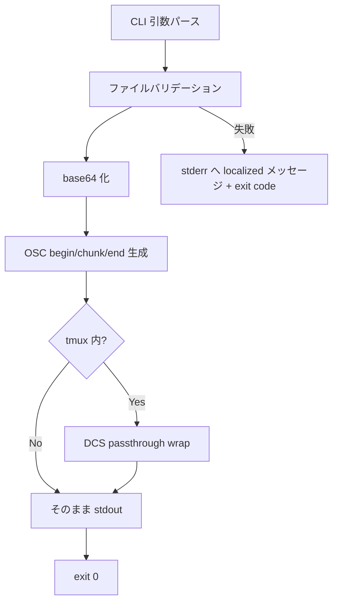
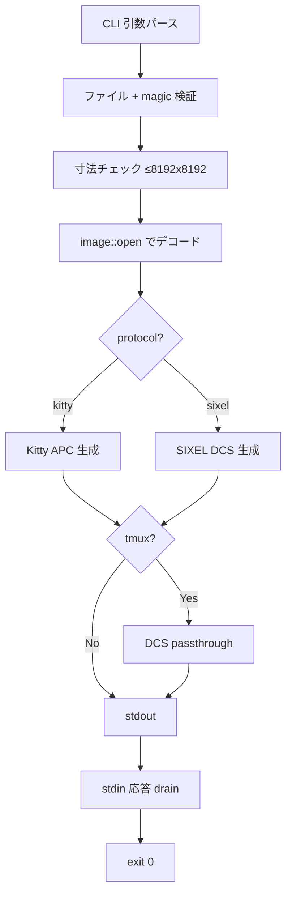

# native-poc CLI サブコマンド移植 - 要件定義書

## 1. 概要

### 1.1 背景

`refactor/native-terminal-hybrid` ブランチで進行中の native-poc バイナリ
(`emterm-native-poc`) は、ターミナル本体・mux・viewer 子プロセス機能を備えるが、
WebView 版 (`src-tauri`) が持つ OSC エミッタ CLI サブコマンド
(`emterm markdown` / `emterm image` / `emterm json` / `emterm yaml`) を
持たない。

現状の native-poc は `--viewer` / `--settings` / `--image-viewer` /
`--data-viewer` といった子プロセスフラグだけを処理しており、動作確認時は
system-installed の WebView 版バイナリを叩いて OSC を流している。
native-poc を WebView 版から独立したバイナリにするには、CLI 経由で OSC を
発火する経路を持つ必要がある。

### 1.2 目的

native-poc バイナリ単体で、WebView 版相当の CLI サブコマンドを提供する。
これにより `./emterm-native-poc markdown foo.md` のような操作で
OSC 777 emterm シーケンスを stdout に出力でき、native-poc 受信側
(viewer/markdown.rs, viewer/data.rs 等) と接続して単独動作が可能になる。

### 1.3 スコープ

本 SDD タスクは **Phase A + Phase B** を対象とする。

- **Phase A**: `markdown` / `json` / `yaml` サブコマンド移植
- **Phase B**: `image` サブコマンド移植 (Kitty + SIXEL 両 encoder)
- **Phase C** (対象外): `markdown --interactive` の stdin loop
  (`navigate` / `image` / `quit` 入力受付)。viewer ↔ CLI IPC の再設計が必要なため
  別 SDD タスクへ切り出す
- **Phase D** (対象外): `download` サブコマンド。受信側 OSC dispatch が
  native-poc に存在しないため別 SDD タスクへ切り出す
- **mux 系サブコマンド** (対象外): `app_lib::mux::cli` は別の巨大サブシステムで、
  別タスク

WebView 版 (`src-tauri`) には変更を加えない (one-way merge: main → native ブランチ)。

## 2. ビジネス要件

### 2.1 ビジネス目標

native-poc を「WebView 版バイナリに依存せず単独で動く CLI 兼ターミナル」
として完成形に近づける。CLI サブコマンドが揃わない限り、native-poc を
単体配布バイナリとして PoC 卒業へ進められない。

### 2.2 対象ユーザー

| ユーザータイプ | 説明 |
|----------------|------|
| native-poc 開発者 | native-poc 単体でのテスト・デモを行う |
| エンドユーザー (将来) | `emterm markdown foo.md` で .md を即座にリッチ表示する |
| CI / Docker E2E | viewer 動作確認のための OSC 発火経路として利用 |

### 2.3 期待される効果

- WebView 版を起動せずに native-poc 単独で OSC 検証が可能になる
- viewer/markdown.rs · viewer/data.rs のテストデータ生成が CLI でできる
- 将来 WebView 版を廃止しても CLI 機能が失われない

## 3. ユースケース

### 3.1 ユースケース一覧

| ID | ユースケース名 | アクター | 優先度 |
|----|----------------|----------|--------|
| UC01 | Markdown ファイルを viewer で開く | ユーザー | 高 |
| UC02 | JSON ファイルを data viewer で開く | ユーザー | 高 |
| UC03 | YAML ファイルを data viewer で開く | ユーザー | 高 |
| UC04 | 画像を Kitty/SIXEL でインライン表示する | ユーザー | 高 |
| UC05 | tmux セッション内から CLI を使う | ユーザー | 中 |

### 3.2 ユースケース詳細

#### UC01: Markdown ファイルを viewer で開く

**アクター**: ユーザー (シェル上の人 or AI)

**事前条件**:
- native-poc ターミナル内で実行している (TTY 検出)
- 対象 .md ファイルが読める

**基本フロー**:
1. ユーザーが `emterm-native-poc markdown foo.md` を実行
2. ファイルサイズ・パスバリデーション (最大 10MB)
3. 内容を base64 化し、OSC 777 emterm;markdown;begin/chunk/end を stdout 出力
4. 親 PTY (= native-poc tabs.rs) が OSC を受信し、viewer 子プロセスを起動
5. viewer ウィンドウで Markdown がレンダリングされる

**代替フロー**:
- ファイル不在: stderr に "File not found" 等のメッセージを localized 出力、終了コード非ゼロ
- サイズ超過: "File too large" メッセージ、終了コード非ゼロ
- tmux 内: OSC を DCS passthrough (`ESC P tmux; ... ESC \`) で wrap

**事後条件**:
- viewer ウィンドウが Markdown を表示している
- CLI プロセスは exit 0 で終了

#### UC02: JSON ファイルを data viewer で開く

**アクター**: ユーザー

**事前条件**:
- 対象 JSON ファイルが読める (構文検証は OSC 受信側が行う)

**基本フロー**:
1. `emterm-native-poc json a.json`
2. ファイルバリデーション
3. OSC 777 emterm;json;begin/chunk/end を stdout 出力
4. tabs.rs → viewer/data.rs が data window を起動

**代替フロー**:
- 不正 JSON 構文: バリデーションはしないが、サイズ・パス制約は適用

**事後条件**:
- data viewer が JSON outline を表示

#### UC03: YAML ファイルを data viewer で開く

UC02 と同じ流れ。サブコマンドが `yaml`、OSC verb が `yaml` になる。

#### UC04: 画像を Kitty/SIXEL でインライン表示する

**アクター**: ユーザー

**事前条件**:
- 対象画像ファイル (PNG/JPEG/GIF/WebP) が読める
- 画像サイズ 10MB 以下、寸法 8192x8192 以下

**基本フロー**:
1. `emterm-native-poc image foo.png` または `--protocol sixel`
2. ファイル + magic byte 検証
3. `image::open` でデコード、Kitty (APC) または SIXEL (DCS) 列を生成
4. stdout 出力 (tmux 内なら DCS passthrough で wrap)
5. (Unix のみ) stdin から OK 応答バイトを drain
6. 親 PTY が APC/DCS をパースして画像描画

**代替フロー**:
- `--protocol` が `kitty`/`sixel` 以外: InvalidProtocol エラー
- 寸法超過: decompression bomb 検出としてエラー終了
- 不明 magic: 不正画像エラー

**事後条件**:
- ターミナルにインライン画像が表示される

#### UC05: tmux セッション内から CLI を使う

**アクター**: ユーザー

**事前条件**:
- 環境変数 `TMUX` が set
- tmux 側で `set -g allow-passthrough on`

**基本フロー**:
1. 上記 UC01〜UC04 のいずれかを実行
2. CLI が `$TMUX` を検出
3. 生成した OSC/APC/DCS を `ESC P tmux; <inner> ESC \` で包む
4. tmux が passthrough して外側のターミナル (= native-poc) に渡す

**事後条件**:
- tmux 越しでも viewer/画像が動作する

## 4. 機能要件

### 4.1 機能一覧

| ID | 機能名 | 説明 | 優先度 |
|----|--------|------|--------|
| F01 | markdown サブコマンド | .md → OSC 777 markdown 列 | 高 (Phase A) |
| F02 | json サブコマンド | .json → OSC 777 json 列 | 高 (Phase A) |
| F03 | yaml サブコマンド | .yaml → OSC 777 yaml 列 | 高 (Phase A) |
| F04 | image サブコマンド | 画像 → Kitty APC または SIXEL DCS | 高 (Phase B) |
| F05 | CLI 引数パース | clap でサブコマンド/オプションを解釈 | 高 |
| F06 | tmux DCS passthrough | TMUX env 検出時に wrap | 高 |
| F07 | エラーメッセージ localization | locale (Ja/En) に応じてメッセージ切替 | 中 |
| F08 | session_id 採番 | uuid v4 で OSC session_id を生成 | 高 |
| F09 | main.rs dispatch 追加 | `--viewer` 系の前に CLI 分岐を挿入 | 高 |

### 4.2 機能詳細

#### F01: markdown サブコマンド

**説明**:
WebView 版 `src-tauri/src/commands/markdown.rs` の `execute_markdown_command`
を移植する。interactive loop (`navigate` / `image` / `quit` 入力受付) は
Phase C 送りとする。

**入力**:
- `file`: PathBuf - 対象 .md ファイル

**出力**:
- stdout: OSC 777 emterm;markdown;begin → chunk* → end 列
- exit code: 0 (成功), 非ゼロ (エラー)

**処理フロー**:


**ビジネスルール**:
- ファイルサイズ上限: 10MB (`MAX_MARKDOWN_SIZE`)
- 埋め込み画像サイズ上限: 50MB (`MAX_IMAGE_SIZE`、markdown 内画像用)
- chunk サイズ: 128KB
- session_id は uuid v4 で毎回生成

**バリデーション**:
| 項目 | ルール | エラー |
|------|--------|--------|
| ファイル存在 | exists | FileNotFound |
| サイズ | ≤ 10MB | FileTooLarge |
| 読み取り権限 | readable | PermissionDenied (IoError 経由) |

#### F02 / F03: json / yaml サブコマンド

WebView 版 `commands/json.rs` (84 行) / `commands/yaml.rs` (84 行) と
同等。OSC verb と Content-Type が `json` / `yaml` になる以外、構造は同じ。
ファイルサイズ上限**は無し** (src-tauri 実装も無制限)。chunk サイズは
128KB (`JSON_CHUNK_SIZE` / `YAML_CHUNK_SIZE`)。

#### F04: image サブコマンド

**説明**:
WebView 版 `commands/image.rs` 相当。`--protocol kitty` (default) または
`--protocol sixel` で出力プロトコルを選ぶ。両 encoder
(`protocols/kitty.rs` 173 行, `protocols/sixel.rs` 378 行) を移植する。

**入力**:
- `file`: PathBuf - 対象画像
- `--protocol`: "kitty" (default) | "sixel"

**出力**:
- stdout: Kitty APC または SIXEL DCS 列

**処理フロー**:


**ビジネスルール**:
- ファイルサイズ上限: 10MB
- 寸法上限: 8192x8192 (decompression bomb 防止)
- Kitty 出力後の stdin drain は Unix 限定 (`#[cfg(unix)]`)

#### F05: CLI 引数パース

**説明**:
clap 4.x を新規導入し、サブコマンド分岐とフラグ (`--protocol`) を扱う。

**実装方針**:
- ヘルプテキスト・エラーメッセージは locale に応じて切替 (F07 と連携)
- 既存 `--viewer` / `--settings` / `--image-viewer` / `--data-viewer` などの
  子プロセスフラグは clap の subcommand には含めず、引数の手書きディスパッチを
  維持する。CLI サブコマンド (`markdown` 等) と内部フラグ (`--viewer` 等) を
  混在させない (F09 と連携)

#### F06: tmux DCS passthrough

**説明**:
WebView 版 `commands/tmux.rs` (232 行) をそのまま移植。`TMUX` env が set
されていれば OSC/APC/DCS 列を `ESC P tmux; ... ESC \` で wrap。

#### F07: エラーメッセージ localization

**説明**:
WebView 版は `rust-i18n` + `t!("cli.markdownAbout")` を使うが、native-poc は
`rust-i18n` を採用しない。native-poc の既存 `crate::i18n` (Locale::En/Ja)
と `crate::i18n::resolve()` を使い、各メッセージは `match locale { Ja =>
"...", En => "..." }` で切替える。

**実装方針**:
- CLI 用のメッセージ集約モジュール (例: `native-poc/src/cli/messages.rs`)
  を新設し、関数ごとに `pub fn xxx(locale: Locale) -> &'static str` を提供
- error 型 (CommandError) は `Display` impl を locale 引数なしの版で残しつつ、
  CLI ディスパッチ側でメッセージ整形時に locale を渡す形にする
- WebView 版 `src-tauri/locales/{en,ja}.json` の `cli.*` セクションを参照しつつ、
  native-poc 側は Rust ソースに直書きで持つ

#### F08: session_id 採番

**説明**:
uuid 1.x の `Uuid::new_v4()` を使う。WebView 版と完全互換。

依存追加: `uuid = { version = "1", features = ["v4"] }`

#### F09: main.rs dispatch 追加

**説明**:
既存の `--viewer` / `--settings` / `--image-viewer` / `--data-viewer` 系
ディスパッチの**前**に CLI サブコマンドの判定を入れる。

```rust
// 概念 (実コードは SPEC.md 参照)
let args: Vec<String> = std::env::args().collect();
if let Some(arg1) = args.get(1).map(|s| s.as_str()) {
    if matches!(arg1, "markdown" | "json" | "yaml" | "image") {
        return crate::cli::run(&args[1..]);
    }
}
// 既存の子プロセスフラグ判定へフォールスルー
```

CLI サブコマンドは `--` 始まりではないので、`--viewer` 等と衝突しない。

## 5. 非機能要件

### 5.1 パフォーマンス要件

- markdown CLI: 100KB の .md → OSC 出力完了まで 200ms 以内
- image CLI: 1MB PNG → Kitty 列出力完了まで 500ms 以内
  (WebView 版と同等)
- json/yaml CLI: 100KB JSON → OSC 出力完了まで 200ms 以内

### 5.2 セキュリティ要件

- ファイルサイズ上限を強制 (markdown 10MB / image 10MB / json・yaml は無制限 = src-tauri 準拠)
- 画像寸法上限を強制 (8192x8192) — decompression bomb 防止
- image サブコマンドは `file::open_and_validate_file` + in-memory buffer 経由で TOCTOU 完全排除。markdown / json / yaml は src-tauri 同等の `canonicalize` + `File::open` パターンを維持 (race window あり、fd 経由の size check で実害は最小化、SPEC NFR2 参照)
- Kitty/SIXEL 列に外部入力 (ファイル中身) をそのまま埋め込む箇所は無し
  (常に base64 / DCS escape 通過)

### 5.3 可用性要件

該当なし (CLI ワンショットコマンド)。

### 5.4 保守性要件

- ログ: 既存 `log` クレート経由。CLI は基本 stdout/stderr のみ
- 移植コードは可能な限り src-tauri 版と同じ関数名・モジュール名を維持
  (将来 `crates/` 切り出し時のマージ容易性のため)
- 各サブコマンド単体の単体テストを移植

### 5.5 互換性要件

- OS: Linux + Windows (native-poc サポート対象と同じ)
- OSC/APC/DCS 仕様: WebView 版と同一 (session_id・chunk サイズ・verb 名)
- tmux passthrough: `set -g allow-passthrough on` 前提

## 6. UI/UX要件

CLI ツールなので画面 UI は無し。

stdout/stderr 出力フォーマットは src-tauri 版に合わせる:
- 成功時: stdout に OSC のみ (装飾文字なし)
- 失敗時: stderr に `Error: <localized message>` + exit code

ヘルプテキスト (`--help`) は clap 標準フォーマット。サブコマンドごとの
`about` 文字列は locale 切替。

## 7. データ要件

### 7.1 データモデル概要

CLI はステートレスなので永続データなし。一時的に扱うデータ:
- 入力: 対象ファイル (path)
- 出力: stdout への OSC/APC/DCS 列
- 内部: base64 エンコード結果、画像 DynamicImage

### 7.2 データ項目

| エンティティ | 項目名 | 型 | 説明 |
|--------------|--------|-----|------|
| OSC payload | session_id | UUID v4 | viewer 側でユニーク判定 |
| OSC payload | chunk_index | u32 | 0-based 連番 |
| OSC payload | total_chunks | u32 | 総 chunk 数 |
| OSC payload | content | base64 | エンコード後ペイロード |

## 8. 外部連携

該当なし (単独 CLI)。受信側 (viewer/markdown.rs 等) は同じ native-poc
プロセス内で動く。

## 9. 制約条件

### 9.1 技術的制約

- **rust-i18n クレートは追加しない**: native-poc の依存最小化方針
  (`git_branch.rs` の "sdd no-new-deps" コメント) に準拠
- **依存追加は最小限**: 新規追加は `clap 4.x` (CLI parser) と
  `uuid 1.x` (session_id) のみ。`tempfile` は dev-deps として追加
- **image encoder は src-tauri/protocols/ から直接コピー**:
  `term_images` crate に encoder を追加する案は今回は採用しない
  (パース側との対称性は将来 `crates/` 切り出し時に整理)
- **WebView 版 (`src-tauri`) は変更しない**: refactor/native-terminal-hybrid
  ブランチの方針 (main → 当ブランチの one-way merge)

### 9.2 ビジネス上の制約

- Phase C/D は別 SDD タスクとして切り出し、本タスクには含めない
- mux 系サブコマンドも別タスク

### 9.3 スケジュール制約

特に厳しい締切なし。半日〜1.5日想定。

## 10. 想定される課題とリスク

### 10.1 技術的課題

| 課題 | 影響度 | 対応策 |
|------|--------|--------|
| CommandError の rust-i18n 依存除去 | 中 | locale dispatch を CLI ハンドラ側に寄せる。Display impl は最小化 |
| Kitty APC 後の stdin 応答 drain (Unix のみ) | 中 | `#[cfg(unix)]` で gate し、Windows は no-op |
| OSC chunk サイズの WebView 版との互換性 | 高 | WebView 版定数を移植時に同値で持ち込む。テスト移植で検証 |
| `term_images` crate との重複 (decoder vs encoder) | 低 | コメントで「Phase B 内のコピーは将来 crate 化」と記す |

### 10.2 ビジネスリスク

| リスク | 発生確率 | 影響度 | 対応策 |
|--------|----------|--------|--------|
| WebView 版 src-tauri 側で encoder が今後変わる | 中 | 低 | one-way merge 方針なので追従不要 |
| native-poc が今後さらに廃止になる | 低 | 高 | 既に project_native_poc_goals.md で go/no-go 判断中 |

## 11. 成功基準

### 11.1 受け入れ基準

- [ ] `emterm-native-poc markdown <file>` で OSC 777 markdown 列が
      stdout に出る
- [ ] 出力された OSC を native-poc ターミナル (= 同バイナリ起動状態) に
      流すと viewer/markdown.rs が起動して Markdown が表示される
- [ ] 同様に `json` / `yaml` / `image` サブコマンドが動く
- [ ] `image --protocol sixel` で SIXEL DCS が出る
- [ ] tmux 内実行で DCS passthrough が動く (`TMUX` env set 時)
- [ ] 移植元 (`src-tauri`) のユニットテストが pass する状態で
      native-poc 側に移植されている (markdown 50+ / json 3 / yaml 3 / image 8)
- [ ] `rust-i18n` は依存追加されていない
- [ ] `cargo build --release` (target-host) が通る
- [ ] `cargo test` (target) が通る

### 11.2 KPI

| 指標 | 目標値 | 測定方法 |
|------|--------|----------|
| 追加依存数 | clap + uuid のみ (本番) / tempfile (dev) | `cargo tree` |
| 移植テスト pass 率 | 100% | `cargo test --manifest-path native-poc/Cargo.toml` |
| バイナリサイズ増加 | < 5MB | `ls -la target-host/release/emterm-native-poc` |

## 12. テストシナリオ

### 12.1 テスト観点

- [ ] 正常系: 各サブコマンドが期待する OSC 列を生成する
- [ ] 異常系: ファイル不在 / サイズ超過 / 寸法超過 / 不正 protocol 名
- [ ] 境界値: サイズ上限ぴったり、1px 画像、空ファイル
- [ ] セキュリティ: image は in-memory buffer 経由 TOCTOU 排除 + 寸法 bomb 防止。markdown は src-tauri 同等 race 残存 (SPEC NFR2)
- [ ] tmux: TMUX env set/unset で DCS wrap が切替わる
- [ ] locale: Ja/En で異なるエラーメッセージが出る (env LANG 切替)

### 12.2 受信側結合テスト

native-poc CLI から OSC を出して、同バイナリ内の viewer 受信側で
正しく解釈される結合テスト。E2E スイートに新規ケース追加。

- markdown CLI → viewer/markdown.rs (既存 viewer ウィンドウが Markdown 表示)
- json CLI → viewer/data.rs (data window が JSON outline 表示)
- yaml CLI → 同上
- image CLI (kitty) → 親 PTY の画像描画
- image CLI (sixel) → 親 PTY の画像描画

## 13. 用語定義

| 用語 | 定義 |
|------|------|
| OSC | Operating System Command (ESC ] ... BEL/ST) |
| APC | Application Program Command (ESC _ ... ESC \) |
| DCS | Device Control String (ESC P ... ESC \) |
| OSC 777 emterm | eMterm 独自拡張 OSC verb (markdown/json/yaml/download 等) |
| session_id | OSC のフレーム識別 UUID。begin/chunk/end の対応付け用 |
| tmux passthrough | tmux 越しに ESC シーケンスを外側に通す DCS wrap |
| native-poc | refactor/native-terminal-hybrid の hybrid 実装バイナリ |
| WebView 版 | `src-tauri` ベースの Tauri 実装 |

## 14. 確認事項

### 14.1 確認済み事項

- [x] **スコープ**: Phase A + B (markdown / json / yaml / image) を実装。
      Phase C (interactive) / Phase D (download) / mux は別 SDD
- [x] **CLI parser**: clap 4.x を新規導入する
- [x] **session_id**: uuid 1.x の v4 を新規導入する
- [x] **i18n**: rust-i18n は導入しない。native-poc の crate::i18n と
      `match locale` パターンで書く
- [x] **error 型**: src-tauri の CommandError を移植し、メッセージ整形は
      native-poc 流の locale dispatch に書き換える
- [x] **テスト**: tempfile を dev-deps に追加。src-tauri 側ユニットテスト
      (markdown / json / yaml / image) を移植
- [x] **image encoder**: src-tauri/src/protocols/ から直接コピー
      (`term_images` crate に encoder を入れる案は不採用)
- [x] **WebView 版に手を入れない**: refactor/native-terminal-hybrid の方針
- [x] **image サブコマンドの実態**: WebView 版は Kitty + SIXEL 両 encoder を
      持ち `--protocol` で選べる (default=kitty)。今回 native-poc にも両方移植

### 14.2 未確認・保留事項

- [ ] Phase C/D の別タスク化: 本タスク完了後に別 SDD で起票

## 15. 参考資料

- `tmp/native-poc-cli-subcommand-port-2026-06-16.md`: 本タスクの調査メモ
- `src-tauri/src/main.rs:31-220`: WebView 版の CLI dispatch
- `src-tauri/src/commands/markdown.rs`: markdown サブコマンド実装
- `src-tauri/src/commands/image.rs`: image サブコマンド実装
- `src-tauri/src/commands/json.rs` / `yaml.rs`: data viewer 用 CLI
- `src-tauri/src/commands/tmux.rs`: DCS passthrough
- `src-tauri/src/error.rs`: CommandError 型
- `src-tauri/src/encoding/{base64,osc}.rs`: 共通エンコード
- `src-tauri/src/protocols/{kitty,sixel}.rs`: 画像 encoder
- `src-tauri/src/validation/{file,image}.rs`: 検証ロジック
- 関連メモリ:
  - `project_native_poc_branch_policy`: ブランチ運用 (src/ 変更しない)
  - `project_native_poc_markdown_viewer_port`: viewer 受信側完了
  - `project_native_webview_host_shared`: webview_host 共通基盤
