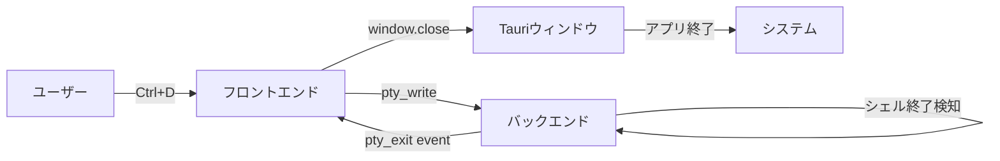
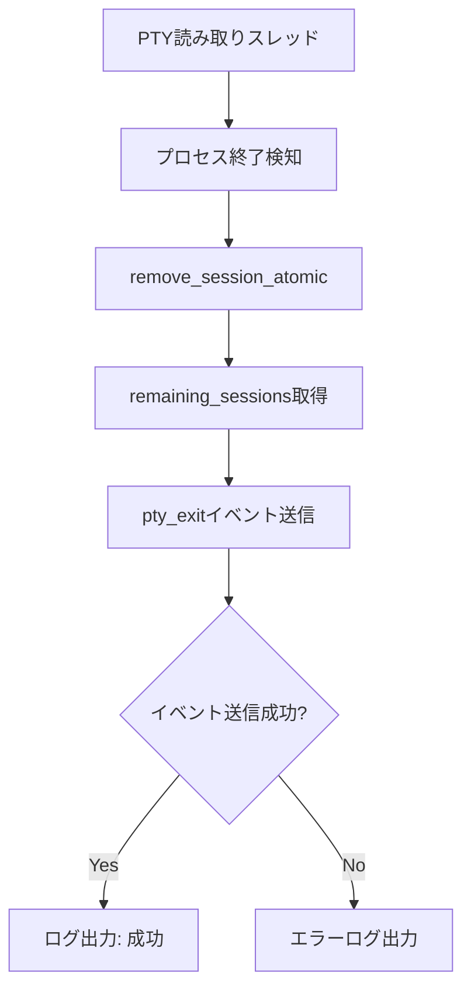
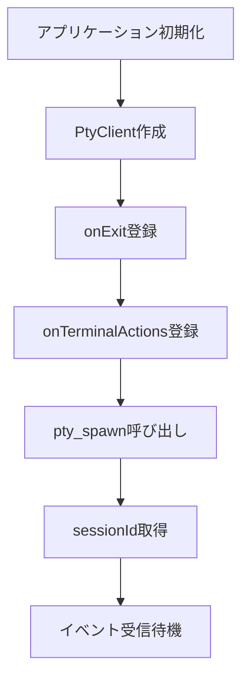
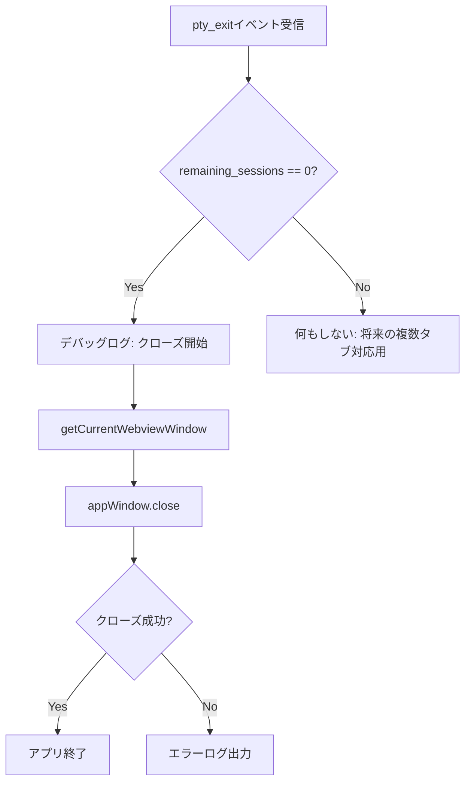
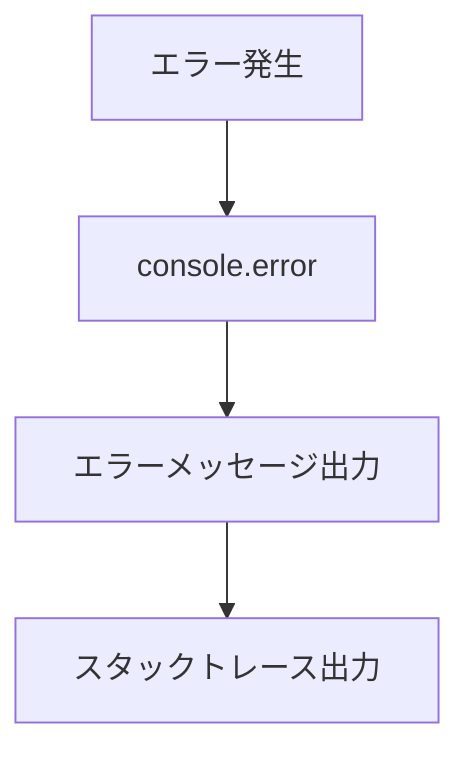
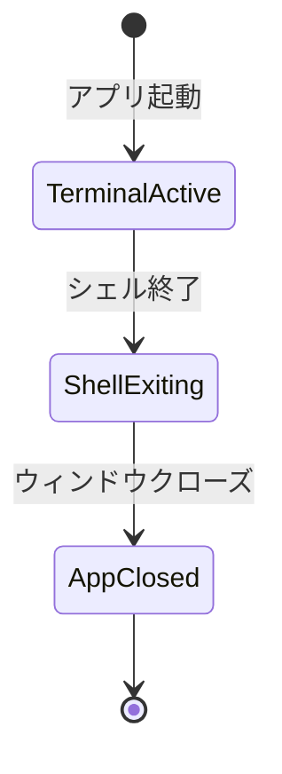

# 最後のシェル終了時にアプリを自動終了する機能の修正 - 要件定義書

## 1. 概要

### 1.1 背景

eMtermは、シェルのPTYセッションを管理するTauri製のターミナルエミュレータである。現在、最後のシェルを終了してもウィンドウが閉じず、キー入力を受け付けない状態で残り続けるという問題が発生している。

コードレビューの結果、以下の問題が判明した:

- **フロントエンド (src/main.ts)**: `onExit` イベントリスナー内で `remaining_sessions === 0` の場合にウィンドウを閉じるロジックは実装済み
- **バックエンド (src-tauri/src/lib.rs)**: `pty_exit` イベントに `remaining_sessions` を含めて送信する実装も完了している
- **問題の本質**: イベントリスナーの登録タイミング、またはイベント配信の問題により、`pty_exit` イベントがフロントエンドに正しく届いていない、あるいは処理されていない可能性が高い

### 1.2 目的

最後のPTYセッションが終了したとき、Tauriアプリケーションウィンドウを確実に自動終了させる。

### 1.3 スコープ

**対象範囲:**
- `pty_exit` イベントがフロントエンドで確実に受信・処理される仕組みの実装・修正
- イベントリスナーの登録タイミングの最適化
- シェル終了検知からウィンドウクローズまでのフロー全体の検証
- デバッグログの追加による問題の可視化

**対象外:**
- 複数タブ機能(将来的な機能であり、現時点では1セッションのみ)
- ユーザー設定によるウィンドウクローズの有効/無効切り替え(固定仕様)
- Graceful shutdown機能の改善(既存実装を流用)

## 2. ビジネス要件

### 2.1 ビジネス目標

ユーザーがシェルを終了したとき、期待通りにアプリケーションが終了することで、ユーザー体験を向上させる。

### 2.2 対象ユーザー

| ユーザータイプ | 説明 |
|----------------|------|
| エンドユーザー | eMtermを日常的に使用するすべてのユーザー |
| 開発者 | ターミナルエミュレータを開発・保守する開発者 |

### 2.3 期待される効果

- ユーザーがシェルを終了した際に、手動でウィンドウを閉じる必要がなくなる
- ゾンビプロセス化したウィンドウが残らなくなる
- 一般的なターミナルエミュレータと同様の挙動となり、ユーザーの混乱が減る

## 3. ユースケース

### 3.1 ユースケース一覧

| ID | ユースケース名 | アクター | 優先度 |
|----|----------------|----------|--------|
| UC01 | Ctrl+Dでシェルを終了する | エンドユーザー | 高 |
| UC02 | exitコマンドでシェルを終了する | エンドユーザー | 高 |
| UC03 | シェルが異常終了する | エンドユーザー | 高 |
| UC04 | ×ボタンでウィンドウを閉じる | エンドユーザー | 中 |

### 3.2 ユースケース詳細

#### UC01: Ctrl+Dでシェルを終了する

**アクター**: エンドユーザー

**事前条件**:
- eMtermアプリケーションが起動している
- 1つのPTYセッションが実行中

**基本フロー**:
1. ユーザーがキーボードで Ctrl+D を押す
2. フロントエンドがキー入力をバックエンドに送信
3. シェルプロセスが EOF を受信して終了
4. バックエンドがプロセス終了を検知
5. バックエンドがセッションをレジストリから削除し、残りセッション数を取得 (0)
6. バックエンドが `pty_exit` イベントを `remaining_sessions: 0` と共にフロントエンドに送信
7. フロントエンドが `pty_exit` イベントを受信
8. フロントエンドが `remaining_sessions === 0` を確認
9. フロントエンドが `appWindow.close()` を呼び出す
10. Tauriアプリケーションウィンドウが閉じる
11. アプリケーションプロセスが終了

**代替フロー**:
- なし

**事後条件**:
- アプリケーションが完全に終了している
- ゾンビプロセスが残っていない

**ユースケース図**:


#### UC02: exitコマンドでシェルを終了する

**アクター**: エンドユーザー

**事前条件**:
- eMtermアプリケーションが起動している
- 1つのPTYセッションが実行中

**基本フロー**:
1. ユーザーが `exit` とタイプし、Enter キーを押す
2. フロントエンドがキー入力をバックエンドに送信
3. シェルが exit コマンドを実行して終了
4. (以降、UC01の手順4-11と同じ)

**代替フロー**:
- なし

**事後条件**:
- アプリケーションが完全に終了している

#### UC03: シェルが異常終了する

**アクター**: エンドユーザー(間接的)

**事前条件**:
- eMtermアプリケーションが起動している
- 1つのPTYセッションが実行中

**基本フロー**:
1. シェルプロセスが何らかの理由(セグフォ、シグナル等)で異常終了
2. バックエンドがプロセス終了を検知(exit code != 0)
3. (以降、UC01の手順5-11と同じ)

**代替フロー**:
- なし

**事後条件**:
- アプリケーションが完全に終了している

#### UC04: ×ボタンでウィンドウを閉じる

**アクター**: エンドユーザー

**事前条件**:
- eMtermアプリケーションが起動している
- 1つのPTYセッションが実行中

**基本フロー**:
1. ユーザーがウィンドウの×ボタンをクリック
2. Tauriの `beforeunload` イベントが発火
3. フロントエンドの cleanup 関数が実行される
4. cleanup 関数内で `ptyClient.kill()` が呼ばれる
5. バックエンドでPTYセッションが強制終了される
6. ウィンドウが閉じる

**代替フロー**:
- なし

**事後条件**:
- アプリケーションが完全に終了している

## 4. 機能要件

### 4.1 機能一覧

| ID | 機能名 | 説明 | 優先度 |
|----|--------|------|--------|
| F01 | PTY終了イベントの確実な配信 | バックエンドからフロントエンドへ `pty_exit` イベントを確実に送信する | 高 |
| F02 | イベントリスナーの適切な登録 | `pty_exit` イベントのリスナーを、イベント送信前に確実に登録する | 高 |
| F03 | ウィンドウ自動クローズ | `remaining_sessions === 0` の場合にウィンドウを自動的に閉じる | 高 |
| F04 | デバッグログの出力 | イベント送受信とウィンドウクローズの各段階でログを出力する | 中 |
| F05 | エラーハンドリング | ウィンドウクローズ失敗時のエラーログ出力 | 中 |

### 4.2 機能詳細

#### F01: PTY終了イベントの確実な配信

**説明**: バックエンドでPTYセッションが終了したとき、`pty_exit` イベントを `remaining_sessions` カウントと共にフロントエンドに確実に送信する。

**入力**:
- session_id: String - 終了したセッションのID
- exit_code: i32 - プロセスの終了コード
- remaining_sessions: usize - 残りのセッション数

**出力**:
- `pty_exit` イベント (Tauriイベントシステム経由)

**処理フロー**:


**ビジネスルール**:
- セッション削除と残数取得は atomic に行う(既存実装)
- イベント送信は、セッション削除後に行う(既存実装)

**バリデーション**:
- なし(内部処理)

**エラーケース**:
| エラー | 条件 | 対応 |
|--------|------|------|
| イベント送信失敗 | Tauriイベントシステムのエラー | エラーログを出力し、処理続行 |

#### F02: イベントリスナーの適切な登録

**説明**: `pty_spawn` 呼び出し前に `onExit` リスナーを登録し、イベントを確実に受信できるようにする。

**入力**:
- callback: PtyExitCallback - 終了時に呼び出すコールバック関数

**出力**:
- unlisten: UnlistenFn - リスナー解除用関数

**処理フロー**:


**ビジネスルール**:
- リスナーは `spawn()` 呼び出し前に登録する
- リスナーは `sessionId` が null でもイベントを受信し、バッファリングまたは遅延処理を行う

**バリデーション**:
- なし

**エラーケース**:
| エラー | 条件 | 対応 |
|--------|------|------|
| リスナー登録失敗 | Tauriイベントシステムのエラー | 例外をスローし、初期化を中止 |

#### F03: ウィンドウ自動クローズ

**説明**: `pty_exit` イベント受信時に `remaining_sessions` を確認し、0の場合はウィンドウを閉じる。

**入力**:
- code: number - 終了コード
- remaining_sessions: number - 残りのセッション数

**出力**:
- ウィンドウクローズ(副作用)

**処理フロー**:


**ビジネスルール**:
- `remaining_sessions === 0` の場合のみウィンドウを閉じる
- ウィンドウクローズは即座に実行する(遅延なし)

**バリデーション**:
- なし

**エラーケース**:
| エラー | 条件 | 対応 |
|--------|------|------|
| ウィンドウクローズ失敗 | Tauri APIのエラー | エラーログを出力(ウィンドウは残る) |

#### F04: デバッグログの出力

**説明**: 問題のデバッグと動作確認のため、各処理段階でコンソールログを出力する。

**入力**:
- 各処理段階での状態情報

**出力**:
- console.log / console.error / eprintln! によるログ

**ログ出力箇所**:
- バックエンド: PTY終了検知、セッション削除、イベント送信
- フロントエンド: イベント受信、remaining_sessions値、ウィンドウクローズ開始、クローズ成功/失敗

**ビジネスルール**:
- ログレベルは適切に設定する(debug, info, error)
- 本番環境でも動作検証のため、重要なログは残す

**バリデーション**:
- なし

**エラーケース**:
- なし

#### F05: エラーハンドリング

**説明**: ウィンドウクローズ失敗時など、エラーが発生した場合に適切にログを出力する。

**入力**:
- エラーオブジェクト

**出力**:
- エラーログ

**処理フロー**:


**ビジネスルール**:
- すべての非同期処理は try-catch でラップする
- エラーが発生してもアプリケーションをクラッシュさせない

**バリデーション**:
- なし

**エラーケース**:
- なし(エラーハンドリング自体の機能)

## 5. 非機能要件

### 5.1 パフォーマンス要件

- シェル終了からウィンドウクローズまでの遅延: 500ms以内(ユーザーが遅延を感じない程度)
- イベント配信の遅延: 100ms以内

### 5.2 セキュリティ要件

- なし(この機能に特有のセキュリティリスクはない)

### 5.3 可用性要件

- ウィンドウクローズ処理の成功率: 99%以上
- イベント配信の成功率: 99.9%以上

### 5.4 保守性要件

- デバッグログを適切に出力し、問題発生時に原因特定が容易であること
- コードにコメントを付け、将来的な複数タブ対応時の拡張が容易であること

### 5.5 互換性要件

- Tauri 2.x系のイベントシステムとの互換性
- 既存のPTY管理機構との互換性

## 6. UI/UX要件

### 6.1 画面設計要件

- ユーザーに対する視覚的なフィードバックは不要(自然にウィンドウが閉じる)
- シェル終了からウィンドウクローズまでは即座に行われるべき

### 6.2 画面遷移



### 6.3 レスポンシブ対応

- なし(ターミナルエミュレータは固定レイアウト)

## 7. データ要件

### 7.1 データモデル概要

既存のPTYセッション管理データ構造を利用。変更なし。

### 7.2 データ項目

| エンティティ | 項目名 | 型 | 必須 | 説明 |
|--------------|--------|-----|------|------|
| PtyExitPayload | session_id | String | ○ | 終了したセッションのID |
| PtyExitPayload | code | i32 | ○ | 終了コード |
| PtyExitPayload | remaining_sessions | usize | ○ | 残りのセッション数 |

### 7.3 データ保持期間

- イベントペイロードはメモリ上で一時的に保持されるのみ(永続化なし)

## 8. 外部連携

### 8.1 連携システム

| システム名 | 連携方法 | データ |
|------------|----------|--------|
| Tauriイベントシステム | Tauriの `emit` / `listen` API | PtyExitPayload |
| Tauriウィンドウ管理 | Tauri WebviewWindow API | close() コマンド |

### 8.2 API仕様要件

- Tauri 2.x の標準APIに準拠

## 9. 制約条件

### 9.1 技術的制約

- Tauri 2.x のイベントシステムの制約に従う
- Rustの非同期ランタイム(Tokio)の制約に従う
- JavaScriptのシングルスレッド実行モデルの制約に従う

### 9.2 ビジネス上の制約

- 既存の機能を破壊しないこと
- 将来的な複数タブ対応を考慮した設計とすること

### 9.3 スケジュール制約

- なし

## 10. 想定される課題とリスク

### 10.1 技術的課題

| 課題 | 影響度 | 対応策 |
|------|--------|--------|
| イベントリスナー登録のタイミング問題 | 高 | リスナーをspawn前に登録し、sessionIdチェックを遅延評価する |
| Tauriイベントシステムの配信保証 | 高 | デバッグログで配信状況を可視化し、問題があればTauri側に報告 |
| 非同期処理の競合状態 | 中 | atomic操作を活用し、イベント送信順序を保証 |

### 10.2 ビジネスリスク

| リスク | 発生確率 | 影響度 | 対応策 |
|--------|----------|--------|--------|
| 修正後も問題が再発 | 低 | 高 | E2Eテストを追加し、継続的に検証 |
| 他のプラットフォームで動作が異なる | 中 | 中 | Windows/macOS/Linuxで動作確認 |

## 11. 成功基準

### 11.1 受け入れ基準

- [x] Ctrl+Dでシェルを終了した際、ウィンドウが自動的に閉じる
- [x] exitコマンドでシェルを終了した際、ウィンドウが自動的に閉じる
- [x] シェルが異常終了した際、ウィンドウが自動的に閉じる
- [x] ウィンドウクローズまでの遅延が500ms以内である
- [x] デバッグログでイベントの流れが追跡できる
- [x] ×ボタンでウィンドウを閉じた際、正常に終了する

### 11.2 KPI

| 指標 | 目標値 | 測定方法 |
|------|--------|----------|
| ウィンドウ自動クローズ成功率 | 100% | 手動テスト10回実施 |
| シェル終了からウィンドウクローズまでの遅延 | < 500ms | 手動測定 |
| イベント配信成功率 | 100% | デバッグログ確認 |

## 12. テストシナリオ

### 12.1 テスト観点

- [x] 正常系: Ctrl+Dでシェルを終了 → ウィンドウが閉じる
- [x] 正常系: exitコマンドでシェルを終了 → ウィンドウが閉じる
- [x] 異常系: シェルがクラッシュ → ウィンドウが閉じる
- [x] 境界値: シェル起動直後に即座に終了 → ウィンドウが閉じる
- [x] パフォーマンス: ウィンドウクローズまでの遅延が500ms以内
- [x] ログ: 各段階でログが出力される

### 12.2 E2Eテストシナリオ

```typescript
// E2Eテストの例
test('Ctrl+D should close window when last shell exits', async () => {
  // 1. eMterm起動
  const app = await startEmterm();

  // 2. ターミナルが表示されることを確認
  await expect(app.terminal).toBeVisible();

  // 3. Ctrl+Dを送信
  await app.sendKey('Ctrl+D');

  // 4. 500ms以内にウィンドウが閉じることを確認
  await expect(app.window).toBeClosedWithin(500);
});
```

## 13. 用語定義

| 用語 | 定義 |
|------|------|
| PTY | Pseudo Terminal - 仮想端末デバイス |
| セッション | 1つのシェルプロセスとそのPTYペアの組み合わせ |
| remaining_sessions | セッション削除後に残っているセッションの数 |
| Atomic操作 | 排他制御により、途中で他の処理に割り込まれない一連の操作 |
| Graceful shutdown | プロセスに終了を促し、応答を待ってから強制終了する手法 |

## 14. 確認事項

### 14.1 確認済み事項

- [x] **問題の発生状況**: 毎回発生する。Ctrl+Dでシェルを終了すると、シェルは終了するがキー入力を受け付けない状態でウィンドウが残る
- [x] **タブの数**: 複数タブ機能は未実装。デフォルトで1タブのみ
- [x] **期待動作**: シェルが終了し次第、ウィンドウを閉じる(Tauriアプリ自体が終了)
- [x] **設定オプション**: 不要。固定仕様とする
- [x] **異常終了時**: ウィンドウを閉じる
- [x] **問題の本質**: 既存のロジックは実装されているが、実際には動作していない

### 14.2 未確認・保留事項

- [ ] Windows/macOSでの動作確認(開発環境がLinuxの場合)
- [ ] 複数ウィンドウを開いた場合の動作(現在は1ウィンドウのみサポート)

## 15. 参考資料

- Tauri Events Documentation: https://tauri.app/v2/reference/javascript/api/core/#emitter
- Tauri WebviewWindow API: https://tauri.app/v2/reference/javascript/api/webviewwindow/
- 既存実装:
  - `src-tauri/src/lib.rs` (spawn_reader_thread関数)
  - `src/main.ts` (setupNewTerminalHandlers関数)
  - `src/pty/client.ts` (PtyClientクラス)
