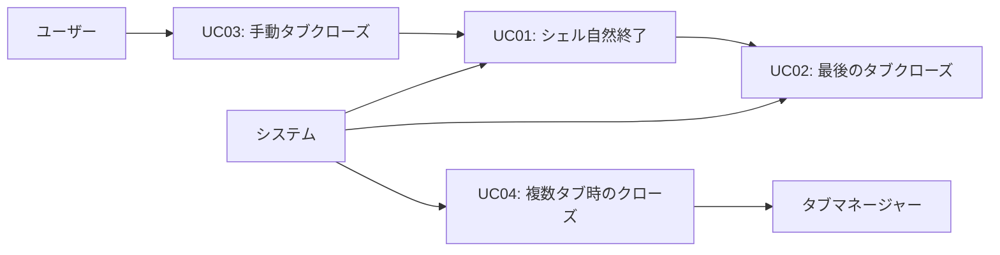
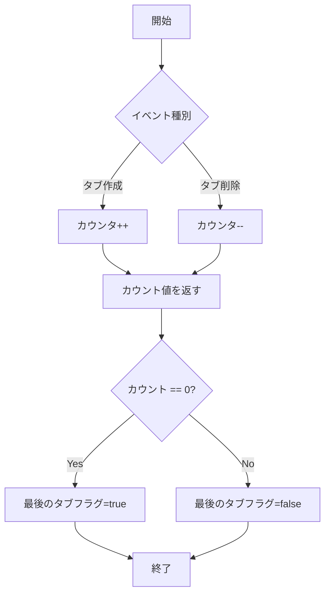
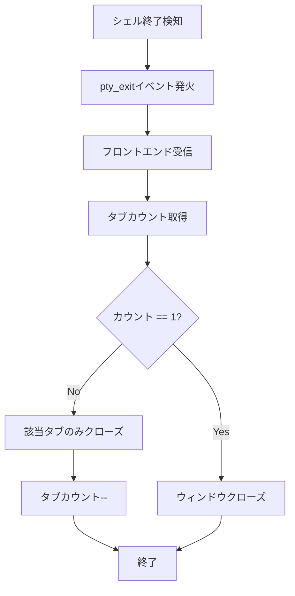
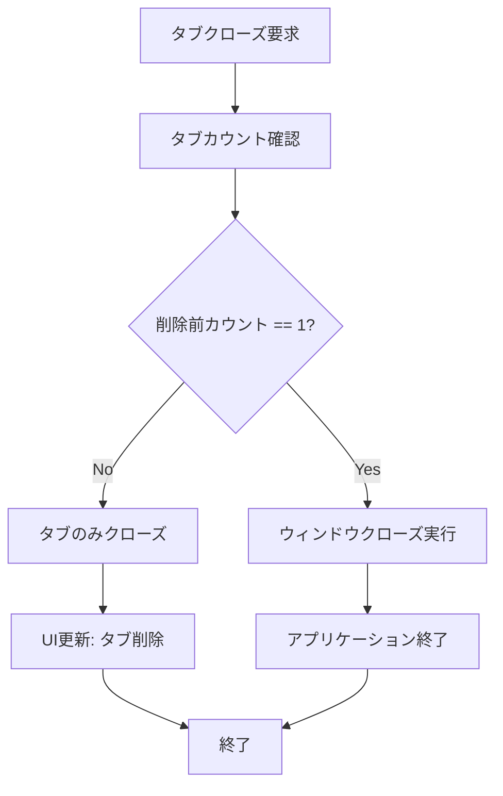
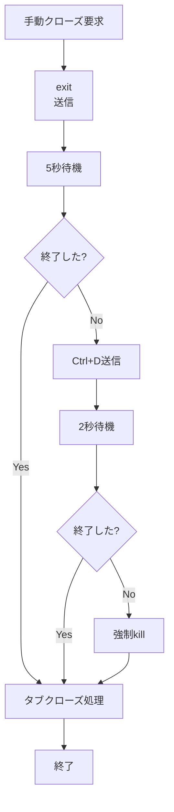
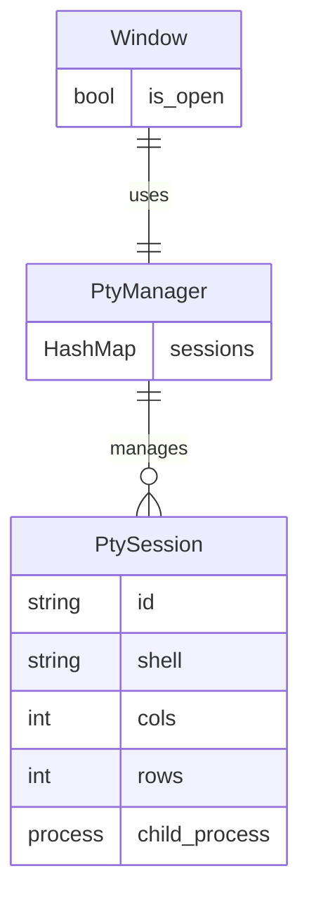

# シェル終了時のウィンドウ/タブクローズ機能 - 要件定義書

## 1. 概要

### 1.1 背景
現在のeMtermは、シェルが終了した際にウィンドウを即座に閉じる実装になっているが、将来的なタブ機能の実装を考慮した設計になっていない。タブ機能を実装する際には、以下の動作が必要になる:

- タブが複数ある場合: シェル終了時にそのタブのみを閉じる
- タブが1つの場合: シェル終了時にウィンドウ全体を閉じる

現在の実装では、タブという概念が存在せず、PTYセッションとウィンドウが1対1で紐づいているため、将来のタブ実装時に大規模な設計変更が必要になる。

### 1.2 目的
将来のタブ機能実装を見据えて、シェル終了時の処理を適切に設計・リファクタリングする。具体的には:

1. タブカウント管理機能を導入する
2. シェル終了時の処理を「タブを閉じる」ロジックとして実装する
3. 最後のタブが閉じた場合のみウィンドウを閉じる仕組みを実装する
4. 手動でタブを閉じる際の適切な終了処理を実装する

### 1.3 スコープ
**対象範囲:**
- タブカウント管理機能の実装（Rust側およびTypeScript側）
- シェル終了時のタブクローズ処理の実装
- 最後のタブクローズ時のウィンドウクローズ処理の実装
- 手動タブクローズ時の適切なシェル終了処理の実装
- 包括的なテストの追加（ユニットテスト、E2Eテスト）

**対象外:**
- タブUIの実装（タブバー、タブ切り替えボタンなど）
- 複数タブの同時表示機能
- タブの追加・削除UI

**注記:** 今回の実装は「タブ機能を実装可能にする基盤整備」であり、ユーザーから見た動作は現状と変わらない（常に1タブのみ）。

## 2. ビジネス要件

### 2.1 ビジネス目標
将来のタブ機能実装をスムーズに行うための技術的基盤を整備し、コードの保守性と拡張性を向上させる。

### 2.2 対象ユーザー
| ユーザータイプ | 説明 |
|----------------|------|
| エンドユーザー | eMtermを使用するターミナルユーザー（今回の変更で動作は変わらない） |
| 開発者 | 将来タブ機能を実装する開発者 |

### 2.3 期待される効果
- 将来のタブ機能実装時の開発コストを削減
- タブ関連のバグを事前に防止
- コードの可読性・保守性の向上
- テストカバレッジの向上

## 3. ユースケース

### 3.1 ユースケース一覧
| ID | ユースケース名 | アクター | 優先度 |
|----|----------------|----------|--------|
| UC01 | シェル自然終了によるタブクローズ | システム | 高 |
| UC02 | 最後のタブクローズ時のウィンドウクローズ | システム | 高 |
| UC03 | 手動タブクローズ | ユーザー | 高 |
| UC04 | 複数タブ存在時のタブクローズ（将来対応） | システム | 中 |

### 3.2 ユースケース詳細

#### UC01: シェル自然終了によるタブクローズ

**アクター**: システム

**事前条件**:
- eMtermが起動している
- 1つ以上のタブ（PTYセッション）が存在する
- ユーザーがシェルで `exit` コマンドを実行、またはCtrl+Dを入力

**基本フロー**:
1. シェルプロセスが終了する
2. PTYリーダースレッドが終了を検知する
3. `pty_exit` イベントが発火される
4. フロントエンドがイベントを受信する
5. タブカウントを確認する
   - タブが1つの場合: ウィンドウを閉じる
   - タブが複数の場合: 該当タブのみを閉じ、タブカウントをデクリメントする

**代替フロー**:
- シェルがクラッシュした場合も同様に処理する

**事後条件**:
- タブが1つの場合: ウィンドウが閉じている
- タブが複数の場合: 該当タブが閉じ、他のタブは動作し続けている

#### UC02: 最後のタブクローズ時のウィンドウクローズ

**アクター**: システム

**事前条件**:
- eMtermが起動している
- タブが1つのみ存在する

**基本フロー**:
1. 最後のタブのシェルが終了する
2. タブクローズ処理が実行される
3. タブカウントが0になる
4. ウィンドウ全体を閉じる

**事後条件**:
- eMtermアプリケーションが完全に終了している

#### UC03: 手動タブクローズ

**アクター**: ユーザー（将来的にはタブUIから操作）

**事前条件**:
- eMtermが起動している
- 1つ以上のタブが存在する
- シェルがまだ実行中

**基本フロー**:
1. ユーザーがタブクローズを要求する（将来的にはタブのXボタンをクリック）
2. システムがシェルに `exit\n` コマンドを送信する
3. シェルの自然終了を待つ（タイムアウト: 5秒）
4. シェルが終了したら、UC01の基本フローに従う

**代替フロー**:
- タイムアウト内にシェルが終了しない場合:
  1. Ctrl+D (EOF) を送信する
  2. さらに2秒待つ
  3. それでも終了しない場合、プロセスを強制killする
  4. タブクローズ処理を続行する

**事後条件**:
- タブが適切に閉じられている
- シェルプロセスが終了している

#### UC04: 複数タブ存在時のタブクローズ（将来対応）

**アクター**: システム

**事前条件**:
- eMtermが起動している
- タブが複数（2つ以上）存在する
- いずれかのタブのシェルが終了する

**基本フロー**:
1. シェルが終了する
2. 該当タブのみを閉じる
3. タブカウントをデクリメントする
4. 他のタブは影響を受けずに動作し続ける
5. ウィンドウは開いたまま

**事後条件**:
- 終了したタブが閉じている
- 他のタブは正常に動作している
- ウィンドウは開いたまま

**ユースケース図**:


## 4. 機能要件

### 4.1 機能一覧
| ID | 機能名 | 説明 | 優先度 |
|----|--------|------|--------|
| F01 | タブカウント管理 | アクティブなタブ数をカウントする機能 | 高 |
| F02 | シェル終了検知とタブクローズ | シェル終了を検知し、適切にタブを閉じる | 高 |
| F03 | 最後のタブ判定とウィンドウクローズ | 最後のタブかどうかを判定し、ウィンドウを閉じる | 高 |
| F04 | 手動タブクローズ処理 | ユーザー要求によるタブクローズ処理 | 高 |
| F05 | グレースフルシャットダウン | シェルに適切な終了シグナルを送信する | 高 |

### 4.2 機能詳細

#### F01: タブカウント管理

**説明**: アプリケーション内のアクティブなタブ（PTYセッション）の数を正確にカウントし、管理する機能。

**入力**:
- タブ作成イベント
- タブ削除イベント

**出力**:
- 現在のタブ数（整数）
- 最後のタブかどうかの判定（真偽値）

**処理フロー**:


**ビジネスルール**:
- タブカウントは常に0以上
- タブカウントが0になった場合、ウィンドウクローズをトリガーする
- タブの作成・削除はアトミックに処理される（排他制御が必要）

**バリデーション**:
| 項目 | ルール | エラーメッセージ |
|------|--------|------------------|
| カウント値 | 0以上の整数 | "Tab count cannot be negative" |
| 同期性 | スレッドセーフ | "Tab count sync error" |

**実装場所**:
- **Rust側**: PtyManagerまたは新規TabManagerにカウンタを追加
- **TypeScript側**: グローバルステートまたは専用クラスでカウント管理

#### F02: シェル終了検知とタブクローズ

**説明**: PTYリーダースレッドがシェルプロセスの終了を検知し、適切にタブクローズ処理を実行する。

**入力**:
- シェルプロセスの終了ステータス
- セッションID

**出力**:
- `pty_exit` イベント（既存）
- タブクローズ完了通知

**処理フロー**:


**ビジネスルール**:
- シェルの終了コードに関わらずタブクローズ処理を実行する
- 終了検知から処理完了まで500ms以内に完了する
- 既存のpty_exitイベントの動作を維持する（後方互換性）

**エラーケース**:
| エラー | 条件 | 対応 |
|--------|------|------|
| セッション未検出 | 既に削除済みのセッション | ログ出力のみ（エラーとしない） |
| イベント送信失敗 | フロントエンドとの通信エラー | ログ出力し、強制クリーンアップ |

#### F03: 最後のタブ判定とウィンドウクローズ

**説明**: タブクローズ時に、それが最後のタブかどうかを判定し、最後の場合はウィンドウ全体を閉じる。

**入力**:
- 現在のタブカウント
- クローズ対象のセッションID

**出力**:
- ウィンドウクローズコマンド（最後のタブの場合）
- タブクローズ完了（最後でない場合）

**処理フロー**:


**ビジネスルール**:
- カウント確認とデクリメントはアトミックに実行される
- ウィンドウクローズは即座に実行される（確認ダイアログなし）
- 最後のタブクローズ時は全リソースをクリーンアップする

#### F04: 手動タブクローズ処理

**説明**: ユーザーがタブを手動で閉じる際の適切な処理を実行する。プロセスに対して段階的に終了シグナルを送信し、強制killを最終手段とする。

**入力**:
- クローズ対象のセッションID
- タイムアウト設定（デフォルト: 5秒）

**出力**:
- タブクローズ完了通知
- シェルプロセス終了確認

**処理フロー**:


**ビジネスルール**:
- `exit\n` コマンドを最初に送信する（最も安全な方法）
- タイムアウト時間は設定可能（デフォルト5秒）
- EOF (Ctrl+D) 送信は2段階目の手段
- 強制killは最終手段（データ損失の可能性を警告）

**段階的終了シーケンス**:
| 段階 | 送信内容 | 待機時間 | 説明 |
|------|----------|----------|------|
| 1 | `exit\n` | 5秒 | シェルの通常終了コマンド |
| 2 | `0x04` (Ctrl+D, EOF) | 2秒 | シェルに対するEOFシグナル |
| 3 | SIGTERM → SIGKILL | - | プロセスの強制終了 |

#### F05: グレースフルシャットダウン

**説明**: シェルプロセスに対して適切な終了シグナルを送信し、データの整合性を保ちながら終了する。

**入力**:
- セッションID
- シャットダウンモード（normal / force）

**出力**:
- プロセス終了確認
- 終了コード

**ビジネスルール**:
- normalモード: `exit\n` → EOF → SIGTERM → SIGKILL の順
- forceモード: 即座にSIGKILL
- 各段階のタイムアウトは設定可能
- ログにシャットダウンプロセスを記録

**エラーケース**:
| エラー | 条件 | 対応 |
|--------|------|------|
| プロセス応答なし | すべてのシグナルに反応しない | 強制kill後、エラーログ出力 |
| プロセス既に終了 | 既に終了済みのプロセス | 正常終了として処理 |

## 5. 非機能要件

### 5.1 パフォーマンス要件
- シェル終了検知からタブクローズまでの遅延: 500ms以内
- 手動タブクローズ要求から処理開始まで: 100ms以内
- タブカウント更新の処理時間: 10ms以内
- メモリ使用量: 既存実装から+10KB以内

### 5.2 セキュリティ要件
- シェルプロセスへのコマンド送信は適切にエスケープされること
- タブカウント管理はスレッドセーフであること
- プロセスkillは適切な権限チェックを行うこと

### 5.3 可用性要件
- タブクローズ処理の失敗時も他のタブに影響を与えないこと
- カウント不整合時の自動復旧機能を持つこと

### 5.4 保守性要件
- タブ管理ロジックは独立したモジュールとして実装すること
- 将来のタブUI追加時に最小限の変更で対応できること
- デバッグログを適切に出力すること
- コードコメントで設計意図を明記すること

### 5.5 互換性要件
- 既存のpty_exitイベントの動作を維持すること
- 既存のテストが全て通過すること
- 現在のユーザー体験を変更しないこと

## 6. UI/UX要件

### 6.1 ユーザー体験要件
- **現時点**: UIは変更なし（タブが常に1つなので、既存の動作と同じ）
- **将来**: タブクローズ時にスムーズなアニメーション（フェードアウトなど）
- **将来**: 最後のタブを閉じる際の確認ダイアログ（オプション設定）

### 6.2 エラー表示
現時点ではエラー表示UIは不要。ログ出力のみ。

## 7. データ要件

### 7.1 データモデル概要

**設計変更:** 新規TabManagerは不要。既存のPtyManagerが`HashMap<SessionId, PtySession>`でセッションを管理しており、`session_count()`メソッド（`HashMap.len()`）でタブ数を取得可能。



### 7.2 データ項目

#### PtyManager（既存、活用）
| 項目名 | 型 | 必須 | 説明 |
|--------|-----|------|------|
| sessions | HashMap<SessionId, PtySession> | ○ | セッションレジストリ |

**メソッド:**
- `session_count()` → `sessions.len()` でタブ数を取得

#### PtySession（既存、変更なし）
| 項目名 | 型 | 必須 | 説明 |
|--------|-----|------|------|
| id | String | ○ | セッションID |
| pair | PtyPair | ○ | PTYペア |
| child | Child | ○ | シェルプロセス |
| writer | Writer | ○ | 入力ライター |

### 7.3 データ保持期間
| データ種別 | 保持期間 |
|------------|----------|
| タブカウント | アプリケーション起動中 |
| セッション情報 | タブ終了まで |

## 8. 外部連携

### 8.1 連携システム
| システム名 | 連携方法 | データ |
|------------|----------|--------|
| Tauri IPC | イベントエミッター | pty_exit, tab_count_changed |
| OS Process API | システムコール | プロセスシグナル、終了ステータス |

### 8.2 API仕様要件

#### 新規Tauriコマンド（将来的に必要になる可能性）
- `tab_create()` - 新規タブ作成
- `tab_close(session_id)` - タブクローズ要求
- `tab_get_count()` - タブ数取得

#### 新規イベント（将来的に必要になる可能性）
- `tab_created` - タブ作成通知
- `tab_closed` - タブクローズ通知
- `tab_count_changed` - タブ数変更通知

## 9. 制約条件

### 9.1 技術的制約
- 既存のPtyManager構造を大きく変更しない
- portable_ptyライブラリの制約内で実装する
- Tauri 2.xのAPI制約に従う

### 9.2 ビジネス上の制約
- ユーザー体験を変更しない（今回はバックエンドのみの変更）
- 既存機能の後方互換性を維持する

### 9.3 スケジュール制約
- 特になし（現時点）

## 10. 想定される課題とリスク

### 10.1 技術的課題
| 課題 | 影響度 | 対応策 |
|------|--------|--------|
| タブカウントの不整合 | 高 | Mutexで排他制御、定期的な整合性チェック |
| portable_ptyのtry_wait問題 | 中 | 既存のポーリングメカニズムを活用 |
| シェルが終了しない | 中 | タイムアウトと段階的な強制終了 |
| Rust-TypeScript間のステート同期 | 中 | イベント駆動でステート管理 |

### 10.2 ビジネスリスク
| リスク | 発生確率 | 影響度 | 対応策 |
|--------|----------|--------|--------|
| 既存機能の破壊 | 低 | 高 | 包括的なテスト実施 |
| パフォーマンス劣化 | 低 | 中 | ベンチマークテスト |
| 将来のタブUI実装時の再設計 | 中 | 中 | 明確なインターフェース定義 |

## 11. 成功基準

### 11.1 受け入れ基準
- [ ] タブカウント管理機能が正常に動作する
- [ ] シェル終了時に適切にタブがクローズされる
- [ ] 最後のタブクローズ時にウィンドウが閉じる
- [ ] 手動タブクローズが段階的終了シーケンスに従う
- [ ] 既存のすべてのテストが通過する
- [ ] 新規テストがすべて通過する（カバレッジ80%以上）
- [ ] ユーザー体験が現状と変わらない
- [ ] メモリリークが発生しない

### 11.2 KPI
| 指標 | 目標値 | 測定方法 |
|------|--------|----------|
| テストカバレッジ | 80%以上 | cargo tarpaulin / bun test --coverage |
| シェル終了検知時間 | 500ms以内 | ベンチマークテスト |
| 手動クローズ成功率 | 95%以上 | E2Eテスト100回実行 |
| メモリ使用量増加 | +10KB以内 | メモリプロファイラ |

## 12. テストシナリオ

### 12.1 テスト観点
- [ ] 正常系: シェル自然終了でタブがクローズされる
- [ ] 正常系: 最後のタブクローズでウィンドウが閉じる
- [ ] 正常系: 手動タブクローズで段階的終了シーケンスが動作する
- [ ] 異常系: シェルがハングした場合に強制killされる
- [ ] 異常系: タブカウントが不整合になった場合に復旧する
- [ ] 境界値: タブカウントが0, 1, 複数の場合
- [ ] 並行性: 複数タブの同時クローズ（将来対応）
- [ ] パフォーマンス: 終了処理が規定時間内に完了する

### 12.2 Rustユニットテスト（追加予定）
```rust
// src-tauri/src/pty/tab_manager.rs
#[cfg(test)]
mod tests {
    #[test]
    fn test_tab_count_increment() { /* ... */ }

    #[test]
    fn test_tab_count_decrement() { /* ... */ }

    #[test]
    fn test_is_last_tab() { /* ... */ }

    #[test]
    fn test_concurrent_tab_operations() { /* ... */ }
}

// src-tauri/src/pty/graceful_shutdown.rs
#[cfg(test)]
mod tests {
    #[test]
    fn test_exit_command_sent() { /* ... */ }

    #[test]
    fn test_timeout_triggers_eof() { /* ... */ }

    #[test]
    fn test_force_kill_as_last_resort() { /* ... */ }
}
```

### 12.3 TypeScriptユニットテスト（追加予定）
```typescript
// src/pty/tab-manager.test.ts
describe('TabManager', () => {
  test('should track tab count correctly', () => { /* ... */ });
  test('should detect last tab', () => { /* ... */ });
  test('should emit events on count change', () => { /* ... */ });
});
```

### 12.4 E2Eテスト（追加予定）
```typescript
// test/e2e/tab-close.test.ts
describe('Tab Close Behavior', () => {
  test('window closes when shell exits (single tab)', async () => {
    // 1. Launch emterm
    // 2. Send 'exit\n' to shell
    // 3. Verify window closed within 1s
  });

  test('graceful shutdown on manual close', async () => {
    // 1. Launch emterm
    // 2. Trigger manual close
    // 3. Verify 'exit\n' was sent
    // 4. Verify window closed
  });

  test('force kill after timeout', async () => {
    // 1. Launch emterm
    // 2. Run 'sleep 999999' in shell
    // 3. Trigger manual close
    // 4. Verify process killed after timeout
  });
});
```

## 13. 用語定義

| 用語 | 定義 |
|------|------|
| タブ | 1つのPTYセッションに対応する論理的なコンテナ。現在は常に1つ、将来は複数 |
| PTYセッション | 疑似ターミナル（Pseudo Terminal）のセッション。1つのシェルプロセスに対応 |
| タブカウント | アクティブなタブ（PTYセッション）の数 |
| グレースフルシャットダウン | プロセスに対してデータ損失を最小限にする段階的な終了処理 |
| 手動タブクローズ | ユーザーの明示的な操作によるタブのクローズ（将来的にはUIボタンなど） |
| 最後のタブ | タブカウントが1のタブ。このタブを閉じるとウィンドウも閉じる |

## 14. 確認事項

### 14.1 確認済み事項

- [x] **実装スコープ**: タブUIは実装せず、将来のタブ実装を考慮した設計・リファクタリングのみ行う
- [x] **複数タブ時の動作**: タブのみを閉じる（他のタブは残す）
- [x] **単一タブ時の動作**: ウィンドウ全体を閉じる
- [x] **手動クローズ時の挙動**: exitコマンドを送信し、自然に終了するのを待つ（段階的終了）
- [x] **テスト要件**: E2Eテスト含む包括的なテストを追加する
- [x] **既存動作の維持**: ユーザーから見た動作は現状と変わらない（常に1タブ）

### 14.2 追加確認事項（解決済み）

- [x] **タブカウント管理**: Rust側（PtyManager）を正とする。既存の`HashMap<SessionId, PtySession>`と`session_count()`メソッドを活用。新規TabManagerモジュールは不要。
- [x] **フロントエンド/バックエンド同期**: 不要。バックエンドが単一の正（Single Source of Truth）。フロントエンドはシェル終了時にバックエンドに問い合わせる。
- [x] **負のタブカウント対策**: 不要。`HashMap.len()`は常に0以上。
- [ ] 手動クローズのタイムアウト値の詳細（5秒 + 2秒が適切か）
- [ ] 強制kill時のユーザー通知の必要性（ログのみでよいか）

## 15. 参考資料

- eMterm CLAUDE.md: `/home/sakura/cache/worktrees/emterm/fix-close-window-on-shell-exit/CLAUDE.md`
- 現在のPTY実装: `src-tauri/src/pty/`
- 現在のフロントエンド実装: `src/main.ts`
- portable_ptyドキュメント: https://docs.rs/portable-pty/
- Tauri 2.x イベントAPI: https://v2.tauri.app/develop/calling-frontend/
