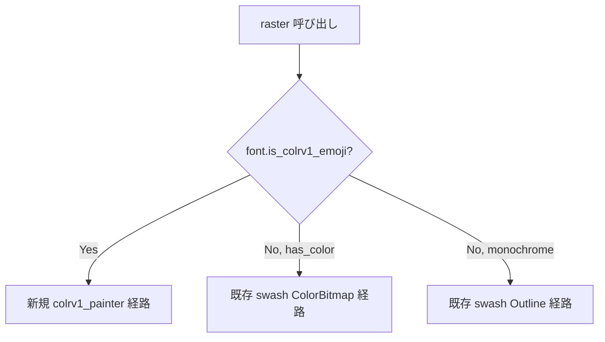

# COLRv1 ベクター絵文字描画 - 要件定義書

## 1. 概要

### 1.1 背景
Windows 実機の分数 DPI (1.25× / 1.5× / 2.0×) で絵文字描画がボケる。RDP 接続 (1.0× スケーリング) では発生しない。現状の描画経路は swash の `Source::ColorBitmap(StrikeWith::BestFit)` で、CBDT 128px strike を target_px (例 26px) へ単タップ bilinear で縮小しており、分数 DPI で品質が劣化する。

`tmp/emoji-rasterization-quality-verification.md` の手順で 3 ルートを Windows 実機比較した結果、品質序列が **C (COLRv1 vector を target_px に直接ラスタライズ) > B (CBDT + Lanczos3 縮小) > A (現状 bilinear)** と確定している。

### 1.2 目的
- Windows 分数 DPI でも絵文字がボケない描画を実現する
- 同梱絵文字フォントを CBDT 10.7 MiB から COLRv1 ~5 MiB へ置き換え、バイナリを軽量化する
- swash 0.1.18 (=0.1.18 固定・実質メンテ停滞) の絵文字描画経路を、emoji に限り skrifa へ段階的に置換する

### 1.3 スコープ

対象:
- `src-tauri/src/render/font/swash_adapter.rs::raster` の `has_color` 分岐
- 同梱絵文字フォント (`src-tauri/assets/fonts/NotoColorEmoji.ttf`) の置換
- `scripts/fetch-fonts.sh` のフォントエントリ更新
- 新規モジュール `src-tauri/src/render/font/colrv1_painter.rs`

対象外:
- swash の全廃 (CJK / Latin / Symbols 等は swash のまま維持)
- macOS 対応 (sbix 経路は導入しない)
- CBDT 経路の温存
- 中間段階としての B (Lanczos3) 経路
- 既存 `src-tauri/src/render/emoji_resample.rs::lanczos3_downscale_rgba` (status-bar 等の他経路で使用) の変更
- atlas / wgpu サンプラ / GlyphCache / FallbackChain の構造変更

## 2. ビジネス要件

### 2.1 ビジネス目標
- Windows 環境での絵文字描画品質を改善し、ターミナルとして実用に耐える表示にする
- バンドルバイナリサイズを削減する (約 5 MiB 級の削減)

### 2.2 対象ユーザー
| ユーザータイプ | 説明 |
|----------------|------|
| Windows ユーザー (分数 DPI) | 1.25× / 1.5× / 2.0× の分数スケーリング環境で eMterm を使うユーザー |
| Linux ユーザー | 1.0× スケーリングで使うユーザー (regression が起きないこと) |
| RDP 経由ユーザー | リモート 1.0× で接続するユーザー (regression が起きないこと) |

### 2.3 期待される効果
- Windows 1.25× / 1.5× / 2.0× DPI で絵文字輪郭が立つ
- バイナリサイズが約 5 MiB 削減される
- 絵文字描画経路が skrifa (fontations) に移行し、将来 swash 全廃時の足場ができる

## 3. ユースケース

### 3.1 ユースケース一覧
| ID | ユースケース名 | アクター | 優先度 |
|----|----------------|----------|--------|
| UC01 | ターミナル上で絵文字を含む文字列を表示 | エンドユーザー | 高 |
| UC02 | DPI スケーリング変更後に絵文字を再描画 | エンドユーザー | 高 |
| UC03 | 多様な絵文字 (modifier 付き含む) を描画 | エンドユーザー | 中 |

### 3.2 ユースケース詳細

#### UC01: ターミナル上で絵文字を含む文字列を表示

**アクター**: エンドユーザー

**事前条件**:
- eMterm GUI が起動している
- bundled の Noto-COLRv1 が含まれているビルド

**基本フロー**:
1. ユーザーがシェルで絵文字を含むコマンド (例: `echo 😀🚀❤️`) を実行する
2. PTY 経由で UTF-8 出力が term_core に届く
3. レンダラが各絵文字 codepoint について FontId を解決する
4. shaping (cmap + GSUB) は既存どおり swash shaper で行い glyph_id を得る
5. 解決された FontId が Noto-COLRv1 の場合、`SwashRasterizer::raster` が `Inner.base_font` (起動時に `set_base_font` でキャッシュ済) から base text font の `(ascent, ascent + descent)` を `size_px` でスケールし、それを `target_cell_h_px` として `colrv1_painter::rasterize` に渡して新経路 (skrifa + tiny-skia) でラスタライズする
6. `bearing.1` を base ascent (px) で上書きしてビットマップ top をセル top に揃え、ラスタライズ結果 (RGBA, straight alpha) を既存 atlas に投入する
7. wgpu パイプラインが atlas からテクスチャサンプリングして描画する

**事後条件**:
- 絵文字がボケずに描画されている
- 既存テキスト (CJK / Latin / シンボル) の描画品質に変化がない

#### UC02: DPI スケーリング変更後に絵文字を再描画

**アクター**: エンドユーザー

**事前条件**:
- eMterm GUI が起動済み

**基本フロー**:
1. ユーザーが OS の DPI スケーリングを変更する (例: 1.0× → 1.5×)
2. winit から新 scale_factor が通知される
3. レンダラが新しい target_px でグリフキャッシュを引き直す
4. キャッシュ未ヒット時、新 target_px で skrifa + tiny-skia により直接ラスタライズする
5. 結果が atlas に投入される

**事後条件**:
- 新 DPI でも絵文字がボケない

#### UC03: 多様な絵文字 (modifier 付き含む) を描画

**アクター**: エンドユーザー

**事前条件**:
- eMterm GUI が起動済み

**基本フロー**:
1. ユーザーが肌色 modifier 付き絵文字 (例: 👍🏽) を含む文字列を表示する
2. 既存 swash shaper の GSUB ligature を経て単一の glyph_id に解決される
3. 該当 glyph の paint graph を skrifa が返す
4. ColorPainter 実装が paint graph を走査し tiny-skia Pixmap に描く
5. atlas に投入される

**事後条件**:
- modifier 適用後の絵文字が正しく描画される
- VS16 (U+FE0F)、ZWJ シーケンスも従来同様に処理される

## 4. 機能要件

### 4.1 機能一覧
| ID | 機能名 | 説明 | 優先度 |
|----|--------|------|--------|
| F01 | COLRv1 paint graph ラスタライズ | skrifa で paint graph を取得し tiny-skia で target_px に直接描画する | 高 |
| F02 | フォント切り分け | 絵文字フォント ID 呼び出し時のみ新経路に分岐し、それ以外は既存 swash 経路を維持 | 高 |
| F03 | premultiplied → straight alpha 変換 | tiny-skia Pixmap (premul) を既存 atlas (straight) に変換して投入 | 高 |
| F04 | 同梱フォント差し替え | NotoColorEmoji.ttf を Noto-COLRv1.ttf に差し替え | 高 |
| F05 | フォント取得スクリプト更新 | `scripts/fetch-fonts.sh` の絵文字フォントエントリを更新 (URL/tag/SHA256 ピン) | 高 |
| F06 | フォールバック経路維持 | Noto-COLRv1 で描けないグリフはモノクロ NotoEmoji-Regular へフォールバック (既存挙動) | 中 |
| F07 | 経路選択ログ | COLRv1 経路選択時は debug、フォールバック発生時は info、劣化描画 (sweep gradient / radial r0 / 未対応 composite / アロケ失敗) は `warn_once` ログを出す | 低 |
| F08 | Pixmap サイズ規則 (cell_h + 1 px padding + bbox-fit) | 出力 Pixmap を base text font の cell height (= ascent + descent) で正方化、内側 (dim - 2) × (dim - 2) に絵文字を bbox-fit centering で描画する | 高 |

### 4.2 機能詳細

#### F01: COLRv1 paint graph ラスタライズ

**説明**: codepoint → glyph_id 解決後、skrifa の COLRv1 API で paint graph を取得し、ColorPainter trait 実装が tiny-skia Pixmap に target_px で直接描画する。

**入力**:
- `font: FontId` - 絵文字フォントの FontId
- `glyph_id: u32` - shaping 後の glyph ID
- `size_px: f32` - target pixel size
- `target_cell_h_px: f32` - base text font の cell height (= `ascent + descent`) を `size_px` でスケールした値。`SwashRasterizer::raster` が `Inner.base_font` (= `App::build_font_stack` で `set_base_font` 経由でキャッシュされた base FontId) から導出して painter に渡す。`<= 0.0` を渡すと「`size_px` を直接 ceil する」レガシー fallback (隔離テスト用)

**出力**:
- `GlyphBitmap` - 既存型。`format: AtlasFormat::Rgba`、`pixels` は RGBA straight alpha バイト列、`width` / `height` / `bearing` / `advance` を含む。`bearing.1` は `swash_adapter::raster` が base font の ascent (px) で上書きしてセル top に揃える

**処理フロー**:
```mermaid
flowchart TD
    A[raster 呼び出し<br/>(shape は既存 swash 経由)] --> B{is_colrv1_emoji?}
    B -->|No| C[既存 swash 経路]
    B -->|Yes| D2[Inner.base_font から<br/>base_ascent_px,<br/>base_cell_h_px を導出]
    D2 --> D[skrifa: 渡された glyph_id を受領]
    D --> E[skrifa: color_glyphs.get で<br/>paint graph 取得]
    E --> F{paint graph<br/>存在?}
    F -->|No| G[モノクロ fallback]
    F -->|Yes| H[ColorGlyph.bounding_box →<br/>bbox-fit scale 計算]
    H --> I[tiny-skia Pixmap<br/>(dim × dim, 1px padding)<br/>に描画]
    I --> J[premultiplied →<br/>straight alpha 変換]
    J --> J2[bearing.1 を<br/>base_ascent_px で上書き]
    J2 --> K[GlyphBitmap 返却]
    G --> K
    C --> K
```

**ビジネスルール**:
- Pixmap は `dim = max(1, ceil(target_cell_h_px))` の正方形 (`target_cell_h_px > 0` のとき)。`<= 0` のレガシー fallback では `dim = max(1, ceil(size_px))` を用いる
- Pixmap 内側に 1 px の padding を全周に確保し、絵文字は内側 `(dim - 2) × (dim - 2)` に描画する。`dim < 4` のときは padding を省略して内側面積を正に保つ
- font_units → pixel の変換は **bbox-fit scaling**: `ColorGlyph::bounding_box` で実際の glyph bbox (font units) を取得し、`scale = inner / max(bbox_w, bbox_h)` で uniform スケール。ClipBox が無いときは EM box `(0, 0, upem, upem)` を fallback として用いる
- 変換は font Y-up → pixmap Y-down の Y 反転 + bbox を内側エリア中央に配置する translation を含む
- glyph advance は `dim` (= Pixmap サイズ) に pin する。wide-cell renderer の `sx = cell_w / advance` が 1.0 に解決され、再スケーリング・再 centering・非対称 padding を回避する
- 描画劣化 (sweep gradient / radial r0 > 0 / 未対応 composite / Pixmap・Mask alloc 失敗) は描画継続しつつ `OnceLock` でデバウンスした `warn_once` ログを出す (F07)

**バリデーション**:
| 項目 | ルール | エラーメッセージ |
|------|--------|------------------|
| glyph_id | `0` の場合は `None` を返す (notdef を描かない) | (ログ不要) |
| size_px | `!(size_px >= 1.0)` (NaN・ゼロ・負・1 未満) の場合は `None` を返す | (ログ不要) |
| paint graph | 存在しない場合は `None` を返し、FallbackChain がモノクロ NotoEmoji へ降りる | `info` (swash_adapter 側): `colrv1: fallback for gid={gid}, size_px={size_px} (no paint graph)` |

**エラーケース**:
| エラー | 条件 | 対応 |
|--------|------|------|
| skrifa が paint graph パースに失敗 | フォントが破損 | `None` を返し既存経路にフォールバック |
| tiny-skia Pixmap allocation 失敗 | size_px が極端に大きい | `None` を返す。`warn_once` ログ |
| `push_layer` / `push_clip_*` の Pixmap・Mask alloc 失敗 | 部分木描画 | `None` sentinel をスタックに push して unwind 整合を保ち、当該部分木は空描画。`warn_once` ログ |

#### F02: フォント切り分け

**説明**: 絵文字フォント ID が `raster` に渡されたときだけ新経路へ分岐し、それ以外 (CJK / Latin / Symbols / モノクロ fallback) は既存 swash 経路をそのまま使う。

**判定ロジック**:
- `SwashFont` に `is_colrv1_emoji: bool` フラグを追加する
- フォント登録時に `colrv1_painter::is_colrv1_emoji(bytes)` で判定する
  - COLR テーブルが存在し、バージョンが 1 (v1) であることを確認する
  - cmap が U+1F600 (grinning face) をカバーすることを確認する
  - 既存の `probe_color_support` (swash 経路用) は維持する
- `GlyphRasterizer` trait に default no-op の `set_base_font(&self, _font: FontId)` を追加する
  - `SwashRasterizer` は impl を override して `Inner.base_font: Option<FontId>` にキャッシュする
  - `App::build_font_stack` は構築直後に `rasterizer.set_base_font(base_id)` を 1 回呼ぶ
  - `ab_glyph_adapter` 等は default 実装をそのまま使う (COLRv1 経路を持たないため)
  - base FontId は F08 の `target_cell_h_px` 導出に使う

**処理フロー**:


#### F03: premultiplied → straight alpha 変換

**説明**: tiny-skia Pixmap は RGBA premultiplied で出力される。既存 atlas は straight alpha を前提とするため、ピクセルバッファを変換して投入する。

**処理**: 各ピクセル `(r, g, b, a)` について、`a > 0` なら `(r * 255 / a, g * 255 / a, b * 255 / a, a)`、`a == 0` なら `(0, 0, 0, 0)`。

**参考実装**: `src-tauri/src/render/emoji_resample.rs` の既存 un-premultiply ロジックと同等のクランプ・除算戦略を採る。

#### F04: 同梱フォント差し替え

**説明**: `src-tauri/assets/fonts/NotoColorEmoji.ttf` (CBDT 10.7 MiB) を削除し、`Noto-COLRv1.ttf` (~5 MiB) に置き換える。`include_bytes!` で参照しているフォント名のリストを更新する。

**フォント切り替えタイミング**: 本タスクで同時に切り替える (新経路実装と同じコミットでアトミックに差し替え)。

#### F05: フォント取得スクリプト更新

**説明**: `scripts/fetch-fonts.sh` の以下を更新する。

- `NotoColorEmoji.ttf` エントリを削除
- `Noto-COLRv1.ttf` エントリを追加 (URL / tag / SHA256 を pin)

**pin 戦略**: googlefonts/noto-emoji リポジトリの release tag を選定し、その tag に存在する `fonts/Noto-COLRv1.ttf` の URL / SHA256 を採用する。実装計画フェーズで release tag を確定する (本要件定義時点では未確定 — 14.2 参照)。

#### F06: フォールバック経路維持

**説明**: 絵文字 codepoint が Noto-COLRv1 に存在しない場合、既存 FallbackChain で次のフォント (モノクロ NotoEmoji-Regular) に降りる。新経路はこのフォールバック経路を阻害しない。

#### F07: 経路選択ログ

**説明**:
- COLRv1 経路選択時: 既存ログレベルに従う (頻発するので `debug`)
- フォールバック発生時: `info` ログを出す (例: `colrv1: fallback for gid={gid}, size_px={size_px} (no paint graph)`)
- 劣化描画イベント: `warn_once` (プロセス生存期間で 1 回)
  - sweep gradient → first-stop solid fallback
  - radial gradient `r0 > 0` → r0 ドロップ (c0 focal + r1 outer は維持)
  - 未対応 composite (HSL family) → SourceOver fallback (mode ごとに 1 回)
  - Pixmap・Mask alloc 失敗 (push_layer / push_clip_*)

#### F08: Pixmap サイズ規則 (cell_h + 1 px padding + bbox-fit)

**説明**: 出力 Pixmap を base text font の cell height で正方化し、内側 padding 域に bbox-fit で絵文字を描画することで、(a) emoji セル幅をテキストセルと同じ整数比に保ち、(b) 絵文字輪郭がセル境界に張り付くのを防ぐ。

**処理**:
- `dim = max(1, ceil(target_cell_h_px))` (`target_cell_h_px > 0` のとき)、または `dim = max(1, ceil(size_px))` (レガシー fallback)
- `pad = 1` (`dim >= 4`) / `pad = 0` (`dim < 4`)
- inner = `(dim - 2 * pad)` × `(dim - 2 * pad)`
- `bbox_units` = `ColorGlyph::bounding_box(LocationRef::default(), Size::unscaled())` ?? EM box (0, 0, upem, upem)
- `scale = inner / max(bbox_w, bbox_h)` (uniform — aspect 保存)
- bbox を inner エリア中央に配置
- Y-flip 行列を base transform として TinySkiaPainter に渡す
- `advance = dim` (px) として GlyphBitmap に格納

**依存**: F02 (set_base_font 経由で base FontId をキャッシュ済み) — base FontId 未設定時は `target_cell_h_px = 0` でレガシー fallback に降りる

## 5. 非機能要件

### 5.1 パフォーマンス要件
- 初回ラスタライズコスト: 単一絵文字 / target_px あたり 10ms 以内 (既存 GlyphCache がヒットすれば 2 回目以降はキャッシュから返るため、初回コストのみ)
- GlyphCache 動作: 既存実装通り (size_px 単位でキャッシュ)
- フレーム描画コスト: per-frame では既存 atlas からのサンプリングのみで、tiny-skia は呼ばれない

### 5.2 セキュリティ要件
- 同梱フォントは SHA256 ピン留めで配布物の改竄を検知する (既存 `fetch-fonts.sh` の枠組み踏襲)
- skrifa は memory-safe な Pure Rust 実装 (Chrome 本番採用) を採用する

### 5.3 可用性要件
- 該当しない (ネットワーク非依存のローカル描画)

### 5.4 保守性要件
- ログ出力: F07 参照
- 新規モジュール `colrv1_painter.rs` は単体テストを備える
- skrifa / tiny-skia は `Cargo.toml` でバージョンを minor までピンする

### 5.5 互換性要件
- 対象 OS: Linux, Windows
- 対象アーキテクチャ: x86_64
- 既存 atlas / wgpu サンプラとのバイナリ互換性を維持する (RGBA straight alpha)

## 6. UI/UX要件

### 6.1 画面設計要件
- ターミナルセル内の絵文字描画品質のみが対象
- UI コンポーネントの変更は無い

### 6.2 画面遷移
該当しない

### 6.3 レスポンシブ対応
- DPI スケーリング変更時に新 size_px で正しくラスタライズされること (UC02)

## 7. データ要件

### 7.1 データモデル概要
該当しない (永続データを扱わない)

### 7.2 データ項目
| エンティティ | 項目名 | 型 | 必須 | 説明 |
|--------------|--------|-----|------|------|
| GlyphBitmap | format | AtlasFormat | ○ | 既存型。新経路では常に Rgba |
| GlyphBitmap | width | u32 | ○ | ラスタライズ後の幅 (px) |
| GlyphBitmap | height | u32 | ○ | ラスタライズ後の高さ (px) |
| GlyphBitmap | bearing | (i32, i32) | ○ | left / top bearing |
| GlyphBitmap | advance | f32 | ○ | 水平 advance |
| GlyphBitmap | pixels | Vec\<u8\> | ○ | RGBA straight alpha バイト列 |

### 7.3 データ保持期間
- グリフキャッシュは既存実装に従う (プロセス生存期間)

## 8. 外部連携

### 8.1 連携システム
該当しない

### 8.2 API仕様要件
該当しない

## 9. 制約条件

### 9.1 技術的制約
- skrifa は既に resvg 経由で 0.20.0 が transitive にリンクされている。直接依存として `Cargo.toml` に追加する際は同 minor を採用する
- tiny-skia は既に resvg 経由で 0.11.4 が transitive にリンクされている。同様に直接依存追加時に同 minor を採用する
- swash 0.1.18 は変更しない (CJK / Latin / Symbols が依存している)
- target_px が 1px 未満になる極端なケースは tiny-skia Pixmap allocation で失敗する可能性があるため、呼び出し側で除外する

### 9.2 ビジネス上の制約
該当しない

### 9.3 スケジュール制約
該当しない

## 10. 想定される課題とリスク

### 10.1 技術的課題
| 課題 | 影響度 | 対応策 |
|------|--------|--------|
| Noto-COLRv1 release tag が未固定 | 中 | 実装計画フェーズで `googlefonts/noto-emoji` の tag を選定し SHA256 を pin する |
| skrifa の COLRv1 API カバレッジ不足 | 低 | Chrome 本番採用で実証済み。不足が見つかったらモノクロ fallback で対処 |
| Noto-COLRv1 が特定絵文字をカバーしない | 低 | 既存フォールバック (モノクロ NotoEmoji) で吸収 |
| premultiplied alpha 変換のバグ | 低 | `emoji_resample.rs` のロジックを踏襲・単体テスト |
| tiny-skia の per-frame ラスタライズ負荷 | 低 | GlyphCache でキャッシュ済み。per-frame では走らない |
| CBDT 廃止により user-installed CBDT 絵文字フォントが読めなくなる | 低 | bundled だけ COLRv1 化。OS 標準絵文字を使う設定は別問題 |

### 10.2 ビジネスリスク
該当しない

## 11. 成功基準

### 11.1 受け入れ基準
- [ ] Windows 1.25× / 1.5× DPI で絵文字がボケない (`tmp/emoji-check-result.md` の C 相当の見え方)
- [ ] 既存の絵文字グリフがすべて描画される (regression なし)
- [ ] CJK / Latin / シンボル類の描画は不変 (既存テスト pass + 目視確認)
- [ ] バイナリサイズが ~5 MiB 級削減される (`ls -l target-host/release/emterm` 前後比較)
- [ ] RDP 経由 (1.0× スケーリング) でも regression なし
- [ ] 主要絵文字 (😀 🚀 ❤️ 🌍 👍🏽) が表示できる

### 11.2 KPI
| 指標 | 目標値 | 測定方法 |
|------|--------|----------|
| バイナリサイズ削減 | ~5 MiB | `ls -l src-tauri/target-host/release/emterm` の before/after |
| Windows 1.5× DPI 描画品質 | C ルート相当 | 実機目視 + verify-emoji ground truth と比較 |

## 12. テストシナリオ

### 12.1 テスト観点
- [ ] 正常系: 主要絵文字 (😀 🚀 ❤️ 🌍 👍🏽) を target_px 17 / 21 / 26 / 35 で描画 → 非空 RGBA pixels が返る (TS-7..TS-10, TS-14)
- [ ] 正常系 (F08): `target_cell_h_px > 0` で Pixmap が cell_h で正方化され、内側 padding に bbox-fit で配置される (TS-14b)
- [ ] 境界値 (F08): `dim < 4` で padding が省略され内側面積が正に保たれる (TS-14c)
- [ ] 異常系: 存在しない glyph_id (= 0) で `None` が返る (TS-11)
- [ ] 異常系: `size_px <= 0.0` (NaN・負含む) で `None` が返る (TS-12, TS-13)
- [ ] 異常系: paint graph が無いフォントで monochrome fallback に降りる (TS-17)
- [ ] 境界値: size_px = 1.0 / size_px = 256.0 で破綻しない
- [ ] 境界値: 肌色 modifier 付き絵文字 (👍🏽) で ligature 合成後の glyph_id が描画される
- [ ] regression: CJK / Latin / Symbols / モノクロ絵文字の描画が swash 経路で従来通り (TS-16)
- [ ] premultiplied 変換: 半透明エッジ (alpha 中間値) で RGB に黒滲みが出ない (TS-1〜TS-3)

## 13. 用語定義

| 用語 | 定義 |
|------|------|
| COLRv1 | OpenType の `COLR` テーブル version 1。glyph をベクター primitive (gradient / paint / composite) の paint graph で表現する |
| CBDT / CBLC | Color Bitmap Data / Color Bitmap Location。固定 ppem の bitmap strike を埋め込む |
| paint graph | COLRv1 で glyph を表す DAG。`PaintSolid` / `PaintLinearGradient` / `PaintRadialGradient` / `PaintSweepGradient` / `PaintTransform` / `PaintComposite` などの node から成る |
| ColorPainter | skrifa が定義する trait。paint graph を走査するための push/pop callback 群 |
| Pixmap | tiny-skia の RGBA premultiplied ラスタバッファ |
| premultiplied alpha | RGB に alpha が乗算済みの表現。フィルタリングで黒滲みが起きない |
| straight alpha | RGB が乗算されていない通常の表現。atlas へ投入する形式 |
| FontId | eMterm 内部のフォント識別子 |
| GlyphBitmap | eMterm 内部のラスタライズ結果型 |
| target_px | 描画したい pixel サイズ。font size pt × DPI scale で決まる |

## 14. 確認事項

### 14.1 確認済み事項

- [x] 検証で C (vector) ルートが B (Lanczos3) を上回ることが Windows 実機で実証された (`tmp/emoji-check-result.md`)
- [x] 採用アプローチは C-COLR (skrifa + tiny-skia の vector 直接ラスタライズ): プラン Section 4 参照
- [x] 既存 NotoColorEmoji.ttf (CBDT, ~10.7 MiB) は同タスクで Noto-COLRv1.ttf (~5 MiB) に差し替える
- [x] 既存 `emoji_resample::lanczos3_downscale_rgba` は status-bar 等の他経路で使用中。本タスクでは変更しない
- [x] swash の他経路 (CJK / Latin / Symbols / モノクロ絵文字) はノータッチ
- [x] skrifa は既に resvg 経由で 0.20.0、tiny-skia は 0.11.4 が transitive にリンクされている。新経路では同 minor を直接依存として追加する
- [x] ColorPainter 実装は COLRv1 仕様の主要 paint primitive (PaintSolid / PaintLinearGradient / PaintRadialGradient / PaintSweepGradient / PaintTransform / PaintComposite / PaintGlyph / PaintColrGlyph) を網羅する
- [x] テスト粒度は「主要 emoji で非空ピクセル + premultiply 変換ロジックの単体テスト」を標準とする
- [x] フォント切り替えタイミング: 本タスクで同時に CBDT 削除・Noto-COLRv1 追加を行う

### 14.2 未確認・保留事項

すべての保留事項は SDD planning フェーズで解決済み。詳細は `sdd.yaml` の
`requirements.<id>.resolution` を参照。

- [x] Noto-COLRv1.ttf の取得元: `googlefonts/noto-emoji v2.051` tag (既存 NotoColorEmoji と同 tag) の `fonts/Noto-COLRv1.ttf` を採用。SHA256 = `0ae57fe58645638523ba35f388d93739d292539a9acb84df5700c81b1e1a28d2` で pin
- [x] Cargo.toml への直接依存バージョン: `skrifa = "0.20"`、`tiny-skia = "0.11"` (resvg 0.44 が transitive にリンクしている版に合わせる)
- [x] `is_colrv1_emoji` フラグの判定ロジック: (1) `FontRef::new(bytes)` 成功、(2) COLR table version == 1、(3) cmap が U+1F600 をカバー、の3段ガードで `true`/`false` を返す

## 15. 参考資料

- 実装計画: `tmp/colrv1-emoji-vector-rendering-plan.md`
- Windows 実機検証結果: `tmp/emoji-check-result.md`
- 検証手順書: `tmp/emoji-rasterization-quality-verification.md`
- 関連既存コード: `src-tauri/src/render/font/swash_adapter.rs::raster` / `src-tauri/src/render/emoji_resample.rs`
- 関連既存スクリプト: `scripts/fetch-fonts.sh`
