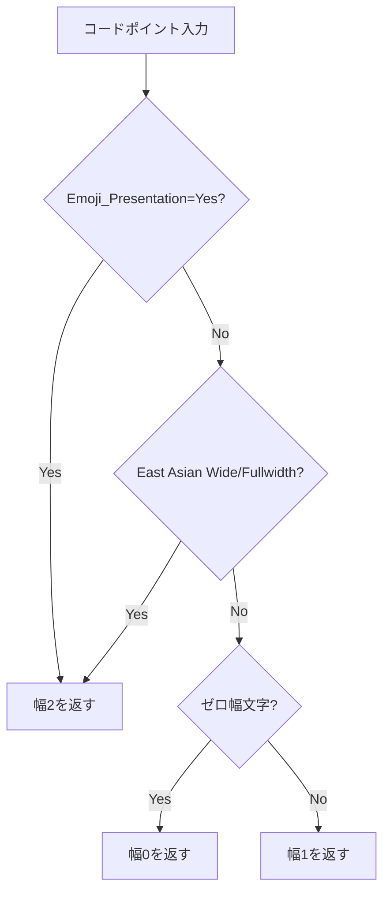

# 絵文字幅の正確な処理 - 要件定義書

## 1. 概要

### 1.1 背景

eMtermの現在のUnicode幅計算(`unicode.ts`)はCJK文字やFullwidth Forms等のEast Asian Width属性のみを考慮しており、絵文字のコードポイント範囲が含まれていない。これにより、絵文字が幅1として扱われ、カーソル位置やテキスト描画がずれる。

### 1.2 目的

- Unicode 17.0 / Emoji 17.0に準拠した絵文字幅判定の実装
- ZWJ絵文字シーケンスを含む書記素クラスタ単位での正確な幅計算
- 将来のUnicodeバージョン更新に対応可能な設計

### 1.3 スコープ

**対象:**
- `Emoji_Presentation=Yes`プロパティを持つ全文字の幅2判定
- Variation Selector (U+FE0F / U+FE0E) による幅の動的制御
- ZWJ絵文字シーケンスの書記素クラスタ単位の処理
- Regional Indicator（国旗絵文字）のペア処理
- ゼロ幅文字の正しい処理
- 対応Unicodeバージョンの管理

**対象外:**
- East Asian Ambiguous幅の処理（既存のまま）
- Enclosing Keycap sequences（#️⃣ 等）の完全対応
- タグベース絵文字（🏴󠁧󠁢󠁳󠁣󠁴󠁿 スコットランド旗等）

## 2. ビジネス要件

### 2.1 ビジネス目標

ターミナル上での絵文字表示を正確にし、AI時代のプロンプトやツール出力における絵文字の実用性を確保する。

### 2.2 対象ユーザー

| ユーザータイプ | 説明 |
|----------------|------|
| ターミナルユーザー | 絵文字を含むプロンプトやCLIツールを使用する開発者 |

### 2.3 期待される効果

- 絵文字を含むプロンプト表示のずれが解消される
- ZWJ絵文字シーケンスが1つの文字として正しく表示される

## 3. ユースケース

### 3.1 ユースケース一覧

| ID | ユースケース名 | アクター | 優先度 |
|----|----------------|----------|--------|
| UC01 | 単一絵文字の正しい幅表示 | ユーザー | 高 |
| UC02 | ZWJ絵文字シーケンスの正しい幅表示 | ユーザー | 高 |
| UC03 | 国旗絵文字の正しい幅表示 | ユーザー | 中 |
| UC04 | Variation Selectorによる幅変更 | ユーザー | 中 |

### 3.2 ユースケース詳細

#### UC01: 単一絵文字の正しい幅表示

**事前条件**: 絵文字を含むテキストがターミナルに出力される

**基本フロー**:
1. プログラムが絵文字コードポイント（例: U+1F4C1 📁）を出力
2. ターミナルが`Emoji_Presentation=Yes`であることを判定
3. 幅2としてセルに配置（本体セル + プレースホルダーセル）
4. カーソルが2セル分進む

**事後条件**: 絵文字の後のテキストが正しい位置に表示される

#### UC02: ZWJ絵文字シーケンスの正しい幅表示

**事前条件**: ZWJ絵文字シーケンスがターミナルに出力される

**基本フロー**:
1. 複数のコードポイントが順次出力される（例: 👨 U+200D 👩 U+200D 👧）
2. TypeScript側でコードポイントをバッファリング
3. 書記素クラスタの境界を検出
4. クラスタ全体を1つのセルに格納（幅2）
5. カーソルが2セル分進む

**事後条件**: ZWJ絵文字が2セル幅で1つの文字として表示される

## 4. 機能要件

### 4.1 機能一覧

| ID | 機能名 | 説明 | 優先度 |
|----|--------|------|--------|
| F01 | Emoji_Presentationルックアップ | Unicode 17.0のEmoji_Presentation=Yes全コードポイントの幅2判定 | 高 |
| F02 | ゼロ幅文字の修正 | ZWJ、Variation Selector等のゼロ幅判定 | 高 |
| F03 | 書記素クラスタバッファリング | TypeScript print handlerでの絵文字書記素クラスタのバッファリング | 高 |
| F04 | ZWJシーケンス幅判定 | ZWJ結合絵文字全体の幅2判定 | 高 |
| F05 | Variation Selector幅制御 | U+FE0F付きは幅2、U+FE0E付きは幅1 | 中 |
| F06 | Regional Indicatorペア処理 | 国旗絵文字の2文字ペアを幅2として処理 | 中 |
| F07 | 肌色修飾子の処理 | 絵文字+肌色修飾子を1つのクラスタとして処理 | 中 |
| F08 | バージョン管理 | 対応Unicodeバージョンのコメント記録 | 低 |

### 4.2 機能詳細

#### F01: Emoji_Presentationルックアップ

**説明**: Unicode 17.0で`Emoji_Presentation=Yes`と定義された全コードポイントを幅2として判定する。

**対象コードポイント**: BMP範囲（U+231A等）とSMP範囲（U+1F000以降）の両方を含む。

**処理フロー**:

#### F02: ゼロ幅文字の修正

**説明**: 以下のコードポイントを幅0として正しく判定する。

| 範囲 | 名称 |
|------|------|
| U+200B | Zero Width Space |
| U+200C | Zero Width Non-Joiner |
| U+200D | Zero Width Joiner |
| U+2060 | Word Joiner |
| U+FEFF | Zero Width No-Break Space / BOM |
| U+FE00-U+FE0F | Variation Selectors |
| U+E0100-U+E01EF | Variation Selectors Supplement |
| U+1F3FB-U+1F3FF | Emoji Skin Tone Modifiers（クラスタ内のみ） |

#### F03: 書記素クラスタバッファリング

**説明**: TypeScript側のprint handlerで、絵文字の書記素クラスタを構成するコードポイントをバッファリングし、クラスタ単位でセルに配置する。

**バッファリング対象**: 直前のコードポイントが絵文字（Extended_Pictographic）である場合、以下が続くとバッファに追加する:
- ZWJ (U+200D) + 次の絵文字
- Variation Selector (U+FE00-U+FE0F)
- 肌色修飾子 (U+1F3FB-U+1F3FF)
- Combining marks

**バッファ完了条件**: 上記以外のコードポイントが来た時点でバッファを確定し、セルに配置する。

#### F05: Variation Selector幅制御

**説明**: Variation Selectorによる幅の動的変更。

| シーケンス | 幅 |
|------------|-----|
| 絵文字 + U+FE0F | 2 |
| 絵文字 + U+FE0E | 1 |
| Emoji_Presentation=Yes（VSなし） | 2 |
| Emoji_Presentation=No（VSなし） | East Asian Width に従う |

#### F06: Regional Indicatorペア処理

**説明**: U+1F1E6-U+1F1FF（Regional Indicator Symbol Letter A-Z）の2文字ペアを国旗絵文字として幅2で処理する。

## 5. 非機能要件

### 5.1 パフォーマンス要件

- ASCII文字の高速パスは維持する（既存のfastpath最適化を変更しない）
- 絵文字幅判定のルックアップは定数時間（範囲チェック）で行う
- バッファリングによる入力遅延を最小限にする

### 5.2 保守性要件

- 対応Unicodeバージョン（17.0）をソースコードのコメントに明記
- `Emoji_Presentation=Yes`のコードポイント表は、Unicode公式データファイルからの手動更新が可能な形式で管理

### 5.3 互換性要件

- 既存のCJK/Fullwidth文字の幅判定に影響を与えない
- 既存のテスト（`bun test`、`cargo test`）が通る

## 6. データ要件

### 6.1 Emoji_Presentation=Yes コードポイント表

Unicode 17.0 `emoji-data.txt`に基づく。BMP範囲のエントリ:

| 範囲 | 文字例 |
|------|--------|
| 231A..231B | ⌚⌛ |
| 23E9..23EC | ⏩⏬ |
| 23F0 | ⏰ |
| 23F3 | ⏳ |
| 25FD..25FE | ◽◾ |
| 2614..2615 | ☔☕ |
| 2648..2653 | ♈♓ |
| 267F | ♿ |
| 2693 | ⚓ |
| 26A1 | ⚡ |
| 26AA..26AB | ⚪⚫ |
| 26BD..26BE | ⚽⚾ |
| 26C4..26C5 | ⛄⛅ |
| 26CE | ⛎ |
| 26D4 | ⛔ |
| 26EA | ⛪ |
| 26F2..26F3 | ⛲⛳ |
| 26F5 | ⛵ |
| 26FA | ⛺ |
| 26FD | ⛽ |
| 2705 | ✅ |
| 270A..270B | ✊✋ |
| 2728 | ✨ |
| 274C | ❌ |
| 274E | ❎ |
| 2753..2755 | ❓❕ |
| 2757 | ❗ |
| 2795..2797 | ➕➗ |
| 27B0 | ➰ |
| 27BF | ➿ |
| 2B1B..2B1C | ⬛⬜ |
| 2B50 | ⭐ |
| 2B55 | ⭕ |

SMP範囲のエントリ（U+1F000以降）: SPEC.md に完全なリストを記載。

## 7. 制約条件

### 7.1 技術的制約

- Rustパーサーは変更しない（1コードポイントずつPrintをエミット）
- TypeScript側でバッファリングと書記素クラスタ判定を行う
- バッファリングはprint handler内で完結する

### 7.2 対応Unicodeバージョン

- Unicode 17.0 / Emoji 17.0 (2025年9月リリース)

## 8. 成功基準

### 8.1 受け入れ基準

- [ ] `Emoji_Presentation=Yes`の全コードポイントが幅2と判定される
- [ ] ZWJ絵文字シーケンスが1つの幅2文字として表示される
- [ ] Variation Selector付き絵文字の幅が正しく制御される
- [ ] 国旗絵文字（Regional Indicatorペア）が幅2として表示される
- [ ] 既存のCJK文字幅判定が変更されない
- [ ] 既存テストが全て通る

## 9. テストシナリオ

### 9.1 テスト観点

- [ ] 正常系: 単一絵文字（📁 U+1F4C1）が幅2
- [ ] 正常系: BMP絵文字（⌚ U+231A）が幅2
- [ ] 正常系: ZWJシーケンス（👨‍👩‍👧‍👦）が幅2
- [ ] 正常系: 国旗絵文字（🇯🇵）が幅2
- [ ] 正常系: 肌色修飾子付き絵文字（👋🏻）が幅2
- [ ] 正常系: U+FE0F付き絵文字が幅2
- [ ] 正常系: U+FE0E付き絵文字が幅1
- [ ] 正常系: ZWJ (U+200D) 単体が幅0
- [ ] 境界値: ASCII文字の幅が変更されない
- [ ] 境界値: CJK文字の幅が変更されない
- [ ] パフォーマンス: ASCII高速パスが維持される

## 10. 用語定義

| 用語 | 定義 |
|------|------|
| Emoji_Presentation | Unicodeプロパティ。デフォルトで絵文字（カラー）表示される文字に付与される |
| ZWJ | Zero Width Joiner (U+200D)。絵文字を結合して複合絵文字を形成する不可視文字 |
| Variation Selector | 前の文字の表示形式を制御する結合文字。U+FE0F（絵文字）/ U+FE0E（テキスト） |
| 書記素クラスタ | Grapheme Cluster。ユーザーが1文字として認識する最小の文字単位 |
| Regional Indicator | U+1F1E6-U+1F1FF。2文字のペアで国旗絵文字を構成する |
| Extended_Pictographic | UAX #29で定義される、絵文字書記素クラスタの基底となる文字のプロパティ |

## 11. 確認事項

### 11.1 確認済み事項

- [x] 対象範囲: Emoji_Presentation=Yes の全文字（BMP含む）
- [x] ZWJシーケンス: スコープに含める
- [x] 更新方法: 手動更新 + バージョン管理（コメントで記録）
- [x] ZWJ実装レイヤー: TypeScript側でバッファリング（Rustパーサーは変更しない）
- [x] VSなしの絵文字: Emoji_Presentation=Yes ならデフォルトで幅2

### 11.2 未確認・保留事項

- [ ] Enclosing Keycap sequences（#️⃣ 等）の対応（今回スコープ外）
- [ ] タグベース絵文字（🏴󠁧󠁢󠁳󠁣󠁴󠁿 等）の対応（今回スコープ外）

## 12. 参考資料

- Unicode 17.0 emoji-data.txt: https://www.unicode.org/Public/17.0.0/ucd/emoji/emoji-data.txt
- UAX #29 Unicode Text Segmentation: https://unicode.org/reports/tr29/
- UTS #51 Unicode Emoji: https://unicode.org/reports/tr51/
- UAX #11 East Asian Width: https://unicode.org/reports/tr11/
