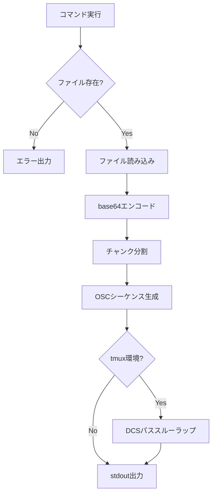

# ファイルダウンロード (emterm download) - 要件定義書

## 1. 概要

### 1.1 背景
eMtermはドラッグ&ドロップによるSFTPアップロード機能を実装済みだが、リモートサーバーからローカルへのファイルダウンロード手段がない。

### 1.2 目的
リモートサーバー上で `emterm download <file>` を実行することで、OSCシーケンス経由でファイルデータをeMterm側に転送し、ローカルに保存する機能を提供する。

### 1.3 スコープ
- CLIコマンド `emterm download` の追加（Rust）
- OSCシーケンスフォーマットの定義（ファイルダウンロード用）
- WASMパーサーでのOSCシーケンス受信処理
- TypeScript側でのファイル保存ダイアログ・プログレス表示
- tmux DCSパススルー対応

## 2. ビジネス要件

### 2.1 ビジネス目標
SSH接続先からファイルをダウンロードする手段を提供し、ターミナル操作だけで双方向のファイル転送を完結させる。

### 2.2 対象ユーザー
| ユーザータイプ | 説明 |
|----------------|------|
| 開発者 | SSHでリモートサーバーに接続して作業する開発者 |
| AI開発ツール | Claude Code等のAIツールがファイル転送に利用 |

### 2.3 期待される効果
- リモートからのファイルダウンロードがターミナル操作のみで完結する
- scp/rsync等の別ツールを使わずにファイル転送が可能になる
- SSH越し・tmux越しでもシームレスに動作する

## 3. ユースケース

### 3.1 ユースケース一覧
| ID | ユースケース名 | アクター | 優先度 |
|----|----------------|----------|--------|
| UC01 | リモートファイルのダウンロード | 開発者 | 高 |
| UC02 | パイプ経由のダウンロード | 開発者 | 中 |

### 3.2 ユースケース詳細

#### UC01: リモートファイルのダウンロード

**アクター**: 開発者

**事前条件**:
- eMtermでSSHセッションに接続済み
- リモートサーバーにemtermがインストール済み

**基本フロー**:
1. ユーザーがリモートで `emterm download <file>` を実行
2. CLIがファイルを読み込み、base64エンコードしてOSCシーケンスをstdoutに出力
3. eMtermがOSCシーケンスを検出し、チャンクを受信
4. 受信完了後、保存ダイアログを表示
5. ユーザーが保存先を選択してファイルを保存

**代替フロー**:
- ファイルが存在しない場合: エラーメッセージを表示して終了
- ユーザーがダイアログをキャンセル: ファイルを破棄
- tmux環境: DCSパススルーで自動ラップ

**事後条件**:
- ファイルがローカルに保存される

#### UC02: パイプ経由のダウンロード

**アクター**: 開発者

**事前条件**:
- eMtermでSSHセッションに接続済み

**基本フロー**:
1. ユーザーが `cat file | emterm download --name output.txt` を実行
2. CLIがstdinからデータを読み込み、OSCシーケンスとして出力
3. 以降はUC01と同様

## 4. 機能要件

### 4.1 機能一覧
| ID | 機能名 | 説明 | 優先度 |
|----|--------|------|--------|
| F01 | CLIコマンド | `emterm download <file>` コマンドの実装 | 高 |
| F02 | stdin入力 | パイプ経由でstdinからデータを受け取る | 中 |
| F03 | OSCシーケンス生成 | ファイルデータをOSCシーケンスにエンコード | 高 |
| F04 | WASMパーサー拡張 | OSCシーケンスの受信・解析 | 高 |
| F05 | ファイル保存ダイアログ | Tauriの保存ダイアログ表示 | 高 |
| F06 | プログレス表示 | eMterm側での転送進捗表示 | 高 |
| F07 | tmuxパススルー | tmux環境でのDCSパススルー対応 | 高 |

### 4.2 機能詳細

#### F01: CLIコマンド

**説明**: `emterm download <file>` でファイルをOSCシーケンスとしてstdoutに出力

**入力**:
- file: String - ファイルパス（必須）

**出力**:
- stdout: OSC 777シーケンス（base64エンコードされたファイルデータ）
- stderr: エラーメッセージ（失敗時）

**処理フロー**:


**エラーケース**:
| エラー | 条件 | 対応 |
|--------|------|------|
| FileNotFound | ファイルが存在しない | エラーメッセージ + exit code 1 |
| NotAFile | ディレクトリを指定 | エラーメッセージ + exit code 1 |
| PermissionDenied | 読み取り権限なし | エラーメッセージ + exit code 1 |
| ReadError | I/Oエラー | エラーメッセージ + exit code 1 |

#### F02: stdin入力

**説明**: パイプ経由でstdinからデータを受け取り、`--name` オプションでファイル名を指定

**入力**:
- stdin: バイナリデータ
- --name: String - 保存時のファイル名（必須、stdin使用時）

#### F03: OSCシーケンス生成

**説明**: 既存のmarkdownコマンドと同じUUID + チャンク方式

**フォーマット**:
```
ESC ] 777 ; emterm ; download ; begin ; id={uuid} ; name={filename} ; size={bytes} ; version=1.0 ESC \
ESC ] 777 ; emterm ; download ; chunk ; id={uuid} ; seq=N ; data={base64} ESC \
ESC ] 777 ; emterm ; download ; end ; id={uuid} ESC \
```

#### F04: WASMパーサー拡張

**説明**: WASMのOSCパーサーで `download` タイプのシーケンスを認識し、TypeScript側にコールバック

#### F05: ファイル保存ダイアログ

**説明**: 全チャンク受信完了後、Tauriのファイル保存ダイアログを表示

#### F06: プログレス表示

**説明**: チャンク受信中にeMterm側でプログレスを表示。OSCのbeginシーケンスに含まれるsizeとseq番号から進捗率を算出

#### F07: tmuxパススルー

**説明**: tmux環境を検出した場合、出力をDCSパススルーでラップ（既存のmarkdown/imageコマンドと同じ処理）

## 5. 非機能要件

### 5.1 パフォーマンス要件
- チャンクサイズ: 128KB（base64エンコード後、markdownコマンドと同じ）
- ファイルサイズ上限: なし（チャンク分割で任意サイズに対応）

### 5.2 セキュリティ要件
- ファイル保存前に必ず保存ダイアログを表示（ユーザー確認）
- パストラバーサル防止: ファイル名に `..` やパス区切りを含む場合はベースネームのみ使用
- OSCシーケンスの検証: 不正なフォーマットは無視

### 5.3 互換性要件
- Linux, Windows対応
- tmux DCSパススルー対応
- SSH越しの動作

## 6. UI/UX要件

### 6.1 プログレス表示
- 転送中にファイル名と進捗率を表示
- 完了時に通知

### 6.2 保存ダイアログ
- デフォルトファイル名: リモートのファイル名
- フィルタ: なし（任意のファイルタイプ）

## 7. 制約条件

### 7.1 技術的制約
- ターミナル経由のbase64転送のため、大きなファイルは転送に時間がかかる（約33%のオーバーヘッド）
- ターミナルのバッファサイズに依存するため、チャンク分割が必須

### 7.2 設計制約
- 既存のOSC 777 emterm拡張のフォーマット規約に従う
- ステートレスCLI設計を維持（emterm本体への接続不要）

## 8. テストシナリオ

### 8.1 テスト観点
- [ ] 正常系: テキストファイルのダウンロード
- [ ] 正常系: バイナリファイルのダウンロード
- [ ] 正常系: 大きなファイルの分割転送
- [ ] 正常系: stdin経由のダウンロード
- [ ] 異常系: 存在しないファイル
- [ ] 異常系: ディレクトリ指定
- [ ] 異常系: 読み取り権限なし
- [ ] 異常系: 保存ダイアログのキャンセル
- [ ] 境界値: 空ファイル
- [ ] セキュリティ: パストラバーサルを含むファイル名

## 9. 用語定義

| 用語 | 定義 |
|------|------|
| OSC | Operating System Command。ターミナルの制御シーケンス |
| DCSパススルー | tmux環境でOSCシーケンスをホスト側に転送する仕組み |
| チャンク | base64エンコードされたデータの分割単位 |

## 10. 確認事項

### 10.1 確認済み事項
- [x] 転送方式: OSCシーケンスによるbase64エンコード転送
- [x] 保存先: 保存ダイアログで毎回ユーザーが選択
- [x] ファイルサイズ上限: なし
- [x] ディレクトリ対応: 単一ファイルのみ
- [x] 進捗表示: eMterm側でUI通知
- [x] OSCフォーマット: 既存パターン（UUID + チャンク）を踏襲
- [x] セキュリティ: 保存ダイアログによるユーザー確認で十分
- [x] スケール: Standard

### 10.2 未確認・保留事項
- なし
