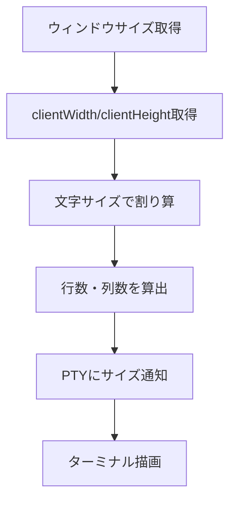

# ターミナル表示領域のフルサイズ化 - 要件定義書

## 1. 概要

### 1.1 背景
現在、eMtermのターミナルウィンドウにおいて、ウィンドウ下部に数行分の使用されていない余白領域が存在している。この余白により、本来表示できるはずの行数が減少し、ターミナルの表示領域が有効活用できていない。

一般的なターミナルエミュレータはパディングなしでウィンドウ全体を表示領域として使用しているが、現在のeMtermではウィンドウサイズに対して表示可能な行数が少なくなっている。

### 1.2 目的
ターミナルウィンドウの下部にある余白を解消し、ウィンドウ全体をターミナルの表示領域として使用できるようにすることで、より多くの行を表示可能にし、ユーザー体験を向上させる。

### 1.3 スコープ
- ターミナル表示領域の縦方向（高さ）のサイズ計算ロジックの修正
- CSSスタイルの調整（パディングの削除）
- 横方向は問題ないため対象外

## 2. ビジネス要件

### 2.1 ビジネス目標
- ターミナルエミュレータとしての表示効率を最大化する
- 標準的なターミナルエミュレータと同等の表示領域を確保する
- ユーザーの作業効率を向上させる

### 2.2 対象ユーザー
| ユーザータイプ | 説明 |
|----------------|------|
| 全ユーザー | eMtermを使用する全てのユーザー |
| 開発者 | 多くのログやコード出力を確認する必要があるユーザー |
| システム管理者 | ログ監視やシステム操作を行うユーザー |

### 2.3 期待される効果
- 同じウィンドウサイズでより多くの行を表示可能になる
- スクロール操作の頻度が減少する
- 他のターミナルエミュレータと同等の表示領域を実現する

## 3. ユースケース

### 3.1 ユースケース一覧
| ID | ユースケース名 | アクター | 優先度 |
|----|----------------|----------|--------|
| UC01 | ターミナルをフルサイズで使用する | ユーザー | 高 |
| UC02 | ウィンドウリサイズ時に表示領域を最大化する | ユーザー | 高 |

### 3.2 ユースケース詳細

#### UC01: ターミナルをフルサイズで使用する

**アクター**: ユーザー

**事前条件**:
- eMtermが起動している

**基本フロー**:
1. ユーザーがeMtermウィンドウを開く
2. システムはウィンドウサイズを取得する
3. システムはウィンドウ全体を表示領域として計算する
4. システムは最大限の行数・列数を計算する
5. ターミナルがウィンドウ下端まで表示される

**事後条件**:
- ウィンドウ下部に未使用の余白が存在しない
- 表示可能な最大行数でターミナルが表示される

#### UC02: ウィンドウリサイズ時に表示領域を最大化する

**アクター**: ユーザー

**事前条件**:
- eMtermが起動している

**基本フロー**:
1. ユーザーがウィンドウをリサイズする
2. システムは新しいウィンドウサイズを検知する
3. システムは新しいサイズに基づいて最大限の行数・列数を再計算する
4. ターミナルが新しいサイズでウィンドウ下端まで表示される

**事後条件**:
- リサイズ後もウィンドウ下部に余白が存在しない
- 新しいウィンドウサイズに応じた最大行数で表示される

## 4. 機能要件

### 4.1 機能一覧
| ID | 機能名 | 説明 | 優先度 |
|----|--------|------|--------|
| F01 | パディング除去 | ターミナルコンテナのパディングを0にする | 高 |
| F02 | サイズ計算の修正 | パディングを考慮しない正確なサイズ計算 | 高 |
| F03 | リサイズ対応 | ウィンドウリサイズ時の適切な再計算 | 高 |

### 4.2 機能詳細

#### F01: パディング除去

**説明**: ターミナルコンテナ要素(`#terminal`)に設定されているパディング(8px)を削除し、ウィンドウ端から端まで表示領域として使用できるようにする。

**対象ファイル**:
- `src/styles.css`

**変更内容**:
- `#terminal`の`padding: 8px;`を`padding: 0;`に変更

**影響範囲**:
- ターミナル表示全体のレイアウト
- カーソル位置の計算

#### F02: サイズ計算の修正

**説明**: ターミナルの行数・列数を計算する際に、パディングの考慮が不要になるため、計算ロジックを修正する。

**対象ファイル**:
- `src/main.ts`: 初期サイズ計算ロジック
- `src/pty/size.ts`: `calculateTerminalSize()`関数

**変更内容**:
- `main.ts`の初期サイズ計算から`- 16`（パディング分）を削除
- `calculateTerminalSize()`でパディングが0の場合の最適化
- `clientWidth`と`clientHeight`をそのまま使用して行数・列数を計算

**処理フロー**:


**計算式**:
```
cols = floor(clientWidth / charWidth)
rows = floor(clientHeight / charHeight)
```

#### F03: リサイズ対応

**説明**: ウィンドウがリサイズされた際に、新しいサイズに基づいて正確に再計算を行う。

**対象ファイル**:
- `src/pty/size.ts`: `observeContainerResize()`関数

**動作**:
- ResizeObserverによりコンテナサイズの変更を検知
- 新しいサイズで行数・列数を再計算
- PTYに新しいサイズを通知
- ターミナルの描画領域を更新

## 5. 非機能要件

### 5.1 パフォーマンス要件
- ウィンドウリサイズ時の再計算・再描画は100ms以内に完了すること
- リサイズ処理がユーザーの操作を妨げないこと

### 5.2 互換性要件
- 既存のMarkdown表示機能に影響を与えないこと
- 既存の画像表示機能に影響を与えないこと
- PTYの動作に影響を与えないこと

### 5.3 保守性要件
- コードの可読性を維持すること
- 既存のテストが引き続き通過すること
- 変更内容がドキュメント化されること

## 6. UI/UX要件

### 6.1 表示要件
- ターミナルの文字がウィンドウの端から端まで表示されること
- ウィンドウ下部に余白が存在しないこと
- 文字が画面端で途切れたり見づらくならないこと

### 6.2 レスポンシブ対応
- あらゆるウィンドウサイズで適切に表示されること
- 最小ウィンドウサイズでも表示が崩れないこと

## 7. データ要件

### 7.1 計算に使用するデータ
| データ項目 | 型 | 説明 |
|------------|-----|------|
| clientWidth | number | コンテナの幅（ピクセル） |
| clientHeight | number | コンテナの高さ（ピクセル） |
| charWidth | number | 1文字の幅（ピクセル） |
| charHeight | number | 1行の高さ（ピクセル） |
| cols | number | 計算された列数 |
| rows | number | 計算された行数 |

## 8. 制約条件

### 8.1 技術的制約
- Tauriのウィンドウサイズ取得APIの制約を考慮する必要がある
- ブラウザのレンダリング精度による誤差が発生する可能性がある
- 最小で1行1列は確保する必要がある

### 8.2 ビジネス上の制約
- 他の開発タスクへの影響を最小限にすること
- 既存機能を破壊しないこと

## 9. 想定される課題とリスク

### 9.1 技術的課題
| 課題 | 影響度 | 対応策 |
|------|--------|--------|
| 端数ピクセルの処理 | 中 | floor関数で切り捨てを徹底 |
| カーソル位置のずれ | 中 | パディングオフセット計算を修正 |
| Markdown表示の位置ずれ | 低 | Markdownレンダラーの位置計算を確認 |

### 9.2 ビジネスリスク
| リスク | 発生確率 | 影響度 | 対応策 |
|--------|----------|--------|--------|
| 既存ユーザーの違和感 | 低 | 低 | 一般的なターミナルと同じ動作であり問題なし |
| レイアウト崩れ | 中 | 中 | 十分なテストを実施する |

## 10. 成功基準

### 10.1 受け入れ基準
- [x] ユーザーから「下部に数行分の余白がある」という報告を受けた
- [ ] ウィンドウ下部の余白が解消されている
- [ ] 同じウィンドウサイズで以前より多くの行が表示できる
- [ ] ウィンドウリサイズ時も余白が発生しない
- [ ] 既存機能（Markdown表示、画像表示など）が正常に動作する
- [ ] テストが全て通過する

### 10.2 KPI
| 指標 | 目標値 | 測定方法 |
|------|--------|----------|
| 余白の高さ | 0px | スクリーンショット確認 |
| 表示可能行数 | 計算値と一致 | `cols`と`rows`の計算値を確認 |
| リサイズ応答時間 | < 100ms | パフォーマンス測定 |

## 11. テストシナリオ

### 11.1 テスト観点
- [x] 正常系: 通常のウィンドウサイズで余白がないこと
- [x] 正常系: ウィンドウリサイズ時に余白が発生しないこと
- [x] 異常系: 極端に小さいウィンドウでも最低1行1列確保されること
- [x] 異常系: 極端に大きいウィンドウでも正常に動作すること
- [x] 境界値: 1文字分に満たない端数ピクセルが適切に処理されること
- [x] 互換性: Markdown表示が正常に動作すること
- [x] 互換性: 画像表示が正常に動作すること

## 12. 用語定義

| 用語 | 定義 |
|------|------|
| 表示領域 | ターミナルの文字が表示される領域 |
| 余白 | ウィンドウ内で表示領域として使用されていない空間 |
| パディング | CSSで要素の内側に設けられる余白 |
| cols | ターミナルの列数（文字数） |
| rows | ターミナルの行数 |
| clientWidth/Height | CSS paddingを含まない要素の表示領域の幅/高さ |
| charWidth/Height | 1文字あたりの幅/高さ（ピクセル） |

## 13. 確認事項

### 13.1 確認済み事項

- [x] 下部の余白は数行分ある: ユーザー確認済み、スクリーンショットで確認
- [x] 余白は常に発生している: ユーザー確認済み
- [x] 左右方向は問題ない: ユーザー確認済み
- [x] フルサイズ（パディングなし）を目指す: ユーザー確認済み
- [x] パディングは0にする: ユーザー確認済み
- [x] 問題箇所は下部の余白: スクリーンショットで確認

### 13.2 未確認・保留事項
- [ ] なし（全ての必要情報は収集済み）

## 14. 参考資料

- スクリーンショット: `/dev/shm/work/output/image.png` - 下部に余白がある状態
- 現在のコード: `src/styles.css`, `src/main.ts`, `src/pty/size.ts`
- Tauri API Documentation: https://tauri.app/
