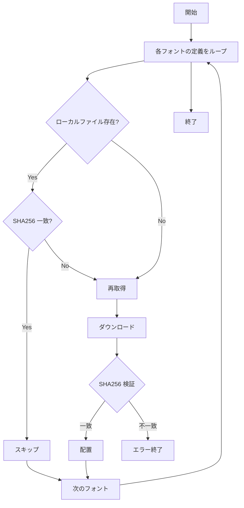

# フォント bundle 再設計 - 要件定義書

## 1. 概要

### 1.1 背景
Claude Code の auto mode on インジケータ `⏵`（U+23F5 BLACK MEDIUM RIGHT-POINTING TRIANGLE）が Windows ビルドで豆腐化する事象が発生した。原因は bundle 済みフォント（Noto Sans CJK JP / Noto Color Emoji）と現状のフォントチェーン（Inconsolata, Noto Sans JP, Noto Color Emoji）に U+23F5 が収録されていないため。

加えて、現状は約 27MB のフォントファイル（NotoColorEmoji.ttf / NotoSansCJKjp-Regular.otf）が直接 git 管理されており、リポジトリの肥大化およびフォント更新時の履歴増大という構造的な問題を抱えている。

### 1.2 目的
- フォントの取得方式を「git 管理から外して fetch スクリプトで取得」に変更し、リポジトリの軽量化と再現性確保を両立する
- bundle 対象に Noto Emoji（モノクロ）と Inconsolata を追加し、表示できない記号の発生を防ぐ
- 絵文字フォントを color / monochrome の二系統に分離指定できるようにし、text presentation 寄りの記号（`⏵` 等）も正しく描画できるようにする
- ユーザーが本体リリースを待たずにフォントを差し替えられる解決優先順位を導入する

### 1.3 スコープ
- フォント取得スクリプト `scripts/fetch-fonts.sh` の新規作成
- 既存 bundle フォントの git 管理外し（gitignore 化）
- Noto Emoji（モノクロ）および Inconsolata の bundle 対象への追加
- 絵文字フォント設定の color / monochrome 分離
- フォント解決優先順位の刷新（設定 > ユーザーディレクトリ > システム > bundle）
- 既存設定キーの自動マイグレーション
- build.rs のフェイルセーフ
- Makefile および GitHub Actions の統合
- 対象外：自動ダウンロード機構（初回起動時の取得）、Git LFS 移行、submodule 化

## 2. ビジネス要件

### 2.1 ビジネス目標
- リポジトリサイズの圧縮による開発者体験の改善（clone / fetch の高速化）
- Unicode 標準で text presentation を持つ記号（特に Claude Code の `⏵` 等）の正常表示を保証
- フォント更新サイクルと emterm 本体のリリースサイクルを分離

### 2.2 対象ユーザー
| ユーザータイプ | 説明 |
|----------------|------|
| emterm エンドユーザー（Linux） | リリース成果物を使う一般ユーザー。挙動はリリース内蔵フォントで担保 |
| emterm エンドユーザー（Windows） | 同上。特に bundle フォント不在時の Symbol 系欠落の影響を受けやすい |
| emterm 開発者 | リポジトリを clone してビルドする開発者。`make fetch-fonts` 実行が新たな初期セットアップ手順 |
| Claude Code 等 AI 連携ユーザー | text presentation 記号を多用する CLI を emterm 上で動かすユーザー |

### 2.3 期待される効果
- リポジトリサイズが約 30MB → ほぼ 0 に削減
- フォント更新時の git 履歴肥大の解消
- `⏵` 等の text presentation 記号の Windows 表示問題の解消
- ユーザーが個別フォント（特に最新版絵文字）を本体リリース無しに差し替え可能

## 3. ユースケース

### 3.1 ユースケース一覧
| ID | ユースケース名 | アクター | 優先度 |
|----|----------------|----------|--------|
| UC01 | 初回 clone 後にフォントを取得する | emterm 開発者 | 高 |
| UC02 | フォント更新を確認・適用する | emterm 開発者 | 中 |
| UC03 | CI ビルドでフォントを取得して emterm をビルドする | GitHub Actions | 高 |
| UC04 | Windows で `⏵` を含む出力を表示する | エンドユーザー | 高 |
| UC05 | 個別フォントをユーザーディレクトリ経由で差し替える | エンドユーザー | 中 |
| UC06 | 既存 settings.json を持つユーザーが本バージョンに更新する | エンドユーザー | 高 |

### 3.2 ユースケース詳細

#### UC01: 初回 clone 後にフォントを取得する
**アクター**: emterm 開発者

**事前条件**:
- リポジトリを `git clone` 済み
- ネットワーク接続あり

**基本フロー**:
1. 開発者が `make setup` または `make fetch-fonts` を実行
2. `scripts/fetch-fonts.sh` が GitHub Releases から各フォントを取得
3. 取得後に SHA256 検証を行う
4. `src-tauri/assets/fonts/` 配下に配置
5. 続けて `make build` でフォントを include したバイナリが生成される

**代替フロー**:
- ネットワーク不通 → 取得失敗をユーザに通知してスクリプトを exit 非ゼロで終了
- SHA256 不一致 → エラーメッセージを表示して取得済みファイルを残さない

**事後条件**:
- `src-tauri/assets/fonts/` に既定ファイル名で正しいフォントが存在

#### UC02: フォント更新を確認・適用する
**アクター**: emterm 開発者

**事前条件**:
- `scripts/fetch-fonts.sh` のフォントバージョン定義（tag + SHA256）が更新されている

**基本フロー**:
1. 開発者が `make fetch-fonts` を実行（または `make build` 経由）
2. スクリプトは現在配置されているフォントの SHA256 が期待値と異なる、もしくはファイル不在の場合のみ取得
3. 期待値と一致していればスキップ（冪等）

**事後条件**:
- フォントファイルが最新バージョンに更新される

#### UC03: CI ビルドでフォントを取得して emterm をビルドする
**アクター**: GitHub Actions

**事前条件**:
- ワークフローが `actions/checkout` 済み
- インターネットアクセス可能

**基本フロー**:
1. workflow ステップで `bash scripts/fetch-fonts.sh` を実行
2. 取得した SHA256 をキーに `actions/cache` を利用してキャッシュ
3. キャッシュヒット時は再取得をスキップ
4. cargo build / xwin build / dpkg などのビルドステップが bundle 込みで成功する

#### UC04: Windows で `⏵` を含む出力を表示する
**アクター**: エンドユーザー（Windows）

**事前条件**:
- リリース成果物の emterm.exe を実行中
- Claude Code 等 `⏵` を出力するプログラムを起動

**基本フロー**:
1. プログラムが `⏵`（U+23F5）を出力
2. emterm のフォントチェーンが Noto Emoji（モノクロ・bundle）にフォールバック
3. 端末上に `⏵` が正しく描画される

**代替フロー**:
- VS16 (U+FE0F) が付与されたコードポイント → color 絵文字フォントで描画

#### UC05: 個別フォントをユーザーディレクトリ経由で差し替える
**アクター**: エンドユーザー

**事前条件**:
- emterm がインストール済み
- ユーザーが入手したいフォントファイル（OFL 等）を所有

**基本フロー**:
1. ユーザーが `~/.local/share/net.laser5.app.emterm/fonts/` （Linux）または `%APPDATA%\net.laser5.app.emterm\fonts\` （Windows）にフォントファイルを配置
2. emterm を再起動
3. フォント解決が「設定 > ユーザーディレクトリ > システム > bundle」の順で動作し、ユーザーディレクトリのフォントが優先される

#### UC06: 既存 settings.json を持つユーザーが本バージョンに更新する
**アクター**: エンドユーザー

**事前条件**:
- 既存バージョンの `settings.json` に `font_family_emoji` または `markdown_emoji_font_family` が設定されている

**基本フロー**:
1. ユーザーが新バージョンの emterm を起動
2. settings 読み込み時に旧キーを検出
3. 旧キーの値を新キー（color 系統）にマイグレーション
4. settings.json を新スキーマで書き戻す

**事後条件**:
- 旧設定値は color 絵文字フォント設定として保持される
- monochrome 絵文字フォントは既定値で初期化される

## 4. 機能要件

### 4.1 機能一覧
| ID | 機能名 | 説明 | 優先度 |
|----|--------|------|--------|
| F01 | フォント取得スクリプト | GitHub Releases から固定 tag + SHA256 検証でフォントを取得 | 高 |
| F02 | git 管理外し | フォントファイルを `.gitignore` 対象とする | 高 |
| F03 | bundle 対象フォントの拡張 | Noto Emoji（モノクロ）・Inconsolata を追加 | 高 |
| F04 | 絵文字フォント分離指定 | color / monochrome を別キーで設定可能とする | 高 |
| F05 | フォント解決優先順位 | 設定 > ユーザーディレクトリ > システム > bundle | 高 |
| F06 | 既存設定の自動マイグレーション | 旧キーを新キーに移行 | 高 |
| F07 | build.rs フェイルセーフ | フォント不在時に分かりやすいエラーを出力 | 高 |
| F08 | Makefile / CI 統合 | `make fetch-fonts` ターゲットおよび GitHub Actions ステップ | 高 |

### 4.2 機能詳細

#### F01: フォント取得スクリプト
**説明**: `scripts/fetch-fonts.sh` を新規作成し、GitHub Releases から定義された tag の URL でフォントをダウンロードし、SHA256 検証後に `src-tauri/assets/fonts/` に配置する。

**入力**:
- 環境変数（任意）：プロキシ等。基本的にスクリプト内部に固定値を持つ

**出力**:
- `src-tauri/assets/fonts/NotoColorEmoji.ttf`
- `src-tauri/assets/fonts/NotoSansCJKjp-Regular.otf`
- `src-tauri/assets/fonts/NotoEmoji-Regular.ttf`
- `src-tauri/assets/fonts/Inconsolata-Regular.ttf`

**処理フロー**:


**ビジネスルール**:
- 取得元は GitHub Releases の特定 tag 固定 URL（永続）
- SHA256 はスクリプト内に固定値として埋め込む
- 既存ファイルが期待 SHA256 と一致する場合は再取得しない（冪等）
- 取得失敗時は exit code 非ゼロで終了し、エラーメッセージを stderr に出力

**バリデーション**:
| 項目 | ルール | エラーメッセージ |
|------|--------|------------------|
| SHA256 | 期待値と一致 | `error: SHA256 mismatch for <file>` |
| ネットワーク | curl/wget が成功 | `error: failed to download <url>` |
| ツール存在 | curl または wget が利用可能 | `error: neither curl nor wget found` |

#### F02: git 管理外し
**説明**: 既存 bundle フォント（`NotoColorEmoji.ttf` / `NotoSansCJKjp-Regular.otf`）と新規追加フォントを `.gitignore` 対象とし、git 履歴から削除する。

**ビジネスルール**:
- LICENSE / README.md は git 管理を維持
- `src-tauri/assets/fonts/.gitignore` で `*.ttf` / `*.otf` を除外
- 既存の `git rm --cached` でフォントを履歴から落とす

#### F03: bundle 対象フォントの拡張
**説明**: 取得対象を以下の 4 フォントに拡張する。

| フォント | ファイル名 | 用途 |
|---|---|---|
| Noto Color Emoji | `NotoColorEmoji.ttf` | カラー絵文字 |
| Noto Sans CJK JP | `NotoSansCJKjp-Regular.otf` | CJK 基本フォント |
| Noto Emoji（モノクロ） | `NotoEmoji-Regular.ttf` | text presentation 記号 / モノクロ絵文字 |
| Inconsolata | `Inconsolata-Regular.ttf` | デフォルト等幅フォント |

各フォントは `include_bytes!` でバイナリに埋め込み、`gui` feature gate 内でのみ使用する。CLI-only ビルドはこれらを参照しない。

#### F04: 絵文字フォント分離指定
**説明**: 既存の単一キー `font_family_emoji` / `markdown_emoji_font_family` を color / monochrome の二系統に分離する。

**新設定キー**:
| キー | 既定値 | 用途 |
|---|---|---|
| `font_family_emoji_color` | `Noto Color Emoji` | VS16 付きおよび emoji presentation コードポイント |
| `font_family_emoji_monochrome` | `Noto Emoji` | VS15 付きおよび text presentation コードポイント（U+23F5 等） |
| `markdown_emoji_font_family_color` | `Noto Color Emoji` | Markdown ビューアの color 絵文字 |
| `markdown_emoji_font_family_monochrome` | `Noto Emoji` | Markdown ビューアの monochrome 絵文字 |

**絵文字 presentation 判定ルール**:
- コードポイントに VS16 (U+FE0F) が付いている → color
- コードポイントに VS15 (U+FE0E) が付いている → monochrome
- 単体コードポイントで Unicode emoji_presentation property を持つ → color
- 上記以外で Unicode emoji property を持つ（text presentation がデフォルト） → monochrome
- どちらも fallback 不在の場合は反対系統に降りる

#### F05: フォント解決優先順位
**説明**: フォント解決チェーンを以下の優先順位で実装する。

```
1. 設定で明示指定されたフォントパス（フルパス指定時）
2. ユーザーディレクトリ
   - Linux: ~/.local/share/net.laser5.app.emterm/fonts/
   - Windows: %APPDATA%\net.laser5.app.emterm\fonts\
3. システムフォント（fontdb の load_system_fonts で検出）
4. bundle（include_bytes! で埋め込み済み）
```

**ビジネスルール**:
- ユーザーディレクトリ・システムは family 名検索
- bundle は family 名検索および role ベースの最終 fallback の両方を担う
- 探索結果は起動時に resolver registry に登録され、起動後は read-only

#### F06: 既存設定の自動マイグレーション
**説明**: settings.json 読み込み時に旧キーを検出し、新キーに移行する。

**マイグレーションルール**:
- `font_family_emoji` の値 → `font_family_emoji_color` に移行
- `markdown_emoji_font_family` の値 → `markdown_emoji_font_family_color` に移行
- `font_family_emoji_monochrome` および `markdown_emoji_font_family_monochrome` は既定値で初期化
- マイグレーション後、settings.json を新スキーマで書き戻す
- 旧キーは serde の `#[serde(rename, alias)]` 等で読み取り可能とするか、もしくはマイグレーション専用の読込パスを通す

#### F07: build.rs フェイルセーフ
**説明**: `gui` feature 有効時、`include_bytes!` でフォントファイルを参照する前に `build.rs` が存在チェックを行い、不在時は明示的なエラーメッセージで panic する。

**エラーメッセージ例**:
```
error: bundled font missing at src-tauri/assets/fonts/NotoEmoji-Regular.ttf
        Run `make fetch-fonts` or `bash scripts/fetch-fonts.sh` to download bundled fonts.
```

#### F08: Makefile / CI 統合
**説明**: Makefile と GitHub Actions に fetch-fonts ステップを組み込む。

**Makefile 変更**:
- `fetch-fonts` ターゲット新設
- `setup` / `build` / `dpkg` / `dev` のフォント必須ターゲットは `fetch-fonts` に依存

**GitHub Actions 変更**:
- 既存のビルド/リリースワークフロー全てに `bash scripts/fetch-fonts.sh` ステップを追加
- `actions/cache` を SHA256 ベースのキーで利用してキャッシュ最適化

## 5. 非機能要件

### 5.1 パフォーマンス要件
- fetch-fonts.sh のキャッシュ判定（SHA256 計算込み）は 1 秒以内に完了
- フォント resolver 起動時スキャンは既存（NFR1 < 500ms）を維持
- include_bytes! によるバイナリサイズ増加は約 +2MB 以内に収まる（Noto Emoji + Inconsolata）

### 5.2 セキュリティ要件
- フォント取得時は HTTPS のみ
- SHA256 検証を必ず行う（サプライチェーン攻撃対策）
- 取得元 URL とハッシュは git で管理（誰でも検証可能）

### 5.3 可用性要件
- GitHub Releases のフォント配布元 URL は永続的（tag 固定）
- ネットワーク不通時はビルド前に分かりやすく失敗する
- 一度 fetch 後はオフライン開発可能

### 5.4 保守性要件
- フォントのバージョン更新はスクリプト内の定義変更のみで完結
- フォント追加時の手順を README に明記
- マイグレーション処理にはユニットテストを設ける

### 5.5 互換性要件
- 既存 settings.json は自動マイグレーションで継続利用可能
- Linux / Windows 双方で同じスクリプト・同じ取得元・同じ SHA256
- CLI-only ビルド（`--no-default-features`）はフォントを参照しないので影響なし

## 6. UI/UX要件

### 6.1 画面設計要件
設定パネルのフォントセクションに以下を追加：
- 「絵文字フォント（カラー）」: 現状のフォントピッカーを流用
- 「絵文字フォント（モノクロ）」: 新規追加

### 6.2 画面遷移
変更なし

### 6.3 レスポンシブ対応
対象外（既存設定パネルに準じる）

## 7. データ要件

### 7.1 データモデル概要
settings.json のスキーマ変更のみ。新規追加・移行は F04 / F06 を参照。

### 7.2 データ項目
| エンティティ | 項目名 | 型 | 必須 | 説明 |
|--------------|--------|-----|------|------|
| AppSettings | font_family_emoji_color | string | ○ | カラー絵文字フォント family |
| AppSettings | font_family_emoji_monochrome | string | ○ | モノクロ絵文字フォント family |
| AppSettings | markdown_emoji_font_family_color | string | ○ | Markdown 用カラー絵文字 family |
| AppSettings | markdown_emoji_font_family_monochrome | string | ○ | Markdown 用モノクロ絵文字 family |

旧キー（廃止）:
- `font_family_emoji`
- `markdown_emoji_font_family`

### 7.3 データ保持期間
対象外

## 8. 外部連携

### 8.1 連携システム
| システム名 | 連携方法 | データ |
|------------|----------|--------|
| GitHub Releases (googlefonts/noto-emoji) | HTTPS GET | NotoColorEmoji.ttf, NotoEmoji-Regular.ttf |
| GitHub Releases (notofonts/noto-cjk) | HTTPS GET | NotoSansCJKjp-Regular.otf |
| GitHub Releases (googlefonts/Inconsolata) | HTTPS GET | Inconsolata-Regular.ttf |

### 8.2 API仕様要件
GitHub Releases の静的アセット URL（`https://github.com/<owner>/<repo>/releases/download/<tag>/<file>`）を利用

## 9. 制約条件

### 9.1 技術的制約
- `include_bytes!` はコンパイル時にファイルが存在する必要がある
- fontdb の system font scan には初回 100ms 程度かかる（既存）
- Windows の `%APPDATA%` 取得は `dirs` crate 等に依存（既存設定パスと同様）

### 9.2 ビジネス上の制約
- bundle 対象フォントは全て OFL ライセンス（再配布可）であること
- フォント取得元は永続的に維持される必要がある（GitHub Releases を採用）

### 9.3 スケジュール制約
特になし

## 10. 想定される課題とリスク

### 10.1 技術的課題
| 課題 | 影響度 | 対応策 |
|------|--------|--------|
| GitHub Releases URL の変更 | 高 | tag 固定 URL を使用、変更時はリポジトリで対応 |
| フォントのアップストリーム削除 | 中 | OFL の self-host バックアップ手順を README に記載 |
| マイグレーション失敗で設定が消える | 高 | マイグレーション前に backup を取り、失敗時は復元 |
| Linux 等 ~/.local/share 不在環境 | 低 | XDG_DATA_HOME を尊重、不在時は探索パスをスキップ |
| Noto Emoji（モノクロ）のグリフ被り | 低 | text presentation の判定で正しく分岐 |

### 10.2 ビジネスリスク
| リスク | 発生確率 | 影響度 | 対応策 |
|--------|----------|--------|--------|
| 開発者が `make fetch-fonts` を忘れる | 中 | 中 | build.rs フェイルセーフで防止 |
| CI でフォント取得失敗 | 低 | 中 | キャッシュ機構 + リトライで緩和 |

## 11. 成功基準

### 11.1 受け入れ基準
- [ ] `git clone` 後 `make build` が（fetch-fonts 経由で）成功する
- [ ] `src-tauri/assets/fonts/*.ttf` および `*.otf` が `.gitignore` 対象になっている
- [ ] `git ls-files src-tauri/assets/fonts/` がフォント本体を含まない
- [ ] Windows ビルドで `⏵`（U+23F5）が描画される
- [ ] settings.json 旧キーを持つユーザーがアップデート後も既存挙動を保つ
- [ ] ユーザーディレクトリにフォントを置くと優先される
- [ ] SHA256 検証が機能する（改ざんファイルでエラー）
- [ ] build.rs がフォント不在時に分かりやすく panic する

### 11.2 KPI
| 指標 | 目標値 | 測定方法 |
|------|--------|----------|
| リポジトリサイズ | 30MB 削減 | `git count-objects -vH` |
| 起動時 font scan | < 500ms（既存維持） | `EMTERM_FONT_PERF=1` |

## 12. テストシナリオ

### 12.1 テスト観点
- [ ] 正常系: 初回 fetch、再 fetch（冪等）、ビルド、起動、`⏵` 表示
- [ ] 異常系: SHA256 不一致、ネットワーク失敗、フォント不在ビルド
- [ ] 境界値: VS16 付き / VS15 付き / 無修飾の text presentation コードポイント
- [ ] セキュリティ: SHA256 改ざん検知
- [ ] 互換性: 旧 settings.json のマイグレーション
- [ ] パフォーマンス: include_bytes! バイナリサイズ増加が +2MB 以内

## 13. 用語定義

| 用語 | 定義 |
|------|------|
| bundle | `include_bytes!` でバイナリに埋め込むこと |
| OFL | SIL Open Font License。フォントの再配布を許可するライセンス |
| VS15 / VS16 | Variation Selector-15 (U+FE0E, text) / -16 (U+FE0F, emoji) |
| text presentation | 絵文字コードポイントを「文字」として表示する状態 |
| emoji presentation | 絵文字コードポイントを「絵文字」として表示する状態 |
| fontdb | swash 系で使うフォントデータベースクレート |

## 14. 確認事項

### 14.1 確認済み事項
- [x] スコープ: Task 1〜3 全部（取得方式整備 / フォント追加 + 絵文字分離 / ユーザーディレクトリ上書き）
- [x] build.rs の挙動: panic でエラー（手動 fetch 必須）
- [x] バージョン固定方法: GitHub Releases の特定 tag + SHA256 検証
- [x] Inconsolata の扱い: デフォルト等幅フォント候補として bundle に含める
- [x] 既存設定キー: 廃止して自動マイグレーション
- [x] ユーザーディレクトリ: アプリデータディレクトリの fonts/

### 14.2 未確認・保留事項
- [ ] 各フォントの具体的な GitHub Releases tag と SHA256 値（実装フェーズで確定）
- [ ] CSS / Markdown ビューア側の monochrome 絵文字適用範囲の詳細仕様
- [ ] 既存テスト `font-swash-migration` 関連の影響範囲

## 15. 参考資料

- 元レポート: `tmp/font-bundle-redesign-2026-06-24.md`
- 関連メモリ: `feedback_no_unsolicited_build.md`（リリースビルドは勝手に走らせない）
- 関連 SDD: `doc/tasks/font-swash-migration/`, `doc/tasks/default-font-adjustment/`
- フォントライセンス: SIL Open Font License (OFL) — https://scripts.sil.org/OFL
