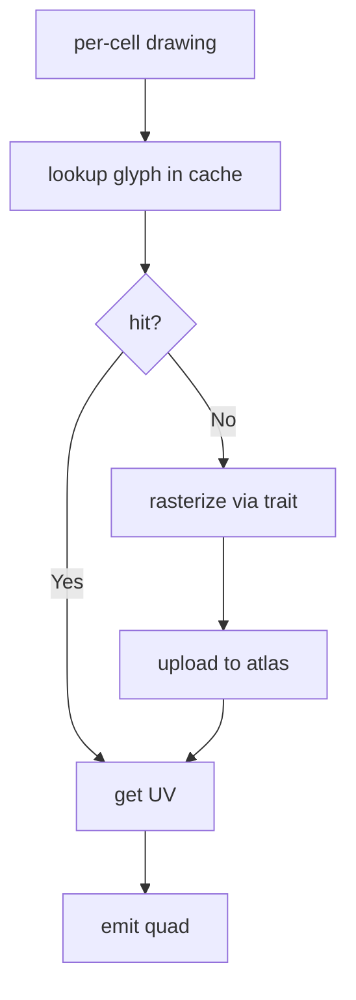
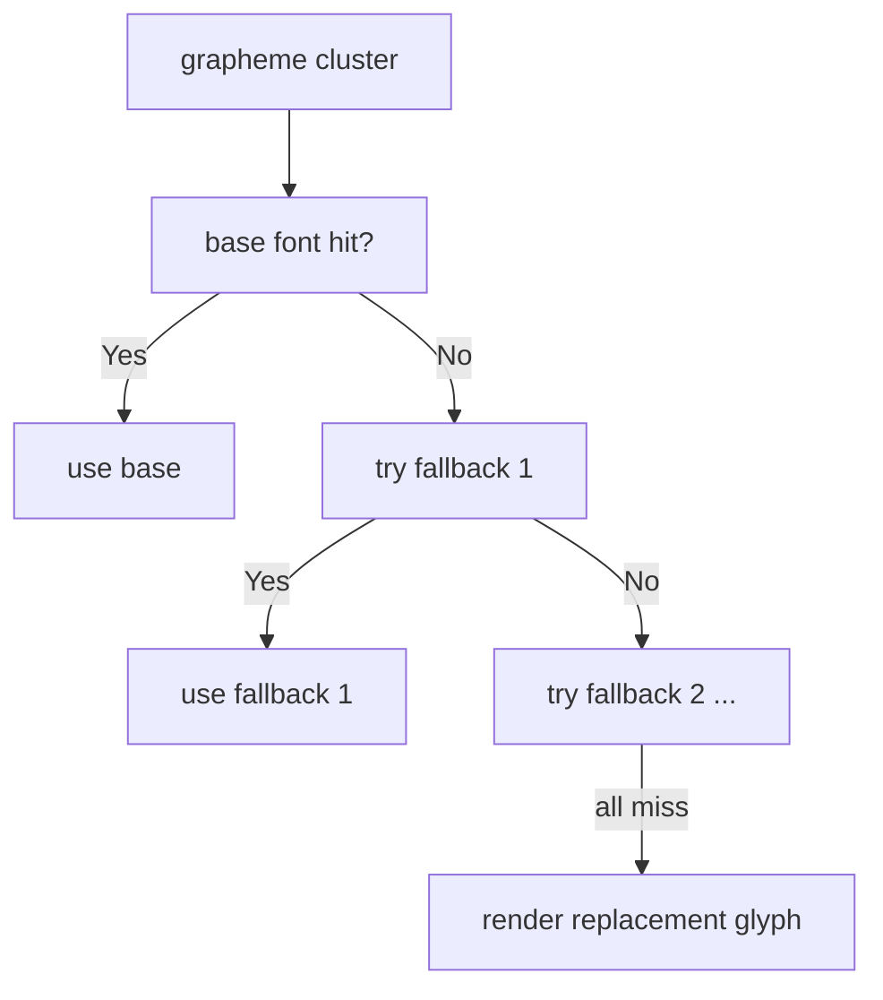
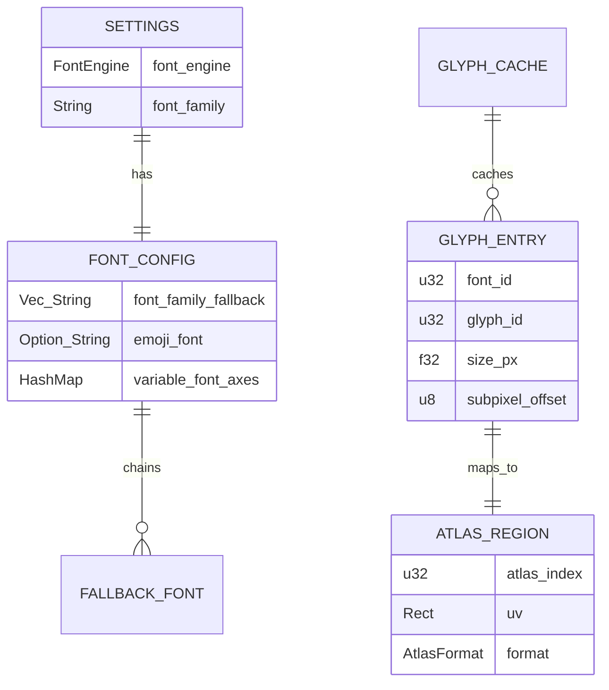

# font-swash-migration - 要件定義書

## 1. 概要

### 1.1 背景

emterm の native-poc バイナリ (`emterm-native-poc`) は Phase 4-G 完了時点 (HEAD = 5c54d1a) で winit 0.30.9 + egui 0.29 + wgpu 22 構成のターミナルを描画できる状態にある。一方、egui のデフォルト font backend (`ab_glyph`) は以下の制約を持つ。

- ベクトル glyph のみ対応。COLR v0 / COLR v1 / CBDT / CBLC / SVG-in-OT のいずれにも非対応
- フォント解決パイプラインを内蔵せず、CJK fallback chain が組めない

結果として Phase 4-G の host 検証 (Linux X11 + fcitx5) で以下が実測された。

- 日本語入力 (ひらがな / 漢字) が「豆腐」(`U+FFFD` / 未グリフ box) で表示される
- 色絵文字 (Noto Color Emoji 由来) が一切描画されない

WezTerm / Zed / Vello / cosmic-text などモダンな Rust GUI は軒並み `swash` (HarfBuzz 相当のシェーピング + ラスタライズ) もしくは `swash` を内包する `cosmic-text` に移行している。

### 1.2 目的

native-poc のフォントラスタライザ層を `ab_glyph` から `swash` + `zeno` に置き換える。これにより以下を達成する。

- CJK (日本語 / 中国語 / 韓国語) の正常表示
- 色絵文字 (COLR / CBDT / SVG-in-OT) の正常表示
- フォント fallback chain による「複数フォントを組み合わせた単一行描画」

### 1.3 スコープ

#### 対象

- `native-poc/` クレートのターミナルグリッド描画パス (`src/render/`)
- フォント解析・shaping・ラスタライズ層 (新規追加)
- glyph cache 抽象化 (egui-wgpu 内部 atlas に張り付いたパスを `Glyph` trait + texture atlas の二層に分解)
- `Settings::font_engine` 切替フラグの追加 (`ab_glyph` と `swash` 並走)
- `Settings::font_family_fallback` / `Settings::emoji_font` / `Settings::variable_font_axes` の追加 (フィールド定義のみ)
- フォント同梱 (Noto Sans CJK JP / Noto Color Emoji) と読み込み配線
- 既存 `Theme::{font_family, font_size_pt}` の `#[allow(dead_code)]` 化解消

#### スコープ外

- Wry ビューア (Markdown / JSON / YAML / 画像拡大) のフォント。WebView 側は WebKit/CSS のフォントスタックを使用、本 SDD の対象外
- ligature 表示 (Fira Code / JetBrains Mono の `==>` などの合字)
- 縦書き
- bidi (Arabic / Hebrew の方向反転)
- TrueType bytecode hinting (freetype 依存になるため見送り)
- 設定 UI (Wry settings ウィンドウから新フィールドを編集できるようにするのは Phase 6)
- macOS 対応

## 2. ビジネス要件

### 2.1 ビジネス目標

「AI 時代に使えるターミナル」として日本語ユーザーが最低限の文字入力 / 表示で詰まらない状態を確保する。Phase 4-G で IME 入力経路は確立済みだが、表示が豆腐では実用に至らないため、本 SDD は native-poc の実用化ブロッカーを解消する位置付け。

### 2.2 対象ユーザー

| ユーザータイプ | 説明 |
|----------------|------|
| 日本語環境のローカルユーザー | Linux / Windows ホストで日本語を入力・表示する |
| 絵文字を使う開発者 | git log / コミットメッセージ / Claude Code 出力に含まれる絵文字を見る |
| CJK ロケールのユーザー | 中国語 / 韓国語含む CJK スクリプトを表示する |

### 2.3 期待される効果

- native-poc を日本語環境で実用ベースに乗せる
- 色絵文字対応で AI ツール (Claude Code 等) のリッチ出力との親和性を確保
- フォント基盤を再利用可能な層に切り出し、Phase 5 以降の UI 拡張で揺らがない

## 3. ユースケース

### 3.1 ユースケース一覧

| ID | ユースケース名 | アクター | 優先度 |
|----|----------------|----------|--------|
| UC01 | 日本語を含むターミナル出力を読む | 日本語ユーザー | 高 |
| UC02 | IME で日本語を入力して PTY に送る (preedit 表示も含む) | 日本語ユーザー | 高 |
| UC03 | 色絵文字を含む出力を読む | 開発者 | 高 |
| UC04 | フォント切替フラグで `ab_glyph` 経路に退避する | 開発者 | 中 |
| UC05 | システムインストール済みフォントを使う | 任意のユーザー | 中 |

### 3.2 ユースケース詳細

#### UC01: 日本語を含むターミナル出力を読む

**アクター**: 日本語ユーザー

**事前条件**:
- native-poc が起動済み
- PTY 上で `echo こんにちは` のような日本語出力を流す

**基本フロー**:
1. PTY が UTF-8 で日本語バイト列を出力する
2. `term_core` の ANSI parser が grapheme cluster に分解、各 cell に格納
3. レンダラが各 cell の文字を fallback chain で解決
4. 日本語グリフ (Noto Sans CJK JP) がラスタライズされて wgpu texture atlas に置かれる
5. cell の幅 (2 セル幅) と一致した位置に描画される

**事後条件**:
- 「こんにちは」が豆腐ではなく日本語として読める形で描画される

#### UC02: IME で日本語を入力する

**アクター**: 日本語ユーザー

**事前条件**:
- fcitx5 / ibus / Windows MS-IME が起動済み
- Phase 4-G の winit IME bridge が動作している

**基本フロー**:
1. ユーザーが IME を有効化して「konnichiha」と打鍵
2. winit が `WindowEvent::Ime(Preedit("こんにちは", ...))` を発火
3. App::on_ime_preedit が preedit 文字列をカーソル位置に描画
4. preedit 文字列も同じ fallback chain で日本語フォントが解決される
5. 確定で `WindowEvent::Ime(Commit("こんにちは"))` → PTY 送信

**事後条件**:
- preedit 中も豆腐ではなく日本語として表示される
- 確定後の PTY 出力も同様に表示される

#### UC03: 色絵文字を含む出力を読む

**アクター**: 開発者

**事前条件**:
- Noto Color Emoji が同梱されているか、システムに Segoe UI Emoji がある

**基本フロー**:
1. PTY が U+1F600 などの絵文字 codepoint を出力
2. ANSI parser が cell に格納 (絵文字は 2 セル幅)
3. fallback chain でベース CJK フォントに glyph がないことを検知
4. emoji フォントを探索、COLR / CBDT / SVG-in-OT のいずれかでラスタライズ
5. swash の `Render` で RGBA バッファを得て、wgpu texture atlas の RGBA region に格納
6. 2 セル幅の位置に描画される

**事後条件**:
- 色絵文字がカラーで描画される (モノクロ outline ではない)
- 1 行に複数の絵文字を並べても重なりなく表示される

#### UC04: フォント切替フラグで退避する

**アクター**: 開発者

**事前条件**:
- swash 経路で何らかの不具合が出ている

**基本フロー**:
1. `~/.config/emterm/settings.json` (または `Settings::default()` の編集) で `font_engine: "ab_glyph"` を指定
2. native-poc を再起動
3. ラスタライザが旧 ab_glyph 経路に切り替わる

**事後条件**:
- CJK / 色絵文字は再び豆腐表示になる (これは退避動作として許容)
- swash が原因の不具合 (panic / segfault / 描画破損) は回避される

#### UC05: システムインストール済みフォントを使う

**アクター**: 任意のユーザー

**事前条件**:
- システムに任意のモノスペースフォントがインストールされている

**基本フロー**:
1. `Settings::font_family` に "JetBrains Mono" などを指定
2. fontdb がシステムフォントをスキャン
3. ベースフォントとして JetBrains Mono が選ばれる
4. 含まれない glyph (CJK / 絵文字) は fallback chain で同梱フォントから補う

**事後条件**:
- ベース ASCII が JetBrains Mono で描画される
- CJK / 絵文字は fallback で正常表示

## 4. 機能要件

### 4.1 機能一覧

| ID | 機能名 | 説明 | 優先度 |
|----|--------|------|--------|
| F01 | swash + zeno 評価 PoC | swash + zeno でフォント 1 個を読み色絵文字 RGBA を取得 | 高 |
| F02 | Glyph trait + texture atlas 抽象化 | egui-wgpu 内部 atlas 依存を二層に分解 | 高 |
| F03 | swash adapter 実装 | trait の swash 実装 | 高 |
| F04 | ab_glyph adapter 並走 | 既存経路を trait の実装として残す | 高 |
| F05 | font_engine 切替フラグ | `Settings::font_engine` で 2 経路を切替 | 高 |
| F06 | フォント解決パイプライン | fontdb でシステムフォントスキャン + 同梱フォント登録 | 高 |
| F07 | CJK + 色絵文字 fallback chain | 含まないグリフを次のフォントに委譲 | 高 |
| F08 | RGBA atlas region | 既存単色 alpha atlas に RGBA region を追加 | 高 |
| F09 | settings 新フィールド | font_family_fallback / emoji_font / variable_font_axes | 中 |
| F10 | Theme dead_code 解消 | `font_family` / `font_size_pt` を Renderer から実際に読む | 中 |
| F11 | バンドルフォント同梱 | Noto Sans CJK JP / Noto Color Emoji を `native-poc/assets/fonts/` に配置、ビルド時に embed | 高 |

### 4.2 機能詳細

#### F01: swash + zeno 評価 PoC

**説明**: 本実装に着手する前に、swash + zeno でフォント 1 個を読み色絵文字 RGBA を取得するスタンドアロン PoC を行う。

**入力**:
- フォントファイル (Noto Color Emoji `.ttf` または `.otf`)

**出力**:
- 任意の絵文字 codepoint の RGBA バッファ (ピクセル幅・高さ・行ピッチ)

**ビジネスルール**:
- PoC は本体クレートに組み込まず、`native-poc/examples/` の単発バイナリで実施
- 成功条件: 1 つの emoji codepoint で人間が見て emoji と分かる RGBA 出力が得られる
- PoC で破綻した場合は cosmic-text 経由の迂回路 (リスク表参照) を検討してから本実装

#### F02: Glyph trait + texture atlas 抽象化

**説明**: 現状 egui-wgpu の内部 atlas に張り付いている描画パスを「ラスタライザが `Glyph` を返す trait」と「texture atlas」の二層に分解する。

**入力**:
- (font_id, glyph_id, size_px, subpixel_offset) のキー
- ベースの glyph rasterizer (trait 実装)

**出力**:
- atlas 上の UV 矩形 + cell オフセット

**処理フロー**:

**ビジネスルール**:
- trait は `mod render::font` 配下に置く
- atlas は alpha (単色) region と RGBA (色絵文字) region の 2 種類を扱う

#### F03: swash adapter 実装

**説明**: Glyph trait の swash 実装。

**入力**:
- shape 要求 (codepoint or grapheme cluster, font_id)
- raster 要求 (glyph_id, size_px, subpixel offset)

**出力**:
- glyph bitmap (alpha または RGBA)
- advance / bearing 情報

**ビジネスルール**:
- swash の `Shaper` で grapheme cluster をシェーピング
- `Render` で raster (alpha は単色 mask、emoji は RGBA)
- emoji 判定 (`bitmap` / `color_outline` テーブルの有無) で region 振り分け

#### F04: ab_glyph adapter 並走

**説明**: 既存の ab_glyph 経路を trait 実装として残す。`font_engine: "ab_glyph"` で選ばれる退避線。

**ビジネスルール**:
- ab_glyph adapter は CJK / 絵文字を解決できないことを許容 (退避線としての位置付け)
- Phase 7 (旧 Tauri 廃止 + 最終検証) で本 adapter とフラグを削除

#### F05: font_engine 切替フラグ

**説明**: `Settings::font_engine: FontEngine` enum で 2 経路を切替。

**入力**:
- `Settings::font_engine` (列挙値 `Swash` / `AbGlyph`)

**ビジネスルール**:
- デフォルト: `Swash`
- env var override 不要 (settings.json のみ)
- 起動時に enum を読み取って Glyph trait の dyn 実装を 1 個確定、以後の再切替は要再起動

**バリデーション**:

| 項目 | ルール | エラーメッセージ |
|------|--------|------------------|
| font_engine | "swash" / "ab_glyph" 以外 | warn-log + default にフォールバック |

#### F06: フォント解決パイプライン

**説明**: fontdb でシステムフォントをスキャンし、同梱フォントを登録する。

**入力**:
- システムフォントディレクトリ (fontdb 既定)
- 同梱フォント (Noto Sans CJK JP / Noto Color Emoji)

**出力**:
- 名前 → font_id の解決テーブル

**ビジネスルール**:
- 起動時に 1 回スキャン (500ms 以内)
- スキャン失敗 (fontdb panic 等) は warn-log + 同梱フォントのみで起動継続

#### F07: CJK + 色絵文字 fallback chain

**説明**: ベースフォントに含まれない glyph を次の fallback フォントから取得する。

**処理フロー**:

**ビジネスルール**:
- ベースフォント → CJK fallback (Noto Sans CJK JP) → emoji fallback (Noto Color Emoji / Segoe UI Emoji) の順で探索
- すべてミスした場合は U+FFFD またはバウンディングボックスを描画 (現状動作維持)
- 探索結果は (font_id, codepoint) で memoize

#### F08: RGBA atlas region

**説明**: 現状単色 alpha のみの atlas に色絵文字用 RGBA region を追加。

**ビジネスルール**:
- region 種別ごとに wgpu texture を分ける (alpha 用 R8 / RGBA 用 RGBA8)
- shader / pipeline は egui の既存 pipeline を使う方向で検討、必要なら custom render pass

#### F09: settings 新フィールド

**説明**: 以下を `Settings` 構造体に追加。

| フィールド | 型 | デフォルト |
|---|---|---|
| `font_engine` | `FontEngine` enum (`Swash` / `AbGlyph`) | `Swash` |
| `font_family` | `String` (既存 Theme から settings に移管 or 既存維持) | `"monospace"` |
| `font_family_fallback` | `Vec<String>` | 同梱 Noto Sans CJK JP / Noto Color Emoji 名 |
| `emoji_font` | `Option<String>` | None (chain 末尾の emoji fallback) |
| `variable_font_axes` | `HashMap<String, f32>` | empty |

**ビジネスルール**:
- 新フィールドは Phase 7 の settings.json loader まで `#[allow(dead_code)]` 可。ただし `font_engine` / `font_family` / `font_family_fallback` は Phase 4-H 内で読まれるので dead_code 解消

#### F10: Theme dead_code 解消

**説明**: `Theme::font_family` と `Theme::font_size_pt` が renderer で参照されるよう配線する。

**ビジネスルール**:
- 現状 `render/mod.rs` で hard-coded されている `FONT_SIZE = 13.0` と `FontFamily::Monospace` を Theme 経由に置換
- 関連する `#[allow(dead_code)]` を削除 (CLAUDE.md の dead_code policy に合わせる)

#### F11: バンドルフォント同梱

**説明**: Noto Sans CJK JP Regular + Noto Color Emoji を `native-poc/assets/fonts/` に配置し、`include_bytes!` で binary に埋め込む。

**ビジネスルール**:
- ライセンス: SIL OFL 1.1 (再配布可)
- LICENSE ファイルを `assets/fonts/` 配下に同梱
- Windows 環境では Segoe UI Emoji もシステム fallback として 2 番手に追加 (bundle 不可、システム参照のみ)
- バイナリサイズ増加は許容 (CJK + Emoji で +20MB 程度を想定、Phase 4-H 完了後に subset 検討)

## 5. 非機能要件

### 5.1 パフォーマンス要件

- 起動時の font 解析 (fontdb スキャン + 同梱フォント登録): 500 ms 未満 (release ビルド)
- glyph cache miss 時の rasterize: 5 ms/glyph 未満 (release)
- glyph cache hit 時の描画コスト: ab_glyph 経路と同等 (regression なし)
- 単位: linux x86_64 release ビルド、warm CPU

### 5.2 セキュリティ要件

- 認証 / 認可: 該当なし (ローカル PTY のみ)
- フォントファイル: 信頼できる同梱フォントとシステムフォントのみ。任意の URL からのフォントダウンロード機能は持たない
- swash クレートのバージョン pin: `swash = "= 0.1.x"` で固定 (リスク表参照)

### 5.3 可用性要件

- swash 経路で panic / segfault が出た場合: `font_engine: "ab_glyph"` で退避できること
- 同梱フォントが破損していた場合: warn-log + ベースフォントのみで起動継続

### 5.4 保守性要件

- ログ出力: フォント解決の失敗は `warn` レベル。詳細トレースは `debug` レベル
- glyph cache のサイズ・ヒット率は将来的に診断 UI で観測できるよう公開メソッドを生やす

### 5.5 互換性要件

- Linux X11: fcitx5 / ibus 環境で CJK + 色絵文字
- Linux Wayland: GDK_BACKEND=x11 経路 (Wayland 直は Phase 4-G 以降の継続課題)
- Windows: MS-IME + Segoe UI / Yu Gothic + Segoe UI Emoji

## 6. UI/UX要件

### 6.1 画面設計要件

- ターミナルグリッドの 1 セル = ASCII 半角 1 文字。CJK / 絵文字は 2 セル幅 (既存 `unicode-width` 経路と整合)
- preedit (IME 未確定) も同じフォント経路で描画される
- カーソルとフォントベースラインのずれが起きない

### 6.2 画面遷移

該当なし (フォント刷新は UI 状態遷移を伴わない)

### 6.3 レスポンシブ対応

該当なし

## 7. データ要件

### 7.1 データモデル概要

### 7.2 データ項目

| エンティティ | 項目名 | 型 | 必須 | 説明 |
|---|---|---|---|---|
| Settings | font_engine | enum (`Swash`/`AbGlyph`) | ○ | ラスタライザ選択 |
| Settings | font_family | String | ○ | ベースフォント名 |
| Settings | font_family_fallback | Vec<String> | × | fallback chain |
| Settings | emoji_font | Option<String> | × | 末尾 emoji fallback |
| Settings | variable_font_axes | HashMap<String, f32> | × | wght / wdth など |
| GlyphCache | キー | (font_id, glyph_id, size_px, subpixel) | ○ | hash key |
| AtlasRegion | format | enum (`Alpha`/`Rgba`) | ○ | 単色 / 色絵文字 |

### 7.3 データ保持期間

| データ種別 | 保持期間 |
|---|---|
| glyph cache | プロセスライフタイム |
| fontdb スキャン結果 | プロセスライフタイム (再スキャンなし) |

## 8. 外部連携

### 8.1 連携システム

該当なし (フォントファイルの読み込みのみ)

### 8.2 API仕様要件

- swash の Rust API (Shaper / Render) を直接呼び出す
- fontdb の Rust API でシステムフォントを列挙する

## 9. 制約条件

### 9.1 技術的制約

- egui 0.29 のテキストレイアウトは ab_glyph 前提。テキストレイアウトの形 (`FontFamily` / `FontId`) は維持し、glyph cache 層だけ差し替える
- wgpu 22 / winit 0.30.9 と互換でなければならない
- Linux + Windows のみ (macOS 非対応)
- swash は dfrg 1 人メンテのため version pin 必須

### 9.2 ビジネス上の制約

- バンドルフォントは SIL OFL 1.1 互換のもののみ
- Segoe UI Emoji の同梱は不可 (Windows ライセンス)

### 9.3 スケジュール制約

- 期間目安: 1.5〜2 週間 (PoC + 抽象化 + adapter + fallback chain + 設定統合 + Windows host 検証)
- ab_glyph 経路の削除は Phase 7 (旧 Tauri 廃止 + 最終検証) で実施

## 10. 想定される課題とリスク

### 10.1 技術的課題

| 課題 | 影響度 | 対応策 |
|---|---|---|
| swash 移行で egui の既存 text layout が破損 | 高 | `font_engine: "ab_glyph"` で旧経路を維持、glyph cache 層のみ差し替える設計に閉じる |
| swash 1 人メンテで更新ペース不安定 | 中 | `swash = "= 0.1.x"` で pin、cosmic-text 経由迂回路を保持 |
| バンドルフォントでバイナリサイズ増加 | 中 | 初期は full subset 同梱、Phase 4-H 完了後に subset 化検討 |
| RGBA atlas を egui のシェーダで描画する経路の不明確さ | 中 | 必要なら custom render pass を別途用意 |
| 色絵文字のセル幅整合性 (2 セル幅) | 中 | unicode-width の判定を信頼、別途幅補正テストを書く |

### 10.2 ビジネスリスク

| リスク | 発生確率 | 影響度 | 対応策 |
|---|---|---|---|
| Noto フォントのバージョン更新で表示が変わる | 低 | 低 | 同梱版を固定、ライセンスファイルでバージョンを明記 |
| Segoe UI Emoji 経由の Windows host 検証が手元環境で不可能 | 中 | 中 | host gate を defer リストに残し、別途 Windows 環境で実施 |

## 11. 成功基準

### 11.1 受け入れ基準

- [ ] Linux X11 host で「こんにちは」が日本語として読める
- [ ] Linux X11 host で IME preedit 中も日本語表示される
- [ ] Linux X11 host で 1 行に複数の色絵文字 (Noto Color Emoji) を並べて描画できる
- [ ] 色絵文字は 2 セル幅で描画され、隣接セルと重ならない
- [ ] `Settings::font_engine = AbGlyph` で旧経路に切替可能
- [ ] `cargo test --workspace` PASS 維持
- [ ] `cargo fmt --all` clean、`cargo clippy -- -D warnings` 0 errors
- [ ] `Theme::{font_family, font_size_pt}` の `#[allow(dead_code)]` 削除
- [ ] Windows host で Segoe UI / Yu Gothic + Segoe UI Emoji で日本語 + 色絵文字表示 (host gate、defer 可)

### 11.2 KPI

| 指標 | 目標値 | 測定方法 |
|---|---|---|
| 起動時 font 解析時間 | < 500 ms | release ビルド + EMTERM_FONT_PERF=1 |
| glyph cache miss 時 rasterize | < 5 ms/glyph | release ビルド + ベンチ計測 |
| 通常描画フレーム時間 | ab_glyph 経路と同等以下 | render フレームタイムログ |
| 日本語表示成功率 | 100% (Noto Sans CJK JP 同梱範囲内) | host manual gate |

## 12. テストシナリオ

### 12.1 テスト観点

- [ ] 正常系: ASCII / ひらがな / 漢字 / ハングル / 色絵文字を含む混合行を描画
- [ ] 正常系: fallback chain のベース → CJK → emoji 切替が想定どおり起きる
- [ ] 異常系: 同梱フォント未配置で起動 (warn-log + ベースフォントのみ)
- [ ] 異常系: 未知の codepoint (private use area) で U+FFFD / box 描画
- [ ] 境界値: 1 行に絵文字 80 個
- [ ] パフォーマンス: 起動時 font 解析と glyph rasterize の時間計測
- [ ] 退避: `font_engine = AbGlyph` で起動して旧経路が機能する
- [ ] dead_code 解消: `Theme::font_family` が renderer から実際に読まれる
- [ ] (host gate) Linux X11 + fcitx5 で IME preedit + commit
- [ ] (host gate) Windows + Segoe UI + MS-IME

## 13. 用語定義

| 用語 | 定義 |
|---|---|
| swash | dfrg 製の Rust フォント解析 + shaping + scaling クレート |
| zeno | swash と組で使うベクトルパス → ビットマップラスタライザ |
| ab_glyph | 既存 egui デフォルトのフォントラスタライザ。ベクトル glyph 専用 |
| fontdb | システムフォントスキャナ。cosmic-text の依存元と同じ |
| COLR v0 / v1 | OpenType の多色 glyph テーブル |
| CBDT / CBLC | OpenType の埋め込みビットマップテーブル (Noto Color Emoji が採用) |
| SVG-in-OT | OpenType に SVG glyph を埋め込む形式 |
| glyph cache | (font_id, glyph_id, size, subpixel) → atlas region の memoize |
| atlas region | wgpu texture 上の矩形領域。alpha / RGBA 2 種類を扱う |
| fallback chain | ベースフォント → CJK → emoji の順にグリフ解決するためのフォント列 |
| ベースフォント | `Settings::font_family` で指定されるユーザー希望のメインフォント |

## 14. 確認事項

### 14.1 確認済み事項

- [x] フォント同梱方針: Noto Sans CJK JP + Noto Color Emoji を `native-poc/assets/fonts/` に同梱 (SIL OFL 1.1)。Windows は Segoe UI Emoji もシステム fallback として 2 番手に追加 (bundle 不可)
- [x] ab_glyph 並走期間: Phase 4-H で `font_engine` フラグ追加 → Phase 7 (旧 Tauri 廃止 + 最終検証) で削除
- [x] スコープ: ターミナルグリッド (`native-poc/src/render/`) のみ。Wry ビューアは対象外
- [x] PoC を本実装の前段に置き、破綻時は cosmic-text 経由を再評価する
- [x] 既存 `Theme::{font_family, font_size_pt}` の dead_code 解消を本 SDD に含める
- [x] `Settings::font_engine` / `font_family_fallback` / `emoji_font` / `variable_font_axes` を追加
- [x] テスト: 既存 `cargo test --workspace` PASS 維持。host manual gate は Phase 4-G と同じパターンで運用 (E2E は対象外)
- [x] パフォーマンス目標: 起動 font 解析 < 500 ms、rasterize < 5 ms/glyph

### 14.2 未確認・保留事項

- [ ] バンドルフォントの subset 化方針 (Phase 4-H 完了後に再検討)
- [ ] RGBA atlas を egui の既存 pipeline で扱えるか、custom render pass が必要か (PoC で確認)
- [ ] Windows host gate の検証環境準備 (Windows 機が必要)

## 15. 参考資料

- 再構築方針: `tmp/restruct.md` (Phase 4-H セクション)
- Phase 4-G 完了記録: `doc/tasks/ime-native-integration/` (winit 移行と IME bridge)
- Phase 1 PoC: `doc/tasks/native-terminal-poc/` (ab_glyph 採用源)
- swash クレート: <https://github.com/dfrg/swash>
- zeno クレート: <https://github.com/dfrg/zeno>
- fontdb クレート: <https://github.com/RazrFalcon/fontdb>
- Noto Sans CJK / Noto Color Emoji: <https://github.com/googlefonts/noto-cjk>, <https://github.com/googlefonts/noto-emoji>
