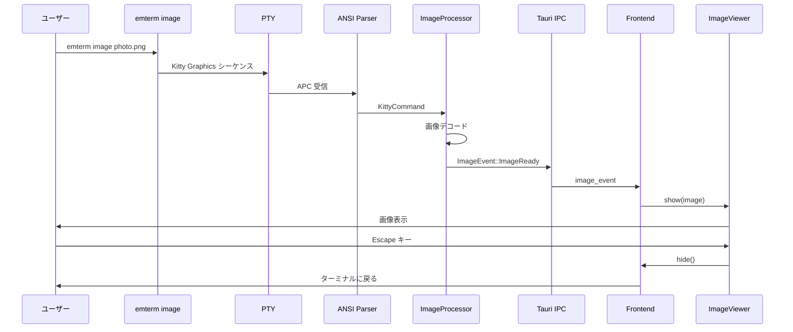
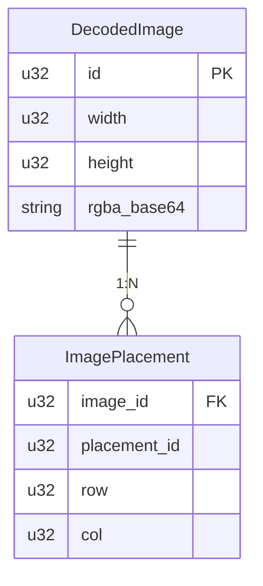

# フルスクリーンビューアーによる画像表示の実装 - 要件定義書

## 1. 概要

### 1.1 背景

`emterm image` コマンドを使用して画像を表示しようとしても、画像が表示されない問題が発生している。

調査の結果、以下が判明した:
- **バックエンド (Rust)**: `emterm image` コマンドは Kitty Graphics Protocol のエスケープシーケンスを正しく出力している
- **フロントエンド (TypeScript)**: `handleApc` メソッド（state.ts）で APC シーケンスを受信しているが、画像表示処理が未実装

### 1.2 設計判断：フルスクリーンビューアー方式の採用

**セカンドオピニオン（Codex CLI）と協議の結果**、以下の方針を採用:

1. **表示方式**: インライン表示ではなく、**フルスクリーンビューアー**で画像を表示
2. **プロトコル**: Kitty Graphics Protocol / SIXEL を使用（独自OSC拡張ではない）
3. **データフロー**: Kitty/SIXEL → バックエンドでデコード → フロントエンドに送信 → ビューアー表示

**フルスクリーンビューアー方式のメリット**:
- カーソル位置追跡の複雑さを回避
- Markdownビューアーと一貫したUI/UX
- 外部ツール（viu, img2sixel等）との互換性を維持
- 将来のインライン表示への拡張が可能

### 1.3 目的

Kitty Graphics Protocol と SIXEL による画像表示機能を完成させ、`emterm image` コマンドで画像をフルスクリーンビューアーで正しく表示できるようにする。

### 1.4 スコープ

**対象:**
- バックエンドでの画像デコードと IPC 送信
- フロントエンドのフルスクリーン ImageViewer コンポーネント
- 両プロトコル（Kitty Graphics Protocol、SIXEL）の完全サポート
- アニメーション GIF/APNG 対応

**対象外:**
- インライン表示（将来の拡張として検討）
- 新しい画像プロトコルの追加
- CLI コマンドの変更（既存の `emterm image` を使用）

## 2. ビジネス要件

### 2.1 ビジネス目標

ターミナル内で画像をフルスクリーンビューアーで表示できるようにし、リッチなターミナル体験を実現する。

### 2.2 対象ユーザー

| ユーザータイプ | 説明 |
|----------------|------|
| 開発者 | 画像処理結果、グラフ、ダイアグラムをターミナルで確認したい |
| CLI ツール開発者 | リッチな出力を提供するツールを作成したい |
| SSH 利用者 | リモートサーバーからも画像を表示したい |

### 2.3 期待される効果

- `emterm image <file>` でフルスクリーンビューアーが開き画像が表示される
- Escape キーでビューアーを閉じてターミナルに戻れる
- Kitty Graphics Protocol 対応ツール（例: timg, ranger, viu）が動作する
- SIXEL 対応ツール（例: img2sixel, lsix）が動作する

## 3. ユースケース

### 3.1 ユースケース一覧

| ID | ユースケース名 | アクター | 優先度 |
|----|----------------|----------|--------|
| UC01 | CLIコマンドによる画像表示 | ユーザー | 高 |
| UC02 | Kitty Graphics Protocol による画像表示 | 外部ツール | 高 |
| UC03 | SIXEL による画像表示 | 外部ツール | 高 |
| UC04 | アニメーション画像の再生 | ユーザー/ツール | 中 |
| UC05 | ビューアーを閉じる | ユーザー | 高 |

### 3.2 ユースケース詳細

#### UC01: CLIコマンドによる画像表示

**アクター**: ユーザー

**事前条件**:
- emterm が起動している
- 表示したい画像ファイルが存在する

**基本フロー**:
1. ユーザーが `emterm image <file>` を実行
2. バックエンドが画像を読み込み、Kitty Graphics Protocol シーケンスを生成
3. シーケンスが PTY 経由でバックエンドのパーサーに送信される
4. ImageProcessor が画像をデコードし、ImageEvent を生成
5. ImageEvent が Tauri IPC でフロントエンドに送信される
6. フロントエンドがフルスクリーン ImageViewer を開く
7. ユーザーが Escape キーを押すとビューアーが閉じる

**代替フロー**:
- ファイルが存在しない: エラーメッセージを表示
- 未対応フォーマット: エラーメッセージを表示
- メモリ制限超過: エラーメッセージを表示

**事後条件**:
- 画像がフルスクリーンビューアーで表示される

#### UC05: ビューアーを閉じる

**アクター**: ユーザー

**事前条件**:
- ImageViewer が画像を表示中

**基本フロー**:
1. ユーザーが Escape キーを押す
2. ImageViewer が閉じる
3. ターミナル画面に戻る

**事後条件**:
- ターミナルが通常の操作可能状態に戻る

### 3.3 シーケンス図

## 4. 機能要件

### 4.1 機能一覧

| ID | 機能名 | 説明 | 優先度 |
|----|--------|------|--------|
| F01 | Kitty Transmit (a=t) | 画像データを保存 | 高 |
| F02 | Kitty TransmitAndDisplay (a=T) | 画像データを保存してビューアー表示 | 高 |
| F03 | Kitty Put (a=p) | 保存済み画像をビューアー表示 | 高 |
| F04 | Kitty Delete (a=d) | 画像を削除（ビューアーも閉じる） | 高 |
| F05 | Kitty Query (a=q) | プロトコル対応を確認 | 高 |
| F06 | SIXEL 表示 | SIXEL データをビューアー表示 | 高 |
| F07 | アニメーション再生 | GIF/APNG アニメーションをビューアーで再生 | 中 |
| F08 | チャンク転送 | 大きな画像の分割転送 | 高 |
| F09 | ビューアー閉じる | Escape キーでビューアーを閉じる | 高 |

### 4.2 フルスクリーン ImageViewer

**説明**: Markdown ビューアーと同様のフルスクリーンオーバーレイコンポーネント

**機能**:
- 画像をフルスクリーンで表示
- アニメーション GIF/APNG の再生
- Escape キーで閉じてターミナルに戻る
- 画像のサイズに応じた自動スケーリング

**UI/UX**:
- Markdown ビューアーと一貫したデザイン
- 背景は半透明の暗いオーバーレイ
- 画像は中央に配置

## 5. 非機能要件

### 5.1 パフォーマンス要件

- 画像デコード: 1MB 以下の画像は 100ms 以内
- ビューアー表示: 画像デコード後 50ms 以内にビューアーが開く
- レンダリング: 60fps 維持（16.7ms/frame）
- メモリ使用量: 画像キャッシュは最大 50MB

### 5.2 セキュリティ要件

- 入力検証: 画像サイズの上限チェック（デフォルト: 100MB）
- メモリ保護: 画像数制限、メモリ使用量制限
- Base64: 不正な入力に対するエラーハンドリング

### 5.3 保守性要件

- ログ出力: 画像処理の各段階でデバッグログ
- エラー表示: 詳細なエラーメッセージ（quiet モードでない場合）

### 5.4 互換性要件

- Kitty Graphics Protocol: バージョン互換
- SIXEL: 一般的な SIXEL 実装との互換性
- 外部ツール: viu, timg, img2sixel 等との互換性

## 6. データ要件

### 6.1 データモデル概要

### 6.2 データ項目

| エンティティ | 項目名 | 型 | 必須 | 説明 |
|--------------|--------|-----|------|------|
| DecodedImage | id | u32 | 必須 | 画像の一意識別子 |
| DecodedImage | width | u32 | 必須 | 幅（ピクセル） |
| DecodedImage | height | u32 | 必須 | 高さ（ピクセル） |
| DecodedImage | rgba_base64 | string | 必須 | RGBA データ（Base64） |

## 7. 技術的制約

### 7.1 技術的制約

- Tauri IPC: 大きなデータは Base64 でシリアライズ
- WebView: Canvas でレンダリング
- メモリ: Rust 側でデコード、フロントエンドにコピー

### 7.2 既存コンポーネント

**バックエンド (Rust):**
- `ImageProcessor`: Kitty/SIXEL の統合処理（既存）
- `KittyHandler`: Kitty Graphics Protocol 実装（既存）
- `SixelHandler`: SIXEL 実装（既存）
- `decoder`: 各種フォーマットのデコード（既存）

**フロントエンド (TypeScript):**
- `MarkdownViewer`: 参考にするフルスクリーンビューアー（既存）
- `ImageLayer`: インライン表示用（将来の拡張で使用）
- `AnimationController`: アニメーション制御（既存）

## 8. 成功基準

### 8.1 受け入れ基準

- [ ] `emterm image <file>` でフルスクリーンビューアーが開く
- [ ] PNG/JPEG/GIF/WebP 画像が表示される
- [ ] アニメーション GIF がビューアーで再生される
- [ ] Escape キーでビューアーが閉じる
- [ ] Query コマンドに正しく応答する
- [ ] SIXEL 画像がビューアーで表示される
- [ ] 外部ツール（viu, img2sixel）が動作する

### 8.2 KPI

| 指標 | 目標値 | 測定方法 |
|------|--------|----------|
| 画像表示成功率 | 100% | テストケース通過率 |
| デコード時間（1MB以下） | < 100ms | パフォーマンステスト |
| ビューアー表示時間 | < 50ms | パフォーマンステスト |
| フレームレート | 60fps | PerformanceMonitor |

## 9. テストシナリオ

### 9.1 テスト観点

- [ ] 正常系: PNG/JPEG/GIF/WebP 画像のビューアー表示
- [ ] 正常系: アニメーション GIF の再生
- [ ] 正常系: Escape キーでビューアーを閉じる
- [ ] 正常系: 外部ツール（viu, img2sixel）での表示
- [ ] 異常系: 破損した画像データ
- [ ] 異常系: 巨大な画像（メモリ制限）
- [ ] 境界値: 1x1 ピクセル画像
- [ ] 境界値: 最大サイズ画像

## 10. 確認事項

### 10.1 確認済み事項

- [x] **表示方式**: フルスクリーンビューアー（Markdownビューアーと同様）
- [x] **プロトコル**: Kitty Graphics Protocol / SIXEL（両方実装）
- [x] **データフロー**: Kitty/SIXEL → バックエンドでデコード → IPC → ビューアー表示
- [x] **デフォルトプロトコル**: Kitty Graphics Protocol
- [x] **デコード場所**: バックエンド（Rust）
- [x] **機能レベル**: フル機能
  - 全フォーマット対応（PNG, JPEG, GIF, WebP, BMP, ICO, TIFF等）
  - サイズ制限設定可能
  - アニメーション対応（GIF, APNG）
  - SIXEL 同時実装
  - 詳細エラー表示

### 10.2 設計判断の根拠

**セカンドオピニオン（Codex CLI）との協議結果**:
- アプローチB（Kitty/SIXELプロトコル経由）を推奨
- 理由: 外部ツール互換性、将来の拡張性、「本物のターミナル」としての振る舞い

## 11. 用語定義

| 用語 | 定義 |
|------|------|
| Kitty Graphics Protocol | Kitty ターミナルが開発した画像表示プロトコル |
| SIXEL | DEC 社が開発したレガシーな画像表示プロトコル |
| APC | Application Program Command - 制御シーケンス |
| DCS | Device Control String - 制御シーケンス |
| ImageEvent | バックエンドからフロントエンドへの画像イベント |
| ImageViewer | フルスクリーン画像表示コンポーネント |

## 12. 参考資料

- [Kitty Graphics Protocol Specification](https://sw.kovidgoyal.net/kitty/graphics-protocol/)
- [SIXEL Graphics Extension](https://en.wikipedia.org/wiki/Sixel)
- 既存実装: `src-tauri/src/image/`, `src/image/`
- 参考: `src/markdown-viewer/` (フルスクリーンビューアーのパターン)
