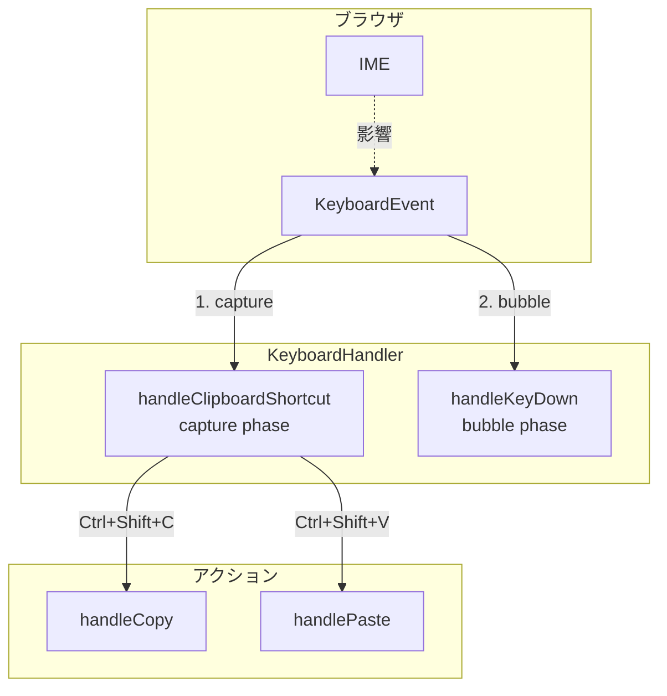
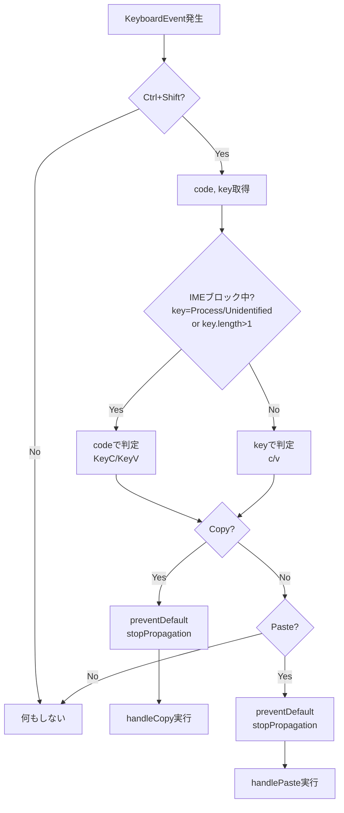
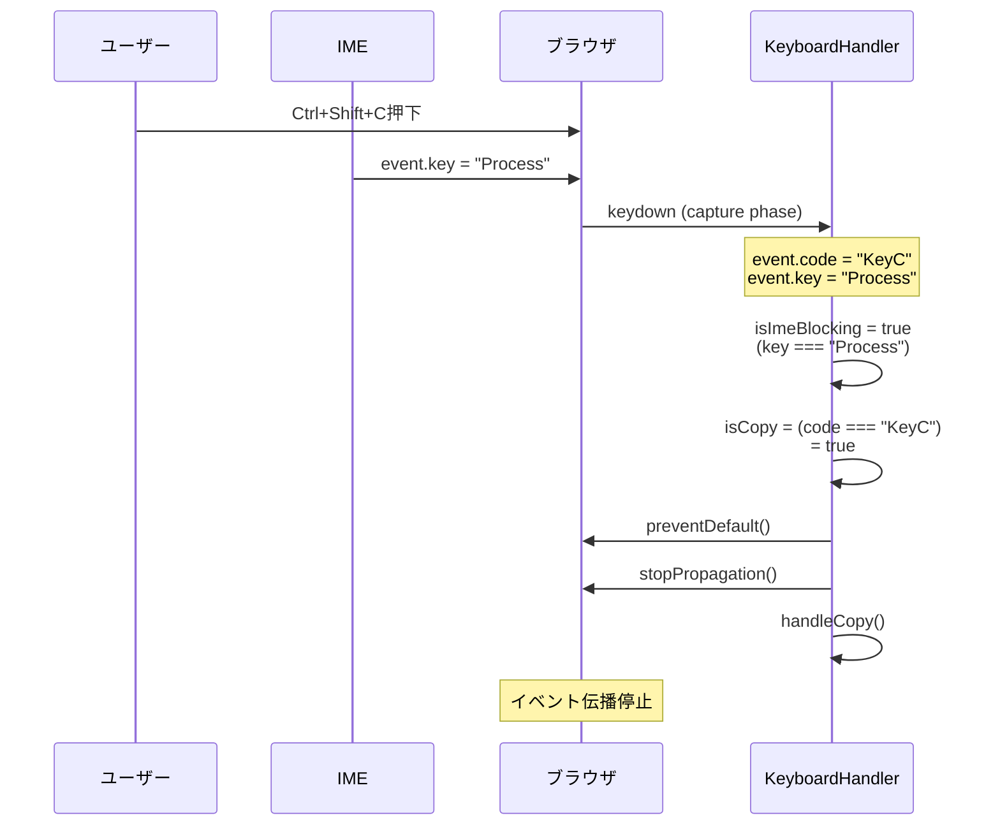

# IME ON状態でのクリップボードショートカット修正 - 仕様書

> この仕様書は実装の唯一の正です。
> 実装計画・実装コードはこの仕様書に従ってください。
> 仕様と矛盾する実装は許可されません。

## 1. 概要

### 1.1 目的

IME（Input Method Editor）がONの状態でも、Ctrl+Shift+C（コピー）およびCtrl+Shift+V（ペースト）のクリップボードショートカットが正常に動作するよう修正する。

### 1.2 スコープ

- `KeyboardHandler.handleClipboardShortcut`メソッドの修正
- キー検出ロジックを`event.key`から`event.code`優先に変更

### 1.3 前提条件

- 既存のキャプチャフェーズ処理アーキテクチャは維持
- `handleCopy`/`handlePaste`メソッドの内部実装は変更しない
- 他のキーボードショートカット処理には影響を与えない

## 2. システム構成

### 2.1 アーキテクチャ概要



### 2.2 コンポーネント構成

| コンポーネント | 役割 | ファイルパス |
|----------------|------|--------------|
| KeyboardHandler | キーボードイベント処理 | `src/terminal-app/handlers/keyboard.ts` |

## 3. 技術仕様

### 3.1 KeyboardEventプロパティの比較

| プロパティ | 説明 | IME OFF時の値 | IME ON時の値 |
|-----------|------|---------------|--------------|
| `event.key` | 論理キー（入力される文字） | `"c"`, `"v"` | `"Process"` |
| `event.code` | 物理キー（キーボード上の位置） | `"KeyC"`, `"KeyV"` | `"KeyC"`, `"KeyV"` |
| `event.ctrlKey` | Ctrlキー押下状態 | `true` | `true` |
| `event.shiftKey` | Shiftキー押下状態 | `true` | `true` |

### 3.2 `event.code`の値

標準的なQWERTYキーボードにおける物理キーコード:

| 物理キー | event.code |
|----------|------------|
| C | `"KeyC"` |
| V | `"KeyV"` |

### 3.3 修正対象メソッド

#### 3.3.1 handleClipboardShortcut

**ファイルパス**: `src/terminal-app/handlers/keyboard.ts`

**メソッドシグネチャ**:
```typescript
private handleClipboardShortcut(event: KeyboardEvent): void
```

**現在の実装** (219-244行目):
```typescript
private handleClipboardShortcut(event: KeyboardEvent): void {
  // Only handle Ctrl+Shift combinations
  if (!event.ctrlKey || !event.shiftKey) {
    return;
  }

  const key = event.key.toLowerCase();

  if (key === "c") {
    event.preventDefault();
    event.stopPropagation();
    this.handleCopy(event);
    return;
  }

  if (key === "v") {
    event.preventDefault();
    event.stopPropagation();
    this.handlePaste(event);
    return;
  }
}
```

**修正後の実装**:
```typescript
private handleClipboardShortcut(event: KeyboardEvent): void {
  // Only handle Ctrl+Shift combinations
  if (!event.ctrlKey || !event.shiftKey) {
    return;
  }

  const { code, key } = event;

  // Check if IME is blocking the key event
  // When IME is active, key is "Process", "Unidentified", or a multi-character composition string
  // Note: key.length > 1 catches IME composition strings but excludes empty strings
  const isImeBlocking = key === "Process" || key === "Unidentified" || key.length > 1;

  // Use event.code only when IME is blocking, otherwise use event.key
  // This preserves correct behavior on non-QWERTY layouts when IME is off
  const isCopy = isImeBlocking ? code === "KeyC" : key.toLowerCase() === "c";
  const isPaste = isImeBlocking ? code === "KeyV" : key.toLowerCase() === "v";

  if (isCopy) {
    // CRITICAL: preventDefault/stopPropagation must be called synchronously
    // before any async operation to prevent IME from consuming the event
    event.preventDefault();
    event.stopPropagation();
    this.handleCopy(event);
    return;
  }

  if (isPaste) {
    // CRITICAL: preventDefault/stopPropagation must be called synchronously
    // before any async operation to prevent IME from consuming the event
    event.preventDefault();
    event.stopPropagation();
    this.handlePaste(event);
    return;
  }
}
```

## 4. 処理フロー

### 4.1 キー検出ロジック



### 4.2 IME ON時の処理シーケンス



## 5. エラー処理

この修正ではエラー処理の変更は不要。既存の`handleCopy`/`handlePaste`メソッド内のエラー処理がそのまま適用される。

## 6. テスト仕様

### 6.1 テストケース

| ID | カテゴリ | テスト内容 | 事前条件 | 操作 | 期待結果 |
|----|----------|-----------|----------|------|----------|
| TC-01 | 正常系 | IME OFFでコピー | テキスト選択あり、IME OFF | Ctrl+Shift+C | 選択テキストがクリップボードにコピーされる |
| TC-02 | 正常系 | IME OFFでペースト | クリップボードにテキストあり、IME OFF | Ctrl+Shift+V | テキストがペーストされる |
| TC-03 | 正常系 | IME ONでコピー | テキスト選択あり、IME ON | Ctrl+Shift+C | 選択テキストがクリップボードにコピーされる |
| TC-04 | 正常系 | IME ONでペースト | クリップボードにテキストあり、IME ON | Ctrl+Shift+V | テキストがペーストされる |
| TC-05 | 境界値 | 選択なしでコピー | テキスト選択なし | Ctrl+Shift+C | 何も起きない（エラーなし） |
| TC-06 | 境界値 | 空クリップボードでペースト | クリップボード空 | Ctrl+Shift+V | 何も起きない（エラーなし） |
| TC-07 | 回帰 | 通常キー入力（IME OFF） | IME OFF | 任意の文字入力 | 正常に入力される |
| TC-08 | 回帰 | 通常キー入力（IME ON） | IME ON | 日本語入力 | 正常にIME変換される |
| TC-09 | 回帰 | Ctrl+C（シグナル） | IME OFF | Ctrl+C | SIGINTシグナル送信 |

### 6.2 手動テスト手順

#### TC-03: IME ONでコピー

1. eMtermを起動
2. ターミナル上でテキスト出力があることを確認
3. IMEをONにする（例: 半角/全角キー）
4. マウスでテキストを選択
5. Ctrl+Shift+Cを押下
6. 別のアプリケーション（例: メモ帳）でCtrl+Vを押下
7. 選択したテキストがペーストされることを確認

#### TC-04: IME ONでペースト

1. eMtermを起動
2. 別のアプリケーションでテキストをコピー
3. eMtermにフォーカス
4. IMEをONにする
5. Ctrl+Shift+Vを押下
6. コピーしたテキストがターミナルに入力されることを確認

## 7. 実装ガイドライン

### 7.1 コーディング規約

- 既存のコードスタイルを維持
- コメントは英語で記述
- 変更箇所に適切なコメントを追加

### 7.2 変更範囲の制限

- `handleClipboardShortcut`メソッドのみ変更
- 他のメソッドへの変更は禁止
- クラスのpublic APIは変更しない

### 7.3 互換性考慮

- `event.code`が空やundefinedの場合に備えて`event.key`へのフォールバックを維持
- 論理OR（`||`）による優先順位: `event.code`優先、`event.key`フォールバック

## 8. 既知の制限事項

### 8.1 非QWERTYレイアウト + IME ON での制限

**制限内容**: 非QWERTYキーボードレイアウト（Dvorak、Colemakなど）でIMEがON状態の場合、Ctrl+Shift+C/Vショートカットが意図した動作をしない可能性があります。

**技術的背景**:
- IME ON時は`event.key`が"Process"等を返すため、物理キーコード（`event.code`）で判定する必要がある
- `event.code`はQWERTYレイアウト基準の物理キー位置を返す
- 非QWERTYレイアウトでは、"C"キーと"V"キーの物理位置がQWERTYと異なる場合がある
- 結果として、IME ON + 非QWERTYレイアウトではショートカットが機能しない可能性がある

**影響範囲**:
- Dvorak、Colemak、AZERTY等の非QWERTYレイアウトユーザー
- かつIMEをON状態で使用する場合のみ

**回避策**:
- ショートカット実行時のみIMEをOFFにする
- 右クリックメニューからコピー/ペーストを実行する

**将来の対応可能性**:
- ユーザー設定でショートカットキーをカスタマイズ可能にする
- `event.code`の値をユーザーが指定可能にする

## 9. 確認事項

### 9.1 確認済み事項

- [x] `event.code`はIME ON時も物理キーを返す（ブラウザ標準仕様）
- [x] キャプチャフェーズでの処理は維持される
- [x] 既存の`handleCopy`/`handlePaste`の実装変更は不要

### 9.2 補足情報

**KeyboardEvent.code のブラウザサポート**:
- Chrome: 完全サポート
- Firefox: 完全サポート
- Safari: 完全サポート
- Edge: 完全サポート

Tauriが使用するWebViewは上記ブラウザのエンジンを使用するため、`event.code`は問題なく利用可能。
