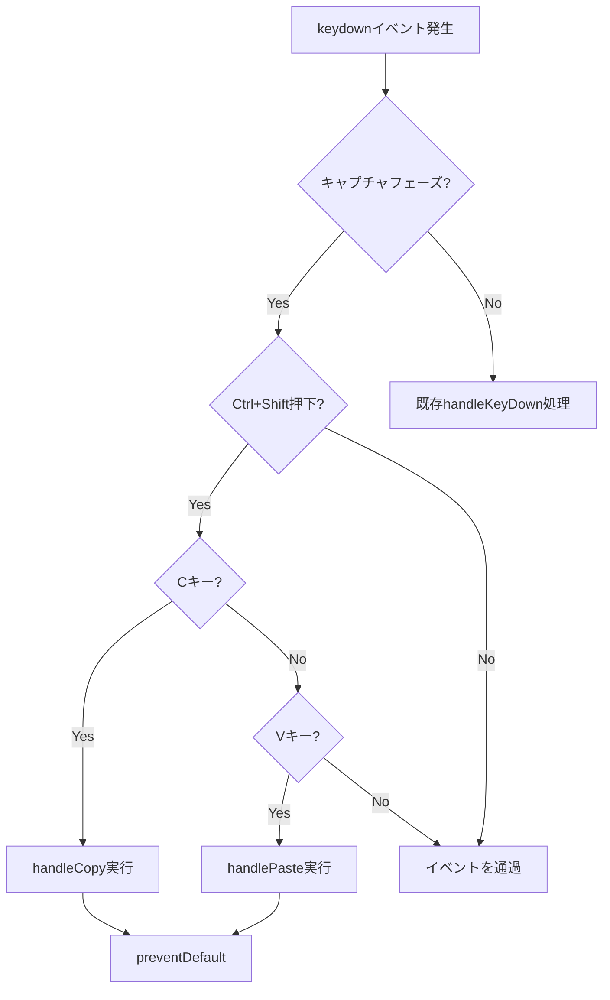
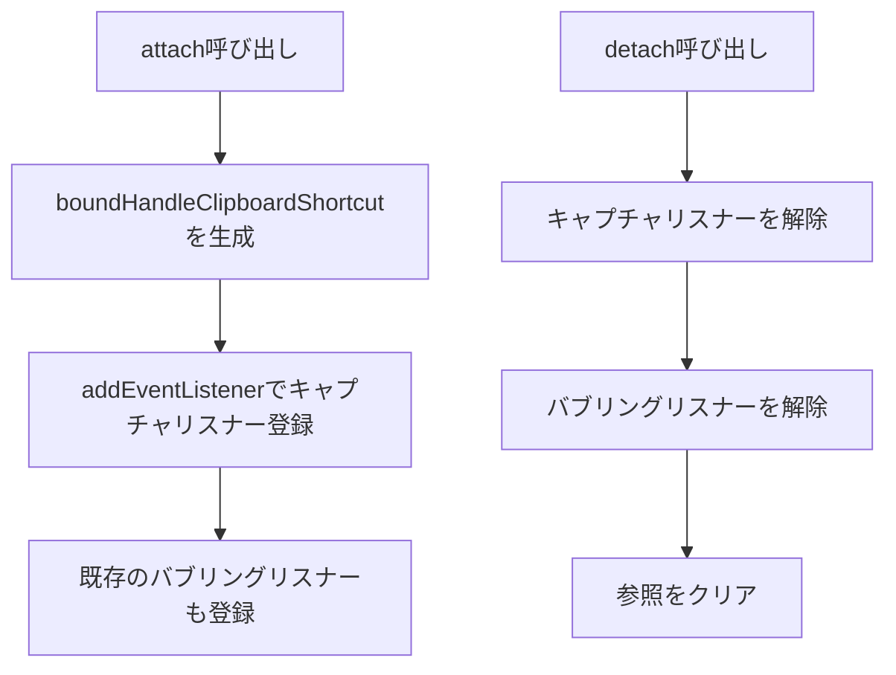

# IME使用時のクリップボードショートカット対応 - 要件定義書

## 1. 概要

### 1.1 背景
eMtermターミナルエミュレータにおいて、IME（日本語入力モード）がアクティブな状態でCtrl+Shift+C（コピー）およびCtrl+Shift+V（ペースト）のショートカットキーが機能しない問題が発生している。

現在の実装では、キーボードイベントがバブリングフェーズで処理されているため、IMEやOSのデフォルト処理が先に実行され、アプリケーションのイベントハンドラーにイベントが到達しない。

### 1.2 目的
IMEがアクティブな状態でも、Ctrl+Shift+C/Vのクリップボードショートカットが正常に動作するようにする。

### 1.3 スコープ
- 対象: `src/terminal-app/handlers/keyboard.ts` の `KeyboardHandler` クラス
- 対象機能: Ctrl+Shift+C（コピー）、Ctrl+Shift+V（ペースト）
- 対象外: その他のキーボードショートカット、IME入力処理自体

## 2. ビジネス要件

### 2.1 ビジネス目標
日本語や中国語などのIME入力を使用するユーザーが、テキスト選択のコピー・ペースト操作をストレスなく行えるようにする。

### 2.2 対象ユーザー
| ユーザータイプ | 説明 |
|----------------|------|
| IME使用者 | 日本語、中国語、韓国語などIMEを使用して入力するユーザー |
| 一般ユーザー | IMEを使用しないユーザー（既存機能への影響なし） |

### 2.3 期待される効果
- IME使用時のコピー・ペースト操作の成功率を100%にする
- ユーザー体験の向上（操作の一貫性確保）
- 国際化対応の品質向上

## 3. ユースケース

### 3.1 ユースケース一覧
| ID | ユースケース名 | アクター | 優先度 |
|----|----------------|----------|--------|
| UC01 | IME使用中のテキストコピー | ターミナルユーザー | 高 |
| UC02 | IME使用中のテキストペースト | ターミナルユーザー | 高 |

### 3.2 ユースケース詳細

#### UC01: IME使用中のテキストコピー

**アクター**: ターミナルユーザー

**事前条件**:
- eMtermターミナルが起動している
- IME（日本語入力など）がアクティブ状態
- ターミナル上でテキストが選択されている

**基本フロー**:
1. ユーザーがCtrl+Shift+Cを押下
2. システムがキャプチャフェーズでイベントを検知
3. 選択テキストをクリップボードにコピー
4. 選択状態をクリア

**代替フロー**:
- 選択テキストがない場合: イベントを処理するが、コピー処理はスキップ

**事後条件**:
- 選択されていたテキストがクリップボードに保存されている
- 選択状態が解除されている

#### UC02: IME使用中のテキストペースト

**アクター**: ターミナルユーザー

**事前条件**:
- eMtermターミナルが起動している
- IME（日本語入力など）がアクティブ状態
- クリップボードにテキストが存在する

**基本フロー**:
1. ユーザーがCtrl+Shift+Vを押下
2. システムがキャプチャフェーズでイベントを検知
3. クリップボードからテキストを取得
4. 複数行の場合は確認ダイアログを表示
5. テキストをPTYに送信

**代替フロー**:
- クリップボードが空の場合: イベントを処理するが、ペースト処理はスキップ
- 複数行テキストでユーザーがキャンセル: ペースト処理を中止

**事後条件**:
- クリップボードのテキストがターミナルに入力されている

## 4. 機能要件

### 4.1 機能一覧
| ID | 機能名 | 説明 | 優先度 |
|----|--------|------|--------|
| F01 | キャプチャフェーズリスナー追加 | Ctrl+Shift+C/V専用のキャプチャフェーズイベントリスナーを追加 | 高 |
| F02 | リスナーのライフサイクル管理 | attach/detachでリスナーを適切に登録・解除 | 高 |

### 4.2 機能詳細

#### F01: キャプチャフェーズリスナー追加

**説明**: IMEがイベントを消費する前に、Ctrl+Shift+C/Vのキーイベントをキャプチャする専用リスナーを追加する。

**入力**:
- event: KeyboardEvent - キーボードイベント

**出力**:
- なし（イベントを処理し、必要に応じてpreventDefault）

**処理フロー**:

**ビジネスルール**:
- キャプチャフェーズで処理するのはCtrl+Shift+CとCtrl+Shift+Vのみ
- その他のキーイベントは既存のバブリングフェーズハンドラーで処理
- キャプチャで処理したイベントは必ずpreventDefaultを呼び出す

**エラーケース**:
| エラー | 条件 | 対応 |
|--------|------|------|
| クリップボードアクセス失敗 | 権限なし、またはAPIエラー | エラーログ出力、イベントは消費 |

#### F02: リスナーのライフサイクル管理

**説明**: 新しいキャプチャフェーズリスナーをattach/detachメソッドで適切に管理する。

**入力**:
- target: EventTarget - イベントターゲット（attach時）

**出力**:
- なし

**処理フロー**:

**ビジネスルール**:
- attach時に両方のリスナーを登録
- detach時に両方のリスナーを解除
- boundプロパティは適切にnullクリア

## 5. 非機能要件

### 5.1 パフォーマンス要件
- イベント処理遅延: 1ms以下（体感できない速度）
- 追加のメモリ使用: 関数参照1つ分のみ（無視できるレベル）

### 5.2 セキュリティ要件
- 変更なし（既存のクリップボード処理を利用）

### 5.3 可用性要件
- 該当なし

### 5.4 保守性要件
- 既存コードへの影響を最小限に抑える
- 新規リスナーは明確に分離されたメソッドで処理

### 5.5 互換性要件
- IME非使用時の動作に影響を与えない
- 既存のショートカット動作を維持

## 6. UI/UX要件

### 6.1 画面設計要件
変更なし（内部処理のみ）

### 6.2 レスポンシブ対応
該当なし

## 7. データ要件

### 7.1 データモデル概要
変更なし

### 7.2 データ項目
該当なし

## 8. 外部連携

### 8.1 連携システム
| システム名 | 連携方法 | データ |
|------------|----------|--------|
| OS クリップボード | Clipboard API | テキストデータ |

### 8.2 API仕様要件
変更なし（既存のClipboard API利用）

## 9. 制約条件

### 9.1 技術的制約
- キャプチャフェーズはDOMイベントモデルの標準機能を利用
- Ctrl+Shift+C/Vのみをキャプチャ対象とする（他のショートカットへの影響回避）

### 9.2 ビジネス上の制約
- なし

### 9.3 スケジュール制約
- なし

## 10. 想定される課題とリスク

### 10.1 技術的課題
| 課題 | 影響度 | 対応策 |
|------|--------|--------|
| 特定のIMEでの動作差異 | 低 | 主要IME（Google日本語入力、macOS標準、Windows IME）でテスト |

### 10.2 ビジネスリスク
| リスク | 発生確率 | 影響度 | 対応策 |
|--------|----------|--------|--------|
| 既存機能への副作用 | 低 | 中 | 十分なテスト、キャプチャ対象の限定 |

## 11. 成功基準

### 11.1 受け入れ基準
- [ ] IMEがアクティブな状態でCtrl+Shift+Cが動作する
- [ ] IMEがアクティブな状態でCtrl+Shift+Vが動作する
- [ ] IMEが非アクティブな状態での動作が変わらない
- [ ] 既存のキーボード処理に影響がない
- [ ] TypeScriptの型チェックがパスする
- [ ] 既存のテストがすべてパスする

### 11.2 KPI
| 指標 | 目標値 | 測定方法 |
|------|--------|----------|
| IME使用時のコピー成功率 | 100% | 手動テスト |
| IME使用時のペースト成功率 | 100% | 手動テスト |

## 12. テストシナリオ

### 12.1 テスト観点
- [ ] 正常系: IMEアクティブ時にCtrl+Shift+Cでコピー成功
- [ ] 正常系: IMEアクティブ時にCtrl+Shift+Vでペースト成功
- [ ] 正常系: IME非アクティブ時の既存動作維持
- [ ] 異常系: 選択なしでのコピー（エラーにならないこと）
- [ ] 異常系: クリップボード空でのペースト（エラーにならないこと）
- [ ] 境界値: 複数行ペースト時のダイアログ表示
- [ ] 互換性: attach/detach後のリスナー状態

## 13. 用語定義

| 用語 | 定義 |
|------|------|
| キャプチャフェーズ | DOMイベントがルートから対象要素へ向かって伝播するフェーズ |
| バブリングフェーズ | DOMイベントが対象要素からルートへ向かって伝播するフェーズ |
| IME | Input Method Editor。日本語などの複雑な文字入力を支援するシステム |
| PTY | Pseudo Terminal。仮想端末 |

## 14. 確認事項

### 14.1 確認済み事項

- [x] 解決策として「案A」を採用: Ctrl+Shift専用のキャプチャフェーズリスナーを追加
- [x] 新しいプロパティ `boundHandleClipboardShortcut` を追加
- [x] `attach()` で `{ capture: true }` 付きリスナーを登録
- [x] `detach()` で解除
- [x] 既存の `handleKeyDown` は変更なし
- [x] 対象ファイル: `src/terminal-app/handlers/keyboard.ts`

### 14.2 未確認・保留事項
- なし

## 15. 参考資料

- MDN Web Docs - EventTarget.addEventListener(): https://developer.mozilla.org/en-US/docs/Web/API/EventTarget/addEventListener
- DOM Events - Capture vs Bubble: https://javascript.info/bubbling-and-capturing
