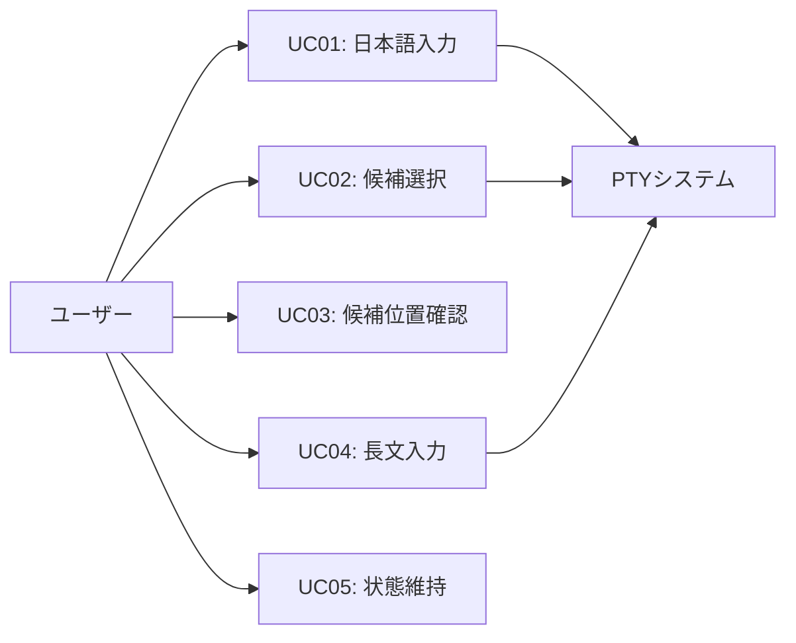
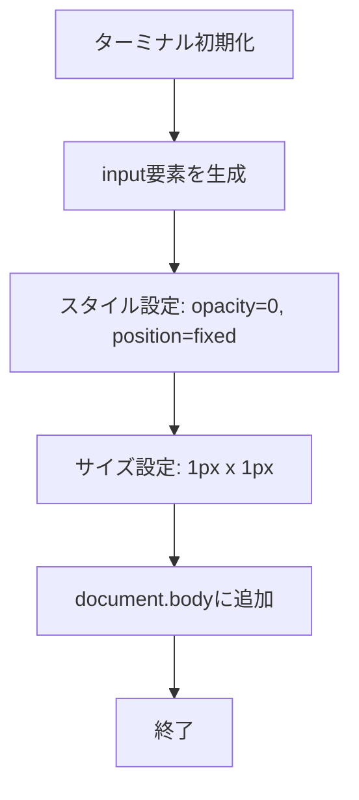
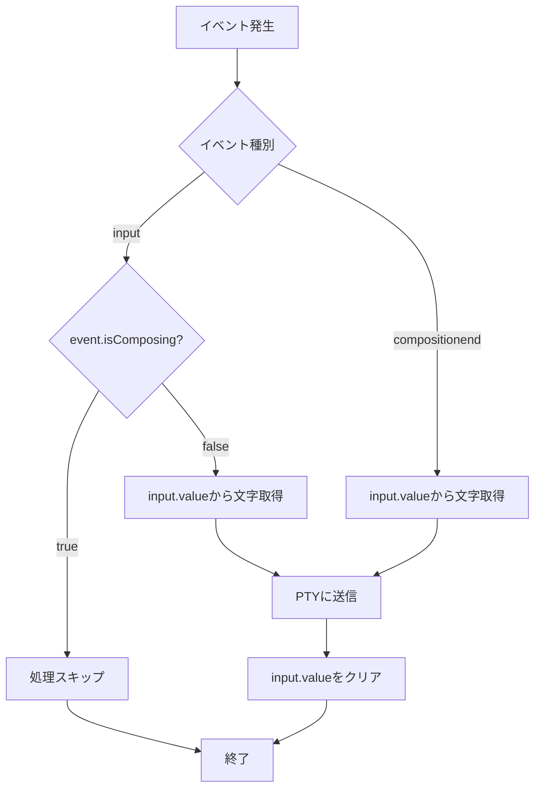
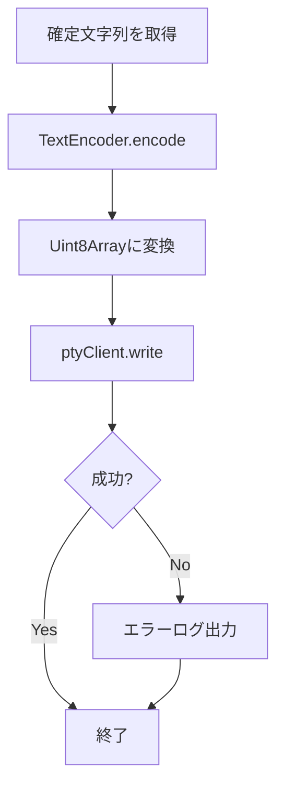
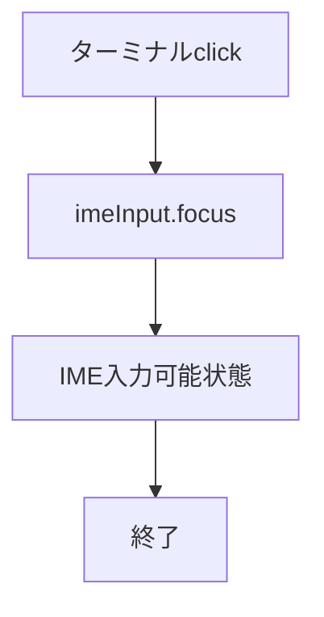
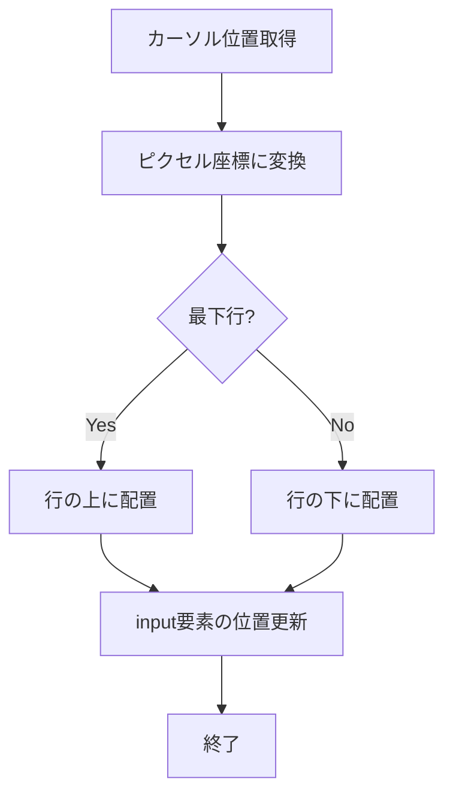
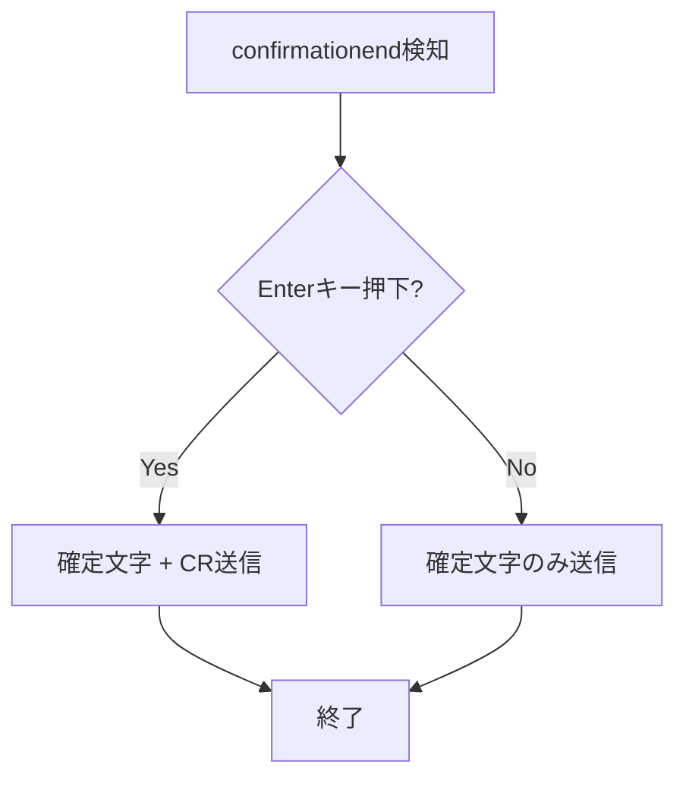
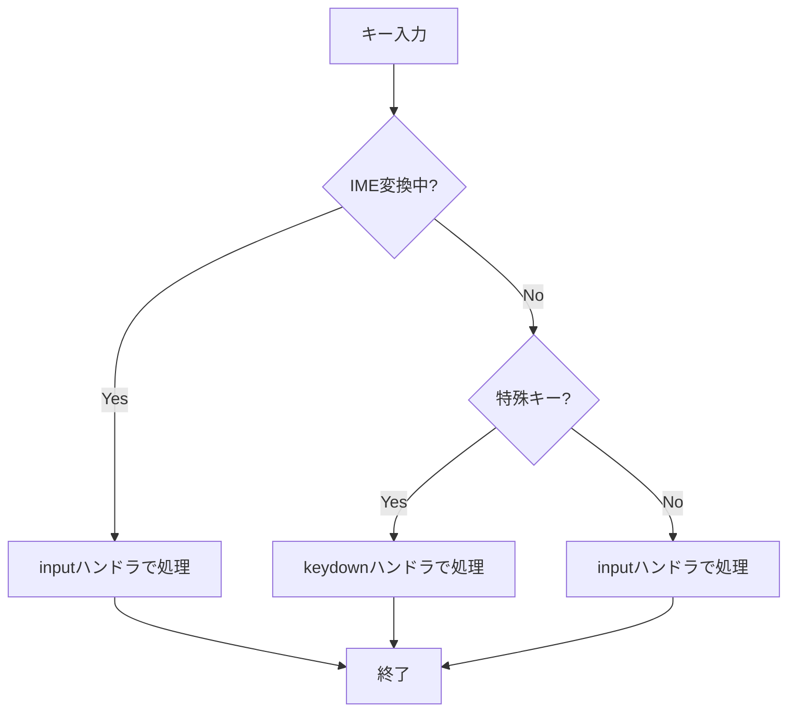
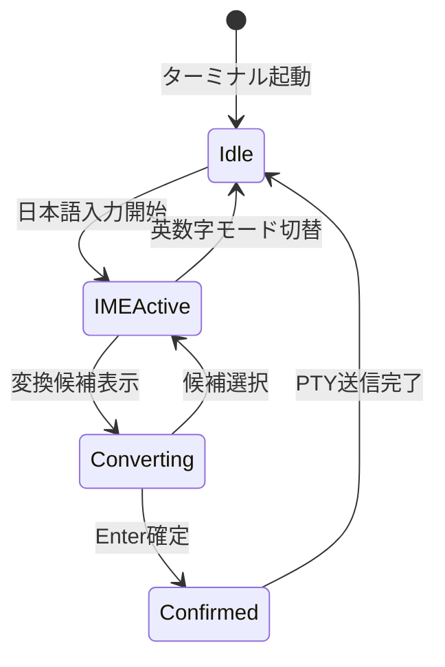

# IME入力対応機能 - 要件定義書

## 1. 概要

### 1.1 背景
現在のeMtermターミナルエミュレータでは、keydownイベントを直接ハンドリングしており、IME（Input Method Editor）による日本語入力ができない問題がある。

**技術的問題点:**
- input要素を使用せず、keydownイベントを直接処理している
- IME変換中は`event.isComposing`フラグでスキップするが、確定文字を受け取る仕組みがない
- compositionstart/end/updateイベントのリスナーが存在しない

### 1.2 目的
日本語入力（IME）をeMtermで可能にし、ユーザーがターミナル上で日本語を入力・編集できるようにする。

### 1.3 スコープ

**対象範囲:**
- 日本語IME入力のサポート（ひらがな、カタカナ、漢字変換）
- IME候補ウィンドウのカーソル位置への同期
- Linux/Windowsプラットフォームでの動作保証
- macOSでの動作（ベストエフォート）

**対象外:**
- 中国語・韓国語など他言語のIME（将来的な拡張として検討）
- 縦書き入力
- 手書き入力

## 2. ビジネス要件

### 2.1 ビジネス目標
- 日本語ユーザーがeMtermを実用的に使用できるようにする
- 他のターミナルエミュレータ（Alacritty, WezTerm等）と同等のIME対応を提供する
- ユーザー満足度の向上とユーザーベースの拡大

### 2.2 対象ユーザー
| ユーザータイプ | 説明 |
|----------------|------|
| 日本人開発者 | ターミナルで日本語のコミットメッセージやドキュメントを作成する |
| 日本語システム管理者 | 日本語のログやファイル名を扱う必要がある |
| バイリンガル開発者 | 英語と日本語を併用して作業を行う |

### 2.3 期待される効果
- 日本語ユーザーからのeMterm採用率向上
- 日本語入力に関する不具合報告の解消
- 競合ターミナルエミュレータとの機能パリティ達成

## 3. ユースケース

### 3.1 ユースケース一覧
| ID | ユースケース名 | アクター | 優先度 |
|----|----------------|----------|--------|
| UC01 | 日本語テキスト入力 | ユーザー | 高 |
| UC02 | IME変換候補選択 | ユーザー | 高 |
| UC03 | IME候補ウィンドウ位置確認 | ユーザー | 中 |
| UC04 | 長文の日本語入力 | ユーザー | 中 |
| UC05 | フォーカス切り替え中のIME状態維持 | ユーザー | 低 |

### 3.2 ユースケース詳細

#### UC01: 日本語テキスト入力

**アクター**: ターミナルユーザー

**事前条件**:
- eMtermが起動している
- ターミナルがフォーカスを持っている
- OSのIMEが有効化されている

**基本フロー**:
1. ユーザーがターミナル上でIMEを起動する（日本語入力モードに切り替える）
2. ユーザーがひらがなで「にほんご」と入力する
3. IMEが変換候補「日本語」を表示する
4. ユーザーがEnterキーまたはスペースキーで変換を確定する
5. 確定された文字「日本語」がPTYに送信される
6. シェルが文字を受け取り、ターミナルに表示される

**代替フロー**:
- 3a. ユーザーが変換候補を矢印キーで選択し、別の候補を選ぶ
- 4a. ユーザーがEscキーで変換をキャンセルし、ひらがなのまま確定する

**事後条件**:
- 入力した日本語がシェルに渡され、コマンド実行やファイル操作に使用できる

#### UC02: IME変換候補選択

**アクター**: ターミナルユーザー

**事前条件**:
- IME変換中である

**基本フロー**:
1. ユーザーがスペースキーを押して変換候補リストを表示する
2. IMEが候補ウィンドウを表示する
3. ユーザーが矢印キーまたは数字キーで候補を選択する
4. ユーザーがEnterキーで確定する
5. 選択した候補がPTYに送信される

**代替フロー**:
- 3a. 候補が1つしかない場合、スペースキーで即座に確定される

**事後条件**:
- 選択した変換候補が入力として確定される

#### UC03: IME候補ウィンドウ位置確認

**アクター**: ターミナルユーザー

**事前条件**:
- IME変換中である
- 候補ウィンドウが表示されている

**基本フロー**:
1. ユーザーが変換開始する
2. IME候補ウィンドウがカーソル位置の下に表示される
3. ユーザーが候補を確認し、選択する

**代替フロー**:
- 2a. カーソルが画面最下行にある場合、候補ウィンドウはカーソル位置の上に表示される

**事後条件**:
- ユーザーが候補ウィンドウを視認でき、快適に変換候補を選択できる

#### UC04: 長文の日本語入力

**アクター**: ターミナルユーザー

**事前条件**:
- eMtermが起動している
- gitコミットメッセージやテキストエディタが開いている

**基本フロー**:
1. ユーザーが100文字以上の日本語文章を入力し始める
2. ユーザーが複数の文節を変換しながら入力する
3. 各文節が確定されるたびにPTYに送信される
4. 全ての文字が遅延なく表示される

**代替フロー**:
- なし

**事後条件**:
- 長文が正確に入力され、パフォーマンス低下がない

#### UC05: フォーカス切り替え中のIME状態維持

**アクター**: ターミナルユーザー

**事前条件**:
- IME変換中である
- 変換が確定していない状態

**基本フロー**:
1. ユーザーがIME変換中にターミナル外をクリックする（フォーカスを失う）
2. 変換中のテキストが保持される
3. ユーザーがターミナルに戻る（フォーカスを再取得）
4. 変換中のテキストが復元され、変換を継続できる

**代替フロー**:
- なし

**事後条件**:
- 変換状態が保持され、ユーザーの入力が失われない

**ユースケース図**:

## 4. 機能要件

### 4.1 機能一覧
| ID | 機能名 | 説明 | 優先度 |
|----|--------|------|--------|
| F01 | 隠しinput要素の設置 | IME入力を受け取るための不可視input要素 | 高 |
| F02 | IME入力イベントハンドリング | input/compositionendイベントからの文字取得 | 高 |
| F03 | PTYへの文字送信 | 確定文字をバイト列に変換してPTYに送信 | 高 |
| F04 | フォーカス管理 | ターミナルクリック時に隠しinputへフォーカス移動 | 高 |
| F05 | IME候補ウィンドウ位置同期 | カーソル位置に候補ウィンドウを表示 | 中 |
| F06 | Enter+確定の同時送信 | 確定文字と改行の両方をPTYに送信 | 中 |
| F07 | 既存キーハンドリングとの共存 | keydownハンドラとIMEハンドラの共存 | 高 |

### 4.2 機能詳細

#### F01: 隠しinput要素の設置

**説明**: ターミナル画面上に不可視のinput要素を配置し、IME入力を受け取る。

**入力**:
- なし（システム初期化時に自動作成）

**出力**:
- DOM上に不可視のinput要素が配置される

**処理フロー**:

**ビジネスルール**:
- input要素は視覚的に完全に不可視でなければならない
- ユーザーの操作や表示を妨げてはならない
- textareaではなくinput要素を使用する（軽量性のため）

**バリデーション**:
| 項目 | ルール | エラーメッセージ |
|------|--------|------------------|
| 要素の可視性 | opacity: 0, width: 1px, height: 1px | N/A（内部検証） |

**エラーケース**:
| エラー | 条件 | 対応 |
|--------|------|------|
| DOM追加失敗 | document.bodyが存在しない | コンソールエラーログ出力 |

#### F02: IME入力イベントハンドリング

**説明**: 隠しinput要素のinputイベントとcompositionendイベントを監視し、確定文字を取得する。

**入力**:
- inputイベント（InputEvent）
- compositionendイベント（CompositionEvent）

**出力**:
- 確定文字列（UTF-8文字列）

**処理フロー**:

**ビジネスルール**:
- inputイベントでは`event.isComposing === false`の場合のみ処理する
- compositionendは常に処理する（フォールバック）
- 確定文字はinput.valueから取得する（event.dataではなく）

**バリデーション**:
| 項目 | ルール | エラーメッセージ |
|------|--------|------------------|
| input.value | 空文字でない | N/A（空文字の場合はスキップ） |
| isComposing | inputイベント時はfalseである | N/A（trueの場合はスキップ） |

**エラーケース**:
| エラー | 条件 | 対応 |
|--------|------|------|
| PTY送信失敗 | ptyClient.write()がエラーを返す | エラーログ出力、処理継続 |

#### F03: PTYへの文字送信

**説明**: 確定文字をUTF-8バイト列に変換し、PTYクライアント経由でシェルに送信する。

**入力**:
- 確定文字列（string）

**出力**:
- なし（PTYへの書き込み完了）

**処理フロー**:

**ビジネスルール**:
- UTF-8エンコーディングを使用する
- PTY書き込み失敗時もユーザーには通知しない（エラーログのみ）

**バリデーション**:
| 項目 | ルール | エラーメッセージ |
|------|--------|------------------|
| ptyClient | nullでない | "PTY session not started" |
| 文字列 | 有効なUTF-8文字列 | N/A |

**エラーケース**:
| エラー | 条件 | 対応 |
|--------|------|------|
| PTYセッション未開始 | ptyClientがnull | エラーログ出力 |
| 書き込み失敗 | writeが例外をスロー | エラーログ出力 |

#### F04: フォーカス管理

**説明**: ユーザーがターミナルをクリックした際、隠しinput要素に自動的にフォーカスを移動する。

**入力**:
- ターミナル領域へのclickイベント

**出力**:
- 隠しinput要素がフォーカスを取得

**処理フロー**:

**ビジネスルール**:
- ターミナルクリック時に必ず隠しinputにフォーカスする
- フォーカス移動は視覚的に検知できてはならない

**バリデーション**:
なし

**エラーケース**:
| エラー | 条件 | 対応 |
|--------|------|------|
| focus失敗 | input要素が存在しない | エラーログ出力 |

#### F05: IME候補ウィンドウ位置同期

**説明**: IME候補ウィンドウをターミナルのカーソル位置に同期表示する。

**入力**:
- ターミナルのカーソル位置（行・列）
- 文字サイズ（width, height）

**出力**:
- 隠しinput要素の絶対座標位置が更新される

**処理フロー**:

**ビジネスルール**:
- 候補ウィンドウはカーソル行の下に表示される（デフォルト）
- カーソルが画面最下行にある場合は、カーソル行の上に表示される
- 位置精度はピクセル単位ではなく行単位で十分

**バリデーション**:
| 項目 | ルール | エラーメッセージ |
|------|--------|------------------|
| カーソル行 | 0 ≤ row < rows | N/A |
| カーソル列 | 0 ≤ col < cols | N/A |

**エラーケース**:
| エラー | 条件 | 対応 |
|--------|------|------|
| terminalStateがnull | 初期化前にアクセス | エラーログ出力、処理スキップ |

#### F06: Enter+確定の同時送信

**説明**: IME確定と同時にEnterキーが押された場合、確定文字と改行コードの両方をPTYに送信する。

**入力**:
- 確定文字列（string）
- Enterキー押下イベント

**出力**:
- 確定文字列 + `\r`（改行）がPTYに送信される

**処理フロー**:

**ビジネスルール**:
- Enter確定時は確定文字と`\r`（0x0D）の両方を送信する
- 順序は「確定文字」→「改行」

**バリデーション**:
なし

**エラーケース**:
| エラー | 条件 | 対応 |
|--------|------|------|
| PTY送信失敗 | writeがエラー | エラーログ出力 |

#### F07: 既存キーハンドリングとの共存

**説明**: 既存のkeydownハンドラとIME入力ハンドラが競合せず共存する。

**入力**:
- keydownイベント
- inputイベント

**出力**:
- 適切なハンドラが処理を実行

**処理フロー**:

**ビジネスルール**:
- IME変換中（event.isComposing === true）はkeydownハンドラをスキップする
- 特殊キー（Ctrl+C, 矢印キーなど）はkeydownハンドラで処理する
- 通常の文字入力はinputハンドラで処理する

**バリデーション**:
なし

**エラーケース**:
なし

## 5. 非機能要件

### 5.1 パフォーマンス要件
- タイピング遅延: **50ms以内**（キー入力からPTY送信まで）
- 長文入力（100文字以上）でもパフォーマンス低下なし
- メモリ使用量: 隠しinput要素による追加メモリは1KB未満

### 5.2 セキュリティ要件
- 隠しinput要素のvalueは確定後すぐにクリアする（セキュリティ情報の残存防止）
- XSS対策: input要素の内容をHTMLとして解釈しない（TextEncoderで直接バイト列化）

### 5.3 可用性要件
- IME入力機能の障害が発生しても、既存のkeydown入力は機能し続けること
- PTY書き込み失敗時もアプリケーションがクラッシュしないこと

### 5.4 保守性要件
- コード追加箇所を`src/main.ts`に限定する（可能な限り）
- 既存のkeyboard.tsやclient.tsは変更しない
- 将来的なマルチプラットフォーム対応を考慮した設計

### 5.5 互換性要件
- プラットフォーム:
  - Linux: 必須（特にiBus, Fcitx）
  - Windows: 必須（MS-IME, Google日本語入力）
  - macOS: ベストエフォート
- ブラウザ: Tauri WebView（Chromiumベース）

## 6. UI/UX要件

### 6.1 画面設計要件
- 隠しinput要素は完全に不可視であること
- IME候補ウィンドウがカーソル位置に適切に表示されること
- 既存のターミナル表示に視覚的な影響を与えないこと

### 6.2 画面遷移

### 6.3 レスポンシブ対応
- ターミナルリサイズ時にIME候補ウィンドウ位置も再計算される
- フルスクリーン時も正しく候補ウィンドウが表示される

## 7. データ要件

### 7.1 データモデル概要
IME入力機能は状態を永続化しないため、データモデルは存在しない。

### 7.2 データ項目
なし

### 7.3 データ保持期間
なし（一時的な入力データのみ）

## 8. 外部連携

### 8.1 連携システム
| システム名 | 連携方法 | データ |
|------------|----------|--------|
| OS IME | DOM input要素のネイティブAPI | 変換文字列 |
| PTYバックエンド | ptyClient.write() | UTF-8バイト列 |

### 8.2 API仕様要件
- 既存のPtyClient APIを使用（変更なし）
- `ptyClient.write(bytes: Uint8Array)`で文字送信

## 9. 制約条件

### 9.1 技術的制約
- input要素のネイティブIME機能に依存する（カスタムIME実装は不可）
- 候補ウィンドウ位置はOSのIMEが制御する（完全な制御は不可能）
- Tauri WebView（Chromiumベース）の制約を受ける

### 9.2 ビジネス上の制約
- 既存機能への影響を最小限にする
- リリース時期の制約なし（品質優先）

### 9.3 スケジュール制約
なし

## 10. 想定される課題とリスク

### 10.1 技術的課題
| 課題 | 影響度 | 対応策 |
|------|--------|--------|
| macOSでのIME候補位置ずれ | 中 | ベストエフォート対応、検証環境の確保 |
| 特定IMEでの動作不良 | 中 | 主要IME（MS-IME, Google日本語入力, iBus）で検証 |
| 隠しinputへのフォーカス遷移の視認性 | 低 | opacity=0で完全に不可視化 |

### 10.2 ビジネスリスク
| リスク | 発生確率 | 影響度 | 対応策 |
|--------|----------|--------|--------|
| 既存ユーザーの混乱 | 低 | 低 | 透明性の高い変更ログとドキュメント提供 |
| パフォーマンス低下 | 低 | 中 | パフォーマンステスト実施、50ms閾値の遵守 |
| テキスト選択機能の喪失 | 中 | 低 | 仕様として許容（ユーザー回答より） |

## 11. 成功基準

### 11.1 受け入れ基準
- [ ] 日本語IMEで「こんにちは」と入力し、変換・確定できる
- [ ] 変換候補ウィンドウがカーソル位置の下（または上）に表示される
- [ ] LinuxとWindowsで正常に動作する
- [ ] タイピング遅延が50ms以内である
- [ ] 100文字以上の長文入力でもパフォーマンス低下がない
- [ ] Enter+確定時に確定文字と改行が両方送信される
- [ ] Ctrl+Cなどの既存ショートカットが動作する
- [ ] フォーカス喪失時に変換状態が保持される

### 11.2 KPI
| 指標 | 目標値 | 測定方法 |
|------|--------|----------|
| タイピング遅延 | < 50ms | パフォーマンステスト |
| 日本語入力成功率 | 100% | 手動テスト |
| プラットフォーム対応率 | Linux/Windows: 100%, macOS: ベストエフォート | 手動テスト |

## 12. テストシナリオ

### 12.1 テスト観点
- [ ] 正常系: 「こんにちは」を入力・変換・確定できる
- [ ] 正常系: 長文（100文字以上）を入力できる
- [ ] 正常系: カタカナ変換ができる（F7キーなど）
- [ ] 正常系: 候補ウィンドウが表示される
- [ ] 正常系: 最下行での候補ウィンドウが上に表示される
- [ ] 異常系: PTY未接続時に入力してもクラッシュしない
- [ ] 異常系: フォーカス喪失→復帰時に変換状態が保持される
- [ ] 境界値: 0文字入力（空文字確定）
- [ ] 境界値: 1000文字の長文入力
- [ ] セキュリティ: 確定後にinput.valueがクリアされる
- [ ] パフォーマンス: 50ms以内にPTY送信される

## 13. 用語定義

| 用語 | 定義 |
|------|------|
| IME | Input Method Editor。日本語などの多バイト文字入力を支援するソフトウェア |
| 変換候補ウィンドウ | IMEが表示する変換候補の一覧ウィンドウ |
| 確定文字 | IME変換が完了し、アプリケーションに送信される最終的な文字列 |
| 隠しinput | 視覚的に不可視だがIME入力を受け付けるinput要素 |
| PTY | Pseudo Terminal。仮想ターミナルデバイス |
| isComposing | IME変換中であることを示すDOM APIのフラグ |

## 14. 確認事項

### 14.1 確認済み事項

- [x] 機能スコープ: 日本語のみ対応、Linux/Windows必須、macOSはベストエフォート
- [x] IME候補ウィンドウの位置同期: 必須機能、最下行時は上に表示
- [x] 既存機能との共存: IME入力中のCtrl+C等のショートカットは無効化、テキスト選択不可は許容
- [x] フォーカス喪失時の変換中テキスト: 保持して復帰時に継続
- [x] IME確定+Enter同時押し: 確定文字+改行の両方を送信
- [x] PTY書き込み失敗時のユーザー通知: 不要（ログのみ）
- [x] タイピング遅延の許容範囲: 50ms以内
- [x] 長文一括確定: 100文字超を想定
- [x] E2Eテスト: 不要（手動テストのみ）
- [x] リリース計画: 一括リリース、互換性対応不要

### 14.2 未確認・保留事項
- [ ] macOS環境での詳細な動作検証
- [ ] 特定のIME（SKK、ATOK等）での動作確認

## 15. 参考資料

- Tabby Terminal実装: https://github.com/Eugeny/tabby (hidden textarea approach)
- xterm.js IME実装: https://github.com/xtermjs/xterm.js
- Chromium IME API: https://developer.mozilla.org/en-US/docs/Web/API/InputEvent
- Composition Events: https://developer.mozilla.org/en-US/docs/Web/API/CompositionEvent
