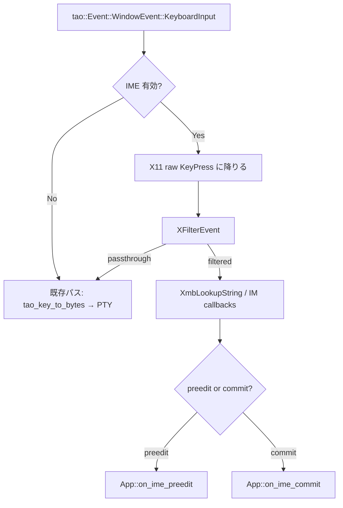
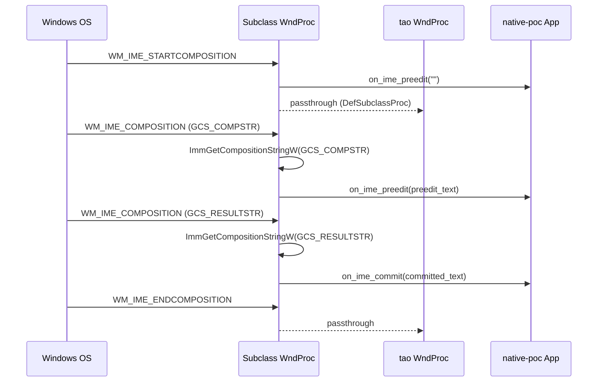
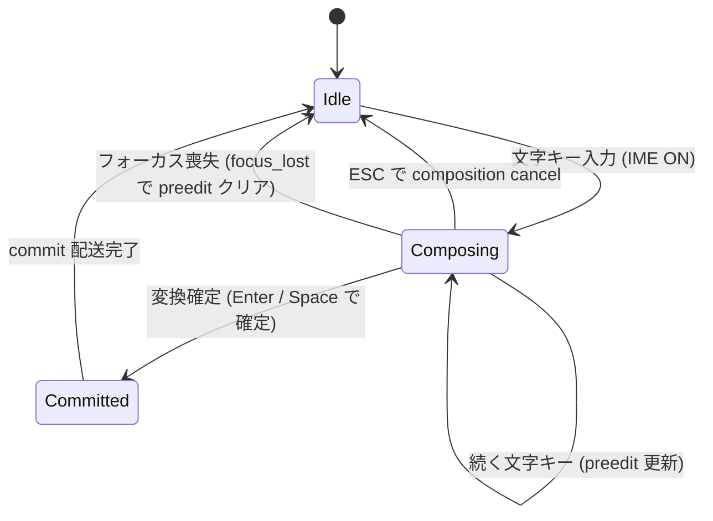

# ime-native-integration - 要件定義書

## 1. 概要

### 1.1 背景

restruct.md「emterm 再構築方針: ネイティブターミナル + WebView ビューアのハイブリッド構成」の Phase 4-G。

Phase 4 (`doc/tasks/mux-tabs-windows-ime/`) で native-poc 側の IME ルーティング層 (`native-poc/src/ime/{preedit, commit}.rs`、`App::on_ime_{preedit, commit, focus_lost}`、`render::cursor::draw_cursor_with_preedit`) が auto-scope で実装されたが、tao 0.34 の上位層制約により Linux X11 / Wayland + fcitx5 / IBus、および Windows + MS-IME のいずれも実機で動作しないことが確定した。

- Linux X11: tao 0.34 が `XFilterEvent` を呼ばないため fcitx5 / IBus にキーが届かず IME 起動不可
- Linux Wayland: tao 0.34 が `zwp_text_input_v3` を実装しないため preedit / commit が来ない
- Windows: tao 0.34 が IMM32 / TSF 統合を持たないため `WM_IME_*` メッセージが application から見えない

その結果 Phase 4 の `mux-tabs-windows-ime` における `NFR3: Linux fcitx5 IME parity with Phase 1` および `FR11 / FR12` の manual gate (`TS-manual-ime-linux` / `TS-manual-ime-windows`) は **deferred / N/A** 扱いとなった。

Phase 4 では「WebView ハイブリッド fallback」と「tao 置換」の二択を将来検討に残したが、Phase 4-G では **後者 (tao を置換せず、tao の event loop に各 OS の IME クライアントを自前で差し込む)** を採択する。

### 1.2 目的

native-poc に Linux X11 (XIM) / Linux Wayland (zwp_text_input_v3) / Windows (IMM32) の IME クライアントを自前で実装し、Phase 4 で deferred になった `NFR3 (Linux fcitx5 IME parity)` および `FR11 / FR12` の manual gate を達成する。Phase 4 で配線済みの `App::on_ime_{preedit, commit, focus_lost}` をそのまま受け側として再利用し、上流の IME プロトコル層だけを追加する形で完結させる。

### 1.3 スコープ

**対象**:

- Linux X11 + fcitx5 / IBus: XIM クライアント実装
  - preedit 表示 (アンダーラインオーバーレイ)
  - commit (確定テキストの PTY 書き込み)
  - IME on/off 切替 (Ctrl+Space 等のトグルキーを IME に届ける)
- Linux Wayland + fcitx5 / IBus: text-input-unstable-v3 クライアント実装
  - 同上 (preedit / commit / IME on/off)
- Windows + MS-IME / Google 日本語入力: IMM32 クライアント実装
  - preedit 表示
  - commit
  - 候補ウィンドウ位置 (`ImmSetCompositionWindow`) は best effort

**対象外**:

- Windows TSF (`ITfTextInputProcessor`) — IMM32 で実用に耐える場合は追加対応せず、不足が判明した時点で別 SDD に分離
- macOS (CLAUDE.md 記載のとおりサポート外)
- 旧 Tauri (`src-tauri/`) 側の IME 処理 — Phase 7 で廃止される側なので変更しない
- Phase 4-E で deferred になった preedit overlay の高度なスタイリング (候補窓位置の精密制御、segment 単位の下線色分け等)
- Phase 4 で実装済みの `ime::preedit::State` / `ime::commit::write_commit` の振る舞い変更 (既存の auto-scope 実装を変更しない)

### 1.4 段階リリース

restruct.md Phase 4-G の方針に従い、以下の順で Go/No-Go 判定をしながら進める。

1. **Linux X11 + fcitx5 (XIM)** — まずここを動かして実装方針 (tao event loop と native IME ループの共存) が成立するかを確認する
2. **Linux Wayland + fcitx5 (text-input-v3)** — X11 の知見を流用
3. **Windows + MS-IME (IMM32)**

各段階で実機 manual gate に合格してから次へ進む。

## 2. ビジネス要件

### 2.1 ビジネス目標

- Phase 4 で deferred になった IME ゲートを達成し、Phase 5 (Wry ビューア統合) 着手の前提を整える
- 日本語ユーザー (Linux fcitx5 / Windows MS-IME) が native-poc を Phase 1 WebView ビルドと同等以上の使い心地で利用できる状態にする

### 2.2 対象ユーザー

| ユーザータイプ | 説明 |
|----------------|------|
| Linux fcitx5 ユーザー | X11 / Wayland の fcitx5 で日本語入力する開発者 |
| Linux IBus ユーザー | IBus を使う開発者 (fcitx5 互換プロトコルでカバーされる範囲) |
| Windows MS-IME ユーザー | Windows で MS-IME / Google 日本語入力を使う開発者 |
| Claude Code セッション | 長時間 mux session で日本語コメントを書くケース |

### 2.3 期待される効果

- Phase 4-E の auto-scope 実装 (preedit overlay + commit sanitize) が実機で初めて exercise される
- Phase 1 WebView ビルドで動いていた fcitx5 IME 体験が native-poc でも実現する
- restruct.md の Go/No-Go ゲートにおける「IME 未達」を解消し、Phase 5 以降を blocker なく開始できる

## 3. ユースケース

### 3.1 ユースケース一覧

| ID | ユースケース名 | アクター | 優先度 |
|----|----------------|----------|--------|
| UC01 | Linux X11 で fcitx5 を使い日本語を入力 | Linux X11 ユーザー | 高 |
| UC02 | Linux Wayland で fcitx5 を使い日本語を入力 | Linux Wayland ユーザー | 高 |
| UC03 | Windows で MS-IME を使い日本語を入力 | Windows ユーザー | 高 |
| UC04 | IME のオン/オフを切り替える | 日本語ユーザー全般 | 高 |
| UC05 | mux session 内で IME を使う | Claude Code セッション | 中 |
| UC06 | フォーカス喪失時に preedit がクリアされる | 日本語ユーザー全般 | 中 |

### 3.2 ユースケース詳細

#### UC01: Linux X11 で fcitx5 を使い日本語を入力

**アクター**: Linux X11 ユーザー

**事前条件**:
- native-poc 起動中 (X11 セッション)
- fcitx5 デーモンが動作中

**基本フロー**:
1. ユーザーがネイティブターミナルにフォーカスを当てる
2. ユーザーがトグルキー (例: Ctrl+Space) を押して fcitx5 を有効化
3. ユーザーが "nihongo" と入力
4. native-poc に preedit "にほんご" がアンダーライン付きで表示される
5. ユーザーが Space を押して "日本語" に変換し Enter で確定
6. native-poc が commit "日本語" を受け取り PTY に書き込む
7. シェルが "日本語" を受信し画面に表示される

**事後条件**: PTY が UTF-8 の "日本語" を受信済

#### UC02: Linux Wayland で fcitx5 を使い日本語を入力

UC01 と同じ振る舞いを Wayland セッションでも実現する。プロトコルは `zwp_text_input_v3` を使う。

#### UC03: Windows で MS-IME を使い日本語を入力

**アクター**: Windows ユーザー

**事前条件**: native-poc 起動中、MS-IME (または Google 日本語入力) がインストール済

**基本フロー**:
1. ユーザーが半角/全角キーで IME をオン
2. ユーザーが "nihongo" と入力
3. native-poc に preedit "にほんご" が表示される
4. ユーザーが Space で変換、Enter で確定
5. native-poc が commit "日本語" を PTY に書き込む

**事後条件**: PTY が UTF-8 の "日本語" を受信済

候補ウィンドウ位置は best effort (`ImmSetCompositionWindow` でカーソルセル近傍に設定するが、ピクセル精度の保証はしない)。

#### UC04: IME のオン/オフを切り替える

**基本フロー**:
1. ユーザーがトグルキー (Linux: Ctrl+Space、Windows: 半角/全角) を押す
2. キーイベントが IME クライアントに先に届く
3. IME がオン/オフを切り替える
4. ターミナル側は当該キーを受け取らない (IME が consume)

#### UC05: mux session 内で IME を使う

native-poc が mux session に attach 中でも UC01〜UC04 と同じ振る舞いをする。commit テキストは現在アクティブな PTY (mux 経由でも素の PTY でも) に書き込まれる。

#### UC06: フォーカス喪失時に preedit がクリアされる

**基本フロー**:
1. ユーザーが日本語を composing 中
2. ユーザーが別ウィンドウへフォーカスを移す
3. native-poc が `WindowEvent::Focused(false)` を受け取り `App::on_ime_focus_lost` を呼ぶ
4. preedit overlay が消える
5. ユーザーがネイティブターミナルに戻る
6. composition は再開できなくてもよい (新規入力からやり直し) が、ターミナル表示が壊れていない状態を保つ

## 4. 機能要件

### 4.1 機能一覧

| ID | 機能名 | 説明 | 優先度 |
|----|--------|------|--------|
| F01 | XIM クライアント (Linux X11) | X11 ディスプレイで XIM プロトコルを話し fcitx5 / IBus と通信する | 高 |
| F02 | text-input-v3 クライアント (Linux Wayland) | Wayland コンポジターの text-input-unstable-v3 で fcitx5 / IBus と通信する | 高 |
| F03 | IMM32 クライアント (Windows) | `WM_IME_*` メッセージを購読し MS-IME / Google 日本語入力と通信する | 高 |
| F04 | preedit → ルーティング層配線 | IME クライアントが受け取った preedit を `App::on_ime_preedit` に流す | 高 |
| F05 | commit → ルーティング層配線 | IME クライアントが受け取った commit を `App::on_ime_commit` に流す | 高 |
| F06 | キーイベントの IME 優先処理 | IME がフィルタしたキー (変換キー、トグルキー、未確定状態の文字キー) は PTY に届けない | 高 |
| F07 | カーソル位置を IME に通知 | preedit / 候補ウィンドウ位置の決定に必要なカーソルセル座標を IME クライアントに渡す | 中 |
| F08 | フォーカス変化時のリセット | フォーカス喪失で preedit クリア + IME クライアントに focus_out 通知 | 中 |
| F09 | IME 利用不可時のフォールバック | 環境変数 / 設定で IME 統合を無効化できる (現行の "ReceivedImeText 経由のみ" 動作にフォールバック) | 中 |

### 4.2 機能詳細

#### F01: XIM クライアント (Linux X11)

**説明**: tao 0.34 が X11 で `XFilterEvent` を呼ばないため、native-poc 側で自前の XIM クライアントを起動し、tao が握っている X11 ディスプレイと並行に IME 通信を行う。

**入力**:
- tao 経由の X11 ディスプレイハンドル (`raw-window-handle` 0.6 で取得)
- 生 KeyPress イベント (`XEvent`)

**出力**:
- preedit 更新 → `App::on_ime_preedit(text)`
- commit 確定 → `App::on_ime_commit(text)`
- IME がフィルタしたキー → PTY に送らない (drop)

**処理フロー**:

**ビジネスルール**:
- IME がオフの状態では既存のキー入力パスを変更しない (regression を起こさない)
- preedit 中の Ctrl 系・特殊キー (矢印・Ctrl+C 等) は IME を bypass して既存パスに通す (Phase 4-E `tao_key_to_bytes` で既に `!mods.ctrl && !mods.alt` の早期 None ガードあり、これと整合させる)

**バリデーション**:
| 項目 | ルール | エラーメッセージ |
|------|--------|------------------|
| preedit 文字列 | C0 / C1 制御文字を含まない (既存 `ime::preedit::sanitize` を経由) | (ログのみ、サイレントに strip) |
| commit 文字列 | UTF-8 として valid | (invalid なら drop + warn ログ) |

**エラーケース**:
| エラー | 条件 | 対応 |
|--------|------|------|
| `XOpenIM` 失敗 | IM サーバ未起動 | warn ログ + F09 のフォールバックに切替、ターミナルは継続動作 |
| `XCreateIC` 失敗 | サポートされていないスタイル | warn ログ + フォールバック |
| XIM サーバ突然死 | fcitx5 再起動など | warn ログ + 再接続を試行、失敗ならフォールバック |

#### F02: text-input-v3 クライアント (Linux Wayland)

**説明**: Wayland セッションでは X11 と異なるプロトコル `zwp_text_input_v3` を使う。tao 0.34 はこれを実装しないため、`wayland-client` + `wayland-protocols` で自前実装する。

**入力**: Wayland display / surface (tao から `raw-window-handle` 経由で取得)

**出力**: F01 と同じ (`App::on_ime_preedit` / `App::on_ime_commit`)

**特記事項**:
- Wayland では XIM のような globally-shared input method はなく、`zwp_text_input_v3` がコンポジター経由で fcitx5-wayland に届く
- preedit のスタイル属性 (アンダーライン色等) は無視 (Phase 4-G スコープ外)
- カーソル位置通知は `zwp_text_input_v3::set_cursor_rectangle` を使う

**エラーケース**:
| エラー | 条件 | 対応 |
|--------|------|------|
| コンポジターが text-input-v3 を持たない | 古い GNOME など | warn ログ + F09 フォールバック |
| 接続切断 | コンポジター異常 | warn ログ + 再接続試行 |

#### F03: IMM32 クライアント (Windows)

**説明**: Windows では `WM_IME_STARTCOMPOSITION` / `WM_IME_COMPOSITION` / `WM_IME_ENDCOMPOSITION` を購読する。tao 0.34 はこれらをアプリに渡さないため、`windows-rs` 経由で window proc を hook するか、tao を fork するのではなく `SetWindowSubclass` で wndproc を差し替える方針を取る。

**入力**: native-poc のメインウィンドウ HWND (tao から `raw-window-handle` 経由で取得)

**出力**: F01 と同じ

**処理フロー**:

**特記事項**:
- 候補ウィンドウ位置: `ImmSetCompositionWindow` で `CFS_POINT` + cursor pixel 座標を設定 (best effort)
- IMM32 で機能不足が判明した場合に TSF を後追いするが、Phase 4-G では IMM32 のみで Go 判定する

#### F04 / F05: preedit / commit のルーティング層配線

**説明**: F01〜F03 のいずれの IME クライアントも、最終的に既存の `App::on_ime_preedit(&str)` / `App::on_ime_commit(&str)` を呼ぶ。これらの API はすでに Phase 4-E で実装済 (signature 変更なし)。

**ビジネスルール**:
- preedit / commit のサニタイズは引き続き `ime::preedit::sanitize` を通す (Phase 4-E と同じ契約)
- commit は bracketed paste で wrap しない (Phase 4-E `write_commit` の挙動を維持)

#### F06: キーイベントの IME 優先処理

**説明**: IME が有効な間、生キーイベントを IME クライアントに先に渡し、IME がフィルタしたものは PTY に届けない。フィルタされなかったキー (Ctrl+C 等) は既存パスに通す。

**ビジネスルール**:
- Phase 4-E `tao_key_to_bytes` の早期 None ガード (`!mods.ctrl && !mods.alt` のとき printable は `WindowEvent::ReceivedImeText` 任せにする) は、IME 統合が ON の環境では撤回する: IME クライアントが文字キーを consume する責務を担う
- ただし IME がオフの時は現行の `ReceivedImeText` 任せの動作を維持する (regression 防止)

#### F07: カーソル位置を IME に通知

**説明**: preedit / 候補ウィンドウの表示位置決定のため、現在のカーソルセル座標 (ピクセル) を IME クライアントに渡す。

**入力**: `App::active_tab().grid().cursor()` から行・列を取得 → セル幅・高さで pixel に変換

**出力**:
- X11 XIM: `XICAttribute` の `XNSpotLocation`
- Wayland text-input-v3: `set_cursor_rectangle`
- Windows IMM32: `ImmSetCompositionWindow`

**呼び出しタイミング**: preedit 開始時 + preedit 内容変化時 (毎フレームは呼ばない)

#### F08: フォーカス変化時のリセット

**説明**: native-poc がフォーカスを失った時、preedit オーバーレイをクリアし、IME クライアントにも focus_out を通知する。Phase 4-E で配線済の `App::on_ime_focus_lost` を再利用する。

#### F09: IME 統合の無効化 (環境変数 / 設定)

**説明**: 何らかの理由で IME 統合がうまく動かない環境向けに、明示的に無効化できる手段を残す。無効化された場合は Phase 4 と同じ動作 (`WindowEvent::ReceivedImeText` 経由のみ、preedit overlay は出ない) になる。

**ビジネスルール**:
- 環境変数 `EMTERM_NATIVE_IME=0` で無効化
- `settings.json` の `ime.native_integration` (`true | false`、デフォルト `true`) でも無効化可能
- 無効化時は warn 一発ログを出す
- Linux X11 / Wayland / Windows のいずれかの初期化が失敗した場合も自動的にフォールバック (warn ログ + ターミナルは継続動作)

## 5. 非機能要件

### 5.1 パフォーマンス要件

- preedit 表示遅延: キー押下から overlay 表示まで 30 ms 以内 (60 FPS の 2 フレーム以内)
- commit → PTY 書き込み: 5 ms 以内
- 既存のキー入力レイテンシ (IME OFF 時): Phase 4 から悪化させない (key down → PTY write < 1 ms を維持)

### 5.2 セキュリティ要件

- preedit / commit テキストは既存の `ime::preedit::sanitize` で C0 / C1 制御文字を strip する (Phase 4-E と同じ契約を維持)
- IM サーバから受け取った文字列は UTF-8 として validate し、invalid なら drop + warn ログ
- commit を bracketed paste で wrap しない (ユーザータイピングであり paste ではない)

### 5.3 可用性要件

- IME 初期化失敗時にネイティブターミナル本体が落ちないこと (F09 のフォールバックで継続動作)
- IM サーバの再起動 (fcitx5 を kill して再起動など) に追従できること (XIM 再接続、最低でも次のフォーカス取得時に復帰)

### 5.4 保守性要件

- ログ出力:
  - 初期化成功時: `[INFO][BACKEND] ime: <protocol> initialized` を 1 回
  - フォールバック発動時: `[WARN][BACKEND] ime: native integration disabled (<reason>), falling back to ReceivedImeText`
  - 接続切断: `[WARN][BACKEND] ime: <protocol> disconnected, attempting reconnect`
- `native-poc/src/ime/` 配下に protocol 別 module を分離 (`ime::x11`、`ime::wayland`、`ime::windows`)
- 各 module はトレイト `ImeBackend` を実装し、`App` 側は backend 種別を意識しない

### 5.5 互換性要件

- 対象: Linux X11 / Linux Wayland / Windows (CLAUDE.md の対応プラットフォームに合致)
- IME: fcitx5 / IBus (Linux) / MS-IME / Google 日本語入力 (Windows)
- 既存の Phase 4 auto-scope (`ime::preedit::State` / `write_commit` / `App::on_ime_*`) の振る舞いを変更しない

## 6. UI/UX要件

### 6.1 画面設計要件

- preedit overlay: Phase 4-E の `render::cursor::draw_cursor_with_preedit` をそのまま使う (アンダーラインスタイル、配色、anchor cell は変更しない)
- 候補ウィンドウ: OS の IME ネイティブ実装に任せる (位置は best effort)

### 6.2 状態遷移

### 6.3 レスポンシブ対応

該当なし (ネイティブデスクトップ UI)。

## 7. データ要件

該当なし (永続化なし)。preedit / commit テキストは揮発的に IME クライアント → `App` → PTY を一方向に流れる。

## 8. 外部連携

### 8.1 連携システム

| システム名 | 連携方法 | データ |
|------------|----------|--------|
| fcitx5 (X11) | XIM protocol over X11 socket | preedit / commit テキスト、key filter 判定 |
| fcitx5 (Wayland) | zwp_text_input_v3 protocol | preedit / commit テキスト、cursor rect |
| IBus | XIM (X11) / text-input-v3 (Wayland) で fcitx5 と同じインタフェース | 同上 |
| MS-IME / Google 日本語入力 | WM_IME_* messages (IMM32) | preedit / commit テキスト、composition window position |

### 8.2 API仕様要件

- 内部 API は変更しない (`App::on_ime_preedit(&str)` / `on_ime_commit(&str)` / `on_ime_focus_lost()`)
- 各 backend は新規 trait `ImeBackend` を実装:
  - `init(window_handle) -> Result<Self, ImeInitError>`
  - `dispatch_key_event(raw_key) -> KeyDispatchResult` (Consumed / Passthrough)
  - `notify_cursor_rect(x, y, w, h)`
  - `notify_focus(focused: bool)`
  - `pump()` (event loop の各 tick から呼ぶ)

## 9. 制約条件

### 9.1 技術的制約

- tao 0.34 を継続使用する (置換しない)
- tao の event loop は唯一の OS event sink として残す。IME クライアントが必要な OS event を tao より先に消費するため、tao の internal event loop に hook を入れる必要がある (Linux: X11 raw event handler、Windows: window subclass、Wayland: 自前イベントポンプを別スレッドで回す)
- workspace tauri 2.9.5 transitive 制約から外れないこと (legacy `src-tauri` の build も壊さない)

### 9.2 ビジネス上の制約

- macOS は対象外
- Phase 5 (Wry ビューア統合) と並行進行可能 (依存関係なし)

### 9.3 スケジュール制約

- restruct.md 工数目安: 3〜6 週間 (3 OS / 環境 × 各 1-2 週間)
- Linux X11 が最初の Go/No-Go 判定対象 (実装方針が成立するかをここで見極める)

## 10. 想定される課題とリスク

### 10.1 技術的課題

| 課題 | 影響度 | 対応策 |
|------|--------|--------|
| tao 0.34 の event loop に hook を挿入する経路が limited | 高 | X11: `XFilterEvent` を呼ぶ前に tao の `Event::WindowEvent::KeyboardInput` から `raw-window-handle` + 自前 X11 connection で並行に query / Windows: `SetWindowSubclass` で wndproc 差し替え / Wayland: 独立した display thread |
| fcitx5 と IBus で XIM 実装の差異 | 中 | 最小限の XIM サブセット (preedit / commit / focus / spot location) のみ使い、両方で動作確認 |
| Wayland の `zwp_text_input_v3` がコンポジターによって挙動が異なる | 中 | KDE / GNOME / wlroots 系で実機検証、不足を見つけたら issue 化 |
| Windows IMM32 で MS-IME / Google IME の挙動差 | 低 | 両方で実機検証、`ImmGetCompositionStringW` の `GCS_COMPSTR` / `GCS_RESULTSTR` だけ使う最小実装で両対応の見込み |
| tao event loop と並行スレッド (Wayland 用) で window handle ownership 問題 | 中 | `raw-window-handle` 0.6 の `RawDisplayHandle` を Wayland thread に share、surface 操作は main thread に戻して dispatch |
| IM サーバ突然死時の挙動 | 低 | reconnect ロジック + フォールバック (F09) |

### 10.2 ビジネスリスク

| リスク | 発生確率 | 影響度 | 対応策 |
|--------|----------|--------|--------|
| Linux X11 (XIM) で実装方針が成立しない | 低 | 高 | 段階リリースで最初に検証、No-Go の場合は restruct.md「WebView ハイブリッド fallback」案へ切替 |
| Wayland で zwp_text_input_v3 が compositor 都合で動かない | 中 | 中 | X11 経由 (XWayland) を暫定推奨、`settings.display_backend = "x11"` で運用 |
| 全 OS で工数オーバー | 中 | 中 | Linux X11 を最優先、Wayland / Windows は工数次第で別 SDD 化 |

## 11. 成功基準

### 11.1 受け入れ基準

- [ ] Linux X11 + fcitx5: preedit / commit / IME on/off が動作 (`TS-manual-ime-x11`)
- [ ] Linux Wayland + fcitx5: preedit / commit / IME on/off が動作 (`TS-manual-ime-wayland`)
- [ ] Windows + MS-IME: preedit / commit が動作、候補ウィンドウ位置は best effort (`TS-manual-ime-windows`)
- [ ] Phase 4-E の auto-scope (`ime::preedit::State` / `write_commit` / `App::on_ime_*`) を変更せず、上に IME backend 層を載せている
- [ ] IME OFF 時のキー入力レイテンシが Phase 4 から劣化していない
- [ ] `cargo build --workspace` / `cargo test --workspace` / `cargo fmt --all -- --check` / `cargo clippy` clean
- [ ] 旧 `src-tauri` への regression なし (Phase 4 と同じ workspace 互換)

### 11.2 KPI

| 指標 | 目標値 | 測定方法 |
|------|--------|----------|
| preedit 表示遅延 | < 30 ms | キー押下時刻と overlay 描画時刻の差を log で記録、release host で計測 |
| commit → PTY 書き込み遅延 | < 5 ms | IME backend の commit 受信から `PtySession::write` までを span 計測 |
| IME OFF 時 key 入力レイテンシ regression | 0 | Phase 4 の TS-perf-1 / TS-perf-2 を再実行して差分を見る |

## 12. テストシナリオ

### 12.1 テスト観点

- [ ] **正常系**: fcitx5 / MS-IME / Google 日本語入力で "nihongo" → "日本語" の入力フローが PTY に届く
- [ ] **正常系**: ASCII (英字) 入力は IME を経由せず直接 PTY に届く (Phase 4 のレイテンシを維持)
- [ ] **正常系**: 矢印 / Ctrl 系特殊キーは IME composition 中でも従来通り PTY に届く
- [ ] **異常系**: IM サーバ未起動の状態で native-poc を起動 → warn ログ + ターミナルは動作継続 (F09)
- [ ] **異常系**: 起動後に IM サーバを kill → warn ログ + フォールバック、新規に IM サーバを起動するとフォーカス再取得で復帰
- [ ] **境界値**: 100 文字以上の長い preedit が崩れない
- [ ] **境界値**: composition 中に他ウィンドウへフォーカス移動 → preedit が消える、戻ってもターミナル表示が壊れていない
- [ ] **境界値**: composition 中にウィンドウリサイズ → preedit anchor がカーソル位置に追従、または明示的にクリアされる
- [ ] **セキュリティ**: preedit に C0 / C1 制御文字が混ざっても sanitize で drop され overlay が崩れない
- [ ] **パフォーマンス**: IME OFF 時のキー入力レイテンシが Phase 4 から劣化しない (TS-perf 再実行)

## 13. 用語定義

| 用語 | 定義 |
|------|------|
| IME | Input Method Editor。日本語などの multi-character 入力を司る OS / 外部プロセス |
| preedit | 確定前の composition 中文字列 (例: "にほんご" を変換する前) |
| commit | 確定後のテキスト (例: "日本語") |
| XIM | X Input Method。X11 上で IME と app が通信するプロトコル |
| text-input-v3 | `zwp_text_input_v3`、Wayland 用 IME プロトコル |
| IMM32 | Windows Input Method Manager 32-bit API。`WM_IME_*` メッセージ群 |
| TSF | Text Services Framework。IMM32 の後継・上位 API (Windows) |
| anchor cell | preedit overlay を描画するセル座標 (composition 開始時のカーソル位置) |
| fallback | 環境変数 / 設定 / 初期化失敗時に Phase 4 と同じ動作 (`WindowEvent::ReceivedImeText` 経由のみ) に切替えるモード |

## 14. 確認事項

### 14.1 確認済み事項

- [x] 採択方針: tao 0.34 を継続し、各 OS の IME クライアントを native-poc 側で自前実装する (restruct.md Phase 4-G の方針に従う)
- [x] 段階リリース: Linux X11 → Linux Wayland → Windows の順 (restruct.md 記載のとおり)
- [x] Windows は IMM32 をまず実装、TSF は工数不足が判明した時のみ別 SDD に分離
- [x] macOS 非対応 (CLAUDE.md のプラットフォーム制約)
- [x] Phase 4-E auto-scope (`ime::preedit::State` / `write_commit` / `App::on_ime_*` / `render::cursor::draw_cursor_with_preedit`) を変更せずに上層に backend を載せる

### 14.2 未確認・保留事項

- [ ] tao の event loop に hook を入れる具体的なクレート選定 (`x11-dl` vs `x11rb`、`wayland-client` 直叩き vs `smithay-client-toolkit` の利用方針) は IMPLEMENTATION.md (sdd.2-create-plan) で決める
- [ ] Wayland コンポジターのカバー範囲 (KDE / GNOME / wlroots 系のどれをまず Go ターゲットにするか)
- [ ] Windows TSF 着手判断基準 (IMM32 で「不足」と認定する閾値)
- [ ] `settings.json` の `ime` セクション名・キー名の最終確定 (一旦 `ime.native_integration: bool` で提案)

## 15. 参考資料

- restruct.md: `tmp/restruct.md`(Phase 4-G セクション、IME クライアント自前実装の方針記載)
- Phase 4 SPEC: `doc/tasks/mux-tabs-windows-ime/SPEC.md`(NFR3 / FR11 / FR12 の deferred 状態)
- Phase 4 sdd.yaml: `doc/tasks/mux-tabs-windows-ime/sdd.yaml`(deferred 経緯のログ)
- Phase 1 IME 実装 (WebView ベース): `doc/tasks/ime-input-support/SPEC.md`(現行 fcitx5 / MS-IME の挙動を参考に)
- 既存の SKK IME 修正: `doc/tasks/skk-ime-freeze-fix/SPEC.md`
- 既存ルーティング層: `native-poc/src/ime/{mod.rs, preedit.rs, commit.rs}`
- 既存キー入力パス: `native-poc/src/window_host.rs`(`tao_key_to_bytes` の Ctrl/Alt ガード、`WindowEvent::ReceivedImeText` ハンドラ、`Focused(false)` での `on_ime_focus_lost` 配線)
