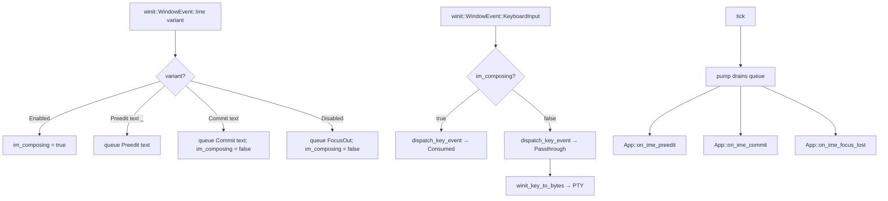
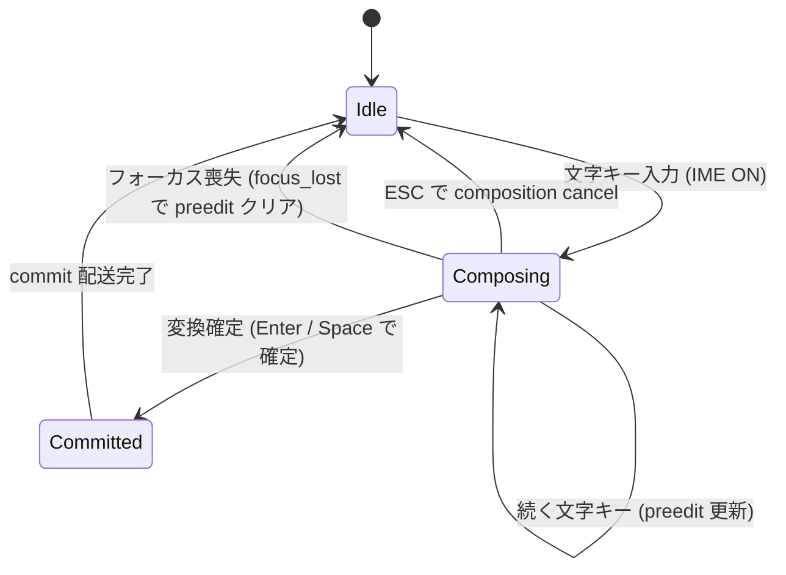

# ime-native-integration - 要件定義書

## 0. Redesign 履歴 (2026-05-14)

前 Phase 4-G (tao 0.34 + 自前 XIM / Wayland / IMM32 backend) は実装後の実機検証で動作しないことが判明したため、**戦略 A (winit 0.30 移行)** に redesign された。

### 判明した実機ブロッカー

- **X11**: tao 0.34 が XKB keycode を公開しないため、自前 X11 backend が synthetic `XKeyEvent` を組み立てて `XmbLookupString` に渡しても **0 chars** が返り、通常の英数字すら PTY に届かない
- **tao の IME 非対応設計**: tao 0.34 は IME を意図的にサポートしない (Tauri が WebView 側で IME を処理する設計のため、winit 0.27 系から fork した時点で `platform_impl/linux/x11/ime/` を削除済み、`set_ime_position` は `//TODO` の空実装)
- **参考実装の結論一致**: WezTerm / Alacritty / Ghostty (`tmp/research/{wezterm-ime,alacritty-winit-ime,ghostty-ime}.md`) を調査した結果、3 実装とも「自前 XIM をやめて toolkit (winit / wgpu-winit) に任せる」で結論一致

### 採択方針: 戦略 A (winit 0.30 移行)

- tao 0.34 を捨てて `winit 0.30.9` に乗り換える
- winit は `WindowEvent::Ime { Enabled, Preedit, Commit, Disabled }` で X11 / Wayland / Windows をまとめて統合カバーする
- 自前 `ime::{x11, wayland, windows}` は完全削除し、依存 (`x11-dl`, `wayland-client`, `wayland-protocols`, `windows`) も除去
- Phase 4-E auto-scope (`ime::preedit::State` / `commit::write_commit` / `App::on_ime_*` / `render::cursor::draw_cursor_with_preedit`) は不変
- 新規 `ime::winit_bridge` で Ghostty 由来のステートマシン (`im_composing` + `in_keyevent`) を実装し、commit と key event の二重消費を防ぐ

### 旧 Phase 4-G からの差分

- **削除**: F01 (XIM client) / F02 (text-input-v3 client) / F03 (IMM32 client) の自前実装責務
- **新規**: F10 (winit `WindowEvent::Ime` → ImeEvent 変換) / F11 (Ghostty 由来 state machine) / F12 (tao → winit migration)
- **継承**: F04 (preedit routing) / F05 (commit routing) / F06 (key intercept、state machine 経由に rewrite) / F07 (cursor rect、`Window::set_ime_cursor_area` 経由) / F08 (focus) / F09 (fallback)

以下の本文 (§1 以降) は **redesign 後の方針** で記載する。前 Phase 4-G 時点の自前 XIM 関連記述は本書では削除した (sdd.yaml の旧 implement notes に historical record として保持)。

## 1. 概要

### 1.1 背景

restruct.md「emterm 再構築方針: ネイティブターミナル + WebView ビューアのハイブリッド構成」の Phase 4-G。

Phase 4 (`doc/tasks/mux-tabs-windows-ime/`) で native-poc 側の IME ルーティング層 (`native-poc/src/ime/{preedit, commit}.rs`、`App::on_ime_{preedit, commit, focus_lost}`、`render::cursor::draw_cursor_with_preedit`) が auto-scope で実装されたが、tao 0.34 の上位層制約により Linux X11 / Wayland + fcitx5 / IBus、および Windows + MS-IME のいずれも実機で動作しないことが確定した。

- Linux X11: tao 0.34 が `XFilterEvent` を呼ばず、加えて XKB keycode を公開しないため fcitx5 / IBus にキーが届かず IME 起動不可
- Linux Wayland: tao 0.34 が `zwp_text_input_v3` を実装しないため preedit / commit が来ない
- Windows: tao 0.34 が IMM32 / TSF 統合を持たないため `WM_IME_*` メッセージが application から見えない

その結果 Phase 4 の `mux-tabs-windows-ime` における `NFR3: Linux fcitx5 IME parity with Phase 1` および `FR11 / FR12` の manual gate (`TS-manual-ime-linux` / `TS-manual-ime-windows`) は **deferred / N/A** 扱いとなった。

**当初 Phase 4-G 方針 (2026-05-13、現在は廃止)**: tao を継続使用し、各 OS の IME クライアントを native-poc 側で自前実装する。実装 6 コミット (9f290ab..dbfb25b) を経て実機検証したところ、X11 で synthetic XKeyEvent が `XmbLookupString` に対して 0 chars しか返さない (tao の XKB keycode 非公開) ことが判明し、本路線は no-go と判断された。

**redesign 方針 (2026-05-14、本書の採択方針)**: 戦略 A — tao 0.34 を捨てて winit 0.30.9 に乗り換える。winit の `WindowEvent::Ime` で X11 / Wayland / Windows を統合カバーし、自前 XIM コードはすべて削除する。Phase 4-E 不変契約は維持。

### 1.2 目的

native-poc を winit 0.30.9 に移行し、winit の `WindowEvent::Ime` を Phase 4-E ルーティング層に薄く接続することで、Phase 4 で deferred になった `NFR3 (Linux fcitx5 IME parity)` および `FR11 / FR12` の manual gate を達成する。Phase 4 で配線済みの `App::on_ime_{preedit, commit, focus_lost}` をそのまま受け側として再利用する。自前の XIM / Wayland / IMM32 実装は持たない (toolkit に委譲)。

### 1.3 スコープ

**対象**:

- Linux X11 + fcitx5 / IBus: XIM クライアント実装
  - preedit 表示 (アンダーラインオーバーレイ)
  - commit (確定テキストの PTY 書き込み)
  - IME on/off 切替 (Ctrl+Space 等のトグルキーを IME に届ける)
- Linux Wayland + fcitx5 / IBus: text-input-unstable-v3 クライアント実装
  - 同上 (preedit / commit / IME on/off)
- Windows + MS-IME / Google 日本語入力: IMM32 クライアント実装
  - preedit 表示
  - commit
  - 候補ウィンドウ位置 (`ImmSetCompositionWindow`) は best effort

**対象外**:

- Windows TSF (`ITfTextInputProcessor`) — IMM32 で実用に耐える場合は追加対応せず、不足が判明した時点で別 SDD に分離
- macOS (CLAUDE.md 記載のとおりサポート外)
- 旧 Tauri (`src-tauri/`) 側の IME 処理 — Phase 7 で廃止される側なので変更しない
- Phase 4-E で deferred になった preedit overlay の高度なスタイリング (候補窓位置の精密制御、segment 単位の下線色分け等)
- Phase 4 で実装済みの `ime::preedit::State` / `ime::commit::write_commit` の振る舞い変更 (既存の auto-scope 実装を変更しない)

### 1.4 段階リリース (redesign 後)

以下の順で Go/No-Go 判定をしながら進める。

1. **Phase 4-G-1 Cleanup**: 自前 `ime::{x11, wayland, windows}` ファイルと依存を削除、`cargo test --workspace` green を維持
2. **Phase 4-G-2 winit migration (windowing only)**: tao → winit に置換、IME 接続なしで素の打鍵と既存 wgpu surface 統合を確認
3. **Phase 4-G-3 winit IME bridge 実装**: `WinitImeBridge` を新規実装し、Ghostty 由来のステートマシンで winit IME を Phase 4-E に接続
4. **Phase 4-G-4 Manual gate 再実施**: Linux X11 + fcitx5 / IBus → Linux Wayland + fcitx5-wayland → Windows + MS-IME / Google IME → perf 計測

各段階で `cargo test --workspace` green を確認し、(3) 以降は manual gate で go/no-go 判定する。

## 2. ビジネス要件

### 2.1 ビジネス目標

- Phase 4 で deferred になった IME ゲートを達成し、Phase 5 (Wry ビューア統合) 着手の前提を整える
- 日本語ユーザー (Linux fcitx5 / Windows MS-IME) が native-poc を Phase 1 WebView ビルドと同等以上の使い心地で利用できる状態にする

### 2.2 対象ユーザー

| ユーザータイプ | 説明 |
|----------------|------|
| Linux fcitx5 ユーザー | X11 / Wayland の fcitx5 で日本語入力する開発者 |
| Linux IBus ユーザー | IBus を使う開発者 (fcitx5 互換プロトコルでカバーされる範囲) |
| Windows MS-IME ユーザー | Windows で MS-IME / Google 日本語入力を使う開発者 |
| Claude Code セッション | 長時間 mux session で日本語コメントを書くケース |

### 2.3 期待される効果

- Phase 4-E の auto-scope 実装 (preedit overlay + commit sanitize) が実機で初めて exercise される
- Phase 1 WebView ビルドで動いていた fcitx5 IME 体験が native-poc でも実現する
- restruct.md の Go/No-Go ゲートにおける「IME 未達」を解消し、Phase 5 以降を blocker なく開始できる

## 3. ユースケース

### 3.1 ユースケース一覧

| ID | ユースケース名 | アクター | 優先度 |
|----|----------------|----------|--------|
| UC01 | Linux X11 で fcitx5 を使い日本語を入力 | Linux X11 ユーザー | 高 |
| UC02 | Linux Wayland で fcitx5 を使い日本語を入力 | Linux Wayland ユーザー | 高 |
| UC03 | Windows で MS-IME を使い日本語を入力 | Windows ユーザー | 高 |
| UC04 | IME のオン/オフを切り替える | 日本語ユーザー全般 | 高 |
| UC05 | mux session 内で IME を使う | Claude Code セッション | 中 |
| UC06 | フォーカス喪失時に preedit がクリアされる | 日本語ユーザー全般 | 中 |

### 3.2 ユースケース詳細

#### UC01: Linux X11 で fcitx5 を使い日本語を入力

**アクター**: Linux X11 ユーザー

**事前条件**:
- native-poc 起動中 (X11 セッション)
- fcitx5 デーモンが動作中

**基本フロー**:
1. ユーザーがネイティブターミナルにフォーカスを当てる
2. ユーザーがトグルキー (例: Ctrl+Space) を押して fcitx5 を有効化
3. ユーザーが "nihongo" と入力
4. native-poc に preedit "にほんご" がアンダーライン付きで表示される
5. ユーザーが Space を押して "日本語" に変換し Enter で確定
6. native-poc が commit "日本語" を受け取り PTY に書き込む
7. シェルが "日本語" を受信し画面に表示される

**事後条件**: PTY が UTF-8 の "日本語" を受信済

#### UC02: Linux Wayland で fcitx5 を使い日本語を入力

UC01 と同じ振る舞いを Wayland セッションでも実現する。プロトコルは `zwp_text_input_v3` を使う。

#### UC03: Windows で MS-IME を使い日本語を入力

**アクター**: Windows ユーザー

**事前条件**: native-poc 起動中、MS-IME (または Google 日本語入力) がインストール済

**基本フロー**:
1. ユーザーが半角/全角キーで IME をオン
2. ユーザーが "nihongo" と入力
3. native-poc に preedit "にほんご" が表示される
4. ユーザーが Space で変換、Enter で確定
5. native-poc が commit "日本語" を PTY に書き込む

**事後条件**: PTY が UTF-8 の "日本語" を受信済

候補ウィンドウ位置は best effort (`ImmSetCompositionWindow` でカーソルセル近傍に設定するが、ピクセル精度の保証はしない)。

#### UC04: IME のオン/オフを切り替える

**基本フロー**:
1. ユーザーがトグルキー (Linux: Ctrl+Space、Windows: 半角/全角) を押す
2. キーイベントが IME クライアントに先に届く
3. IME がオン/オフを切り替える
4. ターミナル側は当該キーを受け取らない (IME が consume)

#### UC05: mux session 内で IME を使う

native-poc が mux session に attach 中でも UC01〜UC04 と同じ振る舞いをする。commit テキストは現在アクティブな PTY (mux 経由でも素の PTY でも) に書き込まれる。

#### UC06: フォーカス喪失時に preedit がクリアされる

**基本フロー**:
1. ユーザーが日本語を composing 中
2. ユーザーが別ウィンドウへフォーカスを移す
3. native-poc が `WindowEvent::Focused(false)` を受け取り `App::on_ime_focus_lost` を呼ぶ
4. preedit overlay が消える
5. ユーザーがネイティブターミナルに戻る
6. composition は再開できなくてもよい (新規入力からやり直し) が、ターミナル表示が壊れていない状態を保つ

## 4. 機能要件

### 4.1 機能一覧 (redesign 後)

| ID | 機能名 | 説明 | 優先度 |
|----|--------|------|--------|
| F04 | preedit → ルーティング層配線 | winit `WindowEvent::Ime(Ime::Preedit(text, _))` を `App::on_ime_preedit` に流す | 高 |
| F05 | commit → ルーティング層配線 | winit `WindowEvent::Ime(Ime::Commit(text))` を `App::on_ime_commit` に流す | 高 |
| F06 | キーイベントの IME 優先処理 (state machine 経由) | `im_composing` 中の KeyboardInput を `Consumed` で短絡。press / release 両方を `dispatch_key_event` に通す (fcitx5 modifier 単独 release 対応) | 高 |
| F07 | カーソル位置を IME に通知 | カーソルセル座標を `Window::set_ime_cursor_area` に渡す (cell-diff rate-limit) | 中 |
| F08 | フォーカス変化時のリセット | `WindowEvent::Focused(false)` で preedit クリア。winit `Ime::Disabled` を `FocusOut` として吸い上げる | 中 |
| F09 | IME 利用不可時のフォールバック | 環境変数 / 設定で IME 統合を無効化。`Window::set_ime_allowed(false)` 経由で IME を切る | 中 |
| F10 | winit `WindowEvent::Ime` → `ImeEvent` 変換 | `WinitImeBridge` が winit Ime variant 4 種を `ImeEvent::{Preedit, Commit, FocusOut}` にマップ | 高 |
| F11 | Ghostty 由来ステートマシン (`im_composing` + `in_keyevent`) | commit と key event の二重消費を防ぐ。IBus / GTK simple input の commit / preedit-end 順序差異への耐性 | 高 |
| F12 | tao 0.34 → winit 0.30.9 windowing migration | event loop / window / wgpu surface / raw-window-handle 0.6 経路を winit に移行 | 高 |

**削除**: F01 (XIM client), F02 (text-input-v3 client), F03 (IMM32 client) — いずれも winit が toolkit 側で統合カバー

### 4.2 機能詳細

#### F10: winit `WindowEvent::Ime` → `ImeEvent` 変換 + F11: Ghostty state machine

**説明**: winit の `WindowEvent::Ime { Enabled, Preedit, Commit, Disabled }` を `WinitImeBridge` が `ImeEvent::{Preedit, Commit, FocusOut}` にマップする。同時に `im_composing` + `in_keyevent` の 3 値ステートマシンを持ち、commit と key event の二重消費を防ぐ。

**入力**:
- winit `WindowEvent::Ime` イベント (X11 / Wayland / Windows 統合)
- winit `WindowEvent::KeyboardInput` イベント (press / release 両方)

**出力**:
- `ImeEvent::Preedit(text)` → 内部 queue → tick 終端で `App::on_ime_preedit(text)`
- `ImeEvent::Commit(text)` → 内部 queue → `App::on_ime_commit(text)`
- `ImeEvent::FocusOut` → 内部 queue → `App::on_ime_focus_lost()`
- `dispatch_key_event` の戻り値 (`Consumed` / `Passthrough`) で `winit_key_to_bytes` を短絡するか決める

**処理フロー**:

**ビジネスルール**:
- press / release **両方** `dispatch_key_event` に通す (fcitx5 modifier 単独 release で IM 切替判定するため)
- `Ime::Commit` 受信時は state machine が `im_composing = false` をセット。続く KeyboardInput release は通常通り処理
- IBus / GTK simple input の commit / preedit-end 順序差異への耐性のため、`Ime::Disabled` でも `im_composing = false` (idempotent)
- preedit / commit 文字列は既存 `ime::preedit::sanitize` を経由 (Phase 4-E 不変契約)

**バリデーション**:
| 項目 | ルール | エラーメッセージ |
|------|--------|------------------|
| preedit 文字列 | C0 / C1 制御文字を含まない (`ime::preedit::sanitize`) | (ログのみ、サイレントに strip) |
| commit 文字列 | winit が提供する UTF-8 `String` (valid 前提) | (winit 内部で drop 済み) |

**エラーケース**:
| エラー | 条件 | 対応 |
|--------|------|------|
| `Window::set_ime_allowed(true)` 後に `Ime::Enabled` が来ない | compositor が IME プロトコル非対応 | informational warn、preedit overlay は出ないがターミナルは継続動作 |
| `Ime::Disabled` 受信 | IM サーバ kill / focus 喪失 | `on_ime_focus_lost` で preedit クリア、次の `Ime::Enabled` で復帰 |

#### F12: tao → winit windowing migration

**説明**: tao 0.34 から winit 0.30.9 に置き換える。event loop / window 作成 / KeyboardInput ハンドラ / Focused / Resized / wgpu surface 連携 / raw-window-handle 0.6 経路をすべて winit API に移行する。

**入力**: 既存 `window_host.rs` の tao API 利用箇所 (約 200 行)

**出力**:
- `winit::EventLoop` (event loop の root)
- `Arc<winit::window::Window>` (wgpu surface と共有)
- `winit_key_to_bytes` (tao_key_to_bytes を winit::KeyEvent → PTY bytes に rewrite)

**処理フロー**: winit の event は `ApplicationHandler` trait または `EventLoop::run` クロージャで受ける。`WindowEvent::KeyboardInput` の press / release は `state` フィールドで判別。

**ビジネスルール**:
- 既存の `!ctrl && !alt && Character` 早期 None ガードは winit 版でも維持
- `EMTERM_NATIVE_IME=0` 経路は不変 (`Window::set_ime_allowed(false)` で対応)
- wgpu surface 作成は `raw-window-handle` 0.6 trait 経由で互換

**エラーケース**:
| エラー | 条件 | 対応 |
|--------|------|------|
| winit `EventLoop::new()` 失敗 | OS / compositor の致命エラー | panic (現状の tao::EventLoop と同じ扱い、ターミナル本体起動不可) |
| wgpu surface 作成失敗 | 古い GPU ドライバ | panic (既存挙動) |

#### F04 / F05: preedit / commit のルーティング層配線

**説明**: F01〜F03 のいずれの IME クライアントも、最終的に既存の `App::on_ime_preedit(&str)` / `App::on_ime_commit(&str)` を呼ぶ。これらの API はすでに Phase 4-E で実装済 (signature 変更なし)。

**ビジネスルール**:
- preedit / commit のサニタイズは引き続き `ime::preedit::sanitize` を通す (Phase 4-E と同じ契約)
- commit は bracketed paste で wrap しない (Phase 4-E `write_commit` の挙動を維持)

#### F06: キーイベントの IME 優先処理 (state machine 経由)

**説明**: `WinitImeBridge::dispatch_key_event` が `im_composing` の状態を元に `Consumed` / `Passthrough` を返す。`Consumed` の場合は `winit_key_to_bytes` を呼ばずに短絡する。

**ビジネスルール**:
- press / release **両方** を `dispatch_key_event` に通す (Ghostty 流、fcitx5 modifier 単独 release 対応)
- `im_composing == true` → `Consumed` (winit が同期的に `Ime::Preedit` / `Ime::Commit` を発火する想定)
- `im_composing == false` → `Passthrough` → 既存 `winit_key_to_bytes` 経路
- `NullBackend` 時は常に `Passthrough` (Phase 4 と完全同等の挙動)

#### F07: カーソル位置を IME に通知

**説明**: preedit / 候補ウィンドウの表示位置決定のため、現在のカーソルセル座標 (ピクセル) を winit に渡す。

**入力**: `App::active_tab().grid().cursor()` から行・列を取得 → セル幅・高さで pixel に変換

**出力**: `WinitImeBridge::notify_cursor_rect(x, y, w, h)` → 内部で `Window::set_ime_cursor_area(Position, Size)` を呼ぶ。winit が X11 / Wayland / Windows それぞれのネイティブ API (XICAttribute XNSpotLocation / set_cursor_rectangle / ImmSetCompositionWindow) に振り分ける。

**呼び出しタイミング**: cursor cell (row, col) が変化した時のみ (rate-limit、毎フレームは呼ばない)。`WinitImeBridge` 内で `last_cursor_rect` を保持し、同一 rect への呼出は抑制。

#### F08: フォーカス変化時のリセット

**説明**: native-poc がフォーカスを失った時、preedit オーバーレイをクリアし、winit に focus_out を通知する。Phase 4-E で配線済の `App::on_ime_focus_lost` を再利用する。

**ビジネスルール**:
- `WindowEvent::Focused(false)` → `WinitImeBridge::notify_focus(false)` → `Window::set_ime_allowed(false)` + `App::on_ime_focus_lost`
- winit が `Ime::Disabled` を自動発火するので、それも `FocusOut` として吸い上げる (二重に呼ばれても idempotent)

#### F09: IME 統合の無効化 (環境変数 / 設定)

**説明**: 何らかの理由で IME 統合がうまく動かない環境向けに、明示的に無効化できる手段を残す。無効化された場合は Phase 4 と同じ動作 (`WindowEvent::ReceivedImeText` 経由のみ、preedit overlay は出ない) になる。

**ビジネスルール**:
- 環境変数 `EMTERM_NATIVE_IME=0` で無効化
- `settings.json` の `ime.native_integration` (`true | false`、デフォルト `true`) でも無効化可能
- 無効化時は warn 一発ログを出す
- Linux X11 / Wayland / Windows のいずれかの初期化が失敗した場合も自動的にフォールバック (warn ログ + ターミナルは継続動作)

## 5. 非機能要件

### 5.1 パフォーマンス要件

- preedit 表示遅延: キー押下から overlay 表示まで 30 ms 以内 (60 FPS の 2 フレーム以内)
- commit → PTY 書き込み: 5 ms 以内
- 既存のキー入力レイテンシ (IME OFF 時): Phase 4 から悪化させない (key down → PTY write < 1 ms を維持)

### 5.2 セキュリティ要件

- preedit / commit テキストは既存の `ime::preedit::sanitize` で C0 / C1 制御文字を strip する (Phase 4-E と同じ契約を維持)
- IM サーバから受け取った文字列は UTF-8 として validate し、invalid なら drop + warn ログ
- commit を bracketed paste で wrap しない (ユーザータイピングであり paste ではない)

### 5.3 可用性要件

- IME 初期化失敗時にネイティブターミナル本体が落ちないこと (F09 のフォールバックで継続動作)
- IM サーバの再起動 (fcitx5 を kill して再起動など) に追従できること (XIM 再接続、最低でも次のフォーカス取得時に復帰)

### 5.4 保守性要件

- ログ出力:
  - 初期化成功時: `[INFO][BACKEND] ime: winit bridge initialized` を 1 回
  - フォールバック発動時: `[WARN][BACKEND] ime: native integration disabled (<reason>), falling back`
  - `Ime::Disabled` 検出時: `[WARN][BACKEND] ime: disabled by toolkit (compositor / IM server might be unavailable)`
- `native-poc/src/ime/` 配下に責務別 module を分離 (`ime::backend`, `ime::null`, `ime::winit_bridge`, `ime::preedit`, `ime::commit`)
- `WinitImeBridge` は `ImeBackend` トレイトを実装し、`App` 側は backend 種別を意識しない
- 旧 `ime::{x11, wayland, windows}` は削除済 (winit に統合)

### 5.5 互換性要件

- 対象: Linux X11 / Linux Wayland / Windows (CLAUDE.md の対応プラットフォームに合致)
- IME: fcitx5 / IBus (Linux) / MS-IME / Google 日本語入力 (Windows)
- 既存の Phase 4 auto-scope (`ime::preedit::State` / `write_commit` / `App::on_ime_*`) の振る舞いを変更しない

## 6. UI/UX要件

### 6.1 画面設計要件

- preedit overlay: Phase 4-E の `render::cursor::draw_cursor_with_preedit` をそのまま使う (アンダーラインスタイル、配色、anchor cell は変更しない)
- 候補ウィンドウ: OS の IME ネイティブ実装に任せる (位置は best effort)

### 6.2 状態遷移

### 6.3 レスポンシブ対応

該当なし (ネイティブデスクトップ UI)。

## 7. データ要件

該当なし (永続化なし)。preedit / commit テキストは揮発的に IME クライアント → `App` → PTY を一方向に流れる。

## 8. 外部連携

### 8.1 連携システム

| システム名 | 連携方法 | データ |
|------------|----------|--------|
| fcitx5 (X11) | XIM protocol over X11 socket | preedit / commit テキスト、key filter 判定 |
| fcitx5 (Wayland) | zwp_text_input_v3 protocol | preedit / commit テキスト、cursor rect |
| IBus | XIM (X11) / text-input-v3 (Wayland) で fcitx5 と同じインタフェース | 同上 |
| MS-IME / Google 日本語入力 | WM_IME_* messages (IMM32) | preedit / commit テキスト、composition window position |

### 8.2 API仕様要件

- 内部 API は変更しない (`App::on_ime_preedit(&str)` / `on_ime_commit(&str)` / `on_ime_focus_lost()`)
- 各 backend は新規 trait `ImeBackend` を実装:
  - `init(window_handle) -> Result<Self, ImeInitError>`
  - `dispatch_key_event(raw_key) -> KeyDispatchResult` (Consumed / Passthrough)
  - `notify_cursor_rect(x, y, w, h)`
  - `notify_focus(focused: bool)`
  - `pump()` (event loop の各 tick から呼ぶ)

## 9. 制約条件

### 9.1 技術的制約

- **tao 0.34 を捨てて winit 0.30.9 に乗り換える** (redesign の中心)
- winit の event loop が唯一の OS event sink。IME 統合は winit が toolkit 内部で X11 / Wayland / Windows をカバー (自前 hook 不要)
- workspace tauri 2.9.5 transitive 制約から外れないこと (legacy `src-tauri` の build も壊さない)
- wgpu surface 作成は raw-window-handle 0.6 経由を維持 (winit 0.30 は `Arc<Window>` を提供)

### 9.2 ビジネス上の制約

- macOS は対象外
- Phase 5 (Wry ビューア統合) と並行進行可能 (依存関係なし)

### 9.3 スケジュール制約

- restruct.md 工数目安: 3〜6 週間 (3 OS / 環境 × 各 1-2 週間)
- Linux X11 が最初の Go/No-Go 判定対象 (実装方針が成立するかをここで見極める)

## 10. 想定される課題とリスク

### 10.1 技術的課題

| 課題 | 影響度 | 対応策 |
|------|--------|--------|
| winit 0.30 への移行で wgpu surface 作成手順が変わる | 中 | raw-window-handle 0.6 経由なので `Arc<Window>` を直接 surface に渡せる。winit / wgpu 公式 example で確認 |
| winit `KeyEvent` → PTY bytes 変換 (`winit_key_to_bytes`) で tao 版と微妙に異なる挙動 | 中 | 既存 `tao_key_to_bytes` のユニットテストを winit 版に rewrite し、同じ期待値で green を確認 |
| winit が compositor 都合で `Ime::Enabled` を発火しない (古い GNOME 等) | 中 | `set_ime_allowed(true)` 後 `Ime::Disabled` のみ来るケースを想定。bridge は state machine で空回りするだけ、ターミナルは動く |
| winit 0.30 の breaking changes (event loop の `ControlFlow` 廃止等) | 高 | winit 0.30 changelog を確認、`run_app` (ApplicationHandler trait) または `run` クロージャを採択 |
| Ghostty 由来 state machine の `Ime::Commit` 直後の release suppress が壊れる | 中 | `TS-winit-5` (idempotency) + `TS-winit-6` (modifier release) を pin。manual gate で二重入力なしを確認 |
| winit が IMM32 を採択 (TSF 未対応) | 低 | MS-IME / Google IME は IMM32 経由でも動作する。TSF は本 redesign スコープ外 |
| IM サーバ突然死時の挙動 | 低 | winit `Ime::Disabled` を `FocusOut` として吸い上げ、preedit クリア + 次の `Ime::Enabled` で復帰 |

### 10.2 ビジネスリスク

| リスク | 発生確率 | 影響度 | 対応策 |
|--------|----------|--------|--------|
| Linux X11 (XIM) で実装方針が成立しない | 低 | 高 | 段階リリースで最初に検証、No-Go の場合は restruct.md「WebView ハイブリッド fallback」案へ切替 |
| Wayland で zwp_text_input_v3 が compositor 都合で動かない | 中 | 中 | X11 経由 (XWayland) を暫定推奨、`settings.display_backend = "x11"` で運用 |
| 全 OS で工数オーバー | 中 | 中 | Linux X11 を最優先、Wayland / Windows は工数次第で別 SDD 化 |

## 11. 成功基準

### 11.1 受け入れ基準

- [ ] Linux X11 + fcitx5: preedit / commit / IME on/off が動作 (`TS-manual-ime-x11`)
- [ ] Linux Wayland + fcitx5: preedit / commit / IME on/off が動作 (`TS-manual-ime-wayland`)
- [ ] Windows + MS-IME: preedit / commit が動作、候補ウィンドウ位置は best effort (`TS-manual-ime-windows`)
- [ ] Phase 4-E の auto-scope (`ime::preedit::State` / `write_commit` / `App::on_ime_*`) を変更せず、上に IME backend 層を載せている
- [ ] IME OFF 時のキー入力レイテンシが Phase 4 から劣化していない
- [ ] `cargo build --workspace` / `cargo test --workspace` / `cargo fmt --all -- --check` / `cargo clippy` clean
- [ ] 旧 `src-tauri` への regression なし (Phase 4 と同じ workspace 互換)

### 11.2 KPI

| 指標 | 目標値 | 測定方法 |
|------|--------|----------|
| preedit 表示遅延 | < 30 ms | キー押下時刻と overlay 描画時刻の差を log で記録、release host で計測 |
| commit → PTY 書き込み遅延 | < 5 ms | IME backend の commit 受信から `PtySession::write` までを span 計測 |
| IME OFF 時 key 入力レイテンシ regression | 0 | Phase 4 の TS-perf-1 / TS-perf-2 を再実行して差分を見る |

## 12. テストシナリオ

### 12.1 テスト観点

- [ ] **正常系**: fcitx5 / MS-IME / Google 日本語入力で "nihongo" → "日本語" の入力フローが PTY に届く
- [ ] **正常系**: ASCII (英字) 入力は IME を経由せず直接 PTY に届く (Phase 4 のレイテンシを維持)
- [ ] **正常系**: 矢印 / Ctrl 系特殊キーは IME composition 中でも従来通り PTY に届く
- [ ] **異常系**: IM サーバ未起動の状態で native-poc を起動 → warn ログ + ターミナルは動作継続 (F09)
- [ ] **異常系**: 起動後に IM サーバを kill → warn ログ + フォールバック、新規に IM サーバを起動するとフォーカス再取得で復帰
- [ ] **境界値**: 100 文字以上の長い preedit が崩れない
- [ ] **境界値**: composition 中に他ウィンドウへフォーカス移動 → preedit が消える、戻ってもターミナル表示が壊れていない
- [ ] **境界値**: composition 中にウィンドウリサイズ → preedit anchor がカーソル位置に追従、または明示的にクリアされる
- [ ] **セキュリティ**: preedit に C0 / C1 制御文字が混ざっても sanitize で drop され overlay が崩れない
- [ ] **パフォーマンス**: IME OFF 時のキー入力レイテンシが Phase 4 から劣化しない (TS-perf 再実行)

## 13. 用語定義

| 用語 | 定義 |
|------|------|
| IME | Input Method Editor。日本語などの multi-character 入力を司る OS / 外部プロセス |
| preedit | 確定前の composition 中文字列 (例: "にほんご" を変換する前) |
| commit | 確定後のテキスト (例: "日本語") |
| XIM | X Input Method。X11 上で IME と app が通信するプロトコル |
| text-input-v3 | `zwp_text_input_v3`、Wayland 用 IME プロトコル |
| IMM32 | Windows Input Method Manager 32-bit API。`WM_IME_*` メッセージ群 |
| TSF | Text Services Framework。IMM32 の後継・上位 API (Windows) |
| anchor cell | preedit overlay を描画するセル座標 (composition 開始時のカーソル位置) |
| fallback | 環境変数 / 設定 / 初期化失敗時に Phase 4 と同じ動作 (`WindowEvent::ReceivedImeText` 経由のみ) に切替えるモード |

## 14. 確認事項

### 14.1 確認済み事項

- [x] 採択方針 (redesign 後): 戦略 A — tao 0.34 を捨てて winit 0.30.9 に乗り換え、winit の `WindowEvent::Ime` で X11 / Wayland / Windows を統合カバーする
- [x] 段階リリース (redesign 後): Phase 4-G-1 cleanup → 4-G-2 winit migration → 4-G-3 winit IME bridge → 4-G-4 manual gate
- [x] Phase 4-E auto-scope (`ime::preedit::State` / `write_commit` / `App::on_ime_*` / `render::cursor::draw_cursor_with_preedit`) を変更しない
- [x] 自前 `ime::{x11, wayland, windows}` は完全削除し、依存 (`x11-dl`, `wayland-client`, `wayland-protocols`, `windows`) も除去する
- [x] Ghostty 由来のステートマシン (`im_composing` + `in_keyevent`) を移植 (press / release 両方 dispatch、fcitx5 modifier 単独 release 対応)
- [x] macOS 非対応 (CLAUDE.md のプラットフォーム制約)

### 14.2 未確認・保留事項

- [ ] winit 0.30 の `ApplicationHandler` trait vs `EventLoop::run` クロージャ式どちらを採択するか (IMPLEMENTATION.md で 4-G-2 実装時に決定)
- [ ] tao を transitive に引きずる依存があるか (例: egui-tao 経由)。ある場合は 4-G-2 で同時に対処
- [ ] winit features 構成は `default-features = false, features = ["rwh_06", "x11", "wayland"]` で提案 (4-G-2 で確定)
- [ ] Wayland コンポジターのカバー範囲: KDE Plasma 6 + Sway must-pass、GNOME は best effort
- [ ] Windows TSF 着手判断基準 (IMM32 で「不足」と認定する閾値) — 本 redesign スコープ外
- [ ] `settings.json` の `ime.native_integration: bool` (旧 Phase 4-G から不変)

## 15. 参考資料

- 参考実装調査 (winit 採択の根拠):
  - `tmp/research/wezterm-ime.md` — WezTerm が自前 XIM から toolkit 委譲に切り替えた経緯
  - `tmp/research/alacritty-winit-ime.md` — Alacritty の winit + IME 設計
  - `tmp/research/ghostty-ime.md` — Ghostty の `im_composing` + `in_keyevent` ステートマシン (本 redesign の直接の参照源)
- restruct.md: `tmp/restruct.md` (Phase 4-G セクション)
- Phase 4 SPEC: `doc/tasks/mux-tabs-windows-ime/SPEC.md` (NFR3 / FR11 / FR12 の deferred 状態)
- Phase 4 sdd.yaml: `doc/tasks/mux-tabs-windows-ime/sdd.yaml` (deferred 経緯のログ)
- Phase 1 IME 実装 (WebView ベース): `doc/tasks/ime-input-support/SPEC.md` (現行 fcitx5 / MS-IME の挙動を参考に)
- 既存の SKK IME 修正: `doc/tasks/skk-ime-freeze-fix/SPEC.md`
- 既存ルーティング層: `native-poc/src/ime/{mod.rs, preedit.rs, commit.rs}` (Phase 4-E 不変)
- 既存キー入力パス: `native-poc/src/window_host.rs` (`tao_key_to_bytes` の Ctrl/Alt ガード、`Focused(false)` での `on_ime_focus_lost` 配線) — 4-G-2 で `winit_key_to_bytes` に rewrite
- 旧 Phase 4-G 実装 (本 redesign で superseded): commits 9f290ab..dbfb25b、`VERIFICATION_RESULT.md` (historical record)
