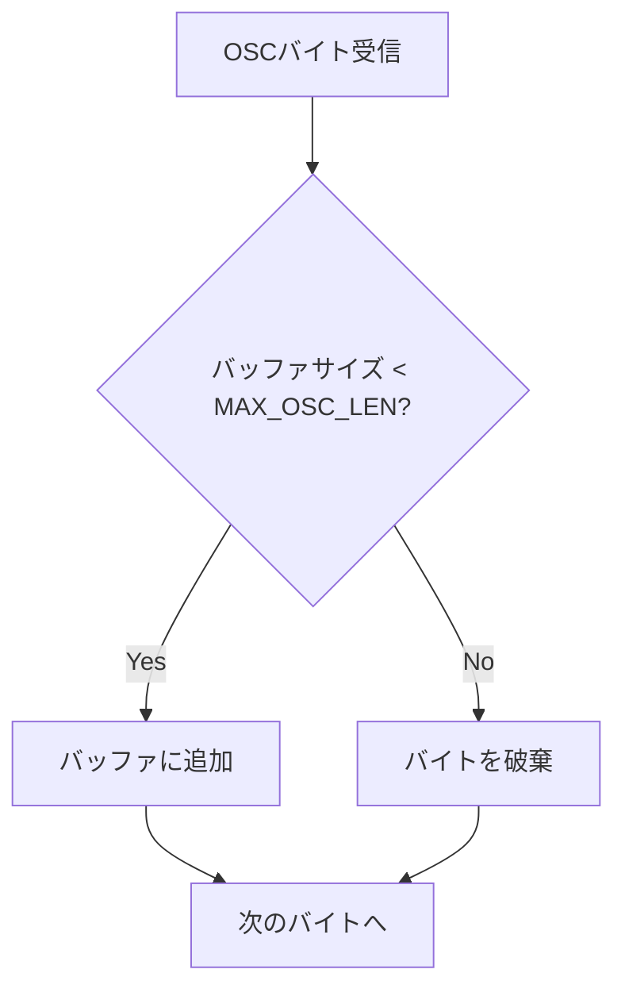

# 大規模マークダウン表示対応 - 要件定義書

## 1. 概要

### 1.1 背景
`emterm markdown` コマンドで200行（約12KB）のマークダウンファイルを表示すると途中で途切れる問題が報告された。調査の結果、WASMパーサーのOSCバッファ上限（4096バイト）が、マークダウンチャンクのOSCシーケンスサイズ（64KB超）と根本的に不整合であることが判明した。

### 1.2 目的
- マークダウン表示のサイズ制限を撤廃し、任意サイズのマークダウンファイルを表示可能にする
- WASMパーサーのOSCバッファサイズを適切な値に拡大する

### 1.3 スコープ
- WASMパーサーの `MAX_OSC_LEN` 拡大
- Rust CLIの `MAX_MARKDOWN_SIZE` 制限撤廃
- TypeScriptフロントエンドの `MAX_SESSION_SIZE` 制限撤廃
- セッションタイムアウトのリセットロジック改善
- チャンクサイズの最適化

## 2. ビジネス要件

### 2.1 ビジネス目標
ターミナル上でドキュメントや大規模なデータマークダウンを制限なく表示できるようにする。

### 2.2 対象ユーザー
| ユーザータイプ | 説明 |
|----------------|------|
| 開発者 | ドキュメントや技術文書をターミナル内で閲覧するユーザー |
| データ分析者 | マークダウン形式のデータテーブルを閲覧するユーザー |

### 2.3 期待される効果
- 数十KiBのドキュメントマークダウンが正常に表示される
- 数MiB以上のデータマークダウンも表示可能になる
- サイズによる表示切れの心配がなくなる

## 3. ユースケース

### 3.1 ユースケース一覧
| ID | ユースケース名 | アクター | 優先度 |
|----|----------------|----------|--------|
| UC01 | ドキュメントMDの表示 | 開発者 | 高 |
| UC02 | 大規模データMDの表示 | データ分析者 | 中 |
| UC03 | パイプ経由のMD表示 | 開発者 | 高 |

### 3.2 ユースケース詳細

#### UC01: ドキュメントマークダウンの表示

**アクター**: 開発者

**事前条件**:
- eMtermが起動している
- マークダウンファイルが存在する

**基本フロー**:
1. ユーザーが `emterm markdown README.md` を実行
2. CLIがファイルを読み込み、OSCシーケンスとして出力
3. ターミナルがシーケンスを解析し、マークダウンをレンダリング
4. フルスクリーンオーバーレイにマークダウンが表示される

**代替フロー**:
- ファイルが存在しない場合: エラーメッセージを表示

**事後条件**:
- マークダウンの全内容が正しく表示されている

#### UC02: 大規模データマークダウンの表示

**アクター**: データ分析者

**事前条件**:
- 数MiB〜数百MiBのマークダウンファイルが存在する

**基本フロー**:
1. ユーザーが `emterm markdown large-data.md` を実行
2. CLIがファイルを読み込み、チャンク分割してOSCシーケンスを出力
3. フロントエンドがチャンクを蓄積し、全受信後にレンダリング

**代替フロー**:
- メモリ不足の場合: OS側のOOMキラーに委ねる（ユーザー責任）

#### UC03: パイプ経由のマークダウン表示

**アクター**: 開発者

**事前条件**:
- パイプでデータが供給される

**基本フロー**:
1. ユーザーが `cat doc.md | emterm markdown -` を実行
2. CLIがstdinからデータを読み込み、OSCシーケンスを出力
3. ターミナルが表示

## 4. 機能要件

### 4.1 機能一覧
| ID | 機能名 | 説明 | 優先度 |
|----|--------|------|--------|
| F01 | OSCバッファ拡大 | WASMパーサーのMAX_OSC_LENを16MBに拡大 | 高 |
| F02 | CLIサイズ制限撤廃 | MAX_MARKDOWN_SIZE定数を削除 | 高 |
| F03 | フロントエンドサイズ制限撤廃 | MAX_SESSION_SIZEを削除 | 高 |
| F04 | タイムアウトリセット | チャンク受信時にセッションタイムアウトをリセット | 高 |
| F05 | チャンクサイズ拡大 | MARKDOWN_CHUNK_SIZEを64KBから128KBに変更 | 中 |

### 4.2 機能詳細

#### F01: OSCバッファ拡大

**説明**: `wasm/src/parser.rs` の `MAX_OSC_LEN` を 4096 から 16MB (16 * 1024 * 1024) に変更する。

**処理フロー**:

**ビジネスルール**:
- `MAX_OSC_LEN` は `MAX_DCS_LEN` と同等の16MBとする
- `osc_buffer` の初期容量も適切に調整する

#### F02: CLIサイズ制限撤廃

**説明**: `src-tauri/src/commands/markdown.rs` の `MAX_MARKDOWN_SIZE` 定数と、それに基づくファイルサイズチェックを削除する。

#### F03: フロントエンドサイズ制限撤廃

**説明**: `src/markdown/session.ts` の `MAX_SESSION_SIZE` 定数と、`handleChunk()` 内のサイズチェックを削除する。

#### F04: タイムアウトリセット

**説明**: `handleChunk()` でチャンクを受信するたびにセッションタイムアウトをリセットする。

**ビジネスルール**:
- タイムアウト値（30秒）は変更しない
- begin時点でタイマー開始、各chunk受信でリセット、end受信でタイマー停止

#### F05: チャンクサイズ拡大

**説明**: `MARKDOWN_CHUNK_SIZE` を 64KB から 128KB に変更する。

**ビジネスルール**:
- tmuxパススルーバッファ（256KB）の範囲内に収める
- base64エンコード後のOSCヘッダー込みで256KB以内

## 5. 非機能要件

### 5.1 パフォーマンス要件
- 12KB程度のマークダウンは現在と同等の速度で表示されること
- 数MiBのマークダウンも妥当な時間内（数秒以内）で表示されること

### 5.2 互換性要件
- tmux内での動作が維持されること（パススルーバッファ256KB以内）
- SSH経由での利用が維持されること

### 5.3 メモリ要件
- OSCバッファの初期容量を適切に設定し、小さなOSCシーケンスでのメモリ浪費を避ける

## 6. 制約条件

### 6.1 技術的制約
- tmuxパススルーバッファが通常256KBであるため、個々のOSCシーケンスはそれ以内に収める
- WASMのメモリはブラウザ/WebViewの制限内で動作する

## 7. 想定される課題とリスク

### 7.1 技術的課題
| 課題 | 影響度 | 対応策 |
|------|--------|--------|
| 巨大ファイルのメモリ消費 | 中 | ユーザー責任として文書化 |
| OSCバッファの初期容量増加によるメモリ影響 | 低 | 初期容量は小さく保ち、必要に応じて拡張 |

## 8. 成功基準

### 8.1 受け入れ基準
- [ ] 200行12KBのマークダウンが正常に全文表示される
- [ ] 数十KiBのマークダウンが正常に表示される
- [ ] 数MiBのマークダウンが正常に表示される
- [ ] tmux内での表示が維持される
- [ ] 既存のテストが全て通過する

## 9. テストシナリオ

### 9.1 テスト観点
- [ ] 正常系: 小さなマークダウン（1KB未満）の表示
- [ ] 正常系: 中規模マークダウン（12KB、200行）の表示
- [ ] 正常系: 大規模マークダウン（1MB）の表示
- [ ] 境界値: チャンクサイズ境界付近のデータ
- [ ] 異常系: 空ファイルの表示
- [ ] パフォーマンス: 大規模ファイルの表示速度

## 10. 用語定義

| 用語 | 定義 |
|------|------|
| OSC | Operating System Command。エスケープシーケンスの一種 |
| チャンク | マークダウンデータを分割した単位 |
| セッション | begin〜endまでの一連のマークダウン表示処理 |
| MAX_OSC_LEN | WASMパーサーのOSCバッファ最大サイズ |

## 11. 確認事項

### 11.1 確認済み事項

- [x] 最大ファイルサイズ: 無制限（警告なし、ユーザー責任）
- [x] 修正アプローチ: MAX_OSC_LENを拡大（16MB）
- [x] チャンクサイズ: 64KB → 128KB
- [x] タイムアウト: チャンク受信でリセット
- [x] 巨大ファイル警告: 不要（ユーザー責任）
- [x] CLIサイズ制限: 撤廃
- [x] フロントエンドサイズ制限: 撤廃

### 11.2 未確認・保留事項
- なし
