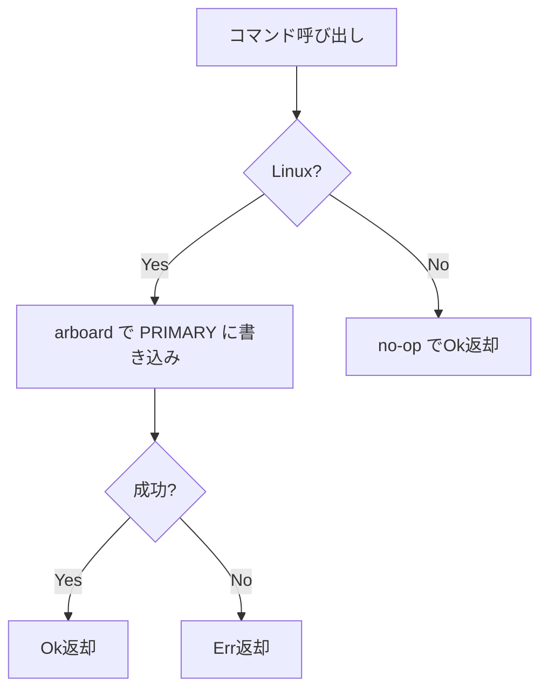
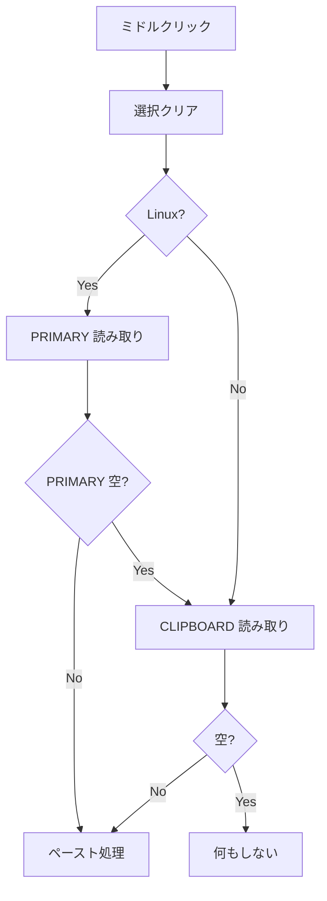
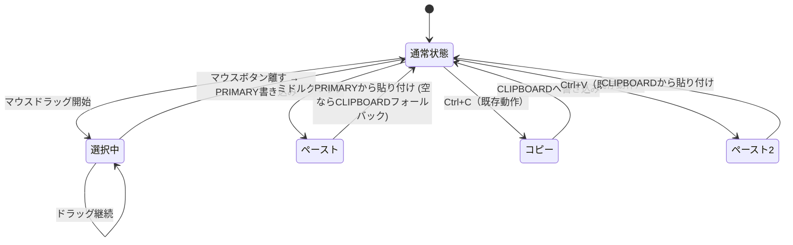

# Linux PRIMARY selection 対応 - 要件定義書

## 1. 概要

### 1.1 背景
Linux には歴史的に 2 つのクリップボード系統がある。
- **CLIPBOARD**: Ctrl+C / Ctrl+V で操作する一般的なクリップボード
- **PRIMARY selection**: テキスト選択と同時に自動コピーされ、ホイールクリック（ミドルクリック）で貼り付ける Linux 固有のクリップボード

xterm / gnome-terminal / konsole / WezTerm など主要な Linux ターミナルはこの 2 系統を独立して扱い、選択した文字列とは別に Ctrl+C でコピーした内容を同時に保持できる。

現状の eMterm は Tauri の `plugin-clipboard-manager` のみを使用しており、CLIPBOARD しか扱えない。このため以下の問題が発生している。

- 「選択時にコピー」を ON にすると、選択するたびに Ctrl+C の内容が上書きされて失われる
- 「ホイールクリックでペースト」を ON にしても、選択した文字列ではなく CLIPBOARD の内容がペーストされる
- ユーザーは「Ctrl+C の内容を守るには両設定 OFF にするしかないが、その場合 select → middle-click ワークフローが使えない」というトレードオフを強いられる

### 1.2 目的
Linux 上で PRIMARY selection を独立したクリップボード系統として扱えるようにし、xterm 等と同等の標準的な選択・貼り付け挙動を提供する。Windows の既存挙動には影響を与えない。

### 1.3 スコープ

**対象**:
- Linux 版 eMterm における PRIMARY selection の読み書き
- 選択完了時の PRIMARY 自動コピー
- ミドルクリック時の PRIMARY 優先ペースト
- Linux における `copy_on_select` / `middle_click_paste` 設定の動作変更（強制上書き）
- Linux 設定画面における上記 2 項目の非表示

**対象外**:
- Windows の既存挙動変更
- OSC 52（リモートプログラムからのクリップボード操作）の挙動変更（CLIPBOARD のみで動作し続ける）
- 設定ファイルの自動書き換え（ランタイムで無視するのみ）
- Ctrl+C / Ctrl+V の挙動変更（CLIPBOARD を使い続ける）

## 2. ビジネス要件

### 2.1 ビジネス目標
Linux ユーザーに他ターミナルエミュレータと同等の UX を提供し、eMterm を Linux 上で「違和感なく使える」ターミナルとする。

### 2.2 対象ユーザー
| ユーザータイプ | 説明 |
|----------------|------|
| Linux デスクトップユーザー | X11 / Wayland 環境で eMterm を使うすべてのユーザー |
| クロスプラットフォームユーザー | Linux と Windows の両方で eMterm を使うユーザー |

### 2.3 期待される効果
- Linux 標準の「選択 → ホイールクリックで貼り付け」ワークフローが動作する
- Ctrl+C でコピーした内容と選択した内容を同時に保持できる
- 他ターミナルから eMterm に乗り換える際の違和感が解消する
- 設定項目が減り、Linux ユーザーの認知負荷が下がる

## 3. ユースケース

### 3.1 ユースケース一覧
| ID | ユースケース名 | アクター | 優先度 |
|----|----------------|----------|--------|
| UC01 | 選択テキストの自動 PRIMARY コピー | Linux ユーザー | 高 |
| UC02 | ミドルクリックによる PRIMARY 貼り付け | Linux ユーザー | 高 |
| UC03 | PRIMARY と CLIPBOARD の同時保持 | Linux ユーザー | 高 |
| UC04 | Windows での既存挙動維持 | Windows ユーザー | 高 |

### 3.2 ユースケース詳細

#### UC01: 選択テキストの自動 PRIMARY コピー

**アクター**: Linux ユーザー

**事前条件**:
- eMterm が Linux 上で起動している
- 端末内に選択可能なテキストが表示されている

**基本フロー**:
1. ユーザーがマウスで端末内のテキストをドラッグ選択する
2. ユーザーがマウスボタンを離す（`mouseup`）
3. システムは選択範囲のテキストを抽出する
4. システムは抽出したテキストを PRIMARY selection に書き込む

**代替フロー**:
- PRIMARY への書き込みが失敗した場合: 警告ログを出力し、処理を続行（ユーザーには通知しない）
- 選択範囲が空の場合: PRIMARY への書き込みを行わない

**事後条件**:
- PRIMARY selection に選択したテキストが保持されている
- CLIPBOARD の内容は変更されていない

#### UC02: ミドルクリックによる PRIMARY 貼り付け

**アクター**: Linux ユーザー

**事前条件**:
- eMterm が Linux 上で起動している
- 端末内のテキストエリアにフォーカスがある

**基本フロー**:
1. ユーザーが端末内でミドルクリック（ホイールクリック）する
2. システムは PRIMARY selection から内容を読み取る
3. PRIMARY に内容がある場合、そのテキストを PTY に送信して貼り付ける
4. 現在の選択範囲はクリアされる

**代替フロー**:
- PRIMARY が空の場合: CLIPBOARD にフォールバックして読み取り、その内容を貼り付ける
- PRIMARY と CLIPBOARD 両方が空の場合: 何もペーストしない
- 読み取りが失敗した場合: 警告ログを出力し、何もペーストしない

**事後条件**:
- PRIMARY の内容が端末（PTY）に送信されている

#### UC03: PRIMARY と CLIPBOARD の同時保持

**アクター**: Linux ユーザー

**シナリオ**: ユーザーは事前に「Bar」を Ctrl+C でコピーし、CLIPBOARD に保持している状態。

**基本フロー**:
1. ユーザーが端末内で「Foo」という文字列を選択する
2. PRIMARY に「Foo」が書き込まれる（CLIPBOARD の「Bar」は維持）
3. ユーザーがミドルクリックすると PRIMARY から「Foo」がペーストされる
4. ユーザーが Ctrl+V すると CLIPBOARD から「Bar」がペーストされる

**事後条件**:
- PRIMARY = "Foo", CLIPBOARD = "Bar" が並存している

#### UC04: Windows での既存挙動維持

**アクター**: Windows ユーザー

**基本フロー**:
1. ユーザーが従来通り `copy_on_select` / `middle_click_paste` 設定を使用する
2. 選択時の挙動は既存通り（`copy_on_select` ON なら CLIPBOARD にコピー）
3. ミドルクリック時の挙動は既存通り（`middle_click_paste` ON なら CLIPBOARD からペースト）
4. 設定画面には両項目が表示される

**事後条件**:
- Windows 版の挙動は本対応前と完全に同一

## 4. 機能要件

### 4.1 機能一覧
| ID | 機能名 | 説明 | 優先度 |
|----|--------|------|--------|
| F01 | PRIMARY 書き込みコマンド | Rust 側に PRIMARY 書き込み用 Tauri コマンドを追加 | 高 |
| F02 | PRIMARY 読み取りコマンド | Rust 側に PRIMARY 読み取り用 Tauri コマンドを追加 | 高 |
| F03 | 選択完了時の PRIMARY 自動書き込み | `SelectionController` で `mouseup` 時に PRIMARY へ書き込む | 高 |
| F04 | ミドルクリック時の PRIMARY 優先読み取り | `handleMiddleClickPaste` で PRIMARY → CLIPBOARD の順で読み取る | 高 |
| F05 | Linux での設定強制上書き | `copy_on_select=false`, `middle_click_paste=true` を Linux で強制 | 高 |
| F06 | Linux での設定 UI 非表示 | 上記 2 項目を Linux の設定画面から非表示にする | 高 |
| F07 | プラットフォーム判定 | ランタイムで Linux か否かを判定する仕組みを提供 | 高 |

### 4.2 機能詳細

#### F01: PRIMARY 書き込みコマンド

**説明**: Rust 側で PRIMARY selection に文字列を書き込む Tauri コマンドを提供する。

**入力**: `text: String`

**出力**: `Result<(), String>`（エラーは文字列メッセージ）

**処理フロー**:

**ビジネスルール**:
- Linux 以外のプラットフォームでは no-op として扱う（エラーにはしない）
- Wayland と X11 の両方で動作する必要がある

**エラーケース**:
| エラー | 条件 | 対応 |
|--------|------|------|
| クリップボード初期化失敗 | 表示サーバー未接続など | Err を返却（フロントエンドでログ） |
| 書き込み失敗 | 何らかの理由で書けない | Err を返却（フロントエンドでログ） |

#### F02: PRIMARY 読み取りコマンド

**説明**: Rust 側で PRIMARY selection から文字列を読み取る Tauri コマンドを提供する。

**入力**: なし

**出力**: `Result<String, String>`

**ビジネスルール**:
- PRIMARY が空の場合は空文字列を返す（エラーではない）
- Linux 以外のプラットフォームでは常に空文字列を返す

#### F03: 選択完了時の PRIMARY 自動書き込み

**説明**: `SelectionController.onMouseUp` で選択が確定したら、PRIMARY に書き込む。

**処理フロー**:
1. `mouseup` イベント発生
2. 選択がアクティブ中であれば `endSelection()` を呼ぶ
3. 選択テキストを取得
4. Linux の場合: PRIMARY に書き込む（非同期、失敗しても無視）
5. `copy_on_select` 設定が ON の場合（Windows のみ反映）: CLIPBOARD にも書き込む

**ビジネスルール**:
- Linux では `copy_on_select` 設定の値に関わらず、**常に** PRIMARY に書き込む
- 書き込みは非ブロッキング（await するが、失敗しても UI ブロックしない）

#### F04: ミドルクリック時の PRIMARY 優先読み取り

**説明**: `handleMiddleClickPaste` で PRIMARY を優先的に読み取り、空の場合のみ CLIPBOARD にフォールバック。

**処理フロー**:

**ビジネスルール**:
- Linux 以外では既存通り CLIPBOARD から読み取る
- Linux では PRIMARY を優先し、空なら CLIPBOARD にフォールバック
- マルチラインペースト警告ダイアログの表示は既存通り

#### F05: Linux での設定強制上書き

**説明**: Linux では settings.json の値に関わらず `copy_on_select=false`, `middle_click_paste=true` として扱う。

**ビジネスルール**:
- settings.json のファイル内容は変更しない（書き換えない）
- 設定を読み取る TypeScript 側で、Linux 判定してから値を上書きする
- Windows では settings.json の値をそのまま使用する

#### F06: Linux での設定 UI 非表示

**説明**: Linux で eMterm を起動した時、設定画面から `copy_on_select` / `middle_click_paste` の項目を非表示にする。

**ビジネスルール**:
- 設定セクションの描画時に Linux を判定し、該当項目の描画をスキップする
- 項目が完全に表示されない（グレーアウトではない）

#### F07: プラットフォーム判定

**説明**: TypeScript 側で Linux 判定を行う仕組みを提供する。

**ビジネスルール**:
- Tauri の `platform()` API (`@tauri-apps/plugin-os`) を使用する
- 起動時に一度判定し、結果をキャッシュする（毎回 async 呼び出しを避ける）
- Rust 側は `#[cfg(target_os = "linux")]` で判定する

## 5. 非機能要件

### 5.1 パフォーマンス要件
- 選択完了時の PRIMARY 書き込みは非同期で行い、UI 応答性を損なわない
- ミドルクリック時の PRIMARY 読み取りは 50ms 以内に完了することを目標とする（通常環境）
- 起動時のプラットフォーム判定は 1 回のみ実行し、結果をキャッシュする

### 5.2 セキュリティ要件
- PRIMARY selection 内の機密情報は OS の通常のクリップボード管理に従う（追加のサニタイズは行わない）
- OSC 52 クリップボード書き込みの最大サイズ制限（`clipboard_max_size_osc52`）は CLIPBOARD にのみ適用され、PRIMARY には影響しない

### 5.3 可用性要件
- PRIMARY の読み書き失敗は eMterm の他機能に波及しない
- X11/Wayland どちらの環境でも動作する

### 5.4 保守性要件
- プラットフォーム判定ロジックは 1 箇所に集約する
- `#[cfg(target_os = "linux")]` ゲートを厳密に適用し、Windows ビルドを壊さない
- ログは `console.warn` 以上で出力する（debug は emterm.log に出ないため）

### 5.5 互換性要件
- Linux ディストリビューション: Ubuntu 22.04 以降の X11 / Wayland 環境で動作確認
- Windows ビルド: 既存の挙動を完全に維持

## 6. UI/UX要件

### 6.1 画面設計要件
- Linux 環境では設定画面の「クリップボード」カテゴリから以下 2 項目を削除する:
  - 「選択時にコピー」
  - 「ホイールクリックでペースト」
- Windows 環境では両項目を従来通り表示する

### 6.2 動作フロー（Linux）

## 7. データ要件

該当なし（永続データなし）

## 8. 外部連携

### 8.1 連携システム
| システム名 | 連携方法 | データ |
|------------|----------|--------|
| X11 Server | arboard 経由 | PRIMARY selection テキスト |
| Wayland Compositor | arboard (wayland-data-control) 経由 | PRIMARY selection テキスト |

## 9. 制約条件

### 9.1 技術的制約
- Tauri `plugin-clipboard-manager` は PRIMARY 未対応のため、別途 Rust クレート (arboard) を使用する
- arboard は X11 と Wayland (`wayland-data-control` feature) 両方に対応している
- Linux バイナリにのみ arboard を依存として含めるため、`#[cfg(target_os = "linux")]` でゲートする
- Wayland 環境では `wayland-data-control` プロトコルをサポートするコンポジタが必要（主要コンポジタは対応済み）

### 9.2 ビジネス上の制約
- Windows 既存挙動を変更しないこと
- settings.json ファイルを自動書き換えしないこと（ユーザー信頼の観点）

## 10. 想定される課題とリスク

### 10.1 技術的課題
| 課題 | 影響度 | 対応策 |
|------|--------|--------|
| 一部 Wayland コンポジタが `wayland-data-control` 未対応 | 中 | フォールバックとして無視（警告ログのみ） |
| arboard のクレートサイズ | 低 | Linux 限定依存なので Windows ビルドへの影響なし |
| 選択頻度が高い場合の PRIMARY 書き込みパフォーマンス | 低 | 非ブロッキング実装、失敗時は無視 |

### 10.2 ビジネスリスク
| リスク | 発生確率 | 影響度 | 対応策 |
|--------|----------|--------|--------|
| Windows ユーザーへの誤反映 | 低 | 高 | `#[cfg]` と platform 判定を厳密に実装、E2E テスト |
| 既存設定の解釈変更で混乱 | 中 | 中 | README / CHANGELOG に明記 |

## 11. 成功基準

### 11.1 受け入れ基準
- [ ] Linux で端末内テキストをドラッグ選択すると、PRIMARY selection に書き込まれる
- [ ] Linux で端末内をミドルクリックすると、PRIMARY の内容がペーストされる
- [ ] Linux で Ctrl+C した内容は、テキスト選択後も保持されている
- [ ] Linux の設定画面に「選択時にコピー」「ホイールクリックでペースト」が表示されない
- [ ] Linux では settings.json に `copy_on_select: true` が書かれていても無視される
- [ ] Windows では設定画面、挙動ともに本対応前と同一である
- [ ] X11 環境で動作する
- [ ] Wayland 環境で動作する（主要コンポジタ）
- [ ] PRIMARY 読み書き失敗時もクラッシュせず、警告ログのみ出力される
- [ ] 他ターミナルエミュレータ（gnome-terminal）との間で PRIMARY を相互利用できる

## 12. テストシナリオ

### 12.1 テスト観点
- [ ] 正常系: Linux で選択→ミドルクリックで Foo がペーストされる
- [ ] 正常系: Linux で Ctrl+C した Bar は選択後も保持される（PRIMARY と CLIPBOARD の独立性）
- [ ] 正常系: Linux で他アプリから選択した内容を eMterm にミドルクリックでペーストできる
- [ ] 正常系: Windows で従来通り設定項目が動作する
- [ ] 異常系: PRIMARY 読み取り失敗時に CLIPBOARD にフォールバックする
- [ ] 異常系: PRIMARY/CLIPBOARD 両方が空の時、何もペーストされない
- [ ] 境界値: 大量テキスト（数 MB）の選択で書き込みが破綻しない
- [ ] 境界値: 複数行選択、Unicode、絵文字を含む選択
- [ ] プラットフォーム分岐: Linux ビルドと Windows ビルドで期待どおりに動作する

## 13. 用語定義

| 用語 | 定義 |
|------|------|
| PRIMARY selection | Linux (X11/Wayland) の自動コピー用クリップボード。選択で自動書き込み、ミドルクリックで貼り付け |
| CLIPBOARD | Ctrl+C / Ctrl+V で操作する通常のクリップボード |
| OSC 52 | ターミナル経由でクリップボードを操作する制御シーケンス |
| arboard | Rust のクロスプラットフォーム・クリップボード操作クレート |
| wayland-data-control | Wayland プロトコルでクリップボードを操作する拡張 |

## 14. 確認事項

### 14.1 確認済み事項

- [x] スケール: Standard
- [x] PRIMARY 読み書き失敗時: サイレントに無視、`console.warn` でログのみ
- [x] OSC 52 の扱い: CLIPBOARD のみ維持、PRIMARY には波及しない
- [x] settings.json の扱い: ファイルは変更せず、ランタイムで値を無視する
- [x] Windows では既存挙動を完全に維持
- [x] `copy_on_select` は Linux では常に OFF として扱う
- [x] `middle_click_paste` は Linux では常に ON として扱う
- [x] Linux の設定画面からは上記 2 項目を削除（非表示）
- [x] ミドルクリックの読み取り元: PRIMARY 優先、空なら CLIPBOARD

### 14.2 未確認・保留事項

- [ ] 特になし

## 15. 参考資料

- `src/selection-v2/SelectionController.ts`: 既存の選択コントローラ
- `src/selection-v2/ClipboardBridge.ts`: 既存のクリップボードブリッジ
- `src/terminal-app/ui-handler.ts`: 既存のミドルクリックペーストハンドラ
- `src/terminal-app/index.ts:376-400`: ミドルクリックイベント登録箇所
- `doc/tasks/middle-click-paste/SPEC.md`: 既存のミドルクリックペースト仕様
- [arboard crate](https://crates.io/crates/arboard)
- [Freedesktop X Selection 仕様](https://specifications.freedesktop.org/clipboards-spec/clipboards-latest.txt)
- [Wayland data-control protocol](https://wayland.app/protocols/wlr-data-control-unstable-v1)
