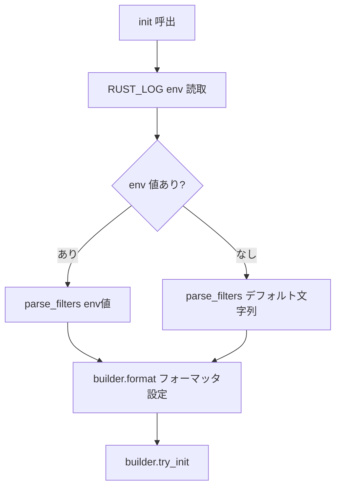

# logging.rs RUST_LOG プロセス env 汚染の解消 - 要件定義書

## 1. 概要

### 1.1 背景

`src-tauri/src/logging.rs` の `init()` がデフォルトログフィルタを設定する際、`std::env::set_var("RUST_LOG", ...)` でプロセス環境変数を直接書き換えている。

```rust
if std::env::var_os("RUST_LOG").is_none() {
    unsafe {
        std::env::set_var(
            "RUST_LOG",
            "info,wgpu=warn,wgpu_core=warn,wgpu_hal=warn,naga=warn",
        );
    }
}
```

その後 `Builder::from_env(...)` でこの env を読んでフィルタを構築している。

問題: プロセス env はその後 `portable-pty` で spawn される子プロセス（pwsh / bash 等）に継承され、子側の `env_logger` ベースのツール（具体的には `fnm`）がこの `RUST_LOG=info,...` を拾ってしまい、PowerShell 起動時に意図しない INFO ログを表示する:

```
INFO  fnm::version_files .nvmrc. exists? false
INFO  fnm::version_files .node-version. exists? false
INFO  fnm::version_files package.json. exists? false
```

`pty/mod.rs:176-179` の child env から削除しているのは `EMTERM_MUX` / `EMTERM_MUX_SOCKET` / `TMUX` / `TMUX_PANE` のみで、`RUST_LOG` は素通り。

### 1.2 目的

eMterm の logger 初期化が **プロセス env を汚染しない** よう変更し、子プロセスに不要な `RUST_LOG=info,...` が継承されないようにする。

### 1.3 スコープ

**対象:**
- `src-tauri/src/logging.rs::init()` のフィルタ設定方式の変更
- 既存の動作（default = `info` + wgpu/naga = `warn`、ユーザ `RUST_LOG` 上書き）を保持
- フィルタ解決ロジックのユニットテスト

**対象外:**
- `pty/mod.rs` の child env_remove リスト変更（採用案 (a) では不要。`RUST_LOG` を意図的にユーザが設定したら子へ伝播してもよい）
- 他のログ機構（`BackendLogger` など）の変更
- `console.warn` 等のフロントエンド側ログ転送パスの変更

## 2. ビジネス要件

### 2.1 ビジネス目標

Windows ユーザが eMterm + pwsh + fnm 環境で起動するたびにノイズメッセージを見る状態を解消し、UX を改善する。

### 2.2 対象ユーザー

| ユーザータイプ | 説明 |
|----------------|------|
| Windows + fnm ユーザ | pwsh 起動時に fnm の hook が走り、INFO メッセージが表示される |
| 他の env_logger ベースのツールを使うユーザ | RUST_LOG 継承で意図せず verbose ログが出る可能性がある全ユーザ |

### 2.3 期待される効果

- Windows pwsh 起動時のノイズ表示が消える
- 子プロセス（pwsh / bash / ssh など）の env が eMterm 由来の値で汚れなくなる
- `unsafe` ブロックが 1 つ減る（保守性向上）

## 3. ユースケース

### 3.1 ユースケース一覧

| ID | ユースケース名 | アクター | 優先度 |
|----|----------------|----------|--------|
| UC01 | eMterm 通常起動時に子プロセスへ RUST_LOG が漏れない | Windows ターミナルユーザ | 高 |
| UC02 | ユーザが明示的に RUST_LOG=debug を設定したときは子へ伝播する | デバッグ作業中のユーザ | 中 |
| UC03 | eMterm 自身のログ出力（warn/error）が emterm.log に記録される | 全ユーザ | 高（リグレッション防止） |

### 3.2 ユースケース詳細

#### UC01: 通常起動時、子プロセスに RUST_LOG が漏れない

**アクター**: Windows ターミナルユーザ

**事前条件**:
- ユーザは `RUST_LOG` 環境変数を設定していない
- pwsh PROFILE で fnm の `--use-on-cd` フックが有効

**基本フロー**:
1. ユーザが eMterm を起動
2. eMterm の `logging::init()` が呼ばれる
3. プロセス env の `RUST_LOG` は **書き換えない**（in-process フィルタ設定のみ）
4. ユーザがタブを開き pwsh が spawn される
5. pwsh の env には `RUST_LOG` が存在しない
6. fnm が起動しても env_logger のデフォルト動作（典型的には off / error）になり、INFO メッセージは出ない

**事後条件**:
- pwsh 起動メッセージ領域に fnm INFO ログが表示されない

#### UC02: ユーザが RUST_LOG=debug を明示設定

**アクター**: デバッグ作業中のユーザ

**事前条件**:
- 起動時に `RUST_LOG=debug emterm` のような起動

**基本フロー**:
1. eMterm が起動、env の `RUST_LOG=debug` が読まれる
2. `logging::init()` が in-process filter に `debug` を適用
3. eMterm 自身は debug レベルでログを出力
4. ユーザがタブを開き pwsh が spawn される
5. pwsh の env には `RUST_LOG=debug` が引き続き存在（ユーザの明示意図）
6. fnm も debug レベルで動作

**事後条件**:
- eMterm + 子プロセスとも debug level でログ出力（ユーザが望んだ通り）

#### UC03: eMterm 自身のログ出力維持

**アクター**: 全ユーザ

**事前条件**:
- リリースビルドで warn 以上は `emterm.log` に永続化される設定

**基本フロー**:
1. eMterm 起動
2. `logging::init()` が in-process filter とカスタムフォーマット (`[LEVEL][NATIVE-POC] ...`) を設定
3. アプリ実行中に `log::warn!()` / `log::error!()` が出力される
4. リリースビルドではこれらが `emterm.log` にも書き出される

**事後条件**:
- 既存の log フォーマット・出力先・永続化動作が完全に維持される

## 4. 機能要件

### 4.1 機能一覧

| ID | 機能名 | 説明 | 優先度 |
|----|--------|------|--------|
| F01 | logger 初期化からプロセス env への書き込みを除去 | `std::env::set_var("RUST_LOG", ...)` を削除 | 高 |
| F02 | in-process filter resolution | RUST_LOG が設定されていればそれを、なければデフォルト文字列を Builder に渡す | 高 |
| F03 | filter resolution の純関数化 | テスト可能な形でフィルタ文字列決定ロジックを抽出 | 中 |
| F04 | フィルタ resolution のユニットテスト | env 設定有無で正しい文字列が返ることを検証 | 中 |
| F05 | 既存ログ動作維持 | フォーマット・log file 書き出し・once-init guard を維持 | 高 |

### 4.2 機能詳細

#### F01: プロセス env 書き込み除去

**説明**: `logging.rs::init()` から `unsafe { std::env::set_var("RUST_LOG", ...) }` ブロック全体を削除。`#[allow(unsafe_op_in_unsafe_fn)]` 等の関連 attribute も合わせて整理する。

**ビジネスルール**:
- `unsafe` ブロックは削除（プロセス env を書き換えなくなるため不要）
- 「single-threaded startup path で env を書く」というコメントも陳腐化するため削除

#### F02: in-process filter resolution

**説明**: env_logger の `Builder::new()` + `parse_filters()` を使い、in-process でフィルタを設定する。プロセス env には触れない。

**入力**:
- `std::env::var("RUST_LOG").ok()`: ユーザ指定フィルタ文字列（存在すれば）

**出力**:
- `env_logger::Builder` インスタンス: フィルタ設定済み

**処理フロー**:



#### F03: filter resolution の純関数化

**説明**: env を読んで「最終的にビルダーに渡すフィルタ文字列」を返す pure な helper を作る:

```
fn resolved_filters(env_value: Option<&str>) -> String
    Precondition: any Option<&str> input
    Postcondition:
      - Some(s) -> s.to_string()
      - None -> "info,wgpu=warn,wgpu_core=warn,wgpu_hal=warn,naga=warn"
```

これにより F04 のユニットテストが書ける。`init()` 本体は副作用込みなのでテストしにくいが、純関数だけは決定的にテストできる。

#### F04: ユニットテスト

**説明**: `resolved_filters` の挙動をテスト:

| ケース | 入力 | 期待出力 |
|--------|------|----------|
| env 未設定 | `None` | デフォルト文字列 |
| env=空文字 | `Some("")` | `""`（env 値をそのまま返す。env_logger 側で空 = off と解釈される） |
| env=debug | `Some("debug")` | `"debug"` |
| env=モジュール指定 | `Some("wgpu_core=info")` | `"wgpu_core=info"` |

#### F05: 既存ログ動作維持

**説明**:
- `INIT.call_once` による once-init guard を維持
- `builder.format` で `[LEVEL][NATIVE-POC] ...` カスタムフォーマット維持
- リリースビルド時の `warn` 以上を `emterm.log` に書き出す処理維持
- フロントエンド `console.warn` 等の forward 経路は変更しない（別モジュール）

## 5. 非機能要件

### 5.1 パフォーマンス要件

- 起動時のロガー初期化コスト: 変更前後で同等（env への書き込みが 1 回減る分わずかに高速化）
- ログ出力時のコスト: 変更なし

### 5.2 セキュリティ要件

該当なし（ローカルプロセスの env 管理のみ）。

### 5.3 可用性要件

該当なし。

### 5.4 保守性要件

- `unsafe` ブロックが 1 つ減る
- pure な `resolved_filters` 関数によりフィルタ決定ロジックの責務が明確化
- 既存のドキュメンテーションコメント（`init()` 上）を最新化する

### 5.5 互換性要件

| 環境 | 想定挙動 |
|------|----------|
| Linux + 通常起動 | RUST_LOG が child に漏れない（fnm INFO 漏れもなくなる） |
| Windows + pwsh + fnm | RUST_LOG が child に漏れない、fnm INFO 漏れ解消 |
| ユーザが `RUST_LOG=debug` を明示設定 | 既存通り（debug level でログ出力。child にも継承される。これはユーザの明示意図） |
| 既存の env_logger 互換のフィルタ文法 | すべて互換維持（同じ env_logger を経由） |

## 6. UI/UX要件

該当なし（バックエンドのロガー初期化のみ）。

## 7. データ要件

該当なし（永続化データなし）。

## 8. 外部連携

該当なし。

## 9. 制約条件

### 9.1 技術的制約

- `env_logger` クレートを継続使用する前提
- `log` クレートの global logger は他箇所で初期化されていない（`INIT.call_once` で唯一）

### 9.2 ビジネス上の制約

特になし

### 9.3 スケジュール制約

特になし

## 10. 想定される課題とリスク

### 10.1 技術的課題

| 課題 | 影響度 | 対応策 |
|------|--------|--------|
| `env_logger::Builder::parse_filters` の挙動が `Env::default().default_filter_or` と微妙に異なる可能性 | 低 | env_logger のドキュメント / ソースで挙動が同等であることを確認。差異があれば回帰テストで検出 |
| 他モジュールで `std::env::var("RUST_LOG")` を直接読んでいる箇所がある可能性 | 低 | 実装フェーズで grep。あれば影響評価 |

### 10.2 ビジネスリスク

なし（バグ修正タスク）。

## 11. 成功基準

### 11.1 受け入れ基準

- [ ] `logging.rs::init()` から `std::env::set_var` の呼び出しが消える
- [ ] `unsafe` ブロックが 1 つ減る（純減）
- [ ] `resolved_filters` ユニットテストが追加され pass する
- [ ] eMterm 自身のログ出力（[LEVEL][NATIVE-POC] フォーマット、release build での warn 永続化）が変更前と同じ
- [ ] Windows pwsh + fnm 環境で起動メッセージから fnm の INFO 行が消える（手動検証）
- [ ] `cargo test --lib` が全 pass
- [ ] `cargo check` / `cargo check --no-default-features` が pass

### 11.2 KPI

該当なし（バグ修正タスク）。

## 12. テストシナリオ

### 12.1 テスト観点

- [x] 正常系: `resolved_filters(None)` がデフォルト文字列を返す
- [x] 正常系: `resolved_filters(Some("debug"))` が `"debug"` を返す
- [x] 正常系: `resolved_filters(Some(""))` が `""` を返す
- [x] 正常系: `resolved_filters(Some("wgpu_core=info"))` がモジュール指定をそのまま返す
- [ ] 正常系（実機）: Linux で eMterm 起動 → 別 shell から `cat /proc/<PID>/environ` 相当で `RUST_LOG` が無いことを確認、または起動した eMterm の中の pwsh 等でも `echo $env:RUST_LOG` が空であること
- [ ] 正常系（実機）: Windows で eMterm + pwsh + fnm hook 環境で起動して fnm の INFO 行が出ないことを確認

## 13. 用語定義

| 用語 | 定義 |
|------|------|
| RUST_LOG | env_logger / pretty_env_logger が読み込む環境変数。フィルタ文字列を保持する |
| env_logger | Rust の log facade 実装の一つ。Cargo クレート |
| in-process filter | プロセス env を経由せず、ロガーインスタンス内部に保持されるフィルタ |
| Builder::parse_filters | env_logger のビルダー API。文字列をフィルタとして解釈してビルダーに登録する |
| Builder::from_env | env を読んでフィルタを構築するビルダー API（現状実装で使用中） |

## 14. 確認事項

### 14.1 確認済み事項

- [x] 修正方針: 案 (a) — Builder::parse_filters に切り替えてプロセス env への書き込みを排除（env_remove は併用しない）
- [x] feature 名: logging-rust-log-isolation
- [x] 元レポート: tmp/issues-windows-mux-2026-06-22.md の問題 4 (fnm INFO 漏れ)

### 14.2 未確認・保留事項

なし。

## 15. 参考資料

- `tmp/issues-windows-mux-2026-06-22.md` - 元レポート
- `src-tauri/src/logging.rs:171-213` - 既存 `init()` 実装
- `src-tauri/src/pty/mod.rs:162-179` - 子プロセスへの env 設定（env_remove リスト）
- env_logger crate documentation: `Builder::parse_filters`, `Builder::from_env`
