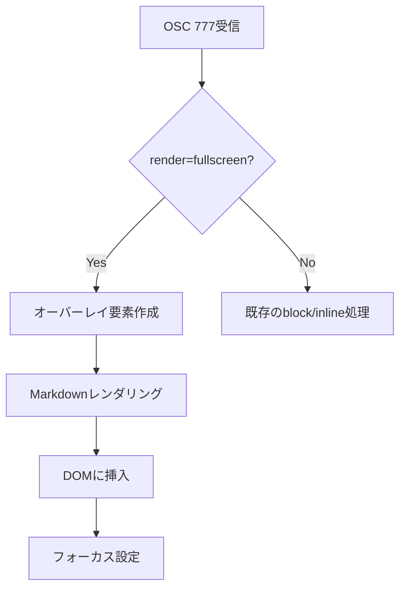
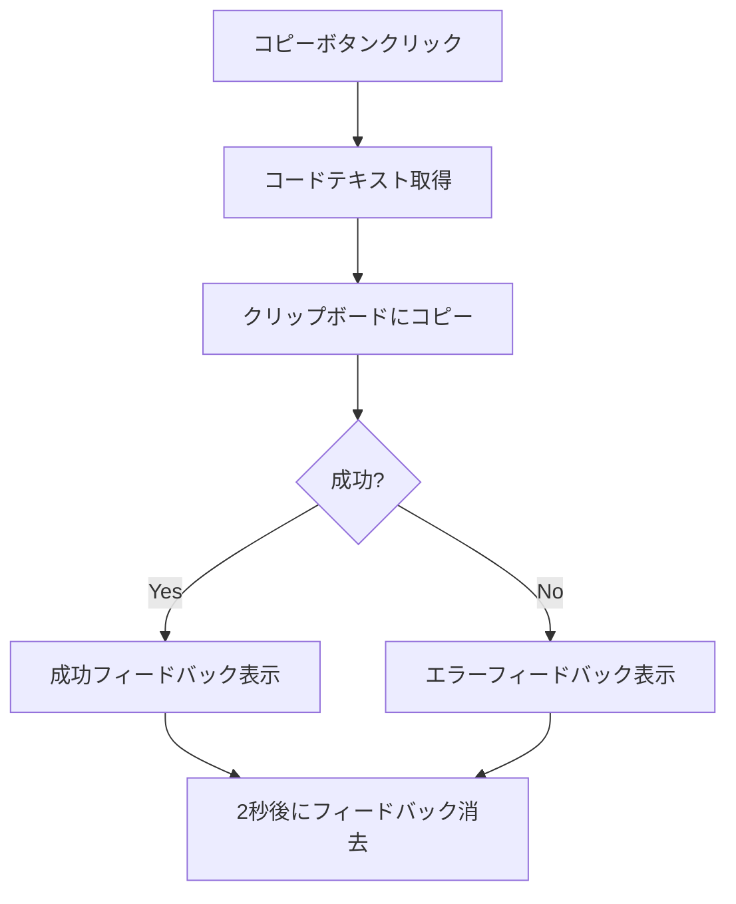
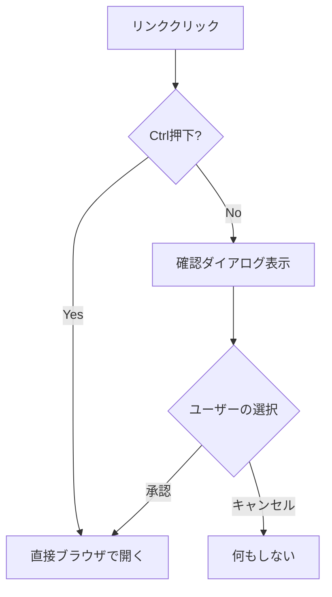
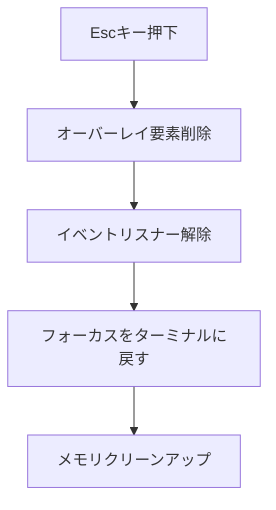

# Markdown全画面表示機能 - 要件定義書

## 1. 概要

### 1.1 背景
eMtermは既にOSC 777拡張によるMarkdownのインライン表示機能を実装している。しかし、長文ドキュメントや詳細な技術文書を閲覧する際には、ターミナル出力と混在せず、ドキュメントに集中できる全画面表示モードが求められている。

### 1.2 目的
- Markdownコンテンツを全画面で表示し、快適な閲覧体験を提供する
- スクロール・ナビゲーション機能により長文ドキュメントの閲覧を容易にする
- コードブロックのコピーやリンクのオープンなど、インタラクティブな操作を可能にする
- 既存のMarkdown表示機能との整合性を保ちながら新しい表示モードを追加する

### 1.3 スコープ
- OSC 777プロトコルの拡張（新しいrenderモードの追加）
- 全画面オーバーレイUIの実装
- スクロール・ナビゲーション機能の実装
- コードブロックコピー機能の実装
- リンククリック時の確認・オープン機能の実装

## 2. ビジネス要件

### 2.1 ビジネス目標
- ターミナル上でのドキュメント閲覧体験を向上させる
- CLIツールやスクリプトからのヘルプ・ドキュメント表示をリッチにする
- 開発者の生産性向上に貢献する

### 2.2 対象ユーザー
| ユーザータイプ | 説明 |
|----------------|------|
| 開発者 | CLIツールのヘルプやREADMEを閲覧するユーザー |
| システム管理者 | ドキュメントやログをMarkdown形式で確認するユーザー |
| CLIツール開発者 | 自身のツールにリッチなドキュメント表示を組み込みたいユーザー |

### 2.3 期待される効果
- ターミナル上でのドキュメント閲覧時間の短縮
- 外部エディタ・ブラウザへの切り替え頻度の削減
- CLIツールのユーザビリティ向上

## 3. ユースケース

### 3.1 ユースケース一覧
| ID | ユースケース名 | アクター | 優先度 |
|----|----------------|----------|--------|
| UC01 | Markdownの全画面表示 | ユーザー | 高 |
| UC02 | ドキュメントのスクロール | ユーザー | 高 |
| UC03 | コードブロックのコピー | ユーザー | 高 |
| UC04 | テキスト選択によるコピー | ユーザー | 高 |
| UC05 | 外部リンクのオープン | ユーザー | 高 |
| UC06 | 全画面表示の終了 | ユーザー | 高 |

### 3.2 ユースケース詳細

#### UC01: Markdownの全画面表示

**アクター**: ユーザー

**事前条件**:
- eMtermが起動している
- CLIツールまたはスクリプトがOSC 777シーケンスを出力する

**基本フロー**:
1. CLIツールがOSC 777シーケンスを出力（render=fullscreen）
2. eMtermがシーケンスを解析
3. 全画面オーバーレイが表示される
4. Markdownコンテンツがレンダリングされる

**代替フロー**:
- 無効なMarkdownの場合: 生テキストとしてフォールバック表示

**事後条件**:
- 全画面でMarkdownが表示されている
- ターミナル出力は背面に隠れている

#### UC02: ドキュメントのスクロール

**アクター**: ユーザー

**事前条件**:
- 全画面表示モードがアクティブ
- ドキュメントが表示領域を超えている

**基本フロー**:
1. ユーザーがマウスホイールを操作
2. ドキュメントがスクロールする
3. スクロールバーが位置を反映する

**代替フロー**:
- キーボード操作: 上下矢印キー、Page Up/Down、Home/Endで同様にスクロール

**事後条件**:
- 表示位置が更新されている

#### UC03: コードブロックのコピー

**アクター**: ユーザー

**事前条件**:
- 全画面表示モードがアクティブ
- コードブロックが表示されている

**基本フロー**:
1. ユーザーがコードブロックのコピーボタンをクリック
2. コードブロックの内容がクリップボードにコピーされる
3. 視覚的フィードバックが表示される

**事後条件**:
- クリップボードにコードが格納されている

#### UC04: テキスト選択によるコピー

**アクター**: ユーザー

**事前条件**:
- 全画面表示モードがアクティブ

**基本フロー**:
1. ユーザーがテキストをドラッグして選択
2. ユーザーがCtrl+C（またはCmd+C）を押す
3. 選択テキストがクリップボードにコピーされる

**事後条件**:
- 選択テキストがクリップボードに格納されている

#### UC05: 外部リンクのオープン

**アクター**: ユーザー

**事前条件**:
- 全画面表示モードがアクティブ
- リンクが表示されている

**基本フロー（通常クリック）**:
1. ユーザーがリンクをクリック
2. 確認ポップアップが表示される
3. ユーザーが承認する
4. 外部ブラウザでリンクが開く

**代替フロー（Ctrl+クリック）**:
1. ユーザーがCtrlキーを押しながらリンクをクリック
2. 確認なしで即座に外部ブラウザでリンクが開く

**事後条件**:
- 外部ブラウザでリンク先が表示されている

#### UC06: 全画面表示の終了

**アクター**: ユーザー

**事前条件**:
- 全画面表示モードがアクティブ

**基本フロー**:
1. ユーザーがEscキーを押す
2. 全画面オーバーレイが閉じる
3. Markdownコンテンツが完全に消去される
4. ターミナルが元の状態に戻る

**事後条件**:
- ターミナルが通常表示に戻っている
- Markdownオーバーレイが消去されている

## 4. 機能要件

### 4.1 機能一覧
| ID | 機能名 | 説明 | 優先度 |
|----|--------|------|--------|
| F01 | 全画面オーバーレイ表示 | ターミナル画面全体にMarkdownを表示 | 高 |
| F02 | スクロール機能 | マウスとキーボードによるスクロール | 高 |
| F03 | スクロールバー表示 | 常時表示されるスクロールバー | 高 |
| F04 | コードブロックコピーボタン | クリックでコードをコピー | 高 |
| F05 | テキスト選択コピー | 通常のテキスト選択とコピー | 高 |
| F06 | リンク確認ダイアログ | 外部リンククリック時の確認 | 高 |
| F07 | Ctrl+クリックによる直接オープン | 確認スキップ機能 | 高 |
| F08 | Escキーによる終了 | 全画面表示の終了 | 高 |
| F09 | テーマ連動 | ターミナルテーマとの色同期 | 中 |

### 4.2 機能詳細

#### F01: 全画面オーバーレイ表示

**説明**: ターミナルウィンドウ全体を覆うオーバーレイレイヤーにMarkdownコンテンツを表示する。

**入力**:
- markdown: string - Markdownコンテンツ
- format: "commonmark" | "gfm" - Markdownフォーマット

**出力**:
- 全画面オーバーレイUI

**処理フロー**:


**ビジネスルール**:
- オーバーレイはターミナル画面全体を覆う（z-index最前面）
- 背景のターミナル出力は隠れるが、状態は保持される
- 複数の全画面表示を重ねることはできない（新しいものが前のものを置き換える）

#### F02: スクロール機能

**説明**: マウスとキーボードの両方でドキュメントをスクロールできる。

**操作方法**:
| 操作 | 動作 |
|------|------|
| マウスホイール | 通常スクロール |
| 上下矢印キー | 1行ずつスクロール |
| Page Up/Down | 1ページずつスクロール |
| Home | ドキュメント先頭へ |
| End | ドキュメント末尾へ |

**ビジネスルール**:
- スクロールはスムーズに行われる（CSS scroll-behavior）
- キーボード操作が優先される（ターミナル入力を横取りしない）

#### F03: スクロールバー表示

**説明**: 常時表示されるスクロールバーで現在位置を示す。

**ビジネスルール**:
- スクロールバーは常に表示（overflow-y: scroll相当）
- ドラッグによる直接スクロールが可能
- スタイルはターミナルテーマに合わせる

#### F04: コードブロックコピーボタン

**説明**: コードブロックの右上にコピーボタンを表示し、クリックでコードをコピーする。

**処理フロー**:


**ビジネスルール**:
- ボタンはホバー時に表示、または常時表示
- コピー成功時は「Copied!」などの視覚的フィードバック
- シンタックスハイライトされたコードではなく、生のテキストをコピー

#### F05: テキスト選択コピー

**説明**: 通常のテキスト選択によるコピー操作をサポートする。

**ビジネスルール**:
- ブラウザ標準のテキスト選択動作
- Ctrl+C（Cmd+C）でコピー
- 選択範囲のスタイルはテーマに合わせる

#### F06: リンク確認ダイアログ

**説明**: 外部リンクをクリックした際に確認ダイアログを表示する。

**処理フロー**:


**ダイアログ内容**:
- タイトル: 「外部リンクを開きますか？」
- 本文: リンクURL
- ボタン: 「開く」「キャンセル」

#### F07: Ctrl+クリックによる直接オープン

**説明**: Ctrlキーを押しながらリンクをクリックすると確認なしで開く。

**ビジネスルール**:
- パワーユーザー向けのショートカット
- macOSではCmd+クリックも対応

#### F08: Escキーによる終了

**説明**: Escキーで全画面表示を終了し、ターミナルを元の状態に戻す。

**処理フロー**:


**ビジネスルール**:
- Escキーは最優先で処理される
- 確認なしで即座に閉じる
- Markdownコンテンツは完全に消去される（履歴には残らない）

## 5. 非機能要件

### 5.1 パフォーマンス要件
- 全画面表示の開始: < 100ms（1KB以下のMarkdown）
- スクロール: 60fps維持
- メモリ使用量: 既存のセッション制限に準拠（2MB/セッション）

### 5.2 セキュリティ要件
- XSS防止: 既存のDOMPurify設定を継続使用
- リンク: 外部リンクは確認ダイアログまたはCtrl+クリックを要求
- スクリプト実行: 一切禁止

### 5.3 可用性要件
- エラー時のフォールバック: 生テキスト表示
- 異常終了時: ターミナルが使用可能な状態に戻る

### 5.4 保守性要件
- コンポーネント分離: 全画面表示は独立したモジュールとして実装
- テスト: ユニットテスト・統合テストを含む

### 5.5 互換性要件
- 既存のMarkdown表示機能（inline, block）との共存
- 既存のOSC 777プロトコルとの後方互換性

## 6. UI/UX要件

### 6.1 画面設計要件
- 全画面オーバーレイ: 背景は半透明または不透明
- Markdownコンテンツ: 中央配置、適切な余白
- スクロールバー: 右端に常時表示
- コードブロック: コピーボタンを右上に配置

### 6.2 キーボード操作
| キー | 動作 |
|------|------|
| Esc | 全画面表示を閉じる |
| 上/下矢印 | 1行スクロール |
| Page Up/Down | 1ページスクロール |
| Home | 先頭へ |
| End | 末尾へ |
| Ctrl+C | テキストコピー |

### 6.3 レスポンシブ対応
- ウィンドウリサイズに追従
- 最小幅での表示を考慮

## 7. データ要件

### 7.1 データフロー
```mermaid
sequenceDiagram
    participant CLI as CLIツール
    participant PTY as PTY
    participant Backend as Rust Backend
    participant Frontend as TypeScript Frontend
    participant DOM as DOM

    CLI->>PTY: OSC 777;emterm;markdown;...
    PTY->>Backend: バイトストリーム
    Backend->>Backend: ANSIパース
    Backend->>Frontend: IPC Event (EmtermExtension)
    Frontend->>Frontend: セッション管理
    Frontend->>Frontend: Markdownレンダリング
    Frontend->>DOM: 全画面オーバーレイ挿入
```

### 7.2 新規パラメータ
| パラメータ | 値 | 説明 |
|-----------|-----|------|
| render | fullscreen | 全画面表示モード |

## 8. 外部連携

### 8.1 連携システム
| システム名 | 連携方法 | データ |
|------------|----------|--------|
| 外部ブラウザ | Tauri shell.open | URL |
| クリップボード | Tauri clipboard plugin | テキスト |

## 9. 制約条件

### 9.1 技術的制約
- Tauriの制約内で実装
- 既存のMarkdownレンダリング基盤を再利用

### 9.2 ビジネス上の制約
- 既存機能を壊さない
- 後方互換性を維持

## 10. 想定される課題とリスク

### 10.1 技術的課題
| 課題 | 影響度 | 対応策 |
|------|--------|--------|
| 長文ドキュメントのパフォーマンス | 中 | 仮想スクロール検討 |
| キーボードイベントの競合 | 中 | イベント伝播の適切な制御 |

### 10.2 ビジネスリスク
| リスク | 発生確率 | 影響度 | 対応策 |
|--------|----------|--------|--------|
| 既存機能への影響 | 低 | 高 | 十分なテスト |

## 11. 成功基準

### 11.1 受け入れ基準
- [ ] OSC 777でrender=fullscreenを指定すると全画面表示される
- [ ] Escキーで閉じてターミナルが元の状態に戻る
- [ ] マウスホイールでスクロールできる
- [ ] キーボード（矢印、Page Up/Down、Home/End）でスクロールできる
- [ ] スクロールバーが常に表示される
- [ ] コードブロックのコピーボタンが機能する
- [ ] テキスト選択によるコピーが機能する
- [ ] リンクのクリックで確認ダイアログが表示される
- [ ] Ctrl+クリックで確認なしにリンクが開く
- [ ] 既存のinline/blockモードが影響を受けない

### 11.2 KPI
| 指標 | 目標値 | 測定方法 |
|------|--------|----------|
| 表示開始時間 | < 100ms | パフォーマンステスト |
| スクロールFPS | >= 60fps | パフォーマンステスト |

## 12. テストシナリオ

### 12.1 テスト観点
- [ ] 正常系: 基本的な全画面表示とスクロール
- [ ] 正常系: コードブロックのコピー
- [ ] 正常系: リンクのクリック（確認あり・なし）
- [ ] 正常系: Escキーによる終了
- [ ] 異常系: 不正なMarkdownの表示
- [ ] 境界値: 空のMarkdown
- [ ] 境界値: 非常に長いドキュメント
- [ ] セキュリティ: XSS攻撃の防止
- [ ] パフォーマンス: 大きなドキュメントの表示速度

## 13. 用語定義

| 用語 | 定義 |
|------|------|
| 全画面表示 | ターミナル画面全体を覆うオーバーレイ表示モード |
| OSC 777 | eMterm独自の拡張制御シーケンス |
| render mode | Markdownの表示モード（inline, block, fullscreen） |

## 14. 確認事項

### 14.1 確認済み事項
- [x] 表示モード: 全画面表示（ターミナル画面全体にMarkdown表示）
- [x] 終了方法: Escキーで閉じる
- [x] 終了後の動作: Markdownを完全消去し、ターミナルを元の状態に戻す
- [x] スクロール操作: マウス＋キーボード両対応
  - マウスホイール
  - 上下矢印キー
  - Page Up/Down
  - Home/End
- [x] スクロールバー: 常に表示
- [x] コードブロック: コピーボタン付き（クリックでクリップボードにコピー）
- [x] テキスト選択: 通常のテキスト選択によるコピーが可能
- [x] リンク動作:
  - 通常クリック: 確認ポップアップ表示後、承認で外部ブラウザで開く
  - Ctrl+クリック: 確認なしに直接外部ブラウザで開く

### 14.2 未確認・保留事項
- [ ] 全画面表示時のヘッダー/フッターの有無
- [ ] 閉じるボタン（X）の必要性
- [ ] ダークモード/ライトモードの自動切り替え

## 15. 参考資料

- 既存仕様書: doc/tasks/markdown-display/SPEC.md
- OSC制御シーケンス: https://invisible-island.net/xterm/ctlseqs/ctlseqs.html
- DOMPurify: https://github.com/cure53/DOMPurify
- marked: https://marked.js.org/
