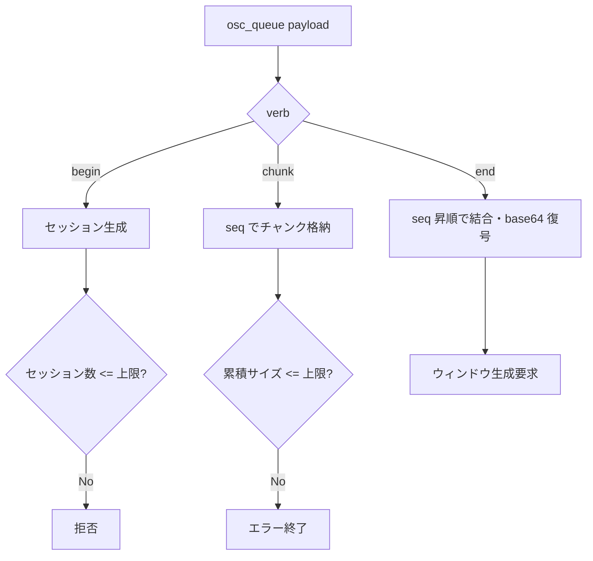
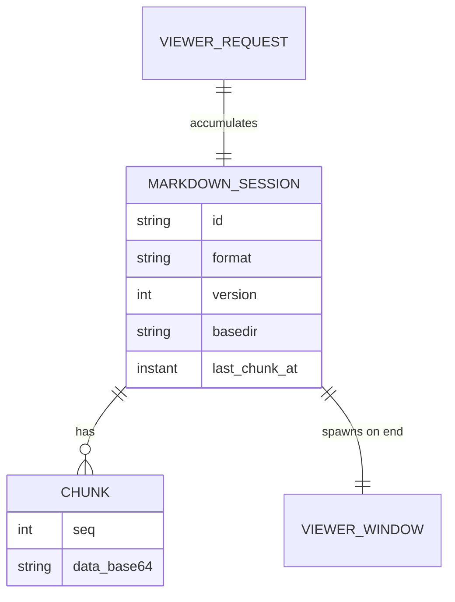

# Markdown ビューア native-poc 移植（Wry ウィンドウ） - 要件定義書

## 1. 概要

### 1.1 背景

native-poc では Markdown ビューアが未実装（Phase 6 スタブ）である。`native-poc/src/viewer/markdown.rs`・`viewer/mod.rs` はコメントのみで描画する実体がない。OSC 777 `emterm;markdown;…` は `native-poc/src/callbacks.rs` が `osc_queue`（`EmtermOscRequest{payload}`）へ raw 蓄積するところまでは実装済みだが、キューをドレインして表示する `ViewerSpawner` が存在しない。

WebView 版（`src/markdown`、`src/data-viewer`、`src/image-viewer`）はモノリシックなアプリバンドルにオーバーレイとして同梱されており、native-poc には移植されていない。

### 1.2 目的

native-poc に Markdown ビューアを移植する。描画方式は **Wry（WebView）別ウィンドウ**とし、既存 WebView 版 Markdown レンダラを移植して mermaid・シンタックスハイライト・テーマ・フォントのフィデリティを維持する。あわせて Markdown ビューア設定7項目を native-poc の設定ローダーへ取り込み、ビューアウィンドウへ反映する。

### 1.3 スコープ

**本タスクの対象:**

- ビューア起動基盤 `ViewerSpawner`（`osc_queue` ドレイン → ビューア種別ルーティング → Wry ウィンドウ生成）
- Markdown ビューア（OSC 777 `emterm;markdown` の `begin`/`chunk`/`end` セッション集約 → Wry ウィンドウ表示）
- native-poc 専用ビューアバンドル（`src/markdown` を流用したスタンドアロン HTML/JS/CSS、バイナリ同梱）
- Markdown 設定7項目の取得とビューアウィンドウへの反映
- リンククリックのハンドリング（`is_safe_uri` チェック後に OS で開く）
- インライン画像（base64 data URI、`basedir` 相対のローカルファイル参照）

**本タスクの対象外（後続 feature）:**

- 画像ビューア（`src/image-viewer`）の Wry 移植
- JSON/YAML ビューア（`src/data-viewer`）の Wry 移植
- WebView(src/) 側の変更（[[project_native_poc_branch_policy]]：当ブランチでは src/ を変更しない）

`ViewerSpawner` 基盤は image/json/yaml の各ビューアを後続で追加できるよう、種別ルーティング点を確保した設計とする。

## 2. ビジネス要件

### 2.1 ビジネス目標

native-poc の機能パリティを WebView 版へ近づける。Markdown ビューアは eMterm のリッチコンテンツ表示という中核機能であり、native-poc が PoC の Go/No-Go 基準（機能パリティ＋パフォーマンス）を満たすために必須。

### 2.2 対象ユーザー

| ユーザータイプ | 説明 |
|----------------|------|
| ターミナル利用者 | `emterm markdown` CLI 等で Markdown 表示を発行し、レンダリング結果を閲覧する |
| AI コーディングツール（Claude Code 等） | OSC 777 経由で Markdown を表示し、整形済みドキュメントを提示する |

### 2.3 期待される効果

- native-poc 単体で Markdown のリッチ表示が可能になる
- WebView 版と同等の表示（mermaid・コードハイライト・テーマ・フォント）を維持
- Markdown 設定7項目が native-poc で有効になる

## 3. ユースケース

### 3.1 ユースケース一覧

| ID | ユースケース名 | アクター | 優先度 |
|----|----------------|----------|--------|
| UC01 | Markdown を表示する | ターミナル利用者 / AI ツール | 高 |
| UC02 | 表示中の Markdown 内リンクを開く | ターミナル利用者 | 中 |
| UC03 | Markdown 内のインライン画像を表示する | ターミナル利用者 | 中 |
| UC04 | ビューアウィンドウを閉じる | ターミナル利用者 | 高 |
| UC05 | 設定で Markdown 表示の見た目を変更する | ターミナル利用者 | 中 |

### 3.2 ユースケース詳細

#### UC01: Markdown を表示する

**アクター**: ターミナル利用者 / AI ツール

**事前条件**:
- native-poc が起動している
- 端末上で OSC 777 `emterm;markdown` シーケンスが発行される

**基本フロー**:
1. 送信側が `markdown;begin;id=<uuid>;format=gfm` を発行する
2. 送信側が `markdown;chunk;id=<uuid>;seq=<n>;data=<base64>` を1回以上発行する
3. 送信側が `markdown;end;id=<uuid>` を発行する
4. native-poc がセッションを完了させ、復号した Markdown 全文で Wry ウィンドウを生成する
5. ウィンドウが Markdown をレンダリングして表示する

**代替フロー**:
- セッションが 30 秒以内に `end` まで到達しない場合、セッションを破棄する
- 同時アクティブセッションが上限（10）を超える場合、新規 `begin` を拒否する
- 累積データがサイズ上限を超える場合、セッションをエラー終了する

**事後条件**:
- Markdown が別ウィンドウで表示される

#### UC02: 表示中の Markdown 内リンクを開く

**基本フロー**:
1. 利用者がレンダリング結果のリンクをクリックする
2. ビューアウィンドウ内のナビゲーションを横取りする
3. URI を `is_safe_uri`（http/https/mailto/ssh のみ許可）で検証する
4. 許可された URI を OS のハンドラ（Linux=`xdg-open` / Windows=`cmd /c start`）で開く
5. ウィンドウ内ナビゲーションは抑止する（ページ遷移しない）

**代替フロー**:
- `is_safe_uri` が許可しない URI は開かず警告ログを出力する

#### UC03: Markdown 内のインライン画像を表示する

**基本フロー**:
1. Markdown が画像を参照する（base64 data URI または `basedir` 相対パス）
2. data URI は MIME 許可リスト検証後にそのまま描画する（SVG は除外）
3. ローカルファイル参照は `basedir` を基点に解決し、native-poc が画像バイト列を供給して描画する

**事後条件**:
- 許可された画像が表示される。不許可・未解決の画像は代替表示（壊れ画像）とする

#### UC04: ビューアウィンドウを閉じる

**基本フロー**:
1. 利用者がウィンドウの閉じるボタン、`Esc`、または `q` を押す
2. Wry ウィンドウを破棄する
3. ターミナルウィンドウは影響を受けない

#### UC05: 設定で Markdown 表示の見た目を変更する

**基本フロー**:
1. 利用者が設定ファイルで Markdown 設定（テーマ追従・テーマ・プリセット・本文/コード/絵文字フォント・フォントサイズ）を変更する
2. native-poc が設定をロードする
3. 以降に生成されるビューアウィンドウへ設定を反映する

## 4. 機能要件

### 4.1 機能一覧

| ID | 機能名 | 説明 | 優先度 |
|----|--------|------|--------|
| F01 | ViewerSpawner 基盤 | `osc_queue` をドレインし、ビューア種別でルーティングする | 高 |
| F02 | Markdown OSC セッション集約 | `begin`/`chunk`/`end` を集約し Markdown 全文を復元する | 高 |
| F03 | Wry ウィンドウ生成 | 完了したセッションごとに別ウィンドウを生成する | 高 |
| F04 | 専用ビューアバンドル | `src/markdown` を流用したスタンドアロンバンドルを同梱・配信する | 高 |
| F05 | Markdown レンダリングパリティ | 基本記法＋テーブル＋ハイライト＋mermaid＋インライン画像＋アウトライン | 高 |
| F06 | Markdown 設定7項目の反映 | 設定取得とビューアウィンドウへの注入 | 中 |
| F07 | リンクハンドリング | `is_safe_uri` 後に OS で開く／ウィンドウ内遷移を抑止 | 中 |
| F08 | インライン画像解決 | data URI 直描画／`basedir` 相対のローカルファイル供給 | 中 |
| F09 | ウィンドウ操作 | 閉じるボタン／`Esc`／`q` で破棄、ページ内スクロール | 中 |

### 4.2 機能詳細

#### F02: Markdown OSC セッション集約

**説明**: OSC 777 `emterm;markdown` の `begin`/`chunk`/`end` を集約し、Markdown 全文を復元する。WebView 版 `MarkdownSessionManager` のセッション管理（上限・タイムアウト・サイズ制限・seq 順次結合）を Rust へ移植する。

**入力**:
- `begin`: `id`（必須, UUID）, `format`（`commonmark`|`gfm`, 既定 `commonmark`）, `version`（既定 1）, `basedir`（任意）
- `chunk`: `id`（必須）, `seq`（必須, 整数）, `data`（必須, base64）
- `end`: `id`（必須）

**出力**:
- 復元した Markdown 全文（UTF-8）, `format`, `basedir`

**処理フロー**:

**ビジネスルール**:
- 同時アクティブセッション上限: 10
- セッションタイムアウト: 30 秒（最終チャンク受信からの経過）
- 累積データサイズ上限: WebView 版に準拠（移植時に定数を確認）

**エラーケース**:

| エラー | 条件 | 対応 |
|--------|------|------|
| 不明な verb | `begin`/`chunk`/`end`/`image-response`/`image-error` 以外 | 警告ログ・無視 |
| id 欠落 | 必須 `id` がない | 警告ログ・該当コマンド無視 |
| セッション上限超過 | アクティブ > 10 | `begin` 拒否・警告ログ |
| サイズ超過 | 累積 > 上限 | セッションをエラー終了 |
| タイムアウト | 30 秒で `end` 未達 | セッション破棄 |

#### F04: 専用ビューアバンドル

**説明**: native-poc 専用のスタンドアロンビューア HTML/JS/CSS を新設し、`src/markdown` のレンダラを流用する。新規 Bun ビルドターゲットで生成し、native-poc バイナリへ同梱（`include_bytes!`/`include_dir`/`rust-embed` 系）して Wry へ配信する。

**ビジネスルール**:
- src/ は変更しない（import による流用のみ）
- WebView 廃棄後の生存性のため、流用元 src/markdown の将来的な移設を後続課題として記録する（10.1 参照）

#### F06: Markdown 設定7項目の反映

**説明**: 以下7項目を native-poc の設定ローダー（`RawSettings`/`Settings`）へ取り込み、ビューアウィンドウへ注入する。

| 設定キー | 型 | 既定値 | 反映先 |
|----------|----|--------|--------|
| `markdown_theme_follow_ui` | bool | true | true→UI テーマ追従、false→`markdown_theme`/`markdown_theme_preset` を使用 |
| `markdown_theme` | UiTheme（Light/Dark/System） | System | テーマ light/dark |
| `markdown_theme_preset` | UiThemePreset（Purple/Blue/Green/Orange/Pink） | Purple | アクセントプリセット |
| `markdown_body_font_family` | string | 空（CSS フォールバック） | 本文フォント |
| `markdown_code_font_family` | string | 空（CSS フォールバック） | コードフォント |
| `markdown_emoji_font_family` | string | 空（CSS フォールバック） | 絵文字フォント |
| `markdown_font_size` | u32 | 14 | フォントサイズ(pt) |

**ビジネスルール**:
- native-poc は既に `UiTheme`/`UiThemePreset` enum と md3 プリセット解決（`palette_for`/`set_preset`）を保持しており、`follow_ui=true` 時は既存 `ui_theme`/`ui_theme_preset` を流用する

## 5. 非機能要件

### 5.1 パフォーマンス要件

- ウィンドウ生成は `end` 受信後に行い、ターミナル描画スレッドをブロックしない
- 大きな Markdown はサイズ上限で保護する（WebView 版準拠）

### 5.2 セキュリティ要件

- XSS 対策: WebView 版の DOMPurify サニタイズを移植バンドルでも維持する
- SVG 画像は data URI から除外する（XSS 防止）
- インライン画像 MIME は許可リスト（png/jpeg/gif/webp/bmp/x-icon）で制限する
- リンクは `is_safe_uri`（http/https/mailto/ssh）で検証してから OS で開く
- ローカルファイル画像は `basedir` 配下に限定して解決する
- ビューアウィンドウは外部ナビゲーション（任意 URL への遷移）を抑止する

### 5.3 可用性要件

- ビューアウィンドウのクラッシュ・生成失敗はターミナル本体に波及させない（失敗は警告ログ）

### 5.4 保守性要件

- ログ出力: 失敗・不正入力は `log::warn`/`log::error`（[[feedback_logging_level]] 準拠で console.warn 相当以上）
- 流用元 src/markdown との重複を避け、divergence を最小化する

### 5.5 互換性要件

- プラットフォーム: Linux を主対象（native-poc PoC）。Windows は副次対象
- Wry 0.53（Linux=WebKitGTK）

## 6. UI/UX要件

### 6.1 画面設計要件

- Markdown は独立した OS ウィンドウで表示する
- ウィンドウは `Esc`/`q`/閉じるボタンで閉じる
- ページ内はキーボード／マウスホイールでスクロール可能

### 6.2 画面遷移

```mermaid
stateDiagram-v2
    [*] --> Idle
    Idle --> Accumulating: markdown;begin
    Accumulating --> Accumulating: markdown;chunk
    Accumulating --> Rendering: markdown;end
    Accumulating --> Idle: timeout / error
    Rendering --> [*]: close (Esc / q / button)
```

### 6.3 レスポンシブ対応

- ウィンドウリサイズに応じてコンテンツが追従する（WebView 版レンダラの挙動を維持）

## 7. データ要件

### 7.1 データモデル概要

### 7.2 データ項目

| エンティティ | 項目名 | 型 | 必須 | 説明 |
|--------------|--------|-----|------|------|
| MarkdownSession | id | string | ○ | セッション識別子（UUID） |
| MarkdownSession | format | enum | × | commonmark / gfm（既定 commonmark） |
| MarkdownSession | version | int | × | プロトコルバージョン（既定 1） |
| MarkdownSession | basedir | string | × | 相対パス解決の基点 |
| Chunk | seq | int | ○ | チャンク順序 |
| Chunk | data | string | ○ | base64 エンコード Markdown 断片 |

### 7.3 データ保持期間

| データ種別 | 保持期間 |
|------------|----------|
| アクティブセッション | `end` 受信まで、または 30 秒タイムアウトまで |

## 8. 外部連携

### 8.1 連携システム

| システム名 | 連携方法 | データ |
|------------|----------|--------|
| `term_core`（OSC パーサ） | `NativeCallbacks::on_osc` → `osc_queue` | OSC 777 payload |
| `term_images`（画像デコード） | ローカル画像供給 | 画像バイト列 |
| OS（リンク/画像オープン） | `xdg-open` / `cmd /c start` | URI |

### 8.2 API仕様要件

- OSC 777 `emterm;markdown;<verb>;<k=v>…` プロトコルの受信（既存 `callbacks.rs` 経由）

## 9. 制約条件

### 9.1 技術的制約

- WebView(src/) は当ブランチで変更しない（import 流用のみ）
- native-poc のビルドは `CARGO_TARGET_DIR` 指定でプロジェクトルートから実行する（[[native-poc-build-location]]）
- mermaid 等のフィデリティは WebView レンダラ流用に依存する（ネイティブ再実装はしない）

### 9.2 ビジネス上の制約

- 段階的移植: 本タスクは基盤＋Markdown のみ。image/json/yaml は後続

### 9.3 スケジュール制約

- なし

## 10. 想定される課題とリスク

### 10.1 技術的課題

| 課題 | 影響度 | 対応策 |
|------|--------|--------|
| 専用ビューアバンドルが src/markdown に依存し、WebView 廃棄時に破綻 | 中 | 当タスクは import 流用。WebView 廃棄時に共有ビューアモジュールを native-poc 所有の場所へ移設する後続課題を記録 |
| Wry ↔ native 間の Markdown／画像データ受け渡し方式 | 中 | カスタムプロトコル（例 `emterm-viewer://`）でコンテンツ・ローカル画像を供給する方針を計画段階で確定 |
| Linux WebKitGTK と Wry 0.53 の相性・初期化コスト | 中 | 最初の Markdown ビューア起動で実機確認（手動）|

### 10.2 ビジネスリスク

| リスク | 発生確率 | 影響度 | 対応策 |
|--------|----------|--------|--------|
| WebView 版とのレンダリング差異 | 中 | 中 | レンダラ流用により差異を最小化 |

## 11. 成功基準

### 11.1 受け入れ基準

- [ ] OSC 777 `emterm;markdown` の begin/chunk/end で Markdown が別ウィンドウに表示される
- [ ] 基本記法＋テーブル＋シンタックスハイライト＋mermaid＋インライン画像＋アウトラインが表示される
- [ ] Markdown 設定7項目が取得され、ビューアウィンドウへ反映される
- [ ] リンクは `is_safe_uri` 検証後に OS で開かれ、ウィンドウ内遷移しない
- [ ] `Esc`/`q`/閉じるボタンでウィンドウが閉じる
- [ ] セッション上限・タイムアウト・サイズ上限が機能する
- [ ] src/ に変更がない
- [ ] native-poc の既存テストが回帰しない

### 11.2 KPI

| 指標 | 目標値 | 測定方法 |
|------|--------|----------|
| Markdown 設定の取得率 | 7/7 項目 | 設定ローダーのユニットテスト |

## 12. テストシナリオ

### 12.1 テスト観点

- [ ] 正常系: begin→chunk×N→end で表示
- [ ] 異常系: id 欠落・不明 verb・seq 欠番・base64 不正
- [ ] 境界値: セッション上限（10）、サイズ上限、タイムアウト（30 秒）
- [ ] セキュリティ: SVG data URI 除外、MIME 許可リスト、`is_safe_uri` 不許可、basedir 外参照
- [ ] パフォーマンス: 大きな Markdown でターミナル描画が阻害されない

## 13. 用語定義

| 用語 | 定義 |
|------|------|
| ViewerSpawner | `osc_queue` をドレインしてビューアウィンドウを生成する基盤 |
| 専用ビューアバンドル | native-poc に同梱する Markdown レンダリング用スタンドアロン HTML/JS/CSS |
| basedir | Markdown 内の相対パス（画像等）を解決する基点ディレクトリ |

## 14. 確認事項

### 14.1 確認済み事項

- [x] 描画方式: Wry（WebView）別ウィンドウ。WebView 版 Markdown レンダラを移植
- [x] 表示形態: 別 OS ウィンドウ
- [x] 対象範囲: ViewerSpawner 基盤 + Markdown ビューアのみ（image/json/yaml は後続）
- [x] アセット供給: 専用ビューアバンドル + バイナリ同梱（src/markdown を import 流用）
- [x] ウィンドウライフサイクル: OSC ごとに新規・複数同時可・閉じたら破棄・再利用なし
- [x] MVP 機能: テーブル・シンタックスハイライト・インライン画像・アウトライン/TOC・mermaid（WebView 流用で同梱）
- [x] リンク挙動: `is_safe_uri` 検証後に OS で開く（確認ダイアログなし）
- [x] 設定7項目: 全件を本タスクで取得・反映

### 14.2 未確認・保留事項

- [ ] Wry ↔ native のデータ受け渡し方式（カスタムプロトコル詳細）は計画段階（sdd.2）で確定
- [ ] 流用元 src/markdown の将来的な移設は後続課題

## 15. 参考資料

- native-poc OSC 受信: `native-poc/src/callbacks.rs`（`OSC_EMTERM_EXTENSION` = 100 / wire 777）
- ビューアスタブ: `native-poc/src/viewer/mod.rs`, `native-poc/src/viewer/markdown.rs`
- 既存設定定義: `src-tauri/src/commands/config/settings.rs`, `src-tauri/src/commands/config/types.rs`
- native-poc 設定ローダー: `native-poc/src/settings.rs`
- 移植元 WebView: `src/markdown/`（renderer/session/fullscreen/outline/mermaid-renderer/link-dialog/types/security）
- リンク安全性: `native-poc/src/links.rs`（`is_safe_uri`）
- テーマ: `native-poc/src/ui/md3.rs`（`palette_for`/`set_preset`）
- 設定ギャップ調査: `tmp/native-poc-settings-gap-2026-05-26.md`
