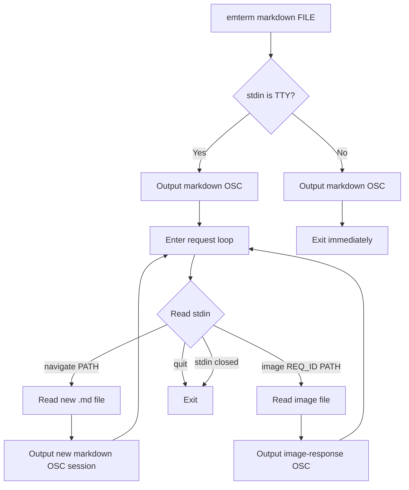

# Markdown Viewer Navigation - 要件定義書

## 1. 概要

### 1.1 背景
eMterm の fullscreen markdown viewer は OSC 777 経由で markdown を表示できるが、markdown 内の相対リンク（他の .md ファイルへのリンク）や相対/絶対パスで参照された画像が機能しない。CLI は one-shot で即座に終了するため、追加リソースを要求する仕組みがない。

### 1.2 目的
- Markdown 内の .md ファイルへのリンクをクリックして別のファイルに遷移できるようにする
- Markdown 内の相対/絶対パス画像をインライン表示する
- SSH 経由でも動作すること

### 1.3 スコープ
- `emterm markdown` CLI コマンドの対話モード拡張
- OSC 777 プロトコルの拡張（basedir、image-response、image-error）
- Frontend の fullscreen viewer でのリンクナビゲーション・画像読み込み
- PTY 経由のリクエスト・レスポンスプロトコル

スコープ外:
- 履歴スタック（戻る/進む）
- http/https リンクの動作変更（既存の外部ブラウザ起動を維持）
- Markdown 以外のファイル形式への対応

## 2. ビジネス要件

### 2.1 ビジネス目標
Markdown ドキュメントの閲覧体験を向上させ、ターミナル内でドキュメントナビゲーションを完結させる。

### 2.2 対象ユーザー
| ユーザータイプ | 説明 |
|----------------|------|
| 開発者 | ターミナルで Markdown ドキュメントを閲覧するユーザー |
| リモートユーザー | SSH 経由でリモートサーバー上のドキュメントを閲覧するユーザー |

### 2.3 期待される効果
- Markdown 内のリンクや画像がシームレスに動作する
- SSH 経由でもローカルと同等の体験

## 3. ユースケース

### 3.1 ユースケース一覧
| ID | ユースケース名 | アクター | 優先度 |
|----|----------------|----------|--------|
| UC01 | .md リンクナビゲーション | 開発者 | 高 |
| UC02 | インライン画像表示 | 開発者 | 高 |
| UC03 | ビューア終了 | 開発者 | 高 |
| UC04 | SSH 経由での使用 | リモートユーザー | 高 |

### 3.2 ユースケース詳細

#### UC01: .md リンクナビゲーション

**アクター**: 開発者

**事前条件**:
- `emterm markdown FILE` で fullscreen viewer が表示されている
- Markdown 内に `.md` ファイルへの相対/絶対リンクが含まれている

**基本フロー**:
1. ユーザーが .md リンクをクリックする
2. Frontend が basedir を基にパスを解決する
3. Frontend が PTY にナビゲーションリクエストを書き込む
4. CLI プロセスが新しいファイルを読み込み、新しい OSC セッションを出力する
5. Frontend が viewer のコンテンツを新しい markdown で置き換える

**代替フロー**:
- リンク先ファイルが存在しない: CLI がエラーを返し、viewer はエラーを表示
- リンクが http/https: 既存動作（外部ブラウザで開く）

**事後条件**:
- Viewer に新しい markdown コンテンツが表示されている

#### UC02: インライン画像表示

**アクター**: 開発者

**事前条件**:
- Fullscreen viewer で markdown が表示されている
- Markdown 内に相対/絶対パスの画像参照が含まれている

**基本フロー**:
1. 画像要素がプレースホルダーとして描画される
2. ユーザーがスクロールして画像がビューポートに入る（IntersectionObserver）
3. Frontend が PTY に画像リクエストを書き込む
4. CLI プロセスがファイルを読み込み、base64 エンコードして OSC で返す
5. Frontend がプレースホルダーを data: URI の img に置き換える

**代替フロー**:
- 画像ファイルが存在しない: CLI がエラーレスポンスを返し、プレースホルダーにエラー表示
- http/https URL の画像: 対象外（既存動作を維持）

**事後条件**:
- 画像がインラインで表示されている

#### UC03: ビューア終了

**アクター**: 開発者

**事前条件**:
- Fullscreen viewer が表示されている
- CLI プロセスが対話モードで実行中

**基本フロー**:
1. ユーザーが Escape または q を押す
2. Frontend が PTY に QUIT コマンドを書き込む
3. CLI プロセスが QUIT を受信して終了する
4. Viewer が閉じる

**事後条件**:
- Viewer が閉じ、CLI プロセスが終了している

#### UC04: SSH 経由での使用

**アクター**: リモートユーザー

**事前条件**:
- SSH でリモートサーバーに接続している
- リモートサーバーに emterm CLI がインストールされている

**基本フロー**:
1. `emterm markdown FILE` を実行する
2. OSC シーケンスが PTY を通じてローカルの eMterm に到達する
3. リンクナビゲーションや画像リクエストが PTY を通じてリモートの CLI に到達する
4. レスポンスが PTY を通じてローカルに返される

**事後条件**:
- ローカルと同等の体験でドキュメントが閲覧できる

## 4. 機能要件

### 4.1 機能一覧
| ID | 機能名 | 説明 | 優先度 |
|----|--------|------|--------|
| F01 | 対話モード CLI | stdin が TTY の場合、リクエスト待ちループに入る | 高 |
| F02 | basedir 通知 | OSC begin シーケンスにソースファイルの親ディレクトリを含める | 高 |
| F03 | .md リンクナビゲーション | .md リンクをクリックして別ファイルに遷移 | 高 |
| F04 | 画像オンデマンド読み込み | IntersectionObserver で遅延読み込み | 高 |
| F05 | image-response OSC | base64 画像データを返す OSC verb | 高 |
| F06 | image-error OSC | 画像読み込みエラーを返す OSC verb | 高 |
| F07 | QUIT コマンド | viewer 終了時に CLI プロセスを終了させる | 高 |
| F08 | パイプモード互換性 | stdin がパイプの場合、従来の one-shot 動作を維持 | 高 |

### 4.2 機能詳細

#### F01: 対話モード CLI

**説明**: `emterm markdown FILE` 実行時、stdin が TTY の場合は markdown 出力後にリクエスト待ちループに入る。stdin がパイプの場合は従来通り即座に終了する。

**入力**:
- stdin からのテキストコマンド（navigate, image, quit）

**出力**:
- OSC シーケンス（markdown セッション、image-response、image-error）

**処理フロー**:


**エラーケース**:
| エラー | 条件 | 対応 |
|--------|------|------|
| ファイル未検出 | navigate/image のパスが存在しない | エラーレスポンスを OSC で返す |
| 読み取り権限なし | ファイルに読み取り権限がない | エラーレスポンスを OSC で返す |
| stdin 切断 | SSH 切断等 | プロセスを終了する |

#### F02: basedir 通知

**説明**: OSC begin シーケンスに `basedir` パラメータを追加する。

**OSC 形式**:
```
ESC ] 777 ; emterm ; markdown ; begin ; id={uuid} ; format=gfm ; render=fullscreen ; version=1.0 ; basedir={path} ESC \
```

`basedir` はソースファイルの親ディレクトリの絶対パス。

#### F03: .md リンクナビゲーション

**説明**: Fullscreen viewer 内の .md リンクをクリックすると、PTY にナビゲーションリクエストを書き込み、CLI プロセスが新しいファイルを読み込んで新しい markdown セッションを開始する。

**リクエスト形式**（PTY stdin へ書き込み）:
```
navigate PATH\n
```

**レスポンス**: 新しい markdown OSC セッション（begin/chunk/end）

**パス解決**: Frontend が basedir を基に相対パスを絶対パスに解決してから送信する。

#### F04: 画像オンデマンド読み込み

**説明**: Markdown 内の相対/絶対パス画像を IntersectionObserver で検出し、ビューポートに入った時点で PTY 経由で画像データを要求する。

**リクエスト形式**（PTY stdin へ書き込み）:
```
image REQ_ID PATH\n
```

**レスポンス**: image-response または image-error OSC

#### F05: image-response OSC

**説明**: 画像データを base64 エンコードして返す OSC verb。

**OSC 形式**:
```
ESC ] 777 ; emterm ; markdown ; image-response ; request_id={id} ; mime_type={type} ; data={base64} ESC \
```

サイズ制限なし。大きな画像はチャンク分割が必要な場合がある（OSC の実装制約に依存）。

#### F06: image-error OSC

**説明**: 画像読み込みエラーを返す OSC verb。

**OSC 形式**:
```
ESC ] 777 ; emterm ; markdown ; image-error ; request_id={id} ; error={message} ESC \
```

#### F07: QUIT コマンド

**説明**: Viewer 終了時に PTY に QUIT を書き込み、CLI プロセスを終了させる。

**リクエスト形式**:
```
quit\n
```

#### F08: パイプモード互換性

**説明**: `echo "test" | emterm markdown /dev/stdin` のようなパイプ入力時は従来通り one-shot で終了する。stdin が TTY かどうかで判定。

## 5. 非機能要件

### 5.1 パフォーマンス要件
- 画像の遅延読み込み: IntersectionObserver による viewport 検出
- ナビゲーション: ファイル読み込み + OSC 生成は既存の markdown コマンドと同等速度

### 5.2 セキュリティ要件
- パストラバーサル防止: CLI 側でパスを正規化（canonicalize）
- DOMPurify: data: URI スキームを img src に対して許可
- XSS 防止: 既存の DOMPurify 設定を維持しつつ data: URI のみ追加許可

### 5.3 互換性要件
- SSH 経由: 全機能が PTY 経由で動作すること
- tmux: 既存の DCS passthrough 対応を維持
- パイプモード: 後方互換性を維持

## 6. UI/UX 要件

### 6.1 画面設計要件
- .md リンクのクリックでビューアのコンテンツが即座に切り替わる（履歴スタックなし）
- 画像はプレースホルダーからインライン画像への遷移
- エラー時はプレースホルダーにエラーメッセージを表示

### 6.2 リンク動作
| リンク種別 | 動作 |
|------------|------|
| http/https | 既存動作（外部ブラウザ） |
| .md 相対/絶対パス | ナビゲーション（コンテンツ置換） |
| その他 | 無視 |

## 7. データ要件

### 7.1 プロトコルデータ

**PTY stdin コマンド形式**:
| コマンド | 形式 | 説明 |
|----------|------|------|
| navigate | `navigate PATH\n` | .md ファイルナビゲーション |
| image | `image REQ_ID PATH\n` | 画像データリクエスト |
| quit | `quit\n` | プロセス終了 |

**OSC レスポンス verb**:
| Verb | パラメータ | 説明 |
|------|-----------|------|
| image-response | request_id, mime_type, data | 画像データ（base64） |
| image-error | request_id, error | エラーメッセージ |

## 8. 制約条件

### 8.1 技術的制約
- Frontend から直接ファイルシステムにアクセスできない（WebView の制約）
- 全データは PTY 経由で転送する必要がある（SSH 対応のため）
- OSC シーケンスのサイズ制限は WASM パーサーの実装に依存する

### 8.2 ビジネス上の制約
- 既存の one-shot パイプモードの後方互換性を維持する必要がある

## 9. 想定される課題とリスク

### 9.1 技術的課題
| 課題 | 影響度 | 対応策 |
|------|--------|--------|
| 大きな画像の OSC 転送 | 中 | チャンク分割で対応 |
| 複数画像の同時リクエスト | 中 | リクエストキューで順序制御 |
| CLI プロセスの安定性 | 中 | stdin close 検出で graceful shutdown |

## 10. 成功基準

### 10.1 受け入れ基準
- [ ] .md リンクをクリックして別のファイルに遷移できる
- [ ] 相対パスの画像がインライン表示される
- [ ] 絶対パスの画像がインライン表示される
- [ ] SSH 経由で全機能が動作する
- [ ] パイプモードでの後方互換性が維持されている
- [ ] Escape/q で viewer と CLI プロセスが終了する
- [ ] 存在しないファイルへのリンク/画像でエラー表示される

## 11. テストシナリオ

### 11.1 テスト観点
- [ ] 正常系: .md リンクナビゲーション（相対パス、絶対パス）
- [ ] 正常系: 画像表示（相対パス、絶対パス、各種フォーマット）
- [ ] 正常系: QUIT コマンドでプロセス終了
- [ ] 正常系: パイプモードで one-shot 動作
- [ ] 異常系: 存在しないファイルへのリンク
- [ ] 異常系: 存在しない画像ファイル
- [ ] 異常系: 読み取り権限のないファイル
- [ ] 異常系: stdin 切断時の CLI プロセス終了
- [ ] セキュリティ: パストラバーサル攻撃の防止
- [ ] セキュリティ: data: URI が img src にのみ適用される

## 12. 用語定義

| 用語 | 定義 |
|------|------|
| basedir | Markdown ソースファイルの親ディレクトリの絶対パス |
| 対話モード | CLI プロセスが終了せずに stdin からリクエストを受け付ける動作モード |
| one-shot モード | OSC シーケンスを出力して即座に終了する従来の動作モード |
| image-response | 画像データを base64 で返す OSC verb |
| image-error | 画像読み込みエラーを返す OSC verb |

## 13. 確認事項

### 13.1 確認済み事項

- [x] アーキテクチャ: オンデマンドプロトコル（Approach B）を採用
- [x] ナビゲーション: 履歴スタックなし、コンテンツ置換のみ
- [x] 画像読み込み: IntersectionObserver による遅延読み込み
- [x] 画像データ: base64 エンコードの data: URI
- [x] 画像サイズ制限: なし
- [x] SSH 対応: 全通信が PTY 経由
- [x] 対話モード判定: stdin が TTY かどうかで判定
- [x] パイプモード: 後方互換性を維持

### 13.2 未確認・保留事項
- なし
