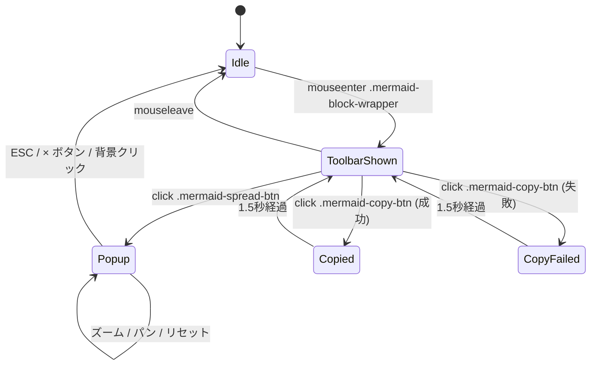

# Mermaid図ポップアップ拡大表示 + Copyボタン修正 - 要件定義書

## 1. 概要

### 1.1 背景

Markdownビューアー（子WebView、`src-tauri/viewer/`）のMermaid図はレンダリング済みSVGとして表示されるが、原寸表示のみで拡大・縮小・パン操作ができない。複雑な図（フローチャート、シーケンス図、ERD等）ではノードやテキストが小さくて読めない、または横に長い図が見切れる、といった問題がある。

同時に、既存のMermaidツールバーにあるCopyボタンはDOM上にレンダリングされているものの、クリックイベントハンドラが実装されておらず、ボタンとして機能していない。

### 1.2 目的

- Mermaid図だけをフルスクリーンオーバーレイでポップアップ表示し、拡大縮小・パン操作でじっくり読めるようにする
- 既存Mermaidツールバーの機能不全Copyボタンを修正し、ソースコードをクリップボードにコピー可能にする

### 1.3 スコープ

**対象**:
- `src-tauri/web-shared/markdown/mermaid-renderer.ts` およびそのCSS（`fullscreen.css`）
- 子WebViewとしてのMarkdownビューアー（`src-tauri/viewer/`）
- ツールバーへの「Spread（広げる）」ボタン追加
- Copyボタンのクリックハンドラ実装

**対象外**:
- ダブルクリック等の追加ショートカットで popup を開くこと
- Copyボタンのアイコン化（現状はテキスト「コードをコピー」のまま）
- 通常ビュー（非ポップアップ）でのズーム機能
- Markdownビューアー以外の子WebView（image / data / settings）への同様機能
- Mermaid以外のコードブロックへのポップアップ機能

## 2. ビジネス要件

### 2.1 ビジネス目標

Markdownビューアーの主要ユースケースであるAI生成ドキュメント（Claude Code等）の閲覧体験を向上させる。特にAIが生成する図解は複雑な傾向があり、ポップアップ拡大表示は閲覧効率に直結する。

### 2.2 対象ユーザー

| ユーザータイプ | 説明 |
|----------------|------|
| ドキュメント閲覧者 | Markdownビューアーで図付きの文書を読む一般ユーザー |
| AI利用者 | Claude Code等の出力に含まれるMermaid図を確認する開発者 |

### 2.3 期待される効果

- 大きく複雑なMermaid図が読みやすくなる
- 図の特定部分にフォーカスできる（パン+ズーム）
- Copyボタンが正常に動作し、Mermaidソースの取り回しが改善する

## 3. ユースケース

### 3.1 ユースケース一覧

| ID | ユースケース名 | アクター | 優先度 |
|----|----------------|----------|--------|
| UC01 | Mermaid図をポップアップで拡大表示する | ドキュメント閲覧者 | 高 |
| UC02 | ポップアップ内でズーム・パン操作 | ドキュメント閲覧者 | 高 |
| UC03 | ポップアップを閉じる | ドキュメント閲覧者 | 高 |
| UC04 | Mermaidソースをクリップボードにコピー | ドキュメント閲覧者 | 高 |

### 3.2 ユースケース詳細

#### UC01: Mermaid図をポップアップで拡大表示する

**アクター**: ドキュメント閲覧者

**事前条件**:
- Markdownビューアーが開いている
- 表示中の文書にMermaidコードブロックがある（レンダリング済み）

**基本フロー**:
1. ユーザーがMermaid図の上にマウスを乗せる
2. `.mermaid-block-wrapper` の右上にツールバー `[Chart | Code | Spread | Copy]` が半透明で現れる
3. ユーザーが `Spread` ボタンをクリック
4. 画面全体を覆う半透明オーバーレイが表示される
5. オーバーレイ中央にSVGのクローンが表示される（クライアント領域から上下左右10%を引いた領域にフィットする scale=1.0 が初期状態）
6. 右下に `+ / - / リセット` ボタン、右上に `×` ボタンが表示される

**代替フロー**:
- Mermaidレンダリング失敗（`.mermaid-error-banner` が表示されている状態）: Spreadボタンは無効化 / 非表示

**事後条件**:
- ポップアップが表示され、フォーカスは popup 内のコントロール
- 背景の Markdown ビューアはスクロールできない

#### UC02: ポップアップ内でズーム・パン操作

**アクター**: ドキュメント閲覧者

**事前条件**:
- ポップアップが開いている

**基本フロー**:
- `+` ボタン / キーボード `+` / マウスホイール上: ズームイン（+ボタンは 0.25x 刻み、ホイールは連続）
- `-` ボタン / キーボード `-` / マウスホイール下: ズームアウト
- 左マウスドラッグ: 図をパン（掴んで動かす）
- `0` キー / リセットボタン: scale=1.0・パン=(0,0) の初期状態に戻す

**代替フロー**:
- ズーム上限（5.0x）到達時: これ以上ズームインしても scale は変わらない
- ズーム下限（0.25x）到達時: これ以上ズームアウトしても scale は変わらない

**事後条件**:
- SVG の表示位置・倍率が更新される

#### UC03: ポップアップを閉じる

**アクター**: ドキュメント閲覧者

**事前条件**:
- ポップアップが開いている

**基本フロー**:
- 右上の `×` ボタンをクリック / 背景（SVG領域外）をクリック / `ESC` キーを押下
- ポップアップDOMが削除される
- 背景のスクロールロックが解除される
- フォーカスが元の `Spread` ボタンに戻る

**代替フロー**:
- ESCによる閉じ動作は `stopPropagation()` で Markdownビューアの ESC ハンドラには伝えない
- ESC を連打した場合、1発目で popup が閉じ、2発目でビューアが閉じるのは仕様として許容

**事後条件**:
- ポップアップDOMが除去されている
- ビューアは通常状態に戻る

#### UC04: Mermaidソースをクリップボードにコピー

**アクター**: ドキュメント閲覧者

**事前条件**:
- Markdown ビューアで Mermaid ブロックが表示されている

**基本フロー**:
1. ユーザーがツールバーの `Copy` ボタン（`.copy-code-button.mermaid-copy-btn`）をクリック
2. `navigator.clipboard.writeText()` で `data-mermaid-source` の内容がクリップボードに書き込まれる
3. ボタンに `.copy-success` クラスが付き、視覚フィードバックが短時間表示される（`markdown.copySuccess` = "Copied!"）
4. 一定時間後にフィードバックがクリアされる

**代替フロー**:
- クリップボード書き込み失敗: `.copy-error` クラスを付け、`markdown.copyFailed` = "Failed" を表示

**事後条件**:
- ソースがクリップボードに保存されている

## 4. 機能要件

### 4.1 機能一覧

| ID | 機能名 | 説明 | 優先度 |
|----|--------|------|--------|
| F01 | Spread ボタン追加 | Mermaidツールバーに `Spread` ボタンを `Chart|Code` と `Copy` の間に挿入 | 高 |
| F02 | ポップアップオーバーレイ表示 | Spread クリックでフルスクリーンオーバーレイ表示 | 高 |
| F03 | SVGクローン配置 | 元のMermaidブロックのSVGをクローンしてオーバーレイ中央に配置 | 高 |
| F04 | ズーム操作 | +/- ボタン、キーボード `+`/`-`、マウスホイールでのズーム | 高 |
| F05 | パン操作 | 左マウスドラッグでの図のパン | 高 |
| F06 | リセット操作 | `0` キー / リセットボタンで初期状態に戻す | 高 |
| F07 | ポップアップ閉じ | 背景クリック / ×ボタン / ESC キーで閉じる | 高 |
| F08 | 背景スクロールロック | ポップアップ表示中は背景の Markdown ビューアをスクロール不可にする | 高 |
| F09 | Copyボタン修正 | Copyボタンのクリックハンドラを実装 | 高 |
| F10 | フォーカス管理 | 開いたら popup 内、閉じたら Spread ボタンに戻す | 中 |

### 4.2 機能詳細

#### F01: Spread ボタン追加

**説明**: 既存の `mermaid-toolbar` の DOM 生成順に Spread ボタンを追加。

**追加位置**: `chartBtn`, `codeBtn` の後、`copyBtn` の前。結果として `[Chart | Code | Spread | Copy]` の並びになる。

**要素**:
- タグ: `<button>`
- クラス: `mermaid-spread-btn`（`mermaid-view-btn` と同じサイズ / スタイルの兄弟クラス）
- アイコン: 対角矢印（4方向拡大 or 右下向き）14x14 viewBox SVG
- `aria-label`: 新規i18nキー `markdown.mermaidSpread`（例: "Enlarge diagram" / "拡大表示"）

#### F02: ポップアップオーバーレイ表示

**トリガー**: `mermaid-spread-btn` のクリック

**DOM構造** (概念):
```
<div class="mermaid-popup-overlay" role="dialog" aria-modal="true">
  <div class="mermaid-popup-stage">
    <svg>...</svg>  <!-- SVGクローン、transform: translate(x,y) scale(s) -->
  </div>
  <div class="mermaid-popup-controls">
    <button class="mermaid-popup-zoom-out">-</button>
    <button class="mermaid-popup-reset">0</button>
    <button class="mermaid-popup-zoom-in">+</button>
  </div>
  <button class="mermaid-popup-close">×</button>
</div>
```

**スタイル要件**:
- overlay: `position: fixed; inset: 0; background: rgba(0,0,0,0.85); z-index: {viewer overlay より上}`
- close: 右上に絶対配置
- controls: 右下に絶対配置

**基準倍率 (scale=1.0)**:
- ステージ有効領域 = `window.innerWidth * 0.8` × `window.innerHeight * 0.8`（上下左右10%パディング）
- SVGクローンの `viewBox` から算出される intrinsic size を用いて、ステージ有効領域にフィットする係数を初期 scale とする（この係数を 1.0 と定義する。すなわち scale=1.0 = 「ステージ有効領域にフィットした状態」）
- ズーム範囲: 0.25 ≤ scale ≤ 5.0

**変換方式**:
- SVG 要素に `transform: translate({panX}px, {panY}px) scale({scale})` を CSS で付与
- `transform-origin`: 初期実装は `center center`（zoom to cursor は将来拡張）

#### F04: ズーム操作

**入力**:
- `+` ボタン / キーボード `+`: `scale = min(scale + 0.25, 5.0)`
- `-` ボタン / キーボード `-`: `scale = max(scale - 0.25, 0.25)`
- マウスホイール: `deltaY < 0 → scale *= 1.1`, `deltaY > 0 → scale /= 1.1`、範囲でクリップ

**注意**: ホイールイベントは `passive: false` かつ `event.preventDefault()` して背景スクロールを抑止する。

#### F05: パン操作

**入力**:
- 左マウスボタン押下 → mousemove で `panX, panY` を差分加算
- mouseup / mouseleave で終了

**カーソル**: 未押下時 `grab`、押下中 `grabbing`

#### F06: リセット操作

**入力**: `0` キー / リセットボタン

**動作**: `scale = 1.0`, `panX = 0`, `panY = 0` に戻す

#### F07: ポップアップ閉じ

**入力**:
- 背景（`.mermaid-popup-overlay` 自身のクリックで、target が overlay ノード自身の場合のみ）
- `×` ボタン
- `ESC` キー（keydown を popup が capture フェーズで捕捉し、`event.stopPropagation()` + `preventDefault()` してビューア本体に伝えない）

**動作**:
1. overlay DOM を削除
2. `document.body.style.overflow` を元に戻す
3. 元の `Spread` ボタンに `.focus()`

#### F08: 背景スクロールロック

- popup 表示中: `document.body` に `overflow: hidden` を付与
- 閉じるとき: 元の値に戻す

#### F09: Copyボタン修正

**修正内容**:
1. 既存 `copyBtn` に `click` イベントハンドラを追加
2. ハンドラ内で `navigator.clipboard.writeText(source)` を呼ぶ（`source` は `block.getAttribute("data-mermaid-source")` から取得、または renderBlock のスコープの `source` を capture）
3. 成功: `copyBtn` に `.copy-success` を一時付与（既存 CSS で `markdown.copySuccess` 表示）
4. 失敗: `.copy-error` を一時付与（`markdown.copyFailed` 表示）
5. 表示時間: 既存の code-block copy 挙動と揃える（1.5秒程度）

**根拠**: `data-mermaid-source` 属性は既に `mermaid-renderer.ts:147` で保存済み。同じキーバインド `.copy-code-button` と CSS クラス（`.copy-success` / `.copy-error`）は既に定義されている。

#### F10: フォーカス管理

- popup を開いた瞬間: `mermaid-popup-close` にフォーカス（Tab で controls をたどれる）
- popup を閉じた瞬間: トリガー元の `.mermaid-spread-btn` に `.focus()`
- popup 内での focus trap は必須ではない（ダイアログ内ボタンが少数なため）が、Tab キーが popup 外に出ないよう最低限のトラップは望ましい

## 5. 非機能要件

### 5.1 パフォーマンス要件

- **NFR-P1**: Spread クリックからポップアップ表示までの遅延 < 100ms
- **NFR-P2**: ズーム/パン操作は 60fps 相当のスムーズさで表示（CSS transform 使用）
- **NFR-P3**: SVG は既存のDOMからクローン（`cloneNode(true)`）するのみで、Mermaid再レンダリングは行わない

### 5.2 セキュリティ要件

- **NFR-S1**: Mermaid の `securityLevel: "strict"` 設定は変更しない
- **NFR-S2**: `document.body` を汚す形でオーバーレイを追加する（既存のMermaid隠しコンテナは維持）、ただし popup を閉じた際は必ずDOMから削除する
- **NFR-S3**: `data-mermaid-source` の内容はクリップボードへ書き込むのみで、`innerHTML` 等でDOM挿入しない

### 5.3 可用性要件

- **NFR-A1**: `navigator.clipboard` が使えない環境ではエラーフィードバックを表示（既存の `.copy-error` フロー）
- **NFR-A2**: SVG がない / Mermaidレンダリング失敗した Mermaid ブロックには Spread ボタンを付与しない

### 5.4 保守性要件

- **NFR-M1**: 実装は `src-tauri/web-shared/markdown/mermaid-renderer.ts` から呼び出す。ポップアップロジックが100行を超える場合は同ディレクトリの新規モジュール（例: `mermaid-popup.ts`）に切り出す（判断は実装計画フェーズで確定）
- **NFR-M2**: 追加するCSSは `src-tauri/web-shared/markdown/fullscreen.css` に集約

### 5.5 互換性要件

- **NFR-C1**: Linux（WebKitGTK）と Windows（WebView2）の両方で動作する
- **NFR-C2**: 既存のChart/Code切替・Copy不具合修正前の見た目を後方互換に維持（Spread ボタン追加以外の見た目変更をしない）

## 6. UI/UX要件

### 6.1 画面設計要件

- **ツールバー配置**: 右上、`hover` で opacity 0→0.7、既存挙動と同じ
- **ポップアップ**: 半透明背景 `rgba(0,0,0,0.85)`、SVGクローンは中央、コントロールボタンは右下と右上
- **アイコン**: Chart/Code アイコンと同サイズ（14×14 viewBox）で統一
- **Spread アイコン**: 対角矢印（外向き4方向 or 右下向きの拡大シンボル）

### 6.2 画面遷移



### 6.3 レスポンシブ対応

- クライアント領域サイズ変更時（ウィンドウリサイズ）: popup 表示中でも fit 算出をやり直す（`resize` event で再計算）
- モバイル向け（タッチイベント）は今回のスコープには含めない（Linux / Windows デスクトップのみ）

## 7. データ要件

該当なし（永続化データなし・すべてクライアント内メモリのみ）。

## 8. 外部連携

該当なし。

## 9. 制約条件

### 9.1 技術的制約

- Bunバンドラで TypeScript を子WebView用にビルド。CSS `@import` は使えない（`tauri-webview-layout` の既知制約）ため、CSS は `fullscreen.css` に直接追記する
- child WebView は DevTools 無効。デバッグは `console.warn` 以上（emterm.log に出る）
- Wry の child WebView は winit イベントループとは別プロセスではなく別コンテキスト。native の ESC バインドではなく WebView 内 keydown で処理する
- Mermaid 生成後のSVGは同じDOMツリーにあるため、単純に `cloneNode(true)` で複製可能

### 9.2 ビジネス上の制約

なし。

### 9.3 スケジュール制約

なし。

## 10. 想定される課題とリスク

### 10.1 技術的課題

| 課題 | 影響度 | 対応策 |
|------|--------|--------|
| SVG 内の Mermaid で使う `<foreignObject>` や animation が clone で崩れる | 中 | 描画確認テストで検証。崩れる場合は `outerHTML` 経由でクローン |
| ホイールイベントの `passive: false` で背景スクロール抑止できるか | 低 | passive listener で試験、WebKitGTK / WebView2 両方で確認 |
| `navigator.clipboard.writeText` の permission が Wry で通るか | 中 | 既存の code-block copy が動くか確認、動かないなら `document.execCommand('copy')` フォールバック |
| ESC の stopPropagation でビューア側 ESC が動作しなくなる副作用 | 低 | popup が閉じたリスナーは即座に削除するので継続的な副作用はない |

### 10.2 ビジネスリスク

なし。

## 11. 成功基準

### 11.1 受け入れ基準

- [ ] Mermaid 図の Spread ボタンをクリックすると、フルスクリーン popup が開く
- [ ] popup 内で `+ / - / 0` キー、ホイール、+/- ボタンが正しく動作する
- [ ] popup 内で左ドラッグでパンできる
- [ ] popup を ESC / × / 背景クリック で閉じられる（ESC で ビューア本体は閉じない）
- [ ] Copy ボタンをクリックすると Mermaid ソースがクリップボードに入り、成功フィードバックが表示される
- [ ] popup 開閉時にフォーカスが `Spread ボタン → popup 内 → Spread ボタン` と正しく戻る
- [ ] Windows / Linux の両方で動作する

### 11.2 KPI

該当なし（UI 機能なので指標化は不要）。

## 12. テストシナリオ

### 12.1 テスト観点

- [ ] 正常系: Mermaid 図をレンダリング済みの Markdown を開き、Spread → +/-/0/ホイール/ドラッグ/ESC/× 各操作が動作する
- [ ] 正常系: Copy ボタンでソースがクリップボードに保存される
- [ ] 異常系: Mermaid レンダリング失敗ブロックには Spread ボタンが出ない（またはクリック無効）
- [ ] 異常系: `navigator.clipboard` が例外を投げた場合、`.copy-error` フィードバックが表示される
- [ ] 境界値: scale=0.25 で `-` を押しても scale は変わらない
- [ ] 境界値: scale=5.0 で `+` を押しても scale は変わらない
- [ ] 境界値: ウィンドウリサイズで fit 領域が再計算される
- [ ] ESC 連打: 1発目で popup 閉じる、2発目でビューア閉じる（仕様通り）
- [ ] フォーカス: popup を開いた直後、Tab キーが popup 内から出ない（最低限のトラップ）

## 13. 用語定義

| 用語 | 定義 |
|------|------|
| ステージ有効領域 | ウィンドウのクライアント領域から上下左右10%パディングを引いた矩形 |
| 基準倍率 (scale=1.0) | ステージ有効領域にSVGがフィットした状態 |
| Spread | ポップアップを開くためのツールバーボタン |
| ステージ | popup 内でSVGクローンが配置される中央領域 |

## 14. 確認事項

### 14.1 確認済み事項

- [x] Copy ボタン不具合の原因: click ハンドラ未実装 → 実装で対応
- [x] ツールバー順は `[Chart | Code | Spread | Copy]`
- [x] ポップアップはフルスクリーンオーバーレイ方式
- [x] 描画領域はクライアント領域から上下左右10%パディングを差し引いた領域、そこにフィットした状態を等倍 (1.0x) とする
- [x] 拡大縮小操作: +/- ボタン + マウスホイール + ドラッグでパン、`0` でリセット
- [x] 閉じる: 背景クリック / 右上×ボタン / ESC キー
- [x] ESC は popup 専用に割り当て（stopPropagation でビューアには伝えない）。連打による両方閉じは仕様として許容
- [x] SVG は `document.body` に流し込むのではなく、既存 mermaid ブロックからクローンして表示する
- [x] transform-origin は初期実装は `center center`。zoom to cursor は将来拡張
- [x] 矢印キーでパンは初期実装スコープ外
- [x] ダブルクリックで popup を開くショートカットは今回のスコープに含めない
- [x] Copy ボタンのアイコン化は今回のスコープに含めない

### 14.2 未確認・保留事項

- [ ] 実装ファイル配置: `mermaid-renderer.ts` に統合するか `mermaid-popup.ts` を新設するかは実装計画（sdd.2）で確定
- [ ] `navigator.clipboard` 権限問題が判明した場合のフォールバック方式（execCommand）

## 15. 参考資料

- 議論ドキュメント: `./tmp/discussion-mermaid-zoom-popup.md`
- 既存実装: `src-tauri/web-shared/markdown/mermaid-renderer.ts`
- 既存CSS: `src-tauri/web-shared/markdown/fullscreen.css`
- i18n キー既存分: `src-tauri/web-shared/i18n/locales/{en,ja}.json` の `markdown` セクション
