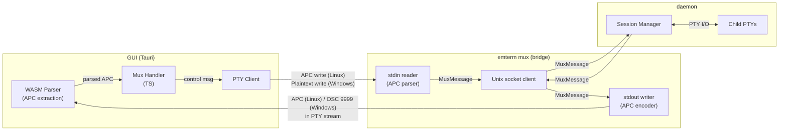
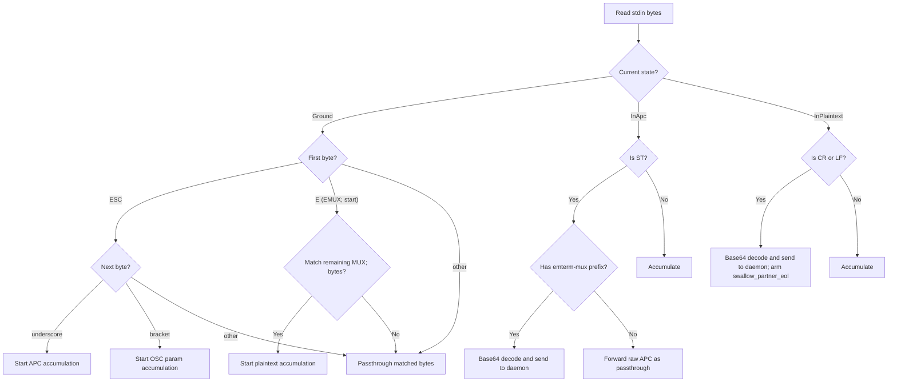

# Feature: Mux Inband Protocol

## Overview

Replace the direct Unix socket communication between GUI and mux daemon with an inband protocol using APC (Application Program Command) escape sequences over the PTY stream. The `emterm mux` command becomes a bridge process that translates between APC on stdin/stdout and MuxMessage frames on a Unix socket to the daemon. This enables seamless mux operation over SSH without additional socket forwarding.

## Objectives

- Enable mux communication over PTY stream using APC escape sequences
- Support SSH-transparent mux sessions with identical local/remote architecture
- Remove bridge.rs Tauri IPC commands and simplify GUI-side mux code

## User Stories

### US1: Local Mux Session
As a local user, I want to start a mux session via `emterm mux`, so that my terminal sessions are multiplexed with detach/reattach support.

**Acceptance Criteria:**
- [ ] GUI launches `emterm mux` as a shell command in the PTY
- [ ] Bridge process connects to daemon via Unix socket
- [ ] Mux control messages flow via APC over the PTY stream
- [ ] All existing mux features work (pane split, window management, status bar)

### US2: Remote Mux Session via SSH
As a remote user, I want to use mux over SSH, so that my remote sessions persist across SSH disconnections.

**Acceptance Criteria:**
- [ ] `emterm mux` on the remote side acts as bridge process
- [ ] APC messages pass transparently through SSH PTY
- [ ] SSH disconnect causes bridge to exit cleanly (EOF on stdin)
- [ ] Daemon survives bridge death and allows reattach

### US3: Session Reattach
As a user, I want to reattach to a previously detached session, so that I can resume work from where I left off.

**Acceptance Criteria:**
- [ ] Welcome message includes existing session list
- [ ] Attach message restores session with ring buffer snapshot
- [ ] Screen state is preserved after reattach

## Technical Requirements

### Functional Requirements

- **FR1: APC Message Format** - Wrap MuxMessage frame bodies in APC escape sequences using Base64 encoding: `ESC _ emterm-mux;<base64(frame_body)> ST`
- **FR2: Bridge Process** - `emterm mux` command reads APC from stdin, decodes to MuxMessage, forwards to daemon via Unix socket; reads MuxMessage from daemon, encodes to APC, writes to stdout
- **FR3: GUI APC Send** - GUI writes APC-encoded control messages to PTY stdin for mux operations (handshake, attach, detach, resize, split, window management)
- **FR4: GUI APC Receive** - GUI extracts APC messages from PTY output stream (WASM parser already handles APC) and processes them as mux control messages
- **FR5: Normal Input Passthrough** - Normal keyboard input is written directly to PTY stdin without APC wrapping; only mux control messages use APC
- **FR6: Bridge Stdin Parsing** - Bridge process parses its stdin: APC sequences are decoded as control messages, all other data is forwarded to the active pane's shell via daemon
- **FR7: Bridge Lifecycle** - Bridge exits cleanly on stdin EOF (SSH/PTY close); daemon is unaffected
- **FR8: Remove bridge.rs** - Delete Tauri IPC mux commands (mux_connect, mux_handshake, etc.) from bridge.rs
- **FR9: Feature Gate Removal** - Remove mux code from `feature = "gui"` gate so CLI-only builds include daemon and bridge

### Non-Functional Requirements

- **NFR1 - Performance:** No perceivable slowdown compared to current direct socket implementation
- **NFR2 - Reliability:** Daemon must survive bridge process death and allow reattach
- **NFR3 - Compatibility:** Existing CLI commands (mux ls, mux kill) continue to work via Unix socket to daemon (unchanged)

## Implementation Approach

### Architecture

```
Local:
┌─────────┐    APC over PTY     ┌──────────────┐    Unix socket    ┌────────┐    PTY    ┌───────┐
│   GUI   │ ◄────────────────► │ emterm mux   │ ◄──────────────► │ daemon │ ◄──────► │ shell │
│ (Tauri) │                     │ (bridge)     │                   │        │          │       │
└─────────┘                     └──────────────┘                   └────────┘          └───────┘

Remote (SSH) - Linux client:
┌─────────┐    APC over PTY/SSH    ┌──────────────┐    Unix socket    ┌────────┐    PTY    ┌───────┐
│   GUI   │ ◄──────────────────► │ emterm mux   │ ◄──────────────► │ daemon │ ◄──────► │ shell │
│ (Tauri) │                       │ (bridge,     │                   │(remote)│          │       │
│ (local) │                       │  remote)     │                   │        │          │       │
└─────────┘                       └──────────────┘                   └────────┘          └───────┘

Remote (SSH) - Windows client (asymmetric transport via ConPTY):
┌─────────┐  Plaintext(EMUX;)→    ┌──────────────┐    Unix socket    ┌────────┐    PTY    ┌───────┐
│   GUI   │  ←OSC 9999            │ emterm mux   │ ◄──────────────► │ daemon │ ◄──────► │ shell │
│ (Tauri) │  over ConPTY/SSH      │ (bridge,     │                   │(remote)│          │       │
│ (Win)   │                       │  remote)     │                   │        │          │       │
└─────────┘                       └──────────────┘                   └────────┘          └───────┘
```

**Component Diagram:**



### APC Message Format

**Wire format:**
```
ESC _ emterm-mux;<base64_payload> ST
```

Where:
- `ESC` = `0x1B`
- `_` = `0x5F` (APC introducer)
- `emterm-mux;` = literal prefix for identification
- `<base64_payload>` = standard Base64 encoding of `MuxMessage::to_frame_body()` output
- `ST` = `ESC \` = `0x1B 0x5C` (String Terminator)

**Frame body format (existing, unchanged):**
```
[type: u8][pane_id: u32 LE][payload: variable bytes]
```

**Example - Hello message:**
```
Frame body (hex): 03 00000000 <bincode(HelloMsg)>
Base64: Aw... (base64 of above)
APC:   ESC _ emterm-mux;Aw...== ESC \
```

**Example - PtyInput (keyboard data "ls\n"):**
```
Frame body (hex): 02 01000000 6C730A
Base64: AgEAAABscwo=
APC:   ESC _ emterm-mux;AgEAAABscwo= ESC \
```

Note: Normal keyboard input is NOT wrapped in APC. Only mux-specific control messages (PtyInput routed to a specific pane_id, handshake, resize, etc.) use APC wrapping.

### Windows ConPTY Transport

Windows ConPTY has asymmetric escape sequence handling:

- **Output direction** (bridge→GUI via SSH): OSC sequences pass through, APC is stripped
- **Input direction** (GUI→bridge via SSH): Both APC and OSC are stripped; only printable ASCII passes

This requires three transport encodings:

| Transport | Direction | Platform | Wire format |
|-----------|-----------|----------|-------------|
| APC | Both | Linux | `ESC _ emterm-mux;<base64> ESC \` |
| OSC 9999 | bridge→GUI | Windows | `ESC ] 9999 ; emterm-mux;<base64> ESC \` |
| Plaintext | GUI→bridge | Windows | `EMUX;<base64>\r` |

**OSC 9999 format (bridge→GUI on Windows):**
```
ESC ] 9999 ; emterm-mux;<base64_payload> ST
```

Where `9999` is the OSC parameter. The WASM parser routes OSC 9999 to the APC callback chain for unified handling.

**Plaintext format (GUI→bridge on Windows):**
```
EMUX;<base64_payload>\r
```

Uses only printable ASCII characters and a CR terminator. portable-pty 0.8 opens
ConPTY with `PSEUDOCONSOLE_WIN32_INPUT_MODE`, which interprets bytes written to
the master as Win32 Input Mode VT key events; a raw LF (`\n`) on that channel
is not delivered as a real key event and the bridge would otherwise stall in
`InPlaintext` with the prefix matched but no terminator ever arriving. CR
(`\r`) rides through reliably as `VK_RETURN`. The bridge `StdinApcParser`
accepts CR, LF, CRLF, or LFCR interchangeably and silently swallows the
partner half of a paired terminator, so a CRLF / LFCR insertion by any
intermediate layer (ConPTY, ssh, the host shell) collapses to a single
message boundary. The parser recognizes the `EMUX;` prefix and decodes the
base64 payload identically to APC messages.

**Transport negotiation:**

During initial handshake, the bridge sends Welcome in both OSC 9999 and APC formats (OSC first — ConPTY may corrupt the stream after encountering APC, so OSC must precede APC to ensure the Windows GUI receives Welcome). On Linux, the GUI receives both copies; the client deduplicates consecutive identical messages using a 1-element cache (type + paneId + data length + first 4 bytes).

The first message received from the GUI on bridge stdin determines the output transport:
- APC → Linux client, use APC for bridge→GUI output
- Plaintext (`EMUX;`) → Windows client, use OSC 9999 for bridge→GUI output

Note: The bridge stdin parser also recognizes OSC 9999 for forward compatibility, but the current GUI never sends OSC as input (ConPTY strips it in the input direction).

**Security note (plaintext injection):**

The `EMUX;` prefix uses printable ASCII, which means any program running inside a mux pane could theoretically output `EMUX;<valid-base64>\r` to forge control messages. However, in mux mode the bridge owns stdin exclusively — pane output flows through the daemon's Unix socket, not through bridge stdin. The injection risk is equivalent to APC injection on Linux (any program can emit `ESC _`). The bridge validates all decoded messages against the protocol before forwarding to the daemon.

### Data Flow

**GUI → Daemon (control message):**
```mermaid
sequenceDiagram
    participant GUI
    participant PTY as PTY Stream
    participant Bridge as emterm mux (bridge)
    participant Socket as Unix Socket
    participant Daemon

    GUI->>GUI: Create MuxMessage
    GUI->>GUI: to_frame_body() → bytes
    GUI->>GUI: Base64 encode
    GUI->>PTY: Write APC (Linux) or "EMUX;{base64}\r" (Windows)
    PTY->>Bridge: stdin receives APC or plaintext
    Bridge->>Bridge: Parse APC/plaintext, extract base64
    Bridge->>Bridge: Base64 decode → frame body
    Bridge->>Bridge: from_frame_body() → MuxMessage
    Bridge->>Socket: Send MuxMessage frame
    Socket->>Daemon: Receive MuxMessage
```

**Daemon → GUI (PTY output / control response):**
```mermaid
sequenceDiagram
    participant Daemon
    participant Socket as Unix Socket
    participant Bridge as emterm mux (bridge)
    participant PTY as PTY Stream
    participant GUI

    Daemon->>Socket: Send MuxMessage
    Socket->>Bridge: Receive MuxMessage
    Bridge->>Bridge: to_frame_body() → bytes
    Bridge->>Bridge: Base64 encode
    Bridge->>PTY: Write APC (Linux) or OSC 9999 (Windows) to stdout
    PTY->>GUI: PTY stream with APC or OSC
    GUI->>GUI: WASM parser extracts APC / routes OSC 9999 to APC callback
    GUI->>GUI: Match "emterm-mux;" prefix
    GUI->>GUI: Base64 decode → frame body
    GUI->>GUI: from_frame_body() → MuxMessage
    GUI->>GUI: Handle message (render, update UI)
```

**Bridge stdin parsing:**


### Protocol Message Mapping

All existing MessageType values are preserved. The only change is the transport layer:

| Message | Current Transport | New Transport |
|---------|------------------|---------------|
| All MuxMessage types | Unix socket (length-prefixed frames) | APC over PTY (GUI ↔ bridge) + Unix socket (bridge ↔ daemon) |

The daemon-side Unix socket protocol remains unchanged. Only the GUI ↔ bridge segment changes to APC-over-PTY.

### Migration Path

**Default behavior:** Inband APC method (no legacy fallback).

**Files to modify:**

| File | Action | Description |
|------|--------|-------------|
| `src-tauri/src/mux/bridge.rs` | Delete | Remove Tauri IPC mux commands |
| `src-tauri/src/mux/mod.rs` | Modify | Remove bridge module reference, update feature gates |
| `src-tauri/src/mux/cli.rs` (or equivalent) | Modify | Implement bridge process stdin/stdout APC handling |
| `src-tauri/src/mux/ipc/protocol.rs` | Modify | Add APC encode/decode helpers (to_apc, from_apc) |
| `src-tauri/src/lib.rs` | Modify | Remove bridge.rs Tauri command registrations |
| `src/terminal/mux/` | Modify | Replace Tauri invoke calls with PTY stdin APC writes |
| `wasm/src/` | Verify | Confirm APC callback passes data to TS mux handler |
| `Cargo.toml` | Modify | Remove feature gate for mux code |

**Files unchanged:**
- Daemon code (Unix socket server side)
- CLI commands (`mux ls`, `mux kill` - direct Unix socket to daemon)
- GUI rendering, copy mode, drag resize, status bar, pane split, window management

### Dependencies

**Internal Dependencies:**
- WASM ANSI parser: Already parses APC sequences and provides callback to TypeScript
- MuxMessage/protocol.rs: Existing frame format reused
- Unix socket IPC: Bridge ↔ daemon communication unchanged

**External Dependencies:**
- `base64` crate: For Base64 encode/decode in bridge process and protocol helpers

### File Structure

```
src-tauri/src/mux/
├── cli.rs              # Bridge process APC ↔ socket translation (modified)
├── daemon/             # Daemon process (unchanged)
├── ipc/
│   ├── protocol.rs     # Add to_apc() / from_apc() helpers (modified)
│   ├── codec.rs        # Unix socket frame codec (unchanged)
│   └── mod.rs
├── mod.rs              # Remove bridge module, update feature gates (modified)
└── ...

src/terminal/mux/       # Replace Tauri invoke with PTY stdin APC writes (modified)
```

## Test Scenarios

### Unit Tests
- [ ] APC encode: MuxMessage → APC string with correct format
- [ ] APC decode: APC string → MuxMessage with correct fields
- [ ] APC round-trip: encode then decode produces identical MuxMessage
- [ ] APC decode rejects invalid base64
- [ ] APC decode rejects missing "emterm-mux;" prefix
- [ ] APC decode rejects truncated frame body (< 5 bytes after decode)
- [ ] Bridge stdin parser correctly separates APC from passthrough data
- [ ] Bridge stdin parser handles partial APC sequences across read boundaries

### Integration Tests
- [ ] Bridge process connects to daemon, completes Hello/Welcome handshake via APC
- [ ] Bridge process forwards PtyOutput from daemon as APC on stdout
- [ ] Bridge process exits cleanly when stdin EOF is received
- [ ] Daemon survives bridge process termination

### E2E Tests
**Existing E2E tests**: `mux.e2e.js`, `mux-multi-session.e2e.js`, `mux-reattach.e2e.js`
**Run command**: `./scripts/run-e2e-docker.sh`
- [ ] Existing E2E tests pass without regression
- [ ] E2E: Start mux session via inband protocol, verify shell prompt appears
- [ ] E2E: Detach and reattach session, verify screen restoration
- [ ] E2E: Pane split and window management via inband protocol

### Edge Cases
- [ ] Large PTY output (> 1MB) correctly wrapped in APC and decoded
- [ ] Rapid successive APC messages are all processed without data loss
- [ ] APC message split across multiple PTY read chunks is correctly reassembled
- [ ] Non-emterm APC sequences in PTY output are ignored (not treated as mux messages)
- [ ] Binary data in PtyOutput payload survives Base64 round-trip

### Performance Tests
- [ ] Typing latency with inband protocol is not perceivably different from direct socket
- [ ] `cat large_file` throughput with inband protocol shows no significant regression

## Security Considerations

- **Input Validation:** Bridge validates Base64 and frame body structure before forwarding to daemon
- **APC Injection:** Only APC sequences with "emterm-mux;" prefix are treated as control messages; all others pass through
- **Unix Socket Permissions:** Unchanged from current implementation

## Error Handling

### Error Scenarios

| Scenario | Behavior |
|----------|----------|
| Invalid Base64 in APC | Bridge logs warning, discards message |
| Invalid frame body after decode | Bridge logs warning, discards message |
| Daemon not running | Bridge starts daemon (existing behavior) |
| Unix socket connection lost | Bridge exits, GUI detects PTY close |
| stdin EOF (SSH disconnect) | Bridge exits cleanly, daemon survives |
| stdout write error | Bridge exits, daemon survives |

## Performance Optimization

### Optimization Strategies
- Base64 encoding adds ~33% overhead to payload size; acceptable for control messages
- PtyOutput (bulk data) is the main throughput concern; Base64 overhead is bounded by MAX_FRAME_LENGTH (16MB)
- Bridge uses buffered I/O for stdin/stdout to minimize syscall overhead

## Success Criteria

- [ ] All functional requirements (FR1-FR9) are implemented and tested
- [ ] All existing E2E tests pass without regression
- [ ] Local mux session works via inband protocol
- [ ] Remote (SSH) mux session works via inband protocol
- [ ] Detach/reattach works correctly
- [ ] SSH disconnection followed by reattach works
- [ ] No perceivable performance degradation
- [ ] bridge.rs is removed
- [ ] Code review is completed

## Open Questions

> **Note**: All requirements have been resolved during dialogue.

(None)

## Implementation Phases

### Phase 1: Protocol Layer
**Goals:** Implement APC encode/decode and bridge process core
**Deliverables:**
- APC encode/decode functions in protocol.rs
- Bridge process stdin APC parser
- Bridge process stdout APC writer
- Unit tests for all encode/decode paths

### Phase 2: GUI Integration
**Goals:** Replace Tauri IPC mux communication with PTY APC
**Deliverables:**
- GUI writes APC control messages to PTY stdin
- GUI handles APC messages from WASM parser callback
- Remove bridge.rs and Tauri command registrations
- Feature gate removal

### Phase 3: Testing and Polish
**Goals:** Verify end-to-end functionality
**Deliverables:**
- E2E test updates/additions
- Performance verification

## References

- Existing protocol: `src-tauri/src/mux/ipc/protocol.rs`
- Bridge (to be deleted): `src-tauri/src/mux/bridge.rs`
- WASM APC parser: `wasm/src/parser/`
- Requirements document: `doc/tasks/mux-inband-protocol/要件定義書.md`
