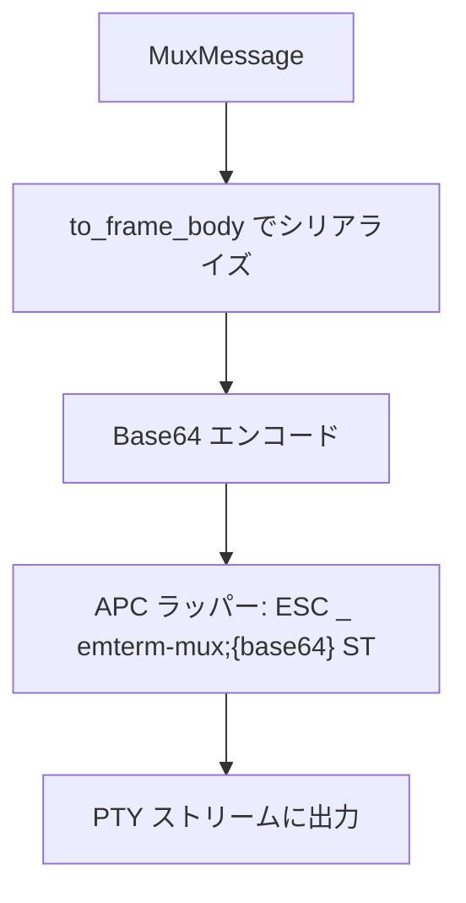
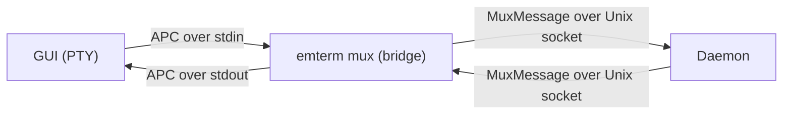

# Mux Inband Protocol - 要件定義書

## 1. 概要

### 1.1 背景
現在のeMterm muxは、GUIとdaemon間の通信にUnixソケット直接接続を使用している。この方式ではSSH越しの利用時にGUIからリモートのdaemonへ直接接続できず、別途ソケット転送等の仕組みが必要となる。

### 1.2 目的
PTYストリーム上のAPC (Application Program Command) エスケープシーケンスを使用したインバンド通信プロトコルを実装し、ローカル・SSH越しともに同一のデータパスで mux 通信を実現する。

### 1.3 スコープ
- APC エスケープシーケンスによるインバンドプロトコルの実装
- `emterm mux` コマンドをブリッジプロセスとして再構成
- GUI側のTauri IPC経由 mux通信 (bridge.rs) を削除し、PTYストリーム経由に置き換え
- 環境変数によるレガシーモード (Unixソケット直接接続) のフォールバック

## 2. ビジネス要件

### 2.1 ビジネス目標
SSH越しのリモートターミナルマルチプレクサ利用を、追加設定なしで実現する。

### 2.2 対象ユーザー
| ユーザータイプ | 説明 |
|----------------|------|
| ローカルユーザー | eMterm をローカルで mux 付きで使用するユーザー |
| リモートユーザー | SSH経由でリモートサーバー上の eMterm mux を使用するユーザー |

### 2.3 期待される効果
- SSH越しでも mux 機能がシームレスに動作する
- ローカル/リモートで同一のアーキテクチャで動作する
- bridge.rs (Tauri IPC) の削除による GUI 側コードの簡素化

## 3. ユースケース

### 3.1 ユースケース一覧
| ID | ユースケース名 | アクター | 優先度 |
|----|----------------|----------|--------|
| UC01 | ローカル mux セッション開始 | ローカルユーザー | 高 |
| UC02 | SSH越し mux セッション開始 | リモートユーザー | 高 |
| UC03 | セッションのデタッチ | ユーザー | 高 |
| UC04 | セッションへのリアタッチ | ユーザー | 高 |
| UC05 | SSH切断後のリアタッチ | リモートユーザー | 高 |
| UC06 | レガシーモードでの接続 | ユーザー | 低 |

### 3.2 ユースケース詳細

#### UC01: ローカル mux セッション開始

**アクター**: ローカルユーザー

**事前条件**:
- eMterm がインストールされている

**基本フロー**:
1. GUI が `emterm mux` をシェルコマンドとして PTY 上で起動する
2. ブリッジプロセスが daemon に Unix ソケットで接続する (daemon がなければ起動)
3. ブリッジプロセスが stdin から APC メッセージを受信し、daemon へ転送する
4. daemon からの応答をブリッジプロセスが APC エスケープシーケンスとして stdout に出力する
5. GUI が PTY ストリームから APC を解析し、mux 制御メッセージとして処理する

**事後条件**:
- mux セッションが確立され、ペイン内でシェルが動作している

#### UC02: SSH越し mux セッション開始

**アクター**: リモートユーザー

**事前条件**:
- リモートサーバーに emterm バイナリがインストールされている

**基本フロー**:
1. GUI が SSH 経由で `emterm mux` をリモートで実行する
2. リモート側のブリッジプロセスがリモートの daemon に Unix ソケットで接続する
3. 以降の通信は UC01 と同一 (APC over PTY/SSH)

**事後条件**:
- リモート mux セッションが確立されている

#### UC03: セッションのデタッチ

**アクター**: ユーザー

**事前条件**:
- mux セッションがアタッチされている

**基本フロー**:
1. ユーザーがデタッチ操作を行う
2. GUI が APC で Detach メッセージを送信する
3. ブリッジプロセスが daemon に転送する
4. daemon がデタッチを処理し、応答を返す
5. ブリッジプロセスが終了する

**事後条件**:
- daemon はセッションを維持したまま動作を継続する

#### UC04: セッションへのリアタッチ

**アクター**: ユーザー

**事前条件**:
- デタッチ済みのセッションが daemon 上に存在する

**基本フロー**:
1. GUI が `emterm mux` を起動する
2. ブリッジプロセスが daemon に接続し、Hello/Welcome ハンドシェイクを行う
3. Welcome メッセージで既存セッション一覧を受信する
4. GUI が APC で Attach メッセージを送信する
5. daemon がリングバッファからスナップショットを送信する
6. セッションが復元される

**事後条件**:
- 以前の画面状態が復元され、セッションが再開される

#### UC05: SSH切断後のリアタッチ

**アクター**: リモートユーザー

**事前条件**:
- SSH 接続が切断され、ブリッジプロセスが終了している
- daemon はリモートサーバー上で動作を継続している

**基本フロー**:
1. ユーザーが SSH で再接続する
2. `emterm mux` を再実行する
3. UC04 と同一フローでリアタッチする

**事後条件**:
- セッションが復元される

#### UC06: レガシーモードでの接続

**アクター**: ユーザー

**事前条件**:
- 環境変数でレガシーモードが指定されている

**基本フロー**:
1. 環境変数の設定により、従来の Unix ソケット直接接続で動作する

**事後条件**:
- 従来方式で mux が動作する

## 4. 機能要件

### 4.1 機能一覧
| ID | 機能名 | 説明 | 優先度 |
|----|--------|------|--------|
| F01 | APC インバンドプロトコル | PTY ストリーム上の APC エスケープシーケンスで mux メッセージを伝送する | 高 |
| F02 | ブリッジプロセス | `emterm mux` を APC ↔ Unix ソケット変換ブリッジとして実装する | 高 |
| F03 | GUI APC 送受信 | GUI が PTY ストリーム経由で APC メッセージを送受信する | 高 |
| F04 | bridge.rs 削除 | Tauri IPC 経由の mux 通信コードを削除する | 高 |
| F05 | レガシーモードフォールバック | 環境変数で従来の Unix ソケット直接接続に切り替え可能にする | 低 |
| F06 | feature gate 解除 | mux コードを `feature = "gui"` ゲートから解放する | 高 |

### 4.2 機能詳細

#### F01: APC インバンドプロトコル

**説明**: 既存の MuxMessage フレーム (type + pane_id + payload) を Base64 エンコードし、APC エスケープシーケンスで包んで PTY ストリーム上で伝送する。

**フォーマット**:
```
ESC _ emterm-mux;<base64(MuxMessage frame body)> ST
```

**処理フロー**:


#### F02: ブリッジプロセス

**説明**: `emterm mux` コマンドがブリッジプロセスとして動作する。stdin から APC メッセージを読み取り、daemon への Unix ソケット通信に変換する。daemon からの応答は APC として stdout に出力する。

**処理フロー**:


**ライフサイクル**:
- stdin の EOF 検出時にクリーンに終了する
- daemon は独立プロセスとして存続する

#### F03: GUI APC 送受信

**説明**: GUI は PTY ストリームから APC を解析し (WASM パーサーが既に対応)、mux 制御メッセージを処理する。制御メッセージ送信時は APC を PTY stdin に書き込む。通常のキー入力は直接 PTY stdin に送信する。

#### F04: bridge.rs 削除

**説明**: `src-tauri/src/mux/bridge.rs` の Tauri IPC コマンド (mux_connect, mux_handshake 等) を削除する。GUI は PTY ストリーム APC 経由で通信する。

#### F05: レガシーモードフォールバック

**説明**: 環境変数の設定により、従来の Unix ソケット直接接続モードにフォールバック可能とする。比較・デバッグ用途。

#### F06: feature gate 解除

**説明**: mux コードを `feature = "gui"` ゲートから解放し、CLI-only ビルドでも daemon とブリッジプロセスを実行可能にする。

## 5. 非機能要件

### 5.1 パフォーマンス要件
- 体感できる遅延がないこと (具体的な数値目標なし)
- 通常の PTY 出力に対する APC パース処理のオーバーヘッドが無視できること

### 5.2 セキュリティ要件
- Unix ソケット通信のパーミッションは既存実装と同一
- APC メッセージの不正データに対する適切なバリデーション

### 5.3 可用性要件
- daemon が独立プロセスとして存続し、ブリッジの死亡に影響されないこと
- SSH 切断時にブリッジがクリーンに終了し、daemon セッションを維持すること

### 5.4 保守性要件
- 既存のプロジェクトログ規約に従ったログ出力

### 5.5 互換性要件
- 環境変数によるレガシーモードフォールバック
- 既存の CLI コマンド (mux ls, mux kill 等) は変更なし (Unix ソケット直接通信)

## 6. UI/UX要件

### 6.1 画面設計要件
GUI 側の既存機能 (コピーモード、ドラッグリサイズ、ステータスバー、ペイン分割、ウィンドウ管理) に変更なし。

## 7. データ要件

### 7.1 プロトコルメッセージ

既存の MuxMessage フレームフォーマットを再利用する:

```
Frame body: [type: u8][pane_id: u32][payload: variable]
```

APC ラッパー:
```
ESC _ emterm-mux;<base64(frame body)> ST
```

### 7.2 メッセージタイプ一覧
| Type ID | メッセージ名 | 方向 | 説明 |
|---------|-------------|------|------|
| 0x01 | PtyOutput | daemon → GUI | PTY 出力データ |
| 0x02 | PtyInput | GUI → daemon | キー入力データ |
| 0x03 | Hello | GUI → daemon | ハンドシェイク要求 |
| 0x04 | Welcome | daemon → GUI | ハンドシェイク応答 |
| 0x05 | CreatePane | GUI → daemon | ペイン作成要求 |
| 0x06 | PaneCreated | daemon → GUI | ペイン作成応答 |
| 0x07 | DestroyPane | GUI → daemon | ペイン削除要求 |
| 0x08 | Resize | GUI → daemon | リサイズ要求 |
| 0x09 | Attach | GUI → daemon | セッションアタッチ |
| 0x0A | Detach | GUI → daemon | セッションデタッチ |
| 0x0B | Detached | daemon → GUI | デタッチ通知 |
| 0x0C | Snapshot | daemon → GUI | スナップショットデータ |
| 0x0D | SnapshotRestore | daemon → GUI | スナップショット復元 |
| 0x0E | SessionList | daemon → GUI | セッション一覧 |
| 0x0F | Error | daemon → GUI | エラー通知 |
| 0x10 | PtyExited | daemon → GUI | PTY 終了通知 |
| 0x11 | SplitPane | GUI → daemon | ペイン分割要求 |
| 0x12 | CreateWindow | GUI → daemon | ウィンドウ作成要求 |
| 0x13 | SwitchWindow | GUI → daemon | ウィンドウ切替要求 |
| 0x14 | RenameWindow | GUI → daemon | ウィンドウ名変更要求 |
| 0x15 | DestroyWindow | GUI → daemon | ウィンドウ削除要求 |
| 0x16 | StatusUpdate | daemon → GUI | ステータス更新通知 |

## 8. 外部連携

### 8.1 連携システム
| システム名 | 連携方法 | データ |
|------------|----------|--------|
| SSH | PTY ストリーム透過 | APC エスケープシーケンス |

## 9. 制約条件

### 9.1 技術的制約
- リモート側に emterm バイナリのインストールが必要
- 同一セッションへの複数クライアント同時接続は不可 (現仕様)
- tmux パススルーサポートは不要 (eMterm mux が tmux の代替)

### 9.2 ビジネス上の制約
- なし

## 10. 想定される課題とリスク

### 10.1 技術的課題
| 課題 | 影響度 | 対応策 |
|------|--------|--------|
| APC 内の Base64 データに ST (ESC \) が含まれるリスク | 低 | Base64 エンコードにより ESC は出現しない |
| 大量 PTY 出力時のブリッジスループット | 中 | パフォーマンステストで確認 |

## 11. 成功基準

### 11.1 受け入れ基準
- [ ] ローカルで `emterm mux` 経由の mux セッションが動作する
- [ ] SSH 越しで `emterm mux` 経由の mux セッションが動作する
- [ ] デタッチ・リアタッチが正常に動作する
- [ ] SSH 切断後のリアタッチが動作する
- [ ] 既存の GUI 機能 (ペイン分割、ウィンドウ管理等) が動作する
- [ ] bridge.rs が削除されている
- [ ] 環境変数でレガシーモードに切り替え可能
- [ ] 体感できるパフォーマンス劣化がない
- [ ] 既存の E2E テストが通過する

## 12. テストシナリオ

### 12.1 テスト観点
- [ ] 正常系: ローカル mux セッション確立・操作・デタッチ・リアタッチ
- [ ] 正常系: APC メッセージの正常なエンコード・デコード
- [ ] 正常系: ブリッジプロセスの正常起動・終了
- [ ] 異常系: ブリッジプロセスの異常終了時に daemon が存続する
- [ ] 異常系: 不正な APC メッセージの無視
- [ ] 境界値: 大きな PTY 出力データの APC ラッピング
- [ ] パフォーマンス: 通常操作で体感できる遅延がない

## 13. 用語定義

| 用語 | 定義 |
|------|------|
| APC | Application Program Command。ESC _ で開始し ST (ESC \) で終了するエスケープシーケンス |
| インバンド通信 | PTY データストリーム内にエスケープシーケンスとして制御メッセージを多重化する方式 |
| ブリッジプロセス | GUI と daemon の間で APC ↔ Unix ソケットプロトコルの変換を行うプロセス |
| daemon | バックグラウンドで動作し、PTY セッションを管理するプロセス |
| ST | String Terminator。ESC \ (0x1B 0x5C) のシーケンス |

## 14. 確認事項

### 14.1 確認済み事項

- [x] プロトコル方式: APC (ESC _ ... ST) によるインバンド通信
- [x] エンコーディング: MuxMessage frame body を Base64 エンコード
- [x] アーキテクチャ: GUI ← APC over PTY → bridge ← Unix socket → daemon
- [x] ローカル/SSH で同一アーキテクチャ
- [x] daemon は独立プロセスとして存続
- [x] 通常キー入力は直接 PTY stdin、制御メッセージのみ APC ラップ
- [x] daemon 側は APC をパースし制御メッセージとして処理、それ以外はアクティブペインのシェルに転送
- [x] デタッチ・リアタッチは必須機能
- [x] 同一セッションへの同時複数接続は不可
- [x] リモート側に emterm バイナリが必要
- [x] bridge.rs (Tauri IPC) は削除
- [x] 環境変数でレガシーモードにフォールバック可能
- [x] tmux パススルーサポートは不要
- [x] feature = "gui" ゲートから解放 (新規 feature flag 不要)
- [x] パフォーマンス要件: 体感できる遅延がないこと

### 14.2 未確認・保留事項
- なし

## 15. 参考資料

- 既存プロトコル実装: `src-tauri/src/mux/ipc/protocol.rs`
- 既存ブリッジ実装 (削除対象): `src-tauri/src/mux/bridge.rs`
