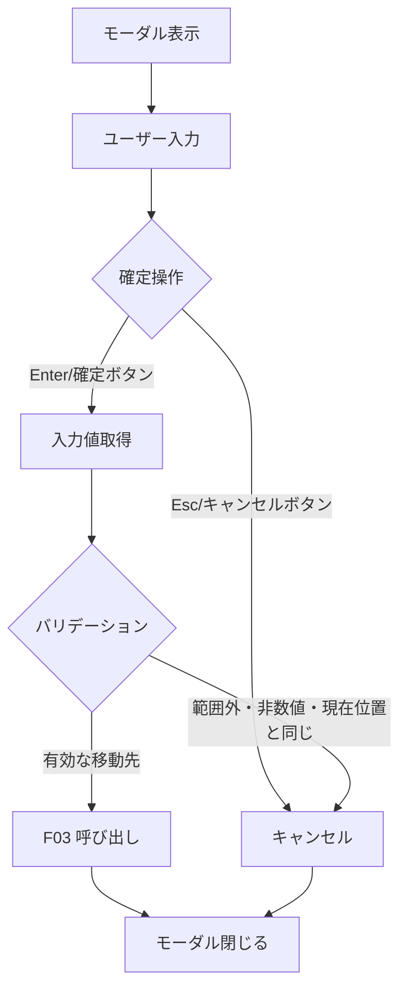
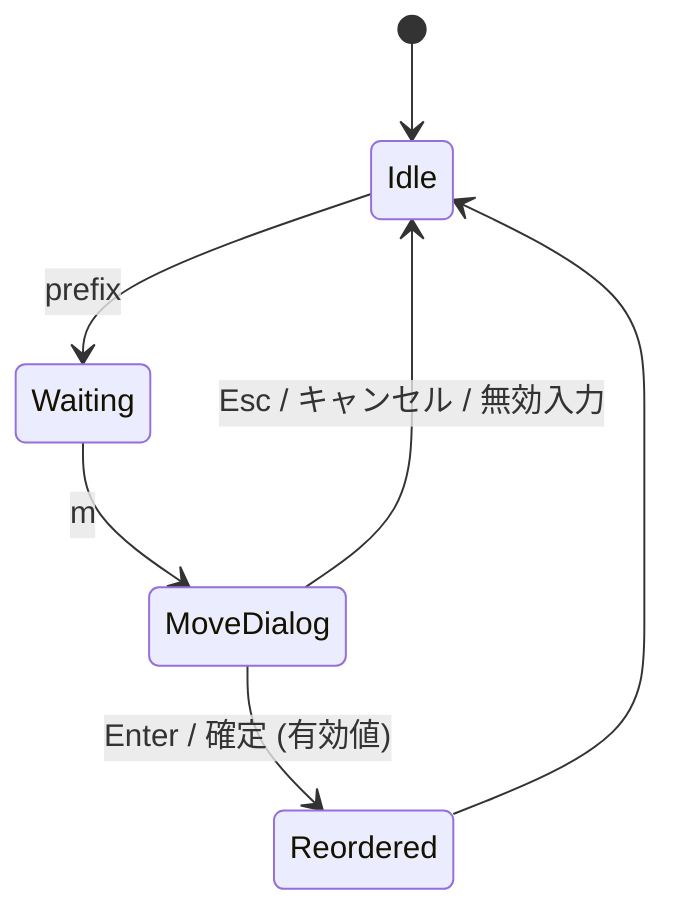

# mux ウィンドウ並び順変更 (move-window) - 要件定義書

## 1. 概要

### 1.1 背景
- mux タブをドラッグ&ドロップすると mux タブ全体（グループ）が移動し、mux 内の個別ウィンドウの並び替えができない。
- 並び替えを行うための代替手段が現状存在しない。

### 1.2 目的
- 現在アクティブな mux ウィンドウを、指定した位置へ並び替える手段をキーバインドで提供する。

### 1.3 スコープ
- mux モード内のウィンドウ並び順変更機能の追加。
- 関連するフロントエンド UI（モーダルダイアログ、タブラベル番号表示）。
- バックエンドのセッション状態更新および IPC メッセージ拡張。

**スコープ外**:
- mux ウィンドウのドラッグ&ドロップによる並び替え UI。
- 0-origin への切替オプション。
- screen 互換の `:number` コマンドプロンプト。

## 2. ビジネス要件

### 2.1 ビジネス目標
- mux の基本ウィンドウ管理機能を揃え、タブ運用の自由度を高める。

### 2.2 対象ユーザー
| ユーザータイプ | 説明 |
|----------------|------|
| mux 利用者 | prefix キーを使って複数ウィンドウを管理するユーザー |

### 2.3 期待される効果
- 任意の位置へウィンドウを再配置できる。
- キーボードのみで完結する操作フローを維持できる。

## 3. ユースケース

### 3.1 ユースケース一覧
| ID | ユースケース名 | アクター | 優先度 |
|----|----------------|----------|--------|
| UC01 | アクティブウィンドウを指定番号へ移動 | mux 利用者 | 高 |

### 3.2 ユースケース詳細

#### UC01: アクティブウィンドウを指定番号へ移動

**アクター**: mux 利用者

**事前条件**:
- mux モードに attach 済み。
- セッションに 1 個以上の mux ウィンドウが存在する。

**基本フロー**:
1. ユーザーが prefix キー (`Ctrl+B`) を押す。
2. 続けて `m` キーを押す。
3. アプリが番号入力モーダルを表示する。
4. ユーザーが 1 以上の整数を入力する。
5. ユーザーが Enter キーを押して確定する。
6. アプリがモーダルを閉じる。
7. アプリがアクティブウィンドウを指定位置へ移動する（insert/move セマンティクス）。
8. タブバーが新しい並び順で再描画される。

**代替フロー**:
- ユーザーが Esc キーを押す → モーダルを閉じ、並び順は変更しない。
- ユーザーが「キャンセル」ボタンを押す → モーダルを閉じ、並び順は変更しない。
- ユーザーが範囲外 (1 未満、または現ウィンドウ数超過) の数値を入力して確定 → 並び順は変更せずモーダルを閉じる。
- ユーザーが非数値を入力して確定 → 並び順は変更せずモーダルを閉じる。
- ユーザーが現在のウィンドウ位置と同じ番号を入力して確定 → 並び順は変更せずモーダルを閉じる。

**事後条件**:
- アクティブウィンドウが指定位置に配置される。
- アクティブウィンドウは引き続き active 状態を維持する。

## 4. 機能要件

### 4.1 機能一覧
| ID | 機能名 | 説明 | 優先度 |
|----|--------|------|--------|
| F01 | move-window キーバインド | prefix+m で番号入力モーダルを開く | 高 |
| F02 | 番号入力モーダル | 移動先番号を 1-origin で入力する UI | 高 |
| F03 | insert/move 並び替え | tmux `move-window -t N` 相当のセマンティクス | 高 |
| F04 | タブラベル番号表示 | 各 mux ウィンドウのタブ先頭に `[N]` を表示 | 高 |
| F05 | バックエンド move_window | セッション状態のウィンドウ順序を更新 | 高 |

### 4.2 機能詳細

#### F01: move-window キーバインド

**説明**: prefix キーに続けて `m` キーを押すと、アクティブウィンドウの移動モーダルを開く。

**入力**:
- prefix キー: `Ctrl+B` (設定可能)
- アクションキー: `m` (デフォルト)

**出力**:
- F02 のモーダル表示

**ビジネスルール**:
- 既存アクションキー (`d/c/n/p/,`) と衝突しないこと。
- `MuxAction` 型に `{ type: "move-window" }` を追加する。
- `DEFAULT_ACTION_BINDINGS` に `"move-window": "m"` を追加する。

#### F02: 番号入力モーダル

**説明**: 移動先位置番号を入力するモーダルダイアログ。

**入力**:
- 数値文字列 (1-origin)

**出力**:
- 確定: 入力された数値
- キャンセル: 何も返さない

**処理フロー**:

**ビジネスルール**:
- 既存の `rename-window-dialog.ts` と同じ `sftp-dialog-*` スタイルを流用する。
- Enter で確定、Esc でキャンセル。
- IME composition 中の Enter は確定に使わない (`e.isComposing || e.keyCode === 229` ガード)。
- 入力中は input 要素にフォーカスと選択状態を設定する。
- モーダル閉鎖時に直前のフォーカス要素にフォーカスを戻す。

**バリデーション**:
| 項目 | ルール | 挙動 |
|------|--------|------|
| 入力値 | 整数かつ 1 以上 ウィンドウ総数以下 | 有効 → 並び替え実行 |
| 入力値 | 非数値、範囲外、空文字 | キャンセル扱いで閉じる |
| 入力値 | 現在位置と同じ番号 | キャンセル扱いで閉じる |

**エラーケース**:
| エラー | 条件 | 対応 |
|--------|------|------|
| 無効入力 | バリデーションに失敗 | エラー表示せずモーダルを閉じる |

**i18n キー**:
- `mux.moveDialog.title`
- `mux.moveDialog.label`
- `mux.moveDialog.cancel`
- `mux.moveDialog.confirm`

#### F03: insert/move 並び替え

**説明**: tmux `move-window -t N` と同じ insert/move セマンティクスでウィンドウを並び替える。

**入力**:
- 対象ウィンドウ ID
- 移動先位置 (0-based index、UI 層で 1-origin から変換)

**出力**:
- 新しい並び順でのウィンドウリスト

**ビジネスルール**:
- swap（交換）ではなく insert/move（抜き出して挿入）である。
- 例: `[A, B, C, D]` で B を 4 (1-origin) に移動 → `[A, C, D, B]`。
- 例: `[A, B, C, D]` で D を 1 (1-origin) に移動 → `[D, A, B, C]`。
- 移動後もアクティブウィンドウは変わらず、同じウィンドウが active を維持する。

#### F04: タブラベル番号表示

**説明**: タブバー上の各 mux ウィンドウラベル先頭に 1-origin の番号 `[N]` を付加して表示する。

**ビジネスルール**:
- 先頭が `[1]` (1-origin)。
- mux ウィンドウが 1 個の場合も番号を表示する (mux タブであることの視覚的識別)。
- 番号部分はメインのタブフォントより小さめ (約 `0.85em`、実装者判断)。
- 番号の表記は `[N] タイトル` の形式（番号とタイトルの間に半角スペース）。

#### F05: バックエンド move_window

**説明**: セッション状態上でウィンドウ順序を変更する Rust 側 API。

**入力**:
- `window_id: WindowId`
- `target_index: usize` (0-based)

**出力**:
- 成否を示す値 (`bool` または `Option<()>`)

**ビジネスルール**:
- `src-tauri/src/mux/session/session.rs` の `MuxSession` に `move_window` メソッドを追加する。
- IPC ハンドラまたは Tauri コマンドを経由してフロントから呼び出す (具体経路は SPEC.md で決定)。
- 並び替え後、既存のウィンドウ状態更新通知経路 (例: StatusUpdate / SessionList 再送) で UI 側へ反映する。
- アクティブウィンドウ (`active_window_id`) は変更しない。

## 5. 非機能要件

### 5.1 パフォーマンス要件
- モーダル表示からキー入力受付までの遅延はユーザーが知覚できない範囲 (既存の rename モーダルと同等)。
- 並び替え操作の完了は 200ms 以内を目安とする。

### 5.2 セキュリティ要件
- 入力値はクライアント側で整数バリデーションを行い、バックエンドへは範囲検証済みの値のみを送信する。

### 5.3 可用性要件
- 並び替え操作に失敗した場合でも既存のウィンドウ状態を破壊しない。

### 5.4 保守性要件
- 既存 `rename-window-dialog.ts` のパターンに従うことでコードの一貫性を維持する。
- ログは既存の `muxLog` を経由して出力する。

### 5.5 互換性要件
- Linux / Windows 両対応。
- 既存の `DEFAULT_ACTION_BINDINGS` および custom 設定と競合しない。

## 6. UI/UX要件

### 6.1 画面設計要件
- モーダルは `sftp-dialog-overlay` / `sftp-dialog` クラス群を再利用する。
- ボタン配置は rename ダイアログと同じ（左: キャンセル、右: 確定）。
- mux タブラベルは先頭に小さめの番号バッジを表示する。

### 6.2 画面遷移

### 6.3 レスポンシブ対応
- 対象外（デスクトップアプリ）。

## 7. データ要件

### 7.1 データモデル概要
既存の `MuxSession` / `MuxWindow` 構造体を利用する。

### 7.2 データ項目
| エンティティ | 項目名 | 型 | 必須 | 説明 |
|--------------|--------|-----|------|------|
| MuxSession | windows | 順序付きコレクション | ○ | 並び順を保持する |
| MoveWindowMsg | target_index | u32 | ○ | 0-based の移動先位置 |

### 7.3 データ保持期間
- ウィンドウ順序はセッション存続期間中保持される。

## 8. 外部連携
- なし。

## 9. 制約条件

### 9.1 技術的制約
- `src-tauri/src/mux/session/session.rs` の `MuxSession.windows` は現状 `BTreeMap<WindowId, MuxWindow>` で、キー順 (WindowId 昇順) に固定されている。insert/move を実現するには順序情報を別途保持する必要がある。
- 既存の `WindowInfo` / `SessionInfo` IPC 型は順序を Vec で表現している。

### 9.2 ビジネス上の制約
- 既存のキーバインドと衝突しないキーを選ぶ必要がある。

### 9.3 スケジュール制約
- なし。

## 10. 想定される課題とリスク

### 10.1 技術的課題
| 課題 | 影響度 | 対応策 |
|------|--------|--------|
| `BTreeMap` はキー順で並び順が固定 | 高 | `MuxSession` に順序 `Vec<WindowId>` を追加するか、格納構造自体を順序付きに変更する |
| フロントとバックの並び順同期 | 中 | 既存のウィンドウ状態更新イベント経路を利用 |

### 10.2 ビジネスリスク
| リスク | 発生確率 | 影響度 | 対応策 |
|--------|----------|--------|--------|
| 番号表示でタブ幅が増えて既存レイアウトに影響 | 低 | 低 | 番号を `0.85em` 程度で表示し、影響を最小化する |

## 11. 成功基準

### 11.1 受け入れ基準
- [ ] prefix+m でモーダルが表示される。
- [ ] 有効な番号で確定するとウィンドウ順序が insert/move セマンティクスで変更される。
- [ ] 無効入力・Esc・キャンセルで順序が変更されない。
- [ ] タブラベル先頭に 1-origin の番号 `[N]` が表示される（ウィンドウ 1 個でも表示）。
- [ ] Linux / Windows 両方で動作する。

### 11.2 KPI
- 対象外。

## 12. テストシナリオ

### 12.1 テスト観点
- [ ] 正常系: 先頭/末尾/中間への移動。
- [ ] 異常系: 範囲外・非数値・現在位置と同じ番号。
- [ ] 境界値: `[1]`・`[N]` (総数) への移動、単一ウィンドウ時の挙動。
- [ ] UI: モーダルの Enter/Esc/ボタン、IME 中 Enter の扱い。
- [ ] 並び替え後の active 状態の保全。
- [ ] タブラベル番号表示の正確性。

## 13. 用語定義

| 用語 | 定義 |
|------|------|
| prefix | mux 操作のための前置キー (デフォルト `Ctrl+B`) |
| mux ウィンドウ | 1 つの mux セッション内の論理ウィンドウ |
| insert/move | 要素を抜き出して指定位置に挿入する並び替え操作 |
| 1-origin | 先頭要素を 1 から数える番号付け |

## 14. 確認事項

### 14.1 確認済み事項
- [x] キーバインド: デフォルト `prefix + m` (= `Ctrl+B` → `m`)
- [x] 番号方式: 1-origin (UI 層で 0-based に変換)
- [x] 並び替えセマンティクス: insert/move (tmux `move-window -t N` 相当、swap ではない)
- [x] モーダル: 既存 `rename-window-dialog.ts` の `sftp-dialog-*` パターンを踏襲、Enter 確定、Esc キャンセル、IME 対応
- [x] 新規ファイル: `src/terminal-app/mux/move-window-dialog.ts`
- [x] i18n キー: `mux.moveDialog.{title,label,cancel,confirm}` を `src/i18n/locales/{en,ja}.json` に追加
- [x] タブ表示: 先頭に `[N] title` 形式、ウィンドウ 1 個でも表示、`0.85em` 程度
- [x] 無効入力: 範囲外・非数値・現在位置と同じ番号 → キャンセル扱い（エラー表示も再入力もなし）
- [x] バックエンド: `src-tauri/src/mux/session/session.rs` に `move_window(window_id, target_index)` を追加
- [x] IPC 経路: 既存の `RenameWindow` と同じく `MuxMessageType` に新規メッセージを追加する方針（具体設計は SPEC.md）
- [x] 並び替え後の UI 反映: 既存のウィンドウ更新イベント経路を利用

### 14.2 未確認・保留事項
- なし。

## 15. 参考資料

- 既存 rename 実装: `src/terminal-app/mux/rename-window-dialog.ts`
- 既存 prefix-key 実装: `src/terminal/mux/prefix-key.ts`
- IPC プロトコル: `src-tauri/src/mux/ipc/protocol.rs`
- セッション状態: `src-tauri/src/mux/session/session.rs`
- UI デザインガイド: `doc/UI-DESIGN-GUIDELINES.yaml`
