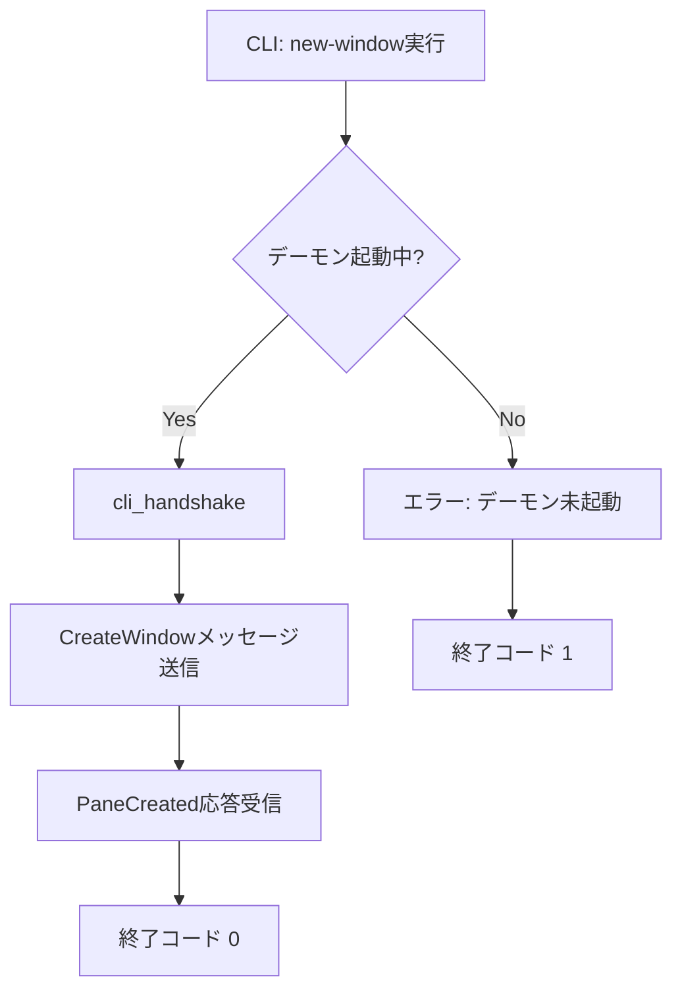

# mux new-window CLIコマンド - 要件定義書

## 1. 概要

### 1.1 背景
tmuxでは起動スクリプトで複数ウィンドウを作成し、初期コマンドを実行するワークフローが一般的。eMterm muxでも同等のワークフローを実現する必要がある。

### 1.2 目的
CLIから既存muxセッションに新しいウィンドウを作成し、オプションで初期コマンドを実行する。

### 1.3 スコープ
- `emterm mux new-window` サブコマンドの追加
- IPCプロトコルへの初期コマンドフィールド追加
- デーモン側のウィンドウ作成ハンドラ拡張

## 2. ビジネス要件

### 2.1 ビジネス目標
ログイン後のワークスペース構築を自動化可能にする。

### 2.2 対象ユーザー
| ユーザータイプ | 説明 |
|----------------|------|
| パワーユーザー | シェルスクリプトでワークスペースを自動構築するユーザー |

### 2.3 期待される効果
- シェルスクリプトによるワークスペース自動構築
- tmuxからの移行コスト削減

## 3. ユースケース

### 3.1 ユースケース一覧
| ID | ユースケース名 | アクター | 優先度 |
|----|----------------|----------|--------|
| UC01 | スクリプトからウィンドウ作成 | ユーザー | 高 |
| UC02 | 名前付きウィンドウ作成 | ユーザー | 高 |
| UC03 | 初期コマンド付きウィンドウ作成 | ユーザー | 高 |

### 3.2 ユースケース詳細

#### UC01: スクリプトからウィンドウ作成

**アクター**: ユーザー

**事前条件**:
- muxデーモンが起動中
- muxセッションにアタッチ済み（eMterm内で実行）

**基本フロー**:
1. ユーザーがシェルスクリプトで `emterm mux new-window` を実行
2. CLIがデーモンにCreateWindowメッセージを送信
3. デーモンがPTYを生成しウィンドウを作成
4. GUIがウィンドウをタブバーに追加

**代替フロー**:
- デーモン未起動: エラーメッセージを表示して終了

**事後条件**:
- 新しいウィンドウがアクティブセッションに追加される

#### UC02: 名前付きウィンドウ作成

**基本フロー**:
1. `emterm mux new-window -n editor` を実行
2. 指定した名前でウィンドウが作成される
3. タブバーに指定名が表示される

#### UC03: 初期コマンド付きウィンドウ作成

**基本フロー**:
1. `emterm mux new-window -c "nvim"` を実行
2. ウィンドウ作成後、シェルに対してコマンド文字列 + 改行がPTYに書き込まれる
3. コマンドが実行される

## 4. 機能要件

### 4.1 機能一覧
| ID | 機能名 | 説明 | 優先度 |
|----|--------|------|--------|
| F01 | new-windowサブコマンド | CLIにnew-windowサブコマンドを追加 | 高 |
| F02 | ウィンドウ名指定 | `-n` / `--name` オプション | 高 |
| F03 | 初期コマンド実行 | `-c` / `--command` オプション | 高 |
| F04 | IPC拡張 | CreateWindowメッセージに名前・コマンドフィールド追加 | 高 |

### 4.2 機能詳細

#### F01: new-windowサブコマンド

**説明**: `emterm mux new-window` コマンドを追加

**入力**:
- `-n`, `--name`: String (任意) - ウィンドウ名
- `-c`, `--command`: String (任意) - 初期コマンド

**出力**:
- 成功: 終了コード 0
- 失敗: stderrにエラーメッセージ、終了コード 1

**処理フロー**:


#### F03: 初期コマンド実行

**説明**: `-c` で指定された文字列をプレーンテキストとしてPTYに書き込む（末尾に `\n` 付加）

**ビジネスルール**:
- コマンド文字列はそのままPTYに書き込む（特殊キー名の解釈はしない）
- 末尾に改行文字 (`\n`) を付加する
- コマンドはPTY生成後、シェルプロンプトの準備を待つため短いディレイ後に送信する

**エラーケース**:
| エラー | 条件 | 対応 |
|--------|------|------|
| デーモン未起動 | ソケットファイルが存在しない | stderr出力、終了コード 1 |
| 接続失敗 | デーモンが応答しない | stderr出力、終了コード 1 |

## 5. 非機能要件

### 5.1 パフォーマンス要件
- コマンド実行時間: 1秒以内

### 5.2 互換性要件
- Linux / Windows 対応
- Windows: Unix domain socketの代替としてnamed pipeを使用（既存のCLIパターンに従う）

## 6. UI/UX要件

### 6.1 CLIインターフェース

```
emterm mux new-window [OPTIONS]

OPTIONS:
  -n, --name <NAME>        Window name (displayed in tab bar)
  -c, --command <COMMAND>   Initial command to run
```

**使用例**:
```bash
emterm mux new-window
emterm mux new-window -n editor -c "nvim"
emterm mux new-window -n server -c "cd ~/project && bun dev"
emterm mux new-window -n shell
```

## 7. データ要件

### 7.1 IPCメッセージ拡張

CreateWindowメッセージのペイロードに以下のフィールドを追加:
- `name`: Option<String> - ウィンドウ名（未指定時は "shell"）
- `command`: Option<String> - 初期コマンド

## 8. 制約条件

### 8.1 技術的制約
- CLI は同期I/O（`std::os::unix::net::UnixStream`）を使用
- 既存の `cli_handshake()` パターンに従う
- CLIクライアントはhandshake後すぐ切断される現在の設計を拡張する必要がある

### 8.2 プラットフォーム制約
- Unix: UnixStream
- Windows: `#[cfg(windows)]` ガード付き実装（既存パターンに従う）

## 9. 成功基準

### 9.1 受け入れ基準
- [ ] `emterm mux new-window` でウィンドウが作成される
- [ ] `-n` でウィンドウ名が設定される
- [ ] `-c` で初期コマンドが実行される
- [ ] デーモン未起動時にエラーメッセージが表示される
- [ ] 既存のRust/TypeScriptテストが通る

## 10. 確認事項

### 10.1 確認済み事項
- [x] `-c` はプレーンテキストのみ（tmuxのような特殊キー名は不要）
- [x] ウィンドウ作成はmuxセッション内から実行（eMterm内からCLI実行）
- [x] デーモン未起動時はエラーで終了
- [x] `send-keys` は不要（`-c` で代替）

### 10.2 未確認・保留事項
- なし
