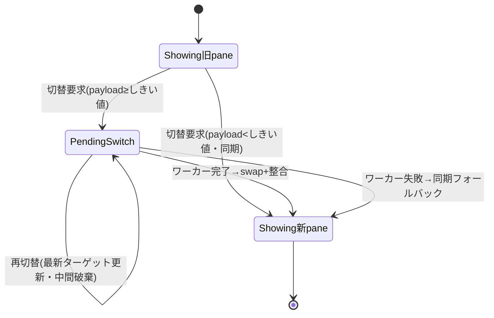

# mux 切替時 snapshot 再パースの off-thread 化（案a） - 要件定義書

## 1. 概要

### 1.1 背景

`mux-scroll-isolation` の FR1（commit `e8e538f`）で、オンデマンド `RequestPaneSnapshot` の
応答に pane の scrollback（最大約 2 MiB、実履歴量に比例）を載せるようにした。クライアントは
この snapshot を受信すると `reset_and_replay` → `process_pty_data_fully` で payload 全バイトを
**同期 VT 再パース**する。これは `App::pump_all`＝winit イベントループ（UI/描画スレッド）から
走る。

release 実機計測（lto, 2026-06-18, `doc/tasks/mux-snapshot-reparse-offthread/VERIFICATION_RESULT.md`）:

| サイズ | 所要 | スループット |
|--------|------|--------------|
| 256 KiB | 30.1 ms | 8.3 MiB/s |
| 1 MiB | 116.6 ms | 8.6 MiB/s |
| 2 MiB | 232.5 ms | 8.6 MiB/s |

設計メモ §4 のしきい値（<5 / 5–50 / 50+ ms）の 50ms+ を大きく超過したため、案a 本実装は GO 判断
済み。履歴の多い pane へ切り替えるたびに UI スレッドが 100–230ms ブロックし、`Ctrl+B n n n` の
高速切替で体感ジャンクが積み上がる。

### 1.2 目的

重い VT 再パースをワーカースレッドで行い、完成した `TerminalCore` をメインスレッドで差し替える
ことで、pane/window 切替時に UI/描画スレッドをブロックさせない。

### 1.3 スコープ

- 対象: snapshot payload の off-thread 再パース、メインスレッドでの swap、ライブ出力の順序保証、
  marks/folds/selection 整合、per-pane scroll 復元。
- 対象外: 直近 K pane の LRU キャッシュ（本 feature では不採用）、案c（pane 毎常駐 core・全面再設計、
  不採用）、WebView（`src/`）の変更。

## 2. ビジネス要件

### 2.1 ビジネス目標

AI 時代に「使える」ターミナルとして、tmux 比で改善した mux 操作の体感を、履歴の多い pane でも
維持する。高速 pane 切替で UI が詰まらないこと。

### 2.2 対象ユーザー

| ユーザータイプ | 説明 |
|----------------|------|
| mux ヘビーユーザー | 複数 pane を `Ctrl+B n` 等で高速に行き来する利用者 |
| AI コーディング利用者 | 長時間 Claude Code 等を動かし scrollback が貯まった pane を切り替える利用者 |

### 2.3 期待される効果

- pane/window 切替時の UI スレッドブロックを scrollback サイズに依存しない一定コストに抑える
- 切替直後の空白チラつきを無くす（または最小化）
- 既存の mux-scroll-isolation の不変条件（残留行なし・per-pane scroll 復元）を壊さない

## 3. ユースケース

### 3.1 ユースケース一覧

| ID | ユースケース名 | アクター | 優先度 |
|----|----------------|----------|--------|
| UC01 | 履歴の多い pane へ切り替える | ユーザー | 高 |
| UC02 | 高速に連続切替する | ユーザー | 高 |
| UC03 | パース中に新 pane へ出力が届く | システム | 高 |

### 3.2 ユースケース詳細

#### UC01: 履歴の多い pane へ切り替える

**アクター**: ユーザー

**事前条件**:
- 切替先 pane の scrollback がしきい値以上（例: ~2 MiB）

**基本フロー**:
1. ユーザーが pane/window 切替操作を行う
2. クライアントは daemon に `request_pane_snapshot` を送る（即時には core を reset しない）
3. snapshot 受信時、payload をコピーしてワーカースレッドへ渡す
4. ワーカーが現 grid サイズで新 `TerminalCore` を構築し `process_pty_data_fully` を実行
5. 完成 core をチャンネルで受け取り、次フレームの `pump_all` で `tab.core` を差し替える
6. marks/folds/selection 整合・per-pane scroll 復元・full redraw を行う

**代替フロー**:
- payload がしきい値未満なら、メインスレッドで従来どおり同期再パースして即 swap（UC01 を経由しない）

**事後条件**:
- 新 pane が表示され、UI スレッドは scrollback サイズに比例してブロックしていない

#### UC02: 高速に連続切替する

**アクター**: ユーザー

**事前条件**:
- ある pane の off-thread パースが進行中

**基本フロー**:
1. パース完了前にユーザーが次の pane へ切り替える
2. システムは最新ターゲットのみを適用対象とする
3. 中間ターゲットのパース結果は破棄し、ライブ出力キューも最新ターゲットへ追従させる
4. 最新ターゲットの core 完成時に swap する

**事後条件**:
- 中間 pane が一瞬たりとも表示されない
- 最新 pane だけが表示される

#### UC03: パース中に新 pane へ出力が届く

**アクター**: システム（daemon → クライアント）

**事前条件**:
- "pending switch" 状態（切替要求〜パース完了の間）

**基本フロー**:
1. daemon が新アクティブ pane のライブ出力（`PtyOutput`）を流し始める
2. クライアントはメインスレッド側のキューにバイトを積む（表示中の旧 core は変更しない）
3. swap 後、キューしたライブ bytes を到着順に適用する

**事後条件**:
- ライブ出力が欠落・順序乱れなく反映される

## 4. 機能要件

### 4.1 機能一覧

| ID | 機能名 | 説明 | 優先度 |
|----|--------|------|--------|
| F01 | off-thread 再パースと swap | ワーカーで core 構築・メインで差し替え | 高 |
| F02 | pending-switch 表示 | 完了まで旧 pane を表示 | 高 |
| F03 | ライブ出力の順序保証 | パース中の出力をキューし swap 後に順次適用 | 高 |
| F04 | サイズしきい値の fast path | 小 pane は同期再パースで即時切替 | 高 |
| F05 | 連続切替の supersession | 最新ターゲットのみ適用 | 高 |
| F06 | 整合処理の分割 | parse（ワーカー）と marks/folds/selection 整合（メイン） | 高 |
| F07 | ワーカー失敗時の同期フォールバック | 失敗/panic 時はメインで同期再パース | 中 |

### 4.2 機能詳細

各機能の確定挙動:

- **F01**: payload を1回コピーしてワーカーへ。ワーカーは現 cols/rows で `TerminalCore` を作り
  `process_pty_data_fully(payload)`。完成 core を channel で返し、メインの `pump_all` で swap。
  ワーカーは一回限りタスク（常駐不要）。
- **F02**: 切替要求〜swap の間は旧 pane を表示し続ける（空白を出さない）。
- **F03**: pending-switch 中に届く対象 pane のライブ `PtyOutput` はメインスレッドのキューに積み、
  swap 後に到着順で snapshot core の上に適用する。
- **F04**: payload が `OFFTHREAD_REPLAY_THRESHOLD_BYTES`（デフォルト 64 KiB ≈ 約 7ms）未満なら、
  従来どおりメインスレッドで同期再パースし即 swap（gap なし）。しきい値以上のみ off-thread。しきい値は
  名前付き定数。
- **F05**: パース進行中に新切替が来たら、最新ターゲットのみ適用。中間ターゲットの結果は破棄、ライブ
  キューは最新ターゲットへ追従。完了まで旧 pane を表示。中間 pane は一瞬も表示しない。
- **F06**: replay を「バイト→core のパース（ワーカー）」と「marks/folds/selection・アンカー整合
  ＋ per-pane scroll 復元（メイン・swap 後）」に分割。メイン側は既存 `reset_frame_for_replay` の
  セマンティクス（prompts/folds リセット、marks backfill / `pending_frame_reset` ラッチ、選択/
  アンカー drop）と FR3 scroll 復元経路を再現する。
- **F07**: ワーカー失敗/panic 時は当該切替をメインスレッドで同期再パース（従来経路）にフォールバック。
  稀な失敗時のみブロックを許容し正しさを優先。

**エラーケース**:

| エラー | 条件 | 対応 |
|--------|------|------|
| ワーカー panic / 失敗 | パース中に例外・channel 切断 | メインで同期再パース（F07） |
| パース中の再切替 | 完了前に別 pane へ切替 | 最新のみ適用、中間破棄（F05） |
| 切替中の resize | 要求〜swap の間に cols/rows 変化 | 切替時サイズで core 構築、現サイズで reconcile/redraw |

## 5. 非機能要件

### 5.1 パフォーマンス要件

- pane/window 切替で描画スレッドが scrollback サイズに比例してブロックしないこと。
- しきい値以上の切替の重いパースは UI スレッド外で実行され、切替起因の UI stall は履歴量に依存しない。
- しきい値未満（デフォルト 64 KiB ≈ 計測機で約 7 ms、1 フレーム 16.6ms 未満）は同期経路を維持し、
  小 pane の即時切替・gap なしを保つ。

### 5.2 セキュリティ要件

- 該当なし（ローカル端末内のデータ処理。新規の外部入力・認証経路は増えない）。

### 5.3 可用性要件

- ワーカー失敗時も同期フォールバックで切替自体は必ず完了する（F07）。

### 5.4 保守性要件

- ワーカー側パースは純関数（bytes + grid サイズ → `TerminalCore`）として切り出し、単体テスト可能に
  する。`pump_all` 経由の非同期テストを増やさない。
- ログ: 失敗フォールバック発生時は `warn` 以上で記録（release で残る）。

### 5.5 互換性要件

- `term_core` + `src-tauri` の変更は Linux/Windows GUI ビルドと CLI-only（`--no-default-features`）
  ビルドを green に保つ。off-thread 経路は GUI 限定。
- 非 mux タブ・単一ウィンドウ mux の挙動は変えない。

## 6. UI/UX要件

### 6.1 画面設計要件

- 切替直後は旧 pane を表示し、新 pane の core 完成後に差し替える。空白チラつきは無し、または最小。
- 中間 pane（連続切替時）は一切表示しない。

### 6.2 画面遷移

### 6.3 レスポンシブ対応

- 該当なし（ネイティブ端末描画）。

## 7. データ要件

### 7.1 データモデル概要

データモデルは現状維持（1タブ=1core・snapshot 入替・非アクティブ pane の出力は daemon 保持）。
新規に保持するのは「pending-switch 状態」「進行中ワーカーのターゲット pane / channel」「ライブ出力
キュー」のみ。

### 7.2 データ項目

| エンティティ | 項目名 | 型 | 必須 | 説明 |
|--------------|--------|-----|------|------|
| pending-switch | target_pane_id | pane id | ○ | 最新ターゲット pane |
| pending-switch | live_queue | bytes buffer | ○ | swap 後に適用するライブ出力 |
| pending-switch | core_receiver | channel | ○ | ワーカーからの完成 core 受信 |

### 7.3 データ保持期間

| データ種別 | 保持期間 |
|------------|----------|
| pending-switch 状態一式 | 切替要求〜swap 完了まで（揮発・swap 後に破棄） |

## 8. 外部連携

### 8.1 連携システム

| システム名 | 連携方法 | データ |
|------------|----------|--------|
| mux daemon | 既存 IPC（`request_pane_snapshot` / `PtyOutput`） | snapshot payload・ライブ出力 |

### 8.2 API仕様要件

- daemon への `request_pane_snapshot` の呼び出しは従来どおり。プロトコル変更なし。

## 9. 制約条件

### 9.1 技術的制約

- `TerminalCore` がワーカーで構築・move-in できる（`Send`・GUI/thread-local 非依存）こと。
- ワーカー core は切替時の cols/rows で初期化すること。
- `Date.now`/乱数は使わない。

### 9.2 ビジネス上の制約

- ブランチ `refactor/promote-native-poc` 昇格中。WebView（`src/`）には手を入れない。
- LRU キャッシュ・案c は本 feature では実装しない。

### 9.3 スケジュール制約

- 特になし。リリースビルドはユーザー明示時のみ。

## 10. 想定される課題とリスク

### 10.1 技術的課題

| 課題 | 影響度 | 対応策 |
|------|--------|--------|
| ライブ出力の順序保証 | 高 | snapshot→ライブキュー→swap 後順次適用の設計を厳守（最重要） |
| replay は parse 以外も含む | 高 | parse（ワーカー）と整合（メイン）に分割（F06） |
| pump_all 非同期化でテスト flaky 悪化 | 中 | ワーカー部を純関数化し単体テスト（NFR2） |
| TerminalCore の Send 性 | 中 | 着手時に確認、不可なら設計見直し |

### 10.2 ビジネスリスク

| リスク | 発生確率 | 影響度 | 対応策 |
|--------|----------|--------|--------|
| 不変条件（FR2/FR3）退行 | 中 | 高 | 既存テスト＋整合テストで回帰検出（NFR1） |

## 11. 成功基準

### 11.1 受け入れ基準

- [ ] pane/window 切替時、描画スレッドが scrollback サイズに比例してブロックしない（高速切替で UI が詰まらない）
- [ ] 切替直後は旧 pane を表示し、完成後に新 pane へ切り替わる（空白チラつき無し or 最小）
- [ ] パース中に届いた新 pane のライブ出力が欠落・順序乱れなく反映される
- [ ] FR3（per-tab/per-pane scroll 復元）・FR2（残留行なし）・marks/folds/selection 整合が維持される
- [ ] `cargo test`（default, single-thread）green、CLI-only `cargo check` green
- [ ] 既存の flaky な `pump_all` テストを増やさない（ワーカー部分は純関数として単体テスト）

### 11.2 KPI

| 指標 | 目標値 | 測定方法 |
|------|--------|----------|
| 切替時 UI スレッドブロック | scrollback サイズ非依存 | 約 2 MiB pane での切替パスの主ループ計測（mux-snapshot-reparse-offthread 比較） |

## 12. テストシナリオ

### 12.1 テスト観点

- [ ] 正常系: しきい値以上 pane の off-thread swap が同期パスと core・grid 同一
- [ ] 正常系: ライブ出力キューを swap 後に適用した最終 grid が「snapshot+live を連続ストリームでパース」と一致
- [ ] 境界値: しきい値ちょうど＝off-thread、1バイト未満＝同期
- [ ] 異常系: ワーカー失敗→同期フォールバックで正しい core（F07）
- [ ] 異常系: 連続切替で最新のみ適用・中間破棄（F05）
- [ ] パフォーマンス: 約 2 MiB pane 切替で UI 主ループが履歴量に比例してブロックしない

## 13. 用語定義

| 用語 | 定義 |
|------|------|
| off-thread replay（案a） | 重い VT 再パースをワーカースレッドで行い完成 core をメインで差し替える方式 |
| pending switch | 切替要求〜パース完了 swap までの過渡状態（旧 pane 表示・ライブ出力キュー保持） |
| supersession | 連続切替時に最新ターゲットのみ適用し中間を破棄する挙動 |
| しきい値 | `OFFTHREAD_REPLAY_THRESHOLD_BYTES`。これ未満は同期再パース |

## 14. 確認事項

### 14.1 確認済み事項

- [x] 連続切替（パース完了前の再切替）の挙動: **最新ターゲットのみ適用**（中間結果は破棄、旧 pane を完了まで表示、中間 pane はフラッシュさせない）
- [x] 小 pane の扱い: **サイズしきい値で分岐**（小さい scrollback は同期再パースで即時切替・gap なし、大 pane のみ off-thread）
- [x] しきい値デフォルト値: **64 KiB（≈ 約 7ms、1 フレーム未満）**（verify-plan で確定。implement で計測再調整可）
- [x] ワーカー失敗時のフォールバック: **同期フォールバック**（メインスレッドで同期再パース、稀な失敗時のみブロック許容）
- [x] 非同期ギャップ表示: 旧 pane を表示し続ける（ソース文書で確定済み）
- [x] LRU キャッシュ・案c: 本 feature では不採用（ソース文書で確定済み）

### 14.2 未確認・保留事項

- なし

## 15. 参考資料

- follow-up タスクレポート: `tmp/mux-offthread-replay-followup.md`
- 一次設計メモ（§2 が一次設計ソース）: `tmp/perf-snapshot-reparse-offthread-plan.md`
- 計測・GO 判断: `doc/tasks/mux-snapshot-reparse-offthread/VERIFICATION_RESULT.md`
- 前提 feature（FR1 本体・commit `e8e538f`）: `doc/tasks/mux-scroll-isolation/`
