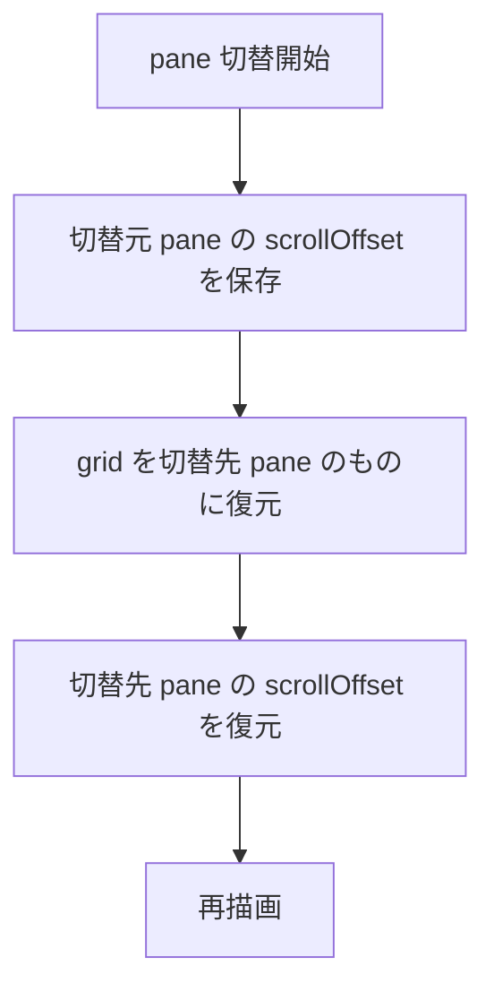

# mux pane ごとのスクロール位置保持 - 要件定義書

## 1. 概要

### 1.1 背景
mux モードであるタブ (pane / mux window) をスクロールアップした状態のまま別のタブを開くと、開いた先のタブも同じスクロール位置で表示される。スクロール位置が pane 間で共有されている。

### 1.2 目的
mux の pane 切替時に、スクロール位置を pane ごとに保持し、切替で戻ったときに前回のスクロール位置を復元する。

### 1.3 スコープ
- 対象: mux モードの pane (mux window) 切替時のスクロール位置
- 対象外: 通常タブ (mux 非使用時)。通常タブは各タブが独立した renderer を持ち、スクロール位置は既に分離されている

## 2. ビジネス要件

### 2.1 ビジネス目標
mux 上で複数の pane を行き来する作業において、各 pane のスクロール位置が維持され、作業文脈を失わないようにする。

### 2.2 対象ユーザー
| ユーザータイプ | 説明 |
|----------------|------|
| mux 利用者 | eMterm の mux 機能で複数 pane を切り替えて使うユーザー |

### 2.3 期待される効果
- pane を切り替えても各 pane のスクロール位置が保たれる
- スクロールアップして過去ログを見ている最中に別 pane へ切り替えても、戻れば元の位置に復帰する

## 3. ユースケース

### 3.1 ユースケース一覧
| ID | ユースケース名 | アクター | 優先度 |
|----|----------------|----------|--------|
| UC01 | pane 切替でスクロール位置を復元 | mux 利用者 | 高 |

### 3.2 ユースケース詳細

#### UC01: pane 切替でスクロール位置を復元

**アクター**: mux 利用者

**事前条件**:
- mux モードで複数の pane が存在する

**基本フロー**:
1. pane A でスクロールアップ (例: 50 行上) する
2. pane B に切り替える
3. pane B は pane B 自身のスクロール位置で表示される
4. pane A に戻る
5. pane A は手順 1 のスクロール位置 (50 行上) で表示される

**事後条件**:
- 各 pane が自身のスクロール位置を保持している

## 4. 機能要件

### 4.1 機能一覧
| ID | 機能名 | 説明 | 優先度 |
|----|--------|------|--------|
| F01 | pane ごとのスクロール位置保存・復元 | pane 切替時にスクロール位置を pane ごとに save/restore する | 高 |
| F02 | 背景 pane の出力時のスクロール位置補正 | 非アクティブ pane に出力が届いたとき、保存されたスクロール位置に既存 scroll-pin 挙動を適用する | 中 |

### 4.2 機能詳細

#### F01: pane ごとのスクロール位置保存・復元

**説明**: mux pane 切替時、切替元 pane の現在のスクロール位置を保存し、切替先 pane の保存済みスクロール位置を復元する。

**処理フロー**:

**ビジネスルール**:
- 切替で戻ったときは前回のスクロール位置を復元する (最下部リセットではない)

#### F02: 背景 pane の出力時のスクロール位置補正

**説明**: 非アクティブ pane に新しい出力が届いたとき、その pane の保存されたスクロール位置は既存の scroll-pin 挙動に従って扱う。アクティブ pane と同じルールを背景 pane にも適用する。

**ビジネスルール**:
- スクロールアップ中の pane は出力が来ても位置を維持する
- 最下部にいた pane は新しい出力に追従する

## 5. 非機能要件

### 5.1 パフォーマンス要件
- スクロール位置の保存・復元は pane 切替の hot path に追加されるが、単純な数値の保存・復元であり性能影響は無視できる

### 5.4 保守性要件
- スクロール位置は既存の mux pane 状態 (MuxPaneGridState 等) と同じ仕組みで保存・復元する

## 11. 成功基準

### 11.1 受け入れ基準
- [ ] pane A をスクロールアップ → pane B へ切替 → pane B は pane B 自身の位置で表示される
- [ ] pane A に戻ると pane A のスクロール位置が復元される
- [ ] 背景 pane に出力が届いても、その pane のスクロール位置は既存 scroll-pin 挙動に従う
- [ ] 通常タブ (mux 非使用) のスクロール位置分離に回帰がない

## 12. テストシナリオ

### 12.1 テスト観点
- [ ] 正常系: pane 切替でスクロール位置が pane ごとに保持・復元される
- [ ] 正常系: 最下部にいた pane に戻ると最下部のまま
- [ ] 境界値: 全 pane が最下部 → 切替してもスクロールしない
- [ ] 回帰: 通常タブのスクロール位置分離が壊れていない

## 13. 用語定義

| 用語 | 定義 |
|------|------|
| pane | mux における 1 つの mux window。UI 上はタブとして見える |
| scrollOffset | renderer が保持する、ビューポートを最下部からどれだけ上にずらすかを表す行数 |
| scroll-pin | スクロールバック増加に応じてスクロール位置を補正し、表示行を保つ既存挙動 |

## 14. 確認事項

### 14.1 確認済み事項
- [x] 修正スコープ: mux pane 切替のみ。通常タブは既に分離済みのため対象外
- [x] 復元挙動: 切替で戻ったときは前回のスクロール位置を復元する (最下部リセットではない)
- [x] 背景 pane の出力時: 既存の scroll-pin 挙動に従う

### 14.2 未確認・保留事項
- なし
