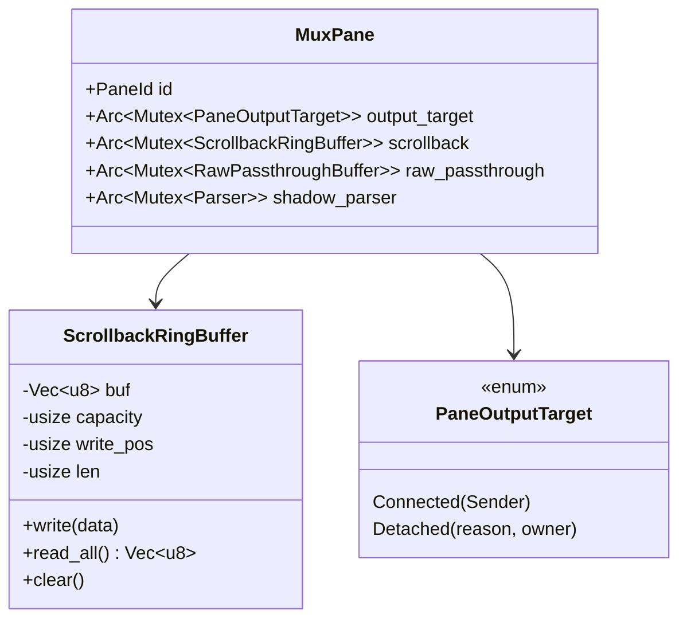

# mux スクロールバック履歴の保持 - 要件定義書

## 1. 概要

### 1.1 背景
現状の mux daemon は detach 中の出力のみを ring buffer に蓄積し、reattach 時にクライアントへ送る。attach 中の PTY 出力はバッファに残らないため、reattach 後に過去のスクロールバックが大幅に切り詰められて見える。実用上「直前まで見えていたログが消える」という体験になっている。

### 1.2 目的
- attach/detach 問わず常時 PTY 出力履歴を daemon 側で保持する
- reattach 後に detach 前のスクロールバックも復元する
- 同時にメモリ使用量を適正化する（事前 64MB → 2MB/pane）

### 1.3 スコープ

**対象:**
- daemon 側の履歴バッファの常駐化
- 既存 `DetachRingBuffer` の役割変更とリネーム
- reattach 時の送信フォーマット変更

**対象外:**
- GUI 設定への露出（固定値 2MB を採用）
- vt100 シャドウパーサの scrollback 化
- WASM 側の scrollback 容量変更

## 2. ビジネス要件

### 2.1 ビジネス目標
Claude Code を含む AI コーディング支援との共存を考えたとき、detach/reattach で過去ログが消えるのは致命的に作業効率を落とす。eMterm の AI-first 設計目標を支える基本的なターミナル体験として履歴復元を提供する。

### 2.2 対象ユーザー
| ユーザータイプ | 説明 |
|----------------|------|
| mux daemon 利用者 | SSH 越しに eMterm mux を起動して作業するユーザー |
| Claude Code ユーザー | 長時間のセッションで AI 出力をスクロールバックしたいユーザー |

### 2.3 期待される効果
- reattach 後の体験品質向上（直前まで見えていたログが残る）
- daemon メモリ使用量の予測可能化（pane 数 × 2MB）
- detach 時の急激なメモリ確保（64MB 一括）解消

## 3. ユースケース

### 3.1 ユースケース一覧
| ID | ユースケース名 | アクター | 優先度 |
|----|----------------|----------|--------|
| UC01 | attach 中の出力を含む reattach 復元 | mux 利用者 | 高 |
| UC02 | detach 中の出力の reattach 復元 | mux 利用者 | 高 |
| UC03 | 長時間 idle 時のメモリ消費抑制 | mux 利用者 | 中 |

### 3.2 ユースケース詳細

#### UC01: attach 中の出力を含む reattach 復元

**アクター**: mux 利用者

**事前条件**:
- daemon が起動済み
- pane で長時間出力（複数画面分のログ）が発生している
- クライアントが attach されている

**基本フロー**:
1. ユーザーが attach 中に大量のログを出力する
2. ユーザーが detach する
3. ユーザーが reattach する
4. detach 前のスクロールバック（直近 2MB 分）が復元され、スクロールアップで遡れる

**事後条件**:
- 直近のスクロールバックは attach 期間も含めて復元されている
- 容量上限を超えた古い履歴は失われる

#### UC02: detach 中の出力の reattach 復元

**アクター**: mux 利用者

**事前条件**:
- pane が detach 状態（クライアント未接続）
- pane の shell が出力を続けている

**基本フロー**:
1. detach 中に shell が PTY 出力を行う
2. daemon は scrollback バッファに常時書き込みつつ、shadow parser へも通す
3. ユーザーが reattach する
4. detach 中の出力もスクロールバックの一部として復元される

**事後条件**:
- detach 中の出力が現在画面の上にスクロールアウトした行として復元される

#### UC03: 長時間 idle 時のメモリ消費抑制

**アクター**: mux 利用者

**事前条件**:
- 10〜20 pane が常時 idle 状態（出力なし）

**基本フロー**:
1. daemon は pane ごとに 2MB のバッファを保持する
2. idle pane は出力がないためバッファは空のまま
3. 全体メモリは pane 数 × 2MB に収まる

**事後条件**:
- 10 pane で 20MB、20 pane で 40MB を超えない

## 4. 機能要件

### 4.1 機能一覧
| ID | 機能名 | 説明 | 優先度 |
|----|--------|------|--------|
| F01 | ScrollbackRingBuffer 型 | リングバッファ実装（既存 `DetachRingBuffer` のリネーム） | 高 |
| F02 | Pane への常駐配置 | pane 構造体直下に常時保持 | 高 |
| F03 | 常時書き込み | attach/detach 問わず PTY リーダーから書く | 高 |
| F04 | 容量定数 2MB | 固定値、設定化しない | 高 |
| F05 | reattach 時送信順変更 | history → shadow の順 | 高 |
| F06 | バッファ寿命 = pane 寿命 | reattach 時にクリアしない | 高 |

### 4.2 機能詳細

#### F01: ScrollbackRingBuffer 型

**説明**: 既存の `DetachRingBuffer` をリネームし、用途を「scrollback 履歴保持」に変更する。リングバッファのアルゴリズム（wrap-around、read_all、clear）は変更しない。

**入力**: PTY 出力バイト列

**出力**: バッファ内容のバイト列（chronological order）

**ビジネスルール**:
- バッファ容量は定数 `DEFAULT_SCROLLBACK_CAPACITY = 2 * 1024 * 1024`
- 満杯時は古いバイトから上書き
- pane 生成時に 2MB を事前確保

#### F02: Pane への常駐配置

**説明**: `ScrollbackRingBuffer` を `PaneOutputTarget::Detached` variant 内ではなく、`Pane` (= `MuxPane`) 構造体直下に配置する。`PaneOutputTarget::Detached` から `ring` フィールドを削除する。

**処理フロー**:
```mermaid
flowchart TD
    A[Pane 生成] --> B[ScrollbackRingBuffer::new(2MB)]
    B --> C[Pane.scrollback に格納]
    C --> D[PTY リーダー稼働開始]
    D --> E[出力毎に scrollback.write]
    E --> D
```

#### F03: 常時書き込み

**説明**: PTY リーダースレッドが PTY から読んだバイトを、`output_target` の状態（Connected / Detached）に関わらず毎回 `scrollback.write()` で書き込む。Connected であれば加えて sender へも送る。

**ビジネスルール**:
- output_target の評価は従来通り（Connected → sender 送信）
- scrollback への書き込みは output_target 判定とは独立に毎回実施

#### F04: 容量定数 2MB

**説明**: バッファ容量は 2MB の固定値とし、設定 UI には露出しない。

**ビジネスルール**:
- 定数: `pub const DEFAULT_SCROLLBACK_CAPACITY: usize = 2 * 1024 * 1024;`
- 配置: `src-tauri/src/mux/scrollback_buffer.rs`
- 旧定数 `DEFAULT_RING_CAPACITY` (64MB) は削除

#### F05: reattach 時送信順変更

**説明**: reattach 時に daemon がクライアントへ送るバイト列の順序を以下にする。

```
[1] ESC[H ESC[2J                 - 画面クリア + cursor home
[2] scrollback.read_all()        - 常時蓄積した raw bytes（最大 2MB）
[3] shadow.contents_formatted()  - 現在画面の上書き保証
[4] passthrough_data             - detach 中の画像 / Markdown OSC
```

**ビジネスルール**:
- 順序を `[1] → [2] → [3] → [4]` とする
- scrollback の先頭が ESC シーケンス途中で切れていても、[3] の shadow で最終画面状態が保証されるため特別な trim 処理は行わない

#### F06: バッファ寿命 = pane 寿命

**説明**: reattach 時に scrollback をクリアしない。pane が破棄されるまで履歴は保持される。

**ビジネスルール**:
- 旧実装: reattach 時に `ring.clear()` してリセット → **廃止**
- 新実装: reattach 時は `read_all()` だけ行い、buffer はそのまま維持

## 5. 非機能要件

### 5.1 パフォーマンス要件
- メモリ: pane 数 × 2MB（10 pane = 20MB、20 pane = 40MB）
- 書き込みオーバーヘッド: PTY リーダーで毎回 2MB バッファへ memcpy → 既存 detach 時と同じ操作

### 5.2 セキュリティ要件
- 履歴は daemon プロセスのメモリ内のみ。永続化しない
- detach した別クライアントが reattach した場合、scrollback 履歴も共有される（既存の detach reattach と同じ識別子モデル）

### 5.3 可用性要件
- 既存の attach/detach パイプラインを破壊しない
- 既存 mux-osc-handshake / mux-osc-title-propagation / mux-feature-cleanup などの E2E が引き続き通る

### 5.4 保守性要件
- 型名は `ScrollbackRingBuffer`
- ファイル名は `src-tauri/src/mux/scrollback_buffer.rs`
- 旧 `DetachRingBuffer` / `ring_buffer.rs` への参照は全て更新

### 5.5 互換性要件
- mux IPC プロトコル: 変更なし（送信フォーマットは既存の resume snapshot バイト列に追加するだけ）
- WASM 側パーサ: 変更なし

## 6. UI/UX要件

該当なし（バックエンド内部実装の変更）。

## 7. データ要件

### 7.1 データモデル概要


### 7.2 データ項目
| エンティティ | 項目名 | 型 | 必須 | 説明 |
|--------------|--------|-----|------|------|
| MuxPane | scrollback | Arc<Mutex<ScrollbackRingBuffer>> | ○ | pane 常駐 scrollback バッファ |
| ScrollbackRingBuffer | buf | Vec<u8> | ○ | 2MB 事前確保 |
| ScrollbackRingBuffer | capacity | usize | ○ | 容量（2MB 固定） |
| ScrollbackRingBuffer | write_pos | usize | ○ | 書き込み位置 |
| ScrollbackRingBuffer | len | usize | ○ | 現在の蓄積サイズ |

### 7.3 データ保持期間
| データ種別 | 保持期間 |
|------------|----------|
| scrollback | pane 寿命と同じ（pane 破棄まで） |

## 8. 外部連携

該当なし。

## 9. 制約条件

### 9.1 技術的制約
- vt100 crate のシャドウパーサは可視領域のみ追跡。scrollback は raw bytes として持つ
- リングバッファ書き込みは PTY リーダースレッド上で行われるため、ロック競合を避けて軽量に保つ
- 既存の `Arc<StdMutex<...>>` ロック粒度に従う

### 9.2 ビジネス上の制約
なし

### 9.3 スケジュール制約
なし

## 10. 想定される課題とリスク

### 10.1 技術的課題
| 課題 | 影響度 | 対応策 |
|------|--------|--------|
| scrollback 先頭の ESC シーケンス途中切断 | 低 | shadow 送信で最終画面が上書きされるため許容 |
| メモリ未使用の pane でも 2MB 確保 | 低 | 20 pane × 2MB = 40MB は実用範囲内 |
| 既存 reattach E2E への影響 | 中 | 既存テストが通ることを確認 |

### 10.2 ビジネスリスク
| リスク | 発生確率 | 影響度 | 対応策 |
|--------|----------|--------|--------|
| 履歴復元の不完全（境界 ESC 切断） | 低 | 低 | shadow による最終画面保証 |

## 11. 成功基準

### 11.1 受け入れ基準
- [x] attach 中に出力したログが reattach 後にスクロールバックで遡れる *(Phase C 実装、要 `bun tauri dev` での手動確認)*
- [x] detach 中の出力も含めてスクロールバックに含まれる *(Phase C 実装、同上)*
- [~] 10 pane 構成で daemon RSS が 20〜40MB に収まる *(コードレビューで確認、実機計測未実施)*
- [x] 既存 mux 系 unit test がすべて通る *(252/252 pass on Phase C commit `a1321a7`)*
- [x] 旧 `DEFAULT_RING_CAPACITY` (64MB) 定義への参照が残っていない *(grep で 0 件確認、Phase B で `DEFAULT_SCROLLBACK_CAPACITY` にリネーム)*

### 11.2 KPI
| 指標 | 目標値 | 測定方法 |
|------|--------|----------|
| pane あたりメモリ | 2 MB 以下 | Rust テストで capacity 確認 |
| reattach 後の復元行数 | ≥ 9000 行（206 列、2MB 換算で約 1 万行相当） | 手動確認（spec.md の test scenario 参照） |

## 12. テストシナリオ

### 12.1 テスト観点
- [ ] 正常系: attach 中の出力 + detach + reattach で履歴復元
- [ ] 正常系: detach 中の出力も履歴に含まれる
- [ ] 境界値: scrollback が 2MB を超えた時に古いバイトから捨てる
- [ ] 境界値: scrollback クリア後の動作（旧 ring 用 test を流用）
- [ ] 異常系: 単一 write が 2MB を超える場合（既存 test_overflow_large_write 流用）

## 13. 用語定義

| 用語 | 定義 |
|------|------|
| scrollback | 端末画面の上にスクロールアウトした履歴行 |
| shadow parser | daemon 側の vt100 パーサ。表示画面の状態のみ追跡 |
| ring buffer | 固定長の循環バッファ。満杯で古い順に上書き |
| pane | mux における 1 つの PTY セッション |
| attach / detach | クライアント GUI と daemon の接続 / 切断 |

## 14. 確認事項

### 14.1 確認済み事項
- [x] バッファ上限: per-pane cap のみ（global cap なし） → 採用
- [x] バッファ容量: 2 MB / pane（固定値、設定なし） → 採用
- [x] バッファ寿命: pane 寿命と同じ（reattach でクリアしない） → 採用
- [x] 蓄積タイミング: attach/detach 問わず常時 → 採用
- [x] ストレージ形式: raw bytes（既存リングバッファ流用） → 採用
- [x] reattach 送信順: history → shadow → passthrough → 採用
- [x] passthrough_data の扱い: 現状維持（detach 中のみ別途蓄積） → 採用
- [x] 型名 / ファイル名: `ScrollbackRingBuffer` / `scrollback_buffer.rs` に改名 → 採用
- [x] ESC シーケンス trim: 不要（shadow で上書きされるため） → 採用
- [x] E2E テスト: スキップ、Rust unit test のみ → 採用
- [x] attach 中の画像 OSC: scrollback の raw bytes として記録されるが、画像表示の保証はしない → 採用

### 14.2 未確認・保留事項
なし

## 15. 参考資料

- 既存仕様: `doc/tasks/mux-osc-handshake/SPEC.md`（FR2 / FR8）
- 実装後の関連ファイル: `src-tauri/src/mux/scrollback_buffer.rs`、`src-tauri/src/mux/ipc/reattach.rs`、`src-tauri/src/mux/ipc/pty_spawn.rs`、`src-tauri/src/mux/session/pane.rs`
- メモ: `tmp/daemon-log.md`
- 実装ブランチ: `feat/mux-scrollback-retention`（Phase A `7b668f3` / Phase B `dbe85b0` / chore `fda9e26` / Phase C `a1321a7`）
