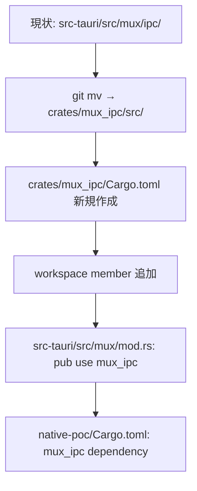
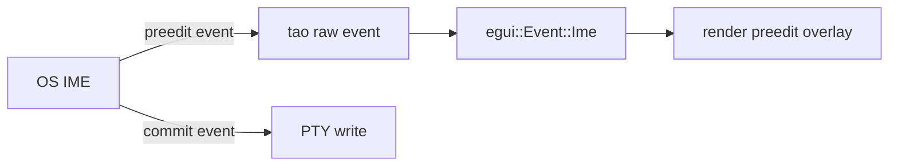
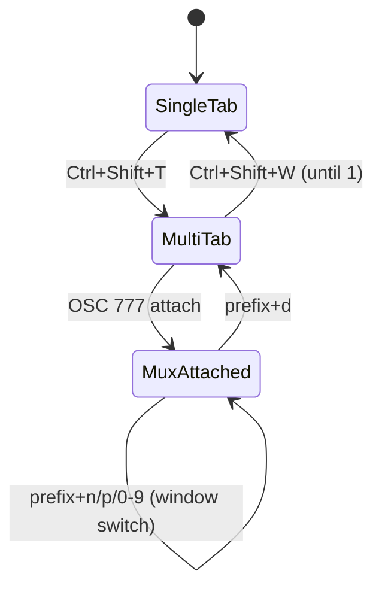

# mux-tabs-windows-ime - 要件定義書

## 1. 概要

### 1.1 背景

restruct.md「emterm 再構築方針: ネイティブターミナル + WebView ビューアのハイブリッド構成」の Phase 4。Phase 1〜3 で native-poc に term_core / term_images を組み込んだ単一 PTY ターミナルが完成しており (1801 tests passing)、本フェーズで mux 機能とタブバー UI を native (egui + wgpu) に移植する。Phase 1 で保留した Windows MS-IME の動作検証も合わせて実施する。

### 1.2 目的

native-poc を「現行 emterm (Tauri) の mux + タブ操作と機能等価」に到達させる。Linux / Windows いずれでも IME 入力含めて実用可能とし、Phase 5 (Wry ビューア統合) に進める基盤を整える。

### 1.3 スコープ

**対象**:
- egui によるタブバー UI の実装 (新規・閉じる・切替・タイトル表示)
- 既存 `src-tauri/src/mux/ipc/` の `crates/mux_ipc/` への抽出 (Phase 3 の term_images 踏襲)
- native-poc から mux daemon への接続 (Unix socket、OSC 777 attach/detach、prefix key)
- egui native によるステータスバーの実装 (現行 HTML 版の機能を再現)
- Windows MS-IME の動作確認 (preedit / commit 必須、候補位置 best effort)

**対象外**:
- ペイン分割 UI (1 window = 1 pane を維持。将来課題)
- Wry ビューア統合 (Phase 5)
- 設定ウィンドウ (Phase 6)
- 旧 Tauri (`src-tauri/`) の削除 (Phase 7)

## 2. ビジネス要件

### 2.1 ビジネス目標

native-poc を mux 含め現行 emterm 等価に到達させ、長時間 Claude Code セッションでの安定性向上 (Phase 1 で測定済) を mux 利用ケースにも拡げる。

### 2.2 対象ユーザー

| ユーザータイプ | 説明 |
|----------------|------|
| Claude Code セッション | 長時間 mux session を使う AI コーディング作業者 |
| ターミナル開発者 | tmux/screen 代替として mux 機能 (attach/detach) を使う開発者 |
| Windows 利用者 | MS-IME で日本語入力を行うユーザー |

### 2.3 期待される効果

- mux 利用シナリオでの長時間安定性 (NFR2: クラッシュ / 画面消失 / メモリ単調増加なし)
- Windows での日本語入力の実用化 (Phase 1 では Linux fcitx5 のみ検証)
- Phase 5 への接続点が確立される (タブバー + mux 完了 → ビューア統合)

## 3. ユースケース

### 3.1 ユースケース一覧

| ID | ユースケース名 | アクター | 優先度 |
|----|----------------|----------|--------|
| UC01 | 新規タブを開く | ユーザー | 高 |
| UC02 | タブを閉じる | ユーザー | 高 |
| UC03 | タブを切り替える | ユーザー | 高 |
| UC04 | mux session に attach する | ユーザー (CLI) | 高 |
| UC05 | mux session から detach する | ユーザー (prefix key) | 高 |
| UC06 | mux 内 window を切り替える | ユーザー (prefix key) | 高 |
| UC07 | ステータスバーで mux 状態を確認 | ユーザー | 中 |
| UC08 | Windows で日本語を入力する | Windows ユーザー | 高 |

### 3.2 ユースケース詳細

#### UC01: 新規タブを開く

**アクター**: ユーザー

**事前条件**: native-poc 起動中

**基本フロー**:
1. ユーザーが `Ctrl+Shift+T` を押す
2. 新しい PTY (デフォルトシェル) が spawn される
3. 新しいタブがタブバーに追加されアクティブになる

**事後条件**: アクティブタブが新規 PTY を指す

#### UC02: タブを閉じる

**アクター**: ユーザー

**事前条件**: 2 タブ以上開いている

**基本フロー**:
1. ユーザーが `Ctrl+Shift+W` を押す (または middle-click でも可)
2. アクティブタブの PTY が終了する
3. タブバーから当該タブが除去される
4. 隣接タブがアクティブになる

**代替フロー**:
- 最後の 1 タブを閉じた場合 → ウィンドウが閉じる (現行 native-poc 等価)

#### UC04: mux session に attach する

**アクター**: ユーザー (CLI)

**事前条件**: native-poc 起動中、emterm mux daemon が動作中

**基本フロー**:
1. ユーザーが PTY 内で `emterm mux` を実行
2. PTY が `OSC 777 ; emterm ; mux ; attach ; <socket_path> ; <session_id> ST` を出力
3. native-poc がエスケープを検出し、Unix socket で daemon に接続
4. 当該 PTY タブが mux モードに遷移 (元の PTY reader を一時停止)
5. daemon から snapshot を受信して画面復元
6. タブバーに mux session 名 + window 数が表示される

**事後条件**: タブが mux session に attach 済み

#### UC05: mux session から detach する

**アクター**: ユーザー

**基本フロー**:
1. ユーザーが prefix key (デフォルト `Ctrl+B`) を押す
2. 続けて `d` を押す
3. native-poc が `Detach` を daemon に送信
4. socket が close され、元の PTY モードに復帰
5. タブバーが通常表示に戻る

#### UC06: mux 内 window を切り替える

**アクター**: ユーザー

**基本フロー**:
1. ユーザーが prefix key + `n` (次) / `p` (前) / `0..9` (番号指定) を押す
2. native-poc が daemon に window switch 要求を送信
3. daemon から新しい window の snapshot を受信して描画
4. ステータスバーのアクティブ window indicator が更新

#### UC08: Windows で日本語を入力する

**アクター**: Windows ユーザー

**事前条件**: Windows 10/11 + MS-IME

**基本フロー**:
1. ユーザーが日本語入力モードに切り替え (デフォルトでは MS-IME の操作)
2. 文字を入力すると preedit (未確定文字) がカーソル位置近傍に表示される
3. 確定すると commit された文字列が PTY に送信される

**代替フロー**:
- 候補ウィンドウは表示されればよく、カーソル直下に追従しなくても許容

## 4. 機能要件

### 4.1 機能一覧

| ID | 機能名 | 説明 | 優先度 |
|----|--------|------|--------|
| FR1 | egui タブバー UI | 新規・閉じる・切替・タイトル表示 | 高 |
| FR2 | タブ keybinds | `Ctrl+Shift+T` / `Ctrl+Shift+W` / `Ctrl+Tab` / `Ctrl+Shift+Tab` / `Ctrl+1..9` | 高 |
| FR3 | mux IPC crate 抽出 | `crates/mux_ipc/` の作成、src-tauri 再エクスポート | 高 |
| FR4 | mux client (attach) | OSC 777 attach 検出、Unix socket 接続、snapshot 受信 | 高 |
| FR5 | mux client (detach) | prefix key d で detach、PTY モードに復帰 | 高 |
| FR6 | mux window switch | prefix key n/p/0-9 で window 切替 + snapshot 再受信 | 高 |
| FR7 | mux 中の PTY pause | mux モード中は native PTY reader を一時停止 | 高 |
| FR8 | prefix key 処理 | デフォルト `Ctrl+B`、settings.json で変更可、prefix の連続入力は escape | 高 |
| FR9 | ステータスバー (egui) | daemon push の StatusUpdateMsg を decode、session 名 + window list + 時刻表示 | 中 |
| FR10 | ステータスバー有効化設定 | settings.json `statusbar.enabled` (default true)、`statusbar.position` (top/bottom) | 中 |
| FR11 | Windows MS-IME (preedit) | egui IME を介して preedit 文字列を画面に表示 | 高 |
| FR12 | Windows MS-IME (commit) | commit された文字列を PTY に書き戻す | 高 |
| NFR1 | Linux fcitx5 IME 後方互換 | Phase 1 の挙動を保つ | 高 |
| NFR2 | 長時間安定性 (mux + IME) | 12h Claude Code session でクラッシュ / 画面消失 / メモリ単調増加なし | 高 |
| NFR3 | テスト方針 | unit + mock daemon (in-memory channel) integration | 高 |

### 4.2 機能詳細

#### FR1: egui タブバー UI

**説明**: native-poc/src/ui/tab_bar.rs に egui ウィジェットとして実装。タブのタイトル (PTY タイトル または "shell")、close ボタン (×)、アクティブ状態の視覚表示 (下線 + 背景色) を持つ。タブのドラッグによる並べ替えは対象外。

**入力**: `&mut Vec<Tab>`、active tab index

**出力**: UI イベント (NewTab / CloseTab(idx) / SwitchTab(idx))

**ビジネスルール**:
- タブ数の上限は設定しない
- タブ幅は等分配 (最小幅 80px、上回ったら横スクロール)
- mux mode のタブはタイトル prefix に `[mux:<session>]` を付ける

#### FR3: mux IPC crate 抽出

**説明**: `src-tauri/src/mux/ipc/` (`codec.rs`, `connection.rs`, `protocol.rs`) を `crates/mux_ipc/src/` に `git mv` で抽出。`src-tauri/src/mux/ipc.rs` は `pub use mux_ipc::*` で互換維持。`pty_spawn.rs`, `handlers.rs`, `reattach.rs`, `statusbar.rs` は src-tauri 固有の Tauri 結合があるため移動しない (将来 Phase 7 で再評価)。

**処理フロー**:


#### FR4-FR7: mux client

**説明**: native-poc が OSC 777 attach を検出した時の動作。

**処理フロー**:
```mermaid
sequenceDiagram
    participant PTY
    participant App as native-poc::App
    participant Mux as native-poc::mux::Client
    participant D as Daemon
    PTY->>App: OSC 777 ; emterm ; mux ; attach ; /tmp/sock ; sess123 ST
    App->>Mux: connect(/tmp/sock, sess123)
    Mux->>D: Hello { session_id }
    D-->>Mux: Snapshot { screen, ring_buffer_delta }
    Mux-->>App: ScreenReplace(snapshot)
    App->>App: pause native PTY reader
    Note over App,Mux: 以降、PTY 出力は Mux 経由
```

#### FR9: ステータスバー (egui)

**説明**: 現行 src-tauri/src/mux/ipc/statusbar.rs の StatusUpdateMsg をそのまま decode し、egui の bottom panel として描画。表示項目は session 名、window list (active 強調)、ローカル時刻 (1 秒更新)。daemon push が来ない時は表示しない (no polling)。

#### FR11/FR12: Windows MS-IME

**説明**: egui の組み込み IME ハンドリング (`egui::Context::request_repaint`、IME イベント) を利用する。Linux fcitx5 で Phase 1 から動作している経路を Windows でも検証する。NG の場合は tao raw IME API (`Window::set_ime_position` 等) に fallback するが、Phase 4 ではまず built-in を試す。候補ウィンドウ位置は best effort (egui に IME 領域通知 API がある場合は使用、無ければ未対応で良い)。

**処理フロー**:


## 5. 非機能要件

### 5.1 パフォーマンス要件

- mux attach 時の snapshot 描画レイテンシ: < 200ms (1 MB snapshot)
- prefix key 検出: < 5ms (キーボード入力 → daemon 送信)
- タブ切替: フレーム 1 つ以内

### 5.2 セキュリティ要件

- mux daemon socket path 検証: OSC 777 で受信した socket path が `/tmp/emterm-mux/` または `$XDG_RUNTIME_DIR/emterm-mux/` 配下であることを確認 (ディレクトリトラバーサル防止、現行と同等)
- session ID は不透明文字列として扱い、エスケープせず socket に渡す前にホワイトリスト (英数字 + ハイフン) でバリデーション
- IME preedit に制御文字 (C0/C1) が混入した場合は破棄

### 5.3 可用性要件

- mux daemon 切断時は元の PTY モードに戻り、エラーを log に記録 (アプリは継続)
- IME 故障 (egui イベント来ない) 時は ASCII 入力は継続可能

### 5.4 保守性要件

- ログ: prefix key 検出 / mux attach / detach / window switch を `log::info!` で記録
- 設定: settings.json `mux.prefix_key`, `statusbar.enabled`, `statusbar.position` を追加

### 5.5 互換性要件

- mux daemon の bincode IPC protocol を変更しない (FR3 の crate 抽出のみ、protocol 互換維持)
- src-tauri の `cargo build --workspace` を維持 (Phase 7 まで両系並存)

## 6. UI/UX要件

### 6.1 画面設計要件

- タブバー: ウィンドウ上部、高さ 28〜32 px、フォントは現行 emterm と同等
- ステータスバー: ウィンドウ下部 (settings.json で top も可)、高さ 20〜24 px
- ターミナルグリッド: タブバーとステータスバーで挟まれた残り領域全部
- IME preedit: カーソル位置直下に独立オーバーレイで描画 (アンダーライン付き)

### 6.2 画面遷移



## 7. データ要件

該当なし (永続データは settings.json のみ、追加項目は FR8/FR10 に記載)。

## 8. 外部連携

### 8.1 連携システム

| システム名 | 連携方法 | データ |
|------------|----------|--------|
| emterm mux daemon | Unix socket (bincode) | PTY data, control messages, snapshot |
| OS IME (Linux fcitx5, Windows MS-IME) | tao raw event → egui Ime | preedit / commit |

## 9. 制約条件

### 9.1 技術的制約

- egui の IME API に依存。NG の場合は tao raw IME API に fallback (リスクと対策 参照)
- mux daemon の bincode protocol は変更しない
- 1 window = 1 pane の現行 mux 構造を維持 (ペイン分割は将来)

### 9.2 ビジネス上の制約

- restruct.md Phase 4 に記載されたスコープを逸脱しない (分割追加は要 separate SDD)

### 9.3 スケジュール制約

- restruct.md の Phase 4 期間目安 1〜2 週間内に完了

## 10. 想定される課題とリスク

### 10.1 技術的課題

| 課題 | 影響度 | 対応策 |
|------|--------|--------|
| egui の Windows IME 不完全 | 高 | tao raw IME fallback 検討。それでも NG なら egui の Windows IME PR を待つ or 別ライブラリ評価 |
| mux client 化で src-tauri との二重実装 | 中 | mux_ipc crate 抽出で共通化 (FR3)。protocol レベルは単一実装 |
| egui タブバー / ステータスバー UI の自由度不足 | 中 | restruct.md リスクと対策に記載済の WebView ハイブリッド (Wry child WebView) を NG 時に検討 |
| mux 切断時のフォールバック失敗 | 中 | unit test で attach/detach の状態遷移を網羅 |

### 10.2 ビジネスリスク

| リスク | 発生確率 | 影響度 | 対応策 |
|--------|----------|--------|--------|
| Windows IME が動作せず Phase 4 が No-Go | 中 | 高 | tao raw IME fallback。それでも NG なら restruct.md No-Go ゲート発動 |

## 11. 成功基準

### 11.1 受け入れ基準

- [ ] FR1-FR12 全てが unit / integration test でカバーされ pass
- [ ] cargo build --workspace, cargo test --workspace, cargo fmt --all clean, cargo clippy native-poc errors なし
- [ ] mux attach/detach/window switch が host で動作確認できる (manual)
- [ ] Windows ビルドが成功し、MS-IME で preedit + commit 動作 (manual)
- [ ] Linux fcitx5 IME が Phase 1 から退行しない (manual)
- [ ] 12h Claude Code session でクラッシュ / 画面消失なし (manual, host)

### 11.2 KPI

| 指標 | 目標値 | 測定方法 |
|------|--------|----------|
| native-poc test count | 1801 → +30 以上 | cargo test -p emterm-native-poc |
| mux_ipc crate test | 既存 src-tauri/src/mux/ipc/ のテスト全 pass | cargo test -p mux_ipc |
| Windows MS-IME 動作 | preedit + commit 動作 | manual host (Windows VM or 実機) |

## 12. テストシナリオ

### 12.1 テスト観点

- [ ] 正常系: タブ新規 / 閉じる / 切替、mux attach / detach / window switch
- [ ] 異常系: mux daemon 不在、socket 接続失敗、不正な OSC 777
- [ ] 境界値: 1 タブのみで close、最大 window 数の mux session
- [ ] セキュリティ: 不正な socket path、不正な session ID、preedit 内の制御文字
- [ ] パフォーマンス: snapshot 描画レイテンシ、prefix key 検出レイテンシ

## 13. 用語定義

| 用語 | 定義 |
|------|------|
| mux | emterm 内蔵のターミナルマルチプレクサ (tmux 相当) |
| daemon | `emterm mux` で起動するバックグラウンドプロセス |
| session | mux daemon が管理する論理セッション (1 daemon に複数可) |
| window | session 内の論理ウィンドウ (1 session に複数可、1 window に 1 pane) |
| pane | window 内のターミナル領域 (Phase 4 では 1 window = 1 pane) |
| attach | GUI クライアントが mux session に接続する操作 |
| detach | GUI クライアントが mux session から切断する操作 (daemon は継続) |
| prefix key | mux 操作のキーコンビネーション開始キー (デフォルト Ctrl+B) |
| preedit | IME で確定前の編集中文字列 |
| commit | IME で文字を確定して PTY に送信する操作 |

## 14. 確認事項

### 14.1 確認済み事項

- [x] Phase 4 のスコープ: egui タブバー UI + mux client 移植 + ステータスバー (egui native) + Windows MS-IME 検証
- [x] ペイン分割: 対象外 (タブのみ。将来課題)
- [x] mux IPC コード共有: `crates/mux_ipc/` として抽出、src-tauri は再エクスポート (Phase 3 term_images 踏襲)
- [x] Windows MS-IME 合格基準: preedit + commit のみ (候補位置は best effort)
- [x] mux client テスト方針: Unit 中心 + mock daemon (in-memory channel) で integration test

### 14.2 未確認・保留事項

なし (Open Question は SPEC.md に集約)

## 15. 参考資料

- restruct.md: `./tmp/restruct.md` (Phase 4 セクション + リスクと対策の WebView ハイブリッド fallback)
- 現行 mux 仕様: `doc/tasks/terminal-multiplexer/SPEC.md`
- 現行 mux ステータスバー: `doc/tasks/mux-statusbar/SPEC.md`
- mux IPC 実装: `src-tauri/src/mux/ipc/`
- native-poc Phase 1: `doc/tasks/native-terminal-poc/SPEC.md`
- native-poc Phase 3: `doc/tasks/native-terminal-features/SPEC.md`
