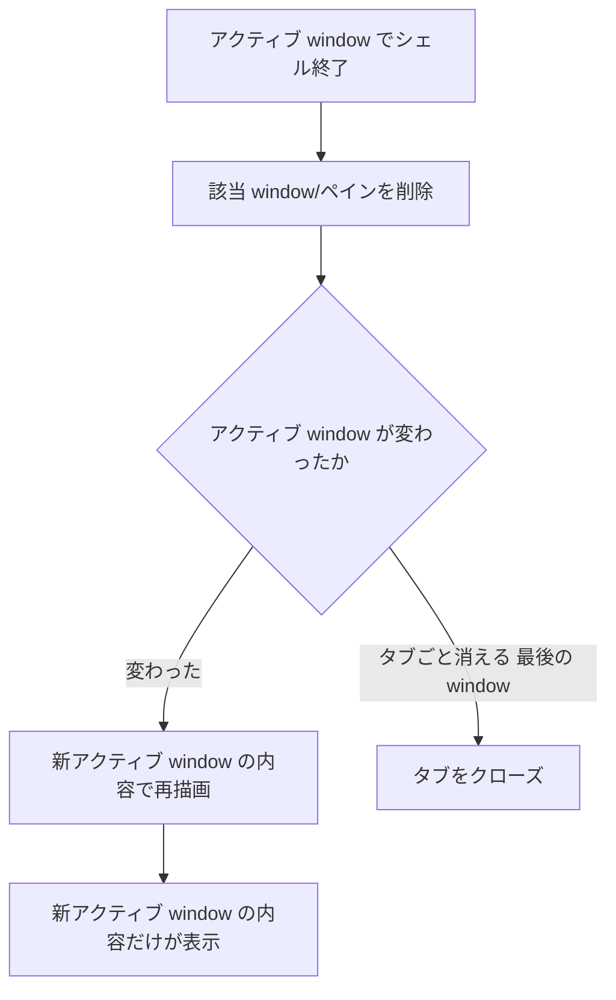

# mux ウィンドウ クローズ時の再描画 - 要件定義書

## 1. 概要

### 1.1 背景
mux (tmux 風の多重化) で複数の window を開いているとき、あるウィンドウでシェルを終了 (exit / Ctrl+D) するとそのウィンドウがクローズされ、別のウィンドウがアクティブになる。このとき、新しくアクティブになったウィンドウの画面に、クローズされたウィンドウの内容が重なって表示される (混線する)。別のウィンドウへ切り替えて戻る、ウィンドウをリサイズするなどの再描画操作を行うと正しい内容に直るため、表示状態は一時的なものである。

### 1.2 目的
mux ウィンドウがシェル終了でクローズされ、別のウィンドウがアクティブになった時点で、新しくアクティブになったウィンドウ自身の内容だけが描画されるようにする。

### 1.3 スコープ
- 対象: mux の window (tmux でいう window。`mux_group` が管理するサブタブ)。
- 対象操作: window 内のシェルが終了 (exit / Ctrl+D) して window がクローズされ、別の window がアクティブに切り替わるケース。
- 対象外: アプリ本体のタブ (`Vec<Tab>`)、ユーザー操作による明示的なウィンドウ切り替え (こちらは既に正しく再描画される)。

## 2. ユースケース

### 2.1 ユースケース詳細

#### UC01: mux ウィンドウのシェル終了によるクローズ

**アクター**: ターミナル利用者

**事前条件**:
- 1 つのタブが mux モードで、2 つ以上の window を持つ。
- いずれかの window がアクティブで、その window でシェルが動作している。

**基本フロー**:
1. アクティブな window でシェルを終了する (exit / Ctrl+D)。
2. その window (ペイン) がクローズされる。
3. 別の window がアクティブになる。
4. 新しくアクティブになった window 自身の内容が画面に描画される。

**事後条件**:
- 画面には、新しくアクティブになった window の内容だけが表示される。クローズされた window の内容は残らない。

## 3. 機能要件

### 3.1 機能一覧
| ID | 機能名 | 説明 | 優先度 |
|----|--------|------|--------|
| F01 | クローズ後の再描画 | シェル終了で window がクローズされ別の window がアクティブになった時、新アクティブ window の内容で画面を再構成する | 高 |

### 3.2 機能詳細

#### F01: クローズ後の再描画

**説明**: mux window がシェル終了でクローズされ、アクティブな window が別の window へ移った場合、新しくアクティブになった window の内容で表示を再構成する。これはユーザーが明示的にウィンドウを切り替えたときと同じ再描画経路 (新アクティブペインのスナップショット要求・リプレイ) を通すことで達成する。

**処理フロー**:

**エラーケース**:
| エラー | 条件 | 対応 |
|--------|------|------|
| 最後の window が終了 | クローズによりタブ内の window が 0 になる | 従来どおりタブ自体をクローズする (再描画は不要) |

## 4. 非機能要件

### 4.1 互換性要件
- ユーザー操作による明示的なウィンドウ切り替えの挙動を変えない。
- mux ではない通常のタブ、アプリ本体のタブの挙動を変えない。

### 4.2 保守性要件
- ログ出力は `crate::logging` (env_logger) を用い、リリースで残すものは `warn` 以上とする。

## 5. 制約条件

### 5.1 技術的制約
- GUI 機能 (`feature = "gui"`) 配下の実装であり、CLI-only ビルド (`--no-default-features`) を壊さない。
- 対象は native (src-tauri/) 実装。WebView 版 (src/) は変更しない。

## 6. テストシナリオ

### 6.1 テスト観点
- [ ] 正常系: 3 つ以上の window のうちアクティブな window のシェルを終了すると、別の window がアクティブになり、その window の内容だけが表示される。
- [ ] 正常系: アクティブでない window のシェルが終了しても、表示中のアクティブ window の内容は変わらない。
- [ ] 境界値: 最後の 1 つの window のシェルが終了すると、タブ自体がクローズされる (従来挙動を維持)。
- [ ] 退行: ユーザー操作による明示的なウィンドウ切り替えで、引き続き正しい内容が描画される。

## 7. 用語定義

| 用語 | 定義 |
|------|------|
| window | mux 内のサブタブ。tmux の window 相当。`mux_group` (MuxWindowGroup) が配列で管理する |
| ペイン (pane) | window に紐づくシェルプロセス。daemon が pane_id で識別する |
| アクティブ window | 現在表示されている window。`mux_group.active` が指すインデックス |
| スナップショット | daemon が保持するペインの画面状態のバイト列。クライアントがリプレイして画面を再構成する |

## 8. 確認事項

### 8.1 確認済み事項
- [x] 対象タブの層: mux の window (アプリ本体のタブではない)
- [x] 再現条件: 常に起きる (シェル終了でウィンドウがクローズされるたび)
- [x] 混線の見え方: 新アクティブ window の内容とクローズされた window の内容が重なって表示される
- [x] 表示の性質: 別タブへ切り替えて戻る・リサイズ等の再描画操作で直る (一時的)

### 8.2 未確認・保留事項
- なし
