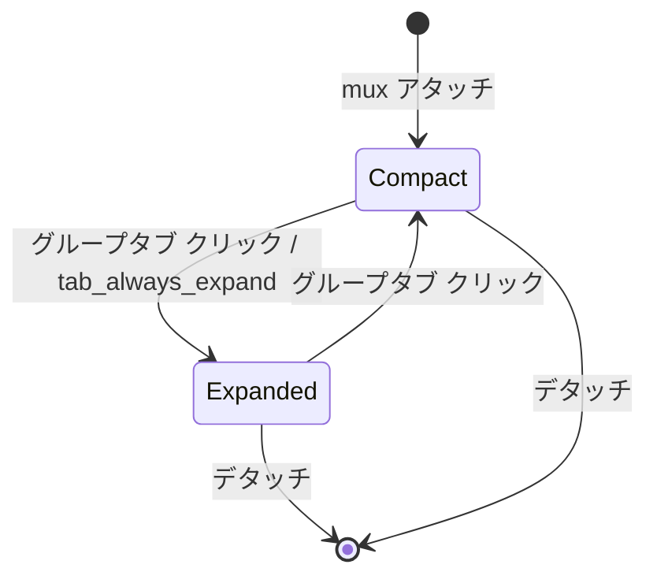

# mux ウィンドウのタブ展開 (native-poc 移植) - 要件定義書

## 1. 概要

### 1.1 背景

native-poc（tao + wgpu + egui スタック）への WebView 機能移植プロジェクトにおいて、mux クライアント機能は Phase 4（`doc/tasks/mux-tabs-windows-ime/`）で実装済み。ただし Phase 4 は APC redesign を採用し、ウィンドウ切替を「prefix キーのバイトを bridge CLI に転送 → daemon が APC Snapshot を返す → 同一タブ内で画面差し替え」する方式に倒した。mux のウィンドウを native のタブとして展開する UI（WebView の挙動）は実装されていない。

WebView 版は mux セッションのウィンドウ群を、起点タブを「タブグループ」として compact（`mux (N)`）/ expanded（ウィンドウをサブタブ表示）でタブバーに展開する。native-poc にはこのグループ展開 UI と、それを支えるウィンドウ状態管理・mux 操作（新規/リネーム/移動）が無い。

### 1.2 目的

native-poc に WebView 準拠の「mux ウィンドウのタブ展開」を実装する。mux のウィンドウ群を1つのタブグループとして扱い、compact/expanded を切り替えながらウィンドウを可視化・操作できるようにする。

### 1.3 スコープ

**対象**:
- タブグループ表示（compact / expanded、サブタブ）
- ウィンドウ切替（サブタブクリック / prefix `n` / `p` / `0..9`）
- ウィンドウ操作（新規 `c` / リネーム `,` / 移動 `m` / 削除）
- mux 関連設定の取得・反映（`mux.tab_always_expand` / `mux.status_position` / `mux.keybinds` / `mux.statusbar.*`）

**対象外**:
- ペイン分割（ウィンドウ内の複数ペイン表示）— Phase 4 OQ2 と同じく out of scope。必要なら別タスク。
- Windows IME の改善 — Phase 4 の tao 0.34 制約のまま。本タスク対象外。

## 2. ビジネス要件

### 2.1 ビジネス目標

native-poc を WebView 版の mux 利用フローと機能等価にし、mux ウィンドウ運用のエルゴノミクスを取り戻す。

### 2.2 対象ユーザー

| ユーザータイプ | 説明 |
|----------------|------|
| mux 利用者 | `emterm mux` で複数ウィンドウを持つセッションを native-poc で運用するユーザー |
| SSH 越し mux 利用者 | リモートで `emterm mux` を bridge として動かし、手元の native-poc から操作するユーザー |

### 2.3 期待される効果

- mux のウィンドウをタブバーで一覧・切替できる（WebView と同等の操作感）
- ウィンドウの新規作成・リネーム・並べ替えが GUI から行える
- APC inband を維持するため SSH 越しでも同一アーキで動作する

## 3. ユースケース

### 3.1 ユースケース一覧

| ID | ユースケース名 | アクター | 優先度 |
|----|----------------|----------|--------|
| UC01 | mux ウィンドウをタブグループで一覧する | mux 利用者 | 高 |
| UC02 | ウィンドウを切り替える | mux 利用者 | 高 |
| UC03 | 新しいウィンドウを作る | mux 利用者 | 高 |
| UC04 | ウィンドウをリネームする | mux 利用者 | 中 |
| UC05 | ウィンドウを並べ替える | mux 利用者 | 中 |
| UC06 | ウィンドウを閉じる | mux 利用者 | 中 |

### 3.2 ユースケース詳細

#### UC01: mux ウィンドウをタブグループで一覧する

**アクター**: mux 利用者

**事前条件**:
- native-poc のあるタブが mux セッションにアタッチしている

**基本フロー**:
1. mux セッションにアタッチすると、起点タブがタブグループに変わる
2. compact 状態では `mux (N)`（N = ウィンドウ数）を表示する
3. グループタブをクリック（トグル）すると expanded 状態になり、ウィンドウがサブタブとして並ぶ
4. 各サブタブはウィンドウ名を表示し、アクティブウィンドウが強調される

**代替フロー**:
- `mux.tab_always_expand = true` の場合は最初から expanded 状態で表示する

**事後条件**:
- ウィンドウ一覧がタブバーに反映されている

#### UC02: ウィンドウを切り替える

**アクター**: mux 利用者

**基本フロー**:
1. サブタブをクリック、または prefix `n` / `p` / `0..9` を押す
2. アクティブウィンドウインデックスが更新される
3. daemon に切替が伝わり、新しいウィンドウの画面が表示される

**事後条件**:
- 選択ウィンドウがアクティブになり画面が切り替わる

#### UC03: 新しいウィンドウを作る

**アクター**: mux 利用者

**基本フロー**:
1. prefix `c` を押す
2. daemon に新規ウィンドウ作成を依頼する
3. daemon から作成結果が届き、タブグループに新しいサブタブが追加される

#### UC04: ウィンドウをリネームする

**アクター**: mux 利用者

**基本フロー**:
1. prefix `,` を押す
2. リネームダイアログが開き、現在名が初期表示される
3. 新しい名前を入力して確定する
4. ローカル表示が即時更新され、daemon にリネームが伝わる

**代替フロー**:
- 空文字確定 / キャンセルは何もしない
- ダイアログ表示中にウィンドウが閉じられた場合は中止する

#### UC05: ウィンドウを並べ替える

**アクター**: mux 利用者

**基本フロー**:
1. prefix `m` を押す
2. 移動ダイアログが開き、移動先位置を指定する
3. ローカルで楽観的に並べ替え、daemon に移動を伝える

**代替フロー**:
- 同一位置 / 範囲外は何もしない
- 送信失敗時はローカルの並べ替えをロールバックする

#### UC06: ウィンドウを閉じる

**アクター**: mux 利用者

**基本フロー**:
1. ウィンドウのシェルが終了する（またはユーザーが閉じる操作を行う）
2. daemon から該当ペインの終了通知が届く
3. 対応するサブタブがグループから除去される
4. ウィンドウが1つだけになった場合はグループ表示を解除する

## 4. 機能要件

### 4.1 機能一覧

| ID | 機能名 | 説明 | 優先度 |
|----|--------|------|--------|
| F01 | タブグループ表示 | compact / expanded のトグルとサブタブ描画 | 高 |
| F02 | ウィンドウ状態モデル | native タブにウィンドウ一覧・アクティブインデックス・ペインIDを保持 | 高 |
| F03 | APC 送信経路 | MuxMessage を APC エンコードして PTY に書く | 高 |
| F04 | 受信メッセージ拡張 | PaneCreated / SwitchWindow / RenameWindow / PtyExited / Welcome のウィンドウ反映 | 高 |
| F05 | ウィンドウ切替 | サブタブクリック / prefix で切替 | 高 |
| F06 | 新規ウィンドウ | prefix `c` で作成 | 高 |
| F07 | ウィンドウリネーム | prefix `,` + ダイアログ | 中 |
| F08 | ウィンドウ移動 | prefix `m` + ダイアログ、楽観更新 | 中 |
| F09 | ウィンドウ削除反映 | ペイン終了でサブタブ除去 | 中 |
| F10 | prefix Latch 拡張 | 新規/リネーム/移動アクションの追加、`mux.keybinds` 反映 | 高 |
| F11 | mux 設定の取得・反映 | `tab_always_expand` / `status_position` / `mux.keybinds` / `mux.statusbar.*` を動的反映 | 中 |

### 4.2 機能詳細

#### F01: タブグループ表示

**説明**: mux アタッチ中の起点タブをタブグループに変える。compact 状態は `mux (N)` ラベル、expanded 状態はウィンドウをサブタブ表示する。グループタブのクリックで compact ↔ expanded をトグルする。

**ビジネスルール**:
- `mux.tab_always_expand = true` のとき初期状態は expanded
- アクティブウィンドウのサブタブを強調する

#### F03: APC 送信経路

**説明**: native が daemon に制御を送る経路。WebView の `sendControl` と同型に、MuxMessage（msg_type + pane_id + payload）を APC（`ESC _ emterm-mux;<base64(frame_body)> ESC \`）にエンコードして PTY に書く。bridge プロセスが APC を socket フレームに変換し daemon に届ける。fire-and-forget で、応答は PTY 出力の APC で返る。

**ビジネスルール**:
- native は daemon の Unix socket を一切開かない（APC inband を維持）
- 送信対象: CreateWindow / SwitchWindow / RenameWindow / MoveWindow / Detach

#### F08: ウィンドウ移動

**説明**: 移動ダイアログで指定した位置にウィンドウを並べ替える。ローカルで楽観的に並べ替えてから MoveWindow を送る。daemon は並べ替えをクライアントにブロードキャストしないため、ローカル状態が正となる。送信失敗時はロールバックする。

**エラーケース**:

| エラー | 条件 | 対応 |
|--------|------|------|
| 送信失敗 | MoveWindow 送出失敗 | ローカルの並べ替えをロールバックする |
| 範囲外指定 | 移動先が `[1, N]` 外 | 何もしない |

## 5. 非機能要件

### 5.1 パフォーマンス要件

- PTY ホットパスに影響を与えない。APC 検出は既存の `on_apc` 経路を利用する。

### 5.2 セキュリティ要件

- リネーム名・移動先などの入力は既存のサニタイズ／範囲クランプに準じる。
- APC ペイロードのデコードは既存の境界検証を踏襲する。

### 5.4 保守性要件

- 移植元 WebView 実装と対応が追えるよう、メッセージフローを SPEC に明記する。

### 5.5 互換性要件

- APC inband を維持し、SSH 越し mux セッションでローカルと同一アーキで動作する。
- 既存の `src-tauri` ビルド／テストに影響を与えない（`crates/mux_ipc` は共有のまま）。

## 6. UI/UX要件

### 6.1 画面設計要件

- タブバー（egui）にタブグループを描画する。compact は `mux (N)`、expanded はウィンドウのサブタブ列。
- リネーム / 移動はモーダルダイアログで入力する（WebView の `rename-window-dialog` / `move-window-dialog` に相当）。

### 6.2 画面遷移

## 7. データ要件

### 7.1 データモデル概要

mux アタッチ中のタブが保持する状態:

| 項目 | 型 | 説明 |
|------|-----|------|
| windows | `Vec<{ id: u32, name: String }>` | ウィンドウ一覧（順序付き） |
| active_window_index | `usize` | アクティブウィンドウの 0 始まりインデックス |
| pane_ids | `Vec<u32>` | ウィンドウインデックスに対応するペインID |
| expanded | `bool` | タブグループの展開状態 |

## 9. 制約条件

### 9.1 技術的制約

- native は daemon の Unix socket を開かない（APC inband 維持）。
- ペイン分割は対象外（1ウィンドウ = 1ペイン前提）。
- Windows IME は tao 0.34 制約のまま（preedit 未配信）。

## 10. 想定される課題とリスク

### 10.1 技術的課題

| 課題 | 影響度 | 対応策 |
|------|--------|--------|
| daemon が move をブロードキャストしない | 中 | ローカル楽観更新を正とし、送信失敗時ロールバック（WebView 準拠） |
| PaneCreated にウィンドウ名が含まれない場合の初期名 | 中 | 実装計画で WebView の命名規則を精査して確定 |
| 明示的なウィンドウ削除 UI の有無 | 中 | WebView の挙動（ペイン終了による除去）を精査して確定 |

## 11. 成功基準

### 11.1 受け入れ基準

- [ ] mux アタッチ中の起点タブがタブグループになり compact `mux (N)` を表示する
- [ ] グループタブのトグルで expanded（サブタブ）に切り替わる
- [ ] `mux.tab_always_expand = true` で初期 expanded になる
- [ ] サブタブクリック / prefix `n` `p` `0..9` でウィンドウが切り替わる
- [ ] prefix `c` で新規ウィンドウが追加される
- [ ] prefix `,` でリネームダイアログが開き、確定で名前が更新される
- [ ] prefix `m` で移動ダイアログが開き、確定で並べ替わる（失敗時ロールバック）
- [ ] ウィンドウのシェル終了でサブタブが除去される
- [ ] `mux.keybinds` / `mux.status_position` / `mux.statusbar.*` が設定保存で動的反映される

## 12. テストシナリオ

### 12.1 テスト観点

- [ ] 正常系: 各メッセージ受信でウィンドウ状態が正しく更新される（cargo test ユニット）
- [ ] 正常系: prefix Latch が新規/リネーム/移動アクションを正しく分岐する
- [ ] 異常系: move 送信失敗でローカル並べ替えがロールバックされる
- [ ] 境界値: ウィンドウ1つでグループ解除、`0..9` の範囲クランプ
- [ ] 異常系: ダイアログ表示中のウィンドウ消滅で操作が中止される

## 13. 用語定義

| 用語 | 定義 |
|------|------|
| bridge | PTY 内で動く `emterm mux` プロセス。daemon の Unix socket と APC over PTY を相互変換する |
| APC inband | APC エスケープシーケンスを PTY ストリームに埋め込んで mux 制御を運ぶ方式 |
| タブグループ | mux セッションの全ウィンドウを束ねた native タブの表示単位 |

## 14. 確認事項

### 14.1 確認済み事項

- [x] タブ展開の意図: WebView に合わせる。mux のタブを1つのグループとして扱う（compact/expanded）
- [x] スコープ: タブグループ表示・ウィンドウ切替・ウィンドウ操作（新規/削除/リネーム/移動）・mux 関連設定の取得反映
- [x] ペイン分割: 対象外（Phase 4 と同じ out of scope）
- [x] アーキ: WebView と同じ APC 双方向。native は socket / subprocess を使わない
- [x] mux 設定の反映タイミング: 動的反映（`apply_settings` 経由）
- [x] テスト方針: ユニットテスト中心（手動 GUI ゲートは host-deferred）

### 14.2 未確認・保留事項

- [ ] PaneCreated にウィンドウ名が無い場合の初期名規則（実装計画で WebView を精査）
- [ ] 明示的なウィンドウ削除操作の有無（実装計画で WebView を精査）

## 15. 参考資料

- Phase 4 SDD: `doc/tasks/mux-tabs-windows-ime/`
- APC inband プロトコル: `doc/tasks/mux-inband-protocol/SPEC.md`
- 移植元 WebView: `src/terminal/mux/`（tab-group, mux-client, prefix-key）, `src/terminal-app/mux/`（mux-window-manager, mux-action-handler, rename/move-window-dialog）
- プロトコル定義: `crates/mux_ipc/src/protocol.rs`
