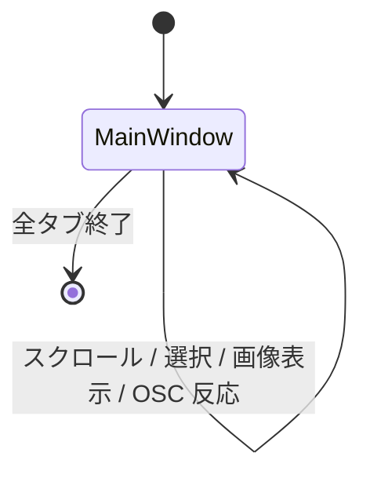
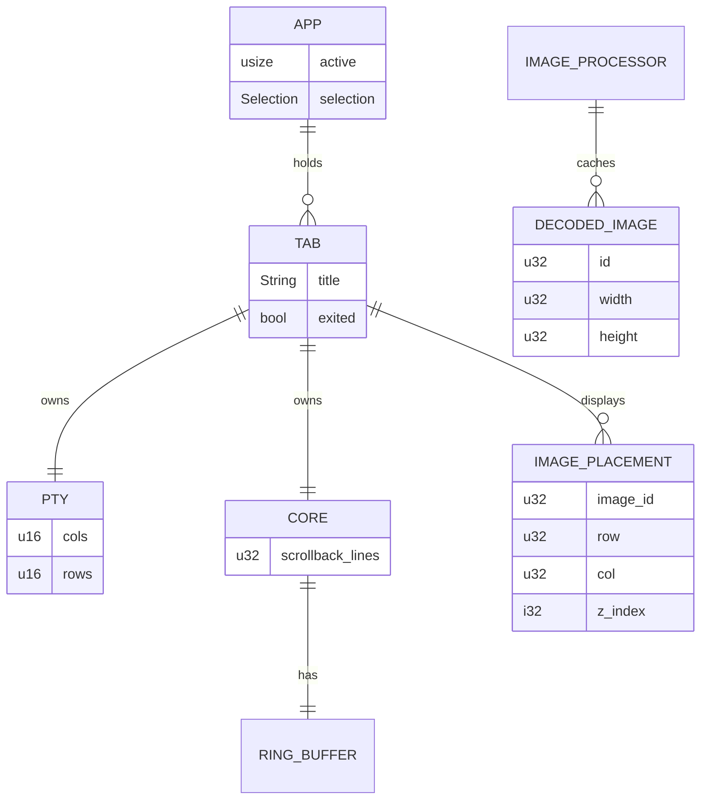

# ネイティブターミナル機能移植 (Phase 3) - 要件定義書

## 1. 概要

### 1.1 背景

`tmp/restruct.md` の段階的再構築計画における Phase 3 に該当する。

- Phase 1 (PoC, `doc/tasks/native-terminal-poc/`) で tao + wgpu + egui + portable-pty による最小ネイティブターミナルの技術的成立性を確認済み (Phase 6 swap で `term_core` 経由に再配線済み)
- Phase 2 (`doc/tasks/term-core-rust-crate/`) で `wasm/src/` を `crates/term_core/` に再編成し、Rust ライブラリとして直接 link 可能な状態を確立済み (15k LOC、wasm-bindgen 依存ゼロ)
- 一方、Phase 1 PoC は描画・選択・スクロールバック・OSC・画像が「最小実装」のままで、現行 emterm (Tauri/WebView 版) と機能等価ではない
- インライン画像 (Kitty / SIXEL) は PoC 範囲外として未実装、既存資産 `src-tauri/src/image/` は流用待ち

### 1.2 目的

Phase 1 PoC の最小実装をプロダクション品質に置換し、ネイティブターミナル単体で「現行 emterm の機能テスト相当」を満たす状態にする。mux / タブバー UI / Wry ビューア統合 / 設定 UI / i18n は Phase 4 以降に持ち越し、本 Phase はターミナル本体機能のみに集中する。

### 1.3 スコープ

**対象 (in scope)**:

- グリッド描画のダーティ行差分描画化 (Phase 1 PoC は毎フレーム全描画)
- カーソル / 選択 / スクロール / スクロールバックの本実装 (キーボード操作、検索 hooks は本 Phase 範囲外)
- インライン画像表示 (Kitty Graphics Protocol / SIXEL)。既存 `src-tauri/src/image/` の流用
- term_core が発火する OSC 全種類のテストカバレッジ (ターミナル本体側) と native 側の必要最小ハンドラ
- 長時間稼働再検証 (Phase 1 の 8h を超えるシナリオ。詳細は 11.2 KPI)
- 既存 emterm の機能テスト相当を cargo test / 手動でカバー
- Kitty / SIXEL 表示の現行版との差分なしを確認

**対象外 (out of scope)** — Phase 4 以降:

- mux 機能、タブバー UI 本実装 (Phase 1 PoC のフラットなタブで保留)
- Windows MS-IME 検証
- Wry ビューアウィンドウ (Markdown / JSON / YAML / 画像拡大) の本実装
- 設定ウィンドウの WebView 化
- i18n / テーマ動的同期
- 旧 Tauri ビルドの廃止 (Phase 7)
- macOS 対応

### 1.4 前提

- Phase 2 SDD (`doc/tasks/term-core-rust-crate/`) が全 step completed
- `crates/term_core/` が確立し、Cargo workspace に組み込まれている (members: `src-tauri / wasm / crates/term_core / native-poc`)
- Phase 1 PoC の native-poc は `term_core` を path 依存に切り替え済み (Phase 6 swap)
- Phase 1 PoC の wgpu surface 初期化 panic (`ERROR_SURFACE_LOST_KHR`) は Phase 3 開始前または並行で修正される (`native-poc/src/window_host.rs` の surface configure フロー)
- ベースブランチ: `refactor/native-terminal-hybrid`

## 2. ビジネス要件

### 2.1 ビジネス目標

ネイティブターミナル本体のみで現行 emterm の使用感に並ぶ品質を確保し、Phase 4 (mux + タブ UI) と Phase 5 (Wry ビューア) を載せる土台を完成させる。長時間 Claude Code セッションを WebView 版以上の安定性で回せるようにする。

### 2.2 対象ユーザー

| ユーザータイプ | 説明 |
|----------------|------|
| eMterm 開発者 | Phase 3 を実装・検証し、Phase 4 へ進む準備をする |
| eMterm エンドユーザー (将来) | 完成後にネイティブビルドを日常的に使う Linux ユーザー |

### 2.3 期待される効果

- Phase 1 PoC の最小 ANSI / 最小描画から、現行 emterm 機能テスト相当の挙動へ底上げ
- 既存 Kitty / SIXEL 画像表示が新スタックでも差分なく動作
- Phase 4 (mux + タブ UI) の前提となるターミナル本体 API が安定化
- 長時間稼働での実用性を Phase 1 より長いセッションで確認

## 3. ユースケース

### 3.1 ユースケース一覧

| ID | ユースケース名 | アクター | 優先度 |
|----|----------------|----------|--------|
| UC01 | 通常の対話シェル操作 (現行 emterm 同等の描画品質) | 開発者 / エンドユーザー | 高 |
| UC02 | スクロールバックを遡って過去出力を確認する | 開発者 / エンドユーザー | 高 |
| UC03 | マウスで範囲選択しコピー、クリップボードからペースト | 開発者 / エンドユーザー | 高 |
| UC04 | Kitty Graphics Protocol で画像を表示する | 開発者 / エンドユーザー | 高 |
| UC05 | SIXEL で画像を表示する | 開発者 / エンドユーザー | 高 |
| UC06 | OSC 拡張シーケンスを送出し、想定どおりに反応する | 開発者 | 高 |
| UC07 | 長時間 Claude Code セッションを継続する | 開発者 | 高 |
| UC08 | 現行 emterm の cargo test 相当が新スタックでパスする | 開発者 | 高 |

### 3.2 ユースケース詳細

#### UC01: 通常の対話シェル操作 (現行 emterm 同等の描画品質)

**アクター**: 開発者 / エンドユーザー

**事前条件**:

- `cargo run -p emterm-native-poc` でウィンドウが起動する
- Phase 1 PoC の surface 初期化 panic が修正済み

**基本フロー**:

1. シェル (`$SHELL` または `/bin/sh`) を起動
2. コマンド入力 → 出力描画が滑らかに行われる
3. SGR 属性 (色、bold、italic、underline、reverse、blink、conceal、strikethrough) が正しく反映される
4. カーソル形状 (block / underline / bar / blinking) が DECSCUSR / OSC 22 に従う
5. ウィンドウサイズ変更で grid と PTY winsize が追従する

**事後条件**:

- 描画はダーティ行のみ再描画される (毎フレーム全描画ではない)

#### UC02: スクロールバックを遡って過去出力を確認する

**アクター**: 開発者 / エンドユーザー

**事前条件**: UC01 完了

**基本フロー**:

1. シェルで長い出力 (例: `cat large.log`) を実行
2. マウスホイールを上方向にスクロール → 過去行が表示される
3. Shift+PageUp / PageDown でページ単位スクロール
4. 末尾 (live region) に戻ると新しい出力が再開される
5. alt-screen 中 (vim / less 等) はスクロールバックを抑止する

**事後条件**:

- scrollback ライン数は設定値 (デフォルト 10,000 行) 内
- ring buffer 上限到達後は古い行から破棄

#### UC03: マウスで範囲選択しコピー、クリップボードからペースト

**アクター**: 開発者 / エンドユーザー

**事前条件**: UC01 完了

**基本フロー**:

1. マウス左ボタンドラッグで範囲選択 (文字ベース)
2. ダブルクリックで単語選択、トリプルクリックで行選択
3. Linux PRIMARY セレクションへ自動コピー (X11 / Wayland)
4. Ctrl+Shift+C で CLIPBOARD へコピー
5. Ctrl+Shift+V または middle click で PTY へペースト
6. bracketed paste mode が有効なら `\e[200~ ... \e[201~` で wrap

**事後条件**:

- 選択範囲はテーマの selection color でハイライト表示

#### UC04: Kitty Graphics Protocol で画像を表示する

**アクター**: 開発者 / エンドユーザー

**事前条件**: UC01 完了、既存 `src-tauri/src/image/kitty.rs` 由来の Kitty デコーダが native 側で利用可能

**基本フロー**:

1. `emterm image foo.png` または等価な APC ペイロードを PTY 経由で送信
2. term_core の APC コールバックが native 側に届く
3. native の画像処理レイヤが既存 `image::ImageProcessor` を呼び出し、`DecodedImage` と `ImagePlacement` を取得
4. wgpu レイヤがセルグリッドの上に画像をオーバーレイ描画 (z_index に従う)
5. テキストスクロール時に画像配置も追従する

**代替フロー**:

- 不正な APC ペイロード: warning ログを出して無視
- メモリクォータ超過: LRU で最古エントリを破棄

**事後条件**:

- 現行 emterm (WebView 版) と画像表示位置 / サイズ / 表示順が差分なし (目視 + 必要に応じスクリーンショット比較)

#### UC05: SIXEL で画像を表示する

**アクター**: 開発者 / エンドユーザー

**事前条件**: UC04 と同様、既存 `src-tauri/src/image/sixel.rs` の SIXEL デコーダが native 側で利用可能

**基本フロー**:

1. DCS で始まる SIXEL ペイロードが PTY から到着
2. term_core の DCS コールバックが native 側に届く
3. `image::ImageProcessor::process_sixel()` が `DecodedImage` を生成
4. UC04 と同じレイヤがオーバーレイ描画する

**事後条件**: 現行 emterm と表示差分なし

#### UC06: OSC 拡張シーケンスを送出し、想定どおりに反応する

**アクター**: 開発者

**事前条件**: UC01 完了

**基本フロー**:

1. PTY 経由で各 OSC を送出 (titles、color palette、clipboard 52、notification 9、hyperlink 8、cursor shape 22、semantic prompt 133、emterm extension 777、iTerm2 1337、mux 9999、reset 系 104/110-112、SetFg/Bg/Cursor 10/11/12、WorkingDirectory 7)
2. term_core が `on_osc(action_type, data)` を発火
3. native 側 callback (`NativeCallbacks`) が想定どおりにステートを更新する
4. ターミナル本体内で完結する OSC (titles、color palette、cursor shape、hyperlink、fg/bg/cursor color、SemanticPrompt) は native 側で適用
5. ビューア起動系 (777 markdown / 拡張 viewer) は Phase 5 へ payload を queue するだけ
6. mux 系 (9999) は Phase 4 へ deferred (queue するだけ)

**事後条件**:

- 全 OSC 種別について cargo test で「該当 callback が想定どおりの引数で呼ばれる」ことが確認される

#### UC07: 長時間 Claude Code セッションを継続する

**アクター**: 開発者

**事前条件**: UC01, UC02, UC03 完了

**基本フロー**:

1. PoC ターミナル内で `claude` を起動
2. 通常の開発作業 (コード閲覧・編集・コマンド実行) を 8 時間以上継続、または起動したまま放置
3. 描画 / 入力レイテンシ / メモリ / GPU リソースを定期サンプリングする (手動)
4. Phase 1 PoC 時より長い 12〜24h セッションで再検証する

**代替フロー**:

- 画面消失 / クラッシュ / メモリ単調増加が発生したら事象を記録し、Phase 4 進行を停止して原因分析

**事後条件**:

- ウィンドウが応答可能、メモリ / GPU が安定

#### UC08: 現行 emterm の cargo test 相当が新スタックでパスする

**アクター**: 開発者

**事前条件**: Phase 2 完了で `term_core` 単体テストが緑

**基本フロー**:

1. 現行 emterm の cargo test カバレッジを棚卸し
2. ネイティブターミナル本体に関わるテストを `native-poc/tests/` または `crates/term_core/tests/` 配下に整理
3. 画像処理テスト (`src-tauri/src/image/*` の `#[cfg(test)]`) が新配置でも動くことを確認
4. `cargo test --workspace` がすべて緑

**事後条件**:

- Phase 3 完了時点で workspace 全体の `cargo test` が緑

## 4. 機能要件

### 4.1 機能一覧

| ID | 機能名 | 説明 | 優先度 |
|----|--------|------|--------|
| F01 | ダーティ行差分描画 | term_core の dirty flag を読み、変化のあった行のみ再描画する | 高 |
| F02 | カーソル本実装 | block / underline / bar / blinking、DECSCUSR、OSC 22、カーソル可視性 (DECTCEM) | 高 |
| F03 | 選択本実装 | 文字 / 単語 / 行選択、PRIMARY 自動コピー、CLIPBOARD コピー (Ctrl+Shift+C)、middle click ペースト | 高 |
| F04 | スクロール / スクロールバック本実装 | ホイール / キーボード、ring buffer 上限管理、alt-screen 中の抑止 | 高 |
| F05 | インライン画像 (Kitty) | `image::ImageProcessor::process_kitty_command` を流用、wgpu オーバーレイ | 高 |
| F06 | インライン画像 (SIXEL) | `image::ImageProcessor::process_sixel` を流用、wgpu オーバーレイ | 高 |
| F07 | OSC 全種ハンドラ | term_core の `on_osc` から native 側で処理する OSC を実装 | 高 |
| F08 | SGR 完全反映 | 色 (4/16/256/truecolor)、bold、italic、underline (single/double/curly/color)、reverse、blink、conceal、strikethrough | 高 |
| F09 | ペースト (bracketed paste) | bracketed paste mode (DECSET 2004) に従って wrap | 高 |
| F10 | リサイズ追従 | ウィンドウリサイズで grid + PTY winsize、再描画でレイアウト崩れなし | 高 |
| F11 | 既存テスト相当の cargo test カバレッジ | 既存 emterm の機能テスト相当を `cargo test --workspace` でカバー | 高 |
| F12 | 長時間稼働の再検証 | Phase 1 (8h) を超える 12〜24h シナリオで安定性を再検証 | 高 |

### 4.2 機能詳細

#### F01: ダーティ行差分描画

**説明**: Phase 1 PoC は毎フレーム全 cell を再描画していたが、term_core の dirty row 情報を使って変化のあった行のみ再描画する。

**ビジネスルール**:

- term_core が公開する dirty row API (`is_row_dirty(row)` / `clear_dirty(row)` 等、Phase 2 で確立済みの API) を使う
- カーソル位置・選択範囲が変化した行も dirty 扱い
- 画像オーバーレイは画像レイヤ独自の dirty 管理 (画像追加 / 削除 / スクロール時)

**エラーケース**:

- dirty 管理ミスで一部行が更新されない場合: 手動検証で検出、再現したらフレーム単位で全描画フォールバック (debug build のみ)

#### F02: カーソル本実装

**説明**: カーソル形状・色・可視性を term_core が保持する状態に従って描画する。

**ビジネスルール**:

- DECSCUSR (`CSI Ps SP q`) で形状 (block / underline / bar) と blink ON/OFF を切替
- OSC 22 (CursorShape) は term_core が action_type=22 で発火 (osc_handler.rs:99)
- DECTCEM (CSI ?25 h/l) でカーソル可視性 ON/OFF
- カーソル色は OSC 12 (SetCursorColor) / 112 (Reset) に従う
- 既存 emterm のグローバル設定 `cursor_show_interrupt` (デフォルト OFF) と整合

#### F03: 選択本実装

**説明**: マウスで範囲選択し、PRIMARY および CLIPBOARD へコピー、Ctrl+Shift+V や middle click でペースト。

**ビジネスルール**:

- 選択モード: 文字 (デフォルト) / 単語 (ダブルクリック) / 行 (トリプルクリック)
- 矩形選択 (block selection) は本 Phase ではスコープ外 (将来 Phase で追加可能)
- Linux PRIMARY セレクションへの自動コピーは選択確定時 (mouse up) に行う
- CLIPBOARD コピーは Ctrl+Shift+C
- ペーストは Ctrl+Shift+V (CLIPBOARD) + middle click (PRIMARY)
- bracketed paste mode (F09) と連携

#### F04: スクロール / スクロールバック本実装

**説明**: ring buffer ベースのスクロールバック (term_core の `ring_buffer` モジュール) を表示用にスクロール可能にする。

**ビジネスルール**:

- デフォルト scrollback ライン数: 10,000 行 (Phase 1 PoC は 1000)。settings.json で上書き可
- マウスホイールで 3 行 / tick (OS デフォルトに揃える)
- Shift+PageUp/Down でページ単位、Shift+Home/End で先頭 / 末尾
- alt-screen 中 (vim / less / tmux 等が DECSET 1049 で切り替えた状態) はホイール / キーで底以外の scrollback には行かない (現行 emterm と同等)
- スクロール中に新規出力が来ても自動追従しない (ユーザーが Shift+End または末尾近くまで戻るまで follow しない)

#### F05: インライン画像 (Kitty Graphics Protocol)

**説明**: 既存 `src-tauri/src/image/` を Cargo workspace 内の共通パスから native-poc が link できるようにし、Kitty Graphics Protocol で画像を表示する。

**入力**:

- `term_core::TerminalCallbacks::on_apc(data: &[u8])` 経由で APC ペイロード

**処理フロー**:

1. native callback 実装が `image::ImageProcessor::process_kitty_command` を呼ぶ
2. 返ってきた `Vec<ImageEvent>` (ImageReady / Place / Delete) を native 画像レイヤへ反映
3. 画像レイヤは wgpu テクスチャとして RGBA を取り込み、placement に従ってオーバーレイ描画

**ビジネスルール**:

- 既存 `src-tauri/src/image/` は `src-tauri/` から `crates/` 配下に移動するか、Cargo dependency として src-tauri からも参照可能にする (詳細は plan)
- 既存の依存先 (`crate::ansi::apc::KittyCommand` 等) も整合させる。APC parse は term_core の APC parser を使うか、または既存 `src-tauri/src/ansi/apc.rs` を再配置する
- LRU キャッシュ (320MB クォータ) を維持
- アニメーション (Kitty animation frames) は既存 `animation.rs` を流用

**エラーケース**:

- 不正な APC ペイロード: warning ログ、無視
- メモリクォータ超過: LRU で最古エントリを破棄、warning ログ
- 画像デコード失敗: warning ログ、該当 placement は表示しない

#### F06: インライン画像 (SIXEL)

**説明**: SIXEL を term_core の DCS callback 経由で受け取り、F05 と同じ画像レイヤで描画する。

**入力**:

- `term_core::TerminalCallbacks::on_dcs(data: &[u8])` 経由で DCS ペイロード (SIXEL は `ESC P q ... ESC \\`)

**処理フロー**:

1. native callback が DCS ペイロードを既存 `crate::ansi::dcs::parse_sixel` 相当でパース
2. `image::ImageProcessor::process_sixel` を呼ぶ
3. 以降は F05 と同じ

**ビジネスルール**: F05 と同様

#### F07: OSC 全種ハンドラ

**説明**: term_core が `on_osc(action_type: u8, data: &str)` で発火する全 action_type について native 側に最小ハンドラを置き、cargo test でカバーする。

**OSC 一覧** (term_core/src/osc_handler.rs より):

| param | action_type | 用途 | Phase 3 native 側挙動 |
|-------|-------------|------|----------------------|
| 0     | 0 | SetTitleAndIcon | tab.title 更新 (Phase 1 既実装) |
| 1     | 1 | SetIconName | log のみ (アイコン UI は Phase 4 以降) |
| 2     | 2 | SetTitle | tab.title 更新 (Phase 1 既実装) |
| 4     | 4 | SetColorPalette | パレット更新、テーマに反映 |
| 7     | 7 | SetWorkingDirectory | tab メタとして保持 (UI は Phase 4 以降) |
| 8     | 8 | Hyperlink | term_core 内部で URI 登録、native 側はクリック処理 (本 Phase は可視化のみ、クリックは Phase 4 以降でも可) |
| 9     | 9 | Notification | OS 通知 API (`notify-rust` 等) で表示 (将来 Phase 5 と整合) |
| 10    | 10 | SetForegroundColor | デフォルト fg 更新 |
| 11    | 11 | SetBackgroundColor | デフォルト bg 更新 |
| 12    | 12 | SetCursorColor | カーソル色更新 |
| 22    | 22 | CursorShape | カーソル形状更新 (F02) |
| 52    | 52 | Clipboard | OSC 52 経由のクリップボード set/get (現行 emterm 同等の許可ポリシー) |
| 104   | 104 | ResetColorPalette | パレットを既定値に戻す |
| 110   | 110 | ResetForegroundColor | 既定 fg に戻す |
| 111   | 111 | ResetBackgroundColor | 既定 bg に戻す |
| 112   | 112 | ResetCursorColor | 既定カーソル色に戻す |
| 133   | 133 | SemanticPrompt | プロンプトマーク保持 (将来の検索 / 折りたたみで使用、本 Phase は state 保持のみ) |
| 777   | 100 | EmtermExtension | Phase 5 向け queue (Phase 1 既実装) |
| 1337  | 101 | iTerm2 protocol | 必要最小限。画像系は Kitty / SIXEL 経由優先、未対応は log のみ |
| 9999  | -   | mux message | Phase 4 向け APC 互換 queue (term_core 側で APC callback に転送済) |
| その他 | 255 | Unknown | warning log |

**ビジネスルール**:

- term_core 内部で完結する OSC (例: 8 Hyperlink の URI 登録、4 / 104 の palette、133 SemanticPrompt) は term_core 側のテストに任せる
- native 側が処理する OSC については、上表の挙動を cargo test で確認

#### F08: SGR 完全反映

**説明**: term_core の SGR パーサが正しい属性を cell に書き込むことは Phase 2 で確認済み。Phase 3 では描画側でこれらをすべて視覚化する。

**ビジネスルール**:

- 色: 4-bit (8 基本色 + bright)、8-bit (256)、24-bit (truecolor) を漏れなく反映
- bold: 太字または bright color (現行 emterm の挙動に合わせる)
- italic: 斜体表示。等幅フォントで italic が無いフォントは roman を流用
- underline: single / double / curly。色は SGR 58 で指定された場合に反映
- reverse / blink / conceal / strikethrough を反映 (blink は描画 FPS の都合で 1Hz 程度の固定 toggle で良い)
- ambiguous width 文字の幅は settings.json の `ambiguous_width_mode` 設定に従う (現行 emterm の `narrow` / `wide` 設定を参照)

#### F09: ペースト (bracketed paste)

**説明**: クリップボードからの貼り付け時、bracketed paste mode (DECSET 2004) が有効なら `\e[200~ ... \e[201~` で wrap する。

**ビジネスルール**:

- 改行を含むペーストでも 1 回の wrap で送る
- bracketed paste mode 無効時は素のテキストを送る
- ペースト内容に `\e[201~` が含まれる場合は脱出させない (現行 emterm 同等のサニタイズ。詳細は plan で検討)

#### F10: リサイズ追従

**説明**: ウィンドウリサイズで cell grid サイズ・PTY winsize の両方が追従する。Phase 1 PoC で基本は実装済みのため、reflow と画像 placement の追従を本 Phase で完成させる。

**ビジネスルール**:

- term_core の reflow (`crates/term_core/src/reflow.rs`) を使って文字データの再配置を行う
- 画像 placement は新 cols/rows に合わせて再計算 (画像の絶対サイズは保持、cell 座標は変換)
- リサイズ中の中間状態でフリーズしないよう、描画と PTY winsize 通知は別タイミングで OK

#### F11: 既存テスト相当の cargo test カバレッジ

**説明**: 現行 emterm の機能テスト相当を新ネイティブスタックで実行する。

**ビジネスルール**:

- term_core 単体テスト: Phase 2 で移植済み、Phase 3 でも `cargo test -p term_core` が緑であることを継続確認
- 画像処理テスト: `src-tauri/src/image/` 配下にある `#[cfg(test)]` を新配置 (workspace 内) に追従し、`cargo test` で実行可能
- native-poc 側: OSC ハンドラ、選択ロジック、scrollback、SGR レンダラ入力出力、画像レイヤ統合のユニット / 結合テスト
- 既存 E2E (WebdriverIO / tauri-driver) はネイティブには非互換、本 Phase ではノータッチ
- `cargo test --workspace` が緑 + 手動検証 (UC01, UC04, UC05, UC07) を本 Phase Go/No-Go ゲートとする

#### F12: 長時間稼働の再検証

**説明**: Phase 1 PoC は 8h を Go/No-Go の閾値としたが、Phase 3 では 12〜24h を目標に再検証する。

**ビジネスルール**:

- Claude Code を起動した状態で 12h 以上 (実用時間帯) 稼働できることを確認
- メモリ (RSS)、GPU メモリ、画像 LRU キャッシュサイズ、term_core ring buffer の利用量をサンプリング
- 画面消失 / クラッシュ / 単調メモリ増加が発生したら原因記録し、Phase 4 進行を保留

## 5. 非機能要件

### 5.1 パフォーマンス要件

- 入力レイテンシ: Phase 1 PoC と同等以上 (体感判定)。差分描画導入による劣化が体感できない範囲
- 描画 FPS: 通常のシェル操作で 60 FPS (60Hz ディスプレイ前提)、大量出力時にもカクつき / フレーム落ち少
- スクロールスムーズさ: 10,000 行 scrollback で遅延なくスクロールできる
- 画像表示: Kitty / SIXEL 画像 (例: 1920x1080 PNG) を 300ms 以内に表示 (現行 WebView 版同等以上)

### 5.2 セキュリティ要件

- 既存 emterm の脅威モデルを継承
  - OSC 52 (clipboard) の許可ポリシーは現行 emterm と同等 (要 plan 段階で精査)
  - OSC ペイロード経由のスクリプト注入耐性 (画像デコーダの境界、APC / DCS のサイズ上限)
- 機密情報の永続化なし (本 Phase 範囲では設定ファイル以外に書かない)
- XSS 防止: 本 Phase は WebView 不使用のため対象外 (Phase 5 で再評価)

### 5.3 可用性要件

- 連続稼働 12 時間以上でクラッシュ / 画面消失 / メモリ単調増加が発生しない
- PTY 異常終了でタブだけが閉じ、メインウィンドウは応答継続

### 5.4 保守性要件

- ログ出力: `log` + `env_logger`。`RUST_LOG=info` でライフサイクルと parser warning が出る
- ファイル構成: 既存 native-poc のモジュール構成 (render / pty / parser → term_core / grid → term_core / selection / viewer / ime) を踏襲。画像レイヤ用に `native-poc/src/image/` (もしくは類似の場所) を新設
- ドキュメント: `native-poc/README.md` を Phase 3 完成時点の機能セットに合わせて更新

### 5.5 互換性要件

- 対応 OS: Linux のみ (Ubuntu 22.04 系開発機)。Windows 対応は Phase 4 へ送り
- 対応 IME: 本 Phase はターミナル本体に注力。Linux fcitx5 は Phase 1 で動いている前提で改修しない
- 対応 GPU バックエンド: wgpu デフォルト (Vulkan / GL)
- 既存 settings.json: 本 Phase で読み込み拡張する設定項目はフォント / カラー / scrollback / ambiguous width 等

## 6. UI/UX要件

### 6.1 画面設計要件

- メインウィンドウは Phase 1 PoC と同じ「タブバー + ターミナルグリッド」の縦 2 段構成。タブバー UI 本実装は Phase 4 へ持ち越し
- ステータスバー / 設定ウィンドウは本 Phase 範囲外

### 6.2 画面遷移

(Wry ビューア / 設定 / mux は本 Phase 範囲外のため遷移には含めない)

### 6.3 レスポンシブ対応

- F10 の通り、ウィンドウリサイズで grid と PTY winsize が追従

## 7. データ要件

### 7.1 データモデル概要

本 Phase で新規追加する永続データはない。実行時のオンメモリ状態:

### 7.2 データ項目

| エンティティ | 項目名 | 型 | 必須 | 説明 |
|--------------|--------|-----|------|------|
| settings.json | scrollback_lines | number | × | デフォルト 10000 |
| settings.json | font_family | string | × | フォント名 (現行設定流用) |
| settings.json | font_size | number | × | フォントサイズ |
| settings.json | color_scheme | object | × | 配色 (現行設定流用) |
| settings.json | ambiguous_width_mode | string | × | `narrow` / `wide` |
| settings.json | image_memory_quota_mb | number | × | 既定 320MB |

### 7.3 データ保持期間

- 画像 LRU キャッシュ: クォータ到達まで or 該当画像 ID が delete されるまで
- scrollback ring buffer: scrollback_lines 上限まで
- ユーザー設定: settings.json 上で永続 (既存ロジック流用)

## 8. 外部連携

### 8.1 連携システム

| システム名 | 連携方法 | データ |
|------------|----------|--------|
| OS PTY | portable-pty | shell 入出力 |
| システムクリップボード | arboard (CLIPBOARD + PRIMARY) | テキスト |
| OS 通知 | notify-rust 等 (OSC 9 で使用) | 通知タイトル / 本文 |
| Wry / mux / Wry 設定 | 本 Phase では未連携 (queue するのみ) | - |

### 8.2 API仕様要件

- emterm OSC 拡張: 既存仕様を踏襲 (Phase 5 で本接続)
- Kitty Graphics Protocol / SIXEL: 既存 `src-tauri/src/image/` の挙動を変更しない (バイナリ互換)

## 9. 制約条件

### 9.1 技術的制約

- ターゲット OS: Linux のみ (Phase 4 で Windows を扱う)
- Cargo workspace 構成を維持 (`src-tauri / wasm / crates/term_core / native-poc`)。`src-tauri` ブランチの旧 Tauri ビルドは Phase 7 まで残る
- term_core の API 変更を避ける。必要な拡張があれば term_core 側に PR-style 変更を加え、Phase 2 SDD の verify を再度通す
- 既存 `src-tauri/src/image/` のコードは可能な限り変更せず流用する (workspace 内の配置だけ調整する可能性あり)
- wasm-bindgen 依存は引き続き入れない

### 9.2 ビジネス上の制約

- main ブランチへのマージは Phase 7 まで行わない (refactor/native-terminal-hybrid ブランチ継続)
- 本 Phase の手動検証は開発者本人

### 9.3 スケジュール制約

- restruct.md 上の目安: Phase 3 = 2〜3 週間

## 10. 想定される課題とリスク

### 10.1 技術的課題

| 課題 | 影響度 | 対応策 |
|------|--------|--------|
| 既存 `src-tauri/src/image/` の依存先 (`crate::ansi::apc`, `crate::ansi::dcs`) と term_core の APC/DCS callback 結合のすり合わせ | 高 | plan 段階で「APC/DCS パーサを term_core 側に持つか、native 側で `ansi` モジュールを薄く保持するか」を決定。既存 src-tauri は Phase 7 まで動作させる必要があり、`ansi` モジュールの移動は最小限にする |
| wgpu テクスチャでの大量画像のオーバーレイ性能 | 中 | LRU と placement 個数の上限 (既存実装の挙動を継承)、テクスチャアトラスへの統合は本 Phase ではスコープ外 |
| ダーティ行差分描画とカーソル / 選択 / 画像の interaction バグ | 中 | dirty 判定を保守的にし、不安なら debug build で全描画フォールバックを残す |
| scrollback の reflow パフォーマンス (10,000 行) | 中 | term_core 既存 reflow を流用、Phase 2 のベンチ済み挙動を再利用 |
| OSC 9 通知 / OSC 52 クリップボードのプライバシ・許可ポリシー | 中 | 現行 emterm の許可ロジックを plan 段階で精査、native 側で同等に再現 |
| 長時間稼働での wgpu / egui テクスチャアトラスのリーク | 中 | 12〜24h セッションで RSS と GPU メモリを確認、リーク検出時は Phase 1 同様 wgpu 直叩きを検討 |

### 10.2 ビジネスリスク

| リスク | 発生確率 | 影響度 | 対応策 |
|--------|----------|--------|--------|
| 期間超過 (2〜3 週間に収まらない) | 中 | 中 | F05/F06 画像系がボトルネックになりやすい。仕様を絞る (Kitty/SIXEL の動作する範囲のみ、エッジケースは将来 Phase) |
| 画像表示で現行版との pixel 差分が出る | 中 | 中 | `src-tauri/src/image/` は流用方針なので、差分は描画レイヤ起因のはず。RGB → wgpu テクスチャ変換時の premultiplied alpha 等を plan で精査 |
| Phase 3 完了時点でも Phase 1 PoC の wgpu surface 初期化 panic が残る | 低 | 高 | 並行修正 (前提条件) を Phase 3 着手の必須前提とする |

## 11. 成功基準

### 11.1 受け入れ基準

すべて開発者本人による手動検証 + cargo test。

- [ ] `cargo run -p emterm-native-poc` で起動し、Phase 1 PoC と同等以上の品質で対話シェルが動く
- [ ] ダーティ行差分描画が機能 (毎フレーム全描画ではない)
- [ ] カーソル形状 (block / underline / bar、blink、可視性) が DECSCUSR / OSC 22 / DECTCEM に従う
- [ ] 範囲選択 (文字 / 単語 / 行)、PRIMARY 自動コピー、Ctrl+Shift+C / V、middle click ペーストが動作
- [ ] スクロールバック 10,000 行が遅延なくスクロール、alt-screen 中の抑止が機能
- [ ] Kitty Graphics Protocol で画像表示が現行 emterm と差分なし
- [ ] SIXEL で画像表示が現行 emterm と差分なし
- [ ] term_core 発火の全 OSC action_type について native 側挙動が cargo test で確認できる
- [ ] SGR 属性 (色 / bold / italic / underline / reverse / blink / conceal / strikethrough) がすべて描画される
- [ ] bracketed paste mode の wrap が動作する
- [ ] ウィンドウリサイズで grid + PTY winsize が追従し、画像 placement も整合
- [ ] `cargo test --workspace` が緑
- [ ] Claude Code を起動した状態で 12 時間以上の連続稼働で異常が出ない

### 11.2 KPI

| 指標 | 目標値 | 測定方法 |
|------|--------|----------|
| 連続稼働時間 | 12 時間以上 | 起動・放置後にウィンドウ応答とメモリ / GPU を確認 |
| `cargo test --workspace` | 全パス | CI / 手動 |
| 画像表示差分 | 0 件 | Kitty / SIXEL の代表的なペイロードで目視 + 必要に応じスクリーンショット比較 |
| OSC カバレッジ | 全 action_type | cargo test で each on_osc が呼ばれることを確認 |

## 12. テストシナリオ

### 12.1 テスト観点

- [ ] 正常系: 対話シェル、コマンド実行、SGR、カーソル、スクロール、選択、コピー、ペースト
- [ ] 正常系: Kitty Graphics Protocol で画像表示
- [ ] 正常系: SIXEL で画像表示
- [ ] 正常系: OSC 全 action_type 発火確認
- [ ] 正常系: alt-screen 中のスクロール抑止
- [ ] 異常系: 不正な APC / DCS ペイロードを送ってもクラッシュしない
- [ ] 異常系: 画像 LRU クォータ超過時の挙動
- [ ] 境界値: scrollback 上限到達 (10,000 行 + 1)
- [ ] 境界値: 大量出力 (`yes | head -n 100000`) で描画が破綻しない
- [ ] 境界値: ウィンドウ最小サイズ / 最大化 / アスペクト比変更
- [ ] 長時間系: 12 時間以上の Claude Code セッション
- [ ] 性能: 60 FPS 目標の維持を体感確認
- [ ] 互換: 現行 emterm (WebView 版) と画像 / OSC 反応に差分なし

## 13. 用語定義

| 用語 | 定義 |
|------|------|
| Phase 3 | restruct.md の段階的再構築計画の Phase 3。本 SDD が該当 |
| native-poc | `native-poc/` ディレクトリの emterm-native-poc バイナリ。Phase 1 PoC 起源、Phase 3 でプロダクション品質に置換 |
| term_core | `crates/term_core/`。Phase 2 で確立した ANSI パーサ + グリッド + Unicode の Rust crate |
| ダーティ行差分描画 | 変更があった行のみを再描画する手法。Phase 1 PoC では未実装 |
| インライン画像 | Kitty Graphics Protocol / SIXEL でターミナルセル上にオーバーレイ表示される画像 |
| OSC 拡張 | emterm 独自の OSC 制御シーケンス (777 や 9999 等) |
| alt-screen | DECSET 1049 等で切り替わる代替スクリーン (vim / less が利用) |
| scrollback | スクロールバック履歴。ring buffer ベース |

## 14. 確認事項

### 14.1 確認済み事項

ユーザーから「clarifying question なしで進めて」と指示されているため、以下は restruct.md と Phase 1 PoC ドキュメントから自律的に決定。

- [x] 配置先: `doc/tasks/native-terminal-features/`
- [x] スコープ: restruct.md Phase 3 の主なスコープ通り (差分描画 / カーソル選択スクロール本実装 / Kitty SIXEL / OSC 全種テスト / 長時間稼働)
- [x] Out of scope: mux / タブバー UI 本実装 / Windows IME / Wry ビューア / 設定 UI / i18n / 旧 Tauri 廃止
- [x] 対応 OS: Linux のみ
- [x] 既存 `src-tauri/src/image/` を流用 (Cargo workspace 内で参照可能にする方法は plan で決定)
- [x] Phase 1 PoC の native-poc 構成 (tao + wgpu + egui + portable-pty + term_core) を継承
- [x] scrollback デフォルト 10,000 行 (Phase 1 PoC は 1000 行で過小)
- [x] 長時間稼働ターゲット: 12 時間以上 (Phase 1 PoC は 8 時間)
- [x] OSC カバレッジ: term_core が発火する全 action_type を cargo test で網羅
- [x] OSC 777 (markdown) は Phase 5 まで queue する (本 Phase では発射しない)
- [x] OSC 9999 (mux) は Phase 4 まで queue する
- [x] 矩形 (block) 選択は本 Phase 範囲外
- [x] アンビギュアス幅は既存 settings.json の `ambiguous_width_mode` に従う

### 14.2 未確認・保留事項

以下は plan (`sdd.2-create-plan`) 段階で詰める。

- [ ] `src-tauri/src/image/` の workspace 内再配置方針 (新 crate 化するか、native-poc の依存にするか)
- [ ] `crate::ansi::apc` / `crate::ansi::dcs` の取り扱い (term_core への取り込み or src-tauri に残す or 共有 crate 化)
- [ ] OSC 52 clipboard / OSC 9 notification の許可ポリシー (現行 emterm の動作を plan 段階で精査)
- [ ] DECSCUSR / OSC 22 / DECTCEM の term_core 側の状態取得 API 整備状況の確認
- [ ] dirty row 取得 API の正確な term_core シグネチャ
- [ ] iTerm2 OSC 1337 で本 Phase に必須なサブセクション (画像系は Kitty / SIXEL 優先で代用)
- [ ] 12〜24h セッションの自動化 (本 Phase は手動)

## 15. 参考資料

- `tmp/restruct.md` - 再構築方針書 (本 Phase 3 SDD の出典)
- `doc/tasks/native-terminal-poc/SPEC.md` - Phase 1 PoC 仕様 (Phase 3 はその拡張)
- `doc/tasks/native-terminal-poc/要件定義書.md` - Phase 1 PoC 要件
- `doc/tasks/term-core-rust-crate/` - Phase 2 SDD (`term_core` crate 抽出、完了済み)
- `crates/term_core/src/lib.rs` - term_core 公開 API
- `crates/term_core/src/osc_handler.rs` - OSC action_type マッピング
- `crates/term_core/src/callbacks.rs` - TerminalCallbacks トレイト
- `src-tauri/src/image/` - Kitty / SIXEL デコーダ (流用元)
- `native-poc/src/` - Phase 1 PoC 実装 (Phase 3 で拡張する基盤)
- `CLAUDE.md` - プロジェクト全体方針
- `doc/UI-DESIGN-GUIDELINES.yaml` - UI デザイン規約 (現行 WebView 版向け、本 Phase でも色 / フォントトークンは参考)
