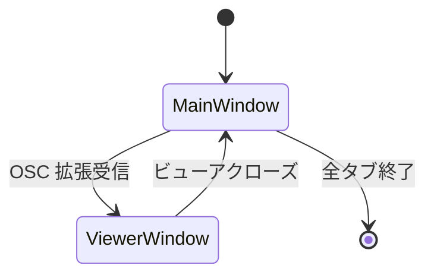

# ネイティブターミナル + WebView ビューア ハイブリッド構成 PoC - 要件定義書

## 1. 概要

### 1.1 背景
- 現行 emterm は Tauri (WebView ベース) で構築されているが、8 時間程度の連続利用で画面消失等の WebView 起因と思われる不安定挙動が発生している
- Tauri + WebView 関連の依存 (wry, tao, webkit2gtk-sys 等) が重く、開発体験を損ねている
- 一方、画像・Markdown・JSON・YAML ビューアの HTML/CSS/TS 資産は維持したい

### 1.2 目的
ターミナル本体をネイティブ化し、ビューア類は WebView を継続するハイブリッド構成への移行可否を、Proof of Concept (PoC) によって判断材料を揃える。本 PoC で大規模再構築 (1.5〜2ヶ月) に踏み切るかを決定する。

### 1.3 スコープ

**対象 (in scope)**:
- `tao` + `wgpu` + `egui` によるネイティブターミナルウィンドウの構築
- PTY 接続ありの実用シェル動作 (Linux 上で `bash` / `zsh` 等)
- 最小 ANSI パーサの新規実装によるグリッド描画・スクロール
- 選択・コピー / ペースト操作
- タブによる複数 PTY 保持
- OSC 拡張 (Markdown ビューア起動) を Wry ウィンドウ起動までエンドツーエンドで検証
- Linux fcitx5 環境下での IME 動作
- Claude Code を実際に走らせた 8 時間連続稼働テスト

**対象外 (out of scope)**:
- インライン画像 (Kitty/SIXEL) 表示
- mux 機能
- Windows IME (MS-IME)
- macOS 対応
- 設定 UI の再実装
- 入力レイテンシ・ビルド時間の数値計測スクリプト
- 既存 `wasm/src/` の Rust crate 化 (PoC 内では使わない)
- main ブランチへのマージ

## 2. ビジネス要件

### 2.1 ビジネス目標
AI 時代に「使える」ターミナルとしての emterm を、長時間安定動作と高速ビルドの両面で再起させるための技術判断材料を得る。

### 2.2 対象ユーザー
| ユーザータイプ | 説明 |
|----------------|------|
| eMterm 開発者 | PoC を実装・検証して再構築可否を判断する本人 |
| eMterm エンドユーザー (将来) | Claude Code を含む長時間 AI セッションを安定的に動かしたいユーザー |

### 2.3 期待される効果
- ネイティブ構成での 8 時間連続稼働の実現性が判定できる
- Wry との共存が成立するかが判定できる
- 開発体験 (ビルド時間) の改善見込みが体感で得られる
- 各 PoC 項目の Go/No-Go を踏まえて Phase 2 以降のロードマップが確定できる

## 3. ユースケース

### 3.1 ユースケース一覧
| ID | ユースケース名 | アクター | 優先度 |
|----|----------------|----------|--------|
| UC01 | PoC ターミナルを起動して通常の対話シェル操作を行う | 開発者 | 高 |
| UC02 | Claude Code を起動し 8 時間連続セッションを継続する | 開発者 | 高 |
| UC03 | 複数タブで並行作業する | 開発者 | 高 |
| UC04 | テキストを範囲選択しコピー & ペーストする | 開発者 | 高 |
| UC05 | `emterm markdown` 相当の OSC 受信で Wry ビューアを起動する | 開発者 | 高 |
| UC06 | fcitx5 を使って日本語入力 (プリエディット → 確定) を行う | 開発者 | 高 |
| UC07 | PoC 検証チェックリストに従い Go/No-Go を判定する | 開発者 | 高 |

### 3.2 ユースケース詳細

#### UC01: PoC ターミナルを起動して通常の対話シェル操作を行う

**アクター**: 開発者

**事前条件**:
- `native-poc/` ディレクトリで `cargo run` が成功する
- Linux デスクトップ環境にログイン済み

**基本フロー**:
1. `cd native-poc && cargo run` を実行
2. tao が単一ウィンドウを開き、egui+wgpu でターミナルグリッドが描画される
3. デフォルトシェル (`$SHELL` または `/bin/sh`) が PTY で spawn される
4. キー入力が PTY に送られ、出力がグリッドに反映される
5. `Ctrl+C` で SIGINT、`exit` でシェル終了とウィンドウクローズが動作する

**事後条件**:
- ターミナルが閉じる、または継続稼働している
- メモリ/GPU リソースが解放されている

#### UC02: Claude Code を起動し 8 時間連続セッションを継続する

**アクター**: 開発者

**事前条件**:
- UC01 のターミナルが起動できている
- Claude Code CLI がインストール済み

**基本フロー**:
1. PoC ターミナル内で `claude` を起動
2. 通常の開発作業 (コード閲覧・編集・コマンド実行) を行う
3. 8 時間継続して使用、または起動したまま 8 時間放置する
4. メモリ使用量とプロセス状態を定期的に確認する

**代替フロー**:
- 画面消失・クラッシュ・メモリ単調増加が発生した場合は事象を記録し、No-Go 判定材料とする

**事後条件**:
- 8 時間後もウィンドウが応答可能で表示が維持されている
- メモリ使用量が顕著に単調増加していない

#### UC03: 複数タブで並行作業する

**アクター**: 開発者

**事前条件**: UC01 完了

**基本フロー**:
1. キーバインド (Ctrl+Shift+T 等) でタブを追加
2. 各タブが独立した PTY を持ち、シェルが起動する
3. タブバーをクリックまたはキーバインドでタブを切り替える
4. タブを閉じる (Ctrl+Shift+W 等) と PTY が終了する

**事後条件**:
- 全タブ閉鎖時にウィンドウが終了する、または開いたまま新規タブを待つ (どちらでもよい)

#### UC04: テキストを範囲選択しコピー & ペーストする

**アクター**: 開発者

**事前条件**: UC01 完了

**基本フロー**:
1. マウスドラッグまたは Shift+矢印キーでテキスト範囲を選択
2. Ctrl+Shift+C でクリップボードにコピー
3. Ctrl+Shift+V でペースト
4. 別アプリへの貼り付け・別アプリからの貼り付けが成立する

**事後条件**:
- システムクリップボードに選択内容が反映されている

#### UC05: `emterm markdown` 相当の OSC 受信で Wry ビューアを起動する

**アクター**: 開発者

**事前条件**: UC01 完了

**基本フロー**:
1. PoC ターミナル内で OSC 拡張シーケンス (Markdown 内容を含む) を `printf` 等で送出
2. ANSI パーサが OSC を検出し、Markdown ビューア起動要求を発行
3. 新規 Wry ウィンドウが spawn され、Markdown を HTML 化した内容を表示
4. ビューアウィンドウを閉じる
5. ターミナル本体は影響を受けず継続稼働

**事後条件**:
- Wry プロセス/ウィンドウが解放されている
- ターミナル本体のスレッドが影響を受けていない

#### UC06: fcitx5 を使って日本語入力する

**アクター**: 開発者

**事前条件**:
- UC01 完了
- fcitx5 が起動し、日本語 IME (mozc 等) が選択可能

**基本フロー**:
1. PoC ターミナルにフォーカス
2. IME を有効化 (例: 半角/全角キー)
3. ローマ字入力でプリエディット表示が現れる
4. 候補ウィンドウが正しい位置に出る
5. 変換確定で PTY に確定文字列が送られる

**代替フロー**:
- プリエディット未表示・候補が出ない・確定が反映されない場合は事象を記録

#### UC07: PoC 検証チェックリストに従い Go/No-Go を判定する

**アクター**: 開発者

**基本フロー**:
1. `VERIFICATION.md` のチェックリストを順に確認
2. 各項目について手動で挙動を確認し合否を記録
3. 全項目を満たせば Go、満たせない項目があれば No-Go または個別対応 (例: IME NG なら winit raw IME を検討)

**事後条件**:
- 判定結果と根拠が `VERIFICATION_RESULT.md` に残る

## 4. 機能要件

### 4.1 機能一覧
| ID | 機能名 | 説明 | 優先度 |
|----|--------|------|--------|
| F01 | ネイティブウィンドウ起動 | tao + wgpu + egui で単一ウィンドウを開く | 高 |
| F02 | PTY 接続 | portable-pty 等で shell を spawn し入出力を中継 | 高 |
| F03 | 最小 ANSI パーサ | CSI/OSC を最低限解釈してグリッドに反映 | 高 |
| F04 | グリッド描画 | egui+wgpu によるセル単位描画 | 高 |
| F05 | スクロール | ホイール・キーで履歴スクロール | 高 |
| F06 | 選択・コピー | マウスドラッグ選択と Ctrl+Shift+C | 高 |
| F07 | ペースト | Ctrl+Shift+V | 高 |
| F08 | タブ管理 | 複数 PTY をタブで保持・切替 | 高 |
| F09 | OSC 拡張 → Wry 起動 | Markdown ビューア起動シーケンスを受信し Wry を spawn | 高 |
| F10 | Wry Markdown ビューア | 既存 HTML/CSS/TS 資産を Wry で表示 | 高 |
| F11 | 既存 settings.json 読込 | 設定ファイルを参照しフォント・色等の初期値を反映 | 中 |
| F12 | fcitx5 IME 入力 | プリエディット・確定・候補表示の動作 | 高 |

### 4.2 機能詳細

#### F01: ネイティブウィンドウ起動

**説明**: PoC は tao イベントループを駆動し、wgpu サーフェスに egui バックエンドで描画する単一ウィンドウを構成する。winit は採用しない。

**入力**: 起動時引数なし、`settings.json` から初期設定取得 (F11)

**出力**: 1 つのネイティブウィンドウ

**ビジネスルール**:
- ウィンドウフレームワークは `tao` で統一する
- GPU レンダリングは `wgpu` を直接または egui バックエンド経由で使用する

#### F02: PTY 接続

**説明**: `portable-pty` を用いてシェルを spawn し、PTY と GUI 側スレッド間で I/O を中継する。

**入力**: シェルパス (`$SHELL` 既定、未設定なら `/bin/sh`)、ウィンドウサイズ

**出力**: PTY 入出力、終了コード

**ビジネスルール**:
- PTY 読み取りスレッドと書き込みスレッドは分離する
- 読み取った bytes は ANSI パーサ (F03) に渡す
- ウィンドウサイズ変更時に PTY のサイズ (`winsize`) も追従する

#### F03: 最小 ANSI パーサ

**説明**: 既存 `wasm/src/` は再利用せず、PoC 内に最小限の ANSI / CSI / OSC パーサを新規実装する。Claude Code を含む対話シェル動作に必要な範囲をカバーする。

**ビジネスルール**:
- 必須カバー範囲 (Claude Code の動作確認に必要なもの):
  - C0 制御文字 (BS, CR, LF, HT, BEL)
  - CSI cursor (CUU/CUD/CUF/CUB/CUP/CHA), erase (ED/EL), SGR (色・属性)
  - CSI scroll region (DECSTBM)
  - CSI alt-screen (DECSET/DECRST 1049, 47, 1047, 1048)
  - OSC 0/2 (window title)
  - OSC 拡張 (Markdown ビューア起動。F09)
- 完全対応は不要。動かない sequence があれば PoC ログで検出し、最小限実装で済ませる
- Unicode 幅は `unicode-width` クレートで判定

#### F04: グリッド描画

**説明**: ターミナルグリッドを egui+wgpu で描画する。差分描画は必須ではなく、毎フレーム全描画でもよい (描画パフォーマンスは PoC のチェック対象)。

**ビジネスルール**:
- フォントは `settings.json` のフォント設定を可能な範囲で反映、無理なら egui 標準フォントでよい
- カラーは `settings.json` のテーマ設定を可能な範囲で反映

#### F05: スクロール

**説明**: スクロールバック履歴を保持し、ホイール・キーで遡れるようにする。

**ビジネスルール**:
- 履歴行数は `settings.json` の値、なければ 1000 行程度のデフォルト

#### F06: 選択・コピー

**説明**: マウスドラッグでテキスト選択、Ctrl+Shift+C でシステムクリップボードへコピー。

**ビジネスルール**:
- クリップボードアクセスは `arboard` 等の crate を使用
- 矩形選択は不要 (PoC では行ベースで十分)

#### F07: ペースト

**説明**: Ctrl+Shift+V でシステムクリップボードの内容を PTY へ送信。

**ビジネスルール**:
- bracketed paste mode (`\e[200~ ... \e[201~`) の検出は最小限実装で対応

#### F08: タブ管理

**説明**: 複数 PTY をタブとして保持し、ヘッダ部にタブバーを表示。Ctrl+Shift+T で追加、Ctrl+Shift+W で閉じる。

**ビジネスルール**:
- mux 機能 (分割) は実装しない
- タブ間切替はクリックまたは Ctrl+Tab / Ctrl+Shift+Tab

#### F09: OSC 拡張 → Wry 起動

**説明**: emterm 独自の OSC 拡張シーケンスを ANSI パーサが検出し、Wry ウィンドウを spawn して Markdown ビューアを起動する。

**ビジネスルール**:
- OSC 番号と payload 形式は既存の emterm CLI (`emterm markdown`) と互換
- Wry プロセスはターミナルと同一プロセス内に別ウィンドウとして spawn
- Wry ウィンドウのライフタイムはターミナル本体と独立

#### F10: Wry Markdown ビューア

**説明**: 既存 `src/markdown/` の HTML/CSS/TS 資産を Wry にロードして Markdown を表示する。

**ビジネスルール**:
- 既存資産の URL ロード or 文字列ロードのどちらでもよい
- テーマ同期はベストエフォート (PoC では暗色テーマ固定でも可)

#### F11: 既存 settings.json 読込

**説明**: 既存 emterm のユーザー設定 (`$XDG_CONFIG_HOME/emterm/settings.json` 等) を起動時に読み込み、可能な範囲で反映する。

**ビジネスルール**:
- ファイル不在時はデフォルト値で起動
- 反映できない設定項目は無視し warning ログを出す

#### F12: fcitx5 IME 入力

**説明**: Linux fcitx5 環境下でプリエディット・確定・候補表示が動作する。

**ビジネスルール**:
- 第一選択は egui の IME サポートに乗る
- 不十分な場合は tao の raw IME API での部分実装で代替

## 5. 非機能要件

### 5.1 パフォーマンス要件
- 入力レイテンシ: 体感で現行 WebView 構成より悪化していないこと (数値計測スクリプトは PoC 範囲外)
- 描画 FPS: ターミナル更新時に明白なカクつきがないこと (体感判定)
- ビルド時間: `cargo build` を数回サンプリングし、現行プロジェクトより短縮していることを記録 (数値スクリプト化は不要)

### 5.2 セキュリティ要件
- 既存 emterm の脅威モデル (OSC ペイロード経由のスクリプト注入) を PoC でも踏襲し、Wry に渡す Markdown は HTML エスケープ・サニタイズを既存実装の範囲で行う
- PoC 段階では機密情報の永続化なし
- 認証・認可: 該当なし

### 5.3 可用性要件
- 連続稼働 8 時間でクラッシュ・画面消失・メモリ単調増加が発生しないこと

### 5.4 保守性要件
- ログ出力: `log` クレート + `env_logger`、`RUST_LOG=info` 程度で動作確認できる
- ドキュメント: `native-poc/README.md` に起動方法と既知の制限を記載
- ファイル構成: ターミナル本体・PTY・パーサ・Wry 連携・UI を別モジュールに分離

### 5.5 互換性要件
- 対応 OS: Linux (Ubuntu 22.04 系の開発機で動作確認)
- 対応 IME: fcitx5
- 対応 GPU バックエンド: wgpu デフォルトのバックエンド (Vulkan/GL)

## 6. UI/UX要件

### 6.1 画面設計要件
- メインウィンドウは「タブバー + ターミナルグリッド」の縦 2 段構成
- ステータスバーは PoC では不要
- 設定 UI はなし

### 6.2 画面遷移

### 6.3 レスポンシブ対応
- ウィンドウリサイズで PTY のサイズが追従すること

## 7. データ要件

### 7.1 データモデル概要
PoC 範囲では永続データなし。`settings.json` のみ参照する。

### 7.2 データ項目
| エンティティ | 項目名 | 型 | 必須 | 説明 |
|--------------|--------|-----|------|------|
| settings.json | font_family | string | × | フォント名 |
| settings.json | font_size | number | × | フォントサイズ |
| settings.json | color_scheme | object | × | 配色 |

### 7.3 データ保持期間
該当なし

## 8. 外部連携

### 8.1 連携システム
| システム名 | 連携方法 | データ |
|------------|----------|--------|
| OS PTY | portable-pty | shell 入出力 |
| fcitx5 | tao/egui の IME ブリッジ | プリエディット・確定文字列 |
| システムクリップボード | arboard 等 | テキスト |
| Wry (WebView) | 別ウィンドウ spawn | Markdown HTML |

### 8.2 API仕様要件
- 既存 emterm OSC 拡張仕様を踏襲 (Markdown ビューア起動のみ)

## 9. 制約条件

### 9.1 技術的制約
- Linux のみ対応 (Windows / macOS は対象外)
- ウィンドウフレームワークは tao 固定
- 既存 `wasm/src/` は PoC では使用しない
- 既存 `src-tauri/` のコードは流用しない (ゼロから native-poc/ に最小限実装)
- インライン画像 (Kitty/SIXEL) は実装しない

### 9.2 ビジネス上の制約
- PoC の判定は開発者本人のみで行う
- main ブランチへのマージは Go 判定後の Phase 進行を待つ

### 9.3 スケジュール制約
- restruct.md 上の目安は Phase 1 = 1〜2 週間

## 10. 想定される課題とリスク

### 10.1 技術的課題
| 課題 | 影響度 | 対応策 |
|------|--------|--------|
| egui の IME 完成度が不足 | 高 | tao の raw IME API で部分実装、不可なら No-Go 判定 |
| tao + wry 共存で衝突発生 | 高 | tao + wry 標準サンプルに準拠、不可なら winit + wry へ切替検討 |
| wgpu の長時間 GPU リソースリーク | 高 | 8h テスト中に GPU メモリも観測、NG なら wgpu 直叩きへ切替検討 |
| Markdown HTML 資産の Wry 表示不具合 | 中 | 既存 HTML を最小化、表示できない要素は除外 |
| ANSI パーサ最小実装での Claude Code 非互換 | 中 | 必要な sequence を都度実装、影響大なら既存 wasm/ 検討 |
| ビルド時間の改善が体感できない | 中 | sccache 等の検討、改善幅が小なら No-Go ではなく注記扱い |

### 10.2 ビジネスリスク
| リスク | 発生確率 | 影響度 | 対応策 |
|--------|----------|--------|--------|
| PoC で No-Go 判定となり再構築計画が再検討 | 中 | 高 | restruct.md の non-goal を見直し、Ghostty 等を再検討 |
| PoC 期間が大幅超過 | 中 | 中 | 都度スコープを切り詰める。インライン画像は最後まで実装しない |

## 11. 成功基準

### 11.1 受け入れ基準

すべて開発者本人による手動検証 + `VERIFICATION.md` のチェックリスト。

- [ ] tao + wgpu + egui のウィンドウが起動する
- [ ] PTY 接続で対話シェルが動作する
- [ ] 最小 ANSI パーサでカーソル移動・SGR・スクロール・alt-screen が動作する
- [ ] 選択・コピー・ペーストが動作する
- [ ] 複数タブが動作する
- [ ] OSC 受信から Wry Markdown ビューア起動までが動作する
- [ ] Linux fcitx5 で IME 入力が動作する
- [ ] Claude Code を実際に走らせて 8 時間放置後もウィンドウが応答可能
- [ ] 8 時間後のメモリ使用量が単調増加していない
- [ ] `cargo build` のサンプリングで現行プロジェクトより短縮を確認

### 11.2 KPI
| 指標 | 目標値 | 測定方法 |
|------|--------|----------|
| 連続稼働時間 | 8 時間以上 | 手動で起動・放置後にウィンドウ応答とメモリを確認 |
| ビルド時間 | 現行比短縮 | `cargo build` を 2〜3 回計測 |
| 受け入れ基準充足 | 11.1 の全項目 ok | チェックリスト |

## 12. テストシナリオ

### 12.1 テスト観点
- [ ] 正常系: シェル起動・コマンド実行・出力描画
- [ ] 正常系: 選択 → コピー → 他アプリへ貼付
- [ ] 正常系: 他アプリ → コピー → ペースト
- [ ] 正常系: タブ追加・切替・閉鎖
- [ ] 正常系: OSC 拡張受信 → Wry ビューア起動 → クローズ
- [ ] 正常系: fcitx5 でローマ字 → かな → 漢字確定
- [ ] 長時間系: 8 時間 Claude Code 連続セッション
- [ ] 異常系: シェル異常終了時にタブが閉じる
- [ ] 異常系: Wry ビューアを大量に開閉してもメインが応答する
- [ ] 境界値: ウィンドウ最小サイズ・最大化
- [ ] 境界値: 大量出力 (`cat large_file`) で描画が破綻しない

## 13. 用語定義

| 用語 | 定義 |
|------|------|
| PoC | Proof of Concept。本タスクが該当 |
| ネイティブターミナル | tao + wgpu + egui で構築されるターミナル本体 |
| ビューアウィンドウ | OSC 受信で起動される Wry の WebView ウィンドウ |
| OSC 拡張 | emterm 独自の OSC 制御シーケンス |
| 最小 ANSI パーサ | PoC 用に新規実装する制限付きパーサ |

## 14. 確認事項

### 14.1 確認済み事項

- [x] SDD のスコープ: Phase 1 (PoC) のみ
- [x] feature ディレクトリ名: `native-terminal-poc`
- [x] 既存 Tauri 実装の扱い: main に残し、新規ブランチで並行開発しない (refactor/native-terminal-hybrid 現ブランチで継続)
- [x] PoC でのターミナル機能最小セット: PTY 接続ありのシンプルシェル
- [x] Window フレームワーク: 最初から tao で統一
- [x] テスト・検証手法: 手動検証中心 + 最小限の自動テスト
- [x] コード配置: リポジトリルートに `native-poc/` ディレクトリを新設
- [x] Wry 共存検証レベル: 既存 Markdown ビューアの HTML を Wry で表示
- [x] 8 時間稼働テスト: Claude Code 付きで試す
- [x] PoC 機能セット: ANSI パース・グリッド描画・スクロール、選択コピー / ペースト、タブ (複数 PTY)
- [x] インライン画像 (Kitty/SIXEL): PoC 対象外
- [x] OSC 拡張: Markdown ビューア起動をエンドツーエンドで検証
- [x] レイテンシ / ビルド時間判定: 両方とも体感 + ビルド時間は `cargo build` サンプリングのみ
- [x] ブランチ: refactor/native-terminal-hybrid をそのまま使用
- [x] IME 検証範囲: Linux fcitx5 のみ (Windows MS-IME は対象外)
- [x] 設定の扱い: 既存 settings.json をそのまま使う
- [x] 既存 wasm/src/ の扱い: PoC では使用せず最小 ANSI パーサを新規実装
- [x] 完了判定: 開発者本人による手動検証 + チェックリスト

### 14.2 未確認・保留事項

- [ ] 必要な ANSI シーケンスの正確な部分集合 (Claude Code を実行しながら不足分を都度追加する方針で進める)
- [ ] Wry に Markdown HTML をロードする際の URL 方式 / 文字列方式の選択 (実装時に決定)
- [ ] settings.json のスキーマで反映困難な項目の扱い (反映できない項目はログのみ)
- [ ] PoC 用ロガーの形式 (env_logger 既定で進める)

## 15. 参考資料

- `tmp/restruct.md`: 再構築方針書 (本 PoC の出典)
- `CLAUDE.md`: プロジェクト全体方針
- `src-tauri/src/pty/`: 既存 PTY 実装 (参考のみ、流用なし)
- `src/markdown/`: 既存 Markdown ビューア資産 (Wry に載せ替える対象)
