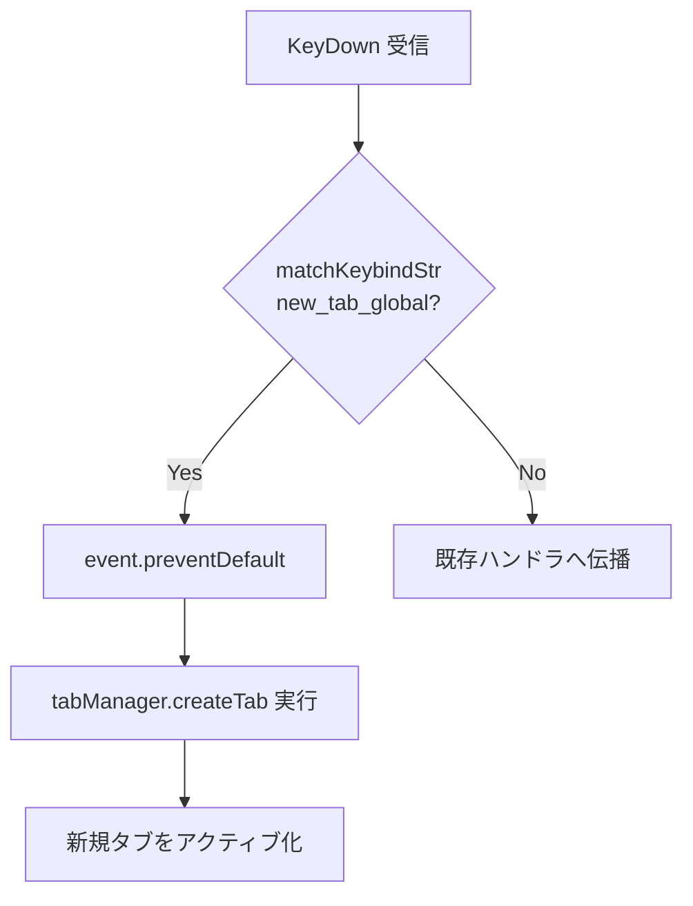

# グローバル設定で新規タブを開くショートカット - 要件定義書

## 1. 概要

### 1.1 背景
現在の `Ctrl+Shift+T` (`new_tab`) は、プロファイルが複数登録されている場合にデフォルトプロファイルで新規タブを開く挙動になっている。プロファイルが未登録の場合のみ、グローバル設定で新規タブを開く。

プロファイルを利用しているユーザーが、プロファイルではなくグローバル設定で素早く新規タブを開きたい場面で、現状はメニュー操作（または `Ctrl+Shift+P` のプロファイルセレクタ経由）が必要となる。

### 1.2 目的
プロファイルの有無や状態に依存せず、常にグローバル設定で新規タブを即座に開ける専用キーバインドを提供する。

### 1.3 スコープ
- 対象: 新規キーバインド `new_tab_global` の追加（デフォルト `Ctrl+Shift+G`）
- 対象: 設定 UI でのカスタマイズ対応
- 対象: i18n ラベル（英語・日本語）の追加
- 対象外: 既存の `new_tab` (`Ctrl+Shift+T`) の挙動変更
- 対象外: タブバー UI の `+` ボタン挙動変更
- 対象外: コンテキストメニュー等への新規エントリ追加

## 2. ビジネス要件

### 2.1 ビジネス目標
プロファイル機能を活用するユーザーの操作効率を向上させる。

### 2.2 対象ユーザー
| ユーザータイプ | 説明 |
|----------------|------|
| プロファイル利用ユーザー | 複数のシェル環境やリモート接続をプロファイル登録して使い分けるユーザー |
| パワーユーザー | キーバインドを多用してマウス操作を避けるユーザー |

### 2.3 期待される効果
- プロファイル設定の有無に関わらず、グローバル設定で新規タブを開く操作が 1 ストロークで完結する
- メニュー経由の操作と比較して操作ステップが削減される

## 3. ユースケース

### 3.1 ユースケース一覧
| ID | ユースケース名 | アクター | 優先度 |
|----|----------------|----------|--------|
| UC01 | グローバル設定で新規タブを即座に開く | ユーザー | 高 |
| UC02 | キーバインドをカスタマイズする | ユーザー | 中 |

### 3.2 ユースケース詳細

#### UC01: グローバル設定で新規タブを即座に開く

**アクター**: ユーザー（プロファイル登録の有無は問わない）

**事前条件**:
- アプリケーションが起動している
- ターミナル領域またはアプリウィンドウがフォーカスされている

**基本フロー**:
1. ユーザーが `Ctrl+Shift+G` を押下する
2. システムはプロファイル選択メニューを表示せず、グローバル設定で新規タブを作成する
3. 新規タブがアクティブ化される

**代替フロー**:
- なし（プロファイルの有無で挙動は分岐しない）

**事後条件**:
- グローバル設定（`AppSettings` 直下のシェル/CWD/環境変数）に従った新規タブが作成・アクティブ化される

#### UC02: キーバインドをカスタマイズする

**アクター**: ユーザー

**事前条件**:
- 設定パネルが開ける状態である

**基本フロー**:
1. ユーザーが設定パネルを開く（`Ctrl+,`）
2. 「キーバインド」セクションの「タブ管理」サブセクションを表示する
3. 「新しいタブ (グローバル設定)」項目のキーバインドを変更する
4. 設定を保存する

**事後条件**:
- カスタマイズしたキーバインドが永続化され、次回以降の押下で `new_tab_global` の挙動が発動する

## 4. 機能要件

### 4.1 機能一覧
| ID | 機能名 | 説明 | 優先度 |
|----|--------|------|--------|
| F01 | `new_tab_global` キーバインド追加 | デフォルト `Ctrl+Shift+G`、グローバル設定で新規タブを開く | 高 |
| F02 | 設定 UI 表示 | キーバインド設定の「タブ管理」サブセクションに項目追加 | 高 |
| F03 | i18n ラベル追加 | 英語・日本語の表示ラベルを追加 | 高 |

### 4.2 機能詳細

#### F01: `new_tab_global` キーバインド追加

**説明**: Rust 側 `KeybindSettings` に新規フィールド `new_tab_global` を追加し、TypeScript 側 `KeybindSettings` インタフェースに同名フィールドを追加する。`TabKeyboardHandler` で `Ctrl+Shift+G` 押下時に `tabManager.createTab()` を直接呼び出す。

**入力**:
- `KeyboardEvent`: ユーザーのキー押下イベント

**出力**:
- なし（副作用としてタブ作成）

**処理フロー**:

**ビジネスルール**:
- プロファイルの有無、デフォルトプロファイルの存在に関わらず、常に `tabManager.createTab()` を直接呼ぶ
- プロファイルセレクタ・プロファイルメニューは表示しない
- 既存 `new_tab` (`Ctrl+Shift+T`) のロジックは変更しない

**バリデーション**:
| 項目 | ルール | エラーメッセージ |
|------|--------|------------------|
| キーバインド文字列 | 既存の `KeybindSettings` 文字列バリデーションに従う | 既存メッセージを流用 |

**エラーケース**:
| エラー | 条件 | 対応 |
|--------|------|------|
| タブ作成失敗 | `tabManager.createTab()` が `null` を返す | 既存の失敗時挙動と同じ（追加対応なし） |

#### F02: 設定 UI 表示

**説明**: `src/settings/sections/keybinds-section.ts` の「タブ管理」サブセクションに `new_tab_global` の入力欄を追加する。位置は `new_tab` の直後とする。

**入力**:
- `currentSettings.keybinds.new_tab_global`: string

**出力**:
- キーバインド入力 UI（既存の `renderKeybindInput` を流用）

**ビジネスルール**:
- 既存キーバインド入力と同等の UX を提供する
- ラベルキー: `settings.keybinds.newTabGlobal`

#### F03: i18n ラベル追加

**説明**: フロントエンド i18n ファイルに以下を追加する。

**入力/出力**:

| ファイル | キー | 値 |
|----------|------|-----|
| `src/i18n/locales/en.json` | `settings.keybinds.newTabGlobal` | `New Tab (Global)` |
| `src/i18n/locales/ja.json` | `settings.keybinds.newTabGlobal` | `新しいタブ (グローバル設定)` |

## 5. 非機能要件

### 5.1 パフォーマンス要件
- キー押下からタブ生成開始までの遅延: 既存 `new_tab` と同等（追加処理は分岐 1 個のみ）

### 5.2 セキュリティ要件
- 該当なし（既存の `tabManager.createTab` を流用）

### 5.3 可用性要件
- 既存設定ファイルとの後方互換性: 既存 `KeybindSettings` の `serde(default)` + `deserialize_null_with!` パターンに従い、`new_tab_global` フィールド未設定時はデフォルト値 `Ctrl+Shift+G` が適用される

### 5.4 保守性要件
- 既存の `define_keybinds!` マクロパターンに従って実装する
- TypeScript 側 `KeybindSettings` インタフェースを Rust 側と同期する

### 5.5 互換性要件
- Linux / Windows 両方で動作する（プラットフォーム固有処理なし）
- 既存設定 JSON との互換性を維持する

## 6. UI/UX要件

### 6.1 画面設計要件
- 設定パネル → キーバインド → タブ管理サブセクションに項目を追加
- 表示順: `new_tab` → **`new_tab_global` (新規)** → `close_tab` → `next_tab` → `prev_tab` → `profile_selector`

### 6.2 画面遷移
特になし（既存設定パネル内で完結）

### 6.3 レスポンシブ対応
既存設定パネルのレイアウトに従う

## 7. データ要件

### 7.1 データモデル概要
`KeybindSettings` 構造体に 1 フィールド追加するのみ。

### 7.2 データ項目
| エンティティ | 項目名 | 型 | 必須 | 説明 |
|--------------|--------|-----|------|------|
| `KeybindSettings` (Rust) | `new_tab_global` | `String` | × (default あり) | グローバル設定で新規タブを開くキーバインド文字列 |
| `KeybindSettings` (TS) | `new_tab_global` | `string` | ○ | 同上（フロントエンド側） |

### 7.3 データ保持期間
既存設定ファイル (`config.json`) と同一

## 8. 外部連携

### 8.1 連携システム
なし

### 8.2 API仕様要件
なし

## 9. 制約条件

### 9.1 技術的制約
- 既存の `define_keybinds!` マクロを使用する（個別フィールド定義は避ける）
- `matchKeybindStr` ユーティリティを流用する
- フロントエンドの i18n キー命名規則 (camelCase) に従う

### 9.2 ビジネス上の制約
- 既存ユーザーの設定ファイルを破壊しない（後方互換性必須）

### 9.3 スケジュール制約
特になし

## 10. 想定される課題とリスク

### 10.1 技術的課題
| 課題 | 影響度 | 対応策 |
|------|--------|--------|
| 既存 `Ctrl+Shift+G` のグローバル衝突 | 低 | 事前調査済み: 既存キーバインドに登録なし |
| プロファイル 0 個時の `Ctrl+Shift+T` との重複動作 | 低 | 仕様として許容（ユーザーは `new_tab` 側を変更可能） |

### 10.2 ビジネスリスク
| リスク | 発生確率 | 影響度 | 対応策 |
|--------|----------|--------|--------|
| ユーザーが既存 `Ctrl+Shift+G` を別用途で記憶している | 低 | 低 | カスタマイズ可能 |

## 11. 成功基準

### 11.1 受け入れ基準
- [ ] `Ctrl+Shift+G` 押下でグローバル設定の新規タブが開く（プロファイル登録あり/なし両方で確認）
- [ ] プロファイル選択メニューが表示されない
- [ ] 既存 `Ctrl+Shift+T` の挙動が変わらない
- [ ] 設定 UI に「新しいタブ (グローバル設定)」項目が表示される
- [ ] 設定 UI でキーバインドを変更でき、変更後に新キーで動作する
- [ ] 既存の設定ファイル（`new_tab_global` フィールドなし）でアプリが起動でき、デフォルト値が適用される
- [ ] 英語・日本語ラベルが正しく表示される
- [ ] 既存の Rust / TypeScript 単体テストが全て通過する

### 11.2 KPI
特になし（機能追加のため定量指標なし）

## 12. テストシナリオ

### 12.1 テスト観点
- [ ] 正常系: プロファイル 0 個で `Ctrl+Shift+G` → グローバル設定でタブ作成
- [ ] 正常系: プロファイル 1 個以上 + デフォルトあり で `Ctrl+Shift+G` → メニュー非表示、グローバル設定でタブ作成
- [ ] 正常系: プロファイル 1 個以上 + デフォルトなし で `Ctrl+Shift+G` → グローバル設定でタブ作成
- [ ] 正常系: `Ctrl+Shift+T` 押下時の既存挙動が変わらない（プロファイル有無別に確認）
- [ ] 正常系: 設定 UI でキーバインドを `Ctrl+Alt+N` 等に変更 → 新キーで動作
- [ ] 異常系: 設定ファイルに `new_tab_global` がない（旧バージョン） → デフォルト `Ctrl+Shift+G` 適用
- [ ] 異常系: 設定ファイルで `new_tab_global: null` → デフォルト適用
- [ ] 境界値: 既存タブと同じキーを設定した場合のバリデーション挙動（既存挙動に従う）
- [ ] パフォーマンス: 既存 `new_tab` と同等のレイテンシ

## 13. 用語定義

| 用語 | 定義 |
|------|------|
| グローバル設定 | プロファイルを介さず、`AppSettings` 直下に保存されたシェル/CWD/環境変数等のデフォルト設定 |
| プロファイル | ユーザーが定義する起動設定セット (`Profile` 構造体)。`is_default` フラグでデフォルト指定可能 |
| `tabManager.createTab()` | プロファイル指定なしの引数 `{}` で呼ぶ、グローバル設定によるタブ作成メソッド |

## 14. 確認事項

### 14.1 確認済み事項
- [x] キーバインド名: `new_tab_global` を採用
- [x] デフォルトキーバインド: `Ctrl+Shift+G`
- [x] 設定 UI でカスタマイズ可能とする（既存キーバインドと同様）
- [x] 英語ラベル: `New Tab (Global)`、日本語ラベル: `新しいタブ (グローバル設定)`
- [x] プロファイル 0 個時、`Ctrl+Shift+T` と `Ctrl+Shift+G` は同じ挙動になることを許容する
- [x] 既存 `Ctrl+Shift+T` (`new_tab`) の挙動は変更しない
- [x] 設定 UI 表示位置: `new_tab` の直後

### 14.2 未確認・保留事項
- なし

## 15. 参考資料

- `src/tab-bar/keyboard-handler.ts`: タブ系キーボードハンドラ
- `src/tab-bar/tab-bar-ui.ts`: タブバー UI（プロファイルメニュー含む）
- `src-tauri/src/commands/config/settings.rs`: Rust 側 `KeybindSettings` 定義
- `src/settings/types.ts`: TypeScript 側 `KeybindSettings` インタフェース
- `src/settings/sections/keybinds-section.ts`: 設定 UI のキーバインドセクション
- `src/i18n/locales/{en,ja}.json`: フロントエンド i18n
