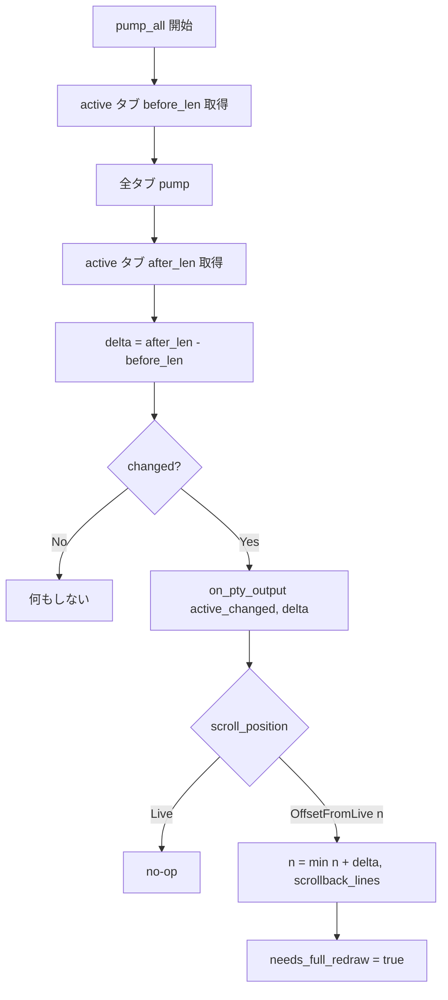
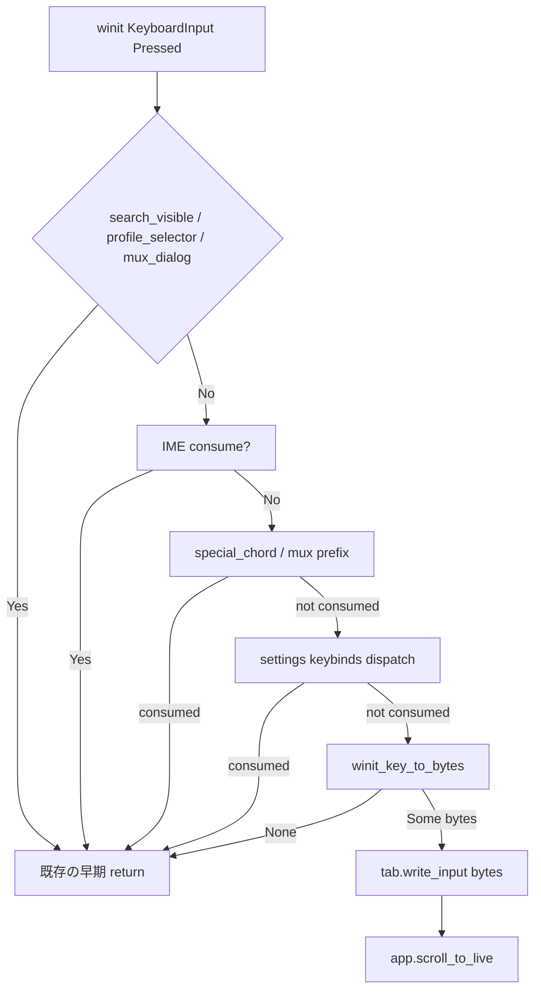
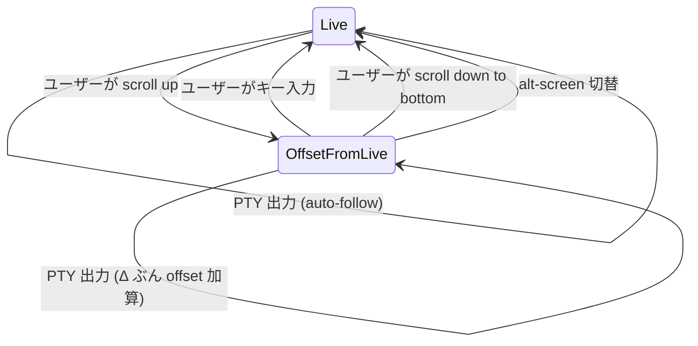
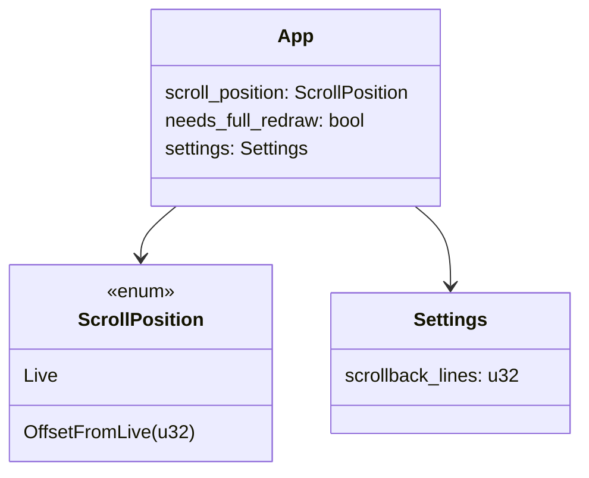

# スクロール中の表示固定 + キー入力で最下行復帰 - 要件定義書

## 1. 概要

### 1.1 背景

eMterm はスクロールバックを `ScrollPosition::OffsetFromLive(n)` で保持する設計だが、scrollback capacity 未満の状態で PTY から新規行が追加されると「画面上に見えている内容」が1行下にずれてしまう。`App::on_pty_output` のドキュメントには「offset stays anchored」と書かれているが、これは capacity 到達後のケースのみ正しく、未満では `scrollback_len` の増分ぶん `visible_start` が前進して見えている行が押し出される。

また、スクロールバックを閲覧中にユーザーがキー入力を始めても自動で live tail に戻る仕組みがないため、入力したコマンドのエコーが視界外で発生して取り回しが悪い。

### 1.2 目的

- スクロール位置を保持している間、PTY からの新規出力で「画面上に見えている内容」がズレないようにする
- スクロール中にユーザーがキー入力したら自動的に live tail（最下行）に戻す

### 1.3 スコープ

**対象**:
- `App::on_pty_output` 周辺のスクロール位置追従ロジック
- `pump_all` での scrollback 差分計算と受け渡し
- `window_host` のキー入力経路から `scroll_to_live()` 呼び出し

**対象外**:
- alt-screen 中の挙動（既に強制 `Live` 復帰している）
- mux daemon 側 scrollback 管理（クライアント側 grid のみで完結する）
- Mouse wheel スクロール（既に独立経路）
- 検索オーバーレイ表示中の入力（既に早期 return）
- 修飾キー単体（Shift/Ctrl/Alt 単体）— `winit_key_to_bytes` が `None` を返すため自動除外

## 2. ビジネス要件

### 2.1 ビジネス目標

ターミナル閲覧中の体感品質を向上させる。スクロールバックを読み返している間に画面が勝手にスクロールしないことで、ログ追跡やデバッグ作業の集中を阻害しない。

### 2.2 対象ユーザー

| ユーザータイプ | 説明 |
|----------------|------|
| eMterm エンドユーザー | ログ閲覧・コマンド実行中にスクロールバックを行き来する一般利用者 |
| Claude Code ユーザー | 長い出力を遡って読みながら次のコマンドを打つ AI コーディング利用者 |

### 2.3 期待される効果

- スクロール中に PTY 出力が来ても閲覧位置がずれない
- スクロール状態のままキーを打てば即 live tail に戻るので「いま入力したのにエコーが見えない」事故が消える

## 3. ユースケース

### 3.1 ユースケース一覧

| ID | ユースケース名 | アクター | 優先度 |
|----|----------------|----------|--------|
| UC01 | スクロール中に PTY 出力が来ても表示が固定される | エンドユーザー | 高 |
| UC02 | スクロール中にキー入力すると最下行に戻る | エンドユーザー | 高 |

### 3.2 ユースケース詳細

#### UC01: スクロール中に PTY 出力が来ても表示が固定される

**アクター**: エンドユーザー

**事前条件**:
- alt-screen ではない
- `scroll_position` が `OffsetFromLive(n)` (`n > 0`)
- scrollback capacity (`settings.scrollback_lines`) には未到達

**基本フロー**:
1. ユーザーがスクロールアップして scrollback を閲覧している
2. PTY から新しい行が届く
3. `pump_all` が pump 前後で `scrollback_len` の差分 Δ を取得する
4. `App::on_pty_output` が呼ばれ、`OffsetFromLive(n)` を `OffsetFromLive(min(n + Δ, settings.scrollback_lines))` に更新する
5. 再描画後、画面上の同じ位置に同じ内容が表示されたまま、新しい行は live tail（画面外）に積まれる

**代替フロー**:
- scrollback capacity に到達済みの場合、`scrollback_len` 不変なので Δ = 0 となり、追従ロジックは発火しない（scrollback の中身そのものが1行シフトするため、見えている内容は1行ぶん古い行に変わる — 許容）
- alt-screen 中は `scroll_position` が `Live` 固定なので追従不要（既存挙動）

**事後条件**:
- 画面上の同じ行に同じ内容が描画されている
- `scroll_offset()` が Δ 増えている

#### UC02: スクロール中にキー入力すると最下行に戻る

**アクター**: エンドユーザー

**事前条件**:
- `scroll_position` が `OffsetFromLive(n)`
- 検索オーバーレイ・プロファイルセレクタ・mux ダイアログいずれも非表示
- mux プレフィックスラッチが解除済み

**基本フロー**:
1. ユーザーがキー入力する（修飾キーを除く、PTY に送られるキー）
2. `window_host` 側で `winit_key_to_bytes(&event, mods, target)` が `Some(bytes)` を返す
3. `tab.write_input(bytes)` 直前 or 直後に `app.scroll_to_live()` を呼ぶ
4. `scroll_position` が `Live` に戻り `needs_full_redraw = true` がセットされる
5. 再描画後、画面は live tail を表示する

**代替フロー**:
- 修飾キー単体押下: `winit_key_to_bytes` が `None` を返すため `scroll_to_live` は呼ばれない
- Shift+PageUp などのスクロールチョード: `handle_special_chord` で処理され `write_input` に到達しないため影響なし
- 検索オーバーレイ表示中: 既に早期 return しているので発火しない
- mux プレフィックスラッチ中: ラッチ消費キーは PTY に行かないので発火しない。ラッチ解除後の通常キーで発火する

**事後条件**:
- `scroll_position` が `Live`
- 入力された bytes が PTY に書き込まれている

## 4. 機能要件

### 4.1 機能一覧

| ID | 機能名 | 説明 | 優先度 |
|----|--------|------|--------|
| F01 | スクロール位置の追従 | pump 前後の `scrollback_len` 差分 Δ ぶんだけ `OffsetFromLive(n)` を += する | 高 |
| F02 | キー入力での live 復帰 | `winit_key_to_bytes` が `Some` を返す任意のキー入力で `scroll_to_live()` を呼ぶ | 高 |
| F03 | Doc コメント整合 | `App::on_pty_output` のドキュメントを実装と整合する形に書き直す | 中 |

### 4.2 機能詳細

#### F01: スクロール位置の追従

**説明**:

`pump_all` の active タブ pump 前後で `core.get_scrollback_length()` を取得し、その差分 Δ を `on_pty_output` に渡す。`on_pty_output` は `OffsetFromLive(n)` 状態のときに `n` を `min(n + Δ, settings.scrollback_lines)` に更新する。`Live` 状態では従来どおり no-op。

**入力**:
- `scrollback_delta`: `u32` - active タブの pump 前後 `scrollback_len` 差分

**出力**:
- `App::scroll_position` の更新（`OffsetFromLive` のとき）
- `App::needs_full_redraw = true`

**処理フロー**:

**ビジネスルール**:
- 差分は active タブの core のみを対象とする（background タブの scrollback 変動は active 視点と無関係）
- capacity 到達後は `scrollback_len` 不変なので Δ = 0 となり、追従ロジックは自動的に発火しない
- `set_alt_screen(true)` で `scroll_position` が `Live` に戻っているため、alt-screen 中の追従は自然と発火しない（追加ガード不要）

**バリデーション**:
| 項目 | ルール | エラーメッセージ |
|------|--------|------------------|
| `scrollback_delta` | `u32` で受け取り、`saturating_add` でオーバーフロー回避 | （内部処理、エラーなし） |
| 新オフセット | `settings.scrollback_lines` でクランプ | （内部処理） |

**エラーケース**:
| エラー | 条件 | 対応 |
|--------|------|------|
| capacity ぎりぎりで evict と push が同時発生 | 1フレームで push 数 > 差分 | 差分 = 実 push 数 - evict 数 となり 1 行ぶん画面ずれが残る（許容 — 上限到達時と同じケース） |

#### F02: キー入力での live 復帰

**説明**:

`window_host` のキー入力経路、`winit_key_to_bytes` が `Some(bytes)` を返した直後に `tab.write_input(bytes)` と並んで `app.scroll_to_live()` を呼ぶ。

**入力**:
- なし（既存のキーイベント処理パスに挿入）

**出力**:
- `App::scroll_position = Live`
- `App::needs_full_redraw = true`

**処理フロー**:

**ビジネスルール**:
- mux 経由でも同じ経路（`winit_key_to_bytes` の `EncodeTarget::PosixPty` 分岐は影響なし）
- alt-screen 中は `scroll_position` が常に `Live` なので呼んでも無害
- `scroll_to_live()` 自身は alt-screen ガードを持たない（呼ばれた時点で `Live` への代入になるだけ）

**エラーケース**:
| エラー | 条件 | 対応 |
|--------|------|------|
| 修飾キー単体押下 | `winit_key_to_bytes` が `None` | 発火しない（仕様どおり） |
| 検索オーバーレイ表示中 | `search_visible == true` | 早期 return（既存）で経路に到達しない |

#### F03: Doc コメント整合

**説明**:

`App::on_pty_output` の Doc コメント「Visually, the offset stays anchored because `term_core`'s ring buffer shifts the old content into scrollback under us.」は capacity 到達後のケースだけ正しい。capacity 未満では `scrollback_len` 増分により `visible_start` が前進する事実と、新実装で `scroll_offset` を += Δ する旨を反映した記述に書き直す。

## 5. 非機能要件

### 5.1 パフォーマンス要件

- `pump_all` のホットパスで `get_scrollback_length()` を 2 回呼ぶ追加コスト。`TerminalCore::get_scrollback_length` は `RingBuffer::len()` の単純な参照であり O(1)。実害なし
- 追従処理は `OffsetFromLive` 状態のときだけ走り、`Live` 状態 (= 通常の auto-follow) では従来どおりほぼ no-op

### 5.2 セキュリティ要件

- なし（純粋な内部状態更新）

### 5.3 可用性要件

- なし

### 5.4 保守性要件

- `App::on_pty_output` の Doc コメントを実装と整合させる（F03）
- 単体テストで `scrollback_len` を増やす偽イベントから `scroll_position` の +Δ を確認可能にする

### 5.5 互換性要件

- 既存の `App::on_pty_output(active_changed: bool)` シグネチャを `on_pty_output(active_changed: bool, scrollback_delta: u32)` に拡張する。`pump_all` 内呼び出しおよび `tests/` の既存呼び出しを同時に更新する

## 6. UI/UX要件

### 6.1 画面設計要件

ユーザーから見える挙動の変化:

- スクロールバック閲覧中、画面の同じ行に同じ内容が貼り付いたまま動かなくなる
- スクロール中にキーを打つと、画面が一瞬で live tail にジャンプする

### 6.2 画面遷移

### 6.3 レスポンシブ対応

なし（ターミナル本体）

## 7. データ要件

### 7.1 データモデル概要

### 7.2 データ項目

| エンティティ | 項目名 | 型 | 必須 | 説明 |
|--------------|--------|-----|------|------|
| `App` | `scroll_position` | `ScrollPosition` | ○ | 現在のスクロール位置 |
| `pump_all` ローカル | `before_len` | `u32` | ○ | active タブの pump 前 `scrollback_len` |
| `pump_all` ローカル | `after_len` | `u32` | ○ | active タブの pump 後 `scrollback_len` |
| `on_pty_output` 引数 | `scrollback_delta` | `u32` | ○ | `after_len - before_len`（saturating） |

### 7.3 データ保持期間

- すべて 1 pump サイクル内のローカル変数

## 8. 外部連携

なし

## 9. 制約条件

### 9.1 技術的制約

- term_core には手を入れない（既存の `get_scrollback_length()` API のみを使う — 案A 採用）
- alt-screen 中は `scroll_position` が `Live` 固定（既存挙動を維持）

### 9.2 ビジネス上の制約

- なし

### 9.3 スケジュール制約

- なし

## 10. 想定される課題とリスク

### 10.1 技術的課題

| 課題 | 影響度 | 対応策 |
|------|--------|--------|
| capacity ぎりぎりで evict と push が同時発生するフレームの1行ずれ | 低 | capacity 到達ケースとして許容（議論ドキュメントの決定事項どおり） |
| `tabs.rs` replay テストの非決定性 | 低 | 既知問題。`--test-threads=1` で安定（test/README.md 記載済み） |

### 10.2 ビジネスリスク

なし

## 11. 成功基準

### 11.1 受け入れ基準

- [ ] `OffsetFromLive(n)` 状態で PTY が k 行追加すると、画面上の同じ行に同じ内容が表示され続ける（capacity 未満）
- [ ] capacity 到達後は scrollback の中身が1行シフトしても許容（画面が動くのは想定どおり）
- [ ] `OffsetFromLive(n)` 状態で PTY 入力相当キーを押すと `scroll_position` が `Live` になり画面が live tail に戻る
- [ ] 修飾キー単体（Shift/Ctrl/Alt のみ）では `scroll_position` が変化しない
- [ ] 検索オーバーレイ・mux ダイアログ表示中は live 復帰しない（既存の早期 return が機能している）
- [ ] alt-screen 切替時は `set_alt_screen` 経由で `Live` に戻る（既存挙動を維持）

### 11.2 KPI

| 指標 | 目標値 | 測定方法 |
|------|--------|----------|
| 追従処理コスト | `pump_all` のホットパスで +α マイクロ秒以内 | 既存ベンチに乗らない（実害なし） |

## 12. テストシナリオ

### 12.1 テスト観点

- [ ] 正常系: `App` 単体テストで `scrollback_len` を増やす偽イベント (`on_pty_output(true, Δ)`) を発火し、`OffsetFromLive(n)` が `OffsetFromLive(n + Δ)` に更新されることを確認
- [ ] 正常系: `Live` 状態で `on_pty_output(true, Δ)` を呼んでも `scroll_position` が変わらないこと
- [ ] 境界値: `n + Δ` が `settings.scrollback_lines` を超えるとクランプされること
- [ ] 境界値: `Δ = 0` のとき `OffsetFromLive` が変化しないこと（needs_full_redraw のみ立つ）
- [ ] alt-screen 中の追従は実行されない（`set_alt_screen(true)` で先に `Live` に戻る既存挙動の維持確認）

### 12.2 キー入力経路の検証

- [ ] 既存のキー入力統合テストがあれば、`winit_key_to_bytes` が `Some` を返すケースで `scroll_to_live()` が走ることを確認
- [ ] 手動 / E2E（ユーザー実機）でスクロール状態からのキー入力 → live 復帰を確認（自動 E2E 基盤は無いため）

## 13. 用語定義

| 用語 | 定義 |
|------|------|
| live tail | scrollback の末尾、つまり最新行が画面下端にある状態 |
| `scrollback_len` | term_core ring buffer に保持されている過去行の本数。capacity 未満なら追加で増える、到達後は固定 |
| Δ (delta) | 1 pump サイクル中の `scrollback_len` 増分 |
| `OffsetFromLive(n)` | live tail から n 行戻った位置を視点として使う scroll 状態 |
| capacity | `settings.scrollback_lines`、ring buffer の最大保持行数 |

## 14. 確認事項

### 14.1 確認済み事項

- [x] スクロール位置の管理単位: **行単位**（既存 `OffsetFromLive(u32)` をそのまま使う）
- [x] バッファ上限到達時の挙動: **破棄を許容**（差分=0 で追従が止まり、自然と画面が動く）
- [x] キー入力での復帰トリガ: **`winit_key_to_bytes` が `Some` を返した任意のキー入力**（修飾キー単体は自動除外）
- [x] 実装方針: **案A（pump 前後の `scrollback_len` 差分）** — term_core 非改造
- [x] mux 経路でも同じ式（クライアント側 grid だけ考えればよい）
- [x] alt-screen ガード: `set_alt_screen(true)` で既に `Live` に戻している前提に依存し、追加ガード不要

### 14.2 未確認・保留事項

- なし（議論ドキュメントが「未解決の疑問: なし（実装に進める粒度）」と明示）

## 15. 参考資料

- 議論ドキュメント: `tmp/discussion-scroll-stick-and-key-resume.md`
- `src-tauri/src/scroll.rs:19` — `ScrollPosition` 定義
- `src-tauri/src/app.rs:220` — `App::scroll_position` 保持
- `src-tauri/src/app.rs:3262-3329` — 既存スクロール系 API
- `src-tauri/src/app.rs:3547` — 現行 `on_pty_output`
- `src-tauri/src/window_host.rs:1135-1141` — 描画位置計算式
- `src-tauri/src/window_host.rs:2484-2487` — キー入力 → write_input 経路
- `crates/term_core/src/ring_buffer.rs` — scrollback ring buffer 実装
