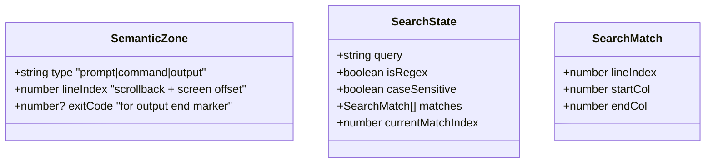

# セマンティックスクロール・プロンプト間ジャンプ & ターミナル内テキスト検索 - 要件定義書

## 1. 概要

### 1.1 背景

Claude Codeの出力は1回で数百行に及ぶことが多く、過去の回答に戻るのが困難。またスクロールバック内でファイル名・関数名・エラーメッセージを探す需要が高い。

### 1.2 目的

- OSC 133 (Semantic Prompts) を実装し、プロンプト・コマンド・出力のゾーンを識別する
- プロンプト間をキーボードで素早くジャンプできるようにする
- スクロールバック全体を対象としたインクリメンタル検索機能を提供する

### 1.3 スコープ

**対象:**
- OSC 133 A/B/C/Dの4種パース・記録
- プロンプト間ジャンプ（Ctrl+Shift+Up/Down）
- テキスト検索バー（プレーンテキスト+正規表現切替、大文字小文字区別切替）
- 検索マッチのキャンバスハイライト
- ヒット件数・現在位置表示

**対象外:**
- スクロールバー上のプロンプト位置マーカー表示（別タスク）
- コマンド出力の折りたたみ機能（別タスク、OSC 133基盤を共有）

## 2. ビジネス要件

### 2.1 ビジネス目標

AI時代のターミナルとして、Claude Codeとの長時間対話における操作効率を大幅に向上させる。

### 2.2 対象ユーザー

| ユーザータイプ | 説明 |
|----------------|------|
| Claude Codeユーザー | ターミナル上でClaude Codeを使い長大な出力をナビゲートする開発者 |
| 一般的なCLIユーザー | bash/zsh/fishなどOSC 133対応シェルを使用するユーザー |

### 2.3 期待される効果

- 過去のプロンプト・コマンド出力への到達時間を大幅に短縮
- スクロールバック内のテキスト発見の効率化
- 他のモダンターミナル（WezTerm、iTerm2）と同等のナビゲーション機能を獲得

## 3. ユースケース

### 3.1 ユースケース一覧

| ID | ユースケース名 | アクター | 優先度 |
|----|----------------|----------|--------|
| UC01 | プロンプト間ジャンプ（前へ） | ユーザー | 高 |
| UC02 | プロンプト間ジャンプ（次へ） | ユーザー | 高 |
| UC03 | テキスト検索の開始 | ユーザー | 高 |
| UC04 | 次/前のマッチへジャンプ | ユーザー | 高 |
| UC05 | 正規表現モード切替 | ユーザー | 中 |
| UC06 | 大文字小文字区別切替 | ユーザー | 中 |

### 3.2 ユースケース詳細

#### UC01: プロンプト間ジャンプ（前へ）

**アクター**: ユーザー

**事前条件**:
- ターミナルにOSC 133マーカーが記録された出力がある

**基本フロー**:
1. ユーザーがCtrl+Shift+Upを押す
2. 現在のスクロール位置より上にある最も近いプロンプト位置を検索
3. 該当プロンプト行が画面上部に来るようスクロール

**代替フロー**:
- プロンプトマーカーが存在しない場合: 何もしない
- 既に最初のプロンプトにいる場合: スクロールバックの先頭に移動

**事後条件**:
- スクロール位置がプロンプト行に移動している

#### UC02: プロンプト間ジャンプ（次へ）

**アクター**: ユーザー

**事前条件**:
- ターミナルにOSC 133マーカーが記録された出力がある

**基本フロー**:
1. ユーザーがCtrl+Shift+Downを押す
2. 現在のスクロール位置より下にある最も近いプロンプト位置を検索
3. 該当プロンプト行が画面上部に来るようスクロール

**代替フロー**:
- 次のプロンプトが存在しない場合: 最下部（最新出力）に移動

#### UC03: テキスト検索の開始

**アクター**: ユーザー

**事前条件**:
- ターミナルタブがアクティブ

**基本フロー**:
1. ユーザーがCtrl+Shift+Fを押す
2. ターミナル上部にフローティング検索バーが表示される
3. テキスト入力欄にフォーカスが移る
4. ユーザーが文字を入力するとインクリメンタルに検索が実行される
5. マッチした箇所がキャンバス上でハイライトされる
6. ヒット件数と現在位置（例: "3/15"）が表示される

**代替フロー**:
- 検索バーが既に開いている場合: 入力欄にフォーカスを移し、既存テキストを全選択
- Escで検索バーを閉じる

**事後条件**:
- 検索バーが表示され、マッチがハイライトされている

#### UC04: 次/前のマッチへジャンプ

**アクター**: ユーザー

**事前条件**:
- 検索バーが開いており、1つ以上のマッチがある

**基本フロー**:
1. ユーザーがEnter（次へ）またはShift+Enter（前へ）を押す
2. 次/前のマッチ位置にスクロールする
3. 現在のマッチは視覚的に区別される（異なるハイライト色）
4. ヒット件数の現在位置が更新される

**代替フロー**:
- 最後のマッチでEnter: 最初のマッチに戻る（ラップアラウンド）
- 最初のマッチでShift+Enter: 最後のマッチに移動

## 4. 機能要件

### 4.1 機能一覧

| ID | 機能名 | 説明 | 優先度 |
|----|--------|------|--------|
| F01 | OSC 133パース | RustパーサーでOSC 133 A/B/C/Dを認識 | 高 |
| F02 | セマンティックゾーン記録 | プロンプト/コマンド/出力のゾーン情報をLine単位で記録 | 高 |
| F03 | プロンプト間ジャンプ | Ctrl+Shift+Up/Downでプロンプト間を移動 | 高 |
| F04 | 検索バーUI | フローティング検索バーの表示・非表示 | 高 |
| F05 | インクリメンタル検索 | 入力に応じたリアルタイム検索 | 高 |
| F06 | 検索結果ハイライト | キャンバス上でのマッチ位置ハイライト | 高 |
| F07 | マッチ間ジャンプ | Enter/Shift+Enterで次/前のマッチへ移動 | 高 |
| F08 | 正規表現切替 | プレーンテキスト/正規表現モードの切替ボタン | 中 |
| F09 | 大文字小文字区別切替 | 大文字小文字区別のトグルボタン | 中 |
| F10 | ヒット件数表示 | "N/M" 形式のマッチ数・現在位置表示 | 高 |

### 4.2 機能詳細

#### F01: OSC 133パース

**説明**: Rust側ANSIパーサーでOSC 133シーケンスを認識し、TypeScript側に適切なアクションとして伝達する。

**入力**:
- OSC 133 ; A ST (プロンプト開始)
- OSC 133 ; B ST (コマンド開始)
- OSC 133 ; C ST (出力開始)
- OSC 133 ; D ; exitcode ST (出力終了)

**出力**:
- `OscAction::SemanticPrompt` バリアント（zone type + optional exit code）

**ビジネスルール**:
- 不明なサブコマンドは無視する
- exit codeは省略可能（デフォルト0）

#### F02: セマンティックゾーン記録

**説明**: OSC 133の各マーカーを受信した時点の行番号を記録し、スクロールバックを含めてプロンプト位置を追跡する。

**データ構造**: プロンプトマーカーのリスト（行番号 + タイプ + optional exit code）

**ビジネスルール**:
- マーカーはスクロールバックバッファ内の行に対しても保持される
- スクロールバックが最大行数を超えて切り捨てられた場合、対応するマーカーも削除する
- alternate bufferではマーカーを記録しない

#### F03: プロンプト間ジャンプ

**説明**: キーバインドにより前後のプロンプト位置にスクロールする。

**入力**: Ctrl+Shift+Up（前のプロンプト）、Ctrl+Shift+Down（次のプロンプト）

**処理フロー**:
1. 現在のスクロール位置を取得
2. プロンプトマーカーリストから該当位置を検索
3. 対象行が画面上部に来るようスクロール位置を更新
4. 画面を再描画

**ビジネスルール**:
- キーバインドはKeybindSettingsに追加し、設定画面から変更可能にする
- プロンプトマーカーがない場合は何もしない

#### F04: 検索バーUI

**説明**: ターミナル上部にフローティングで表示される検索バー。

**UI構成**:
- テキスト入力欄
- 正規表現トグルボタン（`.*`アイコン）
- 大文字小文字区別トグルボタン（`Aa`アイコン）
- ヒット件数表示（"N/M"）
- 上/下ナビゲーションボタン（矢印アイコン）
- 閉じるボタン（×アイコン）

**ビジネスルール**:
- Escキーまたは閉じるボタンで検索バーを閉じ、ハイライトをクリアし、フォーカスをターミナルに戻す
- 検索バーを閉じてもスクロール位置は現在位置を維持する
- 検索バーが開いている間、ターミナルへのキー入力はブロックしない（検索入力欄にフォーカスがある間のみ入力を受ける）

#### F05: インクリメンタル検索

**説明**: 文字入力ごとにリアルタイムで検索を実行する。

**検索対象**: スクロールバックバッファ + 現在の画面バッファの全テキスト

**ビジネスルール**:
- 空文字列の場合は検索しない（ハイライトをクリア）
- 正規表現モードで無効なパターンの場合はエラー表示し、検索しない
- パフォーマンス: 10,000行のスクロールバックでも体感遅延なし（目標: 50ms以内）

#### F06: 検索結果ハイライト

**説明**: マッチした文字列をキャンバスレンダリング上でハイライト表示する。

**ビジネスルール**:
- 全マッチ: 半透明の背景色でハイライト
- 現在のマッチ（フォーカス中）: より目立つ背景色でハイライト
- ハイライトはdirtyフラグと連携して効率的に再描画する

#### F07: マッチ間ジャンプ

**説明**: 検索マッチ間を順次ナビゲートする。

**入力**:
- Enter または 下矢印ボタン: 次のマッチ
- Shift+Enter または 上矢印ボタン: 前のマッチ

**ビジネスルール**:
- ラップアラウンド: 最後→最初、最初→最後
- ジャンプ先のマッチが画面外の場合、該当行が見えるようスクロールする

#### F10: ヒット件数表示

**説明**: 検索マッチの総数と現在フォーカス中のマッチ番号を表示する。

**表示形式**: "N/M"（Nは現在位置、Mは総マッチ数）

**ビジネスルール**:
- マッチなしの場合: "0/0"
- 検索中（大量データ処理中）の場合の表示は不要（同期処理で問題ない想定）

## 5. 非機能要件

### 5.1 パフォーマンス要件

- プロンプト間ジャンプ: 10ms以内の応答
- インクリメンタル検索: 10,000行で50ms以内
- 検索ハイライト描画: 可視範囲のハイライト更新は1フレーム以内（16ms）

### 5.2 セキュリティ要件

- 正規表現入力: ReDoS攻撃を防ぐためタイムアウトまたはパターンの複雑度制限
- 検索バーのテキスト入力: XSSは関係なし（DOM操作、innerHTMLは使用しない）

### 5.3 保守性要件

- ログ出力: 検索パフォーマンスの問題をデバッグ可能なログレベル（debug）
- OSC 133パース: 認識できないサブコマンドを警告ログに出力

### 5.4 互換性要件

- OSC 133: bash（readline）、zsh、fishの出力するOSC 133に対応
- キーバインド: 既存のKeybindSettingsパターンに従い、設定で変更可能

## 6. UI/UX要件

### 6.1 検索バー設計

- ターミナル上部に右寄せで表示するフローティングバー
- 背景: 半透明の暗い背景
- ボーダー: 1pxの薄い色
- 角丸: 小さめ（4px程度）
- 入力欄: 十分な幅（200px以上）
- トグルボタン: アクティブ時にアクセントカラーで視覚フィードバック

### 6.2 ハイライト色

- 全マッチ: 黄色系の半透明背景
- 現在マッチ: オレンジ系のより目立つ背景
- 選択範囲との区別が可能な色彩

### 6.3 アニメーション

- 検索バーの表示/非表示: 不要（即時表示/非表示）
- スクロール: スムーススクロールは不要（即座にジャンプ）

## 7. データ要件

### 7.1 データモデル

### 7.2 データ保持

| データ種別 | 保持期間 |
|------------|----------|
| セマンティックゾーンマーカー | スクロールバックと同じライフサイクル |
| 検索状態 | 検索バーが閉じられるまで |

## 8. 制約条件

### 8.1 技術的制約

- キャンバスレンダリング: ハイライトはcanvas-renderer.ts内で実装する必要がある
- スクロールバック構造: 既存の`Line[]`配列に対してメタデータを追加する方式
- Rust↔TypeScript通信: OSC 133は`OscAction`バリアントとして定義し、JSON経由で伝達
- alternate buffer: alternate buffer使用中はOSC 133マーカーを記録しない

### 8.2 既存コードとの統合

- OSCハンドラ: `osc_handlers.ts`の`handleOscDispatch`にcase追加
- Rustパーサー: `sequence.rs`の`OscAction`にバリアント追加、`parser.rs`のOSC処理に分岐追加
- キーバインド: `KeybindSettings`に`jump_to_prev_prompt`/`jump_to_next_prompt`追加
- 検索: `KeybindSettings`の既存`search`フィールドを使用

## 9. 想定される課題とリスク

### 9.1 技術的課題

| 課題 | 影響度 | 対応策 |
|------|--------|--------|
| 大量スクロールバックの検索パフォーマンス | 中 | ラインごとのテキストキャッシュ、検索のデバウンス |
| ReDoS（正規表現DoS） | 中 | 検索実行のタイムアウト制限 |
| スクロールバック切り捨て時のマーカー同期 | 中 | スクロールバックのsplice時にマーカーも連動削除 |

## 10. 成功基準

### 10.1 受け入れ基準

- [ ] OSC 133 A/B/C/Dが正しくパースされ、ゾーン情報が記録される
- [ ] Ctrl+Shift+Up/Downで前後のプロンプトにジャンプできる
- [ ] Ctrl+Shift+Fで検索バーが開く
- [ ] インクリメンタル検索でマッチがハイライトされる
- [ ] Enter/Shift+Enterで次/前のマッチにジャンプできる
- [ ] 正規表現モードと大文字小文字区別の切替が動作する
- [ ] ヒット件数と現在位置が正しく表示される
- [ ] Escで検索バーが閉じ、ハイライトがクリアされる
- [ ] 10,000行のスクロールバックで体感遅延がない

## 11. テストシナリオ

### 11.1 テスト観点

- [ ] 正常系: OSC 133 A/B/C/Dのパース（Rustユニットテスト）
- [ ] 正常系: プロンプトマーカーの記録と検索
- [ ] 正常系: プロンプト間ジャンプ（前方、後方）
- [ ] 正常系: プレーンテキスト検索
- [ ] 正常系: 正規表現検索
- [ ] 正常系: 大文字小文字区別/無視の切替
- [ ] 正常系: マッチ間ジャンプ（ラップアラウンド含む）
- [ ] 異常系: プロンプトマーカーが存在しない場合のジャンプ
- [ ] 異常系: 無効な正規表現パターン
- [ ] 異常系: 検索結果0件の場合
- [ ] 境界値: スクロールバック先頭/末尾でのジャンプ
- [ ] 境界値: スクロールバック最大行数付近での動作
- [ ] パフォーマンス: 10,000行スクロールバックでの検索レスポンス

## 12. 用語定義

| 用語 | 定義 |
|------|------|
| OSC 133 | Semantic Prompts仕様。シェルがプロンプト/コマンド/出力のゾーン境界をターミナルに通知するOSCシーケンス |
| ゾーン | プロンプト/コマンド/出力の各領域。OSC 133のA/B/C/Dマーカーで区切られる |
| スクロールバック | 画面上部からスクロールアウトした過去の行を保持するバッファ |
| インクリメンタル検索 | 文字入力ごとにリアルタイムで検索を実行する方式 |

## 13. 確認事項

### 13.1 確認済み事項

- [x] OSC 133の実装範囲: 全4種（A, B, C, D）を実装
- [x] プロンプト間ジャンプのキーバインド: Ctrl+Shift+Up/Down（設定変更可能）
- [x] スクロールバーマーカー: 初期実装には含めない（別タスク）
- [x] 正規表現サポート: プレーンテキストをデフォルトに、正規表現切替トグル付き
- [x] 検索UI位置: ターミナル上部にフローティングバー
- [x] 大文字小文字区別: デフォルト無視、トグルで切替可能
- [x] 検索対象: スクロールバック+画面バッファ全体
- [x] 検索キーバインド: Ctrl+Shift+F（既存のKeybindSettings.searchを使用）
- [x] マッチハイライト: キャンバスレンダラー上に実装

### 13.2 未確認・保留事項

- [ ] なし
