# 設定項目の実装完了 - 要件定義書

## 1. 概要

### 1.1 背景
eMtermの設定画面にはUIとして表示されるが、実際には効果がない設定項目が存在する。これらは「CSS変数を設定するが参照先がない」ものと「保存のみで適用処理が存在しない」ものに大別される。

### 1.2 目的
全ての設定項目が、設定変更時に実際の動作に反映されるようにする。

### 1.3 スコープ
以下の設定項目を15フェーズに分けて対象とする。

**部分実装（CSS変数/属性は設定されるが参照先がない）7項目:**
1. Font Family
2. Line Height
3. UI Theme
4. Opacity
5. Padding
6. Show Scrollbar
7. Cursor Style / Cursor Blink

**未実装（保存のみで適用処理が存在しない）9項目:**
8. Terminal Color Scheme
9. Scrollback Lines
10. Shell Path / Shell Args
11. Scroll Speed
12. Bell Action
13. URL Detection
14. Copy on Select
15. Keybinds (13項目)

## 2. ビジネス要件

### 2.1 ビジネス目標
設定画面の全項目が実際に機能し、ユーザーが期待する通りに動作すること。

### 2.2 対象ユーザー
| ユーザータイプ | 説明 |
|----------------|------|
| eMterm利用者 | ターミナルのカスタマイズを行うユーザー |

## 3. フェーズ分割

| フェーズ | 対象設定項目 | カテゴリ |
|----------|-------------|----------|
| 1 | Font Family | 部分実装 |
| 2 | Line Height | 部分実装 |
| 3 | UI Theme | 部分実装 |
| 4 | Opacity | 部分実装 |
| 5 | Padding | 部分実装 |
| 6 | Show Scrollbar | 部分実装 |
| 7 | Cursor Style / Cursor Blink | 部分実装 |
| 8 | Terminal Color Scheme | 未実装 |
| 9 | Scrollback Lines | 未実装 |
| 10 | Shell Path / Shell Args | 未実装 |
| 11 | Scroll Speed | 未実装 |
| 12 | Bell Action | 未実装 |
| 13 | URL Detection | 未実装 |
| 14 | Copy on Select | 未実装 |
| 15 | Keybinds | 未実装 |

## 4. 機能要件

### 4.1 フェーズ1: Font Family

**対象設定項目:** `font_family`

**現状の問題点:**
- `settings-applier.ts:62-71`: CSS変数 `--terminal-font-family` を設定し、`notifyRenderers("fontFamily", fontFamily)` を呼ぶ
- `canvas-renderer.ts:849-857`: `applySetting()` の switch文に `fontFamily` ケースがない
- CSS変数 `--terminal-font-family` を `var()` で参照するCSSルールがない

**期待する動作:**
- フォントファミリーを変更すると、Canvas レンダラーが新しいフォントで再描画される
- 文字幅・文字高さの再計測が行われる

**受け入れ基準:**
- [ ] 設定でフォントファミリーを変更すると、ターミナルの表示フォントが変わる
- [ ] フォント変更後、文字幅・高さが再計測される
- [ ] 空文字列の場合はデフォルトのモノスペースフォントにフォールバックする

### 4.2 フェーズ2: Line Height

**対象設定項目:** `line_height`

**現状の問題点:**
- `settings-applier.ts:77-82`: CSS変数 `--terminal-line-height` を設定し、`notifyRenderers("lineHeight", lineHeight)` を呼ぶ
- `canvas-renderer.ts:849-857`: `applySetting()` の switch文に `lineHeight` ケースがない
- `canvas-renderer.ts:388-395`: `measureCharacterSize()` 内で `lineHeight` を `fontSize` から算出しており、設定値を使っていない

**期待する動作:**
- 行の高さを変更すると、Canvas レンダラーが新しい行間で再描画される

**受け入れ基準:**
- [ ] 設定で行の高さを変更すると、ターミナルの行間が変わる
- [ ] 行の高さ変更後、文字高さが再計測される

### 4.3 フェーズ3: UI Theme

**対象設定項目:** `ui_theme`

**現状の問題点:**
- `settings-applier.ts:88-111`: `data-theme` 属性を `<html>` 要素に設定する
- `styles.css` および `settings-panel.css`: `[data-theme]` セレクタを持つCSSルールが一切ない
- テーマ切替しても視覚的な変化がない

**期待する動作:**
- UIテーマを "light" / "dark" / "system" に切り替えると、UIの配色が変わる
- タブバー、設定パネル、ターミナル背景のカラーが変わる

**受け入れ基準:**
- [ ] "dark" テーマでダーク配色が適用される
- [ ] "light" テーマでライト配色が適用される
- [ ] "system" テーマでOS設定に追従する
- [ ] テーマ切替時にタブバー、設定パネルの色が変わる

### 4.4 フェーズ4: Opacity

**対象設定項目:** `opacity`

**現状の問題点:**
- `settings-applier.ts:134-137`: CSS変数 `--terminal-opacity` を設定する
- この変数を参照するCSSルールがない

**期待する動作:**
- 透明度を変更すると、ターミナルの背景透明度が変わる

**受け入れ基準:**
- [ ] 設定で透明度を変更すると、ターミナル背景の透明度が反映される
- [ ] 最小値 0.3 でも内容が視認可能

### 4.5 フェーズ5: Padding

**対象設定項目:** `padding`

**現状の問題点:**
- `settings-applier.ts:117-120`: CSS変数 `--terminal-padding` を設定する
- この変数を参照するCSSルールがない

**期待する動作:**
- パディングを変更すると、ターミナルコンテンツの周囲に余白が追加される

**受け入れ基準:**
- [ ] 設定でパディングを変更すると、ターミナルの周囲に余白が表示される
- [ ] パディング変更後、ターミナルのカラム数・行数が再計算される

### 4.6 フェーズ6: Show Scrollbar

**対象設定項目:** `show_scrollbar`

**現状の問題点:**
- `settings-applier.ts:125-128`: CSS変数 `--terminal-scrollbar-mode` を設定する
- この変数を参照するCSSルールがない
- スクロールバー表示のUIコンポーネント自体が存在しない

**期待する動作:**
- スクロールバーの表示モードを変更すると、スクロールバーの表示/非表示が切り替わる

**受け入れ基準:**
- [ ] "always" でスクロールバーが常時表示される
- [ ] "never" でスクロールバーが非表示になる
- [ ] "auto" でスクロール可能時のみスクロールバーが表示される

**備考:** スクロールバックバッファ（フェーズ9）の実装に依存する。フェーズ9の後に完全実装可能。

### 4.7 フェーズ7: Cursor Style / Cursor Blink

**対象設定項目:** `cursor_style`, `cursor_blink`

**現状の問題点:**
- `settings-applier.ts:188-197`: `notifyRenderers("cursorStyle", ...)` と `notifyRenderers("cursorBlink", ...)` を呼ぶ
- `canvas-renderer.ts:849-857`: `applySetting()` の switch文に `cursorStyle` と `cursorBlink` ケースがない
- レンダラーは通知を受け取るが処理しない

**期待する動作:**
- カーソルスタイルを変更すると、ターミナルのカーソル形状が変わる（block / underline / bar）
- カーソル点滅を切り替えると、点滅の有無が変わる

**受け入れ基準:**
- [ ] 設定でカーソルスタイルを変更すると、カーソル形状がリアルタイムに変わる
- [ ] 設定でカーソル点滅をOFFにすると、カーソルが点滅しなくなる
- [ ] 設定でカーソル点滅をONにすると、カーソルが点滅する

### 4.8 フェーズ8: Terminal Color Scheme

**対象設定項目:** `terminal_color_scheme`

**現状の問題点:**
- `settings-panel.ts:288-301`: 選択肢が "default" 1つのみ
- `settings-applier.ts:168-183`: スキーム名をdata属性に保存するが、プリセットの検索・適用処理がない（コメントに "Future" と記載）

**期待する動作:**
- カラースキームを選択すると、ターミナルの前景・背景・16色パレットが変わる
- 6種のプリセットスキームから選択できる

**プリセット一覧:**
1. eMterm（デフォルト、ドロップダウン先頭）
2. Solarized Dark
3. Solarized Light
4. Monokai
5. Dracula
6. Nord

**受け入れ基準:**
- [ ] 6種のカラースキームプリセットが選択可能
- [ ] "eMterm" がドロップダウンの先頭に表示される
- [ ] スキーム変更時にターミナルの色が変わる
- [ ] "eMterm" でデフォルトカラーに戻る
- [ ] Canvas レンダラーが新しい色パレットを使って再描画する

### 4.9 フェーズ9: Scrollback Lines

**対象設定項目:** `scrollback_lines`

**現状の問題点:**
- `settings-panel.ts:346`: `onInput: () => {}` (空関数)
- スクロールバック機能自体が未実装
- `canvas-renderer.ts:119-133`: `getVisibleLines()` のコメントに "Scrollback buffer support will be added later" と記載

**期待する動作:**
- スクロールバック行数を設定すると、画面外にスクロールした行がその行数分保持される
- マウスホイールやキーボードで過去の出力にスクロールできる
- スクロール中に新しい出力が来た場合、スクロール位置を維持する

**受け入れ基準:**
- [ ] 設定したスクロールバック行数分の履歴が保持される
- [ ] マウスホイールで過去の出力にスクロールできる
- [ ] スクロール中に新しい出力が来てもスクロール位置が維持される
- [ ] スクロールバック行数の設定変更が次のセッションから適用される

### 4.10 フェーズ10: Shell Path / Shell Args

**対象設定項目:** `shell_path`, `shell_args`

**現状の問題点:**
- `settings-panel.ts:417-438`: 値を保存するのみ
- `pty/client.ts:83-99`: `spawn()` メソッドが `options.shell` のみ受け取り、`shell_args` は渡さない
- `terminal-app/index.ts:199`: `this.ptyClient.spawn({ cols, rows })` で `shell` パラメータを渡していない
- `types/pty.ts:50-68`: `PtySpawnOptions` に `shell_args` フィールドが存在しない
- `src-tauri/src/lib.rs:120-126`: `pty_spawn` コマンドが `shell` (Optional) と `cols`, `rows` のみ受け取る（`args` パラメータがない）

**期待する動作:**
- シェルパスを設定すると、新しいタブで指定されたシェルが起動する
- シェル引数を設定すると、シェル起動時に引数が渡される
- 空の場合はデフォルトシェルが使用される

**受け入れ基準:**
- [ ] シェルパスを設定すると、新しいタブで指定シェルが起動する
- [ ] シェル引数を設定すると、起動時に引数が渡される
- [ ] 空のシェルパスではデフォルトシェルが使用される
- [ ] 設定変更は新しいタブから適用される（既存タブには影響しない）

### 4.11 フェーズ11: Scroll Speed

**対象設定項目:** `scroll_speed`

**現状の問題点:**
- `settings-panel.ts:454`: `onInput: () => {}` (空関数)
- スクロール処理自体にスクロール速度を参照するコードがない

**期待する動作:**
- スクロール速度を変更すると、マウスホイールによるスクロール量が変わる

**受け入れ基準:**
- [ ] スクロール速度の設定値がスクロール量に反映される
- [ ] 値が大きいほどスクロール量が多い

**備考:** スクロールバック（フェーズ9）の実装に依存する。

### 4.12 フェーズ12: Bell Action

**対象設定項目:** `bell_action`

**現状の問題点:**
- `settings-panel.ts:459-470`: 値を保存するのみ
- BEL文字 (0x07) を受信した時のハンドリングコードが存在しない

**期待する動作:**
- BEL文字受信時に、設定に応じた通知が発生する
  - "visual": 画面フラッシュ
  - "sound": ビープ音
  - "none": 何もしない

**受け入れ基準:**
- [ ] "visual" でBEL文字受信時に画面がフラッシュする
- [ ] "sound" でBEL文字受信時にビープ音が鳴る
- [ ] "none" でBEL文字受信時に何もしない

### 4.13 フェーズ13: URL Detection

**対象設定項目:** `url_detection`

**現状の問題点:**
- `settings-panel.ts:472-479`: 値を保存するのみ
- URL検出・ハイライト機能が未実装

**期待する動作:**
- URL検出を有効にすると、ターミナル出力内のURLがハイライト表示される
- Ctrl+クリックで外部ブラウザで開く

**受け入れ基準:**
- [ ] ターミナル出力内のURLが検出・ハイライトされる
- [ ] Ctrl+クリックで外部ブラウザに遷移する
- [ ] 設定をOFFにするとURL検出が無効になる

### 4.14 フェーズ14: Copy on Select

**対象設定項目:** `copy_on_select`

**現状の問題点:**
- `settings-panel.ts:482-488`: 値を保存するのみ
- `SelectionController` が設定値を参照していない

**期待する動作:**
- Copy on Selectが有効の場合、テキスト選択完了時に自動でクリップボードにコピーする

**受け入れ基準:**
- [ ] 設定ON時、テキスト選択完了でクリップボードにコピーされる
- [ ] 設定OFF時、選択だけではコピーされない

### 4.15 フェーズ15: Keybinds

**対象設定項目:** 13個のキーバインド設定

**現状の問題点:**
- `tab-bar/keyboard-handler.ts`: ハードコードされたキーバインド (`Ctrl+T`, `Ctrl+W`, `Ctrl+Tab` 等)
- `terminal-app/handlers/keyboard.ts`: ハードコードされたクリップボードショートカット
- 設定で変更した値が参照されない

**期待する動作:**
- キーバインド設定を変更すると、対応するショートカットキーが変わる

**受け入れ基準:**
- [ ] 設定で変更したキーバインドが実際のショートカットとして動作する
- [ ] デフォルトのキーバインドが初期値として機能する
- [ ] キーバインドの衝突がある場合、後に設定された方が優先される

## 5. 非機能要件

### 5.1 パフォーマンス要件
- 設定変更は即座に反映される（100ms以内）
- Canvas再描画のフレーム時間が16ms以内

### 5.2 互換性要件
- 既存の設定ファイルとの後方互換性を維持
- 設定ファイルに新しいフィールドが追加されても既存設定が壊れない

### 5.3 保守性要件
- 各フェーズが独立してコミット可能
- 既存テストが引き続きパスする

## 6. 制約条件

### 6.1 技術的制約
- フェーズ6（Show Scrollbar）とフェーズ11（Scroll Speed）はフェーズ9（Scrollback Lines）の実装に依存する
- フェーズ10（Shell Path/Args）はバックエンドとフロントエンドの両方の変更が必要
- フェーズ8（Terminal Color Scheme）はカラープリセットの定義が必要

### 6.2 フェーズ間の依存関係

```mermaid
graph TD
    P1[Phase 1: Font Family]
    P2[Phase 2: Line Height]
    P3[Phase 3: UI Theme]
    P4[Phase 4: Opacity]
    P5[Phase 5: Padding]
    P6[Phase 6: Show Scrollbar]
    P7[Phase 7: Cursor Style/Blink]
    P8[Phase 8: Color Scheme]
    P9[Phase 9: Scrollback Lines]
    P10[Phase 10: Shell Path/Args]
    P11[Phase 11: Scroll Speed]
    P12[Phase 12: Bell Action]
    P13[Phase 13: URL Detection]
    P14[Phase 14: Copy on Select]
    P15[Phase 15: Keybinds]

    P9 --> P6
    P9 --> P11
```

## 7. 成功基準

### 7.1 受け入れ基準
- [ ] 全15フェーズの設定項目が実際に動作する
- [ ] 既存のテストがすべてパスする
- [ ] 新規テストが各フェーズに追加されている
- [ ] 設定変更が即座に反映される

## 8. 確認事項

### 8.1 確認済み事項
- [x] 部分実装の7項目: CSS変数は設定されるが参照先がない、またはレンダラーにケースがない
- [x] 未実装の9項目: 保存のみで適用処理が存在しない
- [x] PTY spawn コマンドは shell パラメータ (Optional) のみ受け取る（args なし）
- [x] PtySpawnOptions に shell_args フィールドが存在しない
- [x] SelectionController が copy_on_select 設定を参照していない
- [x] TabKeyboardHandler がハードコードされたキーバインドを使用している
- [x] フェーズ分割方針: 各設定項目ごとに1フェーズ、密接に関連する項目はまとめる

### 8.2 確認済み追加事項
- [x] Terminal Color Scheme のプリセット: eMterm（デフォルト）、Solarized Dark、Solarized Light、Monokai、Dracula、Nord
- [x] URL Detection のクリック方式: Ctrl+クリック
- [x] Scrollback スクロール中の新出力: スクロール位置維持
