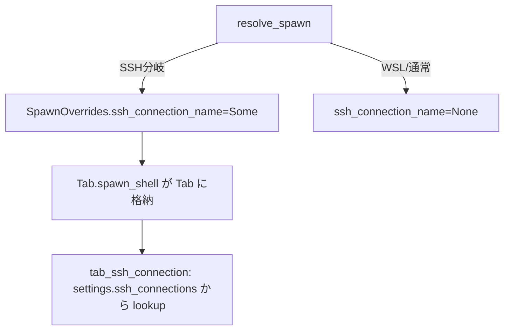
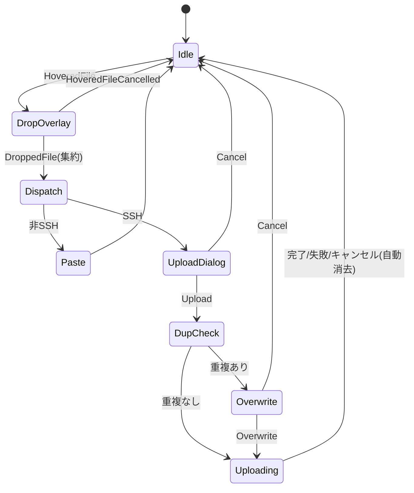

# SFTP アップロード native-poc 移植 - 要件定義書

## 1. 概要

### 1.1 背景
emterm の SFTP アップロード機能（ファイルの D&D でリモートホストへ転送）は WebView 版（`src-tauri/src/sftp` + `src/sftp`）にのみ実装されており、native-poc（egui/winit ネイティブ版ターミナル）へは未移植。native-poc の設定取得・反映ギャップ調査（`tmp/native-poc-settings-gap-2026-05-26.md`）で `sftp_max_concurrent_uploads` は取得済みだが、アップロードパイプライン本体が未移植と判明している。

### 1.2 目的
WebView 版と同等の SFTP アップロード体験を native-poc 上で実現する。移植元のコアロジック（args/check/pool/progress/process）は Tauri 非依存の純粋 Rust なので、ほぼそのまま流用する。

### 1.3 スコープ
- 対象: native-poc への Phase A〜F のフル移植
- Phase A: コアロジック移植
- Phase B: オーケストレーション（SftpService）
- Phase C: タブの SSH 接続情報配線
- Phase D: winit ファイルドロップ + 集約 + リモートパス解決
- Phase E: egui UI（オーバーレイ/ダイアログ/トースト）
- Phase F: settings 反映 / タブクローズガード / 仕上げ
- 対象外: WebView 版 SFTP 実装の変更（移植元は変更不要）

## 2. ビジネス要件

### 2.1 ビジネス目標
native-poc を WebView 版と機能パリティに近づけ、ネイティブ版を実用レベルへ前進させる。

### 2.2 対象ユーザー
| ユーザータイプ | 説明 |
|----------------|------|
| SSH 接続タブ利用者 | リモートホストへファイルを D&D でアップロードしたい |
| ローカルタブ利用者 | ドロップしたパスをコマンド引数として貼り付けたい |

### 2.3 期待される効果
- ネイティブ版でリモートへのファイル転送が可能になる
- WebView 版からの移行障壁が下がる

## 3. ユースケース

### 3.1 ユースケース一覧
| ID | ユースケース名 | アクター | 優先度 |
|----|----------------|----------|--------|
| UC01 | SSH タブへのファイル D&D アップロード | SSH 接続タブ利用者 | 高 |
| UC02 | 非 SSH タブへのファイル D&D（パス貼付） | ローカルタブ利用者 | 高 |
| UC03 | 重複ファイルの上書き確認 | SSH 接続タブ利用者 | 高 |
| UC04 | アップロードの進捗確認とキャンセル | SSH 接続タブ利用者 | 中 |
| UC05 | 進行中アップロードがあるタブのクローズ | SSH 接続タブ利用者 | 中 |

### 3.2 ユースケース詳細

#### UC01: SSH タブへのファイル D&D アップロード

**アクター**: SSH 接続タブ利用者

**事前条件**:
- アクティブタブが SSH 接続（`ssh_connection_name.is_some()`）

**基本フロー**:
1. ファイルをターミナルへドロップする
2. アップロードダイアログが開く（ファイル一覧 + 宛先パス、OSC 7 CWD から初期値）
3. 宛先を確認/編集して Upload を押す
4. 重複が無ければアップロード開始、進捗トーストが表示される
5. 各ファイルの転送完了でトーストが完了表示になり自動消去される

**代替フロー**:
- ディレクトリをドロップ → 再帰アップロード（`put -r`）
- 重複ファイルあり → 上書き確認ダイアログ（UC03）

**事後条件**:
- 対象ファイルがリモートの宛先ディレクトリへ転送されている

#### UC02: 非 SSH タブへのファイル D&D（パス貼付）

**アクター**: ローカルタブ利用者

**事前条件**:
- アクティブタブが非 SSH（`ssh_connection_name.is_none()`）

**基本フロー**:
1. ファイルをターミナルへドロップする
2. ドロップしたパスが整形（スペース含みは `"..."` 囲み、スペース連結）されて PTY へ書き込まれる

**事後条件**:
- 端末にパスが入力された状態（アップロードダイアログは出ない）

#### UC03: 重複ファイルの上書き確認

**基本フロー**:
1. アップロード確定時、リモートディレクトリを `ls` して既存ファイル名を検出
2. 重複があれば上書き確認ダイアログを表示（初期フォーカスは Cancel）
3. Overwrite で続行、Cancel で中止

#### UC04: アップロードの進捗確認とキャンセル

**基本フロー**:
1. アップロードごとにトースト（ファイル名 + 状態）が表示される
2. 状態は preparing → uploading → completed/failed/cancelled と遷移
3. アクティブなトーストの Cancel でアップロードを中止（サブプロセス kill）

#### UC05: 進行中アップロードがあるタブのクローズ

**基本フロー**:
1. 進行中アップロードがあるタブを閉じようとする
2. 確認ダイアログが表示される
3. 確定するとそのタブの進行中アップロードをキャンセルして閉じる

## 4. 機能要件

### 4.1 機能一覧
| ID | 機能名 | 説明 | 優先度 |
|----|--------|------|--------|
| F01 | コアロジック移植 | args/check/pool/progress/process + 型を native-poc へ | 高 |
| F02 | SftpService | プロセス管理 + プール所有、channel 進捗、検証、session_id 採番 | 高 |
| F03 | タブ SSH 接続保持 | resolve_spawn 拡張 + Tab フィールド + lookup | 高 |
| F04 | ファイルドロップ振り分け | winit drop 集約、SSH/非SSH 判定 | 高 |
| F05 | リモートパス解決 | OSC 7 CWD → 宛先パス | 高 |
| F06 | 重複検出 + 上書き確認 | spawn_ls + find_duplicates + ダイアログ | 高 |
| F07 | 並行制限 | sftp_max_concurrent_uploads でプール制御 | 高 |
| F08 | 進捗トースト | 状態表示 + 自動消去 | 中 |
| F09 | キャンセル | トースト Cancel → cancel(session_id) | 中 |
| F10 | タブクローズガード | 進行中アップロード確認ダイアログ | 中 |
| F11 | settings 反映 | 起動時/リロード時に max を反映 | 中 |
| F12 | i18n | UI 文言を最初から i18n キー（en/ja） | 中 |

### 4.2 機能詳細（抜粋）

#### F03: タブ SSH 接続保持

**説明**: `resolve_spawn()`（profiles.rs:149）は SSH 接続を argv に焼き込むだけで `SshConnection` を捨てるため、現状タブが接続情報を保持していない。SFTP は接続情報が必要なので、復元可能な形でタブに持たせる。

**処理フロー**:

**ビジネスルール**:
- SSH タブ判定 = `ssh_connection_name.is_some()`
- WSL 分岐は SSH より優先（接続名は None）

#### F04: ファイルドロップ振り分け

**説明**: winit はファイル1個ごとに `DroppedFile(PathBuf)` を個別配信し、ドロップ完了の合図が無いため、短時間バッファで1ドロップ操作に集約する。

**バリデーション**: なし（パス検証はアップロード時に実施）

**エラーケース**:
| エラー | 条件 | 対応 |
|--------|------|------|
| メタデータ取得失敗 | metadata() が Err | is_directory=false 扱いで継続 |

#### F06〜F09 詳細は `tmp/sftp-native-port-design.md` の Phase B/E を参照。

## 5. 非機能要件

### 5.1 パフォーマンス要件
- アップロードはバックグラウンドスレッドで実行し、UI スレッドをブロックしない
- 重複チェック（spawn_ls）も UI スレッドをブロックしない（UI から呼ぶ場合はワーカーへ逃がす）

### 5.2 セキュリティ要件
- 入力検証: hostname（シェルメタ文字拒否）、remote path（null + 危険文字拒否）、local path（危険文字 + 存在確認、Windows は `\` 許可）
- コマンドインジェクション防止: sftp 引数は argv 配列で渡す（文字列連結しない）
- 認証: SSH 鍵認証のみ（identity_file）、パスワード保存なし

### 5.3 可用性要件
- sftp バイナリ不在・接続失敗・転送エラーはトーストにメッセージ表示して継続（クラッシュしない）

### 5.4 保守性要件
- 移植元コアは Tauri 非依存を維持（`grep tauri native-poc/src/sftp/` が空）
- 進捗通知は crossbeam_channel（既存 PTY イベント pump と同パターン）

### 5.5 互換性要件
- sftp バイナリ検出は Unix / Windows 両対応（移植元 detect_sftp_binary 移植）

## 6. UI/UX要件

### 6.1 画面設計要件
- ドロップオーバーレイ: 半透明 + 中央メッセージ（SSH/非SSH で文言切替）
- アップロードダイアログ: ファイル一覧 + 宛先入力 + Cancel/Upload（Esc=Cancel, Enter=Upload, 初期フォーカス=宛先入力）
- 上書きダイアログ: 重複一覧（警告色）+ Cancel/Overwrite（初期フォーカス=Cancel）
- 進捗トースト: 右上スタック、ファイル名 + 状態 + Cancel、終了状態は短時間後に自動消去
- 既存の `ui/profile_selector.rs`（モーダル）/ `ui/search_bar.rs`（浮遊）パターンを流用

### 6.2 画面遷移

### 6.3 i18n
- UI 文言は native-poc の i18n 機構（`src/i18n.rs`）に en/ja キーを登録

## 7. データ要件

### 7.1 主要データ項目
| 構造体 | 項目名 | 型 | 説明 |
|--------|--------|-----|------|
| SftpUploadProgress | session_id | String | アップロードセッション識別子 |
| SftpUploadProgress | file_name | String | ファイル名 |
| SftpUploadProgress | bytes_transferred / total_bytes | u64 | 進捗 |
| SftpUploadProgress | status | SftpUploadStatus | preparing/uploading/completed/failed/cancelled |
| Tab | ssh_connection_name | Option\<String\> | タブの SSH 接続名 |

## 9. 制約条件

### 9.1 技術的制約
- native-poc のビルドはプロジェクトルートから `--manifest-path` + `CARGO_TARGET_DIR` 指定（`.claude/rules/native-poc-build-location.md`）
- `Instant::now()` / `Date.now()` 相当の wall-clock 直呼びは禁止（session_id は AtomicU64、トースト fade は egui フレーム時刻）
- 実 sftp サブプロセスを起動するテストは CI 不可

### 9.2 ビジネス上の制約
- 移植元（WebView 版）の SFTP 実装は変更しない

## 10. 想定される課題とリスク

### 10.1 技術的課題
| 課題 | 影響度 | 対応策 |
|------|--------|--------|
| winit のドロップ完了合図が無い | 中 | 1 イベントループ周回ぶん集約してから確定 |
| UI スレッドでの spawn_ls ブロック | 中 | ワーカースレッドへ逃がす |
| トーストの時間駆動消去 | 低 | egui フレーム時刻 / フレームカウンタを使用 |

## 11. 成功基準

### 11.1 受け入れ基準
- [ ] SSH タブへ D&D → ダイアログ → アップロード → トースト完了
- [ ] 非 SSH タブへ D&D → パスがペーストされる
- [ ] 重複検出時に上書き確認ダイアログが出る
- [ ] 並行数が settings の max で制限される
- [ ] 進行中アップロードのキャンセルが効く
- [ ] 進行中アップロードがあるタブのクローズで確認ダイアログ
- [ ] `grep tauri native-poc/src/sftp/` が空
- [ ] `cargo test` / `cargo check`（emterm-native-poc）が通る

## 12. テストシナリオ

### 12.1 テスト観点
- [ ] 正常系: 単一ファイル / 複数ファイル / ディレクトリのアップロード
- [ ] 異常系: sftp 不在 / 接続失敗 / 転送エラー / 不正パス
- [ ] 境界値: 空 CWD / スペース含むファイル名 / IPv6 ホスト
- [ ] セキュリティ: シェルメタ文字・null・危険文字の拒否
- [ ] 並行: max 超過時のキューイング / キャンセル時のスロット解放

## 13. 用語定義

| 用語 | 定義 |
|------|------|
| native-poc | egui/winit ベースのネイティブ版ターミナル（`native-poc/`） |
| 移植元 | WebView 版の SFTP 実装（`src-tauri/src/sftp`, `src/sftp`） |
| OSC 7 | 作業ディレクトリ通知のエスケープシーケンス（`file://` URI） |
| プール | 並行アップロード数を制限する ConcurrentUploadPool |

## 14. 確認事項

### 14.1 確認済み事項
- [x] スコープ: Phase A〜F のフル移植（Phase A/B も既存成果が無く作り直し）
- [x] タブクローズ時の振る舞い: 確認ダイアログ（移植元踏襲）
- [x] UI 文言の言語対応: 最初から i18n キー（en/ja）

### 14.2 未確認・保留事項
- なし（設計 doc とクローズ/i18n の決定で確定）

## 15. 参考資料

- 設計書: `tmp/sftp-native-port-design.md`
- 進捗トラッカー: `tmp/sftp-native-port-progress.md`
- 移植元 SDD: `doc/tasks/sftp-upload/`
