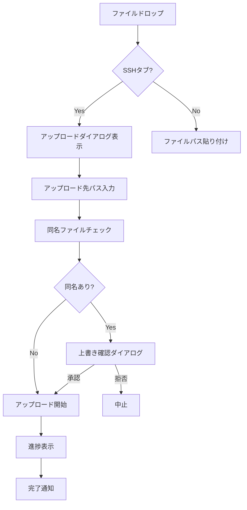
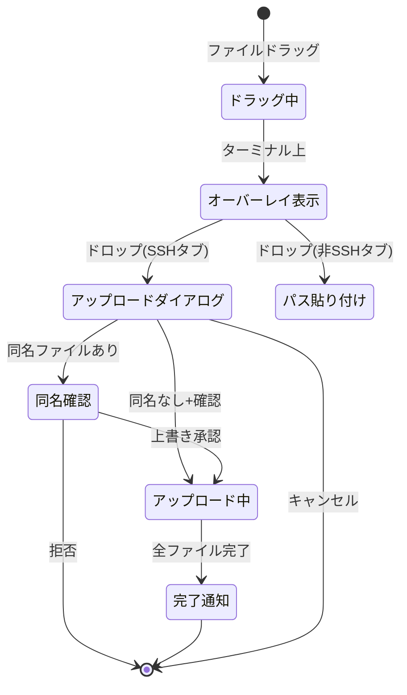

# SFTPファイルアップロード - 要件定義書

## 1. 概要

### 1.1 背景
eMtermはSSH接続機能を備えたターミナルエミュレータであり、リモートホストへの接続が可能である。しかし、リモートホストへのファイル転送を行うには、ユーザーが手動で `scp` や `sftp` コマンドを入力する必要がある。

### 1.2 目的
SSH接続中のタブにファイルをドラッグ&ドロップすることで、SFTPを使ったファイルアップロードを実現する。

### 1.3 スコープ
- SSH接続中タブへのファイルドラッグ&ドロップによるSFTPアップロード
- 非SSHタブへのファイルドラッグ&ドロップ時のパス貼り付け
- アップロード先ディレクトリの指定UI
- 並列アップロード制御
- 進捗表示

**スコープ外:**
- sftp コマンドが利用できない環境への対応
- パスワード認証

## 2. ビジネス要件

### 2.1 ビジネス目標
リモートホストへのファイル転送をGUIベースの直感的な操作で実現する。

### 2.2 対象ユーザー
| ユーザータイプ | 説明 |
|----------------|------|
| 開発者 | SSH経由でリモートサーバーに接続し、ファイルを転送する必要があるユーザー |

### 2.3 期待される効果
- ファイル転送のためのコマンド入力が不要になる
- 複数ファイルの転送操作が簡略化される
- ドラッグ&ドロップという馴染みのある操作でファイル転送が可能になる

## 3. ユースケース

### 3.1 ユースケース一覧
| ID | ユースケース名 | アクター | 優先度 |
|----|----------------|----------|--------|
| UC01 | SSHタブへのファイルアップロード | ユーザー | 高 |
| UC02 | SSHタブへのディレクトリアップロード | ユーザー | 高 |
| UC03 | 非SSHタブへのファイルドロップ | ユーザー | 中 |
| UC04 | アップロード中のタブクローズ | ユーザー | 中 |

### 3.2 ユースケース詳細

#### UC01: SSHタブへのファイルアップロード

**アクター**: ユーザー

**事前条件**:
- SSHプロファイルで接続中のタブが存在する
- アップロード対象のローカルファイルが存在する

**基本フロー**:
1. ユーザーがローカルファイルをターミナル領域にドラッグする
2. ターミナル全体にドロップオーバーレイが表示される
3. ユーザーがファイルをドロップする
4. モーダルダイアログが開き、ファイルリストとアップロード先パス入力欄が表示される
5. アップロード先パスにはデフォルト値（OSC 7によるリモートCWD、または ホームディレクトリ）が入る
6. ユーザーがアップロード先を確認/変更し、確認ボタンを押す
7. リモート側で同名ファイルの存在チェックが実行される
8. 同名ファイルがなければアップロードが開始される
9. ターミナル右上に進捗バーが表示される
10. アップロード完了の通知が表示される

**代替フロー**:
- 7a. 同名ファイルが存在する場合、一括確認ダイアログが表示される。ユーザーが上書きを承認するとアップロードが進む
- 6a. ユーザーがキャンセルボタンを押すとアップロードは中止される

**事後条件**:
- ファイルがリモートホストの指定ディレクトリにアップロードされている

#### UC02: SSHタブへのディレクトリアップロード

**アクター**: ユーザー

**事前条件**:
- SSHプロファイルで接続中のタブが存在する

**基本フロー**:
1. UC01と同様のフローだが、ディレクトリが再帰的にアップロードされる（sftp `put -r`）

**事後条件**:
- ディレクトリ構造がリモートに再現されている

#### UC03: 非SSHタブへのファイルドロップ

**アクター**: ユーザー

**事前条件**:
- ローカルシェルのタブが存在する

**基本フロー**:
1. ユーザーがファイルをターミナルにドロップする
2. ファイルの絶対パスがターミナルに貼り付けられる

**事後条件**:
- ターミナル入力にファイルパスが挿入されている

#### UC04: アップロード中のタブクローズ

**アクター**: ユーザー

**事前条件**:
- SFTPアップロードが進行中である

**基本フロー**:
1. ユーザーがタブを閉じようとする
2. 確認ダイアログが表示される（キャンセルまたは継続の選択肢）
3. キャンセルを選択するとアップロードが中止され、タブが閉じられる
4. 継続を選択するとダイアログが閉じてタブは開いたままになる

**事後条件**:
- ユーザーの選択に応じてアップロードが中止または継続されている

## 4. 機能要件

### 4.1 機能一覧
| ID | 機能名 | 説明 | 優先度 |
|----|--------|------|--------|
| F01 | ファイルドロップ検出 | ターミナルへのファイルドラッグ&ドロップを検出する | 高 |
| F02 | ドラッグオーバーレイ表示 | ドラッグ中にターミナル全体にオーバーレイを表示する | 高 |
| F03 | SSHタブ判定 | ドロップ先タブがSSH接続かどうかを判定する | 高 |
| F04 | アップロード先入力ダイアログ | ファイルリストとアップロード先パス入力のモーダルダイアログ | 高 |
| F05 | リモートCWD取得 | OSC 7からリモートのカレントディレクトリを取得する | 高 |
| F06 | 同名ファイルチェック | sftp ls でリモートの同名ファイル存在を確認する | 高 |
| F07 | SFTPアップロード実行 | sftp コマンドでファイルをアップロードする | 高 |
| F08 | 並列アップロード制御 | 設定された並列数に従いアップロードを制御する | 高 |
| F09 | 進捗表示 | ターミナル右上に進捗バーを表示する | 高 |
| F10 | 非SSHタブのファイルパス貼り付け | 非SSHタブへのドロップ時にパスを貼り付ける | 中 |
| F11 | アップロード中タブクローズ確認 | アップロード中のタブクローズ時に確認ダイアログを表示 | 中 |
| F12 | ディレクトリ再帰アップロード | ディレクトリを再帰的にアップロードする | 高 |

### 4.2 機能詳細

#### F01: ファイルドロップ検出

**説明**: ブラウザのDrag and Drop APIを使用して、ターミナル領域へのファイルドラッグ&ドロップイベントを検出する。

**入力**:
- ドラッグされたファイル/ディレクトリのリスト

**出力**:
- ファイルパスのリスト

#### F07: SFTPアップロード実行

**説明**: 外部 `sftp` コマンドをサブプロセスとして実行し、ファイルをアップロードする。

**引数構築**:
```
sftp [-P port] [-i identity_file] [-o Key=Value ...] [user@]hostname
```
SSH接続設定の `ssh_options` もそのまま sftp に渡す。

**処理フロー**:


#### F08: 並列アップロード制御

**説明**: 設定値 `sftp_max_concurrent_uploads` に基づき、同時アップロード数を制御する。空きレーンが出たら待機中のファイルを投入するプール方式。

**設定**:
| 項目 | 値 |
|------|-----|
| 設定キー | `sftp_max_concurrent_uploads` |
| デフォルト値 | 4 |
| 配置場所 | SSH設定セクション内 |

## 5. 非機能要件

### 5.1 パフォーマンス要件
- ファイルサイズ制限: なし（sftp コマンドに委任）
- 並列アップロード: 設定可能（デフォルト4）

### 5.2 セキュリティ要件
- 認証: SSH接続設定の鍵認証を再利用
- パスワード: 保存しない
- コマンドインジェクション防止: 引数を配列で渡す

### 5.3 保守性要件
- ログ出力: アップロードの開始・完了・エラーをバックエンドログに記録

### 5.4 互換性要件
- プラットフォーム: Linux, Windows（openssh が利用可能な環境）

## 6. UI/UX要件

### 6.1 画面設計要件

**ドラッグオーバーレイ**: ターミナル全体に半透明のオーバーレイを表示。「ここにドロップしてアップロード」等のメッセージを含む。

**アップロードダイアログ（モーダル）**:
- ファイルリスト（ドラッグされたファイル名一覧）
- アップロード先パス入力欄（デフォルト値あり）
- 確認ボタン / キャンセルボタン

**同名ファイル確認ダイアログ**: 上書き対象のファイル一覧を表示し、一括で承認/拒否する。

**進捗表示**: ターミナル右上にトースト/バー形式で表示。ターミナル操作を妨げない。

**タブクローズ確認ダイアログ**: アップロード中にタブを閉じようとした際に「キャンセル」か「継続」を選択させる。

### 6.2 画面遷移


## 7. データ要件

### 7.1 データモデル概要
既存の `SshConnection` 設定をそのまま利用する。新規のデータモデルは不要。

### 7.2 設定項目追加
| 設定キー | 型 | デフォルト値 | 説明 |
|----------|-----|-------------|------|
| `sftp_max_concurrent_uploads` | u16 | 4 | 同時アップロード数の上限 |

## 8. 外部連携

### 8.1 連携システム
| システム名 | 連携方法 | データ |
|------------|----------|--------|
| sftp コマンド | サブプロセス実行 | ファイルデータ |

## 9. 制約条件

### 9.1 技術的制約
- openssh の sftp コマンドが利用可能であること
- 鍵認証のみ対応（パスワード認証は非対応）
- OSC 7 によるリモートCWD取得はリモートシェルの対応に依存

### 9.2 ビジネス上の制約
- sftp が利用できない環境への対応は今回のスコープ外

## 10. 想定される課題とリスク

### 10.1 技術的課題
| 課題 | 影響度 | 対応策 |
|------|--------|--------|
| OSC 7 非対応のリモートシェル | 中 | ホームディレクトリをフォールバックとして使用 |
| sftp コマンドの出力パース（進捗取得） | 中 | sftp の stdout/stderr をパースして進捗情報を抽出 |

## 11. 成功基準

### 11.1 受け入れ基準
- [ ] SSHタブにファイルをドラッグ&ドロップしてアップロードできる
- [ ] ディレクトリを再帰的にアップロードできる
- [ ] 並列アップロードが設定された並列数で動作する
- [ ] 同名ファイルの上書き確認が動作する
- [ ] 非SSHタブへのドロップでファイルパスが貼り付けられる
- [ ] アップロード中にタブを閉じようとすると確認が表示される
- [ ] Linux, Windows で動作する

## 12. テストシナリオ

### 12.1 テスト観点
- [ ] 正常系: 単一ファイルのアップロード
- [ ] 正常系: 複数ファイルの並列アップロード
- [ ] 正常系: ディレクトリの再帰アップロード
- [ ] 正常系: 非SSHタブへのドロップでパス貼り付け
- [ ] 異常系: sftp 接続失敗
- [ ] 異常系: アップロード先ディレクトリが存在しない
- [ ] 異常系: 同名ファイルの上書き確認
- [ ] 境界値: 並列数上限でのキュー管理
- [ ] セキュリティ: コマンドインジェクション防止

## 13. 用語定義

| 用語 | 定義 |
|------|------|
| SFTP | SSH File Transfer Protocol。SSH上でファイル転送を行うプロトコル |
| OSC 7 | Operating System Command sequence 7。シェルがカレントディレクトリをターミナルに通知するエスケープシーケンス |
| ssh_connection_name | プロファイルに設定されたSSH接続名。この値が空でなければSSH接続タブと判定 |

## 14. 確認事項

### 14.1 確認済み事項

- [x] SSH接続の判定方法: プロファイルの ssh_connection_name で判定
- [x] アップロード先パスの決定方法: ユーザー入力（デフォルトはOSC 7によるリモートCWD、フォールバックはホームディレクトリ）
- [x] 複数ファイル対応: 並列アップロード（設定可能、デフォルト4）
- [x] SFTP接続方式: 外部 sftp コマンドをサブプロセスとして実行
- [x] 認証方式: SSH接続設定の鍵認証を再利用
- [x] アップロードUIデザイン: モーダルダイアログ
- [x] 進捗表示: ターミナル右上のトースト/バー
- [x] ファイルサイズ制限: なし
- [x] 同名ファイル: 一括確認ダイアログ
- [x] アップロード中のタブクローズ: 確認ダイアログ
- [x] ディレクトリドラッグ: 再帰アップロード対応
- [x] 非SSHタブへのドロップ: ファイルパス貼り付け
- [x] ドラッグ中のフィードバック: オーバーレイ表示
- [x] ssh_options の扱い: sftp にそのまま渡す

### 14.2 未確認・保留事項
- [ ] sftp が利用できない環境への対応（スコープ外）

## 15. 参考資料

- SSH接続機能仕様: `doc/tasks/ssh-connection/SPEC.md`
- 既存設定: `src-tauri/src/commands/config/settings.rs`
