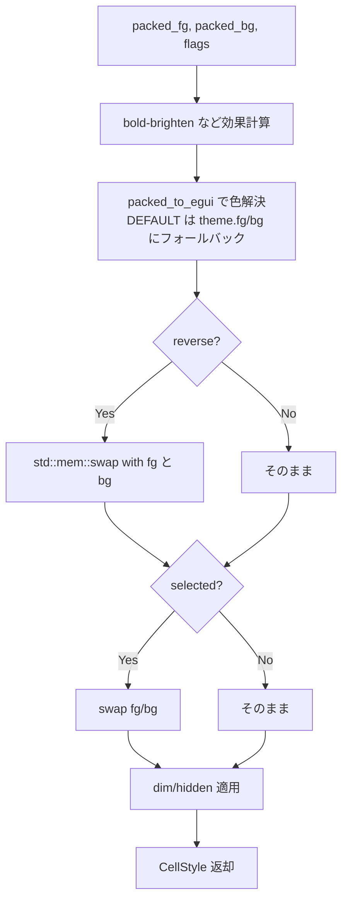

# SGR 7 (Reverse) DEFAULT 色スワップ修正 - 要件定義書

## 1. 概要

### 1.1 背景
`printf '\e[7mREVERSE\e[0m NORMAL\n'` を eMterm で実行すると、`REVERSE` の部分が反転表示されない。WezTerm など一般的な端末エミュレータでは反転表示される。

`crates/term_core` 側の SGR 7 パースと `STYLE_REVERSE` フラグの管理、`src-tauri/src/render` の swap ロジック自体は実装されているが、fg/bg が両方とも `PackedColor::DEFAULT` のセルに対して swap が NOP になり、反転表示にならない。

### 1.2 目的
セルの fg/bg がともに DEFAULT のときでも `STYLE_REVERSE` が正しく効くようにし、`\e[7m` で REVERSE 表示が得られる状態にする。

### 1.3 スコープ
- 対象: `src-tauri/src/render/mod.rs` の `resolve_cell_style_from_packed` 関数（約 1185-1258 行）と関連するユニットテスト。
- 対象外:
  - `packed_to_egui` の `_fallback` 引数のセマンティクス整理（未使用引数のクリーンアップは別タスク）。
  - DECSCNM (`MODE_REVERSE_SCREEN`) と SGR 7 の XOR 合成（現状 render 側で未消費。別タスク）。
  - bold-brighten の適用順序を WezTerm 方式に揃える変更（本タスクでは現状維持）。

## 2. ビジネス要件

### 2.1 ビジネス目標
ANSI SGR 7 (Reverse Video) を期待通り表示することで、`grep --color=auto` 等のツールや `\e[7m` を直接使うアプリで意図した表示が得られるようにする。

### 2.2 対象ユーザー
| ユーザータイプ | 説明 |
|----------------|------|
| eMterm 利用者 | SGR 7 を使う CLI ツール（grep, less, fzf, vim, Claude Code 等）を実行する全ユーザー |

### 2.3 期待される効果
- 反転表示を前提とした CLI ツールが他の端末と同じ見た目で動く
- DEFAULT 色組み合わせ時の reverse が他の端末と互換となる

## 3. ユースケース

### 3.1 ユースケース一覧
| ID | ユースケース名 | アクター | 優先度 |
|----|----------------|----------|--------|
| UC01 | DEFAULT 色のセルで反転表示する | eMterm 利用者 | 高 |
| UC02 | 色指定済みセルで反転表示する | eMterm 利用者 | 高 |
| UC03 | reverse セルを範囲選択する | eMterm 利用者 | 中 |

### 3.2 ユースケース詳細

#### UC01: DEFAULT 色のセルで反転表示する
**アクター**: eMterm 利用者
**事前条件**: なし
**基本フロー**:
1. ユーザーが eMterm のシェルで `printf '\e[7mREVERSE\e[0m NORMAL\n'` を実行する
2. `REVERSE` の部分が、テーマの fg と bg を入れ替えた表示になる
3. `NORMAL` の部分は通常表示になる

**事後条件**:
- `REVERSE` セルの fg/bg が `theme.fg` / `theme.bg` の swap になっている

#### UC02: 色指定済みセルで反転表示する
**アクター**: eMterm 利用者
**事前条件**: なし
**基本フロー**:
1. `printf '\e[31;42m\e[7mX\e[0m\n'`（fg=red, bg=green, reverse）を実行する
2. `X` の表示が fg=green, bg=red となる

**事後条件**:
- indexed/truecolor の色指定があるセルでも reverse が正しく効く（既存挙動の維持）

#### UC03: reverse セルを範囲選択する
**アクター**: eMterm 利用者
**事前条件**: 画面上に `\e[7m` 由来の反転セルが表示されている
**基本フロー**:
1. ユーザーがそのセルを範囲選択する
2. 選択範囲では fg/bg がさらに再反転され、未選択時の `theme.bg` / `theme.fg` に戻った表示になる

**事後条件**:
- `reverse + selection` が `not reverse` と同じ最終色になる（XOR の合成が成立）

## 4. 機能要件

### 4.1 機能一覧
| ID | 機能名 | 説明 | 優先度 |
|----|--------|------|--------|
| F01 | DEFAULT 色での reverse swap | fg/bg がともに DEFAULT のときも `STYLE_REVERSE` が反転を引き起こす | 高 |
| F02 | 既存 reverse 挙動の維持 | indexed/truecolor 色指定セルの reverse 表示は従来通り | 高 |
| F03 | selection との合成維持 | reverse + selection の XOR 挙動は従来通り | 中 |
| F04 | bold-brighten 順序の維持 | reverse 後の effective fg に対する bold-brighten 適用順序は変えない | 中 |

### 4.2 機能詳細

#### F01: DEFAULT 色での reverse swap

**説明**: `resolve_cell_style_from_packed` で、palette 解決後の RGBA 色レベルで swap を行うよう変更し、両方 DEFAULT のセルでも `theme.fg` と `theme.bg` の swap が成立するようにする。

**処理フロー**:

**ビジネスルール**:
- swap は palette 解決後の `Color32` レベルで行う
- bold-brighten は indexed fg にのみ作用する仕様を維持する

## 5. 非機能要件

### 5.1 パフォーマンス要件
- 既存パスとの差は `std::mem::swap` を1回呼ぶ程度。レンダリング性能への影響は無視できる範囲とする。

### 5.2 互換性要件
- WezTerm / xterm / alacritty と同等の reverse 挙動になる
- `crates/term_core` 側の `STYLE_REVERSE` 表現には変更を加えない

## 6. UI/UX要件
特になし（既存セルの最終的な色決定ロジックの修正のみ）。

## 7. データ要件
特になし。

## 8. 外部連携
特になし。

## 9. 制約条件

### 9.1 技術的制約
- 修正は `src-tauri/src/render/mod.rs` 内に閉じる
- bold-brighten のセマンティクス変更（reverse 前の fg にのみ brighten 適用、等）は本タスクでは行わない
- DECSCNM (`MODE_REVERSE_SCREEN`) を render に取り込む変更は本タスクのスコープ外

### 9.2 ビジネス上の制約
なし。

## 10. 想定される課題とリスク

### 10.1 技術的課題
| 課題 | 影響度 | 対応策 |
|------|--------|--------|
| selection と reverse の合成順序を崩すと選択時の見た目が壊れる | 中 | 既存の selection swap を変更しない。reverse の swap だけを追加し、両者の合成挙動を確認するユニットテストを追加 |
| bold-brighten が reverse 後 fg に効く挙動を変えるとリグレッションになる | 中 | `effective_fg_packed` 計算は現状を維持し、色解決後の swap を被せる構成にする |

## 11. 成功基準

### 11.1 受け入れ基準
- [ ] `printf '\e[7mREVERSE\e[0m NORMAL\n'` 実行時に `REVERSE` 部分が反転表示される
- [ ] `resolve_cell_style_from_packed` のユニットテストが追加され、以下を網羅する
  - 両方 DEFAULT + reverse で fg/bg が `theme.fg` / `theme.bg` の swap になる
  - indexed fg + DEFAULT bg + reverse で fg=theme.bg, bg=indexed の色になる
  - truecolor fg/bg + reverse で fg/bg が入れ替わる
  - reverse + selection が `not reverse, not selection` と同じ色になる
- [ ] 既存テストが全てパスする

## 12. テストシナリオ

### 12.1 テスト観点
- [x] 正常系: `\e[7m` 単独の reverse 表示
- [x] 正常系: 色指定済みセルの reverse
- [x] 境界値: fg/bg ともに DEFAULT のセル
- [x] 合成: reverse + selection、reverse + bold（bold-brighten との順序）

## 13. 用語定義

| 用語 | 定義 |
|------|------|
| SGR | Select Graphic Rendition。CSI シーケンスの一種で、文字属性を変更する |
| SGR 7 | reverse video。fg と bg を入れ替えて表示する属性 |
| STYLE_REVERSE | term_core の cell flags で SGR 7 を表すビット |
| PackedColor | term_core が cell に持つ packed 表現の色（tag + payload） |
| DEFAULT | `PackedColor::DEFAULT`（tag=0）。色未指定を意味する |
| DECSCNM | DEC private mode 5。画面全体の reverse-video 切替（本タスクでは未対応） |
| bold-brighten | bold のとき indexed fg の 0..8 を 8..16 に昇格させる挙動 |

## 14. 確認事項

### 14.1 確認済み事項
- [x] バグの真因は、両方 DEFAULT 時に packed swap → `packed_to_egui` が `None` を返し fallback が swap されないこと
- [x] 修正方針は WezTerm 方式（palette 解決後に RGBA レベルで swap）の案 B を採用
- [x] bold-brighten の順序は現状維持（reverse 後の `effective_fg_packed` に bold-brighten を効かせる）
- [x] DECSCNM (MODE_REVERSE_SCREEN) との XOR 合成は本タスクのスコープ外
- [x] `packed_to_egui` の `_fallback` 引数の整理は本タスクのスコープ外

### 14.2 未確認・保留事項
- [ ] 解決後 swap と effective_fg_packed の両立をどう書くかは IMPLEMENTATION で詰める

## 15. 参考資料

- 議論レポート: `tmp/discussion-reverse-attr-not-rendered.md`
- WezTerm 実装: `wezterm-gui/src/termwindow/render/screen_line.rs` (background/glyph pass の reverse swap)
- 既存コード: `src-tauri/src/render/mod.rs:1185` (`resolve_cell_style_from_packed`)、同 1329 (`packed_to_egui`)
- 関連 SGR: `crates/term_core/src/sgr.rs:31` (SGR 7 セット), 同 38 (SGR 27 クリア)
