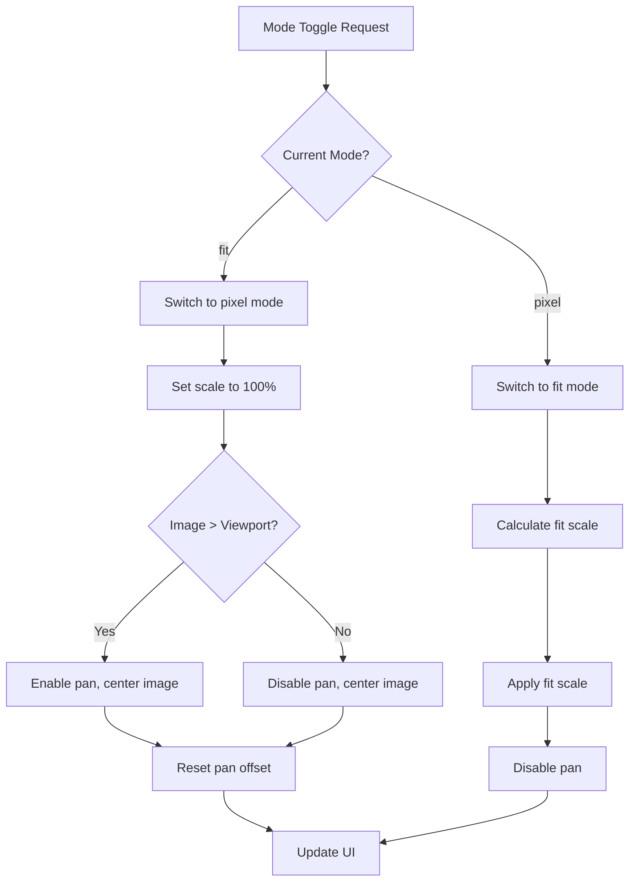

# Feature: Simple Image Viewer

## Overview

Simplify the ImageViewer zoom functionality by replacing the current multi-level zoom system (25%-400% with incremental controls) with a straightforward two-mode display: "Pixel Perfect" (100%) and "Fit to Window". This reduces complexity while maintaining the essential functionality users need.

## Objectives

- Remove incremental zoom controls (+/- keys, mouse wheel zoom, zoom in/out buttons)
- Implement two display modes: Pixel Perfect (100%) and Fit to Window
- Maintain existing drag pan functionality for large images
- Simplify the UI and codebase

## User Stories

### US1: View Image at Pixel Perfect Scale
As a terminal user, I want to see images at their original pixel resolution (100%), so that I can see exact pixel details.

**Acceptance Criteria:**
- [ ] Image displays at exactly 100% scale (1 image pixel = 1 screen pixel)
- [ ] Image is centered in the viewport
- [ ] If image is larger than viewport, only the center portion is visible initially

### US2: View Entire Image
As a terminal user, I want to fit the entire image within my window, so that I can see the complete image at once.

**Acceptance Criteria:**
- [ ] Entire image is visible within the viewport
- [ ] Aspect ratio is preserved
- [ ] Image is centered with appropriate margins (95% viewport usage)
- [ ] Small images are not upscaled beyond 100%

### US3: Toggle Between Display Modes
As a terminal user, I want to quickly switch between pixel perfect and fit-to-window modes, so that I can choose the best view for my needs.

**Acceptance Criteria:**
- [ ] Mode can be toggled via UI button
- [ ] Mode can be toggled via keyboard shortcut
- [ ] Current mode is clearly indicated in the UI
- [ ] Transition between modes is smooth

### US4: Pan Large Images
As a terminal user, I want to drag large images to see different parts, so that I can explore the entire image when viewing at 100%.

**Acceptance Criteria:**
- [ ] Mouse drag pans the image when it exceeds viewport size
- [ ] Cursor changes to "grab" when pan is available
- [ ] Cursor changes to "grabbing" while dragging
- [ ] Pan is disabled when image fits within viewport

## Technical Requirements

### Functional Requirements
- **FR1:** Initial display mode is Pixel Perfect (100%)
- **FR2:** Two display modes only: Pixel Perfect (100%) and Fit to Window
- **FR3:** Mode toggle available via both UI button and keyboard
- **FR4:** Drag pan maintained for images exceeding viewport
- **FR5:** All incremental zoom functionality removed (+/-, wheel, zoom buttons)
- **FR6:** Close functionality maintained (Escape key and close button)

### Non-Functional Requirements
- **NFR1 - Performance:** Mode switch renders within 100ms
- **NFR2 - Performance:** Drag pan maintains 60fps smoothness
- **NFR3 - Maintainability:** Reduced code complexity in zoom-related components
- **NFR4 - Compatibility:** No impact on MarkdownViewer's zoom functionality

## Implementation Approach

### Architecture

**Component Overview:**
```
┌─────────────────────────────────────────────────────┐
│                    ImageViewer                       │
├─────────────────────────────────────────────────────┤
│  ┌─────────────────┐    ┌────────────────────────┐  │
│  │ DisplayModeController │  │   PanController       │  │
│  │ (new - simplified)    │  │   (existing)          │  │
│  └─────────────────┘    └────────────────────────┘  │
├─────────────────────────────────────────────────────┤
│                  Canvas Element                      │
└─────────────────────────────────────────────────────┘
```

**Decision Point:** Two implementation approaches are possible:

1. **Option A: Modify ZoomController** - Add a "simple mode" flag to ZoomController that disables incremental zoom and enables two-mode toggle.

2. **Option B: Replace with DisplayModeController** - Create a new, simpler controller specifically for ImageViewer, leaving ZoomController unchanged for MarkdownViewer.

**Recommended:** Option B - Cleaner separation of concerns and no risk of affecting MarkdownViewer.

### Display Mode State

```typescript
type DisplayMode = 'pixel' | 'fit';

interface DisplayModeState {
  mode: DisplayMode;
  scale: number;        // Current scale (1.0 = 100%, fit mode may be < 1.0)
  fitScale: number;     // Calculated based on viewport/image ratio (1.0 = 100%)
}
// Note: Pixel perfect mode always uses scale = 1.0 (100%)
```

### Mode Toggle Logic



### Keyboard Shortcuts

| Key | Action |
|-----|--------|
| `f` | Toggle between Pixel Perfect and Fit modes |
| `1` | Switch to Pixel Perfect (100%) mode |
| `0` | Switch to Fit mode |
| `Escape` | Close viewer |

Note: All other keys are blocked from reaching the shell while viewer is open.

### UI Design

**Mode Bar (replaces Zoom Bar):**
```
┌─────────────────────────────────┐
│  [100%] ◄► [Fit]                │  <- Toggle button shows both options
└─────────────────────────────────┘
Position: Fixed, bottom-right corner
```

Alternative design:
```
┌─────────────────────────────────┐
│  100% | Toggle (F)              │  <- Shows current mode, toggle hint
└─────────────────────────────────┘
```

**CSS Classes:**
- `.viewer-mode-bar` - Container for mode controls
- `.viewer-mode-button` - Mode toggle button
- `.viewer-mode-label` - Current mode display

### File Structure

```
src/
├── image-viewer/
│   ├── index.ts              # ImageViewer (modify)
│   ├── pan-controller.ts     # PanController (keep as-is)
│   └── display-mode.ts       # NEW: DisplayModeController
├── shared/
│   ├── zoom-controller.ts    # Keep for MarkdownViewer (no changes)
│   └── zoom-styles.ts        # Keep for MarkdownViewer (no changes)
```

### API Changes

**ImageViewer.show() - No changes to public API**

**Internal State Changes:**
```typescript
// Remove:
- zoomController: ZoomController
- currentScaleX, currentScaleY (replaced by simpler scale)
- fitLevel (renamed to fitScale in DisplayModeController)

// Add:
- displayModeController: DisplayModeController
- displayMode: 'pixel' | 'fit'
```

### Dependencies

**Internal Dependencies:**
- PanController: Maintained, receives enable/disable signals based on mode
- Canvas: Transform applied via simpler scale calculation

**External Dependencies:**
- None new

## Test Scenarios

### Unit Tests
- [ ] `calculateFitScale()` returns correct scale for various image/viewport combinations
- [ ] `calculateFitScale()` never returns > 100 for small images
- [ ] `calculateFitScale()` clamps to minimum zoom for very large images
- [ ] Mode toggle switches between 'pixel' and 'fit' correctly
- [ ] Pan is enabled only when image > viewport in pixel mode
- [ ] Pan is always disabled in fit mode

### Integration Tests
- [ ] Initial display is at 100% (pixel perfect)
- [ ] Clicking mode button toggles display mode
- [ ] Pressing 'f' key toggles display mode
- [ ] Pressing '1' key switches to pixel mode
- [ ] Pressing '0' key switches to fit mode
- [ ] Drag pan works in pixel mode for large images
- [ ] Drag pan is disabled in fit mode
- [ ] +/- keys do not affect zoom
- [ ] Mouse wheel does not affect zoom
- [ ] Escape closes viewer
- [ ] Close button closes viewer

### Edge Cases
- [ ] Image exactly same size as viewport: Both modes should look identical
- [ ] Very small image (< 100px): Should display at 100%, not upscaled in fit mode
- [ ] Very large image (> 10000px): Should handle without performance issues
- [ ] Window resize: Fit scale should recalculate, pixel scale unchanged
- [ ] Animated images (GIF/APNG): Mode toggle should work during animation

### Removed Functionality Tests
- [ ] Verify +/- keys have no effect
- [ ] Verify Ctrl+wheel has no effect
- [ ] Verify zoom in/out buttons don't exist
- [ ] Verify intermediate zoom levels (e.g., 150%) are not accessible

## Security Considerations

- **Input Validation:** Existing validation maintained for image data
- **XSS Prevention:** No change to existing protections
- **Resource Management:** Existing ImageBitmap cleanup maintained

## Error Handling

### Error Scenarios

| Scenario | Handling |
|----------|----------|
| Invalid image dimensions | Return 100% scale as fallback |
| Zero viewport size | Return minimum scale |
| Canvas context failure | Existing error display maintained |

## Performance Optimization

### Performance Goals
- Mode switch: < 100ms
- Pan during drag: 60fps

### Optimization Strategies
- Single scale value instead of separate X/Y scales (when aspect ratio issues are resolved)
- Throttled resize handler (existing)
- No zoom level interpolation needed (instant mode switch)

## Success Criteria

- [ ] All functional requirements implemented
- [ ] All unit and integration tests pass
- [ ] +/- keys and wheel zoom confirmed non-functional
- [ ] MarkdownViewer zoom functionality unaffected
- [ ] Code reduction achieved (removed zoom increment logic)
- [ ] UI simplified to mode toggle only
- [ ] Documentation updated

## Open Questions

- [ ] Exact keyboard shortcut key for mode toggle (proposed: `f`, `1`, `0`)
- [ ] UI design preference: Single toggle button vs separate mode buttons

## Implementation Phases

### Phase 1: Core Functionality
**Goals:** Implement basic two-mode display
**Deliverables:**
- DisplayModeController with pixel/fit modes
- Mode toggle via internal method
- Integration with ImageViewer
- PanController enable/disable based on mode

### Phase 2: UI and Keyboard
**Goals:** Add user controls
**Deliverables:**
- Mode toggle button in UI
- Keyboard shortcuts
- Mode indicator display
- Remove zoom in/out buttons

### Phase 3: Cleanup and Testing
**Goals:** Remove old code, ensure quality
**Deliverables:**
- Remove incremental zoom code from ImageViewer
- Add comprehensive tests
- Update documentation
- Verify MarkdownViewer unaffected

## References

- Existing implementation: `src/image-viewer/index.ts`
- Existing zoom controller: `src/shared/zoom-controller.ts`
- Pan controller: `src/image-viewer/pan-controller.ts`
- Requirements document: `doc/tasks/simple-image-viewer/要件定義書.md`
