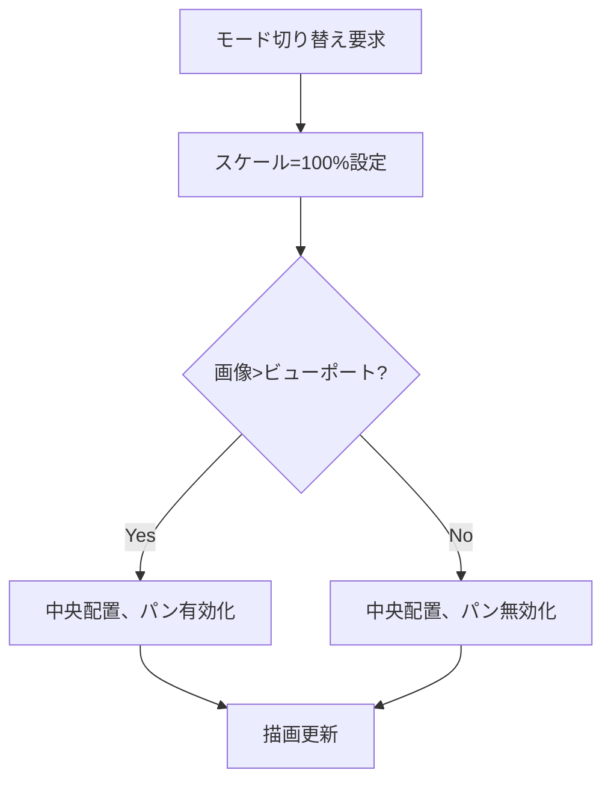
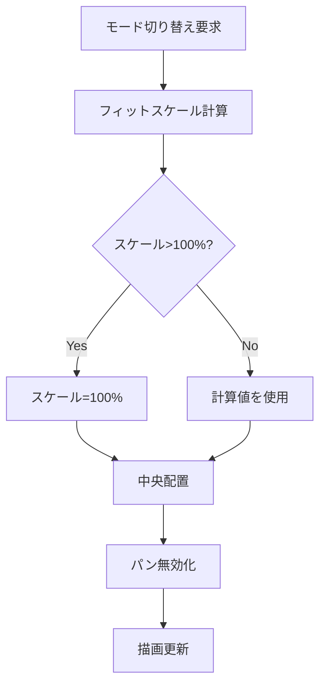

# 画像表示ビューアーシンプル化 - 要件定義書

## 1. 概要

### 1.1 背景
現在の画像ビューアー（ImageViewer）は、細かなズーム操作（+/-キー、マウスホイール、25%〜400%の段階的ズーム）を実装しているが、実際のユースケースでは「ピクセル等倍表示」と「ウィンドウに収まるサイズ」の2つの表示モードがあれば十分である。過剰な機能は操作の複雑さを増し、コードの保守性を低下させている。

### 1.2 目的
画像ビューアーのズーム機能をシンプル化し、「ピクセル等倍」と「ウィンドウに合わせる」の2モードのみに限定する。これにより、ユーザー体験の向上とコードの簡素化を実現する。

### 1.3 スコープ
- 対象: ImageViewer（src/image-viewer/）およびZoomController（src/shared/zoom-controller.ts）の画像ビューア向け機能
- 対象外: MarkdownViewerで使用されるZoomController機能（既存の細かなズーム機能が必要な場合は維持）

## 2. ビジネス要件

### 2.1 ビジネス目標
- ユーザー体験の向上：直感的で迷いのない操作
- コードの簡素化：保守性の向上と将来の機能追加の容易化
- パフォーマンス向上：不要な処理の削減

### 2.2 対象ユーザー
| ユーザータイプ | 説明 |
|----------------|------|
| ターミナルユーザー | eMtermを使用して画像を閲覧するユーザー |
| 開発者 | 画像表示コマンド（emterm image）を利用するユーザー |

### 2.3 期待される効果
- 操作の簡素化により学習コストが低減
- 2モード切り替えによる素早い表示調整
- コードベースの削減によるバグリスクの低減

## 3. ユースケース

### 3.1 ユースケース一覧
| ID | ユースケース名 | アクター | 優先度 |
|----|----------------|----------|--------|
| UC01 | ピクセル等倍表示 | ユーザー | 高 |
| UC02 | ウィンドウに合わせて表示 | ユーザー | 高 |
| UC03 | モード切り替え（ボタン） | ユーザー | 高 |
| UC04 | モード切り替え（キーボード） | ユーザー | 高 |
| UC05 | 画像のドラッグパン | ユーザー | 高 |
| UC06 | ビューアーを閉じる | ユーザー | 高 |

### 3.2 ユースケース詳細

#### UC01: ピクセル等倍表示

**アクター**: ユーザー

**事前条件**:
- 画像ビューアーが開いている

**基本フロー**:
1. 画像が100%（ピクセル等倍）で表示される
2. 画像がビューポートより大きい場合、中央部分が表示される
3. 画像の1ピクセルが画面の1ピクセルに対応する

**事後条件**:
- 画像がピクセル等倍で表示されている

#### UC02: ウィンドウに合わせて表示

**アクター**: ユーザー

**事前条件**:
- 画像ビューアーが開いている

**基本フロー**:
1. 画像がビューポートに収まるサイズで表示される
2. アスペクト比は維持される
3. 画像全体が見える状態になる

**事後条件**:
- 画像がウィンドウ内に収まっている

#### UC03: モード切り替え（ボタン）

**アクター**: ユーザー

**事前条件**:
- 画像ビューアーが開いている

**基本フロー**:
1. ユーザーがUIボタンをクリックする
2. 表示モードが切り替わる（ピクセル等倍 ↔ ウィンドウに合わせる）
3. 画像が新しいモードで再描画される

**事後条件**:
- 表示モードが切り替わっている

#### UC04: モード切り替え（キーボード）

**アクター**: ユーザー

**事前条件**:
- 画像ビューアーが開いている

**基本フロー**:
1. ユーザーが指定のキーを押す
2. 表示モードが切り替わる
3. 画像が新しいモードで再描画される

**事後条件**:
- 表示モードが切り替わっている

#### UC05: 画像のドラッグパン

**アクター**: ユーザー

**事前条件**:
- 画像ビューアーが開いている
- 画像がビューポートより大きい（ピクセル等倍モードで大きな画像の場合）

**基本フロー**:
1. ユーザーが画像上でマウスをドラッグする
2. 画像が移動し、別の部分が見える
3. ドラッグを離すと位置が確定する

**代替フロー**:
- 画像がビューポートより小さい場合、ドラッグは無効

**事後条件**:
- 画像が新しい位置で表示されている

#### UC06: ビューアーを閉じる

**アクター**: ユーザー

**事前条件**:
- 画像ビューアーが開いている

**基本フロー**:
1. ユーザーがEscapeキーまたは閉じるボタンをクリック
2. ビューアーが閉じる
3. フォーカスがターミナルに戻る

**事後条件**:
- ビューアーが非表示になっている

## 4. 機能要件

### 4.1 機能一覧
| ID | 機能名 | 説明 | 優先度 |
|----|--------|------|--------|
| F01 | 初期表示モード | ピクセル等倍（100%）で初期表示 | 高 |
| F02 | ピクセル等倍モード | 画像を100%スケールで表示 | 高 |
| F03 | ウィンドウ適合モード | 画像をビューポートに収まるスケールで表示 | 高 |
| F04 | モード切り替えUI | ボタンによるモード切り替え | 高 |
| F05 | モード切り替えキーボード | キーによるモード切り替え | 高 |
| F06 | ドラッグパン | マウスドラッグによる画像移動 | 高 |
| F07 | 閉じる機能 | Escape/ボタンでビューアーを閉じる | 高 |
| F08 | ズーム機能の削除 | +/-キー、ホイールズーム機能の削除 | 高 |

### 4.2 機能詳細

#### F01: 初期表示モード

**説明**: 画像ビューアーを開いたとき、ピクセル等倍（100%）で表示する。

**入力**:
- image: DecodedImage - 表示する画像データ

**出力**:
- 100%スケールで表示された画像

**ビジネスルール**:
- 常に100%（ピクセル等倍）で開始する
- 画像がビューポートより大きい場合は中央に配置

#### F02: ピクセル等倍モード

**説明**: 画像を元の解像度（100%）で表示する。

**処理フロー**:

**ビジネスルール**:
- スケール: 100%固定
- 画像がビューポートより大きい場合、ドラッグパンを有効化
- カーソル: パン可能時は`grab`、ドラッグ中は`grabbing`

#### F03: ウィンドウ適合モード

**説明**: 画像がビューポートに収まるようにスケールを調整して表示する。

**処理フロー**:

**ビジネスルール**:
- アスペクト比を維持
- ビューポートの95%を使用（マージンを確保）
- スケールは100%を超えない（小さい画像は拡大しない）
- パンは常に無効（画像全体が見えるため不要）

#### F04: モード切り替えUI

**説明**: ボタンクリックで表示モードを切り替える。

**入力**:
- ボタンクリックイベント

**出力**:
- 表示モードの切り替え

**UI設計**:
- ズームバーを簡素化し、モード切り替えボタンを配置
- 現在のモードを視覚的に表示（例: "100%" / "Fit"）
- 位置: 右下固定

#### F05: モード切り替えキーボード

**説明**: キーボードショートカットで表示モードを切り替える。

**入力**:
- キーボードイベント

**処理内容**:
- 特定のキーでモード切り替え
- 候補: `f` (fit/full toggle)、`1` (100%)、`0` (fit)

**ビジネスルール**:
- ビューアーが開いているときのみ有効
- 他のキー入力はブロック（シェルに渡さない）

#### F06: ドラッグパン

**説明**: マウスドラッグで画像を移動する。既存のPanControllerを維持。

**入力**:
- マウスドラウンイベント
- マウスムーブイベント
- マウスアップイベント

**処理内容**:
- ドラッグ開始: 開始位置を記録
- ドラッグ中: オフセットを更新
- ドラッグ終了: 位置を確定

**ビジネスルール**:
- ピクセル等倍モードで画像がビューポートより大きい場合のみ有効
- ウィンドウ適合モードでは無効
- 画像がビューポート内に収まっている場合は無効

#### F07: 閉じる機能

**説明**: ビューアーを閉じる機能。既存機能を維持。

**入力**:
- Escapeキー
- 閉じるボタンクリック

**出力**:
- ビューアーが閉じる

#### F08: ズーム機能の削除

**説明**: 既存の細かなズーム機能を削除する。

**削除対象**:
- +/-キーによるズーム操作
- マウスホイール（Ctrl+ホイール）によるズーム操作
- ズームイン/アウトボタン
- 25%〜400%の段階的ズーム

**保持対象**:
- モード表示（パーセンテージまたはラベル）
- 閉じるボタン
- ドラッグパン機能

## 5. 非機能要件

### 5.1 パフォーマンス要件
- モード切り替え: 100ms以内にレンダリング完了
- ドラッグパン: 60fps以上の滑らかさを維持
- 画像読み込み: 既存の性能を維持

### 5.2 セキュリティ要件
- 既存のXSS保護を維持
- 画像データのサニタイズを維持

### 5.3 可用性要件
- 既存の安定性を維持
- エラー時の適切なフォールバック

### 5.4 保守性要件
- コード量の削減（ZoomControllerの簡素化またはImageViewer専用実装）
- 明確なモード管理ロジック
- テストの追加/更新

### 5.5 互換性要件
- MarkdownViewerへの影響を最小化
- 既存のAPIインターフェースを維持

## 6. UI/UX要件

### 6.1 画面設計要件
- ズームバーをモード切り替えバーに変更
- 表示: 現在のモード（"100%" / "Fit"）
- ボタン: モード切り替えトグル
- 閉じるボタン: 維持

### 6.2 操作性
- ワンクリック/ワンキーでモード切り替え
- 直感的なUI配置
- 現在のモードが一目で分かる

### 6.3 視覚フィードバック
- モード切り替え時のスムーズなトランジション
- パン可能時のカーソル変化

## 7. データ要件

### 7.1 状態管理

| 状態 | 型 | 説明 |
|------|-----|------|
| displayMode | 'pixel' \| 'fit' | 現在の表示モード |
| currentScale | number | 現在のスケール値（%） |
| panOffset | { x: number, y: number } | パンオフセット |
| canPan | boolean | パン可能フラグ |

## 8. 外部連携

### 8.1 連携コンポーネント
| コンポーネント | 連携方法 | データ |
|------------|----------|--------|
| ZoomController | 依存/置換 | 表示モード、閉じるイベント |
| PanController | 維持 | パンオフセット |
| ターミナル | イベント | キーボード入力ブロック |

## 9. 制約条件

### 9.1 技術的制約
- ZoomControllerはMarkdownViewerでも使用されているため、共有コンポーネントの変更には注意が必要
- 既存のPanController実装を維持する

### 9.2 ビジネス上の制約
- 既存ユーザーの操作習慣への配慮（急激なUI変更を避ける）

## 10. 想定される課題とリスク

### 10.1 技術的課題
| 課題 | 影響度 | 対応策 |
|------|--------|--------|
| ZoomControllerの共有 | 中 | ImageViewer専用の簡易版を作成、または条件分岐で対応 |
| キーボードショートカットの競合 | 低 | 既存のキーマッピングを調査して決定 |

### 10.2 ビジネスリスク
| リスク | 発生確率 | 影響度 | 対応策 |
|--------|----------|--------|--------|
| ユーザーの混乱 | 低 | 低 | ドキュメントの更新、UIヒントの追加 |

## 11. 成功基準

### 11.1 受け入れ基準
- [ ] 画像ビューアーが100%（ピクセル等倍）で初期表示される
- [ ] ピクセル等倍モードとウィンドウ適合モードの切り替えが動作する
- [ ] ボタンとキーボードの両方でモード切り替えが可能
- [ ] ドラッグパンが維持されている
- [ ] +/-キー、ホイールズームが無効化されている
- [ ] Escape/閉じるボタンでビューアーが閉じる
- [ ] 既存のテストが通過する
- [ ] 新しいモード切り替えのテストが追加されている

### 11.2 KPI
| 指標 | 目標値 | 測定方法 |
|------|--------|----------|
| コード行数削減 | 10%以上削減 | ZoomController関連コードの行数比較 |
| モード切り替え操作数 | 1回 | ボタン/キー1回で切り替え完了 |

## 12. テストシナリオ

### 12.1 テスト観点
- [ ] 正常系: ピクセル等倍表示が正しく動作する
- [ ] 正常系: ウィンドウ適合表示が正しく動作する
- [ ] 正常系: ボタンでモード切り替えが動作する
- [ ] 正常系: キーボードでモード切り替えが動作する
- [ ] 正常系: ドラッグパンが動作する（大きな画像、ピクセル等倍時）
- [ ] 異常系: 無効なキー入力がシェルに渡らない
- [ ] 境界値: ビューポートと同じサイズの画像
- [ ] 境界値: 極端に小さい/大きい画像
- [ ] パフォーマンス: モード切り替えが100ms以内

## 13. 用語定義

| 用語 | 定義 |
|------|------|
| ピクセル等倍 | 画像の1ピクセルが画面の1ピクセルに対応する表示（100%） |
| ウィンドウ適合（Fit） | 画像全体がビューポートに収まるようにスケールを調整した表示 |
| フィットレベル | ウィンドウ適合時の計算されたスケール値 |
| パン | マウスドラッグによる画像の移動操作 |
| ビューポート | 画像が表示される画面領域 |

## 14. 確認事項

### 14.1 確認済み事項

- [x] 初期表示モード: ピクセル等倍（100%）
- [x] 表示モード: 「ピクセル等倍」と「ウィンドウに合わせる」の2つのみ
- [x] ドラッグパン: 維持
- [x] 細かなズーム操作: +/-キー、ホイールズームは完全削除
- [x] モード切り替え操作: ボタンとキーボードの両方で操作可能

### 14.2 未確認・保留事項
- [ ] モード切り替えのキーボードショートカット具体的なキー

## 15. 参考資料

- 既存実装: src/image-viewer/index.ts
- 既存実装: src/shared/zoom-controller.ts
- 既存実装: src/image-viewer/pan-controller.ts
